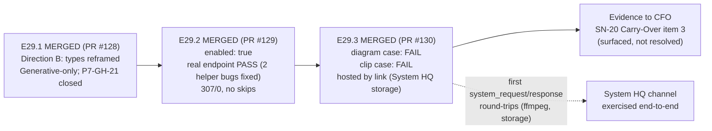

# MILESTONE CLOSURE DECLARATION — M29

Milestone **P8-M29 — Visual Artifacts Activation** is hereby declared **COMPLETE (awaiting
consolidation)**. All three epics have been executed, independently re-verified by this
Milestone Chat (diff review, live re-run of the suite, byte-level comparison of hosted
artifacts against the judged renders — not Delivery Notices trusted on faith), accepted under
PSG §11.6, and merged to `milestone/M29` with explicit human merge authorization for each
(SN-19/§11.6). Full test suite is green on consolidated `milestone/M29`: **307 passed, 0
skipped** (`pytest`), plus the orchestrator's embedded suite (**18 tests, OK**) — with
`test_helper_generates_against_endpoint` executing as a **real pass against the live ComfyUI
endpoint**, not a skip (Hard Constraint met).

**M29 is the sole and final planned P8 milestone (`is_final_milestone: true`).** Per the
Milestone spec and the M29 Execution Chat Starter, this declaration is what triggers the Phase
Chat's phase-delivery sequence: consolidation PR `milestone/M29 → phase/P8` (opened alongside
this declaration), then `phase/P8 → master` via the PSG §5C canonical closure sequence. There
is no further P8 milestone to plan.

## Completion Verification

✅ **E29.1 — Naming-collision resolution, P7-GH-21 (merged PR #128, `5211324`).** Direction
(B) chosen — reframe, not rename: `visual_artifacts.types` documented as exclusively
Generative (ComfyUI) categories across all four named surfaces (`ai-project-yml-spec.md` §3.5
v2.3.1 + changelog, `bin/ai-project-visual` docstring, `.ai-project.yml` comment,
`VISUAL-ARTIFACTS.md` config example); Structural mode (Mermaid/PlantUML) explicitly needs no
`visual_artifacts` config at all. Direction (A)'s unscoped blast radius (orchestrator enum +
two test modules) was correctly avoided. Independently re-verified: full diff read; all four
surfaces agree; suite 306/1 at merge time. **P7-GH-21 closed.**

✅ **E29.2 — Enable + real endpoint test (merged PR #129, `41e30a5`).** This repo's own
`visual_artifacts.enabled` flipped `false` → `true` — the trade every prior milestone
(P5-M22, P7-M27) deferred. Proving the first-ever real call surfaced and fixed two genuine
helper bugs no prior milestone could have hit (stale default checkpoint not on the server;
fixed-seed full-graph-cache returning empty outputs — default seed now randomized, explicit
`--seed` honored). No-live-endpoint contributor path: opt-**out** env var
(`AI_PROJECT_SKIP_LIVE_ENDPOINT_TESTS`); default still runs and requires the endpoint.
Structural-mode independence from the `enabled` flag confirmed on record (AOG §16.3/§16.8).
Independently re-verified: endpoint test run live (real PASS, not skip); suite 307/0.

✅ **E29.3 — Precision validation (merged PR #130, `df2ec9d`; one governed rework cycle).**
This project's first two real generated-and-hosted artifacts, judged against "could a reader
unfamiliar with the underlying flow follow it from the artifact alone?":

- **Diagram case (FLUX-schnell): FAIL** — drops one of three boxes, garbles title/labels
  ("M229"/"221"/"2223").
- **Clip case (LTX-Video): FAIL** — no legible text, no visible disabled→enabled transition,
  resolves into an illegible glowing shape.

Findings independently re-verified by this Milestone Chat against the actual renders
(frame-by-frame for the clip) before acceptance. First delivery was honestly flagged
not-clean (hosting blocked); resolved via the machine's first-ever `system_request`/
`system_response` round-trips (ffmpeg install; storage backend provisioned by System HQ at
`/home/panchew/.ai-project/storage/`), a mid-flight Epic-spec amendment (`73ffe6a`), and a
scoped rework completing hosting + both `Level: Epic` §7 bindings. Hosted files verified
byte-identical to the judged renders. No binaries committed anywhere.

## Milestone Definition of Done — all items satisfied

- ✅ E29.1, E29.2, E29.3 each meet their Definition of Done (verified per-epic above)
- ✅ All three epic branches merged to `milestone/M29` (PRs #128/#129/#130)
- ✅ Naming collision resolved across all four named surfaces (E29.1)
- ✅ `visual_artifacts.enabled: true` with `test_helper_generates_against_endpoint` passing
  for real against the live endpoint (E29.2; re-verified on consolidated branch)
- ✅ Diagram-style and clip-style artifacts produced and judged, findings documented for the
  CFO (E29.3)
- ✅ Full suite passes on `milestone/M29` with **no new skips** (307 passed, 0 skipped —
  Hard Constraint; the suite previously carried 1 skip, now zero: the former skip *is* the
  endpoint test, now a real pass)
- ✅ Milestone Closure Declaration produced with `is_final_milestone: true` (this artifact)

## Milestone Acceptance Criteria — all satisfied

1. ✅ yml-spec §3.5 no longer describes any `types` value as "Mermaid/PlantUML structural";
   all four surfaces agree (E29.1)
2. ✅ `enabled: true`, no stale opt-out comment, endpoint test runs as a real pass (E29.2)
3. ✅ Diagram-style and clip-style artifacts exist by link (never committed), each with a
   documented precision judgment, surfaced to the CFO as evidence for SN-20 Carry-Over
   item 3 (E29.3)
4. ✅ Suite green at delivery, no regressions, no new skips (all epics)

## Headline Finding for the CFO (evidence, not a decision — SN-20 Carry-Over item 3)

**Both precision cases FAILED.** "Renders without error" (P6) and "precise enough to explain
something technical" (M29) are materially different bars, and the gap did not close by
default — these are the base workflows' out-of-the-box results, with no text-compositing,
ControlNet, or typography-overlay engineering attempted (correctly out of M29 scope). Whether
closing that gap warrants a separate governed ComfyUI-workflow project, versus treating
Generative mode as suited to its original non-technical use case (concept/vision imagery)
while Structural mode carries technical explanation, **remains the CFO's decision**. The
evidence is now real, hosted, and linked — not hypothetical.

## Carry-Forwards for the Phase Chat

- **P8-GH-1 — Stale governance prose about this repo's opt-out.** AOG §16.5's source-repo
  sentence ("It stays opted out because... a live endpoint the suite doesn't have"),
  `governance/guides/visual-artifacts.md` §1's note + §6 ("skips when enabled is false"), and
  any sibling remnant now contradict the E29.2 reality (enabled, real endpoint pass, opt-out
  env var). Flagged by E29.2's Delivery Notice; CFO chose to handle separately from M29's
  epics ("decide later"). Natural candidate for the P8 phase-delivery reconciliation or a
  P9-scoping item.
- **P8-GH-2 — Machine-local hosting limitation.** The provisioned storage backend is local
  (`file://` links resolve only on this machine; dead on GitHub). Accepted by CFO ruling for
  now; revisit only if cloud hosting is ever actually needed.
- **SN-20 Carry-Over item 3** — now unblocked with real evidence (above); belongs to the CFO
  at Creation/HQ level.
- **Observation, no action owed by P8:** GitHub issues #131 (System HQ Opener) and #132
  (hybrid model routing in manual workflows) were filed from System HQ sessions during M29's
  window — framework-evolution proposals routed via steering notes to HQ/Creation Chat,
  explicitly out of M29/P8 scope.

## Visual Bindings

**Visual binding**
- **Link:** (inline — Structural diagram; no hosted link needed per AOG §16.3/§16.5)
- **What:** diagram
- **Level:** Milestone
- **State:** implemented

- **Description:** M29 as actually delivered — the implemented-track pairing of the Milestone
  spec's proposed-track diagram: naming reframed (not renamed), the capability enabled with a
  real live-endpoint pass replacing the suite's last skip, and both precision cases honestly
  judged FAIL, hosted via the machine's first System HQ storage provision.

**Visual binding**
- **Link:** `file:///home/panchew/.ai-project/storage/ai-project-system/visuals/P8-M29/E29.3-diagram-case-flux.png`
- **What:** diagram
- **Level:** Milestone
- **State:** implemented
- **Description:** The Milestone spec's anticipated implemented-track Generative visual —
  E29.3's FLUX-schnell render of M29's three-epic sequence. Judged **FAIL** against the
  technical-explanation bar; bound here at Milestone level per the spec's own pairing intent,
  with the failure itself being the milestone's headline evidentiary result. Machine-local
  `file://` link per the CFO's local-storage ruling.

## Consolidation

Consolidation PR `milestone/M29 → phase/P8` is opened alongside this declaration. Upon its
merge (human-authorized), the Phase Chat proceeds directly to **phase delivery**
(`phase/P8 → master`, PSG §5C: README update + version bump + tag + phase-closure
declaration + P8 Phase Delivery Notice) — M29 is the only P8 milestone; there is nothing
further to plan at milestone level.

---
**Declared by the Milestone Chat (P8-M29) per PSG §11.6 / SN-19; consolidation merge and all
subsequent phase-delivery steps await their own human authorizations.**
