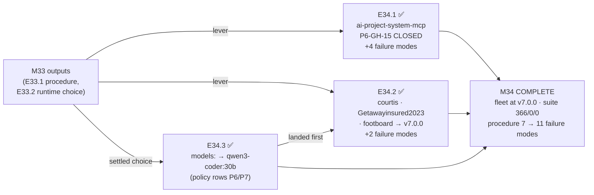

# MILESTONE CLOSURE DECLARATION — M34

Milestone **P10-M34 — Fleet Roll-forward** is hereby declared **COMPLETE (awaiting
consolidation)**. Three epics — E34.3, E34.1, and E34.2 — have been executed, **independently
verified by this Milestone Chat**, accepted under PSG §11.6 default-accept, and merged to
`milestone/M34` with explicit human merge authorization for each (SN-19 / §11.6).

**What "independently verified" meant here.** Not Delivery Notices trusted on faith: for every
epic this chat re-ran the full suite on a clean worktree built from the epic branch, read the diff,
and — for the cross-repo epics — **verified the claims inside the target repositories themselves**
(agent checksums, submodule pins, `.gitmodules` contents, stamps, and `git status --porcelain` to
confirm each owner's uncommitted work survived). Two Delivery Notice claims were checked against
primary sources and one **spec** claim was found wrong (below).

Full suite green on `milestone/M34` @ `15ddd29`: **366 passed, 0 failed, 0 skipped** — no
regressions and no new skips against the 366 baseline.

**M34 is the second P10 milestone and not the last (`is_final_milestone: false`).** **M35
(System-Operator Canonization)** remains — independent, schedulable at the Phase Chat's discretion,
and now form-neutral per SN-24 / the phase spec v1.1.0 amendment. This declaration triggers Phase
Chat consolidation of `milestone/M34 → phase/P10`; it does **not** trigger phase closure.

---

## Completion Verification

| Milestone DoD item | Status | Evidence |
|---|---|---|
| E34.1, E34.2, E34.3 each meet their own DoD | ✅ | Verified per epic at Stage 2 |
| All three epic branches merged to `milestone/M34` | ✅ | `aa6cf12` (E34.3), `bf70841` (E34.1), `15ddd29` (E34.2) |
| `ai-project-system-mcp` carries canonical `governance.agent.md` (no `hq.agent.md`), pinned to v7.0.0, stamped — **P6-GH-15 closed in the wild** | ✅ | Verified in the target repo: `agents/` holds `governance.agent.md` alone; `framework_version: v7.0.0` |
| `courtis` and `Getawayinsured2023` each have a recorded roll-forward path with demonstrable movement; `footboard` roadmapped | ✅ **exceeded** | All three reached v7.0.0, not merely roadmapped |
| `.ai-project.yml` `models:` reflects E33.2's settled choice; no `qwen2.5-coder:14b` epic entry | ✅ | `epic_dev`/`epic_qa` = `local:qwen3-coder:30b`; zero `14b` occurrences in the `models:` block |
| Every fleet-state claim confirmable from committed evidence; any un-movable project a recorded blocker | ✅ | Confirmation-evidence artifacts for E34.1 and E34.2; **no blocker needed — none invented** |
| Full suite green (366 baseline, no regressions, no new skips) | ✅ | 366/0/0, re-run by this chat on the merged branch |
| Milestone Closure Declaration produced (`is_final: false`) | ✅ | This document |

All five Milestone Acceptance Criteria are met. Criterion 4's blocker clause is satisfied
vacuously — no project proved un-movable — and E34.2 explicitly declined to invent one.

**No decomposition gap this time.** M33 closed with a found-and-fixed gap (E33.4). M34's DoD was
re-verified line by line against the amended spec and the three epics cover it completely.

---

## Milestone Summary

**The fleet is at v7.0.0.** Six enrolled projects — the M33 proving pair (`home_finance`,
`local-agent-runner`) plus `ai-project-system-mcp`, `Getawayinsured2023`, `footboard`, and
`courtis` — now carry a confirmable `framework_version: v7.0.0` stamp, the canonical
`governance.agent.md`, and a tag-pinned governance corpus. **P6-GH-15, the oldest live governance
defect in the fleet, is closed in a real project.** The agentic epic lanes no longer route to a
model proven to emit exit 0 with zero work.

**The real finding of M34 is that a proven lever needs a documented adaptation per project.**
E33.1's bump procedure entered M34 with 7 failure modes, validated on a proving pair whose two
projects shared a layout. Every subsequent application found defects the previous ones could not:

| Application | Found |
|---|---|
| E34.1 — `ai-project-system-mcp` | 4 drifts: submodule at `governance/` not `.governance/` (breaks every command verbatim); `hq.agent.md` was a **placeholder stub**, not a superseded agent; no `governance.ref` key and `version` holding a raw SHA; a **modified tracked** file in the tree. → **Step 0**, **FM8**, **FM9**, FM5/6/7 extensions |
| E34.2 — three dormant projects | `.gitmodules` declaring **two** submodules including an orphan (Step 0 correctly *halted*); and the procedure **never said what to branch from**, which on `footboard` was unreachable without touching owner work. → **FM10** (Step 0 rewritten to intersect declared paths with `git submodule status` + on-disk existence), **FM11** |

**7 → 11 failure modes.** That accumulation, not the stamps, is the durable output. Two lessons
E34.2 recorded are worth restating: *a guard that halts is doing its job, but a halt the operator
must resolve by hand is unfinished work*, and *the steps a procedure omits cost as much as the ones
it gets wrong.*

**Corrections found at Stage 2, recorded rather than smoothed over:**
- **This chat's own E34.2 spec was wrong** about `Getawayinsured2023`'s remotes: it said the only
  remote is Heroku; the project has **two**, including a GitHub `origin` under a **third-party
  account** (`StephenMelnick`). The publish caution stands and is stronger than written.
- **This chat's own E34.2 starter broke the suite.** Commit `973a7f5` was pushed without re-running
  the suite, leaving `milestone/M34` at **365/1** and handing the Epic Chat a false "expect 366/0/0"
  instruction. The Epic Chat caught it, diagnosed it correctly as a **false positive**, declined to
  edit the test, reworded the starter, and filed **P10-GH-6**. Recorded here because the process
  lesson is real: **starters are linted, so planning artifacts are code as far as the suite is
  concerned — measure, never quote a stated baseline.**

**`fieldledger-assesment` is not an omission.** It was **removed** from the fleet set by direct CFO
instruction (2026-07-29) — a screening project, never a real adoption target — via milestone spec
**Amendment A1** and phase spec **v1.2.0**. It is not deferred, not blocked, and no roll-forward
path is owed for it. That change reached this chat only because the Milestone Chat declined to
absorb a project-set edit that touched the **phase's own Acceptance Criteria**, and escalated it
(escalation notice `2026-07-29T00_00_00Z__P10-M34__escalation_notice.md`, resolved).

**All target-repo work is committed locally and unpushed** — publishing is the CFO's outward action
(cross-repo split, M33 precedent). Three publishing constraints are recorded for the CFO:
`ai-project-system-mcp` has **no git remote at all**; `footboard`'s bump sits on an in-flight branch
and needs a merge or a cherry-pick of `b00bb16` onto `main`; `courtis`'s local `origin/HEAD` points
at `origin/epic/E1.1` rather than `origin/main`.

---

## Carry-forwards to the Phase Chat

**Filed by this Milestone Chat during M34** (mechanism: milestone-level carry-forward notes — there
is no central GH registry; items live inline in artifacts):

- **P10-GH-4** — `delivery_notice.merge_details` is **structurally unfillable**: the template
  requires `merge_commit`/`merge_timestamp`, but the canonical happy path authors the notice at
  step 2 and merges at step 6. Measured repo-wide: 15 tracked notices carry the field, **1 filled,
  14 placeholders** — including all four M33 notices in a closed milestone. Settled practice, not
  drift. Four candidate directions recorded, no recommendation.
- **P10-GH-5** — `ai-project-yml-spec.md` §4's validation rules are **normative but unenforced**.
  No validator exists in `bin/`; the orchestrator validates only `visual_artifacts` and falls back
  to defaults with a warning on a parse failure, so a malformed enrolled config **degrades
  quietly**. Tell: rule 3 says "all **four** required fields" and lists **five**. At filing, 2 of 5
  enrolled projects were invalid; `social-stories-creator` later made it 3 of 6. **Not closed by
  M34** — the epics fixed instances, not the absence of enforcement.
- **P10-GH-6** — `tests/test_starter_lint.py` false-positives on real milestones:
  `known_milestones()` derives truth only from starter filenames, so M1–M8 are invisible, and it has
  no notion of *another project's* branch names. Test deliberately untouched (framework capability,
  out of scope for adoption epics).

**Restated unchanged:**
- **P10-GH-1** — `framework_version` is convention-only, not defined in the yml-spec (E33.1 FM4).
  All six fleet stamps are therefore convention-only. Schema-blessing it is a capability change.
- **P10-GH-2** (Creation Chat Seed does not implement the E31.3 verification) and **P10-GH-3**
  (policy row P1 contradicts the live config) — from the 2026-07-28 HQ Ruling, untouched by M34.
- **llama.cpp + Qwen3.6-27B-Q8_0 trial** — parked pending Mac-class ~42 GB hardware or an
  authorized loadable-quant trial. `qwen3.6:27b` at Q4_K_M exists on the host and is **not** that
  stack.
- **Residual P9-GH-2** — G9 (local input tokens unmeasured) and a general self-verification harness.
- **G11 remains open** — zero captured QA-role runs. E34.3 moved policy row P7's referent on its
  existing gap-grounded reasoning; **no QA-lane evidence was claimed or created.**

**Unresolved and explicitly not routed by M34** (raised in the escalation, left open by Amendment
A1 — both need a Steering Note or Creation Chat, not an M34 amendment):
- **`social-stories-creator`** — not added to E34.2's set; it would invert the epic's premise
  (active, already-v7.0.0, already-canonical-agent, mid-inception). Note the name the CFO used,
  `social-stories-builder`, **does not exist on disk**; the discrepancy was never resolved.
- **The inbound "personal platform"** — unnamed, unenrolled, declared highest priority. A
  phase-or-above prioritization claim against a scope SN-23 fixed.

---

## Required Action: Consolidation

To fully close this milestone, the Phase Chat must consolidate:

```
milestone/M34 → phase/P10       (consolidation PR)
```

`phase/P10` currently carries `cf94770`, which already holds the Amendment A1 / v1.2.0 spec edits;
`milestone/M34` carries the same content via `b835d9f`, verified byte-identical in outcome, so the
merge is expected to be clean.

**M35 (`milestone/M35`) MUST branch from `phase/P10` after that merge.**

Phase closure (`phase/P10 → master`) happens only after M35, via the PSG §5C canonical closure
sequence ending in the Phase Closure Declaration — which should restate the parked/deferred items
with their triggers, per the phase Acceptance Criteria.

---

## Visual Bindings

**Visual binding**
- **Link:** (inline — Structural diagram; no hosted link needed per AOG §16.3/§16.5)
- **What:** diagram
- **Level:** Milestone
- **State:** delivered



- **Description:** M34 rolled M33's proven levers across the fleet. Delivered-track Structural
  diagram (AOG §16.3/§16.6).

---

*Declared under PSG §11.6 default-accept and SN-19: epic acceptance and merge instruction were
in-chat acts, with explicit human merge authorization on every merge.*
