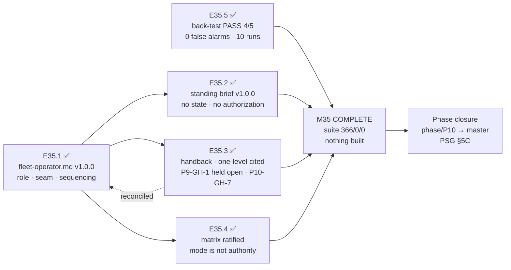

# MILESTONE CLOSURE DECLARATION — M35

Milestone **P10-M35 — System-Operator Canonization** is hereby declared **COMPLETE (awaiting
consolidation)**. Five epics — E35.1, E35.3, E35.2, E35.4, E35.5 — have been executed,
**independently verified by this Milestone Chat**, accepted under PSG §11.6 default-accept, and
merged to `milestone/M35` with explicit human merge authorization for each (SN-19 / §11.6).

Full suite green on `milestone/M35` @ `eb07b23`: **366 passed, 0 failed, 0 skipped** — no
regressions and no new skips against the 366 baseline. See **P10-GH-10** below for the one honest
qualification on what that figure proves.

**What "independently verified" meant here.** Not Delivery Notices trusted on faith. This milestone
produced governance text rather than code, so verification meant checking each claim against the
committed diff and against primary sources: hashing the System HQ Authority Boundary block across
all three files that must hold it word-for-word; grepping for enumerated fleet state that must not
exist; confirming by empty diff that PSG, AOG, `seed.md`, `model-routing-policy.md`, `.ai-project.yml`
and the phase spec were untouched where each epic promised they would be; reading both M34
escalation notices to confirm the worked examples were characterised accurately; reading the
pre-registered rubric **as committed before any run** to confirm the pass bar had not moved; and
reading `Getawayinsured2023`'s live `.ai-project.yml` directly. That last read found a **premise
error in two governing documents** — see Carry-forwards.

**M35 is P10's final milestone (`is_final_milestone: true`).** This declaration triggers Phase Chat
consolidation of `milestone/M35 → phase/P10` **and then phase closure** (`phase/P10 → master`) via
the PSG §5C canonical closure sequence.

---

## Completion Verification

✅ **All five epics complete, verified, accepted and merged:**

| Epic | Subject | Merge | Delivered surface |
|---|---|---|---|
| **E35.1** | Fleet-operator role + no-authority-on-speech seam | `5ebce92` (PR #160) | new `governance/systems/fleet-operator.md` v1.0.0; `system-hq.md` → v1.0.2; `chat-hierarchy.md` annex note |
| **E35.3** | Handback + one-level escalation + Creation Chat awareness | `8324f16` (PR #161) | `chat-hierarchy.md` §"Handback: what a blocked agentic instance owes"; `creation-chat-guide.md` §"Escalation Awareness — Visibility Only"; `templates/escalation-notice.md` applicability; `fleet-operator.md` → v1.1.0 |
| **E35.2** | Operator's standing brief | `9368313` (PR #162) | new `governance/systems/fleet-operator-brief.md` v1.0.0; `fleet-operator.md` → v1.2.0 |
| **E35.4** | Execution matrix ratification + mode-is-not-authority | `beaf8ad` (PR #163) | `chat-hierarchy.md` §"The execution matrix (ratified)" + §"Mode is not authority" |
| **E35.5** | Milestone × local-inference evidence-gathering | `eb07b23` (PR #164) | `.ai-project/artifacts/reference/local-review-backtest/` — 5 blinded packets, pre-registered rubric, 10 scored runs, scores, judgment |

✅ **Milestone Definition of Done — every item satisfied:**

- ✅ E35.1–E35.5 each meet their own Definition of Done (verified per epic at Stage 2)
- ✅ All five epic branches merged to `milestone/M35`
- ✅ The fleet-operator role, the no-authority-on-speech seam, and the standing brief are recorded,
  **form-neutral** — Drivr referenced exactly once across the corpus, as expected filler and not a
  dependency
- ✅ The handback rule and the one-level escalation rule are recorded, with **P9-GH-1 explicitly not
  closed by them**, and Creation Chat awareness recorded as visibility-only
- ✅ The execution matrix is ratified and recorded, with **mode-is-not-authority stated explicitly**
- ✅ The Milestone × local-inference back-test was conducted with a recorded pass/fail judgment
  against the five named defects
- ✅ **P10-GH-7 is recorded as a carried-forward risk, not resolved** — and lands in the same reading
  as the handback rule it qualifies
- ✅ Full suite green on `milestone/M35` (366 / 0 / 0)
- ✅ Milestone Closure Declaration produced (`is_final_milestone: true`)

✅ **Milestone Acceptance Criteria 1–6 — all met.** Criterion 4's scoping is worth restating: the
back-test judgment is **evidence for a further HQ call, not a row-P4 decision**, and E35.5's own
judgment says so in its text.

---

## Milestone Summary

M35 wrote down a role that was already being performed and had never been bounded. Through M33 and
M34 the Layer-8/CFO **was** the fleet's lane, by hand, with nothing in the corpus saying what that
role may or may never do. M35 recorded it: the three duties, the **no-authority-on-speech seam**, and
the reading that keeps "decides what runs next" from meaning "decides" (E35.1); the standing brief
that tells whatever fills the role what it needs each cycle, without rotting and without authorizing
(E35.2); the obligation that a blocked autonomous instance **must hand back**, to its immediate
parent, with the human reached by construction rather than by hope (E35.3); the ratified execution
matrix bound by **mode is not authority** (E35.4); and real evidence, not an argument, on whether a
local model can hold Stage-2 review (E35.5).

**Nothing was built.** Every deliverable is a governance record. The one epic that exercised
something — E35.5 — produced a recorded judgment, not a tool. P11 (Drivr) builds the block detector,
the mode switch, the runner→chat channel and the dispatch wiring **against these rules**, which is
why the rules had to be right before anything was built on them.

**The discipline that shaped the milestone was anti-duplication.** Three times an epic was told to
**cite rather than restate**: the one-level escalation rule (already normative in PSG §13D, AOG
§3.10 and `chat-hierarchy.md` — a fourth copy would have been a fourth thing that can drift); the
Authority Boundary (already reproduced verbatim across three files under a stated must-always-agree
invariant); and mode-is-not-authority (given a single normative home, with E35.3's in-context
statement converted to a citation). The corpus grew without gaining a contradiction.

**Two epics returned more than they were asked for, in the right direction.** E35.3 closed the
reconciliation finding by amending `fleet-operator.md` itself rather than only cross-referencing, so
the sentence that could have been misread now carries its own correction at both ends. E35.5 verified
its own harvest premise before relying on it, and reported that the premise was false.

---

## Carry-forwards to the Phase Chat

**Three new gap items, all recorded and none fixed:**

- **P10-GH-8 — `governance/systems/` versions and changelogs are inconsistent** (`53c9f32`). Five of
  fifteen documents carry a version and changelog; the most-amended and most-cited one
  (`chat-hierarchy.md`) carries neither, and M35 amended it three more times. E35.1's refusal to
  retrofit was upheld: inventing a version for a never-versioned document under a cross-reference
  edit is a corpus-wide convention change made sideways. Owner unassigned. **Trigger:** the next epic
  that amends a system-tier document and cannot state what changed since a prior known-good state.
- **P10-GH-9 — agentic parents × default-accept × P9-GH-1** (`e3d6c63`). E35.4's PSG §11.6 corollary
  was ruled to stand (§11.6's own text defines the acceptance record as *"the merge plus the in-chat
  acknowledgment"* and preserves the human-authorized merge as a gate that MUST NOT be collapsed — it
  never granted acceptance by silence decoupled from a human key). The residual: §11.6 does not name
  the agentic case in its own text, and **the matrix raised the cost of P9-GH-1 without touching it**.
  While Phase and Milestone were manual by fixed posture, a human sat at those gates *by
  construction*, and that is what compensated for the missing merge guard. Its severity rose on
  2026-07-30 while its status stayed "parked". **Trigger, and it belongs to P11:** before the first
  Phase or Milestone agentic dispatch is wired.
- **P10-GH-10 — a flaky suite test makes "full suite green" weaker evidence than it reads**
  (`d66cc7b`, filed by E35.5). `tests/test_artifact_router.py::test_daemon_extensions_error_branches`
  failed once in ten full-suite runs, passes in isolation, and failed under transient system load.
  This Milestone Chat re-ran the suite four further times without reproducing it — which neither
  confirms nor refutes a ~10% rate. Numbering verified non-colliding with P10-GH-9. Owner unassigned.

**One open escalation notice, addressed to you:**

- **`Getawayinsured2023`'s natural experiment does not exist as described** — escalation notice
  `2026-07-31T00_00_00Z__P10-M35__escalation_notice.md` (`e153167`), `status: open`. That project
  routes `phase`/`milestone` to **`remote:`**`qwen3.6:27b`, not `local:`. The **P10 phase spec §P10.3
  (v1.3.0)** says *"already pointed at a local model"*; the **M35 milestone spec** says *"already runs
  exactly this configuration"*. Both are yours; adjacency prevented this chat from editing either.

  **Per CFO instruction (2026-07-31), the correction is carried here rather than by amending the M35
  milestone spec.** Recorded correction: **no fleet project is running the Milestone level on local
  inference.** `Getawayinsured2023`'s configuration is a legitimate override on the *model/tier*
  axis — a non-frontier open-weights model where rows P3/P4 specify paid frontier — and is **silent
  on locality**. It was read only; it is not a defect and is not to be "fixed". The phase-spec side
  remains the Phase Chat's call at closure.

  **Why it matters beyond bookkeeping:** the phase spec offered the natural experiment as
  *corroborating* evidence for opening the Milestone-locality cell. There is nothing to corroborate
  with. E35.5's PASS stands on its own back-test — which did run locally, against blinded material —
  but **the evidence base for that cell is thinner than the phase spec assumed**, and HQ should weigh
  the row-P4 question knowing that.

**Restated, unchanged, and not resolved by this milestone:**

- **P10-GH-7** — block detection is untrustworthy in **both** directions (E33.2 Run A: exit 0, zero
  work; E33.4: exit 2, complete and green work), compounded by **G11** (zero captured `epic_qa`
  runs). Recorded inside `chat-hierarchy.md`'s handback section so a reader of the rule meets its
  broken dependency in the same reading. **A prerequisite for P11's mechanism, not for M35's record.**
- **P9-GH-1** — the merge-authorization hole at Milestone→Phase and Phase→HQ. **Explicitly not closed
  by the one-level escalation rule**, and named as still open inside the delivered record itself.
  Now also re-rated by P10-GH-9.
- **P10-GH-1 … P10-GH-6**, P9-GH-2 (residual G9), P9-GH-3 (unowned), and the parked items —
  competing-model review, ComfyUI precision, P8-GH-2, the llama.cpp + Qwen3.6-**Q8_0** trial — all
  carried forward on their existing triggers. The Q8_0 stack was **not** touched by E35.5, whose
  candidate was `qwen3.6:27b` at **Q4_K_M**, a different artifact.

**One judgment for HQ, not for this milestone:**

- **`model-routing-policy.md` row P4.** E35.5 recorded **PASS at 4 of 5** with **zero false alarms
  across ten runs**, and listed six counter-considerations against its own result — chief among them
  that defect 5 produced *identical diagnoses and opposite prescriptions* across two runs of the same
  prompt at the same settings, and that two runs per packet can detect variance but cannot measure
  it. A pass is **necessary evidence, not sufficient**. The cell remains *"Remote — local under
  evaluation"* until HQ says otherwise. **The result may amend row P4 independently of that row's own
  unfired revisit trigger** (HQ Ruling on SN-25, Decision 5).

---

## Required Action: Consolidation, then Phase Closure

To fully close this milestone, the Phase Chat must consolidate:

```
milestone/M35 → phase/P10       (consolidation PR #159)
```

**M35 is P10's final milestone.** On that merge, the Phase Chat proceeds directly to **phase closure**
via the PSG §5C canonical closure sequence — README, version, tag, and the **Phase Closure
Declaration**, which should restate the parked and deferred items with their triggers per the phase
Acceptance Criteria, and should carry the corrected `Getawayinsured2023` premise recorded above.

`phase/P10` currently carries `3575805`; `milestone/M35` carries `eb07b23`. No epic touched
`phase/P10` directly, so the merge is expected to be clean.

---

## Visual Bindings

**Visual binding**
- **Link:** (inline — Structural diagram; no hosted link needed per AOG §16.3/§16.5)
- **What:** diagram
- **Level:** Milestone
- **State:** delivered



- **Description:** M35's five epics — the operator's role and boundary grounding the standing brief
  and the handback record; the execution matrix ratified alongside; the local-inference back-test
  running in parallel as evidence. All five feed P10's final gate. Delivered-track Structural diagram
  (AOG §16.3/§16.6).

---

*Declared under PSG §11.6 default-accept and SN-19: epic acceptance and the merge instruction were
in-chat acts, with explicit human merge authorization on every one of the five epic PRs. No Review
Decision was issued in this milestone — all five deliveries were clean on the happy path, and the two
items flagged by epics for the parent's judgment (the `chat-hierarchy.md` versioning convention, and
the PSG §11.6 corollary) were ruled in-chat and recorded as P10-GH-8 and P10-GH-9 rather than
returned as rework.*
