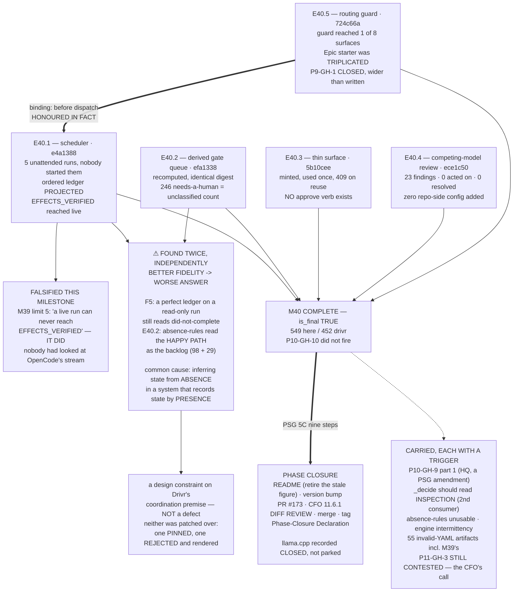

# MILESTONE CLOSURE DECLARATION — M40

Milestone **P11-M40 — Coordination: Scheduler, Derived Gate Queue, and the Thin Surface** is hereby
declared **COMPLETE (awaiting consolidation)**. Five epics — **E40.5, E40.1, E40.2, E40.4, E40.3** —
were executed, **independently re-measured by this Milestone Chat (G2)**, and merged to
`milestone/M40` with explicit human merge authorization for each (SN-19 / PSG §11.6, and §11.6.1's
CFO diff review satisfied on all five).

> **⚠ M40 IS P11's FINAL MILESTONE (`is_final_milestone: true`).** This declaration **does not hand
> back for another milestone.** On Phase Chat review and consolidation into `phase/P11`, it triggers
> the **PSG §5C nine-step phase-closure sequence** (§9). **Everything left undone here leaves the
> phase undone**, which is why §7 and §8 state every open item with its trigger.

Final verification on `milestone/M40` @ `5b10cee`:

```text
ai-project-system: PYTHONPATH=. pytest -q      (bare `pytest` fails collection)
                   549 passed                  (M39 baseline 510 + 39 from E40.5)

drivr @ f60164c0a8932635167730ae0f684f1945384020:
                   452 passed                  (M39 baseline 249 + 70 E40.1 + 38 E40.2 + 95 E40.3)
```

**`P10-GH-10` did not fire** in any full-suite run performed during this milestone, in either
repository. Nothing is withheld under its both-results obligation. **Clean runs do not disprove its
~3-in-10 rate.**

**Cross-repo access, stated because a reviewer needs it:** **`drivr` has no git remote.** *"Verify the
push at `origin`"* is performable for `ai-project-system` and **not performable for `drivr`**. A G2
reviewer must re-measure `drivr` on this machine at `f60164c`.

---

## 1. What was delivered

| Epic | Merge | PR | Disposition |
|---|---|---|---|
| **E40.5** — merge-authorization routing guard | `724c66a` | #206 | ✅ accepted by silence (SN-13) |
| **E40.1** — serialized-lane scheduler + the completion-signal decision | `e4a1388` | #207 | ✅ accepted by silence |
| **E40.2** — derived gate queue | `efa1338` | #209 | ✅ accepted by silence |
| **E40.4** — competing-model PR review | `ece1c50` | #210 | ✅ accepted by silence |
| **E40.3** — thin surface + signed one-time-link approval | `5b10cee` | #211 | ✅ accepted by silence |

**E40.5's binding position was honoured in fact, not by assertion:** it merged at `724c66a` on
2026-08-17, and E40.1 — the epic that wires dispatch, which is `P10-GH-9`'s own trigger — merged
after it at `e4a1388`, having verified the guard's 39-test suite green as its Prerequisite 2.

---

## 2. The Hard Constraint, discharged claim by claim

**M40's stated drift was declaring rather than measuring** — the last milestone has nothing after it
to defer to. Each headline claim is recorded below **with the evidence, and with what this Milestone
Chat re-measured independently rather than accepting.**

| Claim | Evidence | Re-measured by this chat |
|---|---|---|
| **The lane runs unattended** | **5 real dispatches**, no human starting any, records committed at `.ai-project/artifacts/agentic-runs/P11-M40-E40.1/` | Verdicts **re-derived from raw `stream.ndjson`** — all three main runs reproduce |
| **The queue is derived** | Rendered, `sha256`'d, deleted, recomputed, identical | Ran it: **21/10/0/246**, two runs → **same digest**, target tree **byte-identical** after derivation |
| **The link is one-time** | `200 Authorized` then `409 already-used` | **Ran the live demo end to end**: 409 / 403 bad-signature / 403 wrong-gate / 403 expired on the real clock |
| **No chat reply authorizes** | Route table, one accepted field, one mint call site | Posted a chat reply to the live surface: **`400`, "expected exactly one `t`, got 0"** |
| **Competing models hold no authority** | Copilot `COMMENTED`; 3 threads `isResolved:false` | Read **GitHub**, not the tree: no protection on 3 branches, no rulesets, no webhooks, no CODEOWNERS, `allow_auto_merge:false` |
| **The guard reaches every surface** | 8 surfaces, 39 tests | **Falsified it myself**: 1 surface → **2 failed**; all 8 → **17 failed**; restore → 549 |
| **Nothing became an engine** | No retry, no model state, no inference client | Asserted by tests in `drivr`; `bin/drivr-gate` has **no `approve` verb** |

**Two claims in the delivered notices were weaker than their headline, and both were self-reported
before this chat asked:** E40.3's `ACCEPTED_FIELDS` falsification breaks **exactly 1** test (verified —
it guards a declaration, not the enforcement), and E40.4's authority-ceiling inventory carries one
**UNVERIFIED** row — GitHub App installations cannot be enumerated with a user token. **Recorded as a
gap, not assumed clean.**

---

## 3. What this milestone falsified

**Four things believed at planning time were measured false during execution.** Each amended the
governing artifact rather than being worked around.

1. **M39's limit 5 — *"a live OpenCode run can never reach `EFFECTS_VERIFIED`"* — is FALSIFIED.**
   The ordered ledger **is** projectable: OpenCode's `--format json` stream carries `tool_use` events
   with name, arguments, result, per-call status and timing, **in order**. Run `…-39168925` reached
   `EFFECTS_VERIFIED` through E39.1's own `covering-verification` rule. **M39 was not wrong to record
   the limit** — it deliberately did not look, because nothing in M39 needed the answer. **The
   question was answerable only at OpenCode's layer**, which is why E40.1's spec §F2 forbade
   answering it from Drivr's parser.
2. **The routing guard's surface was a floor of four; it is EIGHT.** The Epic starter is
   **triplicated**, P9's guard reached **1 of 3**, and `governance/EPIC-EXECUTION-CHAT-STARTER.md` —
   which `README.md:15` designates canonical — carried an **unguarded instruction to merge**.
   `P9-GH-1`'s own text (*"past the Epic templates"*) implied Epic level was covered. It was not.
3. **E40.1's admissible directions were three; the correct answer needed a fourth.** This Milestone
   Chat added it at planning time on the §F5 measurement; E40.1 delivered **direction 1 + direction
   4's consumer half**. Neither alone was sufficient.
4. **The milestone spec's cite of the guard at "lines 72–74" names the middle of the bullet.** It
   spans **70–75**. Corrected in E40.5's spec and quoted verbatim.

---

## 4. The shape this milestone found twice, independently

**Better fidelity produced a worse answer — in two unrelated subsystems, from two unrelated causes.**

- **§F5 (E40.1, judgment layer).** A *perfectly* projected, *perfectly* classified ledger on a
  read-only run returns `NO_EFFECTS_OBSERVED`. Classifying a read as `INSPECTION` (correct) is worse
  than leaving it `UNCLASSIFIED` (an admission of incomprehension); taking a filesystem snapshot is
  worse than not taking one. **`_decide` never reads `Role.INSPECTION`.**
- **E40.2 (corpus layer).** *"A demand with no matching answer"* reads the **happy path as the
  backlog** — 98 deliveries, 29 completions — because **PSG §11.6 accepts a clean delivery by silence
  and produces no artifact.** The rule **gets worse as recognition improves.**

> **The common cause: a consumer inferring state from ABSENCE, in a system that records state by
> PRESENCE.** Every improvement in recognition enlarges the set of absences the consumer can see, so
> fidelity and correctness move in opposite directions.
>
> **This is a design constraint on Drivr's whole coordination premise**, not a defect in either epic.
> Drivr computes outstanding-ness from governance state; governance state is presence-only on its
> happy path. **Carried to phase closure as §7.4.**

**Neither was patched over.** E40.1 compensated at the consumer with a job's declared `Expectation`
and **pinned the defect with a test that goes red if anyone fixes it** — so the compensation can be
retired deliberately rather than rediscovered. E40.2 **rejected** the absence rule and rendered the
rejection, with its measurements, into every queue it prints.

---

## 5. Definition of Done — milestone level

- [x] E40.1–E40.5 each meet their own DoD, **verified by independent re-measurement (G2)**
- [x] All five epic branches merged to `milestone/M40` (`724c66a`, `e4a1388`, `efa1338`, `ece1c50`, `5b10cee`)
- [x] **The lane ran unattended at least once, captured** — five runs, no human starting any
- [x] **The gate queue is derived**, demonstrated by recomputation, **unclassifiable items surface** —
      246 `needs-a-human`, identically equal to the corpus's unclassified count
- [x] **A signed one-time link was minted, used once, and failed on reuse**; **no chat-reply
      authorization path exists**, shown — and re-run by this chat against the live surface
- [x] **Two or more competing models reviewed a real PR** (#173), findings-only ceiling **recorded in
      the epic spec** and observed — 23 findings, **zero acted on, zero resolved**
- [x] **`P9-GH-1` closed; `P10-GH-9`'s substantive half closed**, both landing **before** dispatch
      wiring (§7.1 for the residual)
- [x] **The completion-signal decision is recorded with its measurement**, including **what
      `structured_events` actually contains**, and the **`undetermined` policy is not "escalate"** — a
      run that ends `UNDETERMINED` is journalled and the lane moves on
- [x] **The worktree question is decided** — **taken**, as a mechanism, with its scope limit stated
- [x] **Nothing became an engine**; **constraint 3 never weakened** — there is no `approve` verb, and
      no convenience path exists even in the tests
- [x] **Structural diagram on E40.5** (the only delivery amending normative documents); the other four
      amended none, so none was owed
- [x] **Suites green, baselines named per repo** — 549 / 452; **`P10-GH-10` did not fire**
- [x] **Milestone Closure Declaration produced AND COMMITTED** (`is_final: true`) — this artifact

---

## 6. Acceptance Criteria — milestone level

1. ✅ **The lane runs unattended, serialized** — five captured runs nobody started; one job at any
   instant enforced by `fcntl.flock`, so the invariant survives a second scheduler **process**.
2. ✅ **The gate queue is computed from governance state**, reproducible by recomputation.
3. ✅ **Approval is in-app via a signed one-time link**, single-use proven, **no chat-reply path**.
4. ✅ **Competing models review and hold no authority** — findings feed §11.6.1 and resolve nothing.
5. ✅ **`P9-GH-1` closed** (wider than written) **and `P10-GH-9` explicitly dispositioned per part**,
   on the dated 2026-08-10 instance.
6. ✅ **What the scheduler knows about a finished run is stated honestly**, including six named things
   it does not know.
7. ✅ **Suites green, baselines named per repository.**

---

## 7. Carry-forwards to the Phase Chat — each with its trigger

**1. `P10-GH-9` part 1 of 2 — OPEN.** PSG §11.6 does not name the agentic case in its own text; the
qualifier is normative and upheld but lives one tier down in `chat-hierarchy.md`. **Scope:** a PSG
amendment — normative tier, **HQ's to authorize, not an Epic's to apply**. **Trigger:** the next PSG
revision, or the first time an agentic parent's acceptance is disputed. **Severity:** Low as a defect,
Medium as a legibility risk. **Nothing is unguarded because of it.**

**2. `_decide` should read `Role.INSPECTION` — RECOMMENDED, deliberately not done.** E40.1 recommended
it and declined to touch E39.1's validated code (escalation trigger 1), compensating at the consumer
instead. **This Milestone Chat's decision, recorded with reasoning:** not folded into M40, because no
second consumer of `drivr.judgment` exists in M40, and amending validated code in the phase's final
milestone risks a regression with nothing after it to absorb. **Trigger: the second consumer of
`drivr.judgment`.** **Tripwire:** `test_the_judgment_still_calls_a_completed_read_only_run_did_not_complete`
goes red the moment anyone fixes it.

**3. Absence-based gate rules are structurally unusable under §11.6 default-accept** (§4). **Not a
defect to fix — a design constraint to design around.** **Trigger:** any future component that
computes outstanding-ness from governance state. **Drivr is that component.**

**4. Engine tool-calling is intermittent** — real tool calls in **10 of 12** observed runs, prose
imitation in 2, one occurring inside a real unattended dispatch. **Not a blocker:** the ordered ledger
makes such a run **visible instead of creditable** (`()` observed-and-empty, not `None`). **Trigger:**
any decision that assumes a dispatched run did work.

**5. 55 artifacts carry frontmatter that is not valid YAML** — an unquoted scalar containing `": "`.
**Five are milestone closure declarations, including M39's.** Those artifacts are not
machine-readable. **This is a gap in what M37 (Corpus Record Conventions) achieved.** **Trigger:** the
next tool that reads the corpus — and E40.2 already is one.

**6. `lib/artifact_router.py`'s `IdempotencyTracker` must not be reused for anything
approval-shaped** — it is check-then-act, and `_save()` swallows all exceptions. Both are reasonable
for artifact routing and are **defects for authorization**. E40.3 correctly did **not** follow the
prior art, using `os.open(O_CREAT|O_EXCL)` instead. **Trigger:** anyone building an exactly-once or
approval-shaped mechanism in this repository.

**7. GitHub App installations could not be enumerated** with the available token (404/403).
**Recorded as UNVERIFIED, not assumed clean.** **Trigger:** any future claim that the repository's
automation surface is fully inventoried.

**8. This corpus defeats naive pattern-matching, in several unrelated ways.** `\b` is unusable against
the `__` filename convention (`_` is a word character), literal-string guards are **reflow-fragile as
a class**, and `--include='*.py'` skips every `bin/` entry point in this fleet because they carry no
extension. **Measured cost:** E40.2's own subject matcher silently omitted until fixed (689 → 722
subjects); and **this Milestone Chat's review greps returned false readings three times**, once nearly
filing a defect against a guard that was present and correct. **Trigger:** any sweep, audit or guard
that matches text in this repository. **Proposed method obligation:** *state the layer a pattern
matches at, and falsify the pattern before trusting a zero result.*

**9. Candidate method obligation, from E40.3:** ***an absence is only evidence when the thing that
would have created it actually ran.*** Earned from two vacuous results — a `GET` to a closed port
"proved" nothing was spent, and would have read identically with the guard absent. **Same family as
the rotted-guard lesson.** Offered for the next phase's obligation list.

**10. Inherited from M39, still open and not M40's:** `exit_code` classified `ignored` where for a
transcript it is **absent** (CF-1, explicitly out of M40's scope); **`P11-GH-3` remains CONTESTED and
UNALLOCATED** — this chat did not allocate it, no epic did, and **the CFO's call is still owed**
(CF-2); the runner is **shimmed, not installed**, blocked under **PEP 668** (CF-5); `P10-GH-10`
remains open and did not fire (CF-7).

**11. Inherited from M39 and now CLOSED by this milestone:** CF-4, the single-adapter dependency —
the ledger is projected and `EFFECTS_VERIFIED` is reachable (§3.1). CF-3, the five-criterion bar
checking genuineness but not groundedness, is **mitigated as M39 proposed**: E40.1 composed the bar
with the completion judgment and applied constraint 7 to every captured run. CF-6's corpus floor is
superseded — **49 families, 826 files, both roots** (E40.2), against M39's seven directories.

---

## 8. Parked items, restated so none is silently dropped

Per the phase spec's §Success Criteria item 13. **Restating is not reopening.**

| Item | Status |
|---|---|
| **llama.cpp / any non-Ollama local runtime** | **CLOSED by CFO decision (A1.3) — not parked, not deferred.** The Mac-class-hardware trigger is **void**; no future phase re-inherits it. **Ollama is settled, not provisionally chosen.** |
| `P9-GH-3` | Parked on its existing trigger |
| `P10-GH-1` | Parked (not folded) |
| `P10-GH-3`, `P10-GH-4`, `P10-GH-6` | Parked. **`P10-GH-4` fired again** — every Delivery Notice this milestone recorded `merge_details` as unfillable at delivery time |
| `P10-GH-10` | Parked; **did not fire** in this milestone |
| `P8-GH-2` | Parked |
| **ComfyUI precision investigation** | Parked; non-blocking |
| **Sidekick-for-external-projects** | **A Brief-level identity question, not phase scope.** Noted so no phase inherits an unstated pivot |
| **`model-routing-policy.md` row P4** | **Not decided by this milestone.** A further HQ call on the evidence; the 2026-07-31 ruling is not reopened |
| `P10-GH-8` | **CLOSED in M37 by E37.1** (system-tier versioning) — recorded here because the phase spec's item-13 list predates M37 and still names it as parked |
| **Push notifications / WhatsApp** | **Deferred under SN-24, unchanged.** E40.3 built no client, so there is nothing to retire |
| **Single-window unified surface** | Explicitly **not a requirement** under SN-24 |
| **The four §4-invalid enrolled configs; the two `bin/ai-project-init` defects** | Not scoped into M40; unchanged |
| **The git-tracking rule absent from the Phase starter template** | Recorded by E40.5 as an adjacent observation, **not fixed** |

---

## 9. What this leaves for phase closure — PSG §5C

**M40's acceptance and consolidation trigger the nine-step sequence.** The material is assembled:

| Step | Status entering closure |
|---|---|
| 1 | All milestones closed — **M36, M37, M38, M39, M40** ✅ |
| 2 | Phase declared complete — **Phase Chat's act** |
| 3 | **README update** (mandatory) — **the stale suite figure is retired here; the true figure is 549** |
| 4 | **Version bump** (mandatory) — HQ's reasoned call |
| 5 | Consolidation PR — **PR #173**, `phase/P11 → master`, open since 2026-08-03 |
| 6 | **The CFO's §11.6.1 diff review** — mandatory; **authorization is not review** |
| 7 | Merge |
| 8 | **Git tag** (mandatory) |
| 9 | **Phase-Closure Declaration** — restating §7 and §8 above, with **llama.cpp recorded CLOSED** |

**Two things the Phase Chat should carry into Step 6, neither of which is M40's to fix:**

1. **PR #173's description lists two M36 planning documents while the PR changes 187 files.**
   Copilot Finding A2, verified. That description is the first thing a §11.6.1 reviewer reads.
2. **The Phase Chat's own starter carries no Phase-level routing guard** — it predates E40.5, and a
   template amendment reaches no already-running chat (`P11-GH-1`). For a **`phase/* → master`**
   delivery, **PSG §11.6.1 applies and an HQ authorization does not stand in for the CFO's diff
   review** — *"you may merge this"* is not *"I have read the diff and it matches."* **This is E40.5's
   handback obligation, relayed to the Phase Chat on 2026-08-17 and recorded here so it survives this
   chat.**

---

## 10. Visual Bindings

**Visual binding**
- **Link:** (inline — Structural diagram; no hosted link needed per AOG §16.3/§16.5)
- **What:** diagram
- **Level:** Milestone
- **State:** implemented



- **Description:** M40's five epics with their merge anchors and the binding position honoured in
  fact; the falsification of M39's limit 5; and the milestone's central intellectual finding — that
  better fidelity produced a worse answer in two unrelated subsystems, from the single common cause of
  inferring state from absence in a system that records state by presence. On acceptance,
  `is_final: true` triggers PSG §5C's nine-step phase closure. Implemented-track Structural diagram
  (AOG §16.3/§16.6), Mermaid, no ComfyUI.

---

## 11. Declaration

**Milestone P11-M40 is COMPLETE.** Five epics delivered, each independently re-measured rather than
accepted on report. **This is P11's final milestone**, and its closure hands to the Phase Chat for the
**PSG §5C nine-step phase-closure sequence**.

**Handback destination: the Phase Chat (P11)** — the immediate parent, per SN-25.

*Declared by the Milestone Chat for P11-M40, 2026-08-17.*
