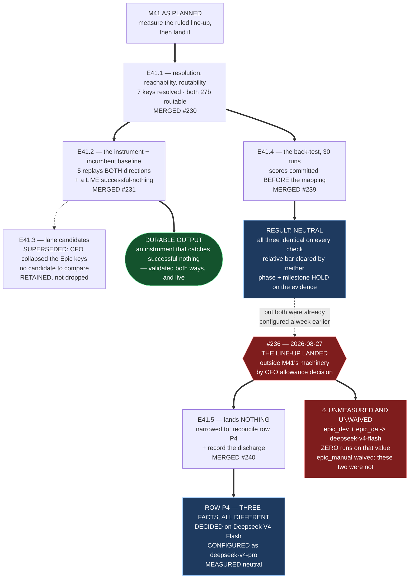

# MILESTONE CLOSURE DECLARATION — M41

Milestone **P12-M41 — The Model Line-Up and Its Evidence** is declared **COMPLETE (awaiting
consolidation)**.

**Four epics were delivered, independently re-measured by this Milestone Chat (G2), and merged with
explicit CFO merge authorization for each:** **E41.1** (#230), **E41.2** (#231), **E41.4** (#239),
**E41.5** (#240). **E41.3 was superseded by CFO ruling and retained, not dropped.**

**Accept-by-silence was suspended for M41 throughout** (#229, `master` `ad6e3f1`). **Every acceptance
is an explicit commit carrying this session's UUID**, recorded in
`P12-M41__stage2-acceptances.md`. **No rework attempt was consumed on any epic; each stands at
attempt 1 of 3.**

---

## ⚠ THE ONE SENTENCE THIS MILESTONE SHOULD BE READ BY

> **The line-up landed before the evidence M41 existed to gather, and the evidence, when it arrived,
> was neutral.**

**On 2026-08-27, PR #236 configured the CFO's baseline line-up** — by the route SN-40..46 Decision 6
mandated, *outside P12's milestone machinery*, because these are **governance configuration, not
phase work**. **That was a legitimate decision and it is not a criticism of it.**

**But it means M41 did not do the thing its name describes.** It gathered evidence for a decision
that had already been made on other grounds, and **the honest disposition of its Definition of Done
is mixed rather than met.** This declaration states which items were met, which were made moot, and
**which were simply not met** — because a closure declaration that ticks a DoD it did not satisfy is
worth less than one that does not.

---

## Completion Verification — the Definition of Done, item by item

| # | DoD item | Disposition |
|---|---|---|
| 1 | All five epics delivered, accepted, merged | **NOT MET AS WRITTEN.** Four delivered and merged. **E41.3 superseded by CFO ruling** (all Epic keys collapsed to one model, so it had no candidate to compare) and **retained rather than dropped**, so its four findings keep a home |
| 2 | Every moving row carries a recorded measurement against its incumbent | **NOT MET — and this is the largest gap. See §Unmeasured rows below** |
| 3 | `epic_manual` lands on R6's surface confirmation ALONE, no back-test | **AMENDED AND MET-AS-AMENDED.** The CFO waived the back-test 2026-08-27. **The surface confirmation itself was not performed** — see §Unmeasured rows |
| 4 | `epic_dev` and `epic_qa` have separate recorded results and separate conclusions | **MET AGAINST A SUPERSEDED VALUE.** E41.2 produced two genuinely separate baselines for `local:qwen3-coder:30b`. **Both rows now hold `remote:deepseek-v4-flash`, which those baselines do not describe** |
| 5 | The instrument flags **both** E33.2's and E39.3's failures on replay | **MET, and exceeded.** Five replay cases in **both** directions — three flagged, **two negative controls passed** — and then a **live successful-nothing caught on the incumbent** (E41.2 DEV RUN 2: exit 0, 4.2 s, 0 tool rounds, six tools genuinely advertised) |
| 6 | Both 27b models routable; host config committed as a reference artifact | **MET** (E41.1). Plus the `qwen3-coder:30b` **8× context overpack corrected** on CFO authorisation, value observed not inferred |
| 7 | Any row that failed its harness escalated to the CFO | **MET** (E41.4's escalation — a **neutral** result on `phase` and `milestone`, escalated as a result rather than a failure) |
| 8 | E41.5 merged **only after M42 closed**, carrying only rows that cleared | **MOOT, NOT SATISFIED. M42 has not closed** — no closure declaration exists for it. E41.5 landed **no rows at all**, so the gate had nothing to guard. **Recorded as moot rather than ticked** |
| 9 | Row P4's closure recorded **beside** the row, not by moving it | **MET, and exceeded** — see §Row P4 below |
| 10 | The carry-forward recorded ONCE, three rows, one trigger | **NOT DONE, DELIBERATELY.** The landing superseded it in substance; **its status is the Phase Chat's to state, not this milestone's to assume** |
| 11 | The notification notice written from the rows that actually landed | **MOOT.** `model_verification: advisory` — **nothing arms.** The clause narrowed five → three → at-most-one → **zero** |
| 12 | Every level notified before E41.5 landed | **MOOT** — same reason |
| 13 | Row P4 recorded as closed by CFO ruling, as a policy-row change | **MET** (HQ Ruling, 2026-08-19, Decision 15) |
| 14 | Suite green at 549 + additions, no skips | **MET. 549 → 569**, +20, attributable to `tests/test_successful_nothing_instrument.py`. No skips introduced |
| 15 | Closure Declaration committed, `is_final: false` | **This document** |

---

## ⚠ Unmeasured rows — the gap, stated plainly

**Three keys moved to `remote:deepseek-v4-flash` in #236. None of them was ever measured on that
value.** Verified: **zero runs against `deepseek-v4-flash`** anywhere in this milestone's evidence.

| Row | Configured | Measured? |
|---|---|---|
| `phase` → `remote:gpt-5.6-sol` | #236 | **YES** — E41.4, ten runs, neutral |
| `milestone` → `remote:deepseek-v4-pro` | #236 | **YES** — E41.4, ten runs, neutral |
| `epic_manual` → `remote:deepseek-v4-flash` | #236 | **NO — back-test waived by CFO decision, 2026-08-27.** The R6 surface confirmation that was to replace it **was also not performed** |
| **`epic_dev` → `remote:deepseek-v4-flash`** | #236 | **NO — and no waiver was given** |
| **`epic_qa` → `remote:deepseek-v4-flash`** | #236 | **NO — and no waiver was given** |

> **`epic_manual` has an explicit waiver. `epic_dev` and `epic_qa` do not.** They moved while this
> milestone was measuring `qwen3-coder:30b`, and the DoD item requiring a measurement for every
> moving row is **unmet for them.**

**This is not raised as an objection.** The CFO's SN-41 decision set all Epic keys by **allowance**,
and that is his to make; `model_verification: advisory` means nothing halts on it. **It is raised
because the DoD says otherwise and someone should be able to see the difference between a
requirement waived and a requirement missed.**

**Handed to the Phase Chat as a carry-forward, not resolved here.**

---

## Row P4 — the finding that outgrew its epic

E41.5 was sent to reconcile row P4's justification with how its value is set. **It found the row was
closed on one engine and configured with another**, and separated three facts that had never been
visible together:

| | Date | |
|---|---|---|
| **DECISION MADE** | 2026-08-19 | Row P4 **closed** by CFO decision, a policy-row change — decided value **`Deepseek V4 Flash`** |
| **VALUE CONFIGURED** | 2026-08-27 | #236 — the mapping reads **`deepseek-v4-pro`**, attributed honestly as *"set by CFO allowance decision (SN-41), not by measurement"* — **a different engine, by a second and separate decision** |
| **MEASURED** | 2026-09-01 | E41.4 — **neutral**: `claude-opus-5`, `gpt-5.6-sol` and `deepseek-v4-pro` **identical on every objective check**; the relative bar cleared by neither |

> **`decision made` ≠ `value configured` ≠ `measured` — and for row P4 all three differ.**

**Recorded beside the row, 49 insertions and zero deletions**, with row P4's cells and the mapping
table byte-unchanged.

---

## Milestone Summary — what M41 actually produced

**The durable outputs are not the line-up. They are these:**

1. **A successful-nothing instrument that works, validated in both directions** — three recorded
   failures flagged, **two negative controls passed**, and then **a live instance caught on the
   incumbent that it was not built against.** *A replay set can be fitted to its own cases; a live
   catch cannot.* **This is M46's gate in miniature and it is the milestone's most reusable asset.**
2. **The first full resolution of the model line-up to exact routable strings**, with reachability,
   routability and the two 27b models made routable (E41.1).
3. **The verification-target back-test extended from one model to three**, under a **scoring control
   the history can verify** — scores committed before the identity mapping, two separate commits,
   because the scorer was one of its own subjects.
4. **Row P4's three-way separation** above.
5. **A ruled bar for a non-reproducible baseline** — *raise N; if it does not stabilise, hold* —
   **fixed in advance of the data it would judge**, and still on the record for the next comparison.

**And one process result worth more than any of them:** **every defect that mattered in this
milestone was caught one level down from where it was made** — HQ's propagation loop and its
withdrawn ruling ground, this chat's Stage-2 annotation and its two spec errors, and the E41.1 chat's
own artifact twice. **None was caught by a check.** The E41.1 chat stated the consequence best:

> *In three consecutive rounds the finder was never the author. Whatever this project builds to catch
> premise-dependents should assume the author cannot run it on themselves.*

---

## Carry-forwards to the Phase Chat

1. **`epic_dev` and `epic_qa` moved unmeasured and unwaived** (§Unmeasured rows). **`epic_manual`'s
   R6 surface confirmation was also never performed.**
2. **The three-row carry-forward's status** — superseded in substance by the landing; **its
   disposition is yours to state.**
3. **E41.3's formal position** — superseded and retained; **its four findings survive it** (the ruled
   bimodal bar, the lane-vs-model ruling, the parse defect, E41.2's instrument).
4. **The parse defect remains unowned** — `local_agent_runner/tool_calls.py:171`, **a third
   repository**, reachable by neither M41 nor M42.
5. **`llama3.1:8b` remains overpacked at 4×** — outside the CFO's authorisation, no line-up row uses
   it, still no `GH-` ID.
6. **M42 has not closed**, and E41.5's Gate 1 was recorded moot rather than satisfied.

---

## Required Action: Consolidation

**Consolidate `milestone/M41` → `phase/P12`** on Phase Chat review, per the milestone-planning
precedent. **This declaration does not authorize that merge**; the CFO does, on diff review.

**`is_final_milestone: false`** — P12 continues.

---

## Visual Bindings

**Visual binding**
- **Link:** (inline — Structural diagram; no hosted link needed per AOG §16.3/§16.5)
- **What:** diagram
- **Level:** Milestone
- **State:** implemented

- **Description:** M41 as planned versus M41 as it happened. Four epics delivered; E41.3 superseded
  when the CFO collapsed the Epic keys, and retained so its findings keep a home. **#236 landed the
  line-up on 2026-08-27, outside the milestone**, which discharged E41.5's subject and left it a
  narrowed residue — row P4, where **decided, configured and measured now name three different
  things.** E41.4's back-test returned **neutral**, so `phase` and `milestone` hold on the evidence
  while already configured by allowance. **Three Epic keys moved to `deepseek-v4-flash` with zero
  runs against that value; one was waived and two were not.** The milestone's durable output is
  **E41.2's instrument**, which caught a live successful-nothing it was not built against.
  Implemented-track Structural diagram (AOG §16.3/§16.6), Mermaid, no ComfyUI.

---

## Closure Confirmation

- **Epics merged:** E41.1 (#230), E41.2 (#231), E41.4 (#239), E41.5 (#240) — **each with explicit CFO
  merge authorization on diff review**
- **E41.3:** superseded by CFO ruling, retained
- **Suite:** **569 passed / 0 failed**, `PYTHONPATH=. pytest -q` (bare `pytest` fails collection)
- **Branch:** `milestone/M41`, **0 behind `master`**, no open PRs
- **Acceptances:** explicit and committed throughout (#229), each carrying
  `1b70b020-4734-45ac-a514-8e4e0ba7d40c`
- **Rework:** none consumed; every epic at attempt 1 of 3
