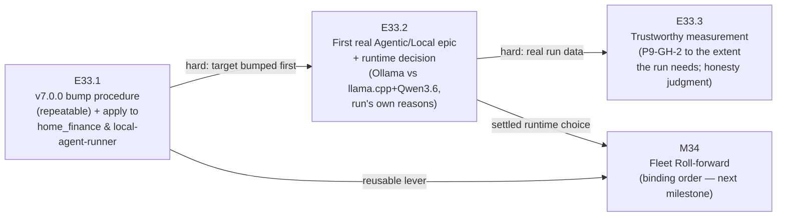

<!-- ===================================================================== -->
<!-- AUDIT HEADER — read by humans, NEVER sent to the model.               -->
<!-- The prompt is EXACTLY the bytes after the PROMPT-BEGIN marker line.   -->
<!-- ===================================================================== -->

# Packet 1 — decomposition/scope judgment (ground truth: THE "EACH PROJECT" BAR IS NOT MET)

**Defect (E35.5 spec, row 1):** M33's Definition of Done and Acceptance Criterion 1 require that
**both** `home_finance` **and** `local-agent-runner` carry a committed run record for a real
Agentic/Local epic. The three epics as decomposed cannot deliver that: E33.2's own DoD requires only
"at least one real Agentic/Local epic ran on **a** proving-pair project", E33.1 delivers bumps and a
procedure, E33.3 depends on E33.2's data. A fourth epic (E33.4) was added at closure to close the gap.

**Provenance — verbatim `git show` of the pre-amendment revisions:**

- `git show 1c50040:docs/phases/P10__.../P10-M33__milestone-spec.md` — the Stage-1 milestone spec.
  (`5d820dc`, the later amendment that adds E33.4 to the decomposition, is **excluded**.)
- `git show 4b4851b:…P10-M33-E33.1__spec__v7-bump-procedure-and-apply-to-pair.md`
- `git show fc9043f:…P10-M33-E33.2__spec__first-real-agentic-local-epic-and-runtime-decision.md`
- `git show 612fbaa:…P10-M33-E33.3__spec__trustworthy-measurement-out-of-the-run.md`

Each is the spec at the commit that introduced it — the state a Stage-2 reviewer of the decomposition
actually had. Reproduce with the commands above.

**Excised (blinding record) — none of the following appears below:**

- Every `P10-M33-E33.4__*` artifact (spec, starter, delivery notice) and the commit that added them
  (`177102a`) — their existence *is* the answer.
- `5d820dc`, the milestone-spec amendment adding E33.4 to the decomposition, and its message
  ("add E33.4 to decomposition (amendment A1)").
- The M33 Milestone Closure Declaration, which narrates the gap and how it was closed.
- The four Epic Execution Chat Starters (milestone + E33.1–E33.3) — not needed for a decomposition
  review, and the milestone starter discusses epic sequencing decisions made later.

<!-- PROMPT-BEGIN -->
You are performing a **Stage-2 review** of a milestone's epic decomposition, under the AI Project
System governance framework.

In this framework a **Milestone spec** states what the milestone must deliver — its Goals, its
Definition of Done, and its Acceptance Criteria. The Milestone Chat then decomposes that milestone
into **Epics**, each with its own spec, its own Definition of Done and its own Acceptance Criteria.
The decomposition is sound only if the epics, taken together and read strictly against what their own
Definitions of Done actually commit to, deliver everything the milestone's Definition of Done and
Acceptance Criteria require.

Below are the milestone spec and all three epic specs of milestone M33.

Your job: decide whether this decomposition is **SOUND** or **NOT SOUND**, and give your reasons.

---

## 1. Milestone spec — M33

```markdown
---
milestone: M33
name: Proving Pair — v7.0.0 + First Real Agentic/Local Epic
phase: P10
status: planned
start_date: 2026-07-20
epics:
  - E33.1
  - E33.2
  - E33.3
is_final: false
---

# Milestone M33 — Proving Pair: v7.0.0 + First Real Agentic/Local Epic

## Purpose

Prove the framework does its job in the wild. On `home_finance` and `local-agent-runner` —
the two projects with canonical `governance.agent.md` already installed — bump each to
**v7.0.0**, run the **first real Agentic/Local epic** of the target project's own work under
the fixed operating posture, settle the **Ollama-vs-llama.cpp** runtime question from that
run, and produce **trustworthy burn/validation evidence** out of the run.

This milestone ensures:
- Adoption is **demonstrated, not asserted** — the proving pair carries at least one real
  governed epic end-to-end, stamped and confirmable at `framework_version: v7.0.0`.
- The local runtime fork is **settled by evidence** — a decision recorded with the run's own
  reasons, not an abstract memo.
- Measurement is **honest against real data** — `measure-token-burn` is trusted only as far as
  a real run's numbers require it to be (P9-GH-2, folded in).
- A **repeatable v7.0.0 bump procedure** exists — the reusable lever M34 consumes.

**M33 is the first P10 milestone and its ordering before M34 is binding** (M34's fleet
roll-forward consumes M33's bump procedure and its settled local-runtime choice — SN-23; phase
spec §Milestones sequencing). M35 is independent and scheduled separately by the Phase Chat.
`is_final: false` — two milestones follow.

---

## Cross-Repo Record/Evidence Split (read first — governs every epic here)

**This is the framework's first milestone whose deliverables land substantially in OTHER
repositories.** A v7.0.0 bump and a real epic on `home_finance` change *that* repo, not this
one. Keep the split explicit in every epic:

- **The target repos** (`home_finance`, `local-agent-runner`) receive the actual
  `framework_version` stamp, the governance refresh, and the real code the epic produces. The
  Milestone/Epic Chats own the mechanics of driving a governed run inside a target repo.
- **This framework repo** (`ai-project-system`, on `phase/P10`) holds the **governance
  record** — this milestone spec, the epic specs and execution-chat starters, delivery/closure
  artifacts — and the captured **evidence**: run records, burn/validation data, and the
  recorded runtime decision. The `phase/P10` branch accumulates the record and evidence; it
  does **not** receive the target repos' code.

Where an epic's DoD says "committed" without qualification, it means committed to the
governance record on `phase/P10` (evidence), while the bump/code lands in the target repo.
Cross-repo evidence must be captured such that a reader of this repo can verify the target-repo
outcome (e.g., the run record cites the target repo, commit, and the confirmable version
stamp).

---

## Binding Context (settled scope — NOT for re-debate)

Per the P10 phase spec (v1.0.0) and SN-23 (Creation Chat, 2026-07-20, all decisions
CFO-ratified), the following apply in full and are not open for re-examination in this
Milestone or any Epic under it:

1. **P10 is adoption, not capability.** Get v7.0.0 running for real; no new framework
   capability built on spec.
2. **The operating posture is fixed.** **Manual/Paid from Creation through Milestone;
   Agentic/Local at the Epic.** Applied through P9's dual-mode switch (M31) and manual-mode
   guardrail — M33 uses them, it does not rebuild them.
3. **Proving pair first.** `home_finance` + `local-agent-runner` run first — canonical
   `governance.agent.md` already installed, least yak-shaving.
4. **Run-first ordering.** The runtime decision (E33.2) and the measurement judgment (E33.3)
   are derived from a **real epic run** on the pair — not decided in the abstract and then
   adopted.
5. **The runtime fork is settled by a run.** Ollama vs llama.cpp + Qwen3.6 27B Q8_0 is decided
   by the first real epic, with the run's own reasons.

Three design decisions are **intentionally open** and belong to the Milestone/Epic Chats, per
the phase spec ("HQ scopes the problem, not the resolution"):
- The bump **mechanism** (E33.1) — re-run `ai-project-init`, targeted governance-file sync, or
  other.
- The **choice of the pair's first real epic** and the runtime **decision criteria** (E33.2).
- The **extent** of the measurement-trust work (E33.3), sized by what the run needs.

---

## Problem Statement

Three verified gaps, each confirmed against current fleet state (SN-23 fleet-state table,
observed 2026-07-20):

- **No project except the framework is confirmably on v7.0.0.** `framework_version` could not
  be found stamped in any project except `ai-project-system` itself. Eight projects are
  enrolled but enrollment is **shallow** — a scaffold dropped in and mostly never run. The
  proving pair is the two furthest along, and even they are not stamped at v7.0.0 or confirmed
  to have run a real governed epic.
- **The local-inference substrate is the one open risk.** `local-agent-runner` is built on
  **Ollama**; the reference stack the CFO is drawn to (Qwen3.6 27B, Q8_0, llama.cpp — which
  **recommends against Ollama**, benchmarks on Mac unified memory, ~32 tok/s at ~42 GB) points
  the other way. The fork is unresolved and cannot be resolved by argument — only by a run.
- **Measurement cannot yet verify its own claims (P9-GH-2).** `measure-token-burn` (P9/M30/
  E30.1) cannot verify its own reduction claims. Run-first ordering says measurement comes out
  of real runs — which requires the run's numbers to be trustworthy. This gap is folded into
  M33 (HQ triage) and fixed **only as far as trusting the proving-pair run's numbers requires**.

---

## Goals

By the end of this milestone:

1. **The proving pair runs under v7.0.0 for real** — `home_finance` and `local-agent-runner`
   are each stamped `framework_version: v7.0.0` (confirmable) and each has carried at least one
   real Agentic/Local epic end-to-end under the fixed posture, with a committed run record in
   the governance record (E33.1, E33.2).
2. **A repeatable enrolled-project v7.0.0 bump procedure exists** — documented, reusable, and
   shown to have been applied to both proving-pair projects. Treated as a first-class
   deliverable (the lever M34 consumes), not a byproduct (E33.1).
3. **The local runtime question is settled by the run** — a recorded decision (keep Ollama vs
   switch the runner to llama.cpp + Qwen3.6) with the reasons the first real epic itself
   produced: quality, throughput, loadability, review burden (E33.2).
4. **Adoption produced its own trustworthy measurement** — real burn/validation data exists
   from the proving-pair run, and a stated, evidence-backed judgment that `measure-token-burn`'s
   numbers for that run can be trusted (P9-GH-2 closed to the extent M33 needs) (E33.3).

---

## Non-Goals

This milestone explicitly does **not**:

- Rebuild the dual-mode switch, the agentic paid-vs-local decision logic, or the manual-mode
  guardrail — all P9/M31, on master at v7.0.0; M33 **applies** them.
- Roll the dormant enrolled projects forward, or fix the superseded `hq.agent.md` in
  ai-project-system-mcp — that is M34 (which consumes E33.1's procedure).
- Canonize the System-operator role, the no-authority-on-speech seam, or the daily seed — that
  is M35.
- Build a local-inference scheduler (hand-run the lane; the CFO is the lane for now), scope
  competing-model code review, P9-GH-1, P9-GH-3, ComfyUI, or P8-GH-2 — all Out of Scope for
  P10 (phase spec).
- **Perfect `measure-token-burn` in the abstract.** E33.3's extent is decided by what the real
  run needs, not by ambition — and the honesty check is not skipped.
- Substitute an abstract runtime decision or hand-waved numbers for a real run (see Hard
  Constraint).
- Produce Epic specs or Epic Execution Chat Starters — that is the Milestone Chat's job
  (adjacency); this spec defines epic scope, deliverables, and acceptance criteria only.

---

## In Scope

- **E33.1** — a documented, **repeatable** procedure for bumping an enrolled project to v7.0.0
  (governance refresh + `framework_version` stamp), and its application to both proving-pair
  projects. Mechanism is the Epic Chat's design decision.
- **E33.2** — scoping and running a **genuine** epic of a target project's own work under the
  fixed posture (Manual/Paid up to the Epic, Agentic/Local at the Epic); the committed run
  record; the recorded Ollama-vs-llama.cpp+Qwen3.6 runtime decision with the run's own reasons.
- **E33.3** — capture of real burn/validation data from E33.2's run, and the fix/validation of
  `measure-token-burn` sized to what trusting that run's numbers requires — with an explicit
  honesty judgment.

## Out of Scope

- Everything under Non-Goals; additionally: any cross-repo rollout to the dormant enrolled
  projects (M34), changes to which chats exist or how they are started (P9/M31 territory), and
  any new framework capability on spec (P10 phase — adoption, not capability).

---

## Hard Constraint (binding — carries to every Epic under this Milestone)

**The runtime decision (E33.2) and the measurement judgment (E33.3) MUST be derived from a
real epic run on the pair.** Run-first ordering is CFO-ratified (SN-23), not a preference. A
synthetic demo does not satisfy E33.2 — it must be real work that advances the target project.
If a real run cannot be completed for a project, **record the blocker explicitly and escalate
to the Phase Chat** — do not substitute an abstract decision or hand-waved numbers. A decision
grounded in a recorded blocker-and-escalation is acceptable; a decision grounded in an
un-run abstraction is not. This constraint governs E33.2 and E33.3 directly, and it is why
E33.1's bump must complete before the run can begin.

---

## Planned Epics

### Confirmed Epics

- **E33.1 — Enrolled-project v7.0.0 bump procedure + apply to the pair**
- **E33.2 — First real Agentic/Local epic on the pair + runtime decision**
- **E33.3 — Trustworthy measurement out of the run (P9-GH-2)**

> **Artifact scope (adjacency).** The Phase Chat produces only this Milestone spec and the
> Milestone Execution Chat Starter. The **Milestone Chat** owns final epic planning and
> authors every Epic spec and Epic Execution Chat Starter. Epic identifiers here are indicative
> decomposition; the Milestone Chat may adjust epic boundaries within this milestone's scope.
> No Phase-level Epic drafts exist.

### Deferred Epics

- None at planning time. E33.3 is **conditional in extent, not in existence** — even on the
  minimal path it delivers a captured-data honesty judgment; it is never deferred.

---

## Epic Detail

### E33.1 — Enrolled-project v7.0.0 bump procedure + apply to the pair

**Source:** P10 phase spec §P10.1; SN-23 (adoption spine; fleet-state table).

**Grounding:** no project except the framework is confirmably on v7.0.0. "Adopt all" is not
one action but three per project — cleanup, version bump to v7.0.0, then the first real
Agentic/Local epic. This epic owns the **version bump**, and it must produce that bump as a
**repeatable procedure** because M34 rolls the same lever across the dormant fleet. The
procedure is a first-class deliverable, not a byproduct of bumping two projects.

**The bump mechanism is a design decision for the Epic Chat, not fixed by this spec.**
Candidate directions (non-exhaustive): re-run `ai-project-init` against the target project;
a targeted governance-file sync (copy/refresh the canonical governance corpus + agent);
a scripted refresh. Whichever is chosen, the procedure MUST cover:
1. **Governance refresh** — bring the target project's installed governance to the current
   v7.0.0 corpus (raw material: the canonical `governance.agent.md` and the `ai-project-init`
   install path, phase spec Dependencies).
2. **`framework_version` stamp** — stamp the target at `framework_version: v7.0.0` in a
   location a later reader can confirm (the phase acceptance bar is "stamped and confirmable").
3. **Repeatability** — documented steps another operator (or M34) can follow to bump a
   different enrolled project, with its known preconditions and failure modes.

**Deliverables:**
1. The documented, repeatable v7.0.0 bump procedure (steps, mechanism, preconditions, known
   failure modes) — committed to the governance record on `phase/P10`.
2. The procedure **applied** to both `home_finance` and `local-agent-runner`: each stamped
   `framework_version: v7.0.0` in its own repo, with the governance corpus refreshed.
3. Confirmation evidence in the governance record that both stamps are present and confirmable
   (cite each target repo + how to verify).

**Definition of Done:**
- [ ] The bump procedure is documented with its mechanism and reasoning, and is repeatable
- [ ] Both proving-pair projects are stamped `framework_version: v7.0.0` (confirmable) with
      governance refreshed to the v7.0.0 corpus
- [ ] Confirmation evidence is committed to the governance record on `phase/P10`
- [ ] For any change touching **this** repo: full suite green (363 baseline, no regressions,
      no new skips) — see Note on the suite

**Acceptance Criteria:**
- [ ] A reader can follow the committed procedure to bump a third enrolled project, and can
      confirm both proving-pair projects are at `framework_version: v7.0.0`

**Sequencing:** first — E33.2's run cannot begin until its target is bumped (hard dependency).

---

### E33.2 — First real Agentic/Local epic on the pair + runtime decision

**Source:** P10 phase spec §P10.1; SN-23 (run-first ordering; the runtime fork settled by a
run); phase success criteria 1–2.

**Grounding:** the local-inference substrate is P10's one open risk. `local-agent-runner` runs
Ollama; the Qwen3.6 27B Q8_0 + llama.cpp reference stack (which recommends against Ollama)
points the other way. The fork is settled by **running** a real epic, not by argument. This
epic is that experiment.

**The choice of the pair's first real epic, and the runtime decision criteria, are design
decisions for the Milestone/Epic Chat.** Constraints on the choice:
- It MUST be a **genuine** unit of the target project's own work that **advances the project** —
  a synthetic demo does not satisfy this (Hard Constraint).
- It MUST run under the **fixed posture**: scoped and reviewed **Manual/Paid from Creation
  through Milestone**, executed **Agentic/Local at the Epic** — applied through P9's dual-mode
  switch (M31), `bin/run-dev-agent` + the P7 orchestrator path, and the manual-mode guardrail.
- The runtime decision MUST be recorded **with the run's own reasons** across at least:
  **quality, throughput, loadability, review burden** — not an abstract memo.

**Deliverables:**
1. **The committed run record** (governance record on `phase/P10`) for at least one real
   Agentic/Local epic executed on a proving-pair project under the fixed posture: what was
   scoped, what ran locally, what the run produced, and the target-repo commit(s) it advanced.
2. **The recorded runtime decision** — keep Ollama, or switch `local-agent-runner` to
   llama.cpp + Qwen3.6 27B Q8_0 — stated with the run's own reasons (quality, throughput,
   loadability, review burden). This is the phase's substrate-risk resolution.
3. If a real run cannot complete for a project: an **explicit blocker record + escalation to
   the Phase Chat** in place of a substituted decision (Hard Constraint).

**Definition of Done:**
- [ ] At least one real Agentic/Local epic ran on a proving-pair project under the fixed
      posture, and its run record is committed to the governance record
- [ ] The run advanced the target project (real work, not a demo) — evidenced by the target
      repo commit(s) the run record cites
- [ ] The Ollama-vs-llama.cpp+Qwen3.6 decision is recorded with the run's own reasons across
      quality, throughput, loadability, and review burden
- [ ] For any change touching **this** repo: full suite green (363 baseline, no new skips)

**Acceptance Criteria:**
- [ ] The runtime decision in the run evidence is traceable to a real run's observations — a
      reader sees *which run* produced *which reasons*, not an abstract argument
- [ ] The cited target-repo work is real and advances the project

**Dependency:** hard — requires E33.1's bump (its target must be at v7.0.0 before the run).
Runs after E33.1.

---

### E33.3 — Trustworthy measurement out of the run (P9-GH-2)

**Source:** P10 phase spec §P10.1; SN-23 (run-first ordering); HQ triage (P9-GH-2 folded into
M33); phase success criterion 3.

**Grounding:** P9-GH-2 records that `measure-token-burn` (P9/M30/E30.1) cannot verify its own
reduction claims. Run-first ordering says measurement comes out of real runs — which is only
useful if the run's numbers can be **trusted**. This epic captures real burn/validation data
from E33.2's run and fixes/validates the tool **only as far as trusting that run's numbers
requires**.

**This epic is conditional in extent — sized by what E33.2's run needs, decided by the
Milestone/Epic Chat after the run's data exists.** Two things are non-negotiable regardless of
extent: the **capture** of real data, and an explicit **honesty judgment**. What is scaled is
how much of `measure-token-burn` gets fixed/validated.

**Deliverables:**
1. **Real burn/validation data** from E33.2's proving-pair run, committed to the governance
   record on `phase/P10`.
2. A **sizing decision**, recorded with its basis: how much `measure-token-burn` fix/validation
   the run's trust requirement justifies (possibly: validation only, no code change).
3. The proportionate fix/validation work itself — **or**, on the minimal path, a documented
   validation finding that the tool's numbers for this run are already trustworthy, with the
   evidence that shows it.
4. **An explicit honesty judgment:** a stated, evidence-backed conclusion on whether
   `measure-token-burn`'s numbers **for this run** can be trusted (P9-GH-2 closed to the extent
   M33 needs). The check is never skipped.

**Definition of Done:**
- [ ] Real burn/validation data from E33.2's run is committed to the governance record
- [ ] The sizing decision is recorded and traces to what the run needs (not to ambition)
- [ ] The proportionate fix/validation (or the documented minimal validation finding) is
      delivered
- [ ] An explicit, evidence-backed honesty judgment on the run's numbers is committed
- [ ] For any change touching **this** repo (`measure-token-burn` lives here): full suite
      green (363 baseline, no new skips)

**Acceptance Criteria:**
- [ ] The repo records a stated judgment — "the run's numbers can/cannot be trusted, because
      …" — backed by the captured data; there is no third state where the check was skipped

**Dependency:** hard — requires E33.2's run data. Runs after (or overlapping the tail of)
E33.2, once real numbers exist. The sizing decision cannot precede the run's data.

---

## Branch Strategy

```
master
└── phase/P10                      (branched at phase open)
    └── milestone/M33              ← this milestone (Milestone Chat branches from phase/P10)
        ├── epic/P10-M33-E33.1     ← v7.0.0 bump procedure + apply to the pair
        ├── epic/P10-M33-E33.2     ← first real Agentic/Local epic + runtime decision
        └── epic/P10-M33-E33.3     ← trustworthy measurement out of the run
```

Epic PRs target `milestone/M33`. Consolidation PR: `milestone/M33 → phase/P10`. **M33 is not
the final P10 milestone** (`is_final: false`) — on its consolidation, the Phase Chat proceeds
to plan M34 (binding order — consumes E33.1's bump procedure and E33.2's settled runtime
choice) and schedules M35 independently. Phase closure (`phase/P10 → master`) happens only
after all three milestones, via the PSG §5C canonical closure sequence ending in the Phase
Closure Declaration (Step 9). There is no separate phase-delivery artifact beyond §5C's steps
(P8-GH-3).

**Note on the cross-repo split:** epic branches here carry the **governance record and
evidence**. The v7.0.0 bumps and the real epic's code land in the **target repos**
(`home_finance`, `local-agent-runner`), which the CFO controls — they are not merged onto
`phase/P10`. An epic's committed governance artifact cites the target-repo outcome so it is
verifiable from this repo.

---

## Prerequisites

- This Milestone spec and its Milestone Execution Chat Starter are git-tracked on `phase/P10`
  (verify with `git ls-files --error-unmatch <path>` on `phase/P10` — the GH-1 convention).
- P10 planning artifacts present and git-tracked on `phase/P10`: the phase spec, the Phase
  Execution Chat Starter, SN-23, and the HQ opener.
- On master at v7.0.0 (the applied substrate — reference, not edit targets):
  - P9's dual-mode switch + agentic paid-vs-local decision logic (M31) and the manual-mode
    guardrail — the fixed posture is applied through these.
  - `bin/run-dev-agent` + the P7 orchestrator/adapter path — the Agentic/Local Epic execution
    substrate.
  - `measure-token-burn` (P9/M30/E30.1) — the object of E33.3's trust work.
  - The canonical `governance.agent.md` and the `ai-project-init` install path — E33.1's raw
    material.
- **External dependencies (CFO-side):**
  - **The target repos** — `home_finance` and `local-agent-runner` live outside this repo; the
    CFO controls their state and access. P10's real work lands there.
  - **Local-inference substrate** — Ollama today on `local-agent-runner`; the llama.cpp +
    Qwen3.6 27B Q8_0 reference stack (~32 tok/s at ~42 GB on Mac unified memory). The first
    real epic settles which the fleet runs on.
  - **Premium/frontier quota** — Manual/Paid work from Creation through Milestone spends paid
    tokens; the CFO controls pacing. Agentic/Local at the Epic is the relief valve.
- Reference context: SN-23
  (`.ai-project/artifacts/steering-notes/2026-07-20__creation-chat__steering-note__P10-adoption-spine.md`);
  the local-model setup reference (https://quesma.com/blog/qwen-36-is-awesome/).

---

## Dependencies and Sequencing

- **E33.1 → E33.2 is a hard dependency:** the run (E33.2) cannot begin until its target is
  bumped to v7.0.0 (E33.1). No real run on an un-bumped project.
- **E33.2 → E33.3 is a hard dependency:** the measurement judgment derives from the run's
  captured data. No trust judgment before real numbers exist. E33.3's sizing may overlap the
  tail of E33.2 where no file contention exists, but the sizing decision cannot precede the
  data.
- **M33 → M34 is binding at phase level:** M34 is not planned until M33's bump procedure
  (E33.1) and settled runtime choice (E33.2) exist. This spec's E33.1 and E33.2 are the links.
- **No dependency on M35** in either direction (M35 is independent; the Phase Chat schedules
  it).

---

## Definition of Done (Milestone)

- [ ] E33.1, E33.2, and E33.3 each meet their Definition of Done above
- [ ] All three epic branches merged to `milestone/M33`
- [ ] Both `home_finance` and `local-agent-runner` are stamped `framework_version: v7.0.0`
      (confirmable), each with a committed run record for at least one real Agentic/Local epic
      executed under the fixed posture
- [ ] A documented, repeatable enrolled-project v7.0.0 bump procedure exists and shows evidence
      of application to the pair
- [ ] The Ollama-vs-llama.cpp+Qwen3.6 runtime decision is recorded with the run's own reasons
- [ ] Real burn/validation data from the run exists in the governance record, with an explicit,
      evidence-backed honesty judgment on `measure-token-burn`'s numbers for that run (P9-GH-2
      to the extent M33 needs)
- [ ] Full suite green on `milestone/M33` for changes touching this repo (363 baseline, no
      regressions, no new skips)
- [ ] Milestone Closure Declaration produced (`is_final: false` — M34/M35 remain)

---

## Acceptance Criteria (Milestone)

1. `framework_version: v7.0.0` is stamped and confirmable in both proving-pair projects, and
   each has a committed run record for at least one real Agentic/Local epic under the fixed
   posture (E33.1, E33.2).
2. The runtime decision (Ollama vs llama.cpp + Qwen3.6) is recorded in the run evidence with
   the run's own reasons — not an abstract memo (E33.2, Hard Constraint).
3. Real burn/validation data from the run exists in the repo, with a stated, evidence-backed
   judgment that `measure-token-burn`'s numbers for that run can be trusted (E33.3, P9-GH-2).
4. A documented, repeatable v7.0.0 bump procedure exists and has been applied to the pair
   (E33.1).
5. Every decision (runtime, measurement-trust) traces to a real run — none to an un-run
   abstraction (Hard Constraint, all epics). Where a run could not complete, an explicit
   blocker-and-escalation stands in its place.
6. The full suite is green at milestone delivery for changes touching this repo — no
   regressions, no new skips.

---

## Timeline

**Target Start:** 2026-07-20
**Target Completion:** 2026-07-31 (~1–1.5 weeks per phase spec estimate; 3 epics, the real
epic run and runtime decision are the long pole — run-first ordering means the first real
epic's duration is discovered, not assumed)
**Actual Start:** Not started
**Actual Completion:** Not started

---

## Visual Bindings

**Visual binding**
- **Link:** (inline — Structural diagram; no hosted link needed per AOG §16.3/§16.5)
- **What:** diagram
- **Level:** Milestone
- **State:** proposed



- **Description:** M33's three-epic flow — bump the pair to v7.0.0 first, run a real
  Agentic/Local epic that settles the runtime fork with its own reasons, then take trustworthy
  measurement out of that run. E33.1's procedure and E33.2's settled runtime choice are the
  binding-order links M34 consumes. Proposed-track Structural diagram (AOG §16.3/§16.6).

---

## Notes

- **Run-first ordering is the load-bearing rule of this milestone.** The runtime decision and
  the measurement judgment are *outputs of a real run*, never inputs to it. A decision made in
  the abstract and then adopted would repeat exactly the mistake P9's founding evidence was
  about (a policy written before evidence). A recorded blocker-and-escalation is the sanctioned
  outcome when a run cannot complete — an un-run abstraction is not.
- **The bump procedure (E33.1) is a first-class deliverable.** It is the reusable lever M34
  rolls across the dormant fleet. Bumping two projects without leaving behind a repeatable
  procedure would satisfy the letter of the pair-bump and fail the milestone's purpose.
- **E33.3 can be small on purpose.** A validation-only E33.3 — "the run's numbers are already
  trustworthy, here is the evidence" — is a full success if that is what the run's trust
  requirement supports. What is never optional is the captured data and the explicit honesty
  judgment.
- **The cross-repo split is real, not rhetorical.** The `phase/P10` branch here carries the
  governance record and evidence; the bumps and code land in the target repos. Write every
  epic so a reader of *this* repo can verify the *target* repo's outcome.
- **The mechanism (E33.1), the epic choice + decision criteria (E33.2), and the measurement
  extent (E33.3) are open design decisions** for the Milestone/Epic Chats — pick a direction,
  document the reasoning, proceed. They are not blockers to escalate (phase starter, Question
  Policy). The *only* escalation trigger here is a run that cannot complete.
- **On the suite baseline:** the 363/0 suite lives in this framework repo. Epics whose
  deliverables are governance record/evidence here must keep it green; the target-repo bumps
  and code are governed by their own repos' checks. "Full suite green" clauses above apply to
  changes touching **this** repo.
- Default-accept (PSG §11.6 / AOG §12) governs this milestone's delivery: clean Epic/Milestone
  deliveries are accepted by silence; a Review Decision is the exception path only. Per SN-19,
  acceptance and the merge instruction are in-chat acts — no ceremonial artifact. The harness
  enforces explicit human authorization on every merge regardless.
```

---

## 2. Epic spec — E33.1

```markdown
---
project: ai-project-system
phase: P10
milestone: M33
epic: E33.1
type: spec
status: planned
last_updated: 2026-07-20
---

# Epic E33.1 — Enrolled-project v7.0.0 bump procedure + apply to the pair

## Context

M33 is the first P10 milestone (`is_final: false`) and P10's spine. E33.1 is the first of its
three epics and the **hard prerequisite for both siblings**: E33.2's real Agentic/Local run
cannot begin on an un-bumped target, and E33.3's measurement judgment derives from that run's
data. The dependency chain is E33.1 → E33.2 → E33.3 (Milestone spec §Dependencies and
Sequencing).

P10 is **adoption, not capability** (SN-23, CFO-ratified): v7.0.0 already exists on `master`;
what does not exist is any project except `ai-project-system` itself confirmably running it.
Eight projects are enrolled, but enrollment is **shallow** — a scaffold dropped in and mostly
never run. This Epic owns the **version bump** for the two projects furthest along —
`home_finance` and `local-agent-runner`, the proving pair (the only two with canonical
`governance.agent.md` already installed) — and it must leave behind a **repeatable procedure**,
because M34 rolls the same lever across the dormant fleet (`courtis`, `fieldledger-assesment`,
`Getawayinsured2023`, `ai-project-system-mcp`). The procedure is a first-class deliverable, not
a byproduct of bumping two projects (Milestone spec §Notes; phase spec §Milestones — "the
reusable lever for M34").

> **Provenance:** Authored by the Milestone Chat (P10-M33) on 2026-07-20 per adjacency (PSG
> §1A artifact-scope). The Coding Agent implements it. E33.1 runs first — E33.2 is hard-blocked
> on its bump (Milestone spec §Dependencies).

> **Source:** P10-M33 Milestone spec (Epic Detail → E33.1; Cross-Repo Record/Evidence Split;
> Hard Constraint); P10 phase spec §Milestones (M33) + §Acceptance Criteria; SN-23 (adoption
> spine; fleet-state table).

**Grounding (verified on `milestone/M33`, 2026-07-20):**

- **No project except the framework is confirmably on v7.0.0.** `framework_version` could not
  be found stamped in any enrolled project except `ai-project-system` itself (SN-23 fleet-state
  table, observed 2026-07-20). The proving pair is the two furthest along, and even they are
  not stamped at v7.0.0.
- **The bump raw material is on `master` at v7.0.0** (Milestone spec §Prerequisites): the
  canonical `governance.agent.md` and the `ai-project-init` install path. These are the
  reference inputs a governance refresh draws from — reference, not edit targets.
- **The target repos live outside this repo and are CFO-controlled.** `home_finance` and
  `local-agent-runner` are separate repositories; the CFO controls their state and access
  (Milestone spec §Prerequisites → External dependencies). The bump lands **there**; this repo
  holds only the procedure and the confirmation evidence (Cross-Repo Record/Evidence Split).
- **Test baseline:** 363 tests on this framework repo (P9 closure baseline, suite 363/0 at
  v7.0.0). Verify with `pytest --collect-only -q` on `milestone/M33` before relying on it.

---

## Problem Statement

"Adopt v7.0.0" is not one action but three per project — cleanup, the version bump, then the
first real Agentic/Local epic (SN-23). This Epic owns the **middle step** for the proving pair.
Two failure modes must both be avoided:

1. **Bumping the pair without leaving a repeatable procedure** — this would satisfy the letter
   of the pair-bump and fail the milestone's purpose: M34 needs a documented lever it (or
   another operator) can re-run against a dormant project it has never touched. A one-off,
   undocumented bump of two projects is not the deliverable.
2. **A stamp that a later reader cannot confirm** — the phase acceptance bar is "stamped **and
   confirmable**." A `framework_version: v7.0.0` value that no one can independently locate and
   verify does not meet it. The procedure must place the stamp where a reader can find and
   check it, and this repo's evidence must tell that reader how.

There is no such procedure today, and neither proving-pair project is stamped or refreshed.

---

## Goals

By the end of this Epic:

1. **A documented, repeatable v7.0.0 bump procedure exists** — mechanism, steps,
   preconditions, and known failure modes — such that a different operator (or M34) can follow
   it to bump a *third* enrolled project the procedure has never been run against.
2. **Both proving-pair projects are bumped** — `home_finance` and `local-agent-runner` each
   have their installed governance refreshed to the v7.0.0 corpus and are stamped
   `framework_version: v7.0.0` in their own repos.
3. **The stamps are confirmable from this repo** — the governance record carries confirmation
   evidence citing each target repo, the commit, and how to verify the stamp (Cross-Repo
   Record/Evidence Split).
4. **The framework repo's suite stays green** for any change that touches it (363 baseline, no
   regressions, no new skips).

---

## Non-Goals

This Epic explicitly does **not**:

- **Run the first real Agentic/Local epic or make the runtime decision** — that is E33.2. This
  Epic ends at "the target is bumped and confirmable"; it does not exercise the target's work.
- **Roll the dormant enrolled projects forward** (`courtis`, `fieldledger-assesment`,
  `Getawayinsured2023`, `ai-project-system-mcp`) or fix the superseded `hq.agent.md` in
  ai-project-system-mcp — that is **M34**, which *consumes* this procedure (P6-GH-15 is M34's
  to close in the wild).
- **Rebuild any framework capability** — the dual-mode switch, the manual-mode guardrail, the
  agentic paid-vs-local logic (all P9/M31, on master at v7.0.0) are applied downstream, not
  touched here. This Epic touches no `governance/` document and no framework capability.
- **Capture burn/validation data or touch `measure-token-burn`** — that is E33.3.
- **Merge target-repo code onto `phase/P10`.** The target repos' bumps land in *their* repos;
  this branch carries only the procedure and confirmation evidence (Cross-Repo split).

---

## Hard Constraint (binding — carried from the Milestone spec)

> **The runtime decision (E33.2) and the measurement judgment (E33.3) MUST be derived from a
> real epic run on the pair.** … it is why E33.1's bump must complete before the run can begin.
> — Milestone spec §Hard Constraint.

For E33.1 specifically, the Hard Constraint's bite is a **sequencing obligation**: E33.1 is the
gate. The bump must **actually complete and be confirmable** on each proving-pair project before
E33.2's run may begin against it — a shallow or unverifiable bump would force E33.2 to run on an
un-bumped target, violating the phase's "stamped and confirmable" bar. If the bump cannot
complete for a project (e.g. the target repo is inaccessible, or the refresh fails
irrecoverably), **record the blocker explicitly and escalate to the Phase Chat via the Milestone
Chat** — do not stamp a project you did not actually refresh, and do not report a bump you cannot
confirm.

---

## Cross-Repo Record/Evidence Split (binding — carried from the Milestone spec)

This is the framework's first milestone whose deliverables land substantially in **other
repos**. Keep the split explicit:

- **The target repos** (`home_finance`, `local-agent-runner`) receive the actual
  `framework_version: v7.0.0` stamp and the refreshed governance corpus. Their bump commits
  land in *their* repos, under CFO control — **not** on `phase/P10`.
- **This framework repo** (`ai-project-system`, on `milestone/M33` → `phase/P10`) receives the
  **procedure** and the **confirmation evidence** only.

Where a Deliverable or DoD item below says "committed" without qualification, it means committed
to the **governance record on this branch** (procedure + evidence). The bump itself is committed
to the **target repo**. Every confirmation-evidence item must be written so a reader of *this*
repo can verify the *target* repo's outcome — cite the target repo, the commit, and the exact
location + method to confirm the stamp.

---

## Design Decision (yours to resolve — decide, document, move; do not escalate to ask which mechanism)

**The bump mechanism is this Epic's one open design point** (Milestone spec §Binding Context —
"intentionally open"; phase spec — "HQ scopes the problem, not the resolution"). Candidate
directions (non-exhaustive, combinable):

- **(A) Re-run `ai-project-init` against the target project.** Strengths: uses the canonical
  install path as-is; least bespoke; whatever `ai-project-init` installs *is* the v7.0.0 corpus.
  Weaknesses: verify it is idempotent against an already-enrolled project (it may overwrite,
  skip, or duplicate); confirm what it stamps and where, and whether it clobbers project-local
  customization. Check the P6-GH-15 hazard — the CLI has previously installed a *superseded*
  `hq.agent.md`; confirm the current install path delivers the **canonical `governance.agent.md`**
  before relying on it.
- **(B) Targeted governance-file sync.** Copy/refresh the canonical governance corpus (AOG, PSG,
  yml-spec, templates, `governance/systems/`, and the canonical `governance.agent.md`) into the
  target's install location, then stamp `framework_version: v7.0.0`. Strengths: explicit and
  auditable — you control exactly which files move and where the stamp lands. Weaknesses: more
  manual; the file list must be complete or the refresh is partial.
- **(C) A scripted refresh.** A small, documented script wrapping (A) or (B) with the stamp
  step. Strengths: most repeatable, best for M34's fleet reuse. Weaknesses: a script that lives
  in *this* repo touches this repo's suite (must stay green); confirm scope before adding code.

Whichever is chosen, the procedure MUST cover the three elements the Milestone spec fixes
(§Epic Detail → E33.1):
1. **Governance refresh** — bring the target's installed governance to the current v7.0.0
   corpus (raw material: canonical `governance.agent.md` + the `ai-project-init` install path).
2. **`framework_version` stamp** — stamp the target at `framework_version: v7.0.0` in a location
   a later reader can confirm.
3. **Repeatability** — documented steps another operator (or M34) can follow to bump a
   *different* enrolled project, with preconditions and known failure modes.

Pick a direction, document the reasoning and the failure modes you found, and proceed. This is
**not** a blocker to escalate — the only escalation trigger in E33.1 is a bump that cannot
complete (Hard Constraint).

---

## Scope of Work

### 1. Design and document the bump procedure

Choose a mechanism (Design Decision above) and write the procedure so it is genuinely
repeatable — the M34 lever. It MUST document: the mechanism and why it was chosen; the ordered
steps; **preconditions** (e.g. target repo accessible, canonical `governance.agent.md` present,
enrollment state); **known failure modes** discovered while applying it (e.g. init
non-idempotency, the P6-GH-15 superseded-agent hazard, partial-refresh risks); and exactly
**where the stamp lands** and **how to confirm it**. This document is the deliverable M34
consumes.

### 2. Apply the procedure to both proving-pair projects

Run the procedure against `home_finance` and `local-agent-runner`. For each: refresh the
installed governance to the v7.0.0 corpus and stamp `framework_version: v7.0.0` in its own repo.
The bump commits land in the **target repos** (CFO-controlled), not on `phase/P10`.

### 3. Capture confirmation evidence in the governance record

For each proving-pair project, commit evidence to this branch that a reader of *this* repo can
use to verify the target's outcome: the target repo, the bump commit reference, the exact
location of the `framework_version: v7.0.0` stamp, and the command/method to confirm it. Note
any per-project deviations from the general procedure (the failure modes feed the procedure doc).

---

## Deliverables

This Epic must produce:

- [ ] **The documented, repeatable v7.0.0 bump procedure** — mechanism, ordered steps,
      preconditions, known failure modes, stamp location + confirmation method — committed to
      the governance record on this branch. Recommended home:
      `.ai-project/artifacts/reference/v7-bump-procedure/` (follows the existing
      `artifacts/reference/` convention; final location is the Epic Chat's call, documented in
      the procedure itself). If the mechanism includes a script (Direction C), it is committed,
      runnable, and documented.
- [ ] **The procedure applied to both proving-pair projects** — `home_finance` and
      `local-agent-runner` each stamped `framework_version: v7.0.0` with governance refreshed to
      the v7.0.0 corpus, in their **own repos** (CFO-controlled; not on this branch).
- [ ] **Confirmation evidence in the governance record** — for each project: target repo, bump
      commit reference, stamp location, and verification method — such that both stamps are
      confirmable from this repo (Cross-Repo Record/Evidence Split).
- [ ] **Full framework-repo suite green** for any change touching this repo (363 baseline, no
      regressions, no new skips). If Direction (C) adds a script here, it must not regress the
      suite; a bump that touches only target repos and this repo's evidence files needs the
      baseline re-confirmed unchanged.
- [ ] **Epic Delivery Notice**
      (`docs/phases/P10__Fleet_Adoption_and_Local_Inference_Proving/P10-M33-E33.1__delivery-notice.md`)

---

## Definition of Done

Epic E33.1 is complete when:

- [ ] The bump procedure is documented with its mechanism and reasoning, and is repeatable (a
      reader could follow it against a project the procedure was never run on)
- [ ] Both proving-pair projects are stamped `framework_version: v7.0.0` (confirmable) with
      governance refreshed to the v7.0.0 corpus
- [ ] Confirmation evidence is committed to the governance record on this branch, citing each
      target repo + commit + stamp location + verification method
- [ ] Any bump that could not complete is recorded as an explicit blocker and escalated (Hard
      Constraint) — not silently stamped
- [ ] Full framework-repo suite green for changes touching this repo (363 baseline, no new
      skips)
- [ ] Delivery Notice committed; all changes on `epic/P10-M33-E33.1`; PR opened to
      `milestone/M33`

---

## Acceptance Criteria

- [ ] A reader can follow the committed procedure to bump a **third** enrolled project, and can
      confirm both proving-pair projects are at `framework_version: v7.0.0` from this repo's
      evidence (Milestone spec E33.1 acceptance criterion; phase acceptance bar "stamped and
      confirmable")
- [ ] Every claimed stamp traces to confirmation evidence in this repo (target repo + commit +
      location + method) — no stamp is asserted without a way to verify it (Cross-Repo split)
- [ ] The procedure records its known failure modes, including whether the P6-GH-15
      superseded-agent hazard applies to the chosen mechanism

---

## Technical Constraints

- **Cross-repo boundary:** target-repo bump commits land in `home_finance` /
  `local-agent-runner` (CFO-controlled) and are **never** merged onto `phase/P10`. This branch
  carries the procedure + evidence only.
- **Repo surfaces in scope (this repo):** the procedure doc (and optional script) under
  `.ai-project/artifacts/reference/` (location per Deliverable 1), plus the confirmation
  evidence and the Delivery Notice under the P10 phase folder. Nothing else.
- **Do NOT touch:** any `governance/` document (this is adoption, not capability); `.ai-project.yml`;
  `measure-token-burn` (E33.3's object); anything the run itself would exercise (E33.2).
- **Confirmability:** the stamp must land where an independent reader can locate and verify it;
  "stamped" without "confirmable" does not satisfy the phase bar.
- **CFO-side access:** the target repos' state and access are CFO-controlled; the Coding Agent
  runs where they are reachable. A target repo that cannot be reached converts to a blocker
  record + escalation, not a wait or a guessed stamp.

---

## Dependencies

**Internal Dependencies:**
- None for starting — E33.1 is first in the chain. **E33.2 is hard-blocked on this Epic's
  completed, confirmable bump** (its run needs a bumped target). **M34 consumes this Epic's
  procedure** (binding phase-level order). Deliver cleanly — the milestone's critical path and
  the next milestone both run through it.

**External Dependencies:**
- The **target repos** (`home_finance`, `local-agent-runner`) — CFO-controlled state and
  access; P10's real bump lands there.
- The **canonical `governance.agent.md` + `ai-project-init` install path** on master at v7.0.0 —
  the refresh's raw material (reference, not edited).

**Blockers:** None known at planning time. A target repo that cannot be bumped is the sanctioned
escalation trigger (Hard Constraint), not a silent stall.

---

## Timeline

**Estimated Effort:** ~1–2 days (mechanism design + procedure doc + apply to two projects +
confirmation evidence). First in the chain; E33.2 waits on it.
**Target Completion:** Within the M33 window (phase estimate ~1–1.5 weeks for the milestone).
**Actual Completion:** Not started.

---

## Execution Notes

- **The procedure is the product; the two bumps are its proof.** Optimize the writeup for an
  operator who has never seen these projects — that operator is M34. A bump that works but
  leaves no reusable, precondition-complete procedure has failed this Epic's purpose (Milestone
  spec §Notes).
- **Check the P6-GH-15 hazard before trusting `ai-project-init` (Direction A).** The CLI has
  previously installed a *superseded* `hq.agent.md` rather than the canonical
  `governance.agent.md`. If you choose Direction A, confirm the current install path delivers the
  canonical agent, and record the finding in the procedure's failure modes either way — M34's
  E34.1 exists precisely because this hazard bit ai-project-system-mcp.
- **Confirmability is a first-class requirement, not a formality.** Before declaring a project
  bumped, actually run your own documented verification method against it and record the result.
  "Stamped and confirmable" is the phase bar (phase §Acceptance Criteria).
- **Verify the grounding's anchors at execution time** — this spec cites paths and baselines as
  of 2026-07-20; confirm each before relying on it (GH-2 discipline; run `pytest --collect-only
  -q` to re-confirm the 363 baseline).
- **Default-accept (PSG §11.6 / AOG §12) governs this Epic's delivery:** a clean delivery is
  accepted by silence; the epic-PR merge is human-authorized in-chat (SN-19); a Review Decision
  is the exception path only. If given merge authorization directly in this chat, confirm it
  isn't bypassing the parent chat's Stage-2 review before proceeding (P9-M31 precedent).

---

## Related Documents

- [P10-M33 Milestone Spec](P10-M33__milestone-spec.md) (Epic Detail → E33.1 — authoritative
  scope; Cross-Repo Record/Evidence Split; Hard Constraint)
- [P10-M33 Milestone Execution Chat Starter](P10-M33__milestone-execution-chat-starter.md)
- [P10 Phase Spec](P10__phase-spec.md) §Milestones (M33) + §Acceptance Criteria
- SN-23: `.ai-project/artifacts/steering-notes/2026-07-20__creation-chat__steering-note__P10-adoption-spine.md`
- Canonical `governance.agent.md` + `ai-project-init` install path (bump raw material)
- P6-GH-15 (superseded `hq.agent.md` install hazard — M34/E34.1 closes it in the wild;
  E33.1 records whether it affects the chosen mechanism)

---

## Notes

- **This Epic is the milestone's spine-root and M34's lever.** Its two downstream consumers —
  E33.2 (needs a bumped target) and M34 (rolls this procedure across the dormant fleet) — make
  its quality ceiling the milestone's and the next milestone's floor.
- **A recorded blocker is a sanctioned outcome; a false stamp is not.** If a target repo cannot
  be reached or refreshed, an explicit blocker + escalation is deliverable; a project reported
  bumped that a reader cannot confirm is not (Hard Constraint; Cross-Repo split).
- **This Epic stays inside adoption.** It touches no `governance/` document and builds no new
  capability — it *applies* v7.0.0 to two projects and leaves a reusable procedure (P10 =
  adoption, not capability; SN-23).
```

---

## 3. Epic spec — E33.2

```markdown
---
project: ai-project-system
phase: P10
milestone: M33
epic: E33.2
type: spec
status: planned
last_updated: 2026-07-20
---

# Epic E33.2 — First real Agentic/Local epic on the pair + runtime decision

## Context

M33 is P10's spine and E33.2 is its **long pole**. E33.1 (merged to `milestone/M33` at
`d877b6b`, both proving-pair projects verified at `framework_version: v7.0.0`) satisfied this
Epic's hard prerequisite: there is now a bumped target to run on. E33.2 is the experiment the
whole phase turns on — it **runs a genuine Agentic/Local epic** of a proving-pair project's own
work under the fixed posture, and from that run it **settles the Ollama-vs-llama.cpp runtime
fork** with the run's own reasons. Its run data is in turn E33.3's hard prerequisite.

P10's one open risk is the local-inference substrate (SN-23, Problem Statement). `local-agent-runner`
is built on **Ollama**; the reference stack the CFO is drawn to (Qwen3.6 27B, Q8_0, **llama.cpp** —
which recommends against Ollama; ~32 tok/s at ~42 GB on Mac unified memory) points the other way.
The fork **cannot be resolved by argument — only by a run** (SN-23 §5, CFO-ratified). This Epic is
that run. Deciding the substrate in the abstract and then adopting it would repeat exactly the
mistake P9's founding evidence was about — a policy written before evidence (Milestone spec
§Notes).

> **Provenance:** Authored by the Milestone Chat (P10-M33) on 2026-07-20 per adjacency (PSG §1A
> artifact-scope). The Epic/Coding Agent executes it. E33.2 runs after E33.1's merged bump and
> before E33.3's measurement (Milestone spec §Dependencies).

> **Source:** P10-M33 Milestone spec (Epic Detail → E33.2; Hard Constraint; Cross-Repo Record/
> Evidence Split); P10 phase spec §Milestones (M33) + §Success Criteria 1–2; SN-23 (run-first
> ordering; the runtime fork settled by a run).

**Grounding (verified on `milestone/M33`, 2026-07-20):**

- **E33.1's bump is complete and confirmable** — `home_finance` (`chore/framework-v7.0.0-bump` @
  `0ea6924`) and `local-agent-runner` (`chore/framework-v7.0.0-bump` @ `231a2cf`) each stamped
  `framework_version: v7.0.0`, submodule at `8044451` (v7.0.0), canonical agent sha `66404389…`
  (E33.1 confirmation evidence, independently re-verified at Stage-2). **A real run now has a
  bumped target — the hard dependency is satisfied.**
- **The Agentic/Local execution substrate is present on master at v7.0.0** (Milestone spec
  §Prerequisites): `bin/run-dev-agent` + `bin/ai-project-orchestrator` (the P7 orchestrator/
  adapter path), the P9/M31 dual-mode switch + agentic paid-vs-local decision logic, and the
  manual-mode guardrail. This Epic **applies** them; it does not rebuild them (Non-Goals).
- **The current local model routing is Ollama-flavored.** `.ai-project.yml` `models.epic_dev`
  and `models.epic_qa` are both `local:qwen2.5-coder:14b` (an Ollama-style tag). The reference
  stack under evaluation is **Qwen3.6 27B Q8_0 on llama.cpp**. Whether the run motivates changing
  this routing is part of the runtime decision — **but this Epic does not pre-edit `models:`**;
  the decision is recorded from the run, and any `models:` change is a separate, authorized act
  (see Non-Goals / Technical Constraints).
- **One prior local run artifact exists** as a shape reference:
  `.ai-project/artifacts/agentic-runs/P7-M26-E26.3-PROVE/` (`context.md`, `transcript.json`,
  `run-metadata.json`). It was a PROVE demo, **not** a real epic — it does not satisfy this
  Epic's Hard Constraint; it only shows the run-record shape.
- **Test baseline:** 363 on this framework repo (re-confirmed at E33.1 Stage-2, `pytest -q` →
  363 passed). Re-confirm before relying on it (GH-2 discipline).

---

## Problem Statement

Adoption is asserted, not demonstrated: no proving-pair project has yet carried a **real** governed
epic end-to-end under the fixed posture, and the fleet's local-inference substrate is unresolved.
Two things must come out of one real run:

1. **A demonstrated governed epic** — the pair must carry at least one genuine unit of a target
   project's own work through the Agentic/Local execution path, proving v7.0.0 does its job in the
   wild (not on a synthetic demo — Hard Constraint).
2. **A settled runtime** — the Ollama-vs-llama.cpp+Qwen3.6 fork must be decided with the reasons a
   real run produced (quality, throughput, loadability, review burden), not an abstract memo. Until
   it is settled, M34's fleet roll-forward has no substrate to standardize on (binding order).

Neither exists today. A run that produces a decision **traceable to its own observations** is the
deliverable; an un-run abstraction is explicitly not (Hard Constraint).

---

## Goals

By the end of this Epic:

1. **At least one real Agentic/Local epic has run on a proving-pair project** under the fixed
   posture, with a committed **run record** in the governance record on `phase/P10` — what was
   scoped, what ran locally, what it produced, and the target-repo commit(s) it advanced.
2. **The run advanced the target project** — real work, evidenced by the target-repo commit(s) the
   run record cites (not a demo).
3. **The Ollama-vs-llama.cpp+Qwen3.6 runtime decision is recorded** with the run's own reasons
   across at least **quality, throughput, loadability, and review burden** — the phase's
   substrate-risk resolution.
4. **If a real run cannot complete for a project**, an explicit **blocker record + escalation** to
   the Phase Chat (via the Milestone Chat) stands in place of a substituted decision (Hard
   Constraint).
5. **The framework-repo suite stays green** for any change touching this repo (363 baseline, no
   new skips).

---

## Non-Goals

This Epic explicitly does **not**:

- **Run a synthetic demo, benchmark, or hello-world.** The run must be genuine target-project work
  that advances the project (Hard Constraint). A PROVE-style demo (cf. P7-M26-E26.3-PROVE) does
  **not** satisfy E33.2.
- **Edit `.ai-project.yml`'s `models:` block or any routing.** The runtime decision is *recorded*
  from the run; changing `models.epic_dev`/`epic_qa` (e.g. to a llama.cpp Qwen3.6 target) is a
  separate authorized change, not part of capturing the decision. No `models:` edit in this Epic.
- **Rebuild the dual-mode switch, the agentic paid-vs-local decision logic, or the manual-mode
  guardrail** — all P9/M31, on master at v7.0.0; E33.2 applies them.
- **Do E33.3's measurement work** — capturing/validating burn data and the `measure-token-burn`
  honesty judgment is E33.3, sized by this run's data. E33.2 produces the run; E33.3 judges its
  numbers.
- **Roll dormant projects forward or standardize the fleet on the chosen runtime** — that is M34,
  which *consumes* this Epic's settled runtime choice (binding order).
- **Merge target-repo code onto `phase/P10`.** The run's code lands in the target repo; this branch
  carries the run record + decision (Cross-Repo split).

---

## Hard Constraint (binding — embedded verbatim from the Milestone spec)

> **The runtime decision (E33.2) and the measurement judgment (E33.3) MUST be derived from a real
> epic run on the pair.** Run-first ordering is CFO-ratified (SN-23), not a preference. A synthetic
> demo does not satisfy E33.2 — it must be real work that advances the target project. If a real
> run cannot be completed for a project, **record the blocker explicitly and escalate to the Phase
> Chat** — do not substitute an abstract decision or hand-waved numbers. A decision grounded in a
> recorded blocker-and-escalation is acceptable; a decision grounded in an un-run abstraction is
> not.

For E33.2 specifically: the run record and the runtime decision are the sole evidence base the
substrate-risk resolution (and M34's consumption of it) stands on. Do not record a runtime reason
you did not observe in the run; do not report the pair as having "carried a real epic" on the
strength of a demo. An honest blocker-and-escalation is a deliverable; a plausible-sounding
un-run decision is not.

---

## Cross-Repo Record/Evidence Split (binding — carried from the Milestone spec)

- **The target repo** (`home_finance` or `local-agent-runner`, whichever carries the run) receives
  the **real code** the epic produces — committed in *its* repo, under CFO control, **not** merged
  onto `phase/P10`.
- **This framework repo** (on `milestone/M33` → `phase/P10`) receives the **run record** and the
  **recorded runtime decision** — the governance evidence.

Where a Deliverable/DoD item says "committed" without qualification it means committed to the
governance record on this branch. The run record MUST be written so a reader of *this* repo can
verify the target-repo outcome: cite the target repo, the run's target-repo commit(s), and the
confirmable evidence that the run advanced real work (recommended run-record home:
`.ai-project/artifacts/agentic-runs/<epic-id>/` alongside the existing convention, plus a
governance-record pointer under the P10 phase folder — final layout is the Epic Chat's call,
documented in the run record).

---

## Fixed Posture (how this Epic executes — applied, not rebuilt)

The P10 posture is **Manual/Paid from Creation through Milestone; Agentic/Local at the Epic**
(SN-23, fixed). For E33.2 that means:
- **Scoping the target-project epic and reviewing the run's decision are Manual/Paid** — the unit
  of target work is scoped/framed before the run, and the runtime decision is confirmed under the
  Milestone Chat's Manual/Paid Stage-2 review.
- **Executing the run is Agentic/Local** — the run itself is dispatched through the dual-mode switch
  (M31) to `bin/run-dev-agent` + the P7 orchestrator path, on the local inference substrate. This
  Epic's Execution Chat Starter therefore declares **`Execution Mode: agentic`** (Milestone starter
  §Output Requirements). The manual-mode guardrail and the agentic dispatch-time model guard (E31.2,
  verifying `epic_dev`/`epic_qa`) apply — no agentic instance assumes a local model is present; the
  run confirms the substrate is actually up before relying on it.

---

## Design Decisions (yours to resolve — decide, document, move; do not escalate to ask)

Per the Milestone spec §Binding Context, **two decisions are intentionally open** and belong to the
Milestone/Epic Chat. Pick, document the reasoning, proceed — these are **not** blockers to escalate;
the only escalation trigger in E33.2 is a real run that cannot complete (Hard Constraint).

### 1. Which proving-pair project's first real epic to run
Candidate directions (non-exhaustive):
- **`local-agent-runner`'s own work.** Natural fit: it *is* the local-inference substrate, so its
  own epic exercises the Ollama/llama.cpp stack most directly, and improving it compounds. Consider
  whether its available real work is well-formed enough to scope cleanly.
- **`home_finance`'s own work.** A genuine application epic run *through* the local substrate — the
  runtime evidence comes from how the local inference stack performs while doing real application
  work. Consider whether it offers a cleaner unit of genuine, reviewable work.
Choose on the basis of which offers a **genuine, scoped, reviewable** unit of real work that will
exercise the local substrate enough to produce runtime evidence across all four dimensions. Record
the choice and why.

### 2. The runtime decision criteria (how the four dimensions are judged)
The decision MUST record the run's own reasons across at least **quality** (was the output good
enough to accept/merge?), **throughput** (tok/s, wall-clock, did it finish?), **loadability** (did
the model/runtime load and stay up on the available hardware — the ~42 GB Q8_0 question?), and
**review burden** (how much human/paid rework did the local output cost?). How you weight and
threshold these is yours to set and document — but all four must be addressed with the run's
observations, not asserted.

Note the substrate question can be exercised either by running on the current Ollama routing and
recording where it strains, or (if the run motivates it and the hardware allows) by trialing the
llama.cpp + Qwen3.6 27B Q8_0 stack within the run — either path is valid so long as the recorded
decision traces to what the run actually showed.

---

## Scope of Work

### 1. Scope a genuine target-project epic (Manual/Paid framing)
Select the proving-pair project (Design Decision 1) and frame a real, reviewable unit of *its own*
work — advancing the project, not a demo. Record what was scoped and why it qualifies as genuine.

### 2. Execute it Agentic/Local (the run)
Dispatch the run through the dual-mode switch to `bin/run-dev-agent` + the P7 orchestrator path on
the local inference substrate. Confirm the substrate is actually up first (no assuming a local model
is present). Let it produce real target-repo work.

### 3. Capture the run record
Commit a run record to the governance record on this branch: what was scoped, what ran locally
(model, runtime, hardware), what it produced, throughput/loadability observations, and the
**target-repo commit(s)** it advanced — written so a reader of this repo can verify the target
outcome (Cross-Repo split).

### 4. Record the runtime decision with the run's own reasons
State the Ollama-vs-llama.cpp+Qwen3.6 decision and its reasons across quality, throughput,
loadability, and review burden — each traceable to *this run's* observations. This is the phase's
substrate-risk resolution.

### 5. If the run cannot complete: blocker + escalation
Record the blocker explicitly and escalate to the Phase Chat via the Milestone Chat, in place of a
substituted decision (Hard Constraint). A decision grounded in a recorded blocker-and-escalation is
acceptable; an un-run abstraction is not.

---

## Deliverables

This Epic must produce:

- [ ] **The committed run record** (governance record on this branch) for at least one real
      Agentic/Local epic executed on a proving-pair project under the fixed posture — what was
      scoped, what ran locally (model + runtime + hardware), what it produced, and the target-repo
      commit(s) it advanced. Recommended home: `.ai-project/artifacts/agentic-runs/<epic-id>/`
      plus a governance-record pointer under the P10 phase folder (final layout the Epic Chat's
      call, documented).
- [ ] **The recorded runtime decision** — keep Ollama, or switch `local-agent-runner` to
      llama.cpp + Qwen3.6 27B Q8_0 — stated with the run's own reasons across quality, throughput,
      loadability, and review burden.
- [ ] **A blocker record + escalation** *if* a real run cannot complete for a project, in place of
      a substituted decision (Hard Constraint).
- [ ] **Full framework-repo suite green** for any change touching this repo (363 baseline, no new
      skips). The run's code lands in the target repo (its own checks govern it); "suite green"
      here applies to changes touching this repo.
- [ ] **Epic Delivery Notice**
      (`docs/phases/P10__Fleet_Adoption_and_Local_Inference_Proving/P10-M33-E33.2__delivery-notice.md`)

---

## Definition of Done

Epic E33.2 is complete when:

- [ ] At least one real Agentic/Local epic ran on a proving-pair project under the fixed posture,
      and its run record is committed to the governance record
- [ ] The run advanced the target project (real work, not a demo) — evidenced by the target-repo
      commit(s) the run record cites
- [ ] The Ollama-vs-llama.cpp+Qwen3.6 decision is recorded with the run's own reasons across
      quality, throughput, loadability, and review burden
- [ ] Any project whose run could not complete has an explicit blocker record + escalation (not a
      substituted decision)
- [ ] Full framework-repo suite green for changes touching this repo (363 baseline, no new skips)
- [ ] Delivery Notice committed; all changes on `epic/P10-M33-E33.2`; PR opened to `milestone/M33`

---

## Acceptance Criteria

- [ ] The runtime decision in the run evidence is **traceable to a real run's observations** — a
      reader sees *which run* produced *which reasons* across the four dimensions, not an abstract
      argument (Milestone spec E33.2 acceptance criterion; Hard Constraint)
- [ ] The cited target-repo work is **real and advances the project** — confirmable from this repo's
      run record (target repo + commit(s) + what advanced)
- [ ] Where a run could not complete, an explicit blocker-and-escalation stands in its place — there
      is no un-run abstraction presented as a decision

---

## Technical Constraints

- **Execution Mode: agentic** — the run is dispatched through the M31 dual-mode switch to
  `bin/run-dev-agent` + the P7 orchestrator path on the local substrate. The agentic dispatch-time
  model guard (E31.2, against `epic_dev`/`epic_qa`) applies, **not** the manual self-report check.
  No agentic instance assumes a local model is available — confirm the substrate is up first
  (chat-hierarchy Execution Mode, P9-M31).
- **Cross-repo boundary:** the run's real code lands in the target repo (CFO-controlled) and is
  **never** merged onto `phase/P10`. This branch carries the run record + decision only.
- **Repo surfaces in scope (this repo):** the run record + runtime decision under
  `.ai-project/artifacts/agentic-runs/` and/or the P10 phase folder; the Delivery Notice. Nothing
  else.
- **Do NOT touch:** `.ai-project.yml` `models:` (recording the decision ≠ changing routing — a
  `models:` edit is a separate authorized act); any `governance/` document; `measure-token-burn`
  (E33.3's object); the dual-mode switch / guardrail (P9/M31 — applied, not edited).
- **CFO-side substrate:** the local-inference hardware/runtime and the target repos are
  CFO-controlled. A substrate that will not come up, or a target that cannot be run, converts to a
  blocker record + escalation — not a wait or a hand-waved decision.

---

## Dependencies

**Internal Dependencies:**
- **Hard dependency on E33.1 — SATISFIED.** E33.1's bump is merged to `milestone/M33` (`d877b6b`)
  and both targets are verified at `framework_version: v7.0.0`; the run has a bumped target.
- **E33.3 is hard-blocked on this Epic's run data** — its measurement judgment derives from this
  run's captured numbers. Deliver the run record such that E33.3 can size its work from it.

**External Dependencies:**
- The **local-inference substrate** (Ollama today; the llama.cpp + Qwen3.6 27B Q8_0 reference
  stack, ~32 tok/s at ~42 GB) — CFO-controlled hardware; the run settles which the fleet uses.
- The **target repos** (`home_finance`, `local-agent-runner`) — CFO-controlled; the run's real
  code lands there.

**Blockers:** None known at planning time. A substrate that will not come up, or a real run that
cannot complete, is the sanctioned escalation trigger (Hard Constraint), not a silent stall.

---

## Timeline

**Estimated Effort:** The milestone's **long pole** — duration is *discovered, not assumed*
(run-first ordering means the first real epic's length is an output, not an input; phase estimate).
**Target Completion:** Within the M33 window (~1–1.5 weeks for the milestone). Runs after E33.1
(done); E33.3 waits on its data.
**Actual Completion:** Not started.

---

## Execution Notes

- **The run's honesty is the whole point.** A recorded blocker-and-escalation is a *success mode*,
  not a failure — it is the sanctioned outcome when a run cannot complete. A plausible-sounding
  runtime decision that no run produced is the one unacceptable outcome (Hard Constraint; Milestone
  spec §Notes).
- **The four dimensions are non-negotiable, the weighting is yours.** Quality, throughput,
  loadability, review burden must each be addressed with the run's observations; how you weight and
  threshold them is your documented call.
- **Keep the decision and the routing change separate.** This Epic *records* the runtime decision;
  it does **not** edit `models:`. If the decision is "switch to llama.cpp + Qwen3.6", the actual
  `models.epic_dev`/`epic_qa` change is a separate authorized act (candidate for M34's
  standardization or a follow-up) — do not fold it into this Epic (Non-Goals; Technical
  Constraints).
- **Verify the substrate before trusting it.** No agentic instance assumes a local model is present
  (chat-hierarchy, P9-M31). Confirm the runtime/model is actually up; if it will not come up, that
  is a blocker to record, not to route around.
- **Verify the grounding's anchors at execution time** — paths, commits, and the 363 baseline are
  as of 2026-07-20; re-confirm (GH-2 discipline).
- **Default-accept (PSG §11.6 / AOG §12) governs delivery:** clean delivery accepted by silence;
  the epic-PR merge is human-authorized in-chat (SN-19); a Review Decision is the exception path.
  If given merge authorization directly in this chat, confirm it isn't bypassing the parent chat's
  Stage-2 review first (P9-M31 precedent).

---

## Related Documents

- [P10-M33 Milestone Spec](P10-M33__milestone-spec.md) (Epic Detail → E33.2 — authoritative scope;
  Hard Constraint; Cross-Repo Record/Evidence Split)
- [P10-M33 Milestone Execution Chat Starter](P10-M33__milestone-execution-chat-starter.md)
- [P10 Phase Spec](P10__phase-spec.md) §Milestones (M33) + §Success Criteria 1–2
- [E33.1 spec](P10-M33-E33.1__spec__v7-bump-procedure-and-apply-to-pair.md) +
  [E33.1 confirmation evidence](P10-M33-E33.1__confirmation-evidence.md) (the bumped target this
  run depends on)
- SN-23: `.ai-project/artifacts/steering-notes/2026-07-20__creation-chat__steering-note__P10-adoption-spine.md`
- Local-model setup reference: https://quesma.com/blog/qwen-36-is-awesome/ (Qwen3.6 27B Q8_0 on
  llama.cpp; ~32 tok/s at ~42 GB)
- `bin/run-dev-agent` + `bin/ai-project-orchestrator` (Agentic/Local execution substrate)
- `.ai-project/artifacts/agentic-runs/P7-M26-E26.3-PROVE/` (run-record shape reference — a PROVE
  demo, NOT a real epic; does not satisfy the Hard Constraint)

---

## Notes

- **This Epic settles P10's one open risk.** The substrate fork blocks M34's fleet standardization
  (binding order) until this run resolves it. Its quality ceiling is the phase's substrate-risk
  resolution.
- **Run-first ordering is the load-bearing rule.** The runtime decision is an *output* of the run,
  never an input. A decision made in the abstract and then adopted repeats P9's founding mistake
  (Milestone spec §Notes).
- **E33.3 reads this run's numbers.** Capture throughput/loadability/spend observations in the run
  record concretely enough that E33.3 can size its measurement-trust work from them without going
  back to raw transcripts.
- **This Epic stays inside adoption.** It runs and records; it builds no new framework capability
  and edits no `governance/` document or routing (P10 = adoption, not capability; SN-23).
```

---

## 4. Epic spec — E33.3

```markdown
---
project: ai-project-system
phase: P10
milestone: M33
epic: E33.3
type: spec
status: planned
last_updated: 2026-07-20
---

# Epic E33.3 — Trustworthy measurement out of the run (P9-GH-2)

## Context

E33.3 is the **last epic in the M33 chain** (E33.1 → E33.2 → E33.3) and its hard prerequisite is
now satisfied: E33.2's run data exists (merged to `milestone/M33` at `f059941`). Where E33.2
*produced* a real Agentic/Local run and settled the runtime question, E33.3 *judges the numbers
that run produced* — closing P9-GH-2 (`measure-token-burn` cannot verify its own reduction claims)
**to the extent trusting this run's numbers requires**, no more.

Run-first ordering is the milestone's load-bearing rule (SN-23): measurement comes **out of** real
runs. But a number that comes out of a real run is only useful if it can be **trusted** — otherwise
the run-first discipline just launders an unverified figure. E33.3 exists to make the trust
question explicit and evidence-backed for E33.2's run, rather than assuming the tool that P9 itself
flagged as unverified is correct.

> **Provenance:** Authored by the Milestone Chat (P10-M33) on 2026-07-20 per adjacency (PSG §1A
> artifact-scope). The Coding Agent implements it. E33.3 runs after E33.2's merged run data
> (Milestone spec §Dependencies).

> **Source:** P10-M33 Milestone spec (Epic Detail → E33.3; Hard Constraint); P10 phase spec
> §Milestones (M33) + §Success Criteria 3; HQ triage (P9-GH-2 folded into M33); SN-23 (run-first
> ordering).

**Grounding (verified on `milestone/M33`, 2026-07-20):**

- **`measure-token-burn` lives in *this* repo** at `bin/measure-token-burn` (P9/M30/E30.1) — a
  stdlib-only (+ optional `tiktoken`) script that parses harness session JSONL `usage` blocks
  (paid, Direction A), tokenizes the governance corpus (Direction B), and extracts local ollama
  `eval_count` from run transcripts (Direction C-lite). Its dataset home is
  `.ai-project/artifacts/reference/token-measurement/`. **This is the one M33 epic that may touch
  framework code** — P9-GH-2 is folded into M33 by HQ triage, so a proportionate `measure-token-burn`
  fix is in scope (unlike E33.1/E33.2).
- **P9-GH-2 is the trust gap.** `measure-token-burn` computes burn but has no self-verification that
  its numbers are accurate — recorded across the P9 closure artifacts and the token-measurement
  README. This Epic addresses it **only as far as trusting E33.2's run numbers requires**, not in
  the abstract (Non-Goals; Hard Constraint).
- **E33.2's run gives new local data the tool's blind spots care about.** The token-measurement
  README records blind spot **G9** — "local input tokens unmeasured; the runner transcript records
  output `eval_count` only; local coverage is a single run (the P7-M26-E26.3-PROVE demo)." E33.2
  adds **real** local runs with reusable numbers (Run A `qwen2.5-coder:14b`: 223 tok / 18.3 s / 0
  rounds; Run B `qwen3-coder:30b`: 829 tok / 88.6 s / 10 rounds / green), captured in
  `.ai-project/artifacts/agentic-runs/P10-M33-E33.2/` — **but in a newer transcript / run-metadata
  layout** than the single PROVE run the C-lite path was built against. Whether `measure-token-burn`
  even parses E33.2's run artifacts correctly is a concrete, run-sized trust question.
- **E33.2 surfaced a measurement-trust finding to fold in.** The run's runtime decision records
  **exit-code-untrust**: a run can report **success with no work** (Run A: exit 0, 0 rounds,
  nothing produced) or **failure with good work** (Run B: exit 2, correct green code). A per-run
  token/round number is only as trustworthy as the run-status it is attached to — E33.3 should treat
  this as a first-class case (E33.2 runtime-decision §Feed-forward to E33.3).
- **Test baseline:** 363 on this repo (re-confirmed at E33.2 Stage-2, `pytest -q` → 363 passed).
  If E33.3 touches `measure-token-burn`, the suite MUST stay green (363, no new skips). Re-confirm
  before relying on it (GH-2 discipline).

---

## Problem Statement

The milestone's measurement leg is only worth having if the run's numbers can be trusted, and P9
itself flagged that `measure-token-burn` cannot verify its own claims. Two things must be true when
M33 closes its measurement leg:

1. **Real burn/validation data from E33.2's run exists in the repo** — the run's actual token/
   throughput numbers, captured (not the abstract 24K/157K estimates P9 banned).
2. **There is an explicit, evidence-backed judgment on whether those numbers can be trusted** — a
   stated "the run's numbers can / cannot be trusted, because …", backed by the captured data.
   There is no third state where the trust check was quietly skipped.

Neither exists yet for E33.2's run. The extent of any `measure-token-burn` fix between "validate
only" and "proportionate code fix" is decided by what *this run's* trust requirement actually needs
— not by ambition to perfect the tool (Non-Goals).

---

## Goals

By the end of this Epic:

1. **Real burn/validation data from E33.2's run is captured and committed** to the governance
   record on `phase/P10` — the run's actual numbers, traceable to the run record.
2. **A sizing decision is recorded with its basis** — how much `measure-token-burn` fix/validation
   the run's trust requirement justifies (possibly: validation only, no code change).
3. **The proportionate fix/validation is delivered** — either the sized code fix + its validation,
   or, on the minimal path, a documented validation finding that the tool's numbers for this run
   are already trustworthy, with the evidence that shows it.
4. **An explicit honesty judgment is committed** — a stated, evidence-backed conclusion on whether
   `measure-token-burn`'s numbers **for this run** can be trusted (P9-GH-2 closed to the extent M33
   needs). The check is never skipped.
5. **The framework-repo suite stays green** for any change touching this repo (363 baseline, no new
   skips) — `measure-token-burn` lives here.

---

## Non-Goals

This Epic explicitly does **not**:

- **Perfect `measure-token-burn` in the abstract.** The extent is decided by what E33.2's run needs
  to be trusted, not by ambition — and the honesty check is not skipped either way (Milestone spec
  Non-Goals; Hard Constraint).
- **Re-run or re-scope E33.2.** E33.2's run is done and merged; E33.3 reads its data. No new
  Agentic/Local run, no target-repo work.
- **Backfill any number from the prior 24K/157K estimates** — banned since E30.1's Hard Constraint;
  every captured number traces to the run, every hole to a recorded gap.
- **Redo E30.1/E30.2/E30.3's dataset, audit, policy, or context-scoping work** — E33.3 adds this
  run's data + trust judgment, it does not revise the P9 corpus.
- **Touch E33.1's bump procedure or E33.2's run record/decision as surfaces** — it *reads* the run
  record; it does not edit it. (Feed-forward notes it already left for E33.3.)
- **Change `.ai-project.yml` `models:` routing** — that remains a separate authorized act (E33.2
  disposition parked it to M34).

---

## Hard Constraint (binding — carried from the Milestone spec)

> **The runtime decision (E33.2) and the measurement judgment (E33.3) MUST be derived from a real
> epic run on the pair.** … A decision grounded in a recorded blocker-and-escalation is acceptable;
> a decision grounded in an un-run abstraction is not. — Milestone spec §Hard Constraint.

For E33.3 specifically: the honesty judgment MUST be about **E33.2's actual run numbers**, backed by
the captured data — not a general claim about the tool. Two things are **non-negotiable regardless
of the extent decided**: (1) the **capture** of real data from the run, and (2) an **explicit
honesty judgment** on whether that run's numbers can be trusted. What is scaled by the sizing
decision is only *how much of `measure-token-burn` gets fixed/validated* — never whether the capture
or the judgment happens. If some part of the run's numbers cannot be validated, record that as an
explicit gap (E30.1 discipline), do not paper it with a guess.

---

## Cross-Repo Record/Evidence Split (binding — carried, with a note on this epic)

- **This framework repo** (on `milestone/M33` → `phase/P10`) receives all of E33.3's deliverables:
  the captured burn/validation data, the sizing decision, the fix-or-validation, and the honesty
  judgment. **`measure-token-burn` and its dataset home also live here** — so unlike E33.1/E33.2,
  E33.3's work is entirely in *this* repo (no target-repo surface).
- E33.3 reads E33.2's committed run record (already on this branch) as its data source; it does not
  reach into the target repos.

Privacy (carried from E30.1): committed data carries aggregated numbers and attributions only —
never raw harness session transcripts or conversation content. E33.2's local-run transcripts are
already committed under its run-record dir; E33.3 cites/derives from them, it does not import new
raw paid-session content.

---

## Design Decision (yours to resolve after seeing the data — decide, document, move; do not escalate to ask)

**The extent of the measurement-trust work is this Epic's open design point** (Milestone spec
§Binding Context — "the extent of the measurement-trust work, sized by what the run needs"). It is
decided **after** examining E33.2's run data, not before. Candidate extents (a spectrum, not a
menu):

- **Validation-only (minimal path, fully valid).** Run `measure-token-burn` against E33.2's run
  artifacts, compare its extracted numbers to the run record's ground truth (A: 223 tok / 0 rounds;
  B: 829 tok / 10 rounds), and document a finding that the numbers are (or are not) trustworthy —
  **with evidence** — and possibly no code change. A validation-only E33.3 is a full success if
  that is what the run's trust requirement supports (Milestone spec §Notes).
- **Proportionate fix.** If the validation shows the tool mis-parses E33.2's newer run-metadata/
  transcript layout, under-counts local spend (blind spot G9), or attaches numbers to an untrusted
  run-status (the exit-code-untrust finding), deliver the **sized** fix that the run's trust
  requirement justifies — plus its validation — and keep the suite green.

Pick the extent the run's data actually warrants, record the sizing decision **with its basis**
(what in the run's numbers drove it), and proceed. This is **not** a blocker to escalate; the only
escalation trigger in M33 is a real run that cannot complete — and E33.2's run completed.

---

## Scope of Work

### 1. Capture E33.2's real burn/validation data
Extract the run's actual numbers (token counts, rounds, throughput, run-status per Run A/B) from
E33.2's committed run artifacts, and commit them as captured data in the governance record —
traceable to the E33.2 run record, no estimate backfill.

### 2. Validate `measure-token-burn` against that data
Run the tool (or the relevant path) against E33.2's run artifacts and compare its output to the
run record's ground truth. Record what matches, what does not, and any cell it cannot honestly fill
(explicit gap). Give special attention to the **exit-code-untrust** case (a number attached to a
false-positive/false-negative run status) and the newer run-metadata layout.

### 3. Make and record the sizing decision
Decide the extent (Design Decision) from what the validation showed; record the decision and its
basis.

### 4. Deliver the proportionate fix or the minimal validation finding
Either the sized `measure-token-burn` fix + its validation (suite green), or a documented finding
that the run's numbers are already trustworthy with the evidence — whichever the sizing decision
warrants.

### 5. Commit the explicit honesty judgment
State plainly, backed by the captured data: **"`measure-token-burn`'s numbers for E33.2's run
can / cannot be trusted, because …"** — P9-GH-2 closed to the extent M33 needs. Never skipped.

---

## Deliverables

This Epic must produce:

- [ ] **Real burn/validation data** from E33.2's run, committed to the governance record on this
      branch (recommended home: alongside the token-measurement dataset or the E33.2 run-record
      area — final location the Epic Chat's call, documented). Aggregated numbers only; no raw
      paid-session content.
- [ ] **A sizing decision**, recorded with its basis: how much `measure-token-burn` fix/validation
      the run's trust requirement justifies (possibly: validation only, no code change).
- [ ] **The proportionate fix/validation work** — the sized code fix + validation, **or** a
      documented minimal validation finding that the tool's numbers for this run are already
      trustworthy, with the evidence that shows it.
- [ ] **An explicit honesty judgment** — a stated, evidence-backed conclusion on whether
      `measure-token-burn`'s numbers for E33.2's run can be trusted (P9-GH-2 to the extent M33
      needs). The check is never skipped.
- [ ] **Full framework-repo suite green** (363 baseline, no new skips) — `measure-token-burn` lives
      in this repo; any change to it must keep the suite green and its behavior contract intact.
- [ ] **Epic Delivery Notice**
      (`docs/phases/P10__Fleet_Adoption_and_Local_Inference_Proving/P10-M33-E33.3__delivery-notice.md`)

---

## Definition of Done

Epic E33.3 is complete when:

- [ ] Real burn/validation data from E33.2's run is committed to the governance record
- [ ] The sizing decision is recorded and traces to what the run needs (not to ambition)
- [ ] The proportionate fix/validation (or the documented minimal validation finding) is delivered
- [ ] An explicit, evidence-backed honesty judgment on the run's numbers is committed
- [ ] Full framework-repo suite green (363 baseline, no new skips); if `measure-token-burn` changed,
      its behavior contract (read-only session access, dataset-file outputs) is preserved
- [ ] Delivery Notice committed; all changes on `epic/P10-M33-E33.3`; PR opened to `milestone/M33`

---

## Acceptance Criteria

- [ ] The repo records a stated judgment — **"the run's numbers can / cannot be trusted, because
      …"** — backed by the captured data; **there is no third state where the check was skipped**
      (Milestone spec E33.3 acceptance criterion)
- [ ] Every captured number traces to E33.2's run (run record / transcripts), and every hole to a
      recorded gap — no backfill from the 24K/157K estimates or any assumption
- [ ] If `measure-token-burn` was changed, the sizing decision shows the change was sized by the
      run's trust requirement, not by abstract completeness

---

## Technical Constraints

- **`measure-token-burn` may be touched (sanctioned for this epic only):** P9-GH-2 is folded into
  M33, so a proportionate fix to `bin/measure-token-burn` is in scope. If changed: preserve its
  behavior contract (reads the session directory **read-only**; writes only its dataset files),
  keep the suite green, and do not regress the P9 dataset's meaning.
- **Sized by the run, not ambition:** no reduction/fix work scoped from the prior estimates or from
  "make the tool complete" — only what trusting E33.2's numbers requires (Hard Constraint).
- **Privacy (carried from E30.1):** aggregated numbers only in committed data; no raw harness paid
  session transcripts or conversation content enters the repo.
- **Do NOT touch:** `.ai-project.yml` `models:` (routing is a separate act); any `governance/`
  document; E33.1's procedure or E33.2's run record/decision as *edit* surfaces (read-only inputs);
  the dual-mode switch / guardrail.
- **Repo surfaces in scope:** `bin/measure-token-burn` (only if the sizing decision warrants) and
  its tests; the captured data + sizing decision + honesty judgment under
  `.ai-project/artifacts/` and/or the P10 phase folder; the Delivery Notice.

---

## Dependencies

**Internal Dependencies:**
- **Hard dependency on E33.2 — SATISFIED.** E33.2's run data is merged to `milestone/M33`
  (`f059941`); the sizing decision and honesty judgment derive from it. No trust judgment before
  real numbers existed — they now do.
- E33.3 is the **last epic in M33's chain**; on its acceptance the milestone's three-epic set is
  complete and the Milestone Chat proceeds to consolidation/closure (`is_final: false` — M34/M35
  remain at phase level).

**External Dependencies:**
- None. E33.3's inputs are all committed in this repo (E33.2's run record + transcripts;
  `measure-token-burn` + its dataset). No CFO-side substrate or target-repo access needed.

**Blockers:** None. The run completed; its data exists. (The Hard Constraint's escalation trigger —
a run that cannot complete — does not apply to E33.3.)

---

## Timeline

**Estimated Effort:** ~0.5–1.5 days, scaling with the sizing decision (validation-only is the short
end; a proportionate parser/self-check fix + tests the longer end).
**Target Completion:** Within the M33 window; last in the chain (runs after E33.2, done).
**Actual Completion:** Not started.

---

## Execution Notes

- **The two non-negotiables are the capture and the judgment.** A validation-only E33.3 is a full
  success if the run's numbers are already trustworthy and you show the evidence. The one
  unacceptable outcome is a missing or skipped honesty judgment (Milestone spec §Notes; Acceptance
  Criteria — no third state).
- **Start by pointing the tool at E33.2's artifacts and comparing to ground truth.** The run record
  gives you the ground-truth numbers (A/B) and the exit-code-untrust caveat; the fastest route to
  the sizing decision is to see whether `measure-token-burn` reproduces them from the newer
  run-metadata/transcript layout. What you find there sizes everything else.
- **Treat exit-code-untrust as a measurement-trust case, not a runner bug.** E33.3's remit is
  whether the *numbers can be trusted*, which includes whether a token/round count is attached to a
  run-status that means what it says. Record the finding; a runner fix (if any) is out of scope and
  belongs to `local-agent-runner`, not here.
- **Verify the grounding's anchors at execution time** — paths, the E33.2 numbers, and the 363
  baseline are as of 2026-07-20; re-confirm (GH-2 discipline).
- **Default-accept (PSG §11.6 / AOG §12) governs delivery:** clean delivery accepted by silence; the
  epic-PR merge is human-authorized in-chat (SN-19); a Review Decision is the exception path. If
  given merge authorization directly in this chat, confirm it isn't bypassing the parent chat's
  Stage-2 review first (P9-M31 precedent).

---

## Related Documents

- [P10-M33 Milestone Spec](P10-M33__milestone-spec.md) (Epic Detail → E33.3 — authoritative scope;
  Hard Constraint)
- [P10-M33 Milestone Execution Chat Starter](P10-M33__milestone-execution-chat-starter.md)
- [P10 Phase Spec](P10__phase-spec.md) §Milestones (M33) + §Success Criteria 3
- [E33.2 run record](../P10__Fleet_Adoption_and_Local_Inference_Proving/) —
  `.ai-project/artifacts/agentic-runs/P10-M33-E33.2/run-record.md` (the data source) +
  [E33.2 runtime decision](P10-M33-E33.2__runtime-decision.md) §Feed-forward to E33.3
- `bin/measure-token-burn` + `.ai-project/artifacts/reference/token-measurement/` (the tool + its
  dataset; blind spot G9 = single-run local coverage)
- P9-GH-2 (measurement cannot verify its own claims — folded into M33 by HQ triage)
- SN-23: `.ai-project/artifacts/steering-notes/2026-07-20__creation-chat__steering-note__P10-adoption-spine.md`

---

## Notes

- **E33.3 can be small on purpose.** "The run's numbers are already trustworthy, here is the
  evidence" is a full success if that is what the trust requirement supports. What is never optional
  is the captured data and the explicit honesty judgment (Milestone spec §Notes).
- **This closes P9-GH-2 to the extent M33 needs — not fully.** Any residual measurement-trust work
  beyond what this run required is recorded (a gap or a follow-up note), not silently completed or
  silently dropped.
- **This is the milestone's measurement leg.** On its acceptance, all three M33 epics are delivered
  and the Milestone Chat moves to milestone consolidation + closure declaration (`is_final: false`).
```

---

## 5. Your task

State your conclusion as **SOUND** or **NOT SOUND** on its own line, then give your reasons.

Work through the milestone's Definition of Done and its Acceptance Criteria one item at a time. For
each item, name the epic (or epics) whose own Definition of Done guarantees it. If any milestone
requirement is not guaranteed by any epic as specified, say so explicitly and quote the mismatched
text on both sides.
