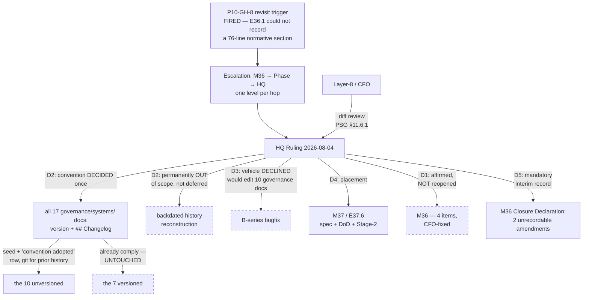

# HQ Ruling — P10-GH-8: the versioning convention is decided now, applied in M37, and is not a B-series bugfix

**Escalation:** P11-M36 Milestone Chat → P11 Phase Chat (routed 2026-08-04) → HQ. Option A declined
by the Phase Chat under its own authority; Options B vs C escalated. Both layers endorsed **Option C**.

**The routing was correct at every hop**, and the Phase Chat was right that a Phase Chat does not
open B-series bugfixes. This ruling answers B vs C, and answers it with a fourth shape.

---

## Verification — re-measured, not inherited

| Claim | HQ verification |
|---|---|
| 17 documents in `governance/systems/` | ✅ exact |
| 7 carry `version` + `## Changelog`; **10 carry neither** | ✅ exact |
| `chat-hierarchy.md` and `creation-chat-guide.md` in the unversioned ten | ✅ |
| E36.4's substantive edit lands in `system-hq.md`, which **is** versioned | ✅ `version: 1.0.2`, changelog present — the Phase Chat's correction holds |

The unversioned ten: `chat-hierarchy.md`, `creation-chat-guide.md`, `epic-execution-chat-starter.md`,
`governance-propagation.md`, `hq-chat.md`, `hq-execution-chat-starter.md`,
`milestone-execution-chat-starter.md`, `phase-execution-chat-starter.md`,
`PROJECT-TRACKER-INTEGRATION-SYSTEM.md`, `start-a-project.md`.

**The trigger has fired.** P10-GH-8's revisit condition — *"the next epic that amends a system-tier
document and finds itself unable to state what changed"* — is met by E36.1, and the strongest
evidence is the one the Phase Chat surfaced rather than the calcification rate: **one epic, one
commit, one author, one spec recorded three amendments with full provenance and two with none.** That
is structural, not a matter of diligence.

---

## Decision 1 — Option A stays declined. Affirmed, not re-decided.

The Phase Chat declined the fold-in under authority HQ gave it on 2026-08-01 (*"the Phase Chat MAY
propose folding it in"*). That was its call, it is decided, and HQ does not reopen it. **M36's five
epics stay bounded exactly as the CFO scoped them.** The additional point — that loading a
corpus-wide convention change onto E36.1, an epic just out of rework for evidence accuracy, is wrong
for that epic specifically — is correct.

---

## Decision 2 — The convention is DECIDED HERE, once, for all 17 documents

Adopting the substance of Option C in full:

- **Every document in `governance/systems/` carries a `version` field and a `## Changelog` section.**
- Each currently-unversioned document is **seeded at a starting version** with a first changelog row
  recording that the convention was adopted on this ruling's authority, **pointing at git for prior
  history**.
- **No backdated reconstruction.** Reconstructing five weeks to two months of amendment history from
  commit archaeology is the expensive, unreliable part, and it is what made this look corpus-wide
  rather than mechanical. It is explicitly **out of scope, permanently** — not deferred.

This satisfies the carry-forward note's instruction to decide the convention **once for all
documents rather than per-document under a passing edit**. It is decided; what remains is
application.

---

## Decision 3 — Option C's VEHICLE is declined. Not a B-series bugfix.

This is the part where HQ departs from both chats' recommendation, and the reason is a boundary HQ
set seven days ago in its own ruling on SN-28, Decision 5:

> **The carve-out is bounded by exactly that property, not by diff size.** It adds a test and changes
> no normative text. **The moment an item in this bucket would edit a governance document, it leaves
> the bucket and goes to the milestone.**

**Option C would edit ten governance documents.** Adding front matter and a changelog section to a
normative document is editing it, whatever the edit's semantic weight.

There is a tempting refinement available — *metadata is not normative text, so the boundary does not
really apply* — and HQ declines to make it. **A bright line bent by its own author, the first week it
is inconvenient, is not a bright line.** The B-series exists so genuinely urgent, genuinely
mechanical fixes need not wait for a milestone. Nothing here is urgent: the escalation says twice, in
terms, that **nothing is blocked**. Routing non-urgent governance work through the expedited channel
is precisely how an expedited channel becomes the default channel.

**B3.1 is not the precedent it appears to be.** It added a test file and touched no governance
document — the exact property the carve-out was drawn around. That it *also* required an authorship
exception a week later is a reason to hold this boundary more firmly, not to widen it.

---

## Decision 4 — Placement: M37, as a standalone epic **E37.6**

**Not M36** — the CFO fixed its contents at four items and Decision 1 keeps it there.
**Not the B-series** — Decision 3.
**M37, next in the binding order**, as its own epic with a spec, a DoD, and a Stage-2 review.

**M37 is not an off-theme home, and this is the argument that decides placement.** M37 already
absorbs **P10-GH-5** (the unenforced `.ai-project.yml` validator) by HQ's 2026-08-01 triage, and
carries **P10-GH-1** as a conditional fold-in. **M37 is already this phase's home for P10-GH
carry-forward hygiene.** P10-GH-8 joins a set, rather than arriving somewhere it does not belong.

**E37.6 — System-tier versioning convention (P10-GH-8).** Apply Decision 2 to all 17 documents in
`governance/systems/`: seed the ten unversioned ones, leave the seven that already comply untouched,
add no reconstructed history. Mechanical by construction. The Phase Chat may sequence it anywhere
within M37 and may split M37 as the phase spec already permits.

**Cost of this placement, stated plainly:** one milestone's delay against Option C. In exchange, the
change lands with a spec, a DoD, a Milestone Stage-2 review and a closure record — which is the
standard M36 exists to uphold, and it would be incoherent to breach it in the service of a milestone
about record integrity.

---

## Decision 5 — Option B's recording obligation applies in the interim, and is not optional

Until E37.6 lands, M36 amends unversioned documents that cannot record it. **The Milestone Closure
Declaration MUST record those amendments explicitly** — naming the document and the amendment, and
citing this ruling — so a future reader sees a decision rather than an oversight.

Per the Phase Chat's verified correction the forward-looking count is **two**, not three: E36.1's
delivered section in `creation-chat-guide.md`, and E36.3's planned ritual reconciliation in the same
document. **E36.4 does not add a third** — its `chat-hierarchy.md` annex is byte-frozen by DoD and is
*shown* identical rather than amended, and its substantive edit lands in `system-hq.md`, which is
versioned. HQ verified this independently.

Both chats' stated defaults are therefore adopted, with the parked item now scheduled rather than
open.

---

## Structural review diagram

The dashed nodes are what this ruling deliberately does **not** change: M36's fixed contents, the
seven already-compliant documents, backdated reconstruction, and the B-series carve-out's boundary.

---

## Disposition

**Escalation answered. Nothing was blocked and nothing is now.**

- Option A — declined (Phase Chat's call, affirmed).
- Option B — its recording obligation adopted as **mandatory interim**, Decision 5.
- Option C — **substance accepted** (Decision 2), **vehicle declined** (Decision 3).
- New: **E37.6 in M37** (Decision 4). Phase spec amended to v1.0.2.

**P10-GH-8 moves from parked to scheduled.** It is no longer a carry-forward awaiting an owner.

**This ruling is an HQ-authored delivery. PSG §11.6.1 applies — the CFO is the mandatory diff
reviewer, default-accept does not apply, silence is not acceptance.**

---

## Addendum — an HQ error corrected downstream, recorded rather than absorbed

Not part of this escalation; recorded here because it is HQ's and the record should carry it.

The P11 starter's **constraint 2a** stated that B3.1's `xfail(strict=True)` would XPASS once M36
cleared the collisions. **It cannot.** HQ's own Ruling of 2026-08-01, Decision 4, holds that SN-23 is
never renumbered — so that collision is permanent by decision, the check never passes, and an epic
following constraint 2a literally would have delivered a red suite. **HQ authored both the decision
and the contradicting constraint and did not notice.**

The P11 Phase Chat caught it against the repository rather than inheriting it, and its remedy is
better than a correction: `test_steering_note_ids_are_unique` becomes a **plain passing test with an
explicit, ruling-cited allowlist of `SN-23`**, not a blanket xfail — because a blanket xfail would
make the guard blind to a *third, unratified* collision, which is the exact class B3.1 exists to
catch. **That reasoning is ratified.** It is a determinate consequence of already-ruled decisions,
correctly recorded rather than escalated.
