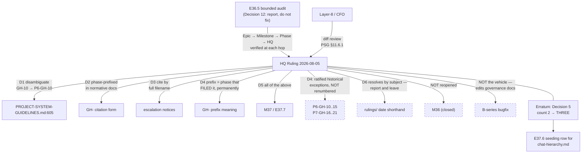

# HQ Ruling — Artifact-ID citation forms: four answers, placed at M37/E37.7; and an erratum to Decision 5

**Escalation:** E36.5 Epic Chat → M36 Milestone Chat → P11 Phase Chat → HQ. Each hop verified rather
than forwarded, and each declined to fix what was not its to fix. **The audit did exactly what
Decision 12 scoped it to do: it reported, and it widened nothing.**

---

## Part 1 — Erratum: Decision 5's count was wrong, and HQ was told

**HQ Ruling 2026-08-04, Decision 5 stated:** *"the forward-looking count is **two**, not three"*,
naming both amendments as `creation-chat-guide.md`.

**The verified count is THREE amendments across TWO unversioned documents.** Re-measured directly:

| # | Epic | Document | Size |
|---|---|---|---|
| 1 | E36.1 | `governance/systems/creation-chat-guide.md` | +78 |
| 2 | E36.1 | `governance/systems/chat-hierarchy.md` | ±3 |
| 3 | E36.3 | `governance/systems/creation-chat-guide.md` | +90 |

**This is not new information to HQ, and that is the part worth recording.** The P11 Phase Chat's
2026-08-04 routing stated it plainly — *"E36.1 amended **two** unversioned system-tier documents, not
one — `chat-hierarchy.md` (+3/−3, SN-23 date-qualification) as well… The Impact table omits the
`chat-hierarchy.md` row."*

That routing carried two corrections, one in each direction. **HQ applied the one that lowered the
count (E36.4 adds no third) and verified it independently, and dropped the one that raised it.**
Verifying the correction that shrinks a number while ignoring the correction that grows it is
asymmetric verification, and it produced a false count in a ruling whose subject is record integrity.

The M36 Closure Declaration caught it, corrected it upward, and left the original claim visible. That
is the right handling and it is ratified.

**Consequence, carried so E37.6 does not inherit the error:** the ten unversioned documents E37.6
will seed include `chat-hierarchy.md`, which carries **one more in-flight amendment than Decision 5
records**. E37.6's seeding row for that document must be written from this erratum, not from Decision
5's count.

**Decision 5's obligation itself stands unchanged and was discharged** — §D5 of the Closure
Declaration records document, amendment and ruling as required.

---

## Part 2 — The audit's findings

**Verified by HQ, not inherited.** Every claim re-measured on `milestone/M36`:

| Claim | HQ verification |
|---|---|
| `PSG:605` carries a bare `GH-10` | ✅ confirmed |
| It is the **only** namespace-stripped `GH-<n>` under `governance/` | ✅ confirmed — a sweep returns **exactly one hit** |
| `P5-GH-10` and `P6-GH-10` are both live and unrelated | ✅ confirmed |
| Two escalation notices share the `P10-M34` key | ✅ confirmed |
| The shorthand appears in `chat-hierarchy.md:271` and `ai-project-yml-spec.md:660` | ✅ confirmed, both meaning the 2026-07-28 notice |

**The framing is correct and important: this is not an ID collision.** The `GH-` namespace held —
38 live IDs, six phases, no duplicates. `rulings/` and `escalation-notices/` allocate no ID at all.
What fired is a **citation-form** failure with the same reader-level consequence as SN-23: a
shorthand that resolves to more than one artifact, appearing in the normative tier.

The Milestone Chat's sharpening is accepted and matters: `PSG:605`'s sentence opens with **two P5
anchors** (*"SN-13 (P5)"*, *"since P5"*) against **one P6 anchor** (*"(P6-M25)"*). So **neither the
identifier nor the context reliably resolves it** — a reader weighting salience over adjacency lands
on the wrong item. That is a closer match to SN-23 than E36.5 claimed for itself.

---

## Decision 1 — Q1: Yes. `GH-10` at PSG:605 is disambiguated to `P6-GH-10`

It sits in **PROJECT-SYSTEM-GUIDELINES.md, the framework's highest-authority document**, higher than
any document an SN-23 citation was found in. It is the **sole** namespace-stripped instance in the
entire normative corpus, which makes it an outlier rather than a convention worth preserving.

**Executed in M37/E37.7 (Decision 5), not now and not as a bugfix.** The remediation is two
characters, and **the cheapness is precisely why it must go through process.** E36.5 named that
hazard explicitly and declined to act on it; that judgment was correct and HQ is not going to
undercut it by doing informally what the Epic properly refused to do.

---

## Decision 2 — Q2: Yes. `GH-` citations in normative documents carry the phase prefix

**Normative rule:** any `GH-` identifier cited in a `governance/` document is written in full
phase-prefixed form (`P6-GH-10`), never bare. Prose elsewhere may abbreviate where an unambiguous
antecedent is adjacent; the normative tier may not.

This is the direct analogue of the SN-23 date-qualification rule E36.1 recorded, applied to the
family that is **cited far more widely than `SN-` ever was** — which is the property that made SN-23
High rather than untidy.

---

## Decision 3 — Q3: Yes. Escalation notices are cited by full filename

**Normative rule:** an escalation notice is cited by its **full filename**, never by milestone key.

The milestone key is doing identifier work it cannot do: **a milestone can raise more than one
notice**, and two already share `P10-M34`. The notice reporting this is *itself* the second
`P11-M36` notice — it instantiates the ambiguity it reports and counted itself in the finding rather
than exempting itself. That is the cleanest possible demonstration and it decides the question.

The same applies to any artifact family keyed by level rather than by identifier.

---

## Decision 4 — Q4: The `GH-` prefix names the phase that FILED it. Permanently.

The prefix inverted mid-corpus: P5's closure declaration **forward-allocates** `P6-GH-10`/`P6-GH-11`
(prefix = *the phase that will address it*), while P10's carries `P10-` IDs into P11 unchanged
(prefix = *the phase that filed it*). Both readings are live. **HQ rules for filing phase.**

**The reason is the one already ruled twice in this phase.** An identifier names something
**immutable**; disposition is not immutable. **P10-GH-8 is the proof available today:** it was
destined for M36, then parked, then scheduled to M37 — and its ID rightly never moved. Under the
forward-allocation reading it would have had to change twice, invalidating every citation each time.
That is exactly the churn Decision 4 of the 2026-08-01 ruling exists to prevent.

Stated in the form this repository keeps arriving at: **the record names the disposition; the
identifier names the origin.**

**Allocation restarts per phase.** The prefix carries uniqueness, so a per-phase counter is
sufficient and is what P5/P8/P9/P10 already do.

**Nothing is renumbered.** `P6-GH-10…15` and `P7-GH-16…21` — forward-allocated and/or continuing a
global counter — are **ratified historical exceptions**, recorded as such and left in place. *A
bookkeeping defect never rewrites a citation in a normative document* (2026-08-01 Decision 4, third
application). The SN-15 precedent that a `GH-` ID **has** been renumbered before (`P6-GH-1` →
`P6-GH-12`, `P6-GH-2` → `P6-GH-13`) is noted and is **not** followed: those renumbers happened
before the IDs had propagated into the normative tier, and these have.

---

## Decision 5 — Placement: M37, new epic **E37.7**

**E37.7 — Artifact-ID citation forms (`GH-`, escalation notices).** Executes Decisions 1–4: the
`PSG:605` disambiguation, the `GH-` phase-prefix rule, the escalation-notice full-filename rule, and
the prefix-means-filing-phase statement with its ratified historical exceptions. Recorded once,
where the corpus states such rules, alongside E36.1's Steering Note ID Allocation section rather
than duplicated into each family's directory.

**Not a B-series bugfix** — it edits governance documents, and that is the boundary HQ set on
2026-08-01 (Decision 5) and held on 2026-08-04 (Decision 3). **Holding it a second time, on the very
next case, is the point of having drawn it.**

**Not a reopening of M36.** Its Closure Declaration is committed; the audit was scoped to report and
did.

### A constraint HQ places on itself

**M37 now carries E37.1–E37.7**, and four of those are carry-forward hygiene HQ routed there
(P10-GH-5, conditional P10-GH-1, E37.6, now E37.7). *"The milestone with room"* is becoming *"the
milestone things get put in,"* which is a real pattern and worth naming rather than repeating.

**HQ places nothing further in M37 without first reconsidering the milestone's shape.** The Phase
Chat's standing permission to **split M37** is reaffirmed and upgraded from permitted to
**recommended**, with the M37 → M38 boundary and E37.1's first position preserved.

---

## Decision 6 — `rulings/` date-only ambiguity: report and leave. Affirmed.

Two dates hold two rulings each, and the date-only shorthand is in live use ~14 times — but **every
`governance/` citation resolves**. E36.5 correctly did not escalate it. **Recorded, not actioned**,
per the disposition table's project-internal rule. It is not in E37.7's scope.

---

## Structural review diagram

Dashed nodes are what this ruling deliberately does **not** change.

---

## Disposition

**Escalation answered. Nothing was blocked and nothing is now.**

Four questions answered, all four placed in **M37/E37.7**. `rulings/` affirmed as report-and-leave.
Nothing renumbered. M36 not reopened. Decision 5's count corrected upward, with the consequence
carried forward to E37.6 so it is not discovered late.

**On the chain's performance, recorded because it is evidence about the machinery and not flattery:**
the Epic declined a two-character fix it was capable of making and named the cheapness as the hazard;
the Milestone Chat verified every claim and *strengthened* the finding against itself; the Phase Chat
routed rather than deferred. **Three levels, and the only defect in the whole sequence was HQ's own
count.**

**This ruling is an HQ-authored delivery. PSG §11.6.1 applies — the CFO is the mandatory diff
reviewer, default-accept does not apply, silence is not acceptance.**
