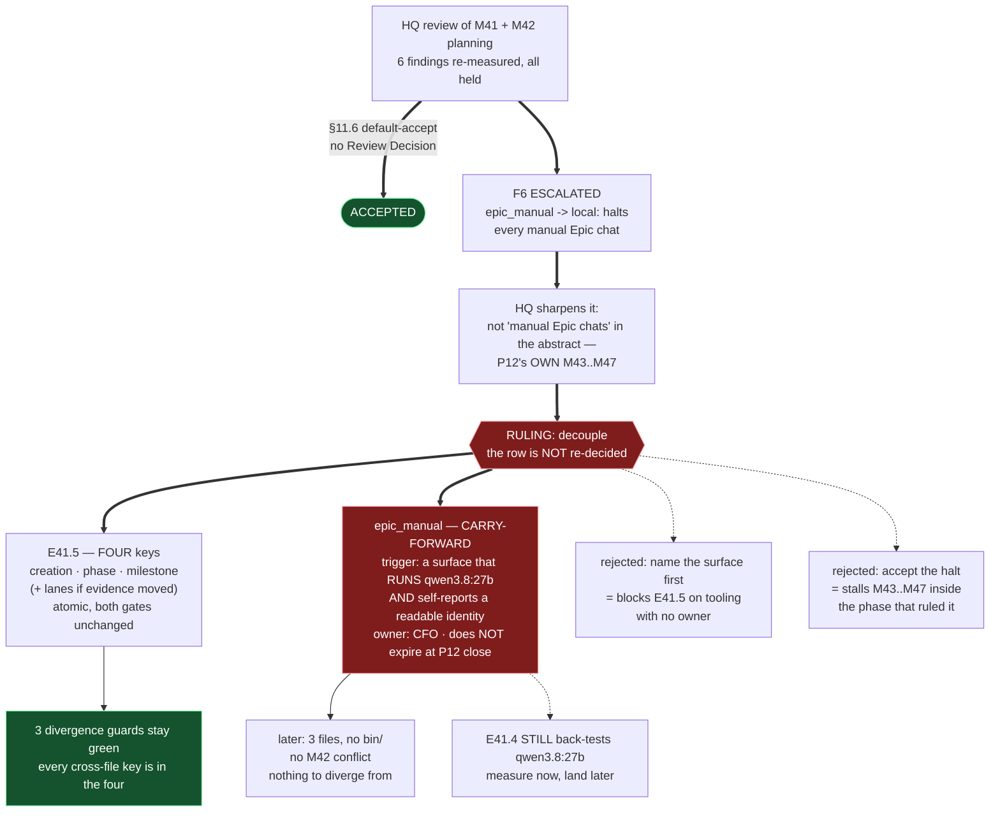

# HQ Ruling — M41 and M42 Planning Accepted; the F6 Escalation Resolved by Decoupling `epic_manual`

**Prerequisite verification (P9-M31-E31.3):** harness-reported model `claude-opus-5` vs
`.ai-project.yml` `models.hq: remote:claude-opus-5` — **match.** Proceeding.

---

## Decision 1 — M41 and M42 planning are ACCEPTED

**Accepted under PSG §11.6 default-accept.** No Review Decision artifact is issued; this ruling
exists for the escalation, not for the acceptance. The acceptance record is the in-chat
acknowledgment plus the merges.

**HQ re-measured before accepting** (G2 — *the reviewer re-measures; the executor's report is not the
evidence*). Every load-bearing finding held:

| Finding | HQ's re-measurement, `master` at `9ee810e`, 2026-08-19 |
|---|---|
| **G4** — the `P12-GH-2` live victim | **Confirmed.** `social-stories-creator` **230 bytes**; the other eleven fleet agents are **14,711** each |
| **F1** — `opencode.json` | **Confirmed.** No copy in this repository; the host file declares four Ollama models and **neither 27b** |
| **F3** — divergence guards | **Confirmed.** `EXPECTED_MANUAL_ONLY_VALUE` is a single shared scalar; `DEFAULT_MODELS` at `:23-29` |
| **F6** — halt severity | **Confirmed.** `chat-hierarchy.md:324` — *"Mismatch: refuse, unconditionally… no continuation, no 'proceeding with caution'"* |
| E41.2's premise | **Confirmed.** `Docker version 29.6.1` present |

**Six planning-time findings that reshape an epic set is the review chain working, not a defect in
the ruling.** Four of the six could only be found by opening the files, which is what the level below
is for. HQ stated its own verification boundary in Decision 18 — *local models only* — and F4 and F6
sharpen exactly the area that boundary left open.

**Both starters exceed their contract.** The P12 starter required them to carry the 3-attempt rework
rule in their own bodies, because the template does not have it (`P12-GH-1`). Both do, both cite the
`+1` amendment, both flag the `"resets"` conflict — **and both propagate the obligation downward to
the Epic starters the Milestone Chats will write.** That closes a loop HQ did not ask them to close.

### One annotation, non-blocking, for M41's next amendment

**F3 overstates its own collision surface.** Of the five moving keys, **only `phase` and `milestone`
appear in `DEFAULT_MODELS`** — `creation` and `epic_manual` are not in it at all (`bin/ai-project-orchestrator:23-29`
holds `hq`, `phase`, `milestone`, `epic_dev`, `epic_qa`). **E41.5's collision with M42 in `bin/` is
two keys, not five.** The atomicity argument stands on the three divergence guards; the
merge-conflict argument is smaller than F3 implies. **Record it; do not restructure anything for it.**

### Process note

**Milestone planning delivers as a PR** — `milestone/M4x → phase/P12`, per P10's #155/#159 precedent.
`phase/P12` currently sits at `master` with nothing ahead and no PR is open. Open them.

---

## Decision 2 — F6 is resolved by DECOUPLING `epic_manual` from E41.5. The row is not re-decided

**The escalation was correctly raised and HQ sharpens it before answering.**

M41 filed F6 as a prerequisite of E41.5: `epic_manual: local:qwen3.8:27b` makes manual Epic chats
halt, because the manual model check is *"refuse, unconditionally"* and Claude Code self-reports
`claude-opus-5`.

**The consequence is larger than "manual Epic chats have no surface."** **It is P12's own remaining
work.** M43, M44, M45, M46 and M47 all run manual Epic chats. The moment E41.5 lands as designed,
every one of them halts. **A milestone whose terminal epic disables the execution of the four
milestones after it is not a scheduling detail.**

**The row is the CFO's and is not re-decided here.** `epic_manual` still goes to
`local:qwen3.8:27b`. What HQ rules is *when*, because the ruling that set the row did not name the
prerequisite it carries.

### The ruling

**E41.5 lands four keys. `epic_manual` is decoupled and lands separately.**

- **E41.5** — `creation`, `phase`, `milestone`, plus `epic_dev`/`epic_qa` only if E41.3's evidence
  moved them. Atomic across its file set, both gates unchanged, `hq` unchanged.
- **`epic_manual`** — a **gated carry-forward with a named trigger**, not a scheduled date.

**The trigger, stated so it is testable rather than aspirational:** a surface exists that **runs
`qwen3.8:27b`** *and* **self-reports a model identity the E31.3 check can read.** Both halves are
required — a surface that runs the model but reports nothing fails the check just as surely as one
that reports `claude-opus-5`.

**Owner: the CFO.** It is a tooling question about his own environment, not a governance question,
and HQ has no standing to answer it.

**It does not expire at P12's close.** If the row simply rode along to phase closure it would halt
P13's manual Epic chats instead — the same defect, one phase later. **Decoupling buys time; it does
not remove the dependency**, and the carry-forward must say so.

### Why this disposition and not the other two

**CFO decision, 2026-08-19, on HQ's stated recommendation** — HQ presented three dispositions and
recommended this one; the CFO chose the recommendation. Recorded this way rather than as an
unattributed choice, because the reasoning below is HQ's and the authority is his.

| Option | Why not |
|---|---|
| **Name the surface first, land all five atomically** | Blocks E41.5 on tooling that **does not exist and has no owner**. E41.5 is already behind two gates; a third with no owner is how a terminal epic becomes permanent. |
| **Accept the halt as intended** | Literally faithful to the ruling and **stalls M43–M47's Epic execution inside the phase that ruled it.** Recorded as available so the choice is visible; not chosen. |

**What decoupling costs, stated plainly because it reverses an HQ design decision.** HQ made the
landing one atomic change (Decision 17, and F3's mechanical corroboration). This trades that for
continuity. **The trade is cheap and verified:** `epic_manual` has **no `DEFAULT_MODELS` entry**, so
its later change touches `.ai-project.yml`, `chat-hierarchy.md` and `tests/test_model_config.py` —
**three files, no `bin/`, therefore no M42 conflict** — and the divergence guards stay green
throughout, because there is nothing for `epic_manual` to diverge *from*.

**What it does not cost:** the atomicity that mattered. The three guards bind `.ai-project.yml`
against `model-routing-policy.md`, `DEFAULT_MODELS` and `chat-hierarchy.md`. Every key those guards
compare across files is in E41.5's four. **The property was never about moving all five together; it
was about never leaving two files disagreeing.** That property survives intact.

### Consequential edits M41 must make

1. **E41.5's deliverable 1** — four keys, not five; `epic_manual` explicitly excluded with a pointer
   to this ruling.
2. **E41.5's deliverable 4** — `chat-hierarchy.md`'s mapping table and prose. **`epic_manual`'s row
   and its Basis text stay as they are** in this change; the prose rewrite covers only the keys that
   move. The stale-rationale problem M41 correctly identified still applies to the four.
3. **E41.5's deliverable 5** — `EXPECTED_MANUAL_ONLY_VALUE` **still** becomes a per-key mapping,
   because `creation` moves and `epic_manual` does not. **The two keys diverge in this change**, which
   is the same refactor for the opposite reason. M41's analysis holds; only the cause changes.
4. **F6 is downgraded from a prerequisite of E41.5 to a carry-forward**, and the Prerequisites
   section says so.
5. **M41's Definition of Done** — "every moving row" now excludes `epic_manual` from the *landing*
   obligation and **not** from the *measurement* obligation. **E41.4 still back-tests
   `qwen3.8:27b`.** The evidence is collected now even though the row lands later; that is the
   CFO's direction (collect early) and is unaffected by this ruling.

### `P11-GH-1` applies to this ruling, and HQ names the channel rather than assuming it

**This ruling amends a milestone spec after its branch was cut** — the exact defect that fired on
HQ's own branch earlier in this phase. **M41 has already written the channel into its own Notes**:
amend the spec on `milestone/M41` with a changelog entry, notify the chat in-session naming the
section, and require it to state in its next delivery that it re-read the named section.

**Use that channel for this ruling.** It is the first live test of a mitigation this phase authored,
and whether it fires is worth recording either way.

---

## Note on the review diagram

---

## Disposition

**M41 and M42 planning: ACCEPTED.** Open the delivery PRs to `phase/P12`.

**F6: RESOLVED by decoupling**, on the CFO's decision taken on HQ's recommendation. The row stands;
its landing is gated on a trigger with a named owner and no expiry.

**PSG §11.6.1:** this ruling is HQ-authored and **has no chat-level reviewer.** The CFO is the
mandatory diff reviewer; authorization is not review.
