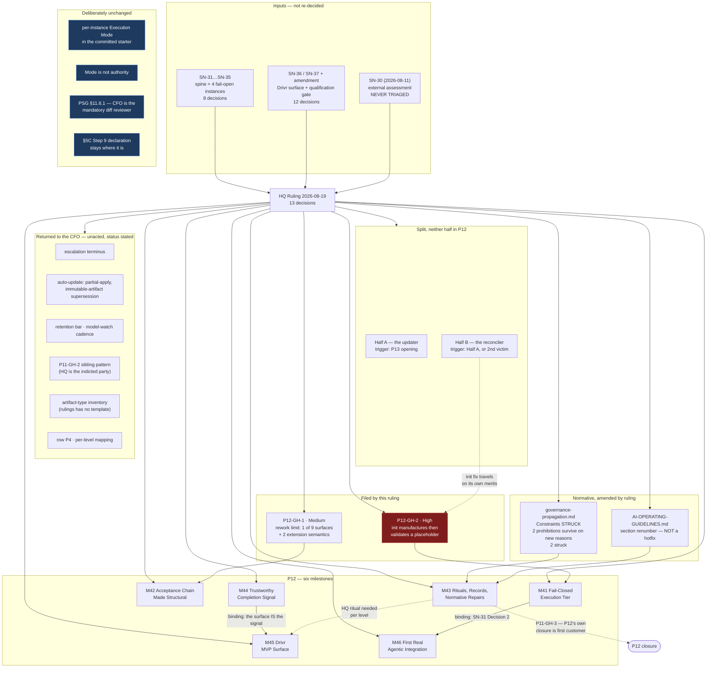

# HQ Ruling — P12 Opens on the SN-31 Spine; SN-30 Triaged at Last; `governance-propagation.md` Amended; a Fifth Fail-Open Instance Filed

**Steering Notes:** SN-31…SN-35 (2026-08-18, master `7af49f7`), SN-36/SN-37 with same-day amendment
(2026-08-19, master `8149bce`), and **SN-30** (2026-08-11), which is triaged here because SN-33
correctly reports that it was never triaged anywhere.

**Prerequisite verification (P9-M31-E31.3):** harness-reported model `claude-opus-5` vs
`.ai-project.yml` `models.hq: remote:claude-opus-5` — **match.** No mismatch; proceeding. HQ Chat is
manual-only, permanently (SN-22); no Execution Mode is declared or accepted.

**The twenty-three decisions across SN-31 and SN-36/37 are inputs, not proposals, and are not
re-decided here.** What HQ owes is the phase, the milestone shape, the placements, the constraints,
the two questions addressed to HQ directly, and the items that are the CFO's to keep.

---

## Decision 1 — P12 opens on the SN-31 spine, with six milestones

**Phase P12 — Completion: Fail-Closed Defaults and the Drivr MVP.**

- Spec: `docs/phases/P12__Completion_Fail_Closed_Defaults_and_the_Drivr_MVP/P12__phase-spec.md`
- Starter: `docs/phases/P12__Completion_Fail_Closed_Defaults_and_the_Drivr_MVP/P12__phase-execution-chat-starter.md`

| # | Milestone | Why it sits where it sits |
|---|---|---|
| **M41** | Fail-Closed Execution Tier | SN-31 Decision 2 makes it a **prerequisite of M46 by sequencing constraint**. It is also the only milestone with zero dependency on anything else in the phase. |
| **M42** | The Acceptance Chain, Made Structural | Changes **who holds authority**. Independent of M41 and M43/M44; parallel-safe. |
| **M43** | Rituals, Records, and the Normative Repairs | Adds the missing artifacts. **`P11-GH-3` lands here and P12's own closure is its first customer**, so it must complete before P12 closes. |
| **M44** | Trustworthy Completion Signal | Row 4 plus `P10-GH-7`. **Gates M45** — SN-36's two central behaviours *are* this signal. |
| **M45** | The Drivr MVP Surface | Built from SN-36's binding. Gated on M44 by construction, not by preference. |
| **M46** | First Real Agentic Integration | The phase's proof. **Gated on M41.** The reason the other five exist. |

**Two binding orders, and neither is stylistic:** `M41 → M46`, and `M44 → M45`. M42 and M43 are
independent of each other and of the M44/M45 pair.

**Six is more than P11's five, and HQ states the reason rather than leaving it to be inferred.** Four
of the six are small and bounded (M41, M42, M43 are corpus-and-`bin/` work with known contents); the
two with genuine uncertainty are M44 and M46. **HQ did not self-scope the spine** — it is SN-31's,
and the decisions inside it are the CFO's. The decomposition is HQ's own call and is the thing HQ is
for.

**`P11-GH-1` warning, recorded at the opening rather than at the post-mortem.** Mid-flight spec
amendments do not reach working branches; it fired **four times in P11**. P12 runs six milestones
with parallelism across three independent tracks. **The Phase Chat should expect it and say in its
own starter how an amendment reaches a running branch.**

---

## Decision 2 — The sequencing constraint is recorded as binding, and it binds M46 specifically

SN-31 Decision 2: the three execution-tier defects land **before the first real agentic integration,
not after** — a sequencing constraint, not a date.

**HQ makes that operative rather than aspirational:** **no epic in M46 may be dispatched agentically
until M41 is closed.** The constraint has a named gate instead of a hope. If M41 slips, M46 slips;
that is the intended behaviour and not a scheduling failure.

**Why the constraint is safe to state this strongly:** exposure today is genuinely low *because*
nothing runs agentically. All five instances go live simultaneously the moment one project does.
There is no partial-adoption path that reduces the risk incrementally.

---

## Decision 3 — A fifth fail-open instance is filed as `P12-GH-2`, severity High

**Found by HQ while scoping this phase**, by asking whether SN-31's four instances were the complete
set.

`bin/ai-project-init:328` reads the governance agent from a path **one `governance/` level short** of
where `add_governance_submodule()` actually puts it; the fallback at `:336` writes a 230-byte
placeholder; and the validation at `:348-353` — readable, non-empty, starts with `#` — **accepts the
placeholder it just wrote.** `tests/test_init_agent_path.py` invokes the script with
`--skip-submodule`, so the branch that would fail is unreachable under its own test.

**Two of this phase's instances are protected by their own tests** — this one and
`bin/ai-project-git-merge:447-460`, where a test asserts the `--admin` override succeeds against a
branch that returned *"Branch protected."*

**Severity High**, above `P12-GH-1`: it fires silently on every install, it is the **enrollment**
tier so every onboarded project inherits it, and **it already has a live victim** —
`social-stories-creator`, per P11's closure declaration.

**Placed in M41.** P11 carried this as an unnumbered inherited line (*"the two `bin/ai-project-init`
defects"*); it now has an ID, a stated mechanism, and an owner.

**HQ states its own verification boundary**, per `P11-GH-2`: the paths, the stub, the validator and
the test were **read** on `19c77ab`; the live victim is taken **from the record, not re-inspected**;
and **no end-to-end init was run.** M41 runs it. If that inference is wrong the finding shrinks to
the validator and the test, which are defects on their own terms.

---

## Decision 4 — `P12-GH-1` is filed for SN-32, separately from its fix, with two measurement corrections

Filed at
`docs/phases/P12__Completion_Fail_Closed_Defaults_and_the_Drivr_MVP/P12__carry-forward-note__P12-GH-1-rework-limit-reaches-one-surface.md`,
severity Medium, **placed in M42** — it is a governance-surface defect coupled to Decision 5's flip,
not an execution-tier one.

**Filing it separately from the consolidation is deliberate and is SN-32's own instruction:** the
consolidation is the fix, and a fix that gets deferred must not take the defect's record with it.

**Two of SN-32's figures did not survive HQ's re-measurement** (G2 — the reviewer re-measures):

1. *"The other six starter surfaces — 0 occurrences"* is wrong on one file.
   `governance/systems/hq-execution-chat-starter.md` has **two** occurrences of "rework" (L125, L364).
   **Neither states the limit**, so SN-32's substantive claim is untouched; its literal count is not.
2. **HQ enumerates nine starter-shaped surfaces, not eight.** SN-32's set is not itemized, so the two
   cannot be reconciled from the artifacts. **M42 must itemize the set it consolidates across**, so
   the next re-measurement is comparable.

**Neither correction changes what must be done**, and both are recorded rather than absorbed —
*"the count was inherited and not re-run"* is the named error class here, and a gap record is exactly
what a future reader re-cites.

**The second half of the defect postdates SN-32 and is added:**
`milestone-execution-chat-starter.md:334` says a written extension makes the limit *"reset"*;
SN-36/37's amendment grants **exactly one further attempt**. **M42 reconciles them into one
statement.** It does not leave both standing with a citation preferring the newer — that is the drift
condition, not a resolution of it.

---

## Decision 5 — SN-30 is triaged. Recs 1 and 2 are placed in M43; Recs 3, 4 and 5 are deferred with reasoning

**SN-33 is correct and HQ accepts the finding against itself.** SN-30 was filed 2026-08-11 with four
required HQ actions; a corpus search on 2026-08-18 found `SN-30` in exactly one file — its own. P11
closed six days later without mentioning it. **A Steering Note reached its target and left no mark.**

**HQ records what that is, because SN-33 named it correctly and it would be convenient to soften:**
this is the same fail-open disposition as SN-31, one tier up — in governance rather than in code. The
mechanism that carries concerns upward dropped one silently, and nothing detected the drop. **The
detector is that the Creation Chat looked. That is a person, not a mechanism.**

**Disposition:**

| Item | Ruling |
|---|---|
| **Rec 1** — mechanical checks for the four observed defects | **Placed, M43.** Pre-qualified and mechanical; the pattern exists here twice (`test_starter_lint.py`, `test_steering_note_id_uniqueness.py`). |
| **Rec 2** — promote **G1** and **G2** into the core documents | **Placed, M43.** They are general rules living in an epic spec, restated with re-explained provenance in E38.6. Every new epic must rediscover or re-cite them. Highest-value and most fragile is the combination that earns the pull-forward. |
| **Rec 3** — an observability tier | **Deferred**, and the reason is this project's own scar tissue. A normative observability requirement written before Drivr emits telemetry would record a rule whose trigger nothing produces — **exactly `P10-GH-7`**, which is still open and still High. E38.6 already requires all four fields per-epic by its own spec; **that is the pilot.** Codify after it produces evidence, as default-accept went from practice to PSG §11.6. *Trigger: Drivr emitting telemetry in M45.* |
| **Recs 4-5** — reduce exposition, then measure the reduction | **Deferred.** A phase-scale question, and a spine conversation rather than a milestone one. **HQ notes against itself that P12's own spec is 570 lines**, which is evidence for the recommendation, not against it. *Trigger: the next spine conversation.* |

**Recs 3-5 are recorded as deferred *with* their triggers precisely so they are not re-inherited as
open questions of unknown status** — which is what happened to SN-30 as a whole.

---

## Decision 6 — The AOG section-numbering repair does **not** clear SN-28's hotfix boundary. It goes in M43

SN-30 Carry-Over 2 flagged this for HQ to decide and correctly declined to assume it either way.

**The boundary is:** *adds or corrects mechanically-checkable structure, changes no normative text.*

**Renumbering fails it.** Every cross-reference by number changes, and cross-references are load-
bearing normative text — `§11.6`, `§11.6.1`, `§5C` and `§16.3` are cited across the corpus, the
starters and this ruling. A hotfix that silently invalidates citations is worse than the defect.

**Verified still live, 2026-08-19:** the order is `1, 1A, 2-9, 13, 14, 10, 11, 12, 13, 14, 16, 15`,
with **two sections both titled "Error Handling"** (L701, L861) — so a cross-reference by *title* is
ambiguous before numbering is even considered. **Ten phases without detection**, and the current
count is now eleven.

**M43 owns it**, with the cross-reference sweep as part of the same epic and an AOG version bump.

---

## Decision 7 — `governance-propagation.md` is amended. Its Constraints are false; two of its three prohibitions survive on new reasons; one does not

**SN-34 is upheld on measurement.** `governance/systems/governance-propagation.md` (status `active`,
v1.0.0) states as Constraints:

> *"HQ chats and related tools **do not** have live access to GitHub repositories"*
> *"No automatic synchronization or polling is **possible**"*

**Both are false as of 2026-08-19**, verified: this repository is operated through `gh` daily; B2.1
(P11-M37) gave the sandbox reachability to the host; **Drivr is a scheduler.**

**HQ rules on the substance, not only the wording**, because SN-34's real point is that three
prohibitions rest on an expired premise and would otherwise be measured against reasoning that no
longer holds:

| Statement | Ruling |
|---|---|
| Constraints, both lines | **Struck.** Replaced by a factual statement of current capability, dated, with the rule that a Constraints section carrying a technical claim is re-checked whenever the document is versioned. |
| *"Governance does not propagate automatically or implicitly"* | **Survives, on a new and better reason.** Not *because it is impossible* but **because adoption must be a project's own recorded decision.** Silent inheritance would make a project's ruleset change without any artifact in that project saying so — which is the fail-open disposition applied to governance itself. |
| *"Manual Enforcement: … not automation"* | **Struck as stated; replaced.** Enforcement by automation is now routine here — `test_starter_lint.py`, `test_steering_note_id_uniqueness.py`, the yml validator. The document contradicts the corpus. What survives is narrower and true: **automated checks do not confer acceptance**; a passing check is evidence, and a human or a governed parent still accepts. |
| Non-Goal *"No CLI or automation tooling"* | **Struck.** `bin/` exists, is documented in AOG and three guides, and is instructed to adopters. The Non-Goal was false when P6 shipped `ai-project-init` and has been false ever since. |
| Non-Goal *"No automatic or live governance syncing"* | **Survives, re-scoped and made honest.** It does not describe an impossibility; it records that **no such mechanism is authorized today**. SN-31 Carry-Over 9 contemplates one; see Decision 8. Written this way, a future proposal is measured against an authorization question it can actually answer, rather than against a capability claim that is simply wrong. |

**This ruling is required independently of whether governance auto-update is ever built**, exactly as
SN-34 argued. **M43 executes it**, with a version bump and a changelog row.

**HQ records the error class against itself:** this is `P11-GH-2`'s **time axis** — a claim verified
once and never re-checked, aged across at least four phases in the **normative** tier. The P11 record
already lists *"a technical note inherited from an opener and never checked against the running
version"* among HQ's own errors. This is that, one tier up.

---

## Decision 8 — Governance auto-update is **split**, and neither half enters P12

SN-31 Carry-Over 9 is fully specified and explicitly weighted *"nice if possible."* It carries its
own scope warning, and HQ acts on it: **"fix already-broken installs" turns an updater into a
reconciler, materially larger than the rest.**

**The split is ratified:**

- **Half A — the updater.** Opt-in; applies rather than notifies; runs at **Phase Chat start only**;
  authorized by the CFO and HQ through **Drivr's existing derived gate queue and signed one-time-link
  approval** — pointed at this, not rebuilt; the **pin** advances automatically while
  `framework_version` is written only after the roll-forward procedure completes; **fail-open on the
  check**, correctly, because the fallback is *no change*; rollback marks artifacts **superseded,
  never dropped**.
- **Half B — the reconciler.** Repairing already-broken installs across the fleet.

**Neither half is placed in P12**, and HQ gives the reason rather than the verdict alone: the phase
already carries six milestones including two with real uncertainty, the item is explicitly
opportunistic, and **Half A's own trigger is not ready** — it runs at Phase Chat start, so its first
possible customer is P13.

**One piece of Half B *is* in P12 and must not be mistaken for the rest of it.** SN-31 Carry-Over 9
states that already-broken installs are fixed *"and `bin/ai-project-init` is fixed with them, since it
hard-codes the path that produced FM 12's placeholder agents."* **That is `P12-GH-2`, and it is in
M41 on its own merits** — as a fail-open defect, not as a reconciler component. **Repairing installs
without repairing init re-breaks them on the next install**, which is the CFO's own reasoning and is
why the init fix goes first regardless of whether the reconciler is ever built.

**Recorded invariant, because it is the reason for Half A's schedule and not merely a consequence:
one phase, one governance version.** A phase runs start to finish under a single ruleset. It sidesteps
`P11-GH-1` at that tier by construction and makes rollback scoping tractable.

*Triggers:* Half A — the opening of P13. Half B — Half A landing, or a second live victim.

---

## Decision 9 — SN-35 is recorded at its corrected severity, and the ritual is placed in M43

**The correction is accepted as filed.** The Creation Chat corrected SN-35 in SN-36/37 and again in
the P12 opener, and HQ does not re-litigate it: the normative tier is silent (zero occurrences across
`hq-chat.md`, `hq-execution-chat-starter.md`, `templates/hq-chat-opener.md`), but
`.ai-project/artifacts/hq-openers/` holds **nine** instances with a stable type, filename convention,
schema and `supersedes:` chain. **The practice exists and is undocumented.** Severity **low**.

**The work is to record the ritual already being followed, not to design one.** The Creation Chat's
ritual (SN-26, canonized P11-M36-E36.3) is the model and the precedent.

**But HQ raises its priority above what "low" would suggest, for a reason SN-36 supplies:**
auto-opening a chat *"with the artifacts already applied"* **is this ritual executed by software.**
M45's surface needs one **per level**. So a low-severity documentation gap is a **prerequisite of a
milestone**, and M43 must complete the HQ ritual before M45 builds against it.

**HQ notes the finding's own best evidence, which is this opener.** A reader competent in the corpus
searched the normative tier, found nothing, and concluded the practice did not exist — while eight
instances sat in the artifact record. **An undocumented convention is one re-instantiation away from
being lost, and it just demonstrated exactly that.**

---

## Decision 10 — Drivr's surface is scoped from the binding, and three rules must be unrepresentable

**SN-36's visual binding is the input** (`https://claude.ai/code/artifact/688a152b-df5d-4882-b48f-26108200b92c`,
mockup, Creation level, `proposed`), recorded in the phase spec under §7's schema.

**HQ elevates one line of SN-36 from feature to design principle**, as that note invited: *UI
constraints to observe governance rules.* Today every rule in this framework is enforced by an agent
reading prose and choosing to comply. **A rule that cannot be clicked outranks a rule that is merely
written** — and that is SN-31's fail-open finding approached from the other side.

**M45's acceptance requires at least these three to have no representable control:**

1. No agentic option at Creation or HQ — manual-only, permanently (SN-22).
2. No Phase or Milestone dispatch control — **it does not exist**; the path is Epic-only (SN-31
   Carry-Over 1). An interface offering it would be the first surface in the system to imply a
   mechanism that has never been built.
3. No mode control implying merge authority — *"Mode is not authority."* **Kept deliberately though
   it never currently fires**, because under the near-term posture the only agentic level accepts
   nothing. It becomes load-bearing the moment the bar moves up, which is the stated goal.

**`undetermined` renders as its own board state**, per the CFO's decision, never folded into
`in progress` (the fail-open pattern drawn on a card) or `blocked` (which over-claims). **HQ records
the property that makes this right rather than merely safe:** M39 returns it on four cases of six, so
rendered visibly the board shows the size of the problem every day — which is the pressure that keeps
P12 honest. Hidden, the dashboard looks healthy while the signal beneath it is broken.

**M44 gates M45, and the gate is structural.** *"The chat must be where the attention should be"* and
*"a blocker makes it escalate and open a chat"* are **one requirement stated twice**: the window must
know, without the human, whether work is finished and whether it is stuck. Building the surface first
would produce a window confidently displaying a verdict the system cannot support.

---

## Decision 11 — SN-37 is placed in M45 **with its bar**, and the bar is not deferred to first use

**The gate converts `model-routing-policy.md`'s Change discipline from a prose obligation an agent
reads and chooses to honour into one that cannot be passed by intention alone.** It is Decision 10's
principle applied to model routing.

**The bar is set as part of the same work.** This is the whole point of the placement: *"retention bar
never set"* is already on the record as an open item, and a qualification suite without a threshold
reproduces that failure with more machinery around it. E35.5's result was usable **because** it
carried `PASS 4/5, 0 false alarms` in advance.

**The shape is the CFO's decision and HQ restates it as binding on M45:** relative and objective —
run the suite against the **incumbent** first; the candidate must be **no worse on every objective
check and strictly better on at least one**, over an absolute floor of **tool rounds > 0 and files
changed > 0**. **No subjective quality score** — judgment is precisely what cannot be trusted from the
thing under test.

**HQ adds one acceptance requirement of its own:** the suite must **flag both recorded historical
failures when replayed** — E33.2's 14b (exit 0, 0 tool rounds, 0 files changed) and E39.3's
dispatches (confident `VERDICT: PASS`, zero tool rounds, citing a config key the file does not
contain). **Both pass any subjective read. They fail only on counts.** A gate that cannot catch the
two failures this project has already suffered is not qualified to gate anything.

**Drivr is the runner** — run the suite, gate the swap, record the result. No inference of its own,
consistent with its charter.

---

## Decision 12 — Carry-forward triage

| ID | Disposition |
|---|---|
| **`P11-GH-1`** — mid-flight amendments do not reach working branches | **Open, and named as an active risk in Decision 1.** Not scoped as work: P12 runs three parallel tracks and will produce more evidence than a fix designed now would be based on. *Trigger: any parent amending a spec a child is executing.* |
| **`P11-GH-2`** — verification at the wrong layer | **Open.** Applied as a working obligation throughout this ruling (Decisions 3, 4, 7 each state their verification boundary). Whether it earns codification is Open Decision 4 and is **the CFO's**, not HQ's. |
| **`P11-GH-3`** — phase closure has no pre-merge artifact | **Placed, M43.** *P12's opening is its own first customer*, and P12's own closure is the first that must use it. |
| **`P10-GH-7`** — block detection untrustworthy both directions | **Placed, M44**, including the missing-Delivery-Notice branch the CFO arrived at independently. |
| **`P12-GH-1`** — rework limit reaches one surface | **Filed here. Placed, M42.** |
| **`P12-GH-2`** — init manufactures and then validates a placeholder | **Filed here. Placed, M41.** |
| **`P9-GH-3`, `P10-GH-1/3/4/6/8/10`, `P8-GH-2`** | **Restated as deferred with existing triggers, not reopened.** None is P12 scope on current evidence. |
| **llama.cpp / non-Ollama local runtimes** | **CLOSED by CFO decision, not parked.** Its hardware trigger is void; **no phase re-inherits it.** |
| **Push / WhatsApp** | Deferred, unchanged. |
| **Sidekick-for-external-projects** | **Brief-level identity question.** No phase inherits it as an unstated pivot. |

---

## Decision 13 — Seven items are returned to the CFO, unacted, with their status stated

**HQ places none of these, and the reason is stated per item rather than as a blanket.** SN-33's
lesson is that an item with no recorded disposition is an item that disappears.

1. **The escalation terminus** (SN-36/37 Carry-Over 1) — when a blocker reaches the top and cannot be
   resolved there, **nothing is above him** and the corpus has no name for that state. Park, file,
   rescope, kill: all plausible, none written. Rare; **P12 does not depend on it.** *Returned because
   it is a decision about his own role, which HQ cannot make for him.*
2. **Governance auto-update's two sub-questions** — what happens when an **apply** fails *partway*
   (fail-open was answered for the *check*; a half-applied governance is a state neither version
   defines), and whether *"mark superseded"* narrows for explicitly immutable artifacts (a Review
   Decision cannot be revised, but it can be annotated). *Returned as SN-31 assigns them.*
3. **The `local-agent-runner` retention bar** (Digest Open Decision 3) — the assessment was run and
   recorded in E38.4; **the bar was never set.** *SN-37's gate is the natural instrument; the number
   is his.*
4. **Model-watch cadence** (Digest Open Decision 3) — recorded as **never answered**; no watch is
   scheduled and **E35.5's harness remains available.** *Same instrument, same owner.*
5. **Whether the `P11-GH-2` sibling pattern earns its own record** (Digest Open Decision 4) — *a
   premise inherited from an input and not re-tested against the decision the artifact itself just
   made.* Two instances, **both HQ's**. **Left to the CFO deliberately: HQ is the party it indicts
   and must not be the one deciding it stays minor.**
6. **The artifact-type inventory** (Digest Open Decision 5) — `rulings` has **no template** despite
   being the most consequential class HQ produces, and `field-evidence` was minted by HQ in P11
   **without a template or an authorizing ruling**. **Both implicate HQ**, which is why HQ places
   neither unasked. *HQ notes it is issuing this ruling into an untemplated class.*
7. **`model-routing-policy.md` row P4** and **the per-level model/mode mapping** (SN-31 Carry-Over 8)
   — unchanged; his timing; *"a plan, not an indication that you have to configure everything right
   now"*, to be assessed and measured before adoption. **No configuration change is authorized by
   this ruling.**

**Also recorded, not returned and not scoped:** the **first external adopter, working in Spanish**
(SN-31 Carry-Over 6) — the first adoption outside the CFO's own fleet. The i18n **policy** is decided
and lands in M43 as one paragraph. **No i18n project is proposed.** The fact is on the record before
the phase is scoped, because a first outside user is evidence of a kind this project has never had.

---

## Note on the review diagram

`hq-chat.md` obliges a Structural diagram (Mermaid, fenced, no ComfyUI) with rulings that shape
normative work — showing what was touched, what was frozen, and where authority flowed.

---

## Disposition

**P12 is open.** The phase spec, the Phase Execution Chat Starter and two gap records are delivered
with this ruling.

**PSG §11.6.1 statement, made explicitly because it is easy to skip on an HQ-authored delivery:**
**this delivery has no chat-level reviewer.** HQ has no parent chat, and §11.6's default-accept is
only safe *because* a parent reviews. **The CFO is the mandatory diff reviewer for this PR, and
authorization is not review.** HQ must not merge it on authorization alone.

**What HQ owes and has now discharged:** the spine carried into a phase (SN-31 Next Action 1); the
four instances scoped as organizing evidence with the sequencing constraint binding (2); SN-32 filed
as a gap record separately from its fix (3); SN-30's four items actioned or deferred with reasoning
(4); the build items placed (5); `governance-propagation.md` ruled on (6); Drivr's surface scoped
from the binding with the signal as prerequisite (7); the rework-limit statements sent to M42 for
reconciliation rather than stacking (8); SN-35's correction accepted and its severity carried at low
(9).

**What HQ does not owe and has not taken:** the seven items in Decision 13.

**One open risk HQ names rather than resolves.** M46 is the only milestone whose success depends on a
real project having real work available at the right moment, and it is the milestone the phase exists
to reach. **If it cannot run, P12 will have tightened the foundations and still not used them** —
which is the outcome the spine was written against. HQ recommends the Phase Chat identify M46's
candidate project early, while M41 is still in flight, rather than at the point of dispatch.
