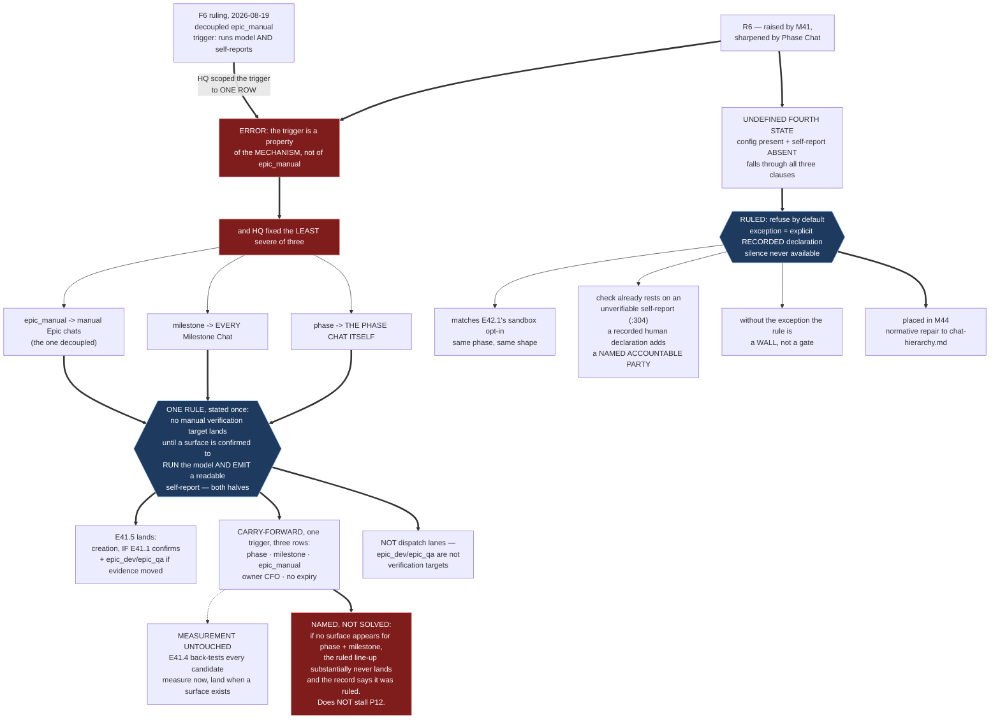

# HQ Ruling — R6: the F6 Trigger Is a Property of the Mechanism, Not of `epic_manual`. One Rule Replaces Per-Row Adjudication

**Prerequisite verification (P9-M31-E31.3):** harness-reported `claude-opus-5` vs `.ai-project.yml`
`models.hq: remote:claude-opus-5` — **match.** Proceeding.

---

## Decision 1 — R6 is upheld, and it is a correction to HQ's own F6 ruling

**The escalation is right.** HQ re-measured both of the Phase Chat's findings on `master` at
`f504be2` and both hold verbatim:

- **`chat-hierarchy.md:298`** — *"The only observed mechanism by which a chat can know what model it
  is currently running on is the harness's own self-report: **this repository's harness (Claude
  Code)**…"*
- **The fourth state is undefined.** The document defines exactly three: both present and agree →
  proceed; **both present** and disagree → refuse unconditionally (`:322-335`, and the clause says
  *"both present"* in terms); config side absent → explicit permissive default (`:309-321`, and that
  section is explicitly about the **config** side — *"there is no configured expectation for this
  level to verify against"*). **Config value present + harness self-report absent falls through every
  branch.** Every occurrence of "self-report" is at `:298`, `:301`, `:304`, `:328`; none covers it.

### What HQ got wrong, stated plainly

**The F6 ruling identified the right mechanism and mis-scoped it to one row.** Its trigger —
*a surface that runs the model **and** self-reports an identity the E31.3 check can read* — was
written as a property of `epic_manual`. **It is a property of the verification mechanism**, and the
mechanism is identical for all five manual verification targets. The Phase Chat's statement of this
is exact and HQ adopts it.

**And HQ fixed the least severe of the three.** By blast radius:

| Row | What halts when it lands unverified |
|---|---|
| `epic_manual` | Manual **Epic** chats — **the one HQ decoupled** |
| `milestone` | **Every Milestone Chat** — M43, M44, M45, M46, M47 |
| `phase` | **The Phase Chat itself** — all remaining milestone planning |

**F6's own reasoning was that "a terminal epic that disables the execution of the four milestones
after it is not a scheduling detail."** That reasoning applies with more force to `phase` and
`milestone` than to the row it was applied to. **M43-M47 each require a Phase Chat and Milestone
Chats, not only manual Epic chats.**

**And E41.5's Definition of Done does not cover it.** The DoD discharges the halt by **notifying**
the armed levels, which presumes a notified level can then open on the new model. **Notification does
not supply a surface.** For two of three rows that presumption is unverified.

---

## Decision 2 — One rule, stated once, replacing per-row adjudication

**The Phase Chat's warning is adopted: do not resolve this a third time.** `phase`, then `milestone`,
then whatever P13 moves, is the pattern `P9-GH-1` describes — a rule rediscovered per instance
because no surface states it generally.

> ### The manual-surface rule
>
> **No `.ai-project.yml` manual verification target may land a new value until a surface for it is
> confirmed to (a) run that model **and** (b) emit a self-report the E31.3 check can read.**
>
> **Both halves are required.** A surface that runs the model and reports nothing fails the check as
> surely as one that reports the wrong string — and, until Decision 3, fell into an undefined state
> rather than a defined refusal.
>
> **Scope: the five manual verification targets** — `creation`, `hq`, `phase`, `milestone`,
> `epic_manual`.
>
> **Explicitly NOT the dispatch lanes.** `epic_dev` and `epic_qa` are not verification targets — the
> spec says so in terms (*"Agentic dispatch lane only — not a manual-chat verification target"*).
> **They land on E41.3's evidence alone and this rule does not touch them.**

**Applied to E41.5 as it now stands:**

| Key | Disposition |
|---|---|
| `creation` → fable-5 | **Lands if confirmed.** `claude-fable-5` appears in this harness's roster — **suggestive, not confirmation**, and E41.1 confirms rather than assumes. Most likely of the three to clear, being Claude-family. |
| `phase` → GPT-5.6 Sol | **Carry-forward.** No surface identified. |
| `milestone` → Deepseek V4 Flash | **Carry-forward.** No surface identified. |
| `epic_manual` → `local:qwen3.8:27b` | **Carry-forward** — unchanged from F6, now under this rule rather than its own. |
| `hq` | Unchanged; the rule is moot for it. |
| `epic_dev` / `epic_qa` | **Out of scope.** E41.3's evidence governs. |

**F6's `epic_manual` carry-forward is subsumed, not superseded.** Its trigger was correct; it is now
**one trigger covering three rows** instead of three triggers discovered one at a time. **Owner
remains the CFO.** **No expiry, and explicitly not at P12's close** — riding any of them to closure
relocates the halt into P13.

**The row values are not re-decided.** The line-up is the CFO's. Row P4's closure stands as a
decision. **Only the landing is gated**, and it is gated on a fact about surfaces, not on a judgment
about models.

### The consequence HQ names rather than discovers

**If no surface materializes for `phase` and `milestone`, the ruled line-up substantially never
lands, and the record will say it was ruled.** That is a larger open item than F6's was, and it is
the CFO's. **It does not stall P12** — the phase's remaining work needs no row to land, and the
measurement obligation is untouched — but it means M41 may close having produced evidence and landed
one key.

**E41.4 still back-tests every candidate**, `qwen3.8:27b` included. **Measure now, land when a
surface exists.** That is the CFO's collect-early direction honoured exactly.

---

## Decision 3 — The undefined fourth state is ruled, and placed in M44

**Recorded independently of R6's disposition, because the Phase Chat is right that it deserves
attention on its own.** *In a phase organized around "when the evidence that should gate an action is
absent, the action proceeds", an undefined branch in the framework's only fail-closed manual check is
a finding.*

**The ruling: refuse by default; proceed only on an explicit, recorded declaration.**

- **Config value present + harness self-report absent → the chat MUST NOT silently proceed.**
- **The single exception:** a human may declare the running model explicitly, and the chat **states
  that declaration in its first substantive response** — that it proceeded on a declared rather than
  self-reported identity, and what was declared. **Silence is never available.**

**Two reasons, and the second is the one that makes this more than caution.**

**It matches the phase's own answer one tier down.** M42's E42.1 resolves the sandbox-absent case as
*abort, or an explicitly declared and recorded opt-in whose run record states it was taken.* **Same
shape, same phase, same disposition** — an unrecorded fallback is a fallback with extra steps.

**And the declaration is not epistemically weaker than what the check already accepts.**
`chat-hierarchy.md:304` states the known limit itself: the self-report is *"a harness-provided
self-report, not an independently, cryptographically verifiable fact. The chat has no mechanism to
confirm the string the harness gave it is accurate."* **The check already rests on an unverifiable
assertion.** A recorded human declaration is the same epistemic strength **with a named accountable
party** — which is stronger, not weaker, in the only dimension that differs.

**The bootstrap consequence, named so M44 handles it rather than meeting it:** without this
exception, a surface that never self-reports could **never** open a manual chat at any level with a
configured model — which would make the manual-surface rule unsatisfiable by construction for exactly
the surfaces it exists to admit. **The exception is what keeps the rule a gate rather than a wall.**

**Placed in M44** — Rituals, Records, and the Normative Repairs. It is a normative repair to
`chat-hierarchy.md`, and it sits beside the `governance-propagation.md` amendment and the AOG
renumber. **M44 writes the wording; the disposition is ruled here.**

**Note for M44, from the Phase Chat's second measurement:** of the five manual verification targets,
**three ultimately move off the only harness where this check has ever been observed to work**
(`:298`). The repair should be written for a corpus in which Claude Code is one surface among
several, not the assumed one.

---

## Decision 4 — Consequential edits, and what is NOT changed

**M41 amends** — through its own `P11-GH-1` channel, which fired correctly for the F6 ruling and is
now on its second live test:

1. **E41.5's deliverable 1** — `creation` only among the verification targets, conditional on E41.1's
   confirmation; `phase` and `milestone` join `epic_manual` as carry-forwards, all three under the
   single rule in Decision 2.
2. **E41.1** — its confirmation obligation now covers **both halves** for every moving target: runs
   the model, **and** emits a readable self-report. R6 already records this; make it an acceptance
   criterion.
3. **Row P4's recording is M41's design call, under one binding constraint.** The CFO's closure of
   row P4 stands as a decision while `milestone` has not landed. **How the policy records a decided
   row whose value has not been configured is M41's to work out** — the phase starter puts
   spec-level design decisions at that level. **The constraint that is not M41's:** the three
   divergence guards in `tests/test_model_config.py` **stay green and are not weakened.** They exist
   to stop two files disagreeing, and a decision recorded in a way that makes them disagree has
   recorded it wrongly.
4. **E41.5's DoD notification obligation shrinks again** — and M41 already caught HQ once on this
   exact clause. Write it from the rows that actually land.

**NOT changed, and HQ states it because an escalation of this size invites drift:**

- **The line-up values.** The CFO's.
- **Both of E41.5's gates.** M42 closure, and every moving row having passed its harness or been
  returned with the CFO's decision.
- **The measurement obligations.** E41.2, E41.3 and E41.4 are untouched. **A row that will not land
  is still measured.**
- **The epic set.** No epic added or removed, in M41 or anywhere.
- **M42.** Wholly unaffected.

---

## Decision 5 — The Phase Chat's own calls are acknowledged, not reviewed

**E41.1's Stage-1 set accepted by the Phase Chat** (spec `8d4ac02`, starter `e1346a5`), with R4/R5/R3/R7
re-measured and Drivr's `opencode.py:177` guard confirmed at Drivr HEAD `f60164c`. **That is the Phase
Chat's acceptance to make and HQ does not re-review it.**

**M41 Stage-1 delivering as one PR to `phase/P12`, opened now rather than at set completion** — also
theirs, and **correct.** HQ's process note covered milestone planning artifacts and did not reach
epic sets; the M41 chat was right that it did not. Opening early applies the #218/#219 lesson
directly: **before those PRs existed the CFO could not find a 973-line delivery he had been asked to
review.**

**R6 is durably recorded** at E41.1's spec `§R6` (`:159`) before being routed. **That is SN-30's
failure mode addressed by construction** — a concern that reached its target and left no mark. This
one cannot evaporate if the message is lost.

---

## Note on the review diagram

---

## Disposition

**R6 upheld.** The F6 ruling is **corrected in part**: its trigger stands, its scope was wrong, and
its `epic_manual` carry-forward is subsumed into one rule covering three rows.

**Decision 2's manual-surface rule is the durable output** — the thing that stops this being
adjudicated a third time.

**Decision 3 is ruled and placed in M44**, independently of R6's disposition.

**Nothing blocks.** E41.1 proceeds; its D2 Part B converts the question into a measurement, which is
the right shape and was the Phase Chat's design, not HQ's.

**PSG §11.6.1:** HQ-authored, **no chat-level reviewer.** The CFO is the mandatory diff reviewer;
authorization is not review. **He should read Decision 2's consequence paragraph in particular** —
it is the one that may leave his ruled line-up largely unlanded, and it is his to answer.
