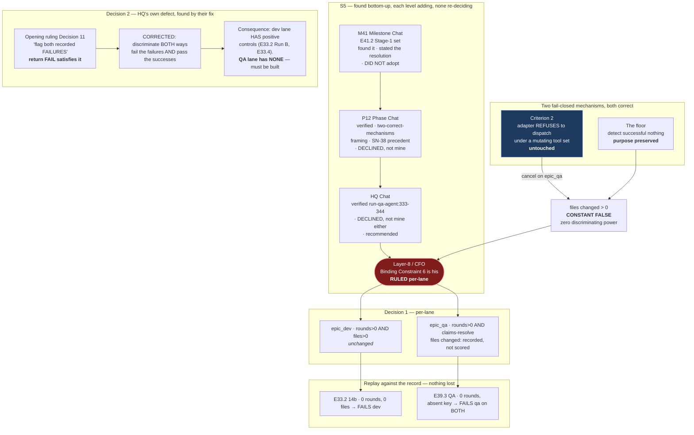

# HQ Ruling — S5: The Qualification Floor Is Per-Lane, by CFO Decision; and Decision 11 Carried the Defect It Was Written to Prevent

**Prerequisite verification (P9-M31-E31.3):** harness-reported model `claude-opus-5` vs
`.ai-project.yml` `models.hq: remote:claude-opus-5` — **match.** Proceeding.

**Two things are decided here and they have different owners.** Decision 1 is the **CFO's**, taken on
2026-08-20 after HQ put the question to him with a recommendation. Decisions 2 through 5 are HQ's.

---

## The finding, verified

**`bin/run-qa-agent:333-344`** does not merely ship a read-only tool set. **It refuses to dispatch**
if `write_file`, `edit_file`, `git` or `run_command` appear in the enabled set, and says why:

> *"Criterion 2, enforced here as well as advertised there: the adapter refuses to dispatch under a
> tool set that could mutate the tree, so the guarantee does not depend on the QA tool set staying
> read-only after this epic ends."*

Verified verbatim by HQ on `milestone/M41`, 2026-08-20.

**So `files changed > 0` on the `epic_qa` lane is not improbable. It is unreachable by
construction.** Applied literally, every candidate fails that row, and the result is a measurement of
the harness rather than of the model.

**The M41 Milestone Chat's diagnosis is correct: this is M40's F5 one level down.** A read-only run
scored by a rule that only recognises effects returns the wrong verdict, and more evidence makes it
worse.

**The Phase Chat's sharpening is the part that determined the shape of this ruling, and HQ adopts it
in full:** these are **two fail-closed mechanisms, both correct, that cancel.** Criterion 2 — a QA run
must not mutate the tree — is exactly the class of guarantee P12 exists to build. The floor —
detecting successful nothing — is exactly the class of detector P12 exists to build. **Repairing this
by weakening either would be the wrong repair, and HQ would have refused any resolution that did.**

---

## Decision 1 — The floor is PER-LANE. CFO decision, 2026-08-20

| Lane | Floor |
|---|---|
| **`epic_dev`** | `tool rounds > 0` **AND** `files changed > 0` — **unchanged** |
| **`epic_qa`** | `tool rounds > 0` **AND** `claims resolve against files that exist`; **`files changed` recorded but not scored** |

**Why this is the CFO's decision and not HQ's application detail.** Binding Constraint 6 is his,
ratified in SN-36/37, and the phase spec lists it among the decisions not to re-examine. **The Phase
Chat declined to adopt the per-lane form for exactly that reason and routed it. HQ stands in the same
relation to that constraint and declined for the same reason.** Adopting it quietly as an
"application detail" would have been the silent re-decision this phase exists to prevent — and would
have been HQ doing it in the phase whose organizing finding is that systems proceed when they should
stop.

**The reasoning HQ put to him, recorded because the decision should be auditable against it:**

1. **`files changed > 0` on `epic_qa` is not a strict bar. It is a constant false.** A check that
   returns the same answer for every candidate has **zero discriminating power**. It cannot separate
   a good model from a bad one, which is the only thing a bar is for.
2. **The floor's purpose survives intact.** `files changed` was the **dev lane's proxy for "it
   actually acted."** On a lane forbidden to write, acting **is** reading and grounding — measured by
   `tool rounds > 0` and `claims resolve`. **This does not lower the bar; it stops applying the dev
   lane's proxy to a lane that cannot express it.**
3. **It loses nothing against the record.** E39.3 — the project's only captured `epic_qa` run and its
   only recorded fabrication — returned `VERDICT: PASS` with **zero tool rounds, citing a
   configuration key the file does not contain.** It fails `rounds > 0` **and** fails `claims resolve`,
   independently. E33.2's 14b (exit 0, 0 rounds, 0 files) still fails both dev-lane checks.
   **Every recorded historical failure still fails.**
4. **Ratified precedent exists and it is his own.** SN-38 ruled two harnesses *"because the checks do
   not transfer"* — lanes qualified by detecting successful nothing, verification targets by detecting
   failed judgment. **S5 is that same principle one level finer**, inside the dispatch-lane category,
   between a lane that writes and a lane that is forbidden to.

**Criterion 2 is untouched and must stay untouched.** The adapter's refusal is not collateral damage
to be worked around; it is the guarantee. Any future proposal that reaches this floor by enabling a
mutating tool on the QA lane is refused in advance.

---

## Decision 2 — Decision 11 of the opening ruling is CORRECTED: it required negative controls only

**HQ's own artifact carried the defect the Phase Chat had just found in its own, and it was found by
their fix rather than by HQ's review.**

Opening ruling, Decision 11, as issued:

> *the suite must **flag both recorded historical failures when replayed*** — E33.2's 14b and E39.3's
> dispatches.

**`return FAIL` satisfies that in full.** An always-failing instrument flags both, then fails the
incumbent and every candidate, and M41 concludes on a bar nothing can clear. **A detector with no
negative control is not a detector** — the M41 Milestone Chat's phrasing, corrected in their E41.2
acceptance criterion at spec v1.2.1 (`04999d6`), and it applies verbatim to Decision 11, which governs
**M46's** gate and has stood since the phase opened.

**Corrected requirement, replacing Decision 11's acceptance sentence:**

> The suite must **discriminate in both directions**. It must **fail** the recorded failures — E33.2's
> 14b (exit 0, 0 rounds, 0 files) and E39.3's dispatches (`VERDICT: PASS`, 0 rounds, citing an absent
> key) — **and pass** the recorded successes. **Neither half alone is sufficient**, and an instrument
> satisfying only one is rejected regardless of which.

**A consequence of Decision 1 that must not be discovered mid-run.** The **dev lane has positive
controls on record** — E33.2 Run B and E33.4, both mergeable work, both committed here. **The QA lane
has none.** E39.3 is the only captured `epic_qa` run in the project's history and it is a failure. So
the QA-lane instrument's positive control **must be constructed rather than drawn from the record**,
and constructing it is part of the instrument's work. **An instrument validated only against failures
on that lane has not been validated.**

---

## Decision 3 — The interim handling is ratified; E41.3's reading of the Hard Constraint is confirmed

**The Phase Chat's interim handling was correct and needed no ruling to begin:** build the instrument,
measure the `epic_dev` baseline unaffected, record every raw count for `epic_qa`, **withhold the
`epic_qa` verdict.** Ratified as issued. It is a process call at the right level.

**E41.3 may not apply a floor that is under escalation.** The Hard Constraint requires the bar
committed **before** the run it judges, and **a bar under escalation is not committed.** The Phase
Chat read this correctly and stopped at exactly the right line — planning proceeded, execution did
not. **With Decision 1 issued, the floor is committed and E41.3 is unblocked.**

**`epic_dev` was unaffected throughout** and no work on it was ever gated by this.

---

## Decision 4 — The escalation route is working, and HQ records why rather than assuming it

**S5 travelled Epic → Milestone → Phase → HQ → CFO and back, with each level adding something and
none of them re-deciding above its station.** The M41 Milestone Chat found it and **stated the
obvious resolution explicitly so the escalation was answerable, while explicitly declining to adopt
it.** The Phase Chat verified, supplied the two-correct-mechanisms framing and the SN-38 precedent,
and **declined for the same reason one level up.** HQ verified the adapter, declined again, and put
it to the CFO with a recommendation.

**Three levels in sequence identified a resolution they had the competence to apply and the standing
not to.** That is the behaviour SN-25's one-level escalation was written for, and it is the first
time in this project's record that it has run end-to-end on a decision none of them owned.

**Recorded because P12's thesis is that systems proceed when they should stop.** This is the same
disposition inverted, and it is worth knowing the chain can do it.

---

## Decision 5 — The `P11-GH-1` channel is a CARRIER, not a detector. HQ's earlier characterization is withdrawn

HQ wrote that the M41 mitigation *"fired correctly"* and called it the first time in twelve phases the
gap closed **by mechanism rather than by someone noticing.** **The Phase Chat's account is more
accurate and HQ adopts it.**

Across two exercises: the first had **no addressee**; the second had an addressee who had **already
collided with the amendment about ten minutes before the notification drained into its session.**
**The notification's real contribution was naming the six changed sections**, which is what made a
targeted re-read possible instead of a blind diff. That is real and it is narrower than "it fired."

**Nothing in this project has yet DETECTED a mid-flight amendment as a mechanism.** The channel is a
**carrier**, twice confirmed. **`P11-GH-1` stays open and unscoped** — Decision 12 of the opening
ruling is unchanged — and the unowned half is now sharper than when it was filed:

> **Nothing tells a reader that their view of a branch is behind, and that includes HQ.**

HQ demonstrated this within the hour of the Phase Chat writing it, by asserting a branch-staleness
measurement re-used from earlier in the session without re-running it — `P11-GH-2`'s time axis, in the
session that had been citing that discipline at other people. **If a remedy is ever scoped, "who is
looking at a stale branch" belongs in it beside "which branch is stale."**

---

## Note on the review diagram

---

## Disposition

**S5 is resolved. E41.3 is unblocked.** The floor is committed, so the Hard Constraint is satisfied
and E41.3 may apply it.

**Actions, by owner:**

| Owner | Item |
|---|---|
| **M41 Milestone Chat** | Apply the per-lane floor in E41.2/E41.3. **Build the QA lane's positive control** — the record has none. |
| **P12 Phase Chat** | Amend M41's spec through the `P11-GH-1` channel. Re-sync the four branches once this merges. |
| **HQ** | Decision 11 is corrected here; **the opening ruling is not rewritten.** It was correct in intent and wrong in form at its date; this ruling is the amendment of record. |
| **CFO** | Nothing. Decision 1 is his and is taken. |

**PSG §11.6.1:** this delivery is HQ-authored and **has no chat-level reviewer.** The CFO is the
mandatory diff reviewer; **authorization is not review**, and HQ must not merge it on authorization
alone. **Note the boundary precisely: he decided Decision 1 as its owner. That is not review of this
artifact**, and the two must not be collapsed — which is the distinction §11.6.1 exists to draw.
