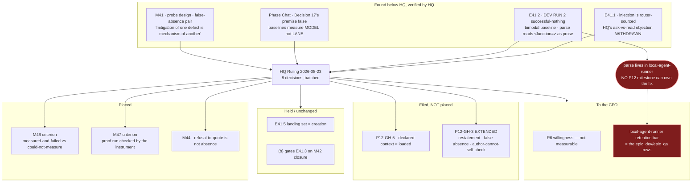

# HQ Ruling — Batched P12 Dispositions: R6 Held, Decision 17 Falsified, Two Acceptance Criteria Placed, `P12-GH-5` Filed, and the Parse Located in a Third Repository

**Prerequisite verification (P9-M31-E31.3):** harness `claude-opus-5` vs `models.hq:
remote:claude-opus-5` — **match.**

**Batched deliberately.** The CFO asked HQ to stop spending one governance PR per disposition. **Eight
dispositions accumulated over four days; this is one artifact rather than eight.** Nothing in it was
urgent and all of it was living in a chat's context — **which this phase has now watched fail three
times**: SN-30 dropped for a week, a deferral whose trigger was a session's own continued existence,
and `#226`'s near-merge.

**`blocking_resolved: false`** — two items remain the CFO's and are named in Decision 8.

---

## Decision 1 — R6's carry-forward trigger is NOT met, and the reason narrowed twice

**Trigger:** *a surface exists that **runs that model** and **emits a self-report the E31.3 check can
read**.*

| Half | Status |
|---|---|
| Runs the model | **Met**, comprehensively (E41.1) |
| Emits a readable self-report — **mechanism** | **Met.** Verified by HQ in the binary |
| — **delivery to a session** | **Met.** Verified by probe |
| — **fidelity** | **UNMEASURED, with a demonstrated failure against it** |

**HQ withdrew its own first objection.** I ruled the mechanism was *ask*, not *read* — that OpenCode
returned a model's claim about itself. **Wrong.** `~/.opencode/bin/opencode`, `SystemPrompt.environment`:

```
`You are powered by the model named ${i.api.id}. The exact model ID is ${i.providerID}/${i.api.id}`,
"Here is some useful information about the environment you are running in:",
"<env>", `  Working directory: ${h.directory}`, … "</env>"
```

**Router-sourced, injected, structurally the same artifact as Claude Code's `# Environment` block.**
And **exactly one call site in the binary**, inside the session message-processing path — so `run` and
the interactive TUI both traverse it. **There is no second path to skip it.**

**Delivery proven by the P12-M41 chat's probe design, which is the part worth keeping:** *test the
part of the injection that cannot be confabulated, not the part that can.* Asking a session its model
name is weak — that string is exactly what a model produces from training. **The same block carries
`Working directory`.** Run from an unguessable path, the session returned the UUID and random suffix
**exactly**.

**But it returned the prefix wrong, and not randomly.** It received Claude Code's mangled directory
encoding and **reconstructed it into a well-formed-looking path.**

> **Delivery is confirmed. Fidelity is not. The session received the block and reported it
> inaccurately — silently, plausibly, and in a direction that made the answer look MORE correct.**

**Two readings remain open and HQ does not choose between them:** the transformation may be
**model-side** (it normalized a malformed-looking string) or **injector-side** (`h.directory` already
held the transformed value). **The second is materially worse — the identity line ships in the same
block, so no model-side check could detect it.** The control is specced as E41.4's D7: run the
identical probe from a **well-formed** unguessable path.

**Binding on E41.5 regardless of how the CFO answers the willingness question:**

> **The landing requires the check exercised on the interactive path with the actual target models.
> Arming a fail-closed check against a property that has only ever been observed to fail is worse
> than not arming it.**

**Landing set stays `creation`. E41.5 deliverable 1 unchanged.**

**What remains is not measurable and is the CFO's:** whether he is willing to drive a Phase Chat and a
Milestone Chat inside OpenCode. **HQ nearly commissioned a TUI test that would have produced a fact
answering a different question.**

---

## Decision 2 — Decision 17 of the opening ruling rested on a premise that does not hold. Corrected, and the Phase Chat's consequent ruling is UPHELD

**Decision 17 said:** *"A qualification run dispatches through the agentic lane, and M42 is repairing
that lane — but Docker is present on this host, so `bin/ai-project-orchestrator:393-397`'s unsandboxed
fallback will not fire. The dependency is real and non-blocking."*

**E41.2's runs never invoked the orchestrator.** Docker was present at `29.7.2` and **prevented
nothing, because the code path that would have used it was never entered.**

**Both halves fail, and the order of importance is the Phase Chat's:** the Docker clause was **inert**;
**the premise in front of it is the finding.** *If a qualification run does not dispatch through the
lane, it is not qualifying the lane.* **A conclusion may survive a falsified reason; the reason does
not become true by having supported it.**

**The Phase Chat's ruling is UPHELD, unmodified:**

> **E41.2's baselines are valid measurements OF THE MODEL. They are not measurements OF THE LANE. A
> lane row may not move on evidence gathered outside the lane.**

**It reached that by the boundary HQ set on T3 and S5, applied to HQ's own gap:** the CFO enumerated
**the bar**; SN-38 enumerated **what is measured** and **when it may land**; **nobody enumerated the
environment — HQ assumed it and did not state it.** Supplying an unenumerated term belongs to the
level that owes it. **The boundary does not stop applying when the gap is HQ's.**

**Its closing argument is what makes it binding rather than merely reasonable:** post-M42 the lane is
sandboxed by construction, so **a row qualified on host evidence is qualified in an environment the
repaired lane will never use.** *A model change landing with a lane repair makes the next failure
unattributable* — **a model qualified off-lane and landed into a repaired lane is unattributable
identically**, with the M42 gate honoured in letter and defeated in purpose.

**Three limits, restated so the ruling is not read as harsher than it is:** the baselines are **not
void**; **DEV RUN 2 survives entirely** as evidence about the model and the parser; and **holding
`epic_dev`/`epic_qa` is not a failure** — SN-38 already makes hold the default.

---

## Decision 3 — M41's four carried items, disposed

| Item | Disposition |
|---|---|
| **Second context overpack** — `llama3.1:8b` declares 131072 against 32768 loaded | **Filed as `P12-GH-5`, Medium, NOT placed.** See the note. **The epic escalated rather than self-allocating; that was the rule working.** |
| **Drivr's `XDG_DATA_HOME` trap** | **Placed: M46**, as the rationale for Decision 4's criterion. See below. |
| **A refusal to quote is not an absence** | **Recorded, routed to M44.** Both remote targets refused *"quote your instructions"* while answering the identity question immediately. **A check phrased as quotation fails closed against a fully compliant target** — which bears on how E41.5 arms these rows and on M44's repair of the undefined fourth state. |
| **`.ai-project.yml` cannot express the provider** | **Recorded, no action.** `deepseek-v4-flash` resolves via both `opencode/` and `opencode-go/`, so `remote:deepseek-v4-flash` records **which model, not which route.** E41.1's record §9.5 is the only artifact carrying the route; **E41.5 cites it rather than restating it** — which is correct under Decision 6's copy-rot finding. |

---

## Decision 4 — M46 gains one acceptance criterion. The P12 Phase Chat's scope judgment, accepted

> **The qualification runner must distinguish *"measured and failed"* from *"could not measure"*, and
> record which.**

**Accepted because it is a property the gate must already have, not an item beside it**, and the
connecting argument is the Phase Chat's:

> **SN-37's gate exists to detect *successful nothing*. This defect IS successful nothing — in the
> gate's own infrastructure.**

**Drivr's `OpenCodeAdapter` sets `XDG_CONFIG_HOME` and never `XDG_DATA_HOME`. The half that decides
whether it bites is `environments.py:175-176`** — `merged = dict(os.environ); merged.update(env or {})`.
**The variable is INHERITED, not unset, and unset would have been safe**, because OpenCode falls back
to the real store. **Three independent reproductions, none deliberate.** *The confined case is what
you get by not doing anything special* — **that makes it a default, not an accident.**

**Bounded on the test the Phase Chat used to refuse `P12-GH-3`:** one criterion, on a component M46 is
already building, using a repair shape ratified five times here — S3's unloadable replay case, R6a's
undefined fourth state, the tie-break's empty, `undetermined` as a board state, E41.4's zero
credentials. **Nothing is invented.** `P12-GH-3` needed a convention *plus* an enforcement mechanism
nobody has designed; this does not.

**And the second worked instance is what earns a criterion rather than a note:** M40's gate-queue
silent omissions had no partner in another subsystem. **Two instances, two subsystems, one shape — the
natural implementation fails quietly, and the failure wears the costume of a correct answer.**

---

## Decision 5 — M47 gains one acceptance criterion, and it protects the phase's proof from the phase's own defect

**M47 dispatches through orchestrator → `run-dev-agent` → `local-agent-runner` → the parse. M47 is
gated on M42. M42 does not touch the parse.**

> **So M47's gate does not protect M47 from the one failure mode that would invalidate it. The phase's
> proof could be an instance of the phase's organizing defect, and the gate would pass it.**

**The criterion:** the proof run is **checked by `bin/successful-nothing-instrument`**, and its run
record carries **tool rounds, files changed and claims-resolution** rather than an exit status.

**The Phase Chat's reframing is what is actually placed:**

> ***"A real epic ran agentically end to end" is not the claim. The claim is "a real epic ran
> agentically end to end AND WE CAN SHOW IT DID WORK."***

**That is not a hypothetical risk. Three recorded runs satisfy the first and fail the second** —
E33.2 Run A, E39.3, and E41.2's DEV RUN 2. **It is the modal outcome of this project's agentic
dispatches to date.**

**Cheap and self-contained:** `bin/successful-nothing-instrument` and its tests are already on
`milestone/M41`. **It requires nothing outside this repository** — not the parse fixed, not the
retention bar set. **It requires M47 not to trust the lane's own report of itself.**

---

## Decision 6 — `P12-GH-3` is extended, not rewritten. Three additions, all from below

See the note. Summarized because the summary is the part a future reader needs:

1. **The restatement variant.** The amendment had **arrived** and was tracked on the branch; a chat read
   a surface that **restates** the rule instead of the corpus that holds it. **Nothing was stale.**
   **And it constrains M43's remedy:** *the restatement is not optional — `P12-GH-1` is why it exists.*
   **The mitigation for one defect is the mechanism of another.**
2. **False absence.** *A false positive announces itself; a false absence looks like a clean result.*
   **HQ committed this while filing the note** — a literal grep scoring 0 against `accepted **by
   silence**`, defeated by emphasis and by a line wrap. **Markdown emphasis mid-phrase is a fifth
   variant of the corpus's own pattern-matching trap, and the nastiest: the rendered text reads
   perfectly.**
3. **The constraint that outranks the instances.** *Whatever this project builds to catch
   premise-dependents, it should assume **the author cannot run it on themselves**.* **Nine instances,
   four levels, every one caught downstream, none by a check. Four are HQ's own** — including one where
   **HQ misread a gate in a spec HQ wrote.**

---

## Decision 7 — The `<function=…>` parse is in a third repository. This is routed to the CFO, not placed

**Measured by HQ, because it is a fact rather than a disposition and it was unowned:**

- `bin/run-dev-agent` is a **shim**. `discover_runner()` returns `local-agent-runner` — env override,
  else the binary on PATH, **config error if absent**. It then `subprocess.run`s it.
- **`<function=` appears nowhere in `bin/` or `drivr`.** The only `bin/` file mentioning tool-call
  parsing is `successful-nothing-instrument` — **E41.2's own new instrument.**
- **`origin/milestone/M42`'s spec scores zero for `parser`, `parse` and `function=`.**

> **The parse happens inside `local-agent-runner`, a different repository. M42 could not repair it even
> if it were scoped there, and no P12 milestone can own the fix as currently scoped.**

**The chain, each link individually correct, the dead end emergent:** DEV RUN 2's successful-nothing
came from the parser reading `<function=…>` as prose → that is the `FAIL 0/20` mode in the bimodal
baseline → the CFO's bar says *raise N until stable, else hold* → Decision 2 says the stable baseline
must come from the **repaired** lane → **but M42 does not repair the parse.**

**The synthesis, and it is why this is the CFO's:**

> **`local-agent-runner`'s retention bar was never set** (E38.4 assessed; the bar is open since P11 and
> was returned to him in the opening ruling's Decision 13). **If the runner owns the parse, its
> retention stops being a tidiness question: `epic_dev` and `epic_qa` cannot be qualified without
> deciding it.** Either it is kept and the parse is repaired there, or it is retired and the lane is
> rebuilt on something else. **Holding the rows and leaving the retention bar unset are the same
> decision wearing two names.**

**Boundary preserved, and HQ did not close it:** *where* the parse lives is answered. **Whether it
causes the bimodality is plausible and unmeasured.** E41.3 dispatches through the repaired lane
regardless and may settle it for free.

**The Phase Chat's closing concern is the reason this is filed rather than left:**

> *My concern is not that the rows hold — it is that they would hold **for a reason nobody had
> named**, and the record would read as "the candidates were not good enough" when the truth is "the
> lane could not be measured."*

---

## Decision 8 — What remains with the CFO

1. **R6's willingness question** — whether he will drive a Phase Chat and a Milestone Chat inside
   OpenCode. **Not measurable; the mechanism half is settled.**
2. **`local-agent-runner`'s retention bar** — Decision 7. **No longer independent of the `epic_dev` /
   `epic_qa` rows.**

**Unchanged from the opening ruling and not restated at length:** the escalation terminus; governance
auto-update's two sub-questions; model-watch cadence; the `P11-GH-2` sibling pattern; the artifact-type
inventory; the per-level **mode** mapping.

---

## Note on the review diagram



---

## Disposition

**Eight dispositions, one artifact.** Two acceptance criteria into the phase spec (**v1.2.0**), one gap
record filed (**`P12-GH-5`**), one extended (**`P12-GH-3`**), one opening-ruling decision corrected
(**Decision 17**), one Phase Chat ruling upheld, and two items routed to the CFO.

**Four of the nine `P12-GH-3` instances recorded here are HQ's own**, including one where HQ misread a
spec HQ wrote. **Every one was caught by the level below, applying the artifact rather than reading
it.** P11 asked whether that chain is a property of the design or of current attention. **P12 does not
answer it either — but it now has nine dated instances and a stated design requirement, which is more
than P11 left.**

**PSG §11.6.1:** HQ-authored, no chat-level reviewer. **The CFO is the mandatory diff reviewer.**
