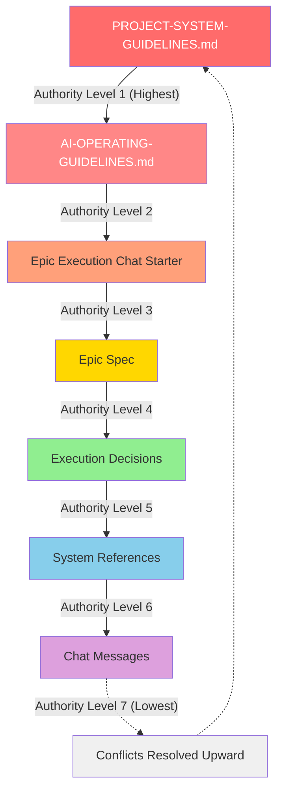

# Authority Hierarchy

This diagram shows the authority hierarchy in the AI Project System. When there are conflicts or ambiguities, higher-level documents take precedence.

---

## Hierarchy Diagram

---

## Authority Levels Explained

### **Level 1: PROJECT-SYSTEM-GUIDELINES.md** (Highest Authority)
**Role:** Defines system structure, governance, and core concepts

**What it controls:**
- Phase, Milestone, Epic model
- File naming conventions
- Repository structure
- Documentation standards
- Governance framework

**Immutability:** Cannot be overridden by any other document. Changes require explicit governance amendment process.

**Example precedence:**
- If Chat Starter says "use different file naming," but PROJECT-SYSTEM-GUIDELINES.md defines canonical format → use canonical format
- If Epic Spec suggests different branching strategy → PROJECT-SYSTEM-GUIDELINES.md wins

---

### **Level 2: AI-OPERATING-GUIDELINES.md**
**Role:** Defines execution procedures for AI agents

**What it controls:**
- Canonical happy path for Epic execution
- Agent responsibilities and stopping conditions
- HQ vs Agent authority boundaries
- Merge authorization requirements
- Epic Delivery Notice format

**Relationship to Level 1:** Must not contradict PROJECT-SYSTEM-GUIDELINES.md. Provides procedural implementation of structural rules.

**Example precedence:**
- If Chat Starter says "merge immediately," but AI-OPERATING-GUIDELINES.md requires HQ authorization → wait for authorization
- If Epic Spec implies agent makes accept/reject decision → AI-OPERATING-GUIDELINES.md clarifies HQ decides

---

### **Level 3: Epic Execution Chat Starter**
**Role:** Provides Epic-specific execution instructions

**What it controls:**
- Epic goals and context
- Deliverables checklist
- Branch creation instructions
- Definition of Done
- Acceptance criteria
- Epic-specific constraints

**Relationship to Levels 1-2:** Must align with governance. Provides tactical execution guidance for specific Epic.

**Example precedence:**
- If Epic Spec says "create video tutorial," but Chat Starter says "no videos" → Chat Starter wins (more specific to execution)
- If Chat Starter conflicts with AI-OPERATING-GUIDELINES.md → AI-OPERATING-GUIDELINES.md wins

---

### **Level 4: Epic Spec**
**Role:** Defines Epic's problem, goals, and scope

**What it controls:**
- Problem statement
- Goals and non-goals
- Scope of work
- Success criteria
- Technical constraints

**Relationship to Level 3:** Chat Starter translates Epic Spec into execution instructions. If conflict, Chat Starter's tactical guidance takes precedence during execution.

**Example precedence:**
- If Spec is vague but Chat Starter is explicit → follow Chat Starter
- If both contradict governance → governance wins

---

### **Level 5: Execution Decisions**
**Role:** Real-time decisions made during Epic execution

**What it controls:**
- Implementation details not specified in Spec
- Technical approach choices
- Library/framework selections
- File organization within deliverables

**Relationship to Levels 1-4:** Must align with all higher-level guidance. Fills in unspecified details.

**Example precedence:**
- If Spec says "create diagram" without specifying format, and Chat Starter says "use Mermaid" → use Mermaid
- If neither specifies, agent chooses appropriate implementation

---

### **Level 6: System References**
**Role:** Supplementary documentation and examples

**What it controls:**
- Example implementations
- Best practices
- How-to guides
- System operation procedures

**Relationship to Levels 1-5:** Informative, not authoritative. Provides guidance but does not override explicit instructions.

**Example precedence:**
- If System Reference suggests approach X, but Epic Spec requires approach Y → use approach Y
- If System Reference provides example, treat as suggestion not requirement

---

### **Level 7: Chat Messages** (Lowest Authority)
**Role:** Ephemeral communication during execution

**What it controls:**
- Clarifications
- Questions
- Status updates
- Informal guidance

**Relationship to Levels 1-6:** Lowest authority. Cannot override any documented guidance.

**Example precedence:**
- If human says in chat "just merge it," but AI-OPERATING-GUIDELINES.md requires authorization → request formal authorization
- If chat provides contradictory instruction → ask for clarification against documented guidance

---

## Conflict Resolution Process

When conflicts arise:

### **Step 1: Identify the Conflict**
- Document what Level X says
- Document what Level Y says
- Confirm they genuinely conflict (not just provide different levels of detail)

### **Step 2: Apply Hierarchy**
- Higher level wins
- Example: PROJECT-SYSTEM-GUIDELINES.md (L1) beats Chat Message (L7)

### **Step 3: Document the Resolution**
If significant:
- Note in commit message
- Include in Epic Completion Report
- Consider whether governance needs clarification

### **Step 4: Escalate if Ambiguous**
If genuinely unclear:
- Stop execution
- Request HQ clarification
- Do not guess or infer

---

## Practical Examples

### Example 1: File Naming Conflict
- **Chat message:** "Name it `quick-start.md`"
- **PROJECT-SYSTEM-GUIDELINES.md:** File naming convention is `QUICK-START.md` (uppercase)
- **Resolution:** Use `QUICK-START.md` (Level 1 beats Level 7)

### Example 2: Merge Authority Conflict
- **Chat message:** "Looks good, merge it"
- **AI-OPERATING-GUIDELINES.md:** Agent must not merge without explicit HQ authorization
- **Resolution:** Request explicit authorization: "Please confirm merge authorization per AI-OPERATING-GUIDELINES.md"

### Example 3: Implementation Detail Conflict
- **Epic Spec:** "Create diagram"
- **Chat Starter:** "Use Mermaid syntax"
- **Chat message:** "Actually, use PlantUML"
- **Resolution:** Chat Starter (Level 3) beats Chat Message (Level 7), but if human insists, request formal update to Chat Starter

### Example 4: Scope Expansion Request
- **Epic Spec:** "Create Quick Start Guide"
- **Chat message:** "Also add video tutorials"
- **Chat Starter:** "Non-goals: video tutorials"
- **Resolution:** Follow Chat Starter (Level 3). Suggest creating separate Epic for videos.

### Example 5: Execution Procedure Conflict
- **Chat Starter:** "Open PR and merge immediately"
- **AI-OPERATING-GUIDELINES.md:** "Open PR, produce Delivery Notice, stop and await HQ authorization"
- **Resolution:** Follow AI-OPERATING-GUIDELINES.md (Level 2 beats Level 3). Chat Starter likely has error.

---

## Why This Hierarchy Matters

### **Prevents Scope Creep**
Chat messages cannot expand Epic scope beyond what's documented in Spec and Chat Starter.

### **Ensures Consistency**
Governance documents ensure all Epics follow same structural rules, even if chat conversations vary.

### **Enables Safe AI Execution**
AI agents can execute autonomously within guardrails, knowing governance provides clear boundaries.

### **Documents Intent**
Higher-level documents are version-controlled and reviewed, unlike ephemeral chat messages.

### **Facilitates Handoffs**
New agents or humans can understand decisions by reading documents, not reconstructing chat history.

---

## Document Maintenance

### When to Update Higher-Level Documents

If you repeatedly encounter conflicts or need exceptions:
- Consider whether governance needs refinement
- Propose amendments through formal governance process
- Don't work around governance; improve it

### Version Control
All authority documents Level 1-4 are version-controlled:
- Changes tracked in Git
- Versions referenced in Epic Specs
- Effective dates documented

---

## References

- [PROJECT-SYSTEM-GUIDELINES.md](../PROJECT-SYSTEM-GUIDELINES.md) — Level 1 authority
- [AI-OPERATING-GUIDELINES.md](../AI-OPERATING-GUIDELINES.md) — Level 2 authority
- [Epic Execution Chat Starter Template](../templates/epic-execution-chat-starter.md) — Level 3 format
- [Epic Spec Template](../templates/epic-spec.md) — Level 4 format
