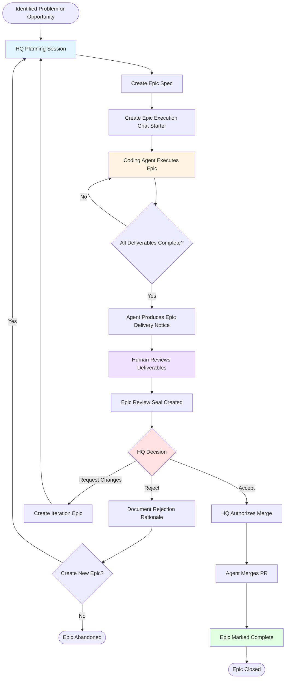

# Epic Lifecycle Flow

This diagram shows the complete lifecycle of an Epic in the AI Project System, from initial ideation through closure.

---

## Lifecycle Stages

---

## Key Stages Explained

### **1. Planning (HQ)**
- Human identifies problem or opportunity
- Creates Epic Spec defining goals, deliverables, DoD
- Creates Epic Execution Chat Starter with execution instructions

### **2. Execution (Coding Agent)**
- Agent receives Chat Starter
- Executes work according to Epic Spec
- Creates all required deliverables
- Self-validates against Definition of Done

### **3. Delivery (Coding Agent)**
- Agent produces Epic Delivery Notice (chat message, not committed)
- Summarizes work, lists deliverables, confirms DoD completion
- Opens PR and **stops** (does not merge)

### **4. Review (Human)**
- Human reviews all deliverables
- Tests functionality
- Validates against acceptance criteria
- Creates Epic Review Seal documenting findings

### **5. Decision (HQ)**
Three possible outcomes:
- **Accept:** Work meets requirements → proceed to authorization
- **Reject:** Work fundamentally flawed → create new Epic or abandon
- **Request Changes:** Work needs iteration → create iteration Epic

### **6. Authorization & Closure (HQ + Agent)**
- HQ authorizes merge (explicit instruction required)
- Agent merges PR
- Epic marked complete
- Agent **stops immediately** after merge

---

## Critical Decision Points

### Decision Point 1: Agent Self-Check
**Question:** "Are all deliverables complete per the Definition of Done?"

- **No:** Continue execution
- **Yes:** Produce Delivery Notice and stop

### Decision Point 2: HQ Acceptance
**Question:** "Does this work meet the Epic's goals and acceptance criteria?"

- **Accept:** Authorize merge → Epic closes
- **Reject:** Document rationale → create new Epic or abandon
- **Request Changes:** Define iteration scope → create iteration Epic

---

## Who Does What

| Stage | Responsible Party | Authority Level |
|-------|------------------|-----------------|
| Planning | HQ (Human) | Creates Epic Spec |
| Execution | Coding Agent | Executes according to spec |
| Delivery Notice | Coding Agent | Documents completion |
| Review | Human | Evaluates deliverables |
| Review Seal | HQ or Human | Documents findings |
| Decision | HQ (Human) | Accept/Reject/Iterate |
| Authorization | HQ (Human) | Explicit merge approval |
| Merge | Coding Agent | Executes authorized merge |

---

## Canonical Happy Path

The ideal flow is:

1. HQ creates Epic Spec
2. HQ creates Chat Starter
3. Agent executes Epic
4. Agent produces Delivery Notice
5. Human reviews
6. HQ accepts
7. HQ authorizes merge
8. Agent merges PR
9. Epic closed

**Agent stops at step 4 and awaits HQ instruction.**

---

## Common Variations

### Fast Iteration Loop
If minor changes needed:
- HQ may provide inline correction instructions
- Agent makes changes, updates Delivery Notice
- Review cycle repeats

### Rejection with Pivot
If Epic fundamentally misaligned:
- HQ rejects with rationale
- HQ creates new Epic with revised goals
- Original Epic closed without merge

### Multi-Phase Review
For complex Epics:
- Human may request intermediate reviews
- Agent produces draft deliverables
- HQ provides feedback before final delivery

---

## References

- [AI-OPERATING-GUIDELINES.md](../AI-OPERATING-GUIDELINES.md) — Canonical happy path definition
- [PROJECT-SYSTEM-GUIDELINES.md](../PROJECT-SYSTEM-GUIDELINES.md) — Epic structure and governance
- [Epic Execution Chat Starter Template](../templates/epic-execution-chat-starter.md) — Execution instructions format
- [Epic Review Seal Template](../templates/epic-review-seal.md) — Review documentation format
