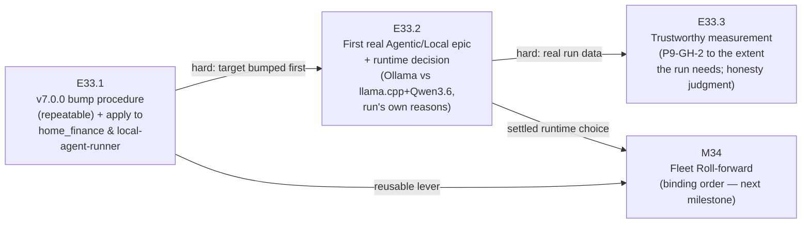

# Milestone M33 — Proving Pair: v7.0.0 + First Real Agentic/Local Epic

## Purpose

Prove the framework does its job in the wild. On `home_finance` and `local-agent-runner` —
the two projects with canonical `governance.agent.md` already installed — bump each to
**v7.0.0**, run the **first real Agentic/Local epic** of the target project's own work under
the fixed operating posture, settle the **Ollama-vs-llama.cpp** runtime question from that
run, and produce **trustworthy burn/validation evidence** out of the run.

This milestone ensures:
- Adoption is **demonstrated, not asserted** — the proving pair carries at least one real
  governed epic end-to-end, stamped and confirmable at `framework_version: v7.0.0`.
- The local runtime fork is **settled by evidence** — a decision recorded with the run's own
  reasons, not an abstract memo.
- Measurement is **honest against real data** — `measure-token-burn` is trusted only as far as
  a real run's numbers require it to be (P9-GH-2, folded in).
- A **repeatable v7.0.0 bump procedure** exists — the reusable lever M34 consumes.

**M33 is the first P10 milestone and its ordering before M34 is binding** (M34's fleet
roll-forward consumes M33's bump procedure and its settled local-runtime choice — SN-23; phase
spec §Milestones sequencing). M35 is independent and scheduled separately by the Phase Chat.
`is_final: false` — two milestones follow.

---

## Cross-Repo Record/Evidence Split (read first — governs every epic here)

**This is the framework's first milestone whose deliverables land substantially in OTHER
repositories.** A v7.0.0 bump and a real epic on `home_finance` change *that* repo, not this
one. Keep the split explicit in every epic:

- **The target repos** (`home_finance`, `local-agent-runner`) receive the actual
  `framework_version` stamp, the governance refresh, and the real code the epic produces. The
  Milestone/Epic Chats own the mechanics of driving a governed run inside a target repo.
- **This framework repo** (`ai-project-system`, on `phase/P10`) holds the **governance
  record** — this milestone spec, the epic specs and execution-chat starters, delivery/closure
  artifacts — and the captured **evidence**: run records, burn/validation data, and the
  recorded runtime decision. The `phase/P10` branch accumulates the record and evidence; it
  does **not** receive the target repos' code.

Where an epic's DoD says "committed" without qualification, it means committed to the
governance record on `phase/P10` (evidence), while the bump/code lands in the target repo.
Cross-repo evidence must be captured such that a reader of this repo can verify the target-repo
outcome (e.g., the run record cites the target repo, commit, and the confirmable version
stamp).

---

## Binding Context (settled scope — NOT for re-debate)

Per the P10 phase spec (v1.0.0) and SN-23 (Creation Chat, 2026-07-20, all decisions
CFO-ratified), the following apply in full and are not open for re-examination in this
Milestone or any Epic under it:

1. **P10 is adoption, not capability.** Get v7.0.0 running for real; no new framework
   capability built on spec.
2. **The operating posture is fixed.** **Manual/Paid from Creation through Milestone;
   Agentic/Local at the Epic.** Applied through P9's dual-mode switch (M31) and manual-mode
   guardrail — M33 uses them, it does not rebuild them.
3. **Proving pair first.** `home_finance` + `local-agent-runner` run first — canonical
   `governance.agent.md` already installed, least yak-shaving.
4. **Run-first ordering.** The runtime decision (E33.2) and the measurement judgment (E33.3)
   are derived from a **real epic run** on the pair — not decided in the abstract and then
   adopted.
5. **The runtime fork is settled by a run.** Ollama vs llama.cpp + Qwen3.6 27B Q8_0 is decided
   by the first real epic, with the run's own reasons.

Three design decisions are **intentionally open** and belong to the Milestone/Epic Chats, per
the phase spec ("HQ scopes the problem, not the resolution"):
- The bump **mechanism** (E33.1) — re-run `ai-project-init`, targeted governance-file sync, or
  other.
- The **choice of the pair's first real epic** and the runtime **decision criteria** (E33.2).
- The **extent** of the measurement-trust work (E33.3), sized by what the run needs.

---

## Problem Statement

Three verified gaps, each confirmed against current fleet state (SN-23 fleet-state table,
observed 2026-07-20):

- **No project except the framework is confirmably on v7.0.0.** `framework_version` could not
  be found stamped in any project except `ai-project-system` itself. Eight projects are
  enrolled but enrollment is **shallow** — a scaffold dropped in and mostly never run. The
  proving pair is the two furthest along, and even they are not stamped at v7.0.0 or confirmed
  to have run a real governed epic.
- **The local-inference substrate is the one open risk.** `local-agent-runner` is built on
  **Ollama**; the reference stack the CFO is drawn to (Qwen3.6 27B, Q8_0, llama.cpp — which
  **recommends against Ollama**, benchmarks on Mac unified memory, ~32 tok/s at ~42 GB) points
  the other way. The fork is unresolved and cannot be resolved by argument — only by a run.
- **Measurement cannot yet verify its own claims (P9-GH-2).** `measure-token-burn` (P9/M30/
  E30.1) cannot verify its own reduction claims. Run-first ordering says measurement comes out
  of real runs — which requires the run's numbers to be trustworthy. This gap is folded into
  M33 (HQ triage) and fixed **only as far as trusting the proving-pair run's numbers requires**.

---

## Goals

By the end of this milestone:

1. **The proving pair runs under v7.0.0 for real** — `home_finance` and `local-agent-runner`
   are each stamped `framework_version: v7.0.0` (confirmable) and each has carried at least one
   real Agentic/Local epic end-to-end under the fixed posture, with a committed run record in
   the governance record (E33.1, E33.2).
2. **A repeatable enrolled-project v7.0.0 bump procedure exists** — documented, reusable, and
   shown to have been applied to both proving-pair projects. Treated as a first-class
   deliverable (the lever M34 consumes), not a byproduct (E33.1).
3. **The local runtime question is settled by the run** — a recorded decision (keep Ollama vs
   switch the runner to llama.cpp + Qwen3.6) with the reasons the first real epic itself
   produced: quality, throughput, loadability, review burden (E33.2).
4. **Adoption produced its own trustworthy measurement** — real burn/validation data exists
   from the proving-pair run, and a stated, evidence-backed judgment that `measure-token-burn`'s
   numbers for that run can be trusted (P9-GH-2 closed to the extent M33 needs) (E33.3).

---

## Non-Goals

This milestone explicitly does **not**:

- Rebuild the dual-mode switch, the agentic paid-vs-local decision logic, or the manual-mode
  guardrail — all P9/M31, on master at v7.0.0; M33 **applies** them.
- Roll the dormant enrolled projects forward, or fix the superseded `hq.agent.md` in
  ai-project-system-mcp — that is M34 (which consumes E33.1's procedure).
- Canonize the System-operator role, the no-authority-on-speech seam, or the daily seed — that
  is M35.
- Build a local-inference scheduler (hand-run the lane; the CFO is the lane for now), scope
  competing-model code review, P9-GH-1, P9-GH-3, ComfyUI, or P8-GH-2 — all Out of Scope for
  P10 (phase spec).
- **Perfect `measure-token-burn` in the abstract.** E33.3's extent is decided by what the real
  run needs, not by ambition — and the honesty check is not skipped.
- Substitute an abstract runtime decision or hand-waved numbers for a real run (see Hard
  Constraint).
- Produce Epic specs or Epic Execution Chat Starters — that is the Milestone Chat's job
  (adjacency); this spec defines epic scope, deliverables, and acceptance criteria only.

---

## In Scope

- **E33.1** — a documented, **repeatable** procedure for bumping an enrolled project to v7.0.0
  (governance refresh + `framework_version` stamp), and its application to both proving-pair
  projects. Mechanism is the Epic Chat's design decision.
- **E33.2** — scoping and running a **genuine** epic of a target project's own work under the
  fixed posture (Manual/Paid up to the Epic, Agentic/Local at the Epic); the committed run
  record; the recorded Ollama-vs-llama.cpp+Qwen3.6 runtime decision with the run's own reasons.
- **E33.3** — capture of real burn/validation data from E33.2's run, and the fix/validation of
  `measure-token-burn` sized to what trusting that run's numbers requires — with an explicit
  honesty judgment.

## Out of Scope

- Everything under Non-Goals; additionally: any cross-repo rollout to the dormant enrolled
  projects (M34), changes to which chats exist or how they are started (P9/M31 territory), and
  any new framework capability on spec (P10 phase — adoption, not capability).

---

## Hard Constraint (binding — carries to every Epic under this Milestone)

**The runtime decision (E33.2) and the measurement judgment (E33.3) MUST be derived from a
real epic run on the pair.** Run-first ordering is CFO-ratified (SN-23), not a preference. A
synthetic demo does not satisfy E33.2 — it must be real work that advances the target project.
If a real run cannot be completed for a project, **record the blocker explicitly and escalate
to the Phase Chat** — do not substitute an abstract decision or hand-waved numbers. A decision
grounded in a recorded blocker-and-escalation is acceptable; a decision grounded in an
un-run abstraction is not. This constraint governs E33.2 and E33.3 directly, and it is why
E33.1's bump must complete before the run can begin.

---

## Planned Epics

### Confirmed Epics

- **E33.1 — Enrolled-project v7.0.0 bump procedure + apply to the pair**
- **E33.2 — First real Agentic/Local epic on the pair + runtime decision**
- **E33.3 — Trustworthy measurement out of the run (P9-GH-2)**

> **Artifact scope (adjacency).** The Phase Chat produces only this Milestone spec and the
> Milestone Execution Chat Starter. The **Milestone Chat** owns final epic planning and
> authors every Epic spec and Epic Execution Chat Starter. Epic identifiers here are indicative
> decomposition; the Milestone Chat may adjust epic boundaries within this milestone's scope.
> No Phase-level Epic drafts exist.

### Deferred Epics

- None at planning time. E33.3 is **conditional in extent, not in existence** — even on the
  minimal path it delivers a captured-data honesty judgment; it is never deferred.

---

## Epic Detail

### E33.1 — Enrolled-project v7.0.0 bump procedure + apply to the pair

**Source:** P10 phase spec §P10.1; SN-23 (adoption spine; fleet-state table).

**Grounding:** no project except the framework is confirmably on v7.0.0. "Adopt all" is not
one action but three per project — cleanup, version bump to v7.0.0, then the first real
Agentic/Local epic. This epic owns the **version bump**, and it must produce that bump as a
**repeatable procedure** because M34 rolls the same lever across the dormant fleet. The
procedure is a first-class deliverable, not a byproduct of bumping two projects.

**The bump mechanism is a design decision for the Epic Chat, not fixed by this spec.**
Candidate directions (non-exhaustive): re-run `ai-project-init` against the target project;
a targeted governance-file sync (copy/refresh the canonical governance corpus + agent);
a scripted refresh. Whichever is chosen, the procedure MUST cover:
1. **Governance refresh** — bring the target project's installed governance to the current
   v7.0.0 corpus (raw material: the canonical `governance.agent.md` and the `ai-project-init`
   install path, phase spec Dependencies).
2. **`framework_version` stamp** — stamp the target at `framework_version: v7.0.0` in a
   location a later reader can confirm (the phase acceptance bar is "stamped and confirmable").
3. **Repeatability** — documented steps another operator (or M34) can follow to bump a
   different enrolled project, with its known preconditions and failure modes.

**Deliverables:**
1. The documented, repeatable v7.0.0 bump procedure (steps, mechanism, preconditions, known
   failure modes) — committed to the governance record on `phase/P10`.
2. The procedure **applied** to both `home_finance` and `local-agent-runner`: each stamped
   `framework_version: v7.0.0` in its own repo, with the governance corpus refreshed.
3. Confirmation evidence in the governance record that both stamps are present and confirmable
   (cite each target repo + how to verify).

**Definition of Done:**
- [ ] The bump procedure is documented with its mechanism and reasoning, and is repeatable
- [ ] Both proving-pair projects are stamped `framework_version: v7.0.0` (confirmable) with
      governance refreshed to the v7.0.0 corpus
- [ ] Confirmation evidence is committed to the governance record on `phase/P10`
- [ ] For any change touching **this** repo: full suite green (363 baseline, no regressions,
      no new skips) — see Note on the suite

**Acceptance Criteria:**
- [ ] A reader can follow the committed procedure to bump a third enrolled project, and can
      confirm both proving-pair projects are at `framework_version: v7.0.0`

**Sequencing:** first — E33.2's run cannot begin until its target is bumped (hard dependency).

---

### E33.2 — First real Agentic/Local epic on the pair + runtime decision

**Source:** P10 phase spec §P10.1; SN-23 (run-first ordering; the runtime fork settled by a
run); phase success criteria 1–2.

**Grounding:** the local-inference substrate is P10's one open risk. `local-agent-runner` runs
Ollama; the Qwen3.6 27B Q8_0 + llama.cpp reference stack (which recommends against Ollama)
points the other way. The fork is settled by **running** a real epic, not by argument. This
epic is that experiment.

**The choice of the pair's first real epic, and the runtime decision criteria, are design
decisions for the Milestone/Epic Chat.** Constraints on the choice:
- It MUST be a **genuine** unit of the target project's own work that **advances the project** —
  a synthetic demo does not satisfy this (Hard Constraint).
- It MUST run under the **fixed posture**: scoped and reviewed **Manual/Paid from Creation
  through Milestone**, executed **Agentic/Local at the Epic** — applied through P9's dual-mode
  switch (M31), `bin/run-dev-agent` + the P7 orchestrator path, and the manual-mode guardrail.
- The runtime decision MUST be recorded **with the run's own reasons** across at least:
  **quality, throughput, loadability, review burden** — not an abstract memo.

**Deliverables:**
1. **The committed run record** (governance record on `phase/P10`) for at least one real
   Agentic/Local epic executed on a proving-pair project under the fixed posture: what was
   scoped, what ran locally, what the run produced, and the target-repo commit(s) it advanced.
2. **The recorded runtime decision** — keep Ollama, or switch `local-agent-runner` to
   llama.cpp + Qwen3.6 27B Q8_0 — stated with the run's own reasons (quality, throughput,
   loadability, review burden). This is the phase's substrate-risk resolution.
3. If a real run cannot complete for a project: an **explicit blocker record + escalation to
   the Phase Chat** in place of a substituted decision (Hard Constraint).

**Definition of Done:**
- [ ] At least one real Agentic/Local epic ran on a proving-pair project under the fixed
      posture, and its run record is committed to the governance record
- [ ] The run advanced the target project (real work, not a demo) — evidenced by the target
      repo commit(s) the run record cites
- [ ] The Ollama-vs-llama.cpp+Qwen3.6 decision is recorded with the run's own reasons across
      quality, throughput, loadability, and review burden
- [ ] For any change touching **this** repo: full suite green (363 baseline, no new skips)

**Acceptance Criteria:**
- [ ] The runtime decision in the run evidence is traceable to a real run's observations — a
      reader sees *which run* produced *which reasons*, not an abstract argument
- [ ] The cited target-repo work is real and advances the project

**Dependency:** hard — requires E33.1's bump (its target must be at v7.0.0 before the run).
Runs after E33.1.

---

### E33.3 — Trustworthy measurement out of the run (P9-GH-2)

**Source:** P10 phase spec §P10.1; SN-23 (run-first ordering); HQ triage (P9-GH-2 folded into
M33); phase success criterion 3.

**Grounding:** P9-GH-2 records that `measure-token-burn` (P9/M30/E30.1) cannot verify its own
reduction claims. Run-first ordering says measurement comes out of real runs — which is only
useful if the run's numbers can be **trusted**. This epic captures real burn/validation data
from E33.2's run and fixes/validates the tool **only as far as trusting that run's numbers
requires**.

**This epic is conditional in extent — sized by what E33.2's run needs, decided by the
Milestone/Epic Chat after the run's data exists.** Two things are non-negotiable regardless of
extent: the **capture** of real data, and an explicit **honesty judgment**. What is scaled is
how much of `measure-token-burn` gets fixed/validated.

**Deliverables:**
1. **Real burn/validation data** from E33.2's proving-pair run, committed to the governance
   record on `phase/P10`.
2. A **sizing decision**, recorded with its basis: how much `measure-token-burn` fix/validation
   the run's trust requirement justifies (possibly: validation only, no code change).
3. The proportionate fix/validation work itself — **or**, on the minimal path, a documented
   validation finding that the tool's numbers for this run are already trustworthy, with the
   evidence that shows it.
4. **An explicit honesty judgment:** a stated, evidence-backed conclusion on whether
   `measure-token-burn`'s numbers **for this run** can be trusted (P9-GH-2 closed to the extent
   M33 needs). The check is never skipped.

**Definition of Done:**
- [ ] Real burn/validation data from E33.2's run is committed to the governance record
- [ ] The sizing decision is recorded and traces to what the run needs (not to ambition)
- [ ] The proportionate fix/validation (or the documented minimal validation finding) is
      delivered
- [ ] An explicit, evidence-backed honesty judgment on the run's numbers is committed
- [ ] For any change touching **this** repo (`measure-token-burn` lives here): full suite
      green (363 baseline, no new skips)

**Acceptance Criteria:**
- [ ] The repo records a stated judgment — "the run's numbers can/cannot be trusted, because
      …" — backed by the captured data; there is no third state where the check was skipped

**Dependency:** hard — requires E33.2's run data. Runs after (or overlapping the tail of)
E33.2, once real numbers exist. The sizing decision cannot precede the run's data.

---

## Branch Strategy

```
master
└── phase/P10                      (branched at phase open)
    └── milestone/M33              ← this milestone (Milestone Chat branches from phase/P10)
        ├── epic/P10-M33-E33.1     ← v7.0.0 bump procedure + apply to the pair
        ├── epic/P10-M33-E33.2     ← first real Agentic/Local epic + runtime decision
        └── epic/P10-M33-E33.3     ← trustworthy measurement out of the run
```

Epic PRs target `milestone/M33`. Consolidation PR: `milestone/M33 → phase/P10`. **M33 is not
the final P10 milestone** (`is_final: false`) — on its consolidation, the Phase Chat proceeds
to plan M34 (binding order — consumes E33.1's bump procedure and E33.2's settled runtime
choice) and schedules M35 independently. Phase closure (`phase/P10 → master`) happens only
after all three milestones, via the PSG §5C canonical closure sequence ending in the Phase
Closure Declaration (Step 9). There is no separate phase-delivery artifact beyond §5C's steps
(P8-GH-3).

**Note on the cross-repo split:** epic branches here carry the **governance record and
evidence**. The v7.0.0 bumps and the real epic's code land in the **target repos**
(`home_finance`, `local-agent-runner`), which the CFO controls — they are not merged onto
`phase/P10`. An epic's committed governance artifact cites the target-repo outcome so it is
verifiable from this repo.

---

## Prerequisites

- This Milestone spec and its Milestone Execution Chat Starter are git-tracked on `phase/P10`
  (verify with `git ls-files --error-unmatch <path>` on `phase/P10` — the GH-1 convention).
- P10 planning artifacts present and git-tracked on `phase/P10`: the phase spec, the Phase
  Execution Chat Starter, SN-23, and the HQ opener.
- On master at v7.0.0 (the applied substrate — reference, not edit targets):
  - P9's dual-mode switch + agentic paid-vs-local decision logic (M31) and the manual-mode
    guardrail — the fixed posture is applied through these.
  - `bin/run-dev-agent` + the P7 orchestrator/adapter path — the Agentic/Local Epic execution
    substrate.
  - `measure-token-burn` (P9/M30/E30.1) — the object of E33.3's trust work.
  - The canonical `governance.agent.md` and the `ai-project-init` install path — E33.1's raw
    material.
- **External dependencies (CFO-side):**
  - **The target repos** — `home_finance` and `local-agent-runner` live outside this repo; the
    CFO controls their state and access. P10's real work lands there.
  - **Local-inference substrate** — Ollama today on `local-agent-runner`; the llama.cpp +
    Qwen3.6 27B Q8_0 reference stack (~32 tok/s at ~42 GB on Mac unified memory). The first
    real epic settles which the fleet runs on.
  - **Premium/frontier quota** — Manual/Paid work from Creation through Milestone spends paid
    tokens; the CFO controls pacing. Agentic/Local at the Epic is the relief valve.
- Reference context: SN-23
  (`.ai-project/artifacts/steering-notes/2026-07-20__creation-chat__steering-note__P10-adoption-spine.md`);
  the local-model setup reference (https://quesma.com/blog/qwen-36-is-awesome/).

---

## Dependencies and Sequencing

- **E33.1 → E33.2 is a hard dependency:** the run (E33.2) cannot begin until its target is
  bumped to v7.0.0 (E33.1). No real run on an un-bumped project.
- **E33.2 → E33.3 is a hard dependency:** the measurement judgment derives from the run's
  captured data. No trust judgment before real numbers exist. E33.3's sizing may overlap the
  tail of E33.2 where no file contention exists, but the sizing decision cannot precede the
  data.
- **M33 → M34 is binding at phase level:** M34 is not planned until M33's bump procedure
  (E33.1) and settled runtime choice (E33.2) exist. This spec's E33.1 and E33.2 are the links.
- **No dependency on M35** in either direction (M35 is independent; the Phase Chat schedules
  it).

---

## Definition of Done (Milestone)

- [ ] E33.1, E33.2, and E33.3 each meet their Definition of Done above
- [ ] All three epic branches merged to `milestone/M33`
- [ ] Both `home_finance` and `local-agent-runner` are stamped `framework_version: v7.0.0`
      (confirmable), each with a committed run record for at least one real Agentic/Local epic
      executed under the fixed posture
- [ ] A documented, repeatable enrolled-project v7.0.0 bump procedure exists and shows evidence
      of application to the pair
- [ ] The Ollama-vs-llama.cpp+Qwen3.6 runtime decision is recorded with the run's own reasons
- [ ] Real burn/validation data from the run exists in the governance record, with an explicit,
      evidence-backed honesty judgment on `measure-token-burn`'s numbers for that run (P9-GH-2
      to the extent M33 needs)
- [ ] Full suite green on `milestone/M33` for changes touching this repo (363 baseline, no
      regressions, no new skips)
- [ ] Milestone Closure Declaration produced (`is_final: false` — M34/M35 remain)

---

## Acceptance Criteria (Milestone)

1. `framework_version: v7.0.0` is stamped and confirmable in both proving-pair projects, and
   each has a committed run record for at least one real Agentic/Local epic under the fixed
   posture (E33.1, E33.2).
2. The runtime decision (Ollama vs llama.cpp + Qwen3.6) is recorded in the run evidence with
   the run's own reasons — not an abstract memo (E33.2, Hard Constraint).
3. Real burn/validation data from the run exists in the repo, with a stated, evidence-backed
   judgment that `measure-token-burn`'s numbers for that run can be trusted (E33.3, P9-GH-2).
4. A documented, repeatable v7.0.0 bump procedure exists and has been applied to the pair
   (E33.1).
5. Every decision (runtime, measurement-trust) traces to a real run — none to an un-run
   abstraction (Hard Constraint, all epics). Where a run could not complete, an explicit
   blocker-and-escalation stands in its place.
6. The full suite is green at milestone delivery for changes touching this repo — no
   regressions, no new skips.

---

## Timeline

**Target Start:** 2026-07-20
**Target Completion:** 2026-07-31 (~1–1.5 weeks per phase spec estimate; 3 epics, the real
epic run and runtime decision are the long pole — run-first ordering means the first real
epic's duration is discovered, not assumed)
**Actual Start:** Not started
**Actual Completion:** Not started

---

## Visual Bindings

**Visual binding**
- **Link:** (inline — Structural diagram; no hosted link needed per AOG §16.3/§16.5)
- **What:** diagram
- **Level:** Milestone
- **State:** proposed



- **Description:** M33's three-epic flow — bump the pair to v7.0.0 first, run a real
  Agentic/Local epic that settles the runtime fork with its own reasons, then take trustworthy
  measurement out of that run. E33.1's procedure and E33.2's settled runtime choice are the
  binding-order links M34 consumes. Proposed-track Structural diagram (AOG §16.3/§16.6).

---

## Notes

- **Run-first ordering is the load-bearing rule of this milestone.** The runtime decision and
  the measurement judgment are *outputs of a real run*, never inputs to it. A decision made in
  the abstract and then adopted would repeat exactly the mistake P9's founding evidence was
  about (a policy written before evidence). A recorded blocker-and-escalation is the sanctioned
  outcome when a run cannot complete — an un-run abstraction is not.
- **The bump procedure (E33.1) is a first-class deliverable.** It is the reusable lever M34
  rolls across the dormant fleet. Bumping two projects without leaving behind a repeatable
  procedure would satisfy the letter of the pair-bump and fail the milestone's purpose.
- **E33.3 can be small on purpose.** A validation-only E33.3 — "the run's numbers are already
  trustworthy, here is the evidence" — is a full success if that is what the run's trust
  requirement supports. What is never optional is the captured data and the explicit honesty
  judgment.
- **The cross-repo split is real, not rhetorical.** The `phase/P10` branch here carries the
  governance record and evidence; the bumps and code land in the target repos. Write every
  epic so a reader of *this* repo can verify the *target* repo's outcome.
- **The mechanism (E33.1), the epic choice + decision criteria (E33.2), and the measurement
  extent (E33.3) are open design decisions** for the Milestone/Epic Chats — pick a direction,
  document the reasoning, proceed. They are not blockers to escalate (phase starter, Question
  Policy). The *only* escalation trigger here is a run that cannot complete.
- **On the suite baseline:** the 363/0 suite lives in this framework repo. Epics whose
  deliverables are governance record/evidence here must keep it green; the target-repo bumps
  and code are governed by their own repos' checks. "Full suite green" clauses above apply to
  changes touching **this** repo.
- Default-accept (PSG §11.6 / AOG §12) governs this milestone's delivery: clean Epic/Milestone
  deliveries are accepted by silence; a Review Decision is the exception path only. Per SN-19,
  acceptance and the merge instruction are in-chat acts — no ceremonial artifact. The harness
  enforces explicit human authorization on every merge regardless.
