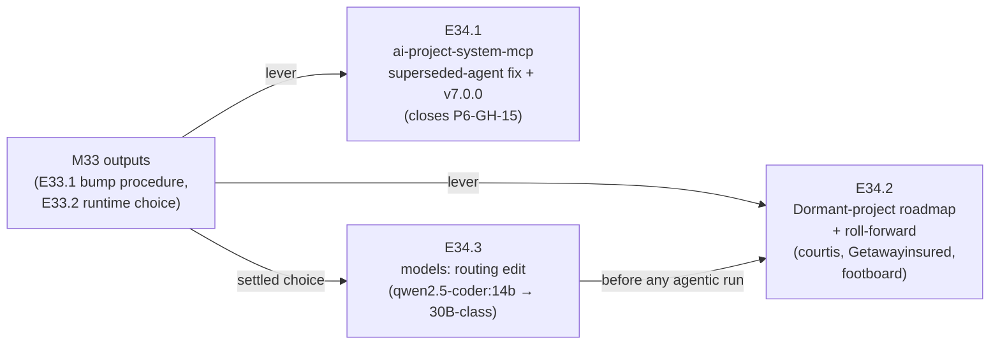

# Milestone M34 — Fleet Roll-forward

## Purpose

Spread what the proving pair proved. M33 produced a **repeatable v7.0.0 bump procedure** (E33.1)
and settled the **local runtime choice** (E33.2: keep Ollama; raise the model tier). M34 rolls
those levers across the **dormant enrolled projects** so the fleet — not just two projects — is
moving under v7.0.0 by phase close, and closes **P6-GH-15** (the superseded `hq.agent.md` living
in `ai-project-system-mcp`) in the wild.

This milestone ensures:
- **`ai-project-system-mcp` carries the canonical `governance.agent.md`** (superseded
  `hq.agent.md` gone) at v7.0.0 — P6-GH-15 resolved in a real project (E34.1).
- **The dormant enrolled projects are rolling** — each on a recorded roll-forward path to
  v7.0.0 with demonstrable movement, using E33.1's procedure as the lever (E34.2).
- **The settled runtime choice is applied**, not just recorded — the `.ai-project.yml`
  `models:` routing no longer points at the model E33.2 proved unusable for agentic epic work
  (E34.3).

**M34 is second in the binding order: it consumes M33's outputs.** E33.1's bump procedure
(`.ai-project/artifacts/reference/v7-bump-procedure/README.md`) is the lever E34.1/E34.2 apply;
E33.2's settled runtime choice is what E34.3 operationalizes. **M35 is independent** and
schedulable by the Phase Chat where it fits. `is_final: false` — M35 remains.

---

## Cross-Repo Record/Evidence Split (read first — governs every epic here)

Same split M33 established, and it applies with full force here because **most M34 deliverables
land in OTHER repositories.**

- **The target repos** (`ai-project-system-mcp`, `courtis`, `Getawayinsured2023`, `footboard`)
  receive the actual `framework_version` stamp, the
  governance refresh / canonical-agent install, and any real epic code. The Milestone/Epic
  Chats own the mechanics inside each target repo; **their branches are the CFO's to publish**
  (committed locally, not pushed by these epics — the M33 precedent).
- **This framework repo** (`ai-project-system`, on `phase/P10`) holds the **governance
  record** — this milestone spec, epic specs and starters, delivery/closure artifacts — and the
  **evidence**: the per-project roll-forward roadmap, bump confirmation evidence, and any run
  records. `phase/P10` does **not** receive the target repos' code.

**Exception — E34.3 lands in THIS repo.** The `models:` routing edit is a change to *this*
repo's `.ai-project.yml`; it is the one M34 deliverable that is framework-repo code, not
cross-repo evidence. Keeping it a distinct epic keeps the split clean: E34.1/E34.2 touch other
repos, E34.3 touches this one.

Where an epic's DoD says "committed" without qualification, it means committed to the
governance record on `phase/P10` (evidence), while the bump/code lands in the target repo, cited
so a reader of this repo can verify the target-repo outcome.

---

## Binding Context (settled scope — NOT for re-debate)

Per the P10 phase spec (v1.2.0), SN-23, and M33's now-settled outputs, the following apply in
full and are not open for re-examination:

1. **P10 is adoption, not capability.** M34 rolls a proven procedure and applies a settled
   decision; it builds no new framework capability on spec.
2. **The operating posture is fixed.** Manual/Paid from Creation through Milestone; Agentic/Local
   at the Epic — applied through P9's dual-mode switch (M31) and guardrail, not rebuilt.
3. **The bump procedure is E33.1's, not reinvented.** M34 applies
   `.ai-project/artifacts/reference/v7-bump-procedure/README.md` (Direction B: targeted
   governance-file sync). Its **Failure Mode 3** (the installed `governance.agent.md` is an
   out-of-band copy the submodule re-pin does *not* refresh) and **Failure Mode 5** (legacy
   installs must be checked for a superseded agent) are load-bearing here.
4. **The runtime choice is settled: keep Ollama; raise the model tier.** E33.2 proved
   `qwen2.5-coder:14b` unusable for agentic epic work (exit-0 zero-work, the SN-3 failure) while
   a 30B-class coder (`qwen3-coder:30b`) did the work on the same runtime. E34.3 applies this;
   it does **not** re-open the runtime question.
5. **The llama.cpp + Qwen3.6-27B-Q8_0 trial stays parked** pending Mac-class ~42 GB hardware (or
   an authorized loadable-quant trial). Not M34 work.

Three design decisions are **intentionally open** and belong to the Milestone/Epic Chats:
- The exact `models:` values E34.3 writes (evidence points to `qwen3-coder:30b`; the Epic Chat
  confirms against E33.2's run and `.ai-project.yml`'s current mapping).
- Per-project sequencing and how far each dormant project rolls in E34.2 (bump-only vs. bump +
  a first governed epic), sized by each project's readiness.
- Whether `footboard` reaches a canonical-agent install within M34 or is roadmapped for later.

---

## Problem Statement

Observed fleet state (this framework repo's read of `~/soft-dev`, **2026-07-28** — verify
per-project at execution; the SN-23 table was a 2026-07-20 snapshot and is already stale in
part):

| Project | Canonical agent? | Installed gov version | `framework_version` | Artifacts | The M34 lift |
|---|---|---|---|---|---|
| `ai-project-system-mcp` | **No — superseded `hq.agent.md`** | pinned to a **raw SHA** (`2bd76ff4…`), not a tag | none | 2 | **E34.1:** replace agent with canonical `governance.agent.md`, fix the pin to v7.0.0, stamp |
| `Getawayinsured2023` | **Yes** (`governance.agent.md`) | **7.0.0** already | **none** | 12 | Lightest: stamp `framework_version` + Failure-Mode-3 agent-freshness check; likely no corpus bump |
| `courtis` | No | v4.0.1 | none | 2 | Full: install canonical agent + bump corpus + stamp |
| `footboard` | No | 5.1.0 | none | 7 | Canonical-agent install + bump, as the roadmap reaches it (phase spec §P10.2) |

> `fieldledger-assesment` **dropped from M34/P10 scope** — CFO direct instruction, 2026-07-29: it
> was a screening project, not a real adoption target. See Amendment History.

Three things this makes concrete:
- **P6-GH-15 is live and confirmed:** `ai-project-system-mcp` runs the superseded `hq.agent.md`,
  and its governance pin is a raw commit SHA rather than a version tag — the fix must correct
  both (E34.1).
- **The dormant set is not uniform.** `Getawayinsured2023` is already at gov 7.0.0 with the
  canonical agent (further along than SN-23 recorded) and needs little more than the stamp;
  `courtis`/`footboard` need an agent install and a multi-version corpus bump. E34.2 sizes each
  from its actual state, not the snapshot.
- **The `models:` routing is still wrong for the fleet.** `.ai-project.yml`'s `models.epic_dev`
  / `models.epic_qa` remain `local:qwen2.5-coder:14b` — the model E33.2 proved produces
  false-positive empty completions. Any agentic roll-forward run would default straight into
  that trap (E34.3).

---

## Goals

By the end of this milestone:

1. **P6-GH-15 is closed in the wild** — `ai-project-system-mcp` carries the canonical
   `governance.agent.md`, the superseded `hq.agent.md` is gone, its governance pin is a proper
   v7.0.0 tag, and it is stamped `framework_version: v7.0.0` (confirmable) (E34.1).
2. **The dormant enrolled projects are rolling under v7.0.0** — `courtis` and
   `Getawayinsured2023` each have a recorded roll-forward path and **demonstrable movement**
   along it (at minimum the v7.0.0 stamp where the project is ready); `footboard` is on the
   roadmap with a canonical-agent path (E34.2).
3. **The settled runtime choice is applied** — `.ai-project.yml`'s `models:` routing reflects
   E33.2's decision (Ollama + a 30B-class coder); the `qwen2.5-coder:14b` epic entries are gone
   (E34.3).

---

## Non-Goals

This milestone explicitly does **not**:

- Re-open the runtime question or trial llama.cpp / Qwen3.6-27B-Q8_0 (settled/parked by M33).
- Require **every** dormant project to have run a full Agentic/Local epic by phase close — the
  bar is **rolling** (recorded path + demonstrable movement), not a completed epic per project
  (phase spec §P10.2).
- Address the two **unenrolled** projects (`ai-stack`, `character-factory`) — out of P10 (phase
  spec Out of Scope).
- Schema-bless `framework_version` in `governance/ai-project-yml-spec.md` — that is a framework
  *capability* change (**P10-GH-1**, recorded below), correctly out of these adoption epics.
- Canonize the System-operator role — that is M35 (independent; and see SN-24 on its changed
  form, which M34 does not touch).
- Build a local-inference scheduler, or scope any parked P10 item (competing-model review,
  P9-GH-1, P9-GH-3, ComfyUI, P8-GH-2).
- Produce Epic specs or Epic Execution Chat Starters — the Milestone Chat's job (adjacency).

---

## In Scope

- **E34.1** — `ai-project-system-mcp`: replace the superseded `hq.agent.md` with canonical
  `governance.agent.md`, correct the raw-SHA governance pin to the v7.0.0 tag, refresh the
  corpus, and stamp `framework_version: v7.0.0` — via E33.1's procedure. Closes P6-GH-15.
- **E34.2** — the dormant-project roadmap and roll-forward: a recorded, per-project path to
  v7.0.0 for `courtis`, `Getawayinsured2023` (and `footboard` as reached), each with
  demonstrable movement, applying E33.1's procedure and sizing each from its observed state.
- **E34.3** — apply E33.2's settled runtime choice to this repo's `.ai-project.yml` `models:`
  routing (off `qwen2.5-coder:14b` to the 30B-class model the run proved), with the change
  traced to the run evidence.

## Out of Scope

- Everything under Non-Goals; additionally the unenrolled projects, any framework capability on
  spec, and M35's operator canonization.

---

## Hard Constraint (binding — carries to every Epic under this Milestone)

**Where an epic performs an Agentic/Local run, run-first ordering applies exactly as in M33:**
the run must be real work that advances the target project (no synthetic demo), executed under
the fixed posture; if a run cannot complete, record the blocker explicitly and escalate to the
Phase Chat rather than substituting a hand-waved outcome. **Exit codes are not a trustworthy
completion signal on this stack** (M33's two-sided finding: E33.2 exit-0/zero-work,
E33.4 exit-2/complete-work) — any M34 run's completion is judged from the transcript and the
target repo, never the exit code.

For the bump-and-roadmap work (the bulk of M34), the binding rule is **honesty of state**: every
"rolling"/"bumped" claim is confirmable from committed evidence against the actual target repo
(the E33.1 confirmation method), and any project that cannot be moved is recorded as a
**recorded blocker**, not silently counted as rolling.

---

## Planned Epics

### Confirmed Epics

- **E34.1 — `ai-project-system-mcp` superseded-agent fix + v7.0.0 (closes P6-GH-15)**
- **E34.2 — Dormant-project roadmap + roll-forward**
- **E34.3 — Apply the settled runtime choice (`models:` routing edit)**

> **Artifact scope (adjacency).** The Phase Chat produces only this Milestone spec and the
> Milestone Execution Chat Starter. The **Milestone Chat** owns final epic planning and authors
> every Epic spec and Epic Execution Chat Starter. Epic identifiers here are indicative; the
> Milestone Chat may adjust boundaries within this milestone's scope (e.g., fold E34.3 into E34.1
> if it judges that cleaner, or split E34.2 per project).

### Deferred Epics

- None at planning time. E34.2's *extent per project* is conditional (sized by readiness), but
  the epic itself is not deferred.

---

## Epic Detail

### E34.1 — `ai-project-system-mcp` superseded-agent fix + v7.0.0 (closes P6-GH-15)

**Source:** P10 phase spec §P10.2 / E34.1; HQ triage (P6-GH-15 → M34); phase acceptance
criteria.

**Grounding:** `ai-project-system-mcp` carries the **superseded `hq.agent.md`** — P6-GH-15
sitting live in a real project — and its `.ai-project.yml` governance pin is a **raw commit SHA
(`2bd76ff4…`), not a version tag.** This is exactly the legacy-install case E33.1's **Failure
Mode 5** says must be checked: replace the superseded agent with the canonical
`governance.agent.md` and bring the pin to a proper v7.0.0 tag.

**Deliverables:**
1. The superseded `hq.agent.md` **removed** and the canonical `governance.agent.md` installed in
   `ai-project-system-mcp` (per E33.1's procedure; Failure Mode 3 — the agent is an out-of-band
   copy, refresh it explicitly).
2. The governance pin corrected from the raw SHA to the **v7.0.0 tag** and the corpus refreshed.
3. `framework_version: v7.0.0` stamped and confirmable.
4. Confirmation evidence in the governance record on `phase/P10` (cite the target repo, commit,
   and the E33.1 confirmation-command output).

**Definition of Done:**
- [ ] `ai-project-system-mcp` carries canonical `governance.agent.md`; no `hq.agent.md` remains
- [ ] Governance pinned to the v7.0.0 tag (no raw-SHA pin); corpus refreshed
- [ ] `framework_version: v7.0.0` stamped and confirmable
- [ ] Confirmation evidence committed to the governance record
- [ ] For any change touching **this** repo: full suite green (366 baseline, no new skips)

**Acceptance Criteria:**
- [ ] A reader confirms, from committed evidence, that P6-GH-15 is closed in
      `ai-project-system-mcp`: canonical agent present, superseded agent gone, v7.0.0 stamped

**Sequencing:** may run first (it is a single-project fix and the clearest P6-GH-15 closure).
Independent of E34.2 and E34.3.

---

### E34.2 — Dormant-project roadmap + roll-forward

**Source:** P10 phase spec §P10.2 / E34.2; phase success criterion 5; phase acceptance criteria.

**Grounding:** the dormant set is **not uniform** (see Problem Statement). `Getawayinsured2023`
is already at gov 7.0.0 with the canonical agent and needs little beyond the stamp;
`courtis` (v4.0.1) has no canonical agent and needs a full install + multi-version corpus bump;
`footboard` (5.1.0, 7 artifacts, no agent) is brought under v7.0.0 with a canonical agent as the
roadmap reaches it. E33.1's procedure is the lever; each project's extent is **sized from its
actual observed state**, verified at execution.

**`fieldledger-assesment` is out of scope** — dropped from the fleet set by direct CFO
instruction (2026-07-29): it was a screening project, not a real adoption target. It is not
"deferred" or "recorded as a blocker" — it is removed, and no roll-forward path is owed for it.
See Amendment History.

**Deliverables:**
1. A **recorded per-project roll-forward roadmap** (governance record on `phase/P10`) for
   `courtis`, `Getawayinsured2023`, and `footboard`: each project's current state, its path to
   v7.0.0 via E33.1's procedure, and its target extent for M34.
2. **Demonstrable movement** along each path — at minimum the `framework_version: v7.0.0` stamp
   for each project that is ready (`Getawayinsured2023` at least), with confirmation evidence;
   `courtis`/`footboard` moved as far as their readiness allows, with any project that cannot yet
   move recorded as an explicit blocker.
3. If any project is ready for a first governed epic and one is run, its run record — under the
   fixed posture and the Hard Constraint (run-first; exit-code untrust). This is **optional per
   project** (the bar is *rolling*, not a completed epic).

**Definition of Done:**
- [ ] A per-project roadmap for all three projects is committed to the governance record
- [ ] `Getawayinsured2023` (at minimum) is stamped `framework_version: v7.0.0` (confirmable);
      each other project shows demonstrable movement or a recorded blocker
- [ ] Every "rolling"/"bumped" claim is confirmable from committed evidence against the actual
      target repo (E33.1 confirmation method); no unlabeled claim
- [ ] For any change touching **this** repo: full suite green (366 baseline, no new skips)

**Acceptance Criteria:**
- [ ] `courtis` and `Getawayinsured2023` each have a recorded roll-forward path with
      demonstrable movement (phase acceptance criterion); `footboard` is on the roadmap with a
      canonical-agent path

**Sequencing:** consumes E33.1's procedure (available). Independent of E34.1. If it performs an
agentic run, E34.3's `models:` fix should land first (else the run defaults to the broken model).

---

### E34.3 — Apply the settled runtime choice (`models:` routing edit)

**Source:** M33 Milestone Closure Declaration carry-forward ("M34 should make the routing
change"); E33.2 runtime decision §Decision point 2 (which recorded the lever but explicitly did
**not** edit `.ai-project.yml`, deferring it); phase spec Ratified Decision 5 (runtime settled by
the run).

**Grounding:** E33.2 settled the runtime choice — **keep Ollama; raise the model tier** — and
proved `qwen2.5-coder:14b` unusable for agentic epic work, but per its Non-Goal it recorded the
lever without editing `.ai-project.yml`. The mapping M31's guardrail verifies against therefore
still routes epic work to the broken model. This epic **operationalizes the already-ratified
decision** — it introduces no new decision and no new capability.

**Deliverables:**
1. `.ai-project.yml`'s `models.epic_dev` / `models.epic_qa` updated from
   `local:qwen2.5-coder:14b` to the 30B-class model E33.2's runs proved (evidence points to
   `local:qwen3-coder:30b`; the Epic Chat confirms the exact string against E33.2's run record).
2. The change **traced to the run evidence** in the commit/PR (E33.2's runtime decision), so the
   edit is grounded, not asserted.
3. A note that this discharges the M33 closure carry-forward, and that `framework_version`
   remaining unschema'd is **P10-GH-1** (recorded, not fixed here).

**Definition of Done:**
- [ ] `grep` of `.ai-project.yml` shows no `qwen2.5-coder:14b` in the `models:` block
- [ ] `models.epic_dev`/`epic_qa` reflect E33.2's settled choice, traced to the run evidence
- [ ] Full suite green (366 baseline, no new skips) — this epic touches **this** repo

**Acceptance Criteria:**
- [ ] The epic routing no longer defaults to the model E33.2 proved produces false-positive
      empty completions, and the change cites the run that settled it

**Sequencing:** small; land it **before** any E34.2 agentic run. Independent of E34.1.

---

## Branch Strategy

```
master
└── phase/P10                      (M33 already consolidated here)
    └── milestone/M34              ← this milestone (Milestone Chat branches from phase/P10)
        ├── epic/P10-M34-E34.1     ← ai-project-system-mcp superseded-agent fix + v7.0.0
        ├── epic/P10-M34-E34.2     ← dormant-project roadmap + roll-forward
        └── epic/P10-M34-E34.3     ← models: routing edit (applies E33.2's settled choice)
```

Epic PRs target `milestone/M34`. Consolidation PR: `milestone/M34 → phase/P10`. **M34 is not the
final P10 milestone** (`is_final: false`) — M35 remains (independent). Phase closure
(`phase/P10 → master`) happens only after all three milestones, via the PSG §5C canonical closure
sequence ending in the Phase Closure Declaration.

**Cross-repo note:** E34.1/E34.2 land in the **target repos** (`ai-project-system-mcp`,
`courtis`, `Getawayinsured2023`, `footboard`); those branches are the CFO's to publish and are
**not** merged onto `phase/P10`. Only the governance record + evidence (and E34.3's `models:`
edit) land here.

---

## Prerequisites

- This Milestone spec and its Milestone Execution Chat Starter are git-tracked on `phase/P10`
  (verify with `git ls-files --error-unmatch <path>` on `phase/P10`).
- **M33 consolidated on `phase/P10`** (merge `2180aa4`) — its outputs are the levers M34
  consumes:
  - E33.1 bump procedure — `.ai-project/artifacts/reference/v7-bump-procedure/README.md`
    (Direction B; 7 failure modes; the repeatability note is written for exactly this milestone).
  - E33.2 runtime decision —
    `docs/phases/P10__Fleet_Adoption_and_Local_Inference_Proving/P10-M33-E33.2__runtime-decision.md`
    (the settled choice E34.3 applies).
- On master at v7.0.0 (applied substrate, reference): the canonical `governance.agent.md` +
  `ai-project-init` install path; P9's dual-mode switch + guardrail (M31); `bin/run-dev-agent` +
  the P7 orchestrator path.
- `.ai-project.yml` (this repo) — E34.3's edit target; the stale `models.epic_dev`/`epic_qa`
  entries at lines 36–37.
- **External dependencies (CFO-side):** the four target repos live outside this repo; the CFO
  controls their state and access, and publishing their bump/run branches is the CFO's outward
  action (the M33 precedent). Premium/frontier quota governs any Manual/Paid scoping.
- Reference context: SN-23; the M33 Milestone Closure Declaration (carry-forwards); the
  local-model setup reference (https://quesma.com/blog/qwen-36-is-awesome/).

---

## Dependencies and Sequencing

- **M33 → M34 is binding and satisfied:** M34 was not planned until E33.1's procedure and E33.2's
  runtime choice existed; both are now consolidated on `phase/P10`.
- **Within M34, the three epics are largely independent.** The one ordering constraint:
  **E34.3 lands before any E34.2 agentic run**, so a run does not default to the broken model.
  E34.1 is independent of both.
- **No dependency on M35** in either direction (M35 is independent; the Phase Chat schedules it,
  now under SN-24's changed operator form — not an M34 concern).

---

## Definition of Done (Milestone)

- [ ] E34.1, E34.2, and E34.3 each meet their Definition of Done above
- [ ] All three epic branches merged to `milestone/M34`
- [ ] `ai-project-system-mcp` carries canonical `governance.agent.md` (no `hq.agent.md`), pinned
      to v7.0.0, stamped `framework_version: v7.0.0` — P6-GH-15 closed in the wild
- [ ] `courtis` and `Getawayinsured2023` each have a recorded roll-forward path with
      demonstrable movement; `footboard` roadmapped
- [ ] `.ai-project.yml` `models:` routing reflects E33.2's settled choice; no `qwen2.5-coder:14b`
      epic entry remains
- [ ] Every fleet-state claim is confirmable from committed evidence against the actual target
      repo; any un-movable project recorded as an explicit blocker
- [ ] Full suite green on `milestone/M34` for changes touching this repo (366 baseline, no
      regressions, no new skips)
- [ ] Milestone Closure Declaration produced (`is_final: false` — M35 remains)

---

## Acceptance Criteria (Milestone)

1. `ai-project-system-mcp` carries the canonical `governance.agent.md` (superseded `hq.agent.md`
   gone) at v7.0.0, confirmable from committed evidence — P6-GH-15 closed in the wild (E34.1).
2. `courtis` and `Getawayinsured2023` each have a recorded roll-forward path with demonstrable
   movement; `footboard` is on the roadmap with a canonical-agent path (E34.2).
3. `.ai-project.yml`'s `models:` routing reflects the settled runtime choice — no
   `qwen2.5-coder:14b` epic entry — with the change traced to E33.2's run evidence (E34.3).
4. Every "rolling"/"bumped" claim traces to committed confirmation evidence against the real
   target repo; any un-movable project is a recorded blocker, not a silent omission (Hard
   Constraint).
5. The full suite is green at milestone delivery for changes touching this repo — no regressions,
   no new skips.

---

## Timeline

**Target Start:** 2026-07-28
**Target Completion:** 2026-08-04 (~1 week per phase spec estimate; 3 epics, largely parallel;
E34.2's per-project extent is the variable pole)
**Actual Start:** Not started
**Actual Completion:** Not started

---

## Visual Bindings

**Visual binding**
- **Link:** (inline — Structural diagram; no hosted link needed per AOG §17.3/§17.5)
- **What:** diagram
- **Level:** Milestone
- **State:** proposed



- **Description:** M34 rolls M33's proven levers across the fleet — the mcp superseded-agent fix
  (E34.1), the dormant-project roll-forward sized per observed state (E34.2), and the `models:`
  routing edit that operationalizes E33.2's settled runtime choice (E34.3), landing before any
  agentic roll-forward run. Proposed-track Structural diagram (AOG §17.3/§17.6).

---

## Notes

- **M34 applies; it does not decide.** The bump procedure, the runtime choice, and the fixed
  posture are all settled upstream. The only genuinely open calls are per-project sequencing and
  extent (E34.2), the exact `models:` string (E34.3), and whether `footboard` reaches a canonical
  agent this milestone — pick a direction, document it, proceed. The only escalation trigger is a
  project that cannot be moved (record the blocker) or a run that cannot complete (Hard
  Constraint).
- **"Rolling" is the bar, not "epic-complete."** A dormant project is a success at v7.0.0 stamped
  with a recorded path and demonstrable movement; a full governed epic per project is not
  required by phase close (phase spec §P10.2).
- **Observed state beats the snapshot.** The SN-23 fleet-state table was 2026-07-20; the M34
  Problem-Statement table is 2026-07-28 and already differs (Getawayinsured2023 is further along;
  the mcp pin is a raw SHA). The Epic Chats re-verify each project at execution and roadmap from
  what they find, recording any further drift.
- **Exit-code untrust travels with the fleet.** M33's two-sided finding (exit-0/zero-work and
  exit-2/complete-work) means any M34 agentic run is judged from the transcript and target repo,
  never the exit code.

- **Two other items the E34.2 escalation raised are explicitly NOT resolved by this amendment —
  do not act on them.** The CFO's instruction was narrow: drop `fieldledger-assesment`, nothing
  else. In particular: (a) `social-stories-creator` is **not** added to E34.2's project set — it
  would also invert the epic's premise (an active, already-v7.0.0, already-canonical-agent
  project, not a dormant/stale one), a scope question this amendment does not decide; (b) the
  inbound "personal platform" is **not** routed anywhere by this spec — it has no name, repo, or
  enrollment, and a phase-or-above prioritization claim is not an M34 input. Both remain open;
  raise them again (Steering Note / Creation Chat, most likely) if they need a decision.

### Carry-forwards recorded (not scoped into M34)
- **P10-GH-1 (candidate):** `framework_version` is a convention-only top-level key, not defined
  in `governance/ai-project-yml-spec.md` (E33.1 Failure Mode 4). Schema-blessing it is a
  framework *capability* change — recorded for HQ, not fixed in these adoption epics.
- **llama.cpp + Qwen3.6-27B-Q8_0 trial** — parked pending Mac-class ~42 GB hardware (or an
  authorized loadable-quant trial).
- **Residual P9-GH-2:** blind spot G9 (local *input* tokens unmeasured — runner-side) and a
  general self-verification harness for the paid dataset; neither required for M34.

---

## Amendment History

| # | Date | Authority | Change |
|---|------|-----------|--------|
| A1 | 2026-07-29 | Phase Chat (P10), direct CFO instruction, resolving Milestone Chat escalation-notice `.ai-project/artifacts/escalation-notices/2026-07-29T00_00_00Z__P10-M34__escalation_notice.md` | **`fieldledger-assesment` removed** from the M34 fleet set — a screening project, not a real adoption target (CFO's stated reason). Touches the Cross-Repo target-repo list, Problem Statement table, Goals, In Scope, Epic Detail (E34.2 grounding/deliverables), Definition of Done, Branch Strategy cross-repo note, Prerequisites (five→four target repos), Milestone DoD, Milestone Acceptance Criteria, and the visual-binding diagram. E34.1 and E34.3 (already merged before this amendment) are unaffected — neither named `fieldledger-assesment`. The escalation's other two items (an incoming `social-stories-creator` project; an inbound "personal platform") are explicitly **not** resolved here — see the Notes entry above. The companion **P10 phase spec** amendment (v1.1.0 → v1.2.0) removes the same project from the phase's own Acceptance Criteria and Milestones section. |

---

*Default-accept (PSG §11.6 / AOG §14) governs this milestone's delivery: clean Epic/Milestone
deliveries are accepted by silence; a Review Decision is the exception path only. Per SN-19,
acceptance and the merge instruction are in-chat acts — no ceremonial artifact. The harness
enforces explicit human authorization on every merge regardless.*
