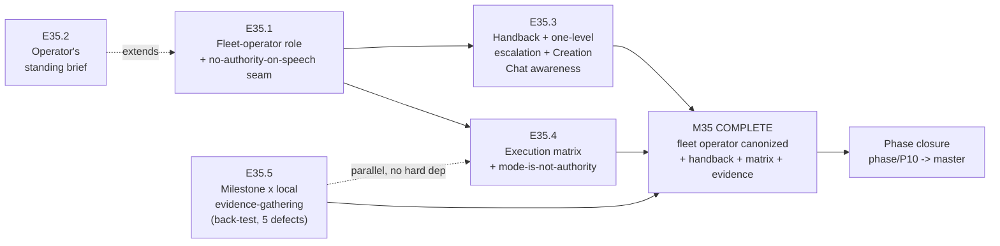

> **Correction (Phase Chat, 2026-07-31, resolving escalation notice
> `.ai-project/artifacts/escalation-notices/2026-07-31T00_00_00Z__P10-M35__escalation_notice.md`,
> filed by the M35 Milestone Chat after E35.5 verified its harvest target before using it).**
> Every mention below of `Getawayinsured2023` "already" running Phase/Milestone on a local model,
> or offering a "natural experiment" to harvest, is **false** and preserved here only as the
> planning-time record. `Getawayinsured2023` routes `phase`/`milestone` to
> `remote:qwen3.6:27b` — a legitimate override on the **model/tier** axis, silent on **locality**.
> There was nothing to harvest on the axis E35.5 was evaluating. This does not affect E35.5's own
> back-test delivery, which is independent of the harvest claim (M35 closed clean on that
> delivery); it narrows the evidence base for any future `model-routing-policy.md` row P4 decision.
> The corresponding phase spec claim is corrected at v1.3.1.

# Milestone M35 — System-Operator Canonization

## Purpose

Canonize the fleet operator's role and its authority boundary, and close two gaps SN-25 found in
that boundary the moment the CFO started running real agentic work at scale: an operator that
cannot hand back when it hits something it cannot judge is under-specified, and a Phase/Milestone
posture frozen at Manual/Paid no longer matches what the framework's own Execution Mode mechanism
(P9-M31-E31.1) was already built to allow. M35 records the fix as **rules**, not mechanisms —
Drivr (P11) builds the runner→chat channel and the mode switch; this milestone's job is to make
sure the rules those mechanisms will enforce are written down correctly before anything is built
against them.

This milestone ensures:
- **The fleet operator role is canonized**, form-neutral, with the no-authority-on-speech seam
  normative and a standing brief that any implementation can consume (E35.1, E35.2).
- **A blocked autonomous instance can hand back** — normatively, not aspirationally — with the
  escalation routed exactly one level and Creation Chat's awareness kept to visibility only
  (E35.3).
- **The execution matrix is ratified**, restoring agentic mode at Phase/Milestone while making
  explicit that mode never confers authority (E35.4).
- **The Milestone × local-inference question gets real evidence**, not an abstract decision —
  a back-test against defects this phase already knows the ground truth of (E35.5).

**M35 is the third and final P10 milestone** (`is_final: true`). Independent of M33/M34 in
dependency — both are closed and this milestone touches neither. On M35's closure, the Phase
Chat proceeds to phase closure (`phase/P10 → master`) via the PSG §5C canonical closure sequence.

---

## This Milestone Is Not Cross-Repo — a contrast worth stating

Unlike M33 and M34, **M35's deliverables land entirely in this repo.** There is no target
project receiving a stamp or a bump; the fleet operator's role, the handback rule, the execution
matrix, and the evidence evaluation are all governance record, committed to `phase/P10`. The one
exception in kind is E35.5, whose evaluation *exercises* other projects' configurations
(`Getawayinsured2023`'s live local-Milestone setup) as evidence sources without modifying them —
still a governance-record deliverable, not a cross-repo bump.

---

## Binding Context (settled scope — NOT for re-debate)

Per the P10 phase spec (v1.3.0), SN-23, SN-24, SN-25, and both 2026-07-28 HQ Rulings plus the
2026-07-30 HQ Ruling on SN-25, the following apply in full and are not open for re-examination in
this Milestone or any Epic under it:

1. **The operator is named by role, not by implementation.** Neither "System Chat" nor "Drivr's
   daemon" — a chat window, a daemon, a cron job, or a person with a terminal are all admissible
   fillers; the role and its boundary hold regardless (SN-24, form-only).
2. **Handback is a role obligation, and its destination is the immediate parent — not "a
   human."** The human is reached because the chain terminates at a manual level by construction
   (Creation/HQ, permanently manual, SN-22) — termination is guaranteed by SN-22, not by hope
   (SN-25 ruling, Decision 1).
3. **Escalation travels exactly one level.** Parent-only targeting; the parent decides
   resolve-or-escalate. Instance-judged routing was considered and rejected — it lets a child
   choose its own judge. **This does not close P9-GH-1**, which remains open (SN-25 ruling,
   Decision 2).
4. **Creation Chat awareness is visibility, never authority.** Seed Rule 3 stands. The one
   legitimate outlet is issuing a steering note to HQ (SN-25 ruling, Decision 3).
5. **The execution matrix is ratified, and mode is not authority.** Phase/Milestone restored to
   agentic-or-manual (the E31.1 baseline); Stage-2 accept and merge authorization still require
   the human's key regardless of running mode (SN-25 ruling, Decision 4).
6. **Milestone × local inference is neither opened nor closed — it opens or closes on evidence,**
   measured as review quality, not throughput or cost, against the concrete back-test bar (SN-25
   ruling, Decision 5).
7. **Nothing is built in P10.** No block detector, no mode switch, no runner→chat channel, no
   dispatch wiring for Phase/Milestone agentic declarations, no push-notification work. M35
   records; P11 builds (SN-24 and SN-25 rulings, both Decision 8).

Design decisions **intentionally open**, belonging to the Milestone/Epic Chats:
- The exact governance surface E35.4 amends to record the execution matrix (`chat-hierarchy.md`'s
  Execution Mode section is the phase spec's stated expectation, not a fixed requirement).
- The mechanism E35.5 uses to conduct the back-test evaluation (a manual Milestone Chat run on a
  local model against real transcripts is the phase spec's stated expectation; the Epic Chat may
  find a better vehicle).
- Final epic decomposition and sequencing within the no-hard-ordering set (E35.1–E35.4).

---

## Problem Statement

Two verified gaps, surfaced by the CFO running real agentic work at scale during and after M34
(SN-25, 2026-07-30):

- **Autonomy has no way to call for help.** The framework can dispatch work to run unattended
  (`bin/run-dev-agent`, in force since P7 and exercised repeatedly in M33/M34). It has no way for
  that work to surface a block it cannot resolve. An instance that hits something requiring human
  judgment has exactly two exits today — finish wrongly, or stop silently — and M33's own
  evidence (E33.2 Run A: exit 0, zero work) shows a reader cannot reliably tell which happened
  from the exit code alone.
- **The Execution Mode mechanism is normative but unconsumed at Phase/Milestone, and SN-23
  narrowed it further than the mechanism itself required.** `chat-hierarchy.md` (P9-M31-E31.1)
  already states Execution Mode applies to "Phase, Milestone, and Epic instances only" and
  records its own gap in its own words — no dispatch mechanism yet consumes a Phase/Milestone
  agentic declaration. SN-23's fixed posture (Manual/Paid through Milestone) was the right choice
  for P10's opening state; the CFO's 2026-07-30 precision is that the underlying question was
  never "should this be possible" but "should P10 build the dispatcher" — and the matrix answers
  the first without answering the second (E35.4 records only the matrix; E35.5's evidence, not
  this milestone, informs any future dispatcher work; P11 builds it).

A third, load-bearing fact this milestone must record honestly rather than solve: **block
detection is itself unproven.** E33.2 Run A returned exit 0 having done zero work; E33.4 returned
exit 2 having produced complete, green work. Two-sided and corroborated across two projects — on
this stack the exit code is not a completion signal, and the lane that would supply a trustworthy
one (`epic_qa`) has zero captured runs (G11). A handback rule recorded without this caveat would
read as more solved than it is.

---

## Goals

By the end of this milestone:

1. **The fleet operator role is canonized, form-neutral** — recorded normatively with the
   no-authority-on-speech seam and a standing brief any implementation can consume (E35.1, E35.2).
2. **A blocked autonomous instance can hand back, normatively** — the escalation-notice handback
   is recorded as authority-bearing, routed exactly one level, with P9-GH-1 explicitly not closed
   by it, and Creation Chat's awareness recorded as visibility-only with its outlet named (E35.3).
3. **The execution matrix is ratified and recorded**, with mode-is-not-authority stated explicitly
   (E35.4).
4. **The Milestone × local-inference question has real evidence** — a back-test evaluation
   against the phase's own known defects, measuring review quality, with a recorded pass/fail
   judgment (E35.5).
5. **The block-detection risk is recorded, not smoothed over** — P10-GH-7 carried forward with
   its two-sided evidence, so a future reader of the handback rule sees its dependency plainly.

---

## Non-Goals

This milestone explicitly does **not**:

- Build a block detector, a mode-switch trigger, or a runner→chat channel — P11 (Drivr).
- Wire dispatch for Phase/Milestone agentic declarations — the matrix records that mode is
  *possible*, not that a dispatcher exists. E31.1's own gap statement stands unresolved by this
  milestone.
- Build push-notification work of any kind — deferred under the SN-24 ruling, restated here.
- Decide `model-routing-policy.md` row P4 — E35.5 produces evidence and a judgment; moving the
  row (if warranted) is a further HQ call on that evidence, not this milestone's output.
- Widen any instance's authority. Mode restoration is explicitly **not** authority restoration —
  Stage-2 accept and merge remain human-keyed regardless of running mode.
- Close P9-GH-1. The one-level escalation rule is adjacent protection, not the same fix.
- Build a local-inference scheduler, revisit the runtime fork (settled, M33), or scope any other
  parked P10 item (competing-model review, P9-GH-3, ComfyUI, P8-GH-2).
- Produce Epic specs or Epic Execution Chat Starters at the Phase level — the Milestone Chat's
  job (adjacency); this spec defines epic scope, deliverables, and acceptance criteria only.

---

## In Scope

- **E35.1** — the fleet-operator role and the no-authority-on-speech seam, recorded normatively,
  form-neutral.
- **E35.2** — the operator's standing brief, form-neutral, extending M32/E32.2's re-instantiation
  seed.
- **E35.3** — the handback rule, the one-level escalation rule, and Creation Chat awareness-only,
  recorded normatively.
- **E35.4** — the execution matrix, ratified and recorded, with mode-is-not-authority stated
  explicitly, and the SN-23 Ratified Decision #2 supersession recorded.
- **E35.5** — the Milestone × local-inference back-test evaluation, conducted and its judgment
  recorded, with P10-GH-7 carried forward as the dependency any of this rests on.

## Out of Scope

- Everything under Non-Goals; additionally any P11 work of any kind, and any change to M33 or M34
  (both closed).

---

## Hard Constraint (binding — carries to every Epic under this Milestone)

**Nothing built in P10.** Every epic in this milestone produces a governance **record** —
normative text, a ratified table, a recorded evaluation judgment — never a mechanism. If an epic
finds itself writing code that detects a block, switches a mode, or opens a chat, it has drifted
out of M35's scope and must stop and escalate to the Phase Chat rather than proceed.

**E35.5's evidence must be real, not invented.** The back-test bar names five actual, already-
adjudicated defects from this phase's own history (M33's decomposition gap, E33.2 Run A's false
positive, E33.4's false negative, M34's footboard dirty-entry miscount, P10-GH-6's starter-lint
false positive). The evaluation is run-first in the same sense M33's runtime decision was: the
judgment must derive from an actual local-model review of real material, not a memo arguing what
such a review would probably find. If `Getawayinsured2023`'s configuration is harvested, its
evidence is that project's alone until corroborated elsewhere — it must not be silently
generalized into a fleet standard.

---

## Planned Epics

### Confirmed Epics

- **E35.1 — Fleet-operator role + no-authority-on-speech seam**
- **E35.2 — Operator's standing brief**
- **E35.3 — Handback + one-level escalation + Creation Chat awareness**
- **E35.4 — Execution matrix ratification + mode-is-not-authority**
- **E35.5 — Milestone × local-inference evidence-gathering**

> **Artifact scope (adjacency).** The Phase Chat produces only this Milestone spec and the
> Milestone Execution Chat Starter. The **Milestone Chat** owns final epic planning and authors
> every Epic spec and Epic Execution Chat Starter. Epic identifiers here are indicative
> decomposition; the Milestone Chat may adjust epic boundaries within this milestone's scope
> (e.g., E35.1/E35.3 could reasonably merge — both are pure role-and-boundary record work — if
> the Milestone Chat judges that cleaner).

### Deferred Epics

- None at planning time. E35.5's *extent* is conditional on how much back-test material is
  needed to reach a defensible pass/fail (the five named defects are a floor, not a ceiling), but
  the epic itself is not deferred.

---

## Epic Detail

### E35.1 — Fleet-operator role + no-authority-on-speech seam

**Source:** P10 phase spec §P10.3; SN-23 (operator role); SN-24 ruling (form-neutral amendment).

**Grounding:** the operator role and its authority boundary are the base this milestone's other
epics build on — E35.3's handback rule and E35.4's execution matrix both presuppose an operator
whose authority is already bounded. Sequencing this first (or alongside E35.3) keeps the
dependency direction honest.

**Deliverables:**
1. Normative record (governance doc — location the Epic Chat's design decision, likely
   `governance/systems/chat-hierarchy.md` or a new operator-role section) that the fleet operator
   runs the serialized local-inference lane, decides what runs next, and keeps registered
   projects current on governance version.
2. The no-authority-on-speech seam recorded: the operator holds no authority to act fleet-wide on
   a spoken word; a request to it is a proposal until it carries authority behind it.
3. Explicit statement that the operator's implementation is form-neutral and out of this repo's
   control — a chat, a daemon, a cron job, or a human are all admissible fillers.

**Definition of Done:**
- [ ] The operator role and the no-authority-on-speech seam are recorded normatively, in
      role-only (not implementation) language
- [ ] Full suite green (366 baseline, no new skips)

**Acceptance Criteria:**
- [ ] A reader can state what the fleet operator may and may never do without finding any
      implementation named

**Sequencing:** no hard dependency on other M35 epics; natural first or alongside E35.3.

---

### E35.2 — Operator's standing brief

**Source:** P10 phase spec §P10.3; SN-22 (open item); M32/E32.2 (re-instantiation seed this
extends); SN-24 ruling (ritual → standing brief amendment).

**Grounding:** the operator needs to know, each cycle, what to run and what state the fleet is
in — content already partially begun by M32/E32.2's re-instantiation seed. SN-24 retired the
"daily re-instantiation" framing (a ritual implies a chat re-spawning itself each morning) in
favor of a form-neutral artifact any implementation consumes on its own cadence.

**Deliverables:**
1. The standing brief: what the operator needs each cycle to run the lane and keep the fleet
   current, within E35.1's authority boundary — form-neutral (consumable by a chat re-reading it,
   a daemon loading it on boot, or a human consulting it).
2. Explicit extension note connecting it to M32/E32.2's original re-instantiation seed content.

**Definition of Done:**
- [ ] The standing brief exists, is form-neutral, and is usable by a reader regardless of what
      implements the operator role
- [ ] Full suite green (366 baseline, no new skips)

**Acceptance Criteria:**
- [ ] A reader unfamiliar with any specific implementation can state what the operator needs to
      know each cycle from the brief alone

**Sequencing:** benefits from E35.1 existing first (the brief operates within E35.1's boundary)
but no hard dependency.

---

### E35.3 — Handback + one-level escalation + Creation Chat awareness

**Source:** SN-25 (Creation Chat, 2026-07-30); HQ Ruling on SN-25, Decisions 1–3.

**Grounding:** SN-25's founding observation — an operator that cannot hand back is
under-specified — applies to any autonomous execution instance, not only the fleet operator
narrowly construed; M35 is where the operator's obligations are recorded, and this epic is where
that specific obligation lands.

**Deliverables:**
1. **The handback rule**, recorded normatively: a blocked autonomous instance must surface the
   block, with enough context for the receiving level to act; the resulting intervention is
   authority-bearing; the destination is the **immediate parent**, not "a human" — the human is
   reached because the chain terminates at a manual level by construction (Creation/HQ,
   permanently manual, SN-22).
2. **The one-level escalation rule**, recorded normatively: an escalation notice targets the
   issuing instance's immediate parent and nowhere else; the parent decides resolve-or-escalate;
   no instance names a target above its parent. Explicit statement that this does **not** close
   P9-GH-1 (adjacent protection, not the same fix).
3. **Creation Chat awareness**, recorded as visibility-only: aware of all escalation notices
   (a retrieval property over committed artifacts, never a subscription), with its one legitimate
   outlet named — issuing a steering note to HQ. Explicit Seed Rule 3 restatement: this must never
   become a resolution path.

**Definition of Done:**
- [ ] The handback rule is recorded with its correct destination (immediate parent) and its
      authority-bearing property stated
- [ ] The one-level escalation rule is recorded, with P9-GH-1 explicitly named as still open
- [ ] Creation Chat awareness is recorded as visibility-only with its outlet named
- [ ] Full suite green (366 baseline, no new skips)

**Acceptance Criteria:**
- [ ] A reader can trace, from the record alone, exactly where a blocked instance's escalation
      goes, who decides what happens next, and why the CFO's direct answers (the M34 precedent)
      are not a violation of the one-level rule

**Sequencing:** no hard dependency on other M35 epics.

---

### E35.4 — Execution matrix ratification + mode-is-not-authority

**Source:** SN-25 (Creation Chat, 2026-07-30); HQ Ruling on SN-25, Decision 4; P9-M31-E31.1
(the baseline this restores).

**Grounding:** `chat-hierarchy.md`'s Execution Mode section already made agentic/manual normative
at Phase, Milestone, and Epic — SN-23 narrowed the *default* to Manual/Paid at Phase/Milestone for
P10's opening state without changing the mechanism. This epic records the restoration and, more
importantly, the constraint that makes restoring it safe.

**Deliverables:**
1. The execution matrix recorded normatively (design decision for the Epic Chat where —
   `chat-hierarchy.md`'s Execution Mode section is the phase spec's expectation):

   | Level | Execution Mode | Inference locality |
   |---|---|---|
   | Creation | Manual only (permanent, SN-22) | Remote |
   | HQ | Manual only (permanent, SN-22) | Remote |
   | Phase | Agentic or manual | Remote |
   | Milestone | Agentic or manual | Remote — local under evaluation (E35.5) |
   | Epic | Agentic or manual | Local or remote (in force, E34.3) |

2. **Mode-is-not-authority**, stated explicitly and unambiguously: restoring agentic mode at
   Phase/Milestone says an instance *may run unattended*; it does **not** widen what that instance
   may *authorize*. Stage-2 acceptance and merge authorization still require the human's key
   regardless of running mode.
3. The SN-23 Ratified Decision #2 supersession recorded (already reflected in the phase spec's
   Ratified Decisions footnote, v1.3.0) — this epic's record and the phase spec's footnote must
   agree with each other.

**Definition of Done:**
- [ ] The execution matrix is recorded normatively, matching the phase spec's table exactly
- [ ] Mode-is-not-authority is stated explicitly, naming Stage-2 acceptance and merge
      authorization as the acts that still require the human's key
- [ ] Full suite green (366 baseline, no new skips)

**Acceptance Criteria:**
- [ ] A reader cannot come away believing agentic mode at any level grants acceptance or merge
      authority

**Sequencing:** no hard dependency on other M35 epics.

---

### E35.5 — Milestone × local-inference evidence-gathering

**Source:** SN-25 (Creation Chat, 2026-07-30); HQ Ruling on SN-25, Decision 5.

**Grounding:** `model-routing-policy.md` row P4 defaults Milestone to paid frontier because
Milestone holds Stage-2 accept authority and its errors propagate into merges — not because of
cost. The cell is not settled either way; it opens or closes on evidence, run-first, the same
discipline that produced M33's runtime decision.

**The evaluation mechanism is a design decision for the Epic Chat, not fixed by this spec.** The
phase spec's stated expectation — a manual Milestone Chat run on a local model, per the
execution matrix's already-live Manual/Local cell — needs no new capability;
`Getawayinsured2023`'s own `.ai-project.yml` already runs exactly this configuration and is
available to harvest as a natural experiment (a legitimate override per the yml-spec's
defaults-provenance note, not a policy violation).

**Deliverables:**
1. A back-test of a local model's Stage-2 review against, at minimum, these five known-ground-
   truth defects: M33's decomposition gap (E33.4's completion-criteria find), E33.2 Run A's
   false-positive completion (exit 0, zero work), E33.4's false-negative completion (exit 2,
   complete and green work), M34's footboard dirty-entry miscount, and P10-GH-6's starter-lint
   false positive on real milestones.
2. The evaluation measures **review quality** — does the local model's review catch what was
   caught and flag what was missed, on material it was not told the answer to — not throughput or
   cost.
3. A recorded **pass/fail judgment**, with reasons, on whether a local model is a candidate for
   the Milestone-locality cell. A pass is necessary evidence, not by itself sufficient to move
   row P4 — that further call belongs to HQ.
4. If `Getawayinsured2023`'s configuration is harvested: explicit labeling that its evidence is
   that project's alone until corroborated, never silently generalized to a fleet standard.

**Definition of Done:**
- [ ] The back-test runs against real material (transcripts, diffs, or run records this phase
      already produced) — not hypothetical scenarios
- [ ] Each of the five named defects has a recorded catch/miss result for the local model's review
- [ ] A pass/fail judgment is recorded with its reasons, explicitly scoped as evidence for a
      further HQ call, not a row-P4 decision itself
- [ ] Full suite green (366 baseline, no new skips) — for changes touching this repo

**Acceptance Criteria:**
- [ ] A reader can state, from the recorded evidence alone, whether the local model caught each
      of the five named defects, and what the resulting judgment concluded

**Sequencing:** no hard dependency on E35.1–E35.4; may run in parallel. The long pole of the
milestone — evidence-gathering, not governance-record authorship.

---

## Branch Strategy

```
master
└── phase/P10                      (M33, M34 already consolidated here)
    └── milestone/M35              ← this milestone (Milestone Chat branches from phase/P10)
        ├── epic/P10-M35-E35.1     ← fleet-operator role + no-authority-on-speech seam
        ├── epic/P10-M35-E35.2     ← operator's standing brief
        ├── epic/P10-M35-E35.3     ← handback + one-level escalation + Creation Chat awareness
        ├── epic/P10-M35-E35.4     ← execution matrix + mode-is-not-authority
        └── epic/P10-M35-E35.5     ← Milestone x local-inference evidence-gathering
```

Epic PRs target `milestone/M35`. Consolidation PR: `milestone/M35 → phase/P10`. **M35 is the
final P10 milestone** (`is_final: true`) — on its consolidation, the Phase Chat proceeds directly
to phase closure (`phase/P10 → master`) via the PSG §5C canonical closure sequence, ending in the
Phase Closure Declaration, which restates the parked/deferred items (P9-GH-1, P9-GH-3, ComfyUI,
P8-GH-2, and now P10-GH-7) with their triggers.

**No cross-repo note needed** — unlike M33/M34, every M35 deliverable lands in this repo (see
"This Milestone Is Not Cross-Repo" above).

---

## Prerequisites

- This Milestone spec and its Milestone Execution Chat Starter are git-tracked on `phase/P10`
  (verify with `git ls-files --error-unmatch <path>` on `phase/P10`).
- **M33 and M34 consolidated on `phase/P10`** (merges `2180aa4`, `44c4159`).
- **Phase spec at v1.3.0** on `phase/P10` — the single-pass M35 re-scope (SN-24 + SN-25 folded
  together) this milestone spec is derived from.
- On master at v7.0.0 (applied substrate, reference): `governance/systems/chat-hierarchy.md`'s
  Execution Mode section (P9-M31-E31.1) — E35.4's amendment target; P9's SN-21 canonization +
  re-instantiation seed (M32/E32.1–E32.2) — E35.2's base; `.ai-project/artifacts/escalation-notices/`
  — the existing artifact type E35.3's handback rule reuses, with the M34 escalations as worked
  examples.
- `model-routing-policy.md` row P4 (`.ai-project/artifacts/reference/token-measurement/model-routing-policy.md`)
  — the evidence-derived decision E35.5's evaluation engages with.
- **`Getawayinsured2023`'s live `.ai-project.yml`** (`phase`/`milestone` pointed at
  `qwen3.6:27b`) — E35.5's candidate natural-experiment source, external to this repo, CFO-side.
- Reference context: SN-25
  (`.ai-project/artifacts/steering-notes/2026-07-30__creation-chat__steering-note__escalation-handback-and-execution-matrix.md`);
  the HQ Ruling
  (`.ai-project/artifacts/rulings/2026-07-30__ai-project-system-hq__ruling__sn-25-handback-and-execution-matrix.md`);
  the M34 Milestone Closure Declaration (P10-GH-7's origin).

---

## Dependencies and Sequencing

- **No dependency on M33 or M34** beyond both being closed (satisfied) — M35 does not consume
  either milestone's specific outputs the way M34 consumed M33's.
- **Within M35, E35.1–E35.4 have no hard ordering among them** — all are governance-record work
  with no shared file contention beyond the phase spec itself (already re-scoped at the Phase
  Chat level, so epic authorship should not need to touch §P10.3 further).
- **E35.5 has no hard dependency on E35.1–E35.4** and may run in parallel — it is evidence-
  gathering work, materially different in kind from the other four.
- **M35 → phase closure is binding:** phase closure does not begin until M35 consolidates. M35 is
  P10's final milestone.

---

## Definition of Done (Milestone)

- [ ] E35.1 through E35.5 each meet their Definition of Done above
- [ ] All five epic branches merged to `milestone/M35`
- [ ] The fleet-operator role, the no-authority-on-speech seam, and the standing brief are
      recorded, form-neutral
- [ ] The handback rule and the one-level escalation rule are recorded, with P9-GH-1 explicitly
      not closed by them, and Creation Chat awareness recorded as visibility-only
- [ ] The execution matrix is ratified and recorded, with mode-is-not-authority stated explicitly
- [ ] The Milestone × local-inference back-test evaluation is conducted with a recorded pass/fail
      judgment against the five named defects
- [ ] P10-GH-7 is recorded as a carried-forward risk, not resolved
- [ ] Full suite green on `milestone/M35` (366 baseline, no regressions, no new skips)
- [ ] Milestone Closure Declaration produced (`is_final: true` — triggers phase-closure
      preparation)

---

## Acceptance Criteria (Milestone)

1. The fleet-operator role, seam, and standing brief are recorded normatively and form-neutral
   (E35.1, E35.2).
2. The handback rule is recorded with its correct destination (immediate parent) and its
   authority-bearing property; the one-level escalation rule is recorded with P9-GH-1 explicitly
   named as still open; Creation Chat awareness is recorded as visibility-only with its outlet
   named (E35.3).
3. The execution matrix is recorded and ratified; mode-is-not-authority is stated explicitly,
   naming Stage-2 acceptance and merge authorization as the acts still requiring the human's key
   (E35.4).
4. A back-test evaluation against the five named defects is conducted, measuring review quality,
   with a recorded pass/fail judgment scoped as evidence for a further HQ call — not a row-P4
   decision itself (E35.5).
5. P10-GH-7 (two-sided exit-code untrust + unexercised G11 QA lane) is recorded as the
   block-detection risk any future handback mechanism depends on.
6. The full suite is green at milestone delivery — no regressions, no new skips.

---

## Timeline

**Target Start:** 2026-07-30
**Target Completion:** 2026-08-06 (~1 week; E35.1–E35.4 are governance-record epics with no hard
ordering and should move quickly; E35.5's evidence-gathering is the long pole and may extend the
estimate — run-first ordering means its duration is discovered, not assumed, same as M33's
runtime decision)
**Actual Start:** Not started
**Actual Completion:** Not started

---

## Visual Bindings

**Visual binding**
- **Link:** (inline — Structural diagram; no hosted link needed per AOG §17.3/§17.5)
- **What:** diagram
- **Level:** Milestone
- **State:** proposed



- **Description:** M35's five-epic flow — the operator role and its standing brief ground the
  handback/escalation record; the execution matrix is ratified independently; the local-inference
  evaluation runs in parallel as evidence-gathering, not governance authorship. All five feed the
  milestone's completion, which is P10's final gate before phase closure. Proposed-track
  Structural diagram (AOG §17.3/§17.6).

---

## Notes

- **This milestone is a re-scope, not a fresh scoping.** Its content was folded from two
  Creation Chat sessions (SN-24, SN-25) and two HQ Rulings, per HQ's explicit Decision 6
  instruction to re-scope once rather than patch M35 twice. Every epic here traces to one of those
  four artifacts — nothing is invented at the Milestone-spec layer.
- **The Hard Constraint is the load-bearing rule of this milestone**, same shape as M33's:
  P10 exists to prove adoption without building new capability; M35 recording a mechanism instead
  of a rule would violate that founding discipline inside the very milestone meant to protect it.
- **E35.5 can be small or large depending on what the evidence needs** — a clean pass or fail on
  the five named defects with clear reasoning is a full success; padding the evaluation with
  material beyond what the bar requires is not rewarded.
- **P10-GH-7 is not this milestone's problem to fix.** It is recorded so the handback rule (E35.3)
  is read with its real dependency attached, not as a solved problem. Fixing it is P11's
  prerequisite, not P10's.
- **On the suite baseline:** the 366/0/0 suite lives in this framework repo, and every M35
  deliverable touches this repo (no cross-repo split to reason about, unlike M33/M34).
- Default-accept (PSG §11.6 / AOG §14) governs this milestone's delivery: clean Epic/Milestone
  deliveries are accepted by silence; a Review Decision is the exception path only. Per SN-19,
  acceptance and the merge instruction are in-chat acts — no ceremonial artifact. The harness
  enforces explicit human authorization on every merge regardless.
