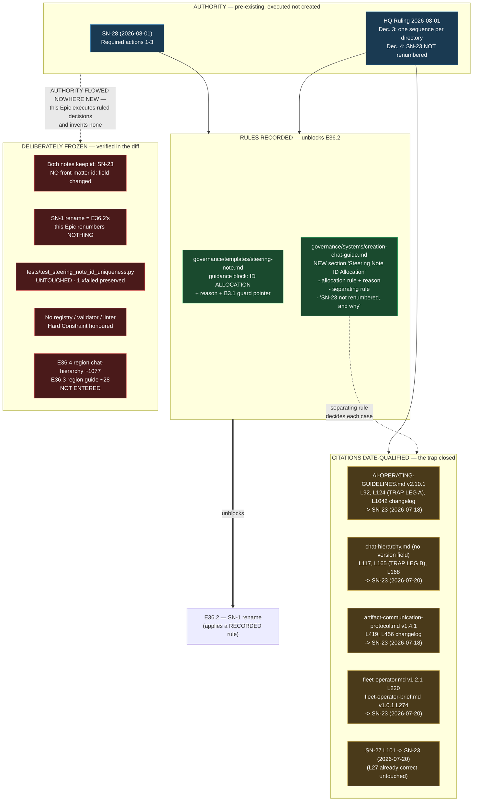

# Delivery Notice: P11-M36-E36.1 — Steering Note ID allocation rule + SN-23 date-qualified citations

## Summary

Execution complete; **awaiting Stage-2 review and merge authorization** (nothing is merged).

The Epic recorded the two rules E36.2 is blocked on — **ID allocation** and the separating rule
*a bookkeeping defect never rewrites a citation in a normative document* — and then closed the
milestone's **High-severity citation trap** by date-qualifying **every** SN-23 citation in the
normative tier. Both legs of the trap were re-located and confirmed before editing
(`AI-OPERATING-GUIDELINES.md:124`, `chat-hierarchy.md:165`), and a reader following either citation
now lands on the note it actually means. **The path from an AOG citation to the false conclusion
"platform agnosticism was superseded" no longer exists.**

Nothing was renumbered. `tests/test_steering_note_id_uniqueness.py` was not touched. No mechanism
was built.

## Merge Details

**Not yet merged** — this Epic stops after PR creation per the Execution Contract.

- PR Number: *(filled on merge)*
- PR URL: *(filled on merge)*
- Merge Commit: *(filled on merge)*
- Target Branch: `milestone/M36`
- Merge Strategy: *(parent chat's call)*
- Merge Time: *(filled on merge)*

> **P10-GH-4 recurrence, for the record.** The committed template's `merge_details` block is
> **unfillable by the producing Epic** — the Delivery Notice is authored *before* review and merge
> by construction, so every field in it is necessarily `pending`. Recorded as another instance of
> the known carry-forward; not worked around, and no template change attempted (out of scope).

## Duration

- Started: 2026-08-03
- Completed: 2026-08-03
- Total Time: 1 session

## Final Artifacts

**Rules recorded (deliverables 1, 2, 4):**
- `governance/templates/steering-note.md` — allocation rule with its reason, in the author-facing
  guidance block
- `governance/systems/creation-chat-guide.md` — new **"Steering Note ID Allocation"** section:
  allocation rule + reason, the separating rule, and the explicit *"SN-23 is not renumbered, and
  why"* statement with the two-meaning disambiguation table

**Citations date-qualified (deliverable 3):**
- `governance/AI-OPERATING-GUIDELINES.md` (v2.10.0 → **2.10.1**) — lines 92, 124, 1042
- `governance/systems/artifact-communication-protocol.md` (v1.4.0 → **1.4.1**) — lines 419, 456
- `governance/systems/chat-hierarchy.md` — lines 117, 165, 168 *(no version field; see P10-GH-8 note)*
- `governance/systems/fleet-operator.md` (v1.2.0 → **1.2.1**) — line 220
- `governance/systems/fleet-operator-brief.md` (v1.0.0 → **1.0.1**) — line 274
- `.ai-project/artifacts/steering-notes/2026-07-31__…__P11-drivr-spine.md` — line 101 *(line 27
  verified already correct and left untouched)*

**Evidence + record:**
- `docs/phases/P11__Drivr_Coordination_Over_Rented_Execution/P11-M36-E36.1__sweep-evidence.md`
- `docs/phases/P11__Drivr_Coordination_Over_Rented_Execution/P11-M36-E36.1__delivery-notice.md`

---

## The sweep, evidenced

**Command:**

```bash
grep -rn "SN-23" governance/ .ai-project/artifacts/
```

Run **before the first edit** on `milestone/M36` and **after** on the delivered branch. **Full
output of both runs is committed** at `P11-M36-E36.1__sweep-evidence.md` §1–§2 — the DoD requires
the sweep evidenced, not claimed, so the raw output is in the repository rather than summarized
here. Counts: **110 matching lines before, 121 after** (11 → 22 within `governance/`).

**Result — no un-dated SN-23 citation remains in the normative tier.** **Seventeen** bare `SN-23`
occurrences do remain in `governance/` (39 total, 22 date-qualified), and **none is a citation** —
each either names the shared identifier itself (*"the surviving `SN-23` collision"*), quotes the
historical defective text this Epic fixed (*"each cited «SN-23 Decision 2»"*), or describes the
change class (*"SN-23 citations date-qualified"*). In all three cases a date would be a category
error, asserting the sentence is about one note when it is about both. **Four are in the new
allocation section; thirteen are in the four new changelog rows this Epic itself authored.** All
seventeen are enumerated by location and justification class in sweep-evidence §4.

> **Corrected in v1.1 following Stage-2 review.** v1.0 of this notice stated *"four … all inside the
> new allocation section"*, mirroring the same error in sweep-evidence §4. The undercount came from
> a **line-oriented** count that dropped any line containing a dated form — and each new changelog
> row contains both forms on one line, hiding all thirteen. Recount is occurrence-oriented. **The
> justification reasoning was correct and extends to all seventeen unchanged; no governance document
> required any change, and no re-sweep was needed** — §2's raw output was complete throughout.

---

## Divergence from the spec's planning-time facts

The Epic was directed to re-verify rather than trust, and to state differences. **Both re-checks
came back clean:**

| Planning-time claim | Re-measured | Divergence |
|---|---|---|
| 11-row SN-23 inventory, with line numbers | All 11 confirmed at **exactly** the stated lines | **None** |
| Both trap legs at `AOG:124` / `chat-hierarchy.md:165` | Confirmed in place | **None** |
| SN-27 line 27 already qualified, line 101 not | Confirmed exactly | **None** |
| Suite baseline `375 passed / 1 xfailed` | `375 passed, 1 xfailed` | **None** |

The sweep found **no** normative-tier citation the inventory had missed. Stated plainly because the
spec treats the inventory as a floor: in this case the floor and the ceiling coincided.

---

## The four judgment calls, and the reasoning

All four were assigned to this Epic to decide, not escalate. Each was decided **and written down
before being applied**, so the sweep was consistent rather than retrofitted.

### 1. Which surface holds the separating rule → `creation-chat-guide.md`

Placed in the new "Steering Note ID Allocation" section, immediately after the allocation rule.

**Reasoning.** The template is a **fill-in form consumed at write time** — an author needs the
allocation rule there because they cannot file a note without picking an ID. The separating rule is
**remediation procedure for allocation that already failed**, which no author needs in order to fill
the form. Putting it in the guide keeps the template's guidance block short enough to actually be
read, and puts the rule in front of the reader who just learned how IDs are allocated — the reader
best positioned to ask "so what happens when this went wrong?". The template carries a one-line
pointer to it rather than a copy, so there is a single home for the rule.

### 2. Changelog-line citations → **date-qualified**

Applied to `AI-OPERATING-GUIDELINES.md:1042` (v2.10.0 row, 3 occurrences) and
`artifact-communication-protocol.md:456` (v1.3.0 row, 3 occurrences), consistently.

**Reasoning.** The competing framing is that date-qualifying a changelog entry **falsifies a
historical record**. It does not, for three reasons. First, a changelog entry in this framework is
not a frozen transcript — it is a **live, reader-facing index into why the document currently says
what it says**, and readers follow its citations exactly as they follow body citations. The trap
operates there identically. Second, the date being added **was true when the entry was written**:
the v2.10.0 entry genuinely cited the 2026-07-18 note, and the citation only became ambiguous
**later**, on 2026-07-20 when the second SN-23 was filed. Annotating a pointer that a later event
made ambiguous is not revision; falsification would be altering what the edit *did* or *claimed*,
and no such text was touched. Third and decisively: **the AOG changelog sits inside a normative
document**, so leaving it bare would fail the DoD's *"no un-dated SN-23 citation remains in the
normative tier"* on its own terms.

Where a row already carried the date in a different shape (*"Per SN-23 (CFO-ratified 2026-07-18)"*),
it was rewritten to *"Per SN-23 (2026-07-18), CFO-ratified"* — same facts, standard form, no
redundant double date.

### 3. Already-path-qualified citations → **date form added**

Applied to `fleet-operator.md:220` and `fleet-operator-brief.md:274`.

**Reasoning.** Path-qualification genuinely does disambiguate for a careful reader, and leaving
these alone was defensible. The date form was added anyway because **two valid disambiguators is
one too many**: it forces a reader to *learn* that a file path also counts as qualification, and it
destroys the property that makes the fix durable. With a single form, the rule is mechanical and
greppable — **bare `SN-23` means unresolved, `SN-23 (date)` means resolved** — which is exactly what
lets a future sweep (or E36.5's audit) find stragglers without human judgment. That property is
worth more than the two-word saving, and the cost is two changelog rows.

### 4. `creation-chat-guide.md:150` → reads as **SN-23 (2026-07-20)**

*"…it is how SN-23, SN-24 and SN-25 themselves arrived."*

**Reasoning.** Genuinely ambiguous, and **both readings are literally true** — both SN-23s arrived
via the Steering-Note channel, which is what the sentence asserts. Resolved on provenance and
enumeration: the sentence is lifted near-verbatim from **HQ Ruling 2026-07-30**
(`…__ruling__sn-25-handback-and-execution-matrix.md:106`), written in the P10 context, and it
enumerates a **consecutive run of recent Creation Chat notes** — SN-24 (2026-07-28), SN-25
(2026-07-30). The 2026-07-20 note is the one immediately preceding SN-24 in **both ID and date**,
and belongs to the same P10 arc the passage is about; reading it as the 2026-07-18 note makes the
list non-consecutive for no reason. **Nothing load-bearing rests on this citation** — it is
illustrative, not authority-bearing — which is why it was decided rather than escalated.

---

## Structural diagram (Binding Constraint 8)

Mermaid, fenced, in-repo, **no ComfyUI**. Named to the section, per the constraint's purpose of
making the CFO's §11.6.1 diff review cheap.



**What the diagram asserts, in words:** two rules landed on two surfaces; nine citation sites across
five normative documents plus one steering note were date-qualified; five things were deliberately
frozen; and **authority flowed nowhere new** — every decision executed here was already ruled by
SN-28 or the HQ Ruling of 2026-08-01, with the sole exceptions being the four judgment calls the
milestone spec explicitly delegated to this Epic.

---

## Definition of Done — verification

| # | DoD item | Status | Evidence |
|---|---|---|---|
| 1 | Allocation rule in **both** template and guide, **with its reason** | ✅ | `steering-note.md` guidance block; `creation-chat-guide.md` §"The allocation rule". Reason recorded in both: provenance already lives in `issuer_chat` + filename slug, so the ID names position and nothing else |
| 2 | Separating rule recorded normatively; surface stated and justified | ✅ | `creation-chat-guide.md` §"When allocation has already failed"; justification in Judgment Call 1 above |
| 3 | Exhaustive sweep **performed and evidenced** over `governance/` + `.ai-project/artifacts/` | ✅ | Command + **full pre- and post-edit output committed** in `…__sweep-evidence.md` §1–§2 |
| 4 | No un-dated SN-23 citation in the normative tier | ✅ | sweep-evidence §2; four residual bare strings are non-citations, enumerated in §4 |
| 5 | Changelog-line treatment stated explicitly and applied consistently | ✅ | Judgment Call 2; applied to all 6 occurrences across the 2 changelog rows |
| 6 | Path-qualified-citation treatment stated explicitly | ✅ | Judgment Call 3 |
| 7 | `creation-chat-guide.md:150` resolved, reading recorded | ✅ | Judgment Call 4 → 2026-07-20 |
| 8 | SN-27 line 101 date-qualified (line 27 verified already correct) | ✅ | Both verified; only line 101 edited |
| 9 | Record states **SN-23 is not renumbered and why** | ✅ | `creation-chat-guide.md` §"The worked case: `SN-1` is renumbered, `SN-23` is not" — permanence by decision, the reason, and the B3.1 allowlisted-exception status |
| 10 | **Nothing renumbered**; `tests/test_steering_note_id_uniqueness.py` **untouched** | ✅ | Confirmed below |
| 11 | Structural Mermaid diagram | ✅ | Above |
| 12 | Full suite green, no regressions, **no new skips** | ✅ | Confirmed below |
| 13 | Delivery Notice produced and committed | ✅ | This document |
| 14 | PR opened to `milestone/M36` | ✅ | On completion of this delivery |

### Confirmation: nothing renumbered, test file untouched

- **No steering note's `id:` front-matter field was changed.** `git diff` over
  `.ai-project/artifacts/steering-notes/` contains **exactly one** changed line pair — SN-27's line
  101 prose citation. No `id:` line appears in the diff.
- **`tests/test_steering_note_id_uniqueness.py` is not in the changed-files list at all.** It was
  never opened for edit. The `1 xfailed` is present and unchanged in both the baseline and the
  final measurement, exactly as the starter required.
- **`SN-1` was not touched.** Its rename remains E36.2's.
- **Region discipline verified by diff-hunk inspection.** `chat-hierarchy.md` hunks are at lines
  **117, 165, 168** only — E36.4's annex region (~1077) was never entered. `creation-chat-guide.md`
  hunks are at **97–170** (the new section) and **224** (formerly 150) — E36.3's Re-instantiation
  Ritual (~28) was never entered.
- **No do-not-touch file appears in the diff:** `system-hq.md`, `system-hq-seed.md`,
  `templates/seed.md`, `templates/genesis.md`, `test_steering_note_id_uniqueness.py` — all clean.

### Re-measured suite result

```
375 passed, 1 xfailed in 23.90s
```

**375 passed / 1 xfailed** — identical to the re-measured pre-edit baseline, which itself matched
the spec's planning-time figure exactly. **No regressions, no new skips, and no skip introduced to
route around a change.** The single `xfail` is B3.1's guard, preserved untouched for E36.2.

### Extent vs. spec

Delivered **exactly** the spec's five Scope-of-Work items and nine deliverables — no more, no less.
One scope-pressure item was consciously declined: the sweep surfaced `governance/systems/`
version/changelog inconsistency (**P10-GH-8**), which prevented recording a version bump for the
`creation-chat-guide.md` edit — this Epic's largest single change. It was **noted, not fixed**, per
the spec's explicit instruction; each document was followed as it stands and nothing was normalized.
Full list in sweep-evidence §5.

### Claims vs. evidence

Every claim in this notice is backed by committed output or an inspectable diff. The three claims
most worth checking independently:

| Claim | Status |
|---|---|
| *"the inventory matched exactly"* | **Re-measured this session**, not inherited from the spec |
| *"the suite is unchanged at 375 / 1 xfailed"* | **Re-measured this session**; re-confirmed after the v1.1 correction |
| *"seventeen bare `SN-23` occurrences remain, none a citation"* | **Re-verified, not asserted** — see below |

**On the third.** v1.0 of this notice claimed **four**, and was wrong. The corrected figure is
**seventeen**, established by two independent occurrence-oriented counts (`grep -ro "SN-23"` = 39
total; `grep -roE "SN-23 \(2026-07-(18|20)\)"` = 22 dated; difference = 17) whose per-file
distribution matches the Stage-2 reviewer's figure exactly. It is now a **re-verified number rather
than an asserted one**, and the full per-location breakdown is in sweep-evidence §4.

**The failure worth recording, since this is the record-integrity milestone.** The original count
was line-oriented and therefore could not see per-occurrence facts: any line holding *both* a dated
and a bare form was discarded whole, which silently hid all thirteen occurrences in the four
changelog rows this Epic had just authored. The evidence in §2 was complete and correct throughout —
**the defect was in the analysis of the evidence, not the evidence** — which is why the correction
touched two report artifacts and no governance document, and required no re-sweep. It is precisely
the class of defect M36 exists to close, and it is corrected here rather than carried.

---

## Visual Bindings

**Visual binding**
- **Link:** *(inline — Structural diagram rendered in this document; no hosted link required per
  AOG §16.3/§16.5, and no ComfyUI involvement per constraint 8)*
- **What:** diagram
- **Level:** Epic
- **State:** implemented
- **Description:** Structural Mermaid diagram of E36.1's amendment: authority sources (SN-28, HQ
  Ruling 2026-08-01) → two rules recorded (steering-note template, creation-chat-guide) → nine
  citation sites date-qualified across five normative documents and SN-27 → five deliberately frozen
  items (SN-23's ID, the SN-1 rename, the B3.1 test file, no-new-mechanism, sibling-epic regions),
  with authority flowing nowhere new.

---

## Chat Closure

**Not closed.** Execution is complete and the PR is open, but this Epic **stops here and awaits
authorization** per the Execution Contract. Nothing has been merged and no acceptance is inferred.

**Next Step:** Milestone Chat M36 performs its Stage-2 review. Clean deliveries are accepted by
silence (SN-13 / PSG §11.6); merge authorization is a separate human-authorized in-chat act, and
the CFO is the mandatory diff reviewer under PSG §11.6.1.
