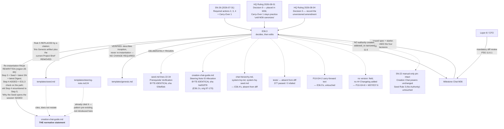

# Delivery Notice: P11-M36-E36.3 — Creation Chat re-instantiation reconciliation (SN-26)

## Design Decisions — recorded BEFORE the edits

*(This section was written and committed before any governance file was touched, per the Epic
Execution Chat Starter §Your Responsibilities item 5: "Write the reasoning before making the edits."
The commit that carries this section precedes the commit that carries the edits — the ordering is
visible in `git log` on `epic/P11-M36-E36.3`.)*

Four decisions were assigned to this Epic. All four are decided here. **None is escalated** — the
ruled decisions were not found to be in conflict.

### Decision 1 — `ai-project-system` renders NO `genesis.md`, and the ritual stops naming it as
### artifact #1 (spec direction 2)

**The diagnosis that decides it: `genesis.md` is a bootstrap artifact being asked to do a
continuity job.** `genesis.md` scopes *project identity, Phase 1 boundaries, and team composition*,
and it is consumed **once**, by the first Phase Chat (`start-a-project.md` Step 3;
`chat-hierarchy.md` Level 0). Re-instantiation is a **continuity** problem — what is true *now*.
The ritual conflated the two, and `creation-chat-guide.md` Step 4 said so out loud: *"`genesis.md`
gives project identity and Phase 1 boundaries."* For a project at P11, that is **Phase 1 scope
presented as the picture of the present**. The further a project runs, the more misleading
artifact #1 becomes.

**This generalizes — it is not an `ai-project-system` special case.** Every project past Phase 1
has this defect, not only the one that never rendered a genesis. That is what makes direction 2 a
fix to a framework document rather than a local exemption, and it is the strongest argument
against direction 1.

**Against direction 1 specifically:** authoring a genesis for this repository now would be a
**backdated artifact**. Its Phase 1 Scope, milestone stubs, and HQ Context Packet are historically
inert — P1 closed long ago. It would satisfy the ritual's letter while handing the next session the
least useful document in the repository, and it would have to be maintained or explicitly ignored
forever after. Direction 1's stated advantage — the E31.3 check "rides along" — is available more
cheaply from the Seed, which carries the same check (both from `d7ee7cd`) and, unlike a rendered
genesis, **exists for every project by construction**.

**Decision:** `ai-project-system` does not render a `genesis.md` and is not expected to have one.
The ritual stops requiring it. A project that *does* hold a committed `genesis.md` may pass it as
an explicitly optional supplement for original project identity — so the framework keeps serving
projects still inside Phase 1 — but it is never artifact #1 and never required.

### Decision 2 — No Project Brief is expected, **for re-instantiation purposes only**

`seed.md` Rule 4 makes the Project Brief the **inception convergence target of the full path** — an
artifact produced *with a human* before governance begins. `ai-project-system` bootstrapped itself
and reached P11 without one; its equivalent content lives in committed governance, phase specs, and
the Steering Note / Progress Digest stream. Requiring a Brief for re-instantiation would mean
authoring an inception artifact eleven phases after inception, for a session whose actual need is
current state.

**Decision:** no Project Brief is expected for re-instantiation. `seed.md` Rule 5's *"plus the
current Project Brief"* is removed; the generic template keeps the Brief where it belongs (Rule 4,
inception, full path).

**Kept disentangled, deliberately.** This decides **nothing** about whether a Project Brief would
serve some other purpose for this repository. SN-26 Carry-Over 2 records that the question touches
the parked, Brief-level *"sidekick-for-external-projects"* identity question and says in terms that
the two *"should not be entangled."* That question is out of P11 entirely and is untouched here.
The scope limiter is written into the canonized text itself, so a future reader cannot mistake this
for a ruling on the parked question.

### Decision 3 — The normative statement lives in `governance/systems/creation-chat-guide.md`,
### "Re-instantiation Ritual"

The obvious home is the correct one: it is **system-tier**, it already holds the four-step ritual,
and the templates are its consumers. `governance/templates/steering-note.md:24` **already** cites
it by name rather than restating it — the citation pattern is established, not invented here.

The other two surfaces:

- **`governance/templates/seed.md` Rule 5** → cites the guide, does not restate the artifact list.
- **`governance/templates/genesis.md`** → **verified to require no change.** It describes
  inception, never re-instantiation; its own Prerequisite Verification is inception-facing (*"do
  not fill in this genesis"*). It is counted as reconciled-by-verification, not edited.

### Decision 4 — Constraint 7 is honoured by **splitting the normative statement from the operative
### instruction**

This is the crux the spec named, and the spec's own distinction is the one adopted — with the
reason made explicit.

*"Cite rather than restate"* protects against **drift in a rule**: three copies of *which artifacts,
in what order, and why* can disagree, and did. That is a **statement about content**. The Seed's
Prerequisite Verification is not a copy of that statement — it is **an instruction the pasted Seed
must execute**, in the one document that is *itself the opening prompt of a fresh session*. A Seed
reduced to *"follow the guide's ritual"* would be a pointer handed to a session that does not yet
have the guide in context — and pointers do not run. SN-26 records that the Seed was **the only
surface that caused any verification to happen** in the session that found this defect.

**Decision:**

1. **`seed.md`'s Prerequisite Verification section is frozen byte-for-byte.** Not moved, not
   trimmed, not converted to a citation. Shown, not asserted — see §Constraint 7 Demonstration.
2. **`seed.md` Rule 5 cites the guide for the ritual's content** and names no artifact list, so
   there is nothing left in the Seed that can drift against the canonized statement.
3. **The canonized path carries the check on the path itself**, two ways that reinforce rather than
   duplicate: the ritual's artifact #1 **is** the Seed (so the check fires by construction), and
   the guide names the check as an explicit step so the path does not depend silently on another
   document's internals.
4. **Neither surface restates the check's *rule*.** The mapping, the self-report method's limits,
   and the absent-block/absent-key permissive default stay defined in exactly one place —
   `chat-hierarchy.md` "Manual Chat Model Verification" — and both surfaces cite it. What the Seed
   holds is an action; what the guide holds is a step plus a citation. **A pointer plus an action
   is not a second normative statement.**

### Decision 5 (consequential) — SN-26 Carry-Over 1 is **canonized, unchanged**

The working practice reads: open Creation Chat sessions with the **Seed** plus the **latest
Steering Note** plus the **latest Progress Digest** — *"the union of the two documented rituals,
minus the artifacts that do not exist."* Decisions 1–4 land on exactly that set, arrived at
independently from the bootstrap-vs-continuity diagnosis. It is canonized **as written**, not
adapted, and named as such in the amended section so the lineage is legible. HQ Ruling 2026-08-01
Decision 9's *"until M36 canonizes whatever it canonizes"* is thereby discharged: the practice is
now canon, not practice.

---

## Summary

Creation Chat re-instantiation is now governed by **one** normative statement, in
`governance/systems/creation-chat-guide.md`'s **Re-instantiation Ritual**. It names only artifacts
that exist, it **carries the E31.3 model check on the path itself**, and the surface that
demonstrably caused verification to happen — the Seed's *Prerequisite Verification* — is
**byte-identical**, verified by hash rather than asserted.

**Three surfaces reconciled, counting this Epic's own contribution to each:**

| Surface | Disposition |
|---|---|
| `governance/systems/creation-chat-guide.md`, Re-instantiation Ritual | **Rewritten** — holds the single normative statement |
| `governance/templates/seed.md`, Rule 5 | **Amended to a citation** — restates nothing |
| `governance/templates/genesis.md` | **Verified to need no change** — reconciled by verification, not by edit |

**Two** governance documents are amended by this Epic. **One** of them
(`creation-chat-guide.md`) is in the unversioned ten — **M36's second and final** unversioned
amendment, exactly as HQ Ruling 2026-08-04 Decision 5 forecast.

**Counts stated with this Epic included** (per the spec's note on M36's three prior
count-omission instances): 3 surfaces reconciled, 2 governance documents amended, 1 unversioned
amendment, 3 files in the delivery diff (2 governance + this notice; the Epic spec was already
committed at `e60fc39`).

---

## Constraint 7 Demonstration — shown, not asserted

**The claim under test:** pasting `seed.md` alone, with nothing else, still causes the E31.3
verification to happen.

### Evidence 1 — the section is byte-identical, by hash

```
$ git show bca5928:governance/templates/seed.md | sed -n '22,34p' | sha256sum
f29ef0ebf87ad02e...   (13 lines)   # branch point, before any edit
$ sed -n '22,34p' governance/templates/seed.md | sha256sum
f29ef0ebf87ad02e...   (13 lines)   -> IDENTICAL
```

The diff confirms it independently: `seed.md`'s only hunks are at old lines **111–114** (Rule 5's
body). **No hunk touches lines 1–110.** The section was not moved, not trimmed, not converted into
a citation.

### Evidence 2 — the walkthrough: what a fresh session actually receives, in order

A session opened by pasting `seed.md` and nothing else receives, in this sequence:

| Order | Lines | Content | Effect |
|---|---|---|---|
| 1 | 1–8 | front matter (`framework_version` filled by the operator) | context only |
| 2 | 10–18 | "You Are the Creation Chat" | identity |
| 3 | **22–34** | **Prerequisite Verification (do this first — P9-M31-E31.3)** | **← the check fires here** |
| 4 | 38–127 | Rules of Engagement 1–5 | rules |
| 5 | 131–149 | After Governance Is Enabled | ongoing role |
| 6 | 153–164 | What to Do Right Now | the first *task* |

**The check is the first action the document instructs**, positioned ahead of every rule and ahead
of the only task instruction in the file. Its own text closes the bypass explicitly: *"If both are
present and disagree, **STOP — do not proceed to 'What to Do Right Now' below**."* The stop
condition names the section it precedes, so the ordering is enforced by the text and not merely by
layout.

### Evidence 3 — Rule 5 now *reinforces* the check instead of competing with it

Rule 5 previously ended by sending the reader to two artifacts that do not exist here. It now
states, for the re-opened case specifically: *"The Prerequisite Verification above still applies
and still runs first."* A session that reaches Rule 5 without having run the check is told again,
at the one place where a re-instantiated session was most likely to skip ahead.

### Evidence 4 — this Epic is itself an instance

Per the Epic starter's *"note the irony, and use it"*: this manual Epic instance ran the same class
of check at session start — harness self-report `claude-opus-5` against `.ai-project.yml`'s
`models.epic_manual` (`remote:claude-opus-5`) — and **matched**, before any file was touched.

**The property SN-26 identified is preserved. Nothing was traded for tidiness.**

---

## How SN-26 Carry-Over 1 was settled: **canonized, unchanged**

**Settlement:** canonized — not superseded.

Carry-Over 1 read: open Creation Chat sessions with the **Seed** plus the **latest Steering Note**
plus the **latest Progress Digest**, *"the union of the two documented rituals, minus the artifacts
that do not exist."* Step 3 of the canonized ritual is exactly that set, and the amended section
names it as such: *"This is SN-26 Carry-Over 1's working practice, **canonized unchanged**."*

**Why it is worth recording that this was reached independently.** The decision path ran from the
bootstrap-vs-continuity diagnosis (Decision 1) to the artifact set — not from Carry-Over 1 backward
to a justification. Arriving at the same three artifacts from a different starting point is
corroboration, and it is why the practice was canonized *as written* rather than adjusted.

**HQ Ruling 2026-08-01, Decision 9 is discharged.** Its condition — *"stays working practice, not
canon, until M36 canonizes whatever it canonizes"* — is met: the practice is now canon. It is no
longer undocumented, which the Epic spec named as the one unavailable outcome.

---

## Structural Diagram (constraint 8)

Per `governance/systems/hq-chat.md` "Review Diagram on HQ Rulings" — four things and only these
four: documents touched, what changed **named to the section**, what was deliberately frozen, and
where authority flowed. Dashed nodes are the freezes.



**Where authority flowed: nowhere new.** The Epic decided four design questions its parent assigned
to it in terms, and amended documentation. It created no role, no gate, and no mechanism. SN-22's
manual-only pin and Seed Rule 3 are untouched.

---

## Decision 5 Recording Block — for the Milestone Closure Declaration

*(Lift this block directly. Per HQ Ruling 2026-08-04, Decision 5: until E37.6 lands, M36's
amendments to unversioned `governance/systems/` documents must be recorded in the Milestone Closure
Declaration, naming the document and the amendment and citing the ruling — "so a future reader sees
a decision rather than an oversight.")*

> **Unversioned-document amendment 2 of 2 — `governance/systems/creation-chat-guide.md`**
>
> **Document:** `governance/systems/creation-chat-guide.md` — one of the ten `governance/systems/`
> documents carrying neither a `version` field nor a `## Changelog` section.
>
> **Amendment (P11-M36-E36.3, 2026-08-04):** the **Re-instantiation Ritual** section was rewritten
> to become the **single normative statement** governing Creation Chat re-instantiation, per SN-26
> Required actions 2, 3 and 4. Step 3 now opens a re-instantiated session with `seed.md` plus the
> latest Steering Note plus the latest Progress Digest — **SN-26 Carry-Over 1 canonized unchanged**,
> discharging HQ Ruling 2026-08-01 Decision 9 — with a committed `genesis.md` as the single
> permitted optional addition rather than the required artifact #1. A new **Step 4** places the
> P9-M31-E31.3 model check **on the canonized path itself**, citing `chat-hierarchy.md` "Manual Chat
> Model Verification" rather than restating it. The old Step 4 became Step 5. A new subsection,
> **"Why the Seed opens the session, and `genesis.md` may not exist,"** records the
> bootstrap-vs-continuity diagnosis and the two design decisions: `ai-project-system` renders no
> `genesis.md`, and no Project Brief is expected **for re-instantiation purposes only** — explicitly
> disentangled from the parked Brief-level identity question (SN-26 Carry-Over 2).
>
> **Companion edit (versioning not applicable):** `governance/templates/seed.md` Rule 5 was amended
> to cite the ritual instead of restating it, removing the unexecutable *"this Genesis artifact plus
> the current Project Brief"* instruction. `governance/templates/genesis.md` was verified to require
> no change.
>
> **No `version` field and no `## Changelog` were added** — P10-GH-8 is ruled to **M37/E37.6**. The
> document's existing inline-dated-note precedent was used instead (an italic parenthetical under
> the section heading, matching E36.1's and E35.3's).
>
> **Citation:** HQ Ruling 2026-08-04 —
> `.ai-project/artifacts/rulings/2026-08-04__ai-project-system-hq__ruling__p10-gh-8-versioning-convention.md`,
> **Decision 5**.
>
> **Count check:** this is the **second and final** unversioned amendment in M36. The first was
> E36.1's *Steering Note ID Allocation* section in the same document. **E36.4 does not add a third**
> — its `chat-hierarchy.md` annex is byte-frozen and shown identical, and its substantive edit lands
> in `system-hq.md`, which is versioned.

---

## Diff-Hunk Confirmation — the region boundary held

The Epic's region in `creation-chat-guide.md` is lines **28–84**. E36.1's *Steering Note ID
Allocation* section (original lines **97–170**) is merged, final, and off-limits.

**Every hunk, by old-file line number:**

```
@@ -29,0  +30,6  @@   @@ -31,2 +37,2 @@   @@ -59 +65 @@    @@ -61 +67,3 @@
@@ -63,2  +71    @@   @@ -66 +73   @@   @@ -69 +76,15 @@  @@ -71 +92,11 @@
@@ -75,4  +106,8 @@   @@ -82,0 +118,29 @@
```

**Lowest old line touched: 29. Highest old line touched: 82.** Every hunk lies inside 28–84.
**None reaches 97.**

**Independently verified by content hash**, because line arithmetic alone would not catch an
accidental rewrite: E36.1's 73-line section extracted from the branch point `bca5928` (lines
97–169) and from the working tree (lines 161–233) is **byte-identical** — `sha256` prefix
`0a552f78` both times, and `diff` reports no difference.

The section is now at lines **161–233** — it moved down by 64 lines, and its **content did not
change**. A later epic citing "lines 97–170" of this document should use the new range.

**Also absent from the diff, each confirmed by `git diff --name-only`:**
`governance/systems/chat-hierarchy.md`, `governance/systems/system-hq.md`,
`governance/systems/system-hq-seed.md`, everything under `tests/`, and P10-GH-2's carry-forward
text. The complete diff is **three files**: the two governance documents and this notice.

---

## Test Suite

| Run | Result | P10-GH-10 occurrence |
|---|---|---|
| Baseline, before any edit | **377 passed / 0 xfailed** (24.02s) | none |
| After both governance edits | **377 passed / 0 xfailed** (24.01s) | none |

**377 / 0 xfailed matches the Epic spec's stated baseline.** The milestone spec's `375 / 1 xfailed`
is stale, as the spec warned — E36.2 converted B3.1's `xfail` to a pass and added one test.

`tests/test_artifact_router.py::test_daemon_extensions_error_branches` **passed in both full-suite
runs**. No re-run was required and none was performed. The test was not touched, skipped, or marked.

**One environment note, recorded because it cost a cycle:** `python` is not on `PATH` in this
worktree; `python3 -m pytest` is required. Not a defect and not in scope — recorded so the next
epic does not re-diagnose a `command not found` as a red suite.

---

## Divergence Between Planning-Time Facts and Measurement

Re-verified on `epic/P11-M36-E36.3` (branched from `milestone/M36` at `bca5928`) before deciding
anything, per the starter's instruction that the spec's line numbers are planning-time facts.

| Spec claim | Measured | Verdict |
|---|---|---|
| `seed.md` Rule 5 heading at line 108; the quoted sentence at line 114 | heading 108, sentence 114 | ✅ exact |
| `seed.md` Prerequisite Verification at line 22 | line 22 (section 22–34) | ✅ exact |
| `creation-chat-guide.md` ritual at lines 28–84 | 28–84 (`---` at 83) | ✅ exact |
| Lines 28–84 carry **no** model check, no E31.3 reference, no verification step | confirmed — none | ✅ exact |
| No rendered `genesis.md`; no Project Brief | confirmed — only the blank template and `examples/genesis-walkthrough/genesis.md`; the only `*brief*` files are `fleet-operator-brief.md` and the P10-M35-E35.2 spec, neither a Creation Chat Brief | ✅ exact |
| E36.1's section at lines 97–170 | heading 97, content ends 167, `---` at 169, next heading at 171 — so 97–170 is a **clean superset** ending exactly one line before the next section | ✅ exact, and deliberately drawn |
| `creation-chat-guide.md` Step 3 at lines **59–68** | heading 59; the block runs to **69** (`"No chat transcript…"`) | ⚠️ **one line short, immaterial** |
| Suite baseline 377 / 0 xfailed | 377 / 0 xfailed | ✅ exact |

**The one divergence changed no decision.** It is recorded rather than rounded away because M36 has
three prior instances of a record stating a count that omitted its own contribution; a spec whose
line numbers are checked and reported — including when they hold — is the corrective.

**One finding worth the Milestone Chat's attention, not a divergence.** `governance/templates/
steering-note.md:24` **already** cited `creation-chat-guide.md` (Re-instantiation Ritual) rather
than restating it, before this Epic ran. The citation pattern this Epic canonizes was already the
house practice on a fourth surface — which is evidence for the chosen normative home, and means no
fourth surface needed reconciling. A repo-wide grep for re-instantiation language found nothing
else describing the *Creation Chat* ritual; the other hits are System HQ's own separate seed
(`system-hq-seed.md` Rule 7), which is a different role's artifact and out of scope.

---

## Definition of Done — verified item by item

| DoD item | Status | Evidence |
|---|---|---|
| `genesis.md` / Project Brief question decided, reasoning recorded, disentangled from the parked identity question | ✅ | §Design Decisions 1–2; the guide's "Why the Seed opens the session" carries an explicit scope limiter |
| **Exactly one** normative statement; others cite and do not restate; home + reasoning recorded | ✅ | `creation-chat-guide.md` Re-instantiation Ritual, declared as such in its dated note; `seed.md` Rule 5 names no artifact list; `genesis.md` verified silent; §Design Decision 3 |
| Canonized path carries the E31.3 check **on the path itself** | ✅ | New Step 4; artifact #1 is the Seed, which fires the check by construction |
| Pasting `seed.md` alone still causes verification — **shown, not assumed** | ✅ | §Constraint 7 Demonstration, four independent evidences incl. a byte-hash |
| Ritual names only artifacts this project produces | ✅ | Seed, Steering Notes, Progress Digests — all exist; `genesis.md` is explicitly optional and flagged as possibly absent |
| SN-26 Carry-Over 1 canonized or explicitly superseded | ✅ | **Canonized unchanged**, named in the section text; §Carry-Over 1 |
| Structural Mermaid diagram accompanies the delivery | ✅ | §Structural Diagram — fenced, in-repo, no ComfyUI |
| Unversioned-amendment record for Decision 5 produced | ✅ | §Decision 5 Recording Block, liftable verbatim |
| `chat-hierarchy.md` not in the diff; no `tests/` file in the diff | ✅ | `git diff --name-only` = 3 files, none of them |
| P10-GH-2 not amended here | ✅ | absent from the diff — E36.5's |
| Full suite green — 377 / 0 xfailed, re-measured and stated | ✅ | §Test Suite — 377/0 twice |
| Delivery Notice produced and committed; PR opened to `milestone/M36` | ✅ | this file; PR below |

**Extent vs. spec:** every in-scope surface was addressed and **no out-of-scope file was touched**.
Two named in-scope surfaces (`seed.md` Prerequisite Verification, `genesis.md`) were deliberately
left unedited — the first because constraint 7 requires it, the second because verification showed
no change was needed. Both are recorded rather than silently skipped.

**Claims vs. evidence:** every claim in this notice that could have been asserted is backed by a
command output, a hash, or a hunk range. The two claims most likely to be taken on trust — "the
Seed still verifies" and "E36.1's section is untouched" — are the two backed by `sha256`.

**No mechanism was built.** No renderer, validator, linter, or `genesis.md` generator. The M36
hard constraint held; no escalation was triggered.

---

## Boundaries Observed

- **Not merged.** The PR is open and awaits Stage-2 review by Milestone Chat M36 and merge
  authorization. No merge was performed and no acceptance is inferred.
- **Nothing escalated.** The four assigned decisions were decided, per the spec's *"a delivery that
  escalates them has not done the work."* The ruled decisions were checked against each other and
  found consistent.
- **The parked sidekick identity question stays parked.** It is named in the canonized text only to
  be excluded.

---

## Chat Closure

Epic E36.3 execution is complete. This Epic Chat (P11-M36-E36.3) stops here.

**Next Step:** Milestone Chat M36 performs Stage-2 review. Clean deliveries are accepted by silence
(SN-13 / PSG §11.6); merge authorization is an in-chat act by the human (SN-19 / PSG §1A under
§11.6). The **Decision 5 Recording Block** above is written to be lifted directly into the M36
Milestone Closure Declaration.
