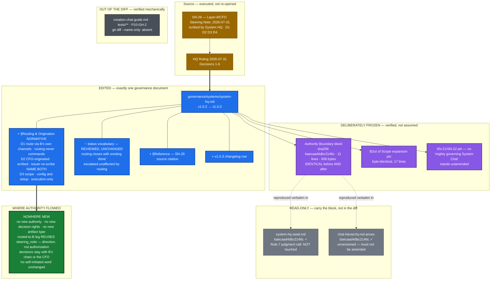

# Delivery Notice: P11-M36-E36.4 — System HQ Routing & Origination codification (`SN-29`, D1–D4)

## Summary

`governance/systems/system-hq.md` now carries a normative **§Routing & Origination** section
recording **D1, D2 and D3** as practice already in use, at **v1.0.3**. The routed-to-B leg **reuses
`steering_note`** with Decision 3's reason recorded in the document itself; the **issuer-vs-scribe
rule** is stated explicitly and requires the artifact to **name both**. The **Authority Boundary was
shown byte-identical across all three documents after the edit** — and, additionally, identical to
its own before-image.

**This Epic executed a ruling; it did not re-open one.** D1–D4 and Decision 3's ratification were
taken as settled.

**The question this delivery is built to answer — *did System HQ just get more powerful?* — is
answerable "no" from the diff alone.** The section adds no authority, no decision rights and no
artifact type; every clause records something the desk already does; the two pins that would have to
move for an expansion to be real are verified byte-identical as whole sections.

---

## Prerequisite Verification

- **Branch checked first** (starter's explicit warning about this shared worktree): `git branch
  --show-current` → `milestone/M36`, clean tree, HEAD `b686577`. Re-checked before the first commit
  and before every verification reported here. No branch mixup occurred.
- **All five prerequisite paths git-tracked on `milestone/M36`**, verified with `git ls-files
  --error-unmatch`, not a disk-existence check. All five TRACKED.
- **Model verification (P9-M31-E31.3) — PASS.** `.ai-project.yml` `models.epic_manual:
  remote:claude-opus-5`; harness-reported identity `claude-opus-5`. Both present, and they agree.

### Spec line numbers re-verified (planning-time facts, not guarantees)

Every one held. **No divergence to report.**

| Claim | Measured |
|---|---|
| Authority Boundary block `system-hq.md` **61–71** | anchor at 61, 11 lines → **61–71** ✓ |
| `system-hq-seed.md` **77–87** | anchor at 77, 11 lines → **77–87** ✓ |
| `chat-hierarchy.md` **1077–1087** | anchor at 1077, 11 lines → **1077–1087** ✓ |
| §Authority Boundary (normative) at 54 | ✓ |
| status vocabulary `escalated` row ~167 | **167** ✓ |
| §Out of Scope **186**, pin text **198** | ✓ |
| `## Changelog` **222** | ✓ |

---

## Verbatim DoD item (a) — the byte-level agreement check

Full evidence: `docs/phases/P11__Drivr_Coordination_Over_Rented_Execution/P11-M36-E36.4__authority-boundary-byte-check.md`.

**The command** — content-anchored, not line-number-based, because this Epic *adds a section*, which
shifts every line below it; a line-number check would break or silently compare the wrong range and
report a false pass. The anchor was verified to match **exactly one line per file** before use.

```bash
extract() { awk '/^> \*\*System HQ Authority Boundary\.\*\*/{f=1} f{if(/^$/)exit; print}' "$1"; }
for f in governance/systems/system-hq.md \
         governance/systems/system-hq-seed.md \
         governance/systems/chat-hierarchy.md; do
  printf '%s  %s  (%s lines)\n' "$(extract "$f" | sha256sum | cut -c1-16)" "$f" "$(extract "$f" | wc -l)"
done
```

**BEFORE** — run at base commit `b686577` before any file was modified, and committed in `509a88e`,
**a commit containing no other change**, so *"shown identical after"* is measured against a before
that **git history proves came first** rather than one asserted after the fact:

```
baecaad4dbc2146c  governance/systems/system-hq.md  (11 lines)
baecaad4dbc2146c  governance/systems/system-hq-seed.md  (11 lines)
baecaad4dbc2146c  governance/systems/chat-hierarchy.md  (11 lines)
```

**AFTER** — run once every edit had landed:

```
baecaad4dbc2146c  governance/systems/system-hq.md  (11 lines)
baecaad4dbc2146c  governance/systems/system-hq-seed.md  (11 lines)
baecaad4dbc2146c  governance/systems/chat-hierarchy.md  (11 lines)
```

**Shown identical after the edit — not "was not intentionally changed."** Matches the spec's verified
planning-time baseline exactly.

**Cross-verified by a second method that does not share the first's failure modes**: the three
extracted blocks were compared **directly by `diff`** and by byte count — `IDENTICAL`, 939 bytes
each, full `sha256`
`baecaad4dbc2146c74e02236297c085e7d1a68d9ee92e018e56af0d2282a4a43`.

**And the after-block was compared against the before-block byte-for-byte: `IDENTICAL`.** This is the
comparison that matters most, and it is stronger than the DoD item requires: three documents could in
principle agree with each other *and all be wrong*. Comparing against the recorded before closes that
gap. **No divergence occurred**, so the revert path — and the explicitly forbidden "make the other two
agree" path — was never entered.

---

## The two pins — quoted, not merely asserted

Both were verified **byte-identical as whole sections** against `milestone/M36`, by extracting the
section from each version and diffing:

```
§Out of Scope (explicit), before vs after:       BYTE-IDENTICAL (17 lines)
§Authority Boundary (normative), whole section:  BYTE-IDENTICAL
```

**The §Out of Scope expansion pin, quoted verbatim as it stands unamended:**

> - **Any expansion of System HQ's authority** beyond the boundary above, or design toward a
>   "mighty governing System Chat" — pinned out of scope (SN-21/SN-22).

**The SN-21/SN-22 pin stands.** The new section reinforces it rather than eroding it, stating in its
own opening that it "adds **no authority, no decision rights, and no new artifact type**" and that the
pin "stands unamended."

The §Authority Boundary check covers not only the frozen block but **the prose framing it** — the
paragraph declaring the block canonical and reproduced verbatim — so a subtle change to the framing,
which the block-only check would miss, is also excluded.

---

## Verbatim DoD item (b) — the issuer-vs-scribe rule

Landed as `### The issuer-vs-scribe rule`, a subsection of §Routing & Origination under D2 —
**normative**, adjacent to the origination rule it protects. The **"name both" requirement, quoted:**

> When System HQ writes down a request it did not originate, **the artifact records the true
> issuer — Layer-8/CFO — and not the scribe. The scribing artifact MUST name both**: who issued
> it, and who wrote it down.

The **reason** is recorded with it, not left implicit:

> **The reason:** if the scribe ever becomes the apparent issuer, the record loses the ability
> to distinguish CFO-originated work from project-originated work — and that distinction is
> what makes the request chain auditable after the fact. A reader who cannot tell which of the
> two they are looking at cannot reconstruct who asked for the work.

`SN-29` is cited as **a clean instance of the rule it establishes** —
`issuer_chat: Layer-8/CFO (scribed by System HQ at CFO instruction)`, both parties named in one
field. Verified in the note's own frontmatter, not taken from the spec's description of it.

---

## The `steering_note` reuse, with its reason

Recorded **in the document**, as a block quote inside the section, so it survives independently of
this notice and of the ruling:

> A `steering_note` **already encodes exactly the semantics D1 requires — direction, not
> authorization.** That is the entire content of "routing never commands." Inventing a
> `routing_request` would create an artifact whose authority semantics are **undefined on
> arrival**, so the first thing a receiving chain would have to decide is whether it must
> comply. **That question is precisely what D1 answers *no* to, and the existing type answers
> it by construction.** A new type would not merely be a larger decision — it would be a
> **worse** one.

This satisfies the acceptance criterion that the choice be **defensible from the recorded reason
alone**, without reference to the spec or the ruling: a reader of `system-hq.md` who has seen neither
can reconstruct the whole argument.

---

## The two judgment calls, and their reasoning

### 1. `system-hq-seed.md` Rule 7 — **not touched.** Decided against, on the Seed's own text.

The spec framed this as: once `system-hq.md` records the routed-to-B leg, the Seed — which sanctions a
Steering Note into a project only in the re-instantiation context — is *arguably narrower than the
canon it reproduces.* Reading the Seed in full resolved it **against** amending, on two independent
grounds:

**(a) The Seed's self-containment claim is explicitly scoped — and routing falls outside that scope.**
Its own §How to Use This Seed says self-containment covers *"System HQ's identity and constraints"*,
and it then states that operational detail is **deliberately** not restated:

> Operational detail this seed deliberately does **not** restate — the `system_request` /
> `system_response` schemas, storage paths, naming convention, and status vocabulary — is
> canonical in `governance/systems/system-hq.md`. Read that document once you are running,
> before writing your first artifact.

Routing and origination are **operational detail of exactly that class** — which artifact type flows
in which direction, and who is named on it. The Seed already **compels** reading `system-hq.md` before
the first artifact is written, and repeats the instruction twice more (§How You Answer: *"read it
there rather than working from memory, **and never from a paraphrase of it**"*; §What to Do Right Now,
step 2). **A re-instantiated System HQ therefore encounters the new section by construction.** There
is no gap to close.

**(b) Rule 7 is not a sanction of the steering-note channel at all.** Read directly, it is reset
hygiene — *"Before resetting, distill anything worth keeping into an artifact — a `system_response`
that was owed, or a Steering Note into the relevant project."* It names a Steering Note as an
**example of a distillation target**, not as the sole licensed use of the channel. The "Seed is
narrower than canon" premise requires reading Rule 7 as an **exhaustive sanction**, which its text
does not support.

Adding a paraphrase of the routing rules to the Seed would also cut against the Seed's own norm —
*"never from a paraphrase of it"* — and would introduce drift risk into a **second** document carrying
the frozen Authority Boundary, for no informational gain.

**Decision 2 names only `system-hq.md`, and the analysis agrees with it.** Not touching the Seed also
kept the number of documents that could possibly diverge at **one**.

*(Had this gone the other way, the guard rail was understood and would have been honoured: the Seed
is versioned at 1.0.0, so a bump was available, and the byte check would have been re-run. The byte
check was run across all three documents regardless.)*

### 2. Decision 6's worked example — **included**, and deliberately labelled.

Desirable, not required; the spec left placement to this Epic. **Included here** rather than deferred,
because it materially serves the acceptance criterion that *a reader can state what System HQ may do
when routing to project B*: an abstract rule plus a concrete instance is easier to apply correctly
than the rule alone.

It is marked **`### Worked example (informative)`** — the label, not the section's position, carries
its informative status, since the natural home for it is adjacent to the normative text it
illustrates rather than in a distant informative section.

**It is labelled honestly as what it is.** The 2026-07-31 `social-stories-creator` case is the
**adjacent form — route-back-to-A, not A→B** — and the text says so explicitly, with the reason
(`ai-stack`, the ComfyUI host tree, is unregistered). It is offered as an illustration of the *shape*,
not as an A→B instance. **No A→B routing instance was invented**, which the starter forbids in terms.
The example is sourced to `SN-29`'s own account of the case; no artifact paths, timestamps or details
were reconstructed from anything else.

---

## Decision 6's carry-overs — recorded as carry-overs

Both are recorded **in `system-hq.md` itself**, not only here, so they survive this notice:

1. **A worked example** — *delivered* in this amendment rather than carried over, per the judgment
   call above. Decision 6 permitted either.
2. **No true A→B routing instance exists yet.** Recorded in the document as a block quote:

   > **No true A→B routing instance has occurred yet.** Codifying a leg that has never run once
   > is **a known and accepted position here, not an oversight** — D1 was practised in its
   > adjacent form the same day it was decided. **The first genuine A→B routing instance should
   > be recorded in this document's Changelog when it occurs.**

   Also restated in the v1.0.3 changelog row, so it is visible from the version history alone.
   **This is an accepted position, not an oversight** — stated in those terms in both places.

---

## Hygiene

- **Version:** `1.0.2` → **`1.0.3`** in frontmatter.
- **Changelog row added**, modelled on the v1.0.2 row's own precedent as the spec directed: it
  explicitly records the Authority Boundary untouched **with its hash and the evidence path**, the
  §Out of Scope pin unamended, that no authority/decision rights/artifact type were added, removed or
  reinterpreted, and the A→B carry-over.
- **Status vocabulary reviewed** against the new section — the review's conclusion was that the five
  values **suffice**, and that conclusion is recorded rather than left silent:

  > **Routing adds no status.** The five values above were reviewed against §Routing &
  > Origination below and needed no additions. A request that System HQ routes onward to another
  > governed project closes with `done` — the routing *is* the execution System HQ performed —
  > and its `system_response` names the routing artifact […] `escalated` is likewise unchanged by
  > routing: a review-, merge-, or scope-shaped request is escalated to the human, **never**
  > routed onward as though some other project's chain could make that decision instead.

  The last clause matters for the "no expansion" reading: routing is explicitly barred from becoming
  a way *around* the escalation obligation.
- **`SN-29` cited** in §Reference as the source note for §Routing & Origination, alongside the ruling,
  with the `SN-1` → `SN-29` renumber recorded.

### On `SN-1` — declared, not buried

**No unqualified `SN-1` appears anywhere in the delivery.** The counts, stated per file so the claim
is checkable rather than sweeping — and **counting this notice itself in**:

- **`governance/systems/system-hq.md` — exactly two occurrences**, both inside a single §Reference
  sentence (lines 328–329) whose entire purpose is to record the renumber.
- **This Delivery Notice — eight occurrences**, every one of them either in this subsection, in its
  quotation of that same sentence, in the §Reference bullet describing it, or in a DoD/evidence row
  *asserting the absence of a bare `SN-1`*. **None is a citation of the note.**
- **The byte-check evidence file — zero.**

The §Reference sentence in full:

> The concern was renumbered `SN-1` → `SN-29` on 2026-08-04 (P11-M36-E36.2); citations of it as
> `SN-1` in artifacts dated on or before 2026-08-01 are correct for their date.

Neither stands alone as a live citation; both are qualified in the same breath. This is the same
pattern the ruling and the steering note use in their own amendment notes. **Every live citation of
the note in this delivery reads `SN-29`** — verified by grep over the diff, not by recollection.

---

## Constraint compliance

| Constraint | Status |
|---|---|
| **8 — Structural diagram** (Mermaid, fenced, in-repo, no ComfyUI) | ✅ below |
| **5 — no new authority / decision rights / artifact type** | ✅ `steering_note` reused; stated in-document |
| **Hard Constraint — M36 builds no mechanism** | ✅ the byte check is committed as **evidence**, in a `docs/` report. **Not** promoted into a test, CI check or linter. No escalation was needed |
| `chat-hierarchy.md` not in the diff | ✅ verified by `git diff --name-only` |
| `creation-chat-guide.md` not in the diff | ✅ same |
| no `tests/` file in the diff | ✅ same |
| **P10-GH-2** not amended | ✅ E36.5's; untouched |
| Authority Boundary unchanged, all three documents | ✅ shown, above |
| §Out of Scope pin not "improved" | ✅ byte-identical |
| No A→B instance invented | ✅ the worked example is labelled as route-back-to-A |

### Decision 5 (P10-GH-8) — **did not fire.** Expected, and confirmed.

`system-hq.md` **is versioned** (`version:` frontmatter + `## Changelog`), so this amendment recorded
itself normally through the ordinary version-bump-plus-row path. **No unversioned document was
amended** — `chat-hierarchy.md` and `creation-chat-guide.md` are both absent from the diff, verified
mechanically. **HQ's independent verification that E36.4 adds no third unversioned amendment to M36's
count therefore stands, and is not void.** No Decision 5 recording block is owed.

**M36's unversioned-amendment count remains two**, both to `creation-chat-guide.md` (E36.1's and
E36.3's) — the count the Milestone Closure Declaration owes under the D5 obligation. **E36.4 adds
none.**

---

## Extent vs spec, and claims vs evidence

**Extent:** the delivery matches the spec's scope. Every Deliverable and every DoD item is addressed;
nothing outside the in-scope surfaces was touched. The one bounded judgment call resolved to *no
change* and is reasoned above; the one preference resolved to *include* and is reasoned above.

**Claims vs evidence — every factual claim in this notice was measured in this session**, not carried
from the spec:

| Claim | How it was established |
|---|---|
| Byte check before/after | Command run twice; outputs pasted verbatim; before committed in an isolated commit |
| Blocks identical | Two independent methods — `sha256` **and** direct `diff` + byte count |
| Block unchanged by the edit | before-image vs after-image `diff` |
| Pins unamended | Whole-section `diff` against `milestone/M36`, and quoted |
| Forbidden files absent | `git diff --name-only milestone/M36` |
| No bare `SN-1` | `grep` over added lines of the diff |
| Spec line numbers | Re-measured; all held |
| Suite figure | `python3 -m pytest -q` run in this session |
| `SN-29`'s `issuer_chat` value | Read from the note's frontmatter |
| Seed's self-containment scope | Read from the Seed's own §How to Use This Seed |

**On counts — this Epic counts itself in** (M36 has produced four records stating a count that omitted
its own contribution):

- **Three documents carry the Authority Boundary**, and **this Epic edited one of them**
  (`system-hq.md`).
- **This Epic's diff against `milestone/M36` contains three files, counting this Delivery Notice
  itself**: `governance/systems/system-hq.md`, the byte-check evidence, and this notice.
- **Exactly one governance document was amended.**

---

## Test suite

**377 passed / 0 xfailed** — `python3 -m pytest -q`, 26.74s. **Matches the starter's corrected
baseline exactly** (the milestone spec's `375 / 1 xfailed` is stale, as the starter notes).

**No P10-GH-10 occurrence.** `tests/test_artifact_router.py::test_daemon_extensions_error_branches`
passed on the first full-suite run, so no re-run was required and there is no second result to record.
It was not fixed, skipped or marked — untouched, as required.

*(`python` is not on `PATH` in this worktree; `python3 -m pytest` was used, per the starter's
environment note.)*

---

## Visual Bindings

**Visual binding**
- **Link:** inline below (Structural diagram; no hosted link needed per AOG §17.3/§17.5)
- **What:** diagram
- **Level:** Epic
- **State:** delivered
- **Description:** `system-hq.md`'s new §Routing & Origination named to D1/D2/D3, the `steering_note`
  reuse with no new type, the Authority Boundary frozen across three documents with its hash, the
  §Out of Scope and SN-21/SN-22 pins standing, and authority flowing nowhere new.

### Structural diagram (constraint 8)



**Reading the diagram:** the only bold path into an edited document is `RUL ==> HQ`, and the only bold
path out of the new section is `NEW ==> A0` — **"nowhere new."** Everything in the frozen and
read-only groups was *verified*, and each carries the hash that proves it.

---

## Definition of Done

| DoD item | Status |
|---|---|
| §Routing & Origination recording D1, D2, D3 | ✅ |
| No new authority / decision rights / artifact type; `steering_note` reused **with the reason recorded** | ✅ reason quoted in-document |
| Issuer-vs-scribe rule explicit, **requires naming both** *(verbatim item (b))* | ✅ quoted above |
| Authority Boundary **shown** byte-identical across three documents after the edit, command + output committed *(verbatim item (a))* | ✅ plus before-vs-after comparison |
| SN-21/SN-22 pin unamended; §Out of Scope pin verified untouched | ✅ byte-identical, quoted |
| Changelog + status vocabulary updated; `SN-29` cited; no unqualified `SN-1` | ✅ |
| Decision 6's carry-overs recorded **as carry-overs**, incl. no A→B instance = accepted not oversight | ✅ in-document |
| `chat-hierarchy.md`, `creation-chat-guide.md`, `tests/`, P10-GH-2 absent from diff | ✅ verified mechanically |
| Decision 5 block if an unversioned document was amended | ✅ **not applicable** — none was; confirmed |
| Structural Mermaid diagram | ✅ |
| **Full suite green — re-measured and stated** | ✅ **377 / 0 xfailed** |
| Delivery Notice produced and committed; PR opened to `milestone/M36` | ✅ **PR #179** |

---

## Acceptance Criteria (verified by the Milestone Chat, not by this chat)

- A reader can state what System HQ may do when routing to project B, **and cannot come away believing
  System HQ gained authority to command, decide, or self-initiate**
- The byte-level identity is **verifiable by re-running the committed command**
- A reader of a scribed CFO-originated request can identify **both** issuer and scribe from the
  artifact alone
- The `steering_note` choice is **defensible from the recorded reason alone**

---

## Commits

| Commit | Contents |
|---|---|
| `509a88e` | Byte check **BEFORE** output — **this commit contains no other change**, by design |
| `93beea5` | The amendment: §Routing & Origination, status-vocabulary paragraph, §Reference, version bump, changelog row, and the byte-check **AFTER** output |

---

## Status

**Epic E36.4 execution complete. Not merged.**

Per the canonical happy path, this chat is responsible for steps 1–2 only. **Stage-2 review belongs to
Milestone Chat M36** — clean deliveries are accepted by silence (SN-13 / PSG §11.6). **Merge
authorization is the parent chat's**, and if it is offered directly in this chat instead, this chat
will say so and confirm the bypass is intended before acting (P9-M31 precedent) rather than complying
silently.
