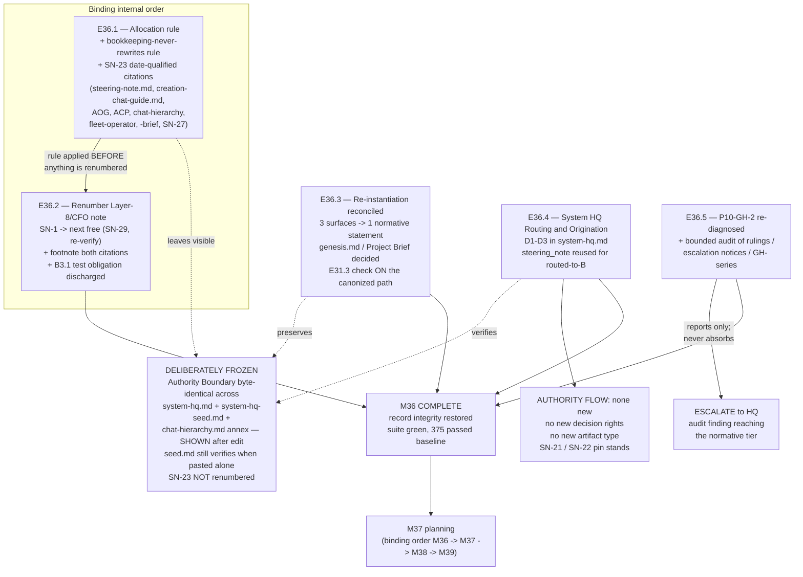

# Milestone M36 — Record Integrity and Documentation Hygiene

## Purpose

Land four self-contained documentation items — **governed**, with a spec, a Definition of Done, a
Stage-2 review and a closure record — **before any Drivr code exists**. M36 is P11's first
milestone by CFO ruling (2026-08-01, recorded in SN-28), and it is the phase's only milestone that
lands entirely inside this repository: it amends this framework's own normative corpus.

This milestone ensures:
- **No Steering Note ID is citable ambiguously.** The answered namespace rule is *applied*, the
  SN-23 citations carry their dates, the misnumbered Layer-8/CFO note is renumbered traceably, and
  an allocation rule exists so the defect cannot recur by attention lapse (E36.1, E36.2).
- **Creation Chat re-instantiation is executable as written**, reconciled from three disagreeing
  surfaces to one normative statement, with the E31.3 model check on the canonized path itself
  (E36.3).
- **System HQ's routing and origination are codified with zero new authority** — the 2026-07-31
  ruling's D1–D4 executed, the Authority Boundary shown byte-identical across three documents
  *after* the edit (E36.4).
- **P10-GH-2 points a future owner at the real defect**, and the wider artifact-ID risk is
  measured rather than assumed — reported, not fixed (E36.5).

**M36 is not P11's final milestone** (`is_final: false`). On its closure the Phase Chat proceeds to
M37 planning, per the binding order M36 → M37 → M38 → M39.

---

## This Milestone Is Entirely In-Repo — a contrast worth stating

P11's deliverables live substantially **outside** this repository: M37 creates Drivr, M38 measures a
completion signal against a real engine, M39 builds coordination. This repo holds the governance
record for all of it.

**M36 is the exception.** Every deliverable is an amendment to this framework's own normative
corpus, or a report about its own artifact record. There is no target project, no cross-repo bump,
no external dependency, and no Drivr dependency of any kind. That property is *why* the CFO placed
it first: nothing is lost by putting it before Drivr exists, and record integrity is gained.

A direct consequence: **this repository's suite baseline governs every epic here**, with no
cross-repo split to reason about.

> **The baseline has moved since the phase spec was written — verified, not inherited.** The P11
> phase spec cites **366/0/0**, which was correct at phase open. **B3.1's merge (`65f83fe`,
> 2026-08-02) added its own tests**, and the Phase Chat measured the suite on `phase/P11` at
> planning time: **375 passed, 1 xfailed, 0 failed, 0 skipped**. The `1 xfailed` is B3.1's
> real-corpus check, and constraint 2a governs what happens to it. **Every DoD in this spec uses the
> 375/1-xfailed figure; epics re-measure rather than trusting either number.**

---

## Execution Posture (binding — CFO decision, 2026-08-02)

**M36's epics run manual / paid frontier.** Every Epic Execution Chat Starter the Milestone Chat
writes carries `Execution Mode: manual` and routes to `models.epic_manual`
(`remote:claude-opus-5`). **M36's epics are not routed to `local:`.**

**The reason, stated so it is not mistaken for a general ruling about local inference.** M36's
epics are **dense-prose governance amendments** — cross-file citation consistency, a byte-level
verbatim freeze, reconciling three surfaces to one normative statement. The 2026-08-01/02 engine
comparison measured `qwen3-coder:30b` at its weakest on exactly that shape (field evidence:
`.ai-project/artifacts/field-evidence/2026-08-02__B3.1-engine-comparison.md`).

**This is a judgment about the work's shape, not a restriction on the execution matrix.** The
ratified matrix still permits agentic-or-manual and local-or-remote at the Epic, unchanged.
**M37's code-shaped epics are where the local lane gets tested** — not here.

---

## Binding Constraints (settled — NOT for re-debate)

These carry to every Epic under this Milestone. Constraints 1–8 are reproduced from the P11 Phase
Execution Chat Starter; constraint 2a is stated in the corrected form the ruled decisions actually
imply (see the correction note immediately below it).

**1. The namespace question is ANSWERED. Do not re-derive it.**
HQ Ruling 2026-08-01, Decision 3: **one sequence per steering-note directory, regardless of issuing
entity.** A note filed into a project's `steering-notes/` takes the next free `SN-<n>`; sub-IDs keep
letter suffixes (`SN-12a`). Provenance is already recorded in `issuer_chat` and the filename slug;
**the identifier names position and nothing else.**

**2. E36.1 lands before E36.2.** The rule is applied before anything is renumbered. **No epic
renumbers anything on its own initiative.**

**2a. B3.1 has landed (merged `65f83fe`, 2026-08-02) and it obliges M36.** This is not optional and
it **will** break the suite if missed. `tests/test_steering_note_id_uniqueness.py` guards the
corpus. Its real-corpus check `test_steering_note_ids_are_unique` is marked
`@pytest.mark.xfail(strict=True)` because `SN-23` and `SN-1` are double-claimed today, and its
companion `test_both_known_collisions_are_reported` asserts that **exactly those two** collisions
are present. A red suite from either is the signal that the cleanup happened and the test was left
behind — not that something broke.

> **Correction to constraint 2a's stated mechanism — Phase Chat, 2026-08-02, verified against the
> repository rather than inherited.**
>
> The P11 starter states that "the moment E36.1/E36.2 clear those collisions the check XPASSes."
> **That is not what the ruled decisions produce, and an epic that acted on it literally would
> deliver a red suite.** Verified on `master` at planning time:
>
> | Fact | Verified |
> |---|---|
> | `SN-1`…`SN-28` claimed, no gaps → next free ID | **`SN-29`** (re-verify at execution time) |
> | Collisions today | `SN-1` (2 notes), `SN-23` (2 notes) |
> | Suite today | `9 passed, 1 xfailed` |
>
> **HQ Ruling 2026-08-01 Decision 4 is explicit that SN-23 is NOT renumbered.** Both notes keep
> `id: SN-23` in front matter permanently, by decision. So **the SN-23 collision never clears**,
> `test_steering_note_ids_are_unique` never XPASSes, and the xfail marker **must not simply be
> removed** — removing it leaves a plain failing test.
>
> What *does* happen: E36.2 renumbers the Layer-8/CFO note, the `SN-1` collision clears, and
> **`test_both_known_collisions_are_reported` fails**, because it asserts
> `set(duplicates) == {"SN-23", "SN-1"}`.
>
> **The required end state, binding on the epic that renumbers (E36.2):**
>
> 1. `test_both_known_collisions_are_reported` is updated to the post-M36 corpus — **exactly one
>    remaining collision, `SN-23`**, ratified by Decision 4 and cited as such.
> 2. `test_steering_note_ids_are_unique` becomes a **plain passing test carrying an explicit,
>    ruling-cited allowlist of `SN-23`** — not a blanket xfail. A blanket xfail would make the
>    guard blind to a *third*, unratified collision, which is the exact class B3.1 exists to catch.
>    The mechanism (module constant, parametrization, fixture) is the Epic Chat's design decision;
>    the property is not.
> 3. The docstring's "once P11-M36 clears the collisions the check will XPASS" narrative is
>    corrected in place, so the next reader is not sent down the same wrong path.
>
> **This preserves constraint 2a's intent exactly** — "did the cleanup actually happen?" stays a
> mechanical signal rather than a judgment call — and is the only reading consistent with Decision
> 4. It is recorded here rather than escalated because it is a determinate consequence of
> already-ruled decisions, not a change to any of them. **HQ is notified in the delivery.**

**3. SN-23 is NOT renumbered.** Citations carry the date: `SN-23 (2026-07-18)` = reference-first /
platform agnosticism; `SN-23 (2026-07-20)` = the P10 adoption spine. The separating rule is
normative and **must be recorded**: *a bookkeeping defect never rewrites a citation in a normative
document.*

**4. E36.4's two DoD items travel verbatim from the 2026-07-31 ruling and are not optional:**
a **byte-level agreement check** of the Authority Boundary block across `system-hq.md`,
`system-hq-seed.md` and `chat-hierarchy.md`'s out-of-hierarchy annex, **shown identical after the
edit** — not "was not intentionally changed"; and the **issuer-vs-scribe rule** stated explicitly,
requiring the scribing artifact to name both.

**5. E36.4 adds no new authority, no new decision rights, and no new artifact type.** The routed-to-B
leg **reuses `steering_note`** — that type already encodes *direction, not authorization*, which is
the entire content of "routing never commands." **The SN-21/SN-22 pin stands**: System HQ is not a
"mighty governing System Chat."

**6. E36.5 reports; it does not fix.** If the audit finds collisions reaching the normative tier in
another artifact family, **escalate to HQ.** M36 does not absorb that as scope. SN-28 warned this
may widen the milestone: **it may not widen it. It may only report.**

**7. E36.3 must preserve the Seed's existing behaviour.** `governance/templates/seed.md` was the one
surface that caused verification to happen in the 2026-07-31 session. **Reconciliation must not
trade that away for tidiness.**

**8. Every M36 delivery that amends a normative document carries a Structural diagram** (Mermaid,
fenced, in-repo, **no ComfyUI**) per `governance/systems/hq-chat.md` "Review Diagram on HQ Rulings"
— documents touched, what changed named to the section, what was deliberately frozen, where
authority flowed. **This is what makes the CFO's §11.6.1 diff review cheap enough to actually
perform.**

---

## Problem Statement

Four verified defects in this framework's own record, each self-contained, none dependent on Drivr.

**1. The Steering Note record is untrustworthy by number.** SN-28's audit found 28 IDs across 23
notes with two double-claimed. The `SN-23` collision is **High severity, and not because of the
duplication.** `AI-OPERATING-GUIDELINES.md` and `chat-hierarchy.md` **both cite "SN-23 Decision 2"
meaning entirely unrelated decisions**, and `chat-hierarchy.md` declares its one **superseded**. A
reader following the AOG citation lands on the supersession notice and concludes **platform
agnosticism was superseded.** It was not — a different Decision 2 was, on a different axis, in a
different note. **That is the trap E36.1 closes.**

The root cause is that **ID allocation has no enforcement of any kind** — no registry, no rule, no
test until B3.1. That works exactly as well as the author's attention, and both collisions are what
it looks like when attention lapses.

**2. Creation Chat re-instantiation cannot be executed as written.** Three surfaces describe how a
Creation Chat is re-opened and they disagree; `creation-chat-guide.md`'s ritual names `genesis.md`
as artifact #1 and **no `genesis.md` exists in this project** — nor a Project Brief. The observed
cost is concrete: in the 2026-07-31 session the model check ran only because the Seed was pasted,
the Progress Digest was read only because it happened to be open in the operator's editor, and the
most recent Steering Note was **not handed to the session at all** despite being live input to the
P11 scoping that session existed to do.

**3. System HQ's routing and origination are unrecorded field practice.** `system-hq.md` records
only the `system_request` → `system_response` pair written back into the *requesting* project.
Neither A→B routing nor CFO-originated requests appear anywhere normative, and **both are standing
practice.** Ruled 2026-07-31 (D1–D4 accepted); M36 *executes* the ruling.

**4. P10-GH-2 points at the wrong file.** It is filed as *"the Creation Chat Seed does not implement
the E31.3 check."* False: `governance/templates/seed.md` has carried it since `d7ee7cd`
(2026-07-19), **nine days before the ruling that filed the gap**, and the 2026-07-31 session opened
from `seed.md` ran the check. **As filed, it points a future owner at a file that needs no change
and the real defect survives the fix.**

A fifth, bounding fact this milestone must record honestly rather than solve: **only steering notes
were audited.** Rulings, escalation notices and the `GH-` gap-record series allocate IDs the same
unenforced way, and `GH-` is cited far more widely. M36 measures that risk. It does not remediate
it.

---

## Goals

By the end of this milestone:

1. **No Steering Note ID is citable ambiguously.** Every SN-23 citation in the normative tier
   carries its date; the misnumbered Layer-8/CFO note carries a non-colliding ID with both prior
   citations footnoted; an allocation rule exists in the template and `creation-chat-guide.md`; and
   B3.1's guard is a plain passing test with the one ratified exception named (E36.1, E36.2).
2. **The bookkeeping-never-rewrites-normative-citations rule is recorded normatively** — the rule
   that makes renumbering one collision and date-qualifying the other coherent rather than
   arbitrary (E36.1).
3. **Creation Chat re-instantiation is executable as written**, governed by one normative statement
   with the other surfaces citing it, carrying the E31.3 check on the canonized path itself, with
   the `genesis.md` / Project Brief question decided and recorded either way (E36.3).
4. **System HQ's routing and origination are codified with zero new authority** — D1–D3 recorded,
   the Authority Boundary **shown** byte-identical across three documents post-edit, the
   issuer-vs-scribe rule explicit, `steering_note` reused for the routed-to-B leg (E36.4).
5. **P10-GH-2's carry-forward text points at the ritual, not at `seed.md`**, and the bounded
   artifact-ID audit beyond steering notes is recorded with its finding — escalated, not absorbed,
   if it reaches the normative tier (E36.5).
6. **Every normative amendment carries a Structural diagram**, so the CFO's mandatory §11.6.1 diff
   review is cheap enough to actually perform.

---

## Non-Goals

This milestone explicitly does **not**:

- **Re-derive the namespace question.** It is answered — one sequence per directory. Applying it is
  the work; re-deciding it is not.
- **Renumber SN-23.** Ruled 2026-08-01, Decision 4. Citations carry the date instead.
- **Re-scope B3.1.** It is delivered and merged (`65f83fe`). M36's only obligation toward it is
  constraint 2a.
- **Fix what E36.5's audit finds** beyond steering notes. The audit reports; remediation is a
  further decision and an escalation if it reaches the normative tier.
- **Expand System HQ's authority in any direction.** D1–D3 record practice already in use. No new
  authority, no new decision rights, no new artifact type.
- **Touch Drivr, the execution adapter surface, the fleet registry, the completion signal, or the
  scheduler.** M37–M39 own those, in binding order.
- **Decide `model-routing-policy.md` row P4**, revisit the local-inference runtime (closed —
  Ollama settled, llama.cpp dropped by decision and its trigger void), or re-park anything the
  phase spec records as closed.
- **Fold in P10-GH-8.** See "Out of Scope" for the Phase Chat's judgment and its reasoning.
- **Produce Epic specs or Epic Execution Chat Starters at the Phase level** — the Milestone Chat's
  job (adjacency). This spec defines epic scope, deliverables, DoD and acceptance criteria only.

---

## In Scope

- **E36.1** — the steering-note ID allocation rule, the bookkeeping-never-rewrites rule, and the
  exhaustive SN-23 date-qualification sweep across the normative tier.
- **E36.2** — the Layer-8/CFO note's renumbering, its two citation footnotes, and B3.1's test
  obligation (constraint 2a, as corrected).
- **E36.3** — the Creation Chat re-instantiation reconciliation, the `genesis.md` / Project Brief
  decision, and the E31.3 check on the canonized path.
- **E36.4** — the System HQ Routing & Origination codification, D1–D4, with the byte-level
  Authority Boundary check and the issuer-vs-scribe rule as DoD items.
- **E36.5** — the P10-GH-2 carry-forward amendment and the bounded artifact-ID audit, report-only.

## Out of Scope

- Everything under Non-Goals; additionally any M37/M38/M39 work of any kind.
- **P10-GH-8** (`governance/systems/` versions and changelogs inconsistent). The P11 starter permits
  the Phase Chat to *propose* folding it into M36, with HQ deciding. **The Phase Chat's judgment is
  not to fold it in**, and the reasoning is recorded so HQ can overrule it cheaply:
  P10-GH-8 is a **corpus-wide convention change** touching every document under
  `governance/systems/`, whereas M36's five epics are each bounded to a named defect with a named
  fix. Folding it in would convert a milestone whose contents the **CFO fixed at four items** into
  an open-ended consistency pass, and it would do so inside the one milestone whose entire value
  proposition is that cleanup lands **bounded and governed**. It is Low severity, it has no trigger
  pressing on it, and it will be cheaper after M36 has already touched several of those documents
  than before. **Recommendation: leave parked. HQ decides.**

---

## Hard Constraint (binding — carries to every Epic under this Milestone)

**M36 amends the record. It builds no mechanism.** Every epic here produces normative text, a
traceable rename, a reconciled statement, or a recorded finding. The single exception is
constraint 2a's test obligation in E36.2 — which is not new mechanism but the *completion* of one
B3.1 already delivered, and is bounded to `tests/test_steering_note_id_uniqueness.py`.

If an epic finds itself building a registry, a validator, a linter, or any new enforcement beyond
that one file, **it has drifted out of M36's scope and must stop and escalate to the Phase Chat
rather than proceed.**

**The audit reports; it does not remediate.** E36.5's bound is the load-bearing one: SN-28 itself
warned that Carry-Over 3 "may widen the milestone's scope once looked at." **It may not.** A
finding that reaches the normative tier is an escalation to HQ, and HQ decides where it lands.

---

## Planned Epics

### Confirmed Epics

- **E36.1 — Steering Note ID allocation rule + SN-23 date-qualified citations**
- **E36.2 — Renumber the misnumbered Layer-8/CFO note (+ B3.1 test obligation)**
- **E36.3 — Creation Chat re-instantiation reconciliation (SN-26)**
- **E36.4 — System HQ Routing & Origination codification (SN-1 ruling, D1–D4)**
- **E36.5 — P10-GH-2 re-diagnosis + bounded artifact-ID audit**

> **Artifact scope (adjacency).** The Phase Chat produces only this Milestone spec and the Milestone
> Execution Chat Starter. The **Milestone Chat** owns final epic planning and authors every Epic
> spec and Epic Execution Chat Starter. Epic identifiers here are indicative decomposition; the
> Milestone Chat **may adjust epic boundaries within this milestone's scope** — with one exception:
> **E36.1 before E36.2 is binding** (constraint 2), and merging them is only admissible if the
> merged epic still applies the rule before it renumbers anything.

### Deferred Epics

- None at planning time. **E36.5's *extent* is conditional** on what the audit finds — the three
  named families (rulings, escalation notices, `GH-` records) are the bound, and a finding that
  reaches the normative tier is escalated rather than absorbed. The epic itself is not deferred.

---

## Epic Detail

### E36.1 — Steering Note ID allocation rule + SN-23 date-qualified citations

**Source:** SN-28 Required actions 1–3; HQ Ruling 2026-08-01, Decisions 3 and 4.

**Grounding:** this epic is the milestone's foundation in a literal sense — constraint 2 makes the
allocation rule land *before* anything is renumbered, so that E36.2's rename applies a recorded rule
rather than inventing one. It also closes the High-severity item: the SN-23 citation trap.

**Deliverables:**

1. **The allocation rule, recorded normatively**, in `governance/templates/steering-note.md` **and**
   `governance/systems/creation-chat-guide.md`: the next ID is the **highest existing ID in the
   directory plus one, regardless of issuing entity**; sub-IDs keep the existing letter-suffix form
   (`SN-12a`). State the *reason* alongside it — provenance is already recorded in `issuer_chat` and
   the filename slug, so **the identifier names position and nothing else** — because a rule whose
   reason is recorded survives an edit that a bare rule does not.
2. **The separating rule, recorded normatively:** *a bookkeeping defect never rewrites a citation in
   a normative document.* Where a colliding ID is cited **only in project-internal, non-normative
   artifacts** → renumber. Where it is cited in the **normative tier** → date-qualify the citations
   and leave the collision visible rather than laundered. This is what makes renumbering `SN-1` and
   not `SN-23` coherent instead of arbitrary, and it must be recorded where a future reader hits it
   — the Epic Chat's design decision as to which surface, with `creation-chat-guide.md` alongside
   the allocation rule the natural candidate.
3. **Every SN-23 citation in the normative tier date-qualified** — `SN-23 (2026-07-18)` for
   reference-first / platform agnosticism, `SN-23 (2026-07-20)` for the P10 adoption spine — across
   at minimum: `governance/AI-OPERATING-GUIDELINES.md`,
   `governance/systems/artifact-communication-protocol.md`, `governance/systems/chat-hierarchy.md`,
   `governance/systems/fleet-operator.md`, `governance/systems/fleet-operator-brief.md`, and SN-27's
   own "Ratified Decision #7" citation.

   > **The named list is a floor, not an inventory — verified at planning time.** SN-28's audit
   > table lists *representative* citations, not a line-level sweep. `grep -rn "SN-23"` over
   > `governance/` at planning time also reaches `creation-chat-guide.md:150`,
   > `AI-OPERATING-GUIDELINES.md:92` and `:1042`, `chat-hierarchy.md:117`/`:165`/`:168`,
   > `artifact-communication-protocol.md:419`/`:456`, `fleet-operator.md:220` and
   > `fleet-operator-brief.md:274`. **The epic performs its own exhaustive sweep** over
   > `governance/` and `.ai-project/artifacts/` and treats every occurrence deliberately.
   >
   > **Changelog lines are a judgment call the epic must make explicitly, not silently.** A
   > changelog entry is a historical record of what an edit said at the time; date-qualifying it
   > may be correct (a reader follows it like any other citation) or may be falsifying the record.
   > **The epic decides, records the rule it applied, and applies it consistently** — either
   > outcome is acceptable; an unstated one is not.

4. **Explicit statement that SN-23 is not renumbered, and why**, so a future reader does not "fix"
   the remaining collision and invalidate every citation this epic just corrected.
5. **A Structural diagram** (Mermaid, fenced, in-repo, no ComfyUI) per constraint 8.

**Definition of Done:**
- [ ] The allocation rule is recorded in `governance/templates/steering-note.md` and
      `governance/systems/creation-chat-guide.md`, with its reason stated
- [ ] The *bookkeeping defect never rewrites a normative citation* rule is recorded normatively
- [ ] An exhaustive SN-23 sweep is performed and evidenced; **no un-dated SN-23 citation remains in
      the normative tier**, and the treatment applied to changelog lines is stated and consistent
- [ ] The record states explicitly that SN-23 is **not** renumbered and why
- [ ] A Structural Mermaid diagram accompanies the delivery (constraint 8)
- [ ] Full suite green (375 passed / 1 xfailed baseline, no regressions, no new skips)

**Acceptance Criteria:**
- [ ] A reader following **any** SN-23 citation in a normative document lands on the note that
      citation actually means, and **cannot** reach the conclusion that platform agnosticism was
      superseded
- [ ] A future note author can determine the correct next ID from the recorded rule alone, without
      reading prior notes for precedent

**Sequencing:** **first — binding.** E36.2 does not begin until this epic's rule is recorded.

---

### E36.2 — Renumber the misnumbered Layer-8/CFO note (+ B3.1 test obligation)

**Source:** SN-28 (the SN-1 collision); HQ Ruling 2026-08-01, Decision 3; constraint 2a as
corrected above.

**Grounding:** the Layer-8/CFO note
(`.ai-project/artifacts/steering-notes/2026-07-31__layer-8-cfo__steering-note__system-hq-routing-model.md`)
claims `SN-1`, restarting a sequence that had already reached SN-27 — numbered as though System HQ
keeps its own sequence, while filed as though it belongs to `ai-project-system`'s. Decision 3
answers that: **it is misnumbered.** Its two citations are non-normative (a digest, a ruling), so
the separating rule sends it to *renumber* rather than *date-qualify*.

**Deliverables:**

1. **The note renumbered to the next free ID in the directory**, determined at execution time.
   > Verified at planning time: `SN-1`…`SN-28` are all claimed with **no gaps**, so the next free ID
   > is **`SN-29`**. **The epic re-verifies rather than trusting this number** — a note filed
   > between planning and execution would claim it, and B3.1's test now catches that immediately.
2. **Both existing citations footnoted with the old number**, so the rename is **traceable rather
   than silent**: the 2026-07-31 Progress Digest and the 2026-07-31 System HQ codification ruling
   (`.ai-project/artifacts/rulings/2026-07-31__ai-project-system-hq__ruling__system-hq-routing-codification.md`,
   whose front matter carries `concern_id: SN-1 (Layer-8/CFO series)`).
3. **The B3.1 test obligation discharged** — binding, per constraint 2a as corrected:
   - `test_both_known_collisions_are_reported` updated to the post-M36 corpus: **exactly one
     remaining collision, `SN-23`**, cited to HQ Ruling 2026-08-01 Decision 4 as ratified.
   - `test_steering_note_ids_are_unique` converted from a blanket `xfail(strict=True)` into a
     **plain passing test carrying an explicit, ruling-cited allowlist of `SN-23`** — so a third,
     unratified collision still fails the suite. Mechanism is the Epic Chat's design decision; the
     property is not.
   - The module docstring's "once P11-M36 clears the collisions the check will XPASS" narrative
     **corrected in place.**
4. **A Structural diagram** per constraint 8, if this epic's delivery amends a normative document.
   (The renumbering itself touches artifacts and tests; if no normative document is amended, the
   obligation does not fire — the epic states which case applies rather than leaving it implicit.)

**Definition of Done:**
- [ ] The Layer-8/CFO note carries a non-colliding ID, verified free at execution time
- [ ] Both prior citations carry a footnote recording the old number
- [ ] `test_both_known_collisions_are_reported` reflects the post-M36 corpus (`SN-23` only)
- [ ] `test_steering_note_ids_are_unique` is a **plain passing test** with a ruling-cited `SN-23`
      allowlist — **no `xfail` marker remains**, and a synthetic third collision is shown to fail it
- [ ] The module docstring no longer predicts an XPASS that cannot occur
- [ ] Constraint 8 addressed — diagram present, or the delivery states why the obligation does not
      fire
- [ ] Full suite green (375 passed / 1 xfailed baseline, no regressions, no new skips)

**Acceptance Criteria:**
- [ ] Following the old `SN-1` citation from either prior artifact reaches the renumbered note
      without guesswork
- [ ] A **new** duplicate Steering Note ID introduced anywhere in the corpus fails the suite —
      demonstrated, not asserted

**Sequencing:** **after E36.1 — binding** (constraint 2). No other epic depends on it.

---

### E36.3 — Creation Chat re-instantiation reconciliation (SN-26)

**Source:** SN-26 Required actions 2–4; HQ Ruling 2026-08-01, Decision 9.

**Grounding:** three surfaces describe how a Creation Chat is re-opened and they disagree, and the
one artifact both rituals name first — `genesis.md` — **does not exist in this project**:

| Surface | What it says to pass |
|---|---|
| `governance/templates/seed.md`, Rule 5 | "this Genesis artifact plus the current Project Brief" |
| `governance/systems/creation-chat-guide.md`, Re-instantiation Ritual, Step 3 | "exactly three artifacts and nothing else": `genesis.md`, latest Steering Note, latest Progress Digest |
| What actually exists in this repository | Neither a rendered `genesis.md` nor a Project Brief |

This is the same defect class the framework has now closed twice by ruling — *governance names the
tier, routing names the model*; *governance names the role, P11 names the thing that runs it*: **a
normative statement duplicated into three copies free to drift.**

**Deliverables:**

1. **The `genesis.md` / Project Brief question decided and recorded — either way.** Does
   `ai-project-system` render its own `genesis.md`? Is a Project Brief expected for a framework
   repository that reached P11 without one? **Both answers are acceptable; the current state — a
   normative ritual naming a non-existent file — is not.** This is the Epic Chat's design decision
   to make, document, and proceed on; it is **not** an escalation.
   > **Keep it disentangled.** SN-26 Carry-Over 2 records that the Project-Brief question touches
   > the parked Brief-level "sidekick-for-external-projects" identity question. **That question is
   > out of P11 scope entirely.** Decide the Project Brief question *for re-instantiation purposes*
   > and do not let the identity question ride in on it.
2. **Three surfaces reconciled to ONE normative statement**, with the others **citing rather than
   restating** it. Which surface holds the normative statement is the Epic Chat's design decision.
3. **The E31.3 model check on the canonized path itself** — not only in a template that path may
   not include. This is the actual defect behind the observed 2026-07-28 failure: the check is
   present in the templates and **absent from the path actually taken**.
4. **Constraint 7 honoured — the Seed's existing behaviour is preserved.**
   `governance/templates/seed.md` carries the Prerequisite Verification section at line 22 (since
   `d7ee7cd`, 2026-07-19) and it is the **one surface that caused verification to happen** in the
   2026-07-31 session. **Reconciliation must not trade that away for tidiness.** If the canonized
   statement lives elsewhere, the Seed must still cause verification to happen when pasted alone.
5. **A Structural diagram** per constraint 8.

**Definition of Done:**
- [ ] The `genesis.md` / Project Brief question is decided and the decision recorded with its
      reasoning
- [ ] Exactly one normative statement governs Creation Chat re-instantiation; the other surfaces
      cite it and do not restate it
- [ ] The canonized path carries the E31.3 model check **on the path itself**
- [ ] Pasting `seed.md` alone still causes verification to happen (constraint 7) — shown, not
      assumed
- [ ] The ritual, as reconciled, names only artifacts this project actually produces
- [ ] A Structural Mermaid diagram accompanies the delivery (constraint 8)
- [ ] Full suite green (375 passed / 1 xfailed baseline, no regressions, no new skips)

**Acceptance Criteria:**
- [ ] A reader can open a Creation Chat by following the canonized statement alone, passing only
      artifacts that exist, and the model check runs on that path
- [ ] SN-26 Carry-Over 1's working practice (Seed + latest Steering Note + latest Progress Digest)
      is either canonized or explicitly superseded by the reconciled statement — **not left as
      undocumented practice**

**Sequencing:** no hard dependency on other M36 epics; may run in parallel with E36.4/E36.5.

---

### E36.4 — System HQ Routing & Origination codification (SN-1 ruling, D1–D4)

**Source:** the Layer-8/CFO Steering Note (2026-07-31, scribed by System HQ) and the HQ Ruling
accepting it (`2026-07-31__ai-project-system-hq__ruling__system-hq-routing-codification.md`),
Decisions 1–6.

**Grounding:** D1–D4 are **CFO decisions already made.** This epic *executes* a ruling; it does not
re-open it. The gap is real and verified: `system-hq.md` (v1.0.2) records only the
`system_request` → `system_response` pair written back into the **requesting** project, and
`system-hq-seed.md` Rule 7 sanctions a Steering Note into a project only in the re-instantiation
context. **Neither A→B routing nor CFO-originated requests appear anywhere normative, and both are
standing practice.**

**Deliverables:**

1. **A short *Routing & Origination* section in `governance/systems/system-hq.md`** recording:
   - **D1** — route to project B via **B's own artifact channels**; **routing never commands** (B's
     chain triages under its own governance).
   - **D2** — CFO-originated requests, **scribed**.
   - **D3** — operating scope: **config and setup primarily**; planned work only in specific cases,
     and then **execution-only against artifact authorization**.
2. **`steering_note` reused for the routed-to-B leg** (constraint 5), with the reason recorded, not
   merely the choice: that type **already encodes direction, not authorization**, which is the whole
   content of "routing never commands." Issuer: System HQ. Target: project B's HQ Chat.
3. **The issuer-vs-scribe rule stated explicitly** (Decision 5, verbatim DoD item): when System HQ
   scribes a CFO-originated request, the artifact records the **true issuer (Layer-8/CFO), not the
   scribe**, and the scribing artifact must **name both**. If the scribe ever becomes the apparent
   issuer, the record loses the ability to distinguish CFO-originated from project-originated work —
   and that distinction is what makes the request chain auditable after the fact.
4. **The byte-level Authority Boundary agreement check** (Decision 4, verbatim DoD item) across all
   three documents that carry the block — **shown identical after the edit**, not "was not
   intentionally changed":
   - `governance/systems/system-hq.md` (§Authority Boundary, block at line 61 at planning time)
   - `governance/systems/system-hq-seed.md` (§Authority Boundary, block at line 77)
   - `governance/systems/chat-hierarchy.md` (out-of-hierarchy System HQ annex, block at line 1077)

   The four boundary properties stand untouched: no review/merge/scope decisions, mandatory
   escalation shapes, the outward-facing confirmation rule, and no self-initiated work. **The
   evidence is a reproducible command and its output committed with the delivery**, not a claim.
5. **Status-vocabulary and changelog hygiene** for `system-hq.md` (Decision 2), and the amendment
   **citing the source steering note on closure** (Decision 6) — the SN-21 pattern: field practice →
   steering note → canon.
   > **Note the interaction with E36.2.** That steering note is the one being renumbered. If E36.2
   > has landed first, cite the **new** ID; if not, cite it by path and date and let E36.2's
   > footnote carry the rename. **Either is acceptable; an unqualified `SN-1` citation is not.**
6. **Decision 6's carry-overs recorded as carry-overs, not delivered as scope:** a worked example in
   `system-hq.md`'s informative sections is *desirable, not required*; **no true A→B routing
   instance exists yet**, and the first genuine one should be recorded in `system-hq.md`'s changelog
   when it occurs. Codifying a leg that has never run is **a known and accepted position here, not
   an oversight.**
7. **A Structural diagram** per constraint 8 — this epic amends the normative tier and is the one
   most likely to be misread as an authority expansion, so the diagram must show explicitly **where
   authority flowed (nowhere new)** and **what was deliberately frozen (the Authority Boundary)**.

**Definition of Done:**
- [ ] `system-hq.md` carries a Routing & Origination section recording D1, D2 and D3
- [ ] **No new authority, no new decision rights, no new artifact type** — the routed-to-B leg
      reuses `steering_note`, with the reason recorded
- [ ] The issuer-vs-scribe rule is stated explicitly and requires the scribing artifact to name both
- [ ] The Authority Boundary block is **shown byte-identical** across `system-hq.md`,
      `system-hq-seed.md` and `chat-hierarchy.md`'s annex **after** the edit, with the command and
      its output committed as evidence
- [ ] The SN-21/SN-22 pin against a "mighty governing System Chat" stands unamended, and the
      §Out of Scope expansion pin is verified untouched
- [ ] `system-hq.md`'s changelog and status vocabulary are updated; the source steering note is
      cited without an unqualified `SN-1`
- [ ] A Structural Mermaid diagram accompanies the delivery (constraint 8)
- [ ] Full suite green (375 passed / 1 xfailed baseline, no regressions, no new skips)

**Acceptance Criteria:**
- [ ] A reader can state what System HQ may do when routing to project B, and cannot come away
      believing System HQ gained any authority to command, decide, or self-initiate
- [ ] The Authority Boundary's byte-level identity across three documents is verifiable by re-running
      the committed command

**Sequencing:** no hard dependency on other M36 epics. **Soft interaction with E36.2** on the
citation form (deliverable 5) — resolvable either way, so not a hard ordering.

---

### E36.5 — P10-GH-2 re-diagnosis + bounded artifact-ID audit

**Source:** SN-26 Required action 1; SN-28 Carry-Over 3; HQ Ruling 2026-08-01, Decisions 8 and 12.

**Grounding:** two items, both about the record's honesty about itself. The first corrects a
carry-forward that points a future owner at the wrong file. The second measures whether the defect
E36.1/E36.2 just fixed in one artifact family exists in the others — **and stops there.**

**Deliverables:**

1. **P10-GH-2's carry-forward text amended to its re-diagnosed premise.** As filed — *"the Creation
   Chat Seed does not implement the E31.3 model-verification check"* — it is contradicted by the
   repository: `governance/templates/seed.md:22` has carried the Prerequisite Verification section
   since `d7ee7cd` (2026-07-19), **nine days before the 2026-07-28 ruling that filed the gap**;
   `governance/templates/genesis.md` carries it from the same commit; and the 2026-07-31 session
   opened from `seed.md` **ran the check**. The real defect is that a session re-opened by
   `creation-chat-guide.md`'s ritual receives three artifacts **none of which carries a model
   check**. Amend the text **in every place the carry-forward is recorded** — at minimum the P10
   Phase Closure Declaration and the 2026-07-28 HQ Ruling's Decision 6 — so **the re-diagnosis
   travels with the item** rather than living only in SN-26.
   > **Amend, do not rewrite history.** These are closed-phase artifacts. The correction is recorded
   > as a dated amendment or footnote that leaves the original claim legible, in the same spirit as
   > E36.2's rename footnotes. The record's honesty is the point.
2. **The bounded artifact-ID audit — report only.** Audit the same unenforced-ID defect across the
   three families SN-28 did **not** check: **rulings**, **escalation notices**, and the **`GH-`
   gap-record series** (the last cited far more widely than steering notes). For each family record:
   how IDs are allocated, whether any collision exists, and **whether any collision reaches the
   normative tier**.
3. **The finding recorded as an artifact**, with its method reproducible, so a future remediation
   decision starts from evidence rather than re-running the audit.
4. **Escalation, not absorption, if it reaches the normative tier** (constraint 6). A collision
   confined to project-internal, non-normative artifacts is **reported and left**. A collision cited
   in the normative tier is an **escalation to HQ** — M36 does not fix it and does not widen to
   accommodate it. **SN-28 warned this may widen the milestone. It may not.**
5. **A Structural diagram** per constraint 8, if the delivery amends a normative document. The audit
   report itself is not a normative amendment; the epic states which case applies.

**Definition of Done:**
- [ ] P10-GH-2's carry-forward text is amended to the re-diagnosed premise **in every place it is
      recorded**, with the original claim left legible
- [ ] All three families (rulings, escalation notices, `GH-` records) are audited, with the method
      recorded and reproducible
- [ ] The finding is recorded as a committed artifact, naming any collision found and whether it
      reaches the normative tier
- [ ] **Nothing beyond steering notes is fixed.** Any normative-tier finding is escalated to HQ with
      an escalation notice, not remediated
- [ ] Constraint 8 addressed — diagram present, or the delivery states why the obligation does not
      fire
- [ ] Full suite green (375 passed / 1 xfailed baseline, no regressions, no new skips)

**Acceptance Criteria:**
- [ ] A future owner reading P10-GH-2 is pointed at the ritual, **not** at `seed.md`
- [ ] A reader can state, from the audit artifact alone, whether each of the three families carries
      the unenforced-ID defect and whether any instance of it reaches the normative tier

**Sequencing:** no hard dependency on other M36 epics; may run in parallel. **Naturally last** —
its audit is cleanest run against a corpus E36.1/E36.2 have already settled, but this is a
preference, not a constraint.

---

## Branch Strategy

```
master
└── phase/P11                       (created from master at phase open; long-lived PR to master)
    └── milestone/M36               ← this milestone (Milestone Chat branches from phase/P11)
        ├── epic/P11-M36-E36.1      ← allocation rule + SN-23 date-qualified citations   [FIRST]
        ├── epic/P11-M36-E36.2      ← renumber Layer-8/CFO note + B3.1 test obligation   [AFTER E36.1]
        ├── epic/P11-M36-E36.3      ← Creation Chat re-instantiation reconciliation
        ├── epic/P11-M36-E36.4      ← System HQ Routing & Origination codification
        └── epic/P11-M36-E36.5      ← P10-GH-2 re-diagnosis + bounded artifact-ID audit
```

Epic PRs target `milestone/M36`. Consolidation PR: `milestone/M36 → phase/P11`.

**M36 is not P11's final milestone** (`is_final: false`). On consolidation the Phase Chat proceeds
to **M37 planning**, per the binding order M36 → M37 → M38 → M39. `phase/P11` is not merged to
master until all four milestones are closed, via the PSG §5C nine-step closure sequence.

**No cross-repo note needed** — every M36 deliverable lands in this repository (see "This Milestone
Is Entirely In-Repo" above).

---

## Prerequisites

- This Milestone spec and its Milestone Execution Chat Starter are **git-tracked on `phase/P11`**
  (verify with `git ls-files --error-unmatch <path>` on `phase/P11` — disk presence is not proof of
  commit).
- **`phase/P11` exists, branched from master** at v7.1.0 (closure `4598d4d`, merge `bb727a5`, tag
  v7.1.0). **Suite measured on `phase/P11` at planning time: 375 passed / 1 xfailed / 0 failed /
  0 skipped** — the phase spec's 366 predates B3.1's merge (see the note under "This Milestone Is
  Entirely In-Repo").
- **P11 phase spec at v1.0.1** on `phase/P11` — this milestone spec is derived from §P11.1.
- **B3.1 delivered and merged** (`65f83fe`, 2026-08-02):
  `docs/bugfixes/B3.1__spec__steering-note-id-allocation-unenforced.md` and
  `tests/test_steering_note_id_uniqueness.py`. **Do not re-scope B3.1 into M36** — M36's only
  obligation toward it is constraint 2a.
- Governance corpus at **PSG v2.4.0 / AOG v2.10.0**, with **PSG §11.6.1 in force** (the CFO as
  mandatory diff reviewer for HQ-authored deliveries; default-accept does **not** apply to HQ's own
  output).
- **Amendment targets, verified present on master at planning time:**
  - `governance/templates/steering-note.md`, `governance/systems/creation-chat-guide.md` (E36.1)
  - `governance/AI-OPERATING-GUIDELINES.md`, `governance/systems/artifact-communication-protocol.md`,
    `governance/systems/chat-hierarchy.md`, `governance/systems/fleet-operator.md`,
    `governance/systems/fleet-operator-brief.md` (E36.1's SN-23 sweep)
  - `governance/templates/seed.md` (Prerequisite Verification at line 22; Rule 5 at line 108),
    `governance/templates/genesis.md`, `governance/systems/creation-chat-guide.md`
    (Re-instantiation Ritual at line 28) (E36.3)
  - `governance/systems/system-hq.md` (§Authority Boundary, line 54; block line 61),
    `governance/systems/system-hq-seed.md` (§Authority Boundary line 71; block line 77),
    `governance/systems/chat-hierarchy.md` (annex block line 1077) (E36.4)
- **Reference context:**
  - SN-28 — `.ai-project/artifacts/steering-notes/2026-08-01__creation-chat__steering-note__sn-numbering-unenforced.md`
  - SN-26 — `.ai-project/artifacts/steering-notes/2026-07-31__creation-chat__steering-note__creation-reinstantiation-ritual.md`
  - The Layer-8/CFO note — `.ai-project/artifacts/steering-notes/2026-07-31__layer-8-cfo__steering-note__system-hq-routing-model.md`
  - The SN-1 ruling — `.ai-project/artifacts/rulings/2026-07-31__ai-project-system-hq__ruling__system-hq-routing-codification.md`
  - The P11 opening ruling — `.ai-project/artifacts/rulings/2026-08-01__ai-project-system-hq__ruling__p11-opening-and-sn-26-27-28-triage.md`
  - `governance/systems/hq-chat.md` "Review Diagram on HQ Rulings" — constraint 8's source
  - `.ai-project/artifacts/field-evidence/2026-08-02__B3.1-engine-comparison.md` — the execution
    posture's evidence base (relevant to M37/M38, **not** to M36's own content)

---

## Dependencies and Sequencing

- **No dependency on any other P11 milestone.** M36 has **zero Drivr dependency** — that is why the
  CFO placed it first, and nothing in M37–M39 gates it.
- **E36.1 → E36.2 is binding** (constraint 2): the allocation rule is recorded before anything is
  renumbered. **No epic renumbers anything on its own initiative.**
- **E36.3, E36.4 and E36.5 have no hard dependency on any other M36 epic** and may run in parallel.
  Two soft interactions, both resolvable either way and therefore not orderings:
  - **E36.4 × E36.2** — E36.4 cites the note E36.2 renumbers. Cite the new ID if E36.2 landed, or
    cite by path and date if not; an unqualified `SN-1` is what must not happen.
  - **E36.5 × E36.1/E36.2** — the audit reads cleanest against a settled corpus, but its three
    target families are untouched by either epic.
- **File contention is low but real.** `governance/systems/chat-hierarchy.md` is touched by E36.1
  (SN-23 citations, lines ~117/165/168) and E36.4 (the Authority Boundary annex, line ~1077) in
  well-separated regions; `governance/systems/creation-chat-guide.md` is touched by E36.1 (the
  allocation rule) and E36.3 (the Re-instantiation Ritual), also well-separated. **The Milestone
  Chat should sequence or coordinate these two pairs rather than discovering the conflict at merge.**
- **M36 → M37 is binding** at the phase level. Phase closure does not begin until all four
  milestones close; M36 is P11's **first**, not its last.

---

## Definition of Done (Milestone)

- [ ] E36.1 through E36.5 each meet their Definition of Done above
- [ ] All five epic branches merged to `milestone/M36`
- [ ] **The steering-note ID allocation rule is recorded** in the template and
      `creation-chat-guide.md`, with the *bookkeeping-never-rewrites-a-normative-citation* rule
      recorded normatively alongside it
- [ ] **No un-dated SN-23 citation remains in the normative tier**, and no reader can reach
      "platform agnosticism was superseded" by following a citation
- [ ] **The Layer-8/CFO note carries a non-colliding ID**, with both prior citations footnoted
- [ ] **B3.1's guard is a plain passing test** with a ruling-cited `SN-23` allowlist — no `xfail`
      marker remains, `test_both_known_collisions_are_reported` matches the post-M36 corpus, and a
      new duplicate ID anywhere in the corpus fails the suite (constraint 2a, as corrected)
- [ ] **One normative statement governs Creation Chat re-instantiation**, the other surfaces cite
      it, the canonized path carries the E31.3 check, the `genesis.md` / Project Brief question is
      decided and recorded, and **pasting `seed.md` alone still causes verification to happen**
      (constraint 7)
- [ ] **`system-hq.md` carries a Routing & Origination section** recording D1–D3 with **no new
      authority, no new decision rights and no new artifact type**; the Authority Boundary is
      **shown** byte-identical across all three documents post-edit with committed evidence; the
      issuer-vs-scribe rule is explicit
- [ ] **P10-GH-2's carry-forward text is amended** to the re-diagnosed premise everywhere it is
      recorded, with the original claim left legible
- [ ] **The bounded artifact-ID audit is recorded** with its finding, and **nothing beyond steering
      notes is fixed** — any normative-tier finding escalated to HQ, not absorbed (constraint 6)
- [ ] **Every delivery that amends a normative document carries a Structural Mermaid diagram**
      (fenced, in-repo, no ComfyUI) per constraint 8
- [ ] **Every Epic Execution Chat Starter under M36 declares `Execution Mode: manual`** and routes
      to `models.epic_manual` — no M36 epic routed to `local:`
- [ ] **Full suite green on `milestone/M36`** (375 passed / 1 xfailed baseline, no regressions, **no new skips**, and
      no skip introduced to route around a change)
- [ ] Milestone Closure Declaration produced (`is_final: false` — M37 planning follows)

---

## Acceptance Criteria (Milestone)

1. **The SN-23 citation trap is closed.** `AI-OPERATING-GUIDELINES.md`,
   `artifact-communication-protocol.md`, `chat-hierarchy.md`, `fleet-operator.md` and
   `fleet-operator-brief.md` cite SN-23 with dates, SN-27's "Ratified Decision #7" citation is
   date-qualified, and no reader can reach "platform agnosticism was superseded" by following a
   citation (E36.1).
2. **A steering-note ID allocation rule exists** in the template and `creation-chat-guide.md`, the
   separating rule is recorded normatively, and the record states explicitly why SN-23 is not
   renumbered (E36.1).
3. **The Layer-8/CFO note carries a non-colliding ID**, both prior citations footnote the change,
   and **the suite fails on a new duplicate `id:` while passing on the ratified `SN-23`
   exception** — demonstrated, not asserted (E36.2).
4. **One normative statement governs Creation Chat re-instantiation**, the other surfaces cite it,
   the canonized path itself carries the E31.3 check, the `genesis.md` / Project Brief question is
   decided and recorded, and the Seed's verification behaviour is preserved (E36.3).
5. **System HQ's routing and origination are codified with zero new authority** — D1–D3 recorded,
   the Authority Boundary **shown** identical across three documents post-edit, the issuer-vs-scribe
   rule explicit, `steering_note` reused for the routed-to-B leg (E36.4).
6. **P10-GH-2's carry-forward text points at the ritual, not at `seed.md`**, and the bounded
   artifact-ID audit is recorded with its finding — reported, escalated if it reaches the normative
   tier, and **not** remediated inside M36 (E36.5).
7. **Every normative amendment carries a Structural diagram**, making the CFO's mandatory §11.6.1
   diff review performable at reasonable cost.
8. **The full suite is green at milestone delivery** — 375 passed / 1 xfailed baseline, no regressions, no new skips.

---

## Timeline

**Target Start:** 2026-08-02
**Target Completion:** 2026-08-09 (~1 week). Five bounded documentation epics with one binding
internal ordering (E36.1 → E36.2) and three that may run in parallel. **E36.3 is the likely long
pole** — it is the only epic carrying a genuine design decision (which surface holds the normative
statement, and how the Seed's behaviour is preserved while removing the duplication) rather than
executing an already-ruled one. E36.5's *extent* is discovered rather than assumed, but its bound is
firm: it reports and stops.

**Actual Start:** Not started
**Actual Completion:** Not started

---

## Visual Bindings

**Visual binding**
- **Link:** (inline — Structural diagram; no hosted link needed per AOG §17.3/§17.5)
- **What:** diagram
- **Level:** Milestone
- **State:** proposed



- **Description:** M36's five-epic flow and its three non-negotiables. **Documents touched:** the
  steering-note template and `creation-chat-guide.md` (allocation + separating rules), AOG,
  `artifact-communication-protocol.md`, `chat-hierarchy.md`, `fleet-operator.md` and
  `fleet-operator-brief.md` (SN-23 date-qualification), `seed.md` / `genesis.md` /
  `creation-chat-guide.md` (re-instantiation), `system-hq.md` (Routing & Origination), plus the
  P10-GH-2 carry-forward records and `tests/test_steering_note_id_uniqueness.py`. **What was
  deliberately frozen:** the Authority Boundary block across three documents, the Seed's
  verification behaviour, and SN-23's ID itself. **Where authority flowed:** nowhere new — E36.4
  records practice already in use and the SN-21/SN-22 pin stands. Proposed-track Structural diagram
  (AOG §17.3/§17.6), Mermaid, no ComfyUI.

---

## Notes

- **This milestone executes rulings; it does not make them.** Every epic traces to a CFO decision or
  an HQ ruling already on the record — SN-28's Required actions, SN-26's Required actions, the
  2026-07-31 SN-1 ruling's D1–D4, and the 2026-08-01 P11 opening ruling's Decisions 3, 4, 8, 9 and
  12. **Nothing is invented at the Milestone-spec layer.** Where a genuine design decision remains
  open it is named as such and assigned to the Epic Chat (E36.3's reconciliation surface, E36.2's
  allowlist mechanism, E36.1's changelog-line treatment).
- **The Hard Constraint is this milestone's load-bearing rule.** M36 exists to make the record
  trustworthy *before* anything is built on it. A milestone that quietly grew a validator, a linter
  or a registry while cleaning the record would have violated its own founding discipline — and the
  audit in E36.5 is exactly where that pressure will be felt.
- **On constraint 2a's correction.** The P11 starter's stated mechanism does not survive contact
  with HQ Ruling 2026-08-01 Decision 4 — SN-23's collision is permanent by decision, so the strict
  xfail can never XPASS and simply removing the marker yields a failing test. The corrected
  obligation is recorded above in full, preserves the constraint's intent (a **mechanical**
  completion signal, not a judgment call), and is **surfaced to HQ in this milestone's delivery**
  rather than buried here. It is not a scope change and not an ordering change.
- **On P10-GH-8.** The Phase Chat's recommendation is **not** to fold it into M36, with reasoning
  recorded under Out of Scope. HQ decides; the recommendation is cheap to overrule and the epic
  boundaries would absorb it into E36.1 if HQ directs it.
- **On the execution posture.** M36's manual/paid routing is a judgment about **the work's shape** —
  dense-prose governance amendment, measured as `qwen3-coder:30b`'s weakest case — not a restriction
  on the ratified execution matrix and not a reversal of anything P10 settled. **M37's code-shaped
  epics are where the local lane gets tested.**
- **Default-accept (PSG §11.6 / AOG §14) governs this milestone's delivery:** clean Epic deliveries
  are accepted by silence; a Review Decision is the exception path only. Per SN-19, acceptance and
  the merge instruction are **in-chat acts — no ceremonial artifact**. The harness enforces explicit
  human authorization on every merge regardless.
- **PSG §11.6.1 constrains what silence can accept.** Silence accepts *children's* clean deliveries,
  never HQ's own output — for any HQ-authored delivery the CFO is the mandatory **diff** reviewer
  and default-accept does not apply. Constraint 8's diagram obligation exists to make that review
  performable.
