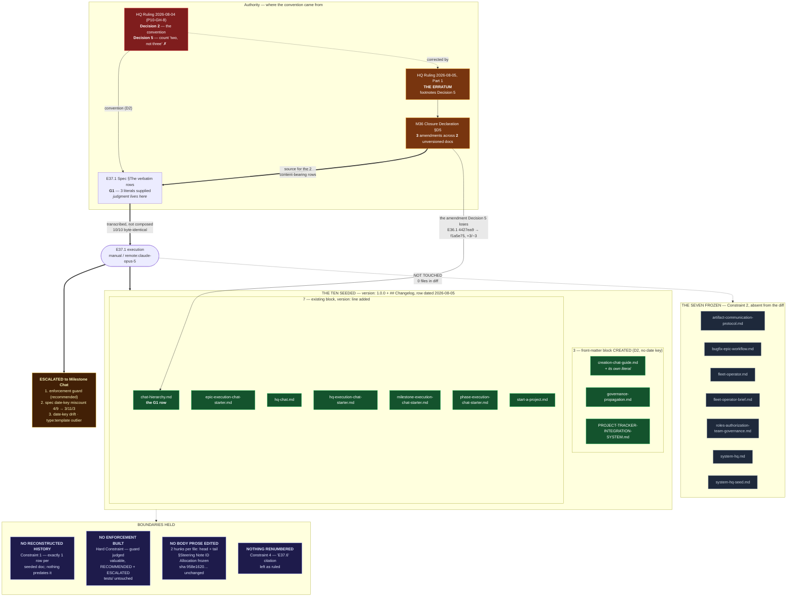

# Delivery Notice: P11-M37-E37.1 — System-tier versioning convention (P10-GH-8)

Template: `governance/templates/delivery-notice.md`; content requirements per PSG §12.

## Summary

**All 17 `governance/systems/` documents now carry a `version` field and a `## Changelog`.** Ten were
seeded; the seven already-compliant are shown absent from the diff. **All ten rows are byte-identical
to the spec's §The verbatim rows literals** — verified by `diff`, not by reading. No history was
reconstructed. **No enforcement was built**, and one enforcement guard is **recommended and escalated
below rather than written.**

**Three findings are reported and deliberately left unfixed**, one of which is a **new count error in
this Epic's own spec** — see §Adjacent tidy-ups.

**Every measurement below was performed at the repository/working-tree layer, which is the layer the
verified things (committed markdown files) exist at.** Layers agree throughout; the one place they do
not is called out explicitly under §Model verification.

---

## Pre-edit measurement — recorded before anything was touched

Run on `epic/P11-M37-E37.1` at branch creation, using the spec's §Verified at planning time command
verbatim. **Layer: repository working tree — the same layer the documents live at.**

```
$ for f in governance/systems/*.md; do
    printf '%-45s version:%s changelog:%s\n' "$(basename "$f")" \
      "$(head -20 "$f" | grep -c '^version:')" "$(grep -c '^## Changelog' "$f")"
  done

artifact-communication-protocol.md            version:1 changelog:1
bugfix-epic-workflow.md                       version:1 changelog:1
chat-hierarchy.md                             version:0 changelog:0
creation-chat-guide.md                        version:0 changelog:0
epic-execution-chat-starter.md                version:0 changelog:0
fleet-operator-brief.md                       version:1 changelog:1
fleet-operator.md                             version:1 changelog:1
governance-propagation.md                     version:0 changelog:0
hq-chat.md                                    version:0 changelog:0
hq-execution-chat-starter.md                  version:0 changelog:0
milestone-execution-chat-starter.md           version:0 changelog:0
phase-execution-chat-starter.md               version:0 changelog:0
PROJECT-TRACKER-INTEGRATION-SYSTEM.md         version:0 changelog:0
roles-authorization-team-governance.md        version:1 changelog:1
start-a-project.md                            version:0 changelog:0
system-hq.md                                  version:1 changelog:1
system-hq-seed.md                             version:1 changelog:1

documents: 17
```

**Seventeen / seven / ten — the planning-time split held at execution time.** No difference to report.

---

## Post-edit measurement — the same command, after delivery

```
artifact-communication-protocol.md            version:1 changelog:1
bugfix-epic-workflow.md                       version:1 changelog:1
chat-hierarchy.md                             version:1 changelog:1
creation-chat-guide.md                        version:1 changelog:1
epic-execution-chat-starter.md                version:1 changelog:1
fleet-operator-brief.md                       version:1 changelog:1
fleet-operator.md                             version:1 changelog:1
governance-propagation.md                     version:1 changelog:1
hq-chat.md                                    version:1 changelog:1
hq-execution-chat-starter.md                  version:1 changelog:1
milestone-execution-chat-starter.md           version:1 changelog:1
phase-execution-chat-starter.md               version:1 changelog:1
PROJECT-TRACKER-INTEGRATION-SYSTEM.md         version:1 changelog:1
roles-authorization-team-governance.md        version:1 changelog:1
start-a-project.md                            version:1 changelog:1
system-hq.md                                  version:1 changelog:1
system-hq-seed.md                             version:1 changelog:1

documents:        17
with version:     17
with changelog:   17
```

**Goal 1 met: 17 of 17.**

---

## G1 — the ten rows, verified by string comparison against the spec

**The rows were not retyped.** They were extracted programmatically from the spec file
(`sed -n '312p'`, `'334p'`, `'342p'` → the uniform template, the `chat-hierarchy.md` G1 literal, and
the `creation-chat-guide.md` literal), and the eight uniform rows were emitted with a single
`gsub(/<PATH>/, path)` substitution. **Transcription error was removed as a possible failure mode
rather than checked for afterwards.**

Each delivered row was then `diff`-ed against the literal it came from:

```
═══ CHECK A — all ten rows string-compare against the spec literals ═══
MATCH (uniform)  epic-execution-chat-starter.md
MATCH (uniform)  governance-propagation.md
MATCH (uniform)  hq-chat.md
MATCH (uniform)  hq-execution-chat-starter.md
MATCH (uniform)  milestone-execution-chat-starter.md
MATCH (uniform)  phase-execution-chat-starter.md
MATCH (uniform)  PROJECT-TRACKER-INTEGRATION-SYSTEM.md
MATCH (uniform)  start-a-project.md
MATCH (G1)       chat-hierarchy.md
MATCH (literal)  creation-chat-guide.md
--> 10 / 10 rows byte-identical to spec literals
```

**No row was altered.** There is no divergence to declare — not a shortened one, not a reworded one,
not a reflowed one.

**A reviewer can re-run this check independently:**

```bash
SPEC=docs/phases/P11__Drivr_Coordination_Over_Rented_Execution/P11-M37-E37.1__spec__system-tier-versioning-convention.md
for f in epic-execution-chat-starter governance-propagation hq-chat hq-execution-chat-starter \
         milestone-execution-chat-starter phase-execution-chat-starter \
         PROJECT-TRACKER-INTEGRATION-SYSTEM start-a-project; do
  P="governance/systems/$f.md"
  diff <(tail -1 "$P") <(sed -n '312p' "$SPEC" | awk -v p="$P" '{gsub(/<PATH>/,p);print}') >/dev/null \
    && echo "MATCH $f.md" || echo "DIVERGENT $f.md"
done
diff <(tail -1 governance/systems/chat-hierarchy.md)    <(sed -n '334p' "$SPEC")
diff <(tail -1 governance/systems/creation-chat-guide.md) <(sed -n '342p' "$SPEC")
```

### The date is uniform — checked, not assumed

```
rows starting '| 1.0.0 | 2026-08-05 |' across the ten: 10
docs with 'version: 1.0.0':                            10
```

**All ten rows are dated `2026-08-05`. None was adjusted to the run date (2026-08-06).**

### `chat-hierarchy.md` — the row that had to differ

**Transcribed first, before any other row**, per the Execution Contract and for the reason the spec
gives: before ten rows of momentum could make it feel like just another row. It matches its G1 literal
byte-for-byte, and it records **E36.1's amendment** (`4427ea9`, merged `f1a5e75`, +3 / −3) — the
amendment HQ Ruling 2026-08-04's Decision 5 count omits.

**It was not reconciled against Decision 5 at any point.** Decision 5 is the thing it corrects.

---

## No reconstructed history — Constraint 1

Every seeded document has **exactly one** changelog data row: its seeding row. Nothing precedes it.

```
═══ CHECK C — each seeded doc has EXACTLY ONE changelog row ═══
chat-hierarchy.md                             data rows: 1
creation-chat-guide.md                        data rows: 1
epic-execution-chat-starter.md                data rows: 1
governance-propagation.md                     data rows: 1
hq-chat.md                                    data rows: 1
hq-execution-chat-starter.md                  data rows: 1
milestone-execution-chat-starter.md           data rows: 1
phase-execution-chat-starter.md               data rows: 1
PROJECT-TRACKER-INTEGRATION-SYSTEM.md         data rows: 1
start-a-project.md                            data rows: 1
```

**The two content-bearing rows are not an exception to this.** They record M36's amendments *inside
the seeding row itself*, as the literals do — they do not add earlier-dated rows. No row in any
document predates its document's seeding row.

---

## The seven compliant documents — shown untouched, not asserted

`git diff --stat` against the merge base `9c2184f`:

```
 governance/systems/PROJECT-TRACKER-INTEGRATION-SYSTEM.md | 14 ++++++++++++++
 governance/systems/chat-hierarchy.md                     |  9 +++++++++
 governance/systems/creation-chat-guide.md                | 14 ++++++++++++++
 governance/systems/epic-execution-chat-starter.md        |  9 +++++++++
 governance/systems/governance-propagation.md             | 16 +++++++++++++++-
 governance/systems/hq-chat.md                            |  9 +++++++++
 governance/systems/hq-execution-chat-starter.md          |  9 +++++++++
 governance/systems/milestone-execution-chat-starter.md   |  9 +++++++++
 governance/systems/phase-execution-chat-starter.md       |  9 +++++++++
 governance/systems/start-a-project.md                    |  9 +++++++++
 10 files changed, 106 insertions(+), 1 deletion(-)
```

**Ten files in the diff. The seven are absent from it** — named individually and checked:

```
artifact-communication-protocol.md            UNTOUCHED (absent from diff)
bugfix-epic-workflow.md                       UNTOUCHED (absent from diff)
fleet-operator-brief.md                       UNTOUCHED (absent from diff)
fleet-operator.md                             UNTOUCHED (absent from diff)
roles-authorization-team-governance.md        UNTOUCHED (absent from diff)
system-hq.md                                  UNTOUCHED (absent from diff)
system-hq-seed.md                             UNTOUCHED (absent from diff)
```

**Constraint 2 held. Their non-uniform changelog row formatting was seen and left entirely** — see
§Adjacent tidy-ups.

---

## No body prose was edited — the hunk map

Each of the ten files has **exactly two hunks**: one at the head (front matter) and one at the tail
(changelog). There is no hunk in the middle of any document.

```
chat-hierarchy.md                    (1117 lines)  @@ -4,0 +5 @@      @@ -1108,0 +1110,8 @@
creation-chat-guide.md               ( 395 lines)  @@ -0,0 +1,6 @@    @@ -381,0 +388,8 @@
epic-execution-chat-starter.md       (  86 lines)  @@ -4,0 +5 @@      @@ -77,0 +79,8 @@
governance-propagation.md            (  53 lines)  @@ -0,0 +1,6 @@    @@ -39 +45,9 @@
hq-chat.md                           ( 263 lines)  @@ -8,0 +9 @@      @@ -254,0 +256,8 @@
hq-execution-chat-starter.md         ( 380 lines)  @@ -4,0 +5 @@      @@ -371,0 +373,8 @@
milestone-execution-chat-starter.md  ( 397 lines)  @@ -4,0 +5 @@      @@ -388,0 +390,8 @@
phase-execution-chat-starter.md      ( 140 lines)  @@ -4,0 +5 @@      @@ -131,0 +133,8 @@
PROJECT-TRACKER-INTEGRATION-SYSTEM.md( 188 lines)  @@ -0,0 +1,6 @@    @@ -174,0 +181,8 @@
start-a-project.md                   ( 210 lines)  @@ -8,0 +9 @@      @@ -201,0 +203,8 @@
```

### The one deletion in the diff — declared rather than buried

The `--stat` above shows **`1 deletion`**, all of it in `governance-propagation.md`. **It is not a
prose edit.** That file did not end with a newline; appending a `## Changelog` section required
terminating its last line. The line's text is byte-identical before and after:

```
-For questions or clarifications, refer to the Epic E3.1 spec or contact the maintainers of this repository.
\ No newline at end of file
+For questions or clarifications, refer to the Epic E3.1 spec or contact the maintainers of this repository.
```

**That is the whole of it — one added newline character, zero changed words.** It is reported here
because a reviewer scanning `--stat` will see a deletion count and should not have to hunt for it.

### `creation-chat-guide.md` §Steering Note ID Allocation — frozen, verified

E36.1's merged section, extracted from the merge base and from the delivered file and compared:

```
lines before: 74 | lines after: 74
sha before: 958e1620c392a6b7d453ec4368cf8bf525f1d724b0532f3d9af63fd192b8befb
sha after : 958e1620c392a6b7d453ec4368cf8bf525f1d724b0532f3d9af63fd192b8befb
FROZEN: §Steering Note ID Allocation is byte-identical to its merge-base content
```

**Byte-untouched, as required. It remains the anchor E37.2 writes alongside.**

> **A correction to my own first check, recorded because the method mattered.** My initial freeze
> check hashed from the heading to EOF — which, *after* I appended the changelog, swept the new
> section into the hash and produced a spurious mismatch. The check above bounds the section at the
> next `## ` heading and compares against `git show 9c2184f:` rather than against a value captured
> in the same session. **The first method was wrong; the file was never wrong.**

---

## The three front-matter blocks created (D2) — no invented date

`creation-chat-guide.md`, `governance-propagation.md`, `PROJECT-TRACKER-INTEGRATION-SYSTEM.md` each
received exactly the D2 block, identically:

```yaml
---
type: system
status: active
version: 1.0.0
---
```

**No `effective_date`, no `last_updated`, no date key of any kind was added to any of the three.**
Neither could be supplied without the commit archaeology Constraint 1 puts permanently out of scope.
**No fuller metadata block was invented** — no `project`, `phase`, `milestone` or `epic` keys, though
four other documents in the directory carry them.

The other seven targets received a single `version: 1.0.0` line appended to their existing block;
**no existing key in any document was reordered, renamed or altered.**

---

## Adjacent tidy-ups — noticed, recorded, left

| # | What was noticed | Disposition |
|---|---|---|
| 1 | **Front-matter date-key drift** — measured **3 `last_updated` / 11 `effective_date` / 3 no date key** | **Reported and left.** Not this Epic's subject |
| 2 | **`epic-execution-chat-starter.md` declares `type: template`** while sitting in `governance/systems/` — the sole `type` outlier of 17 | **Reported and left. Not changed**, per D2's explicit exception |
| 3 | **The seven compliant documents' changelog rows are not uniformly formatted** — `artifact-communication-protocol.md`'s rows are not in version order (1.4.1, 1.4.0, 1.0.0, 1.1.0, 1.3.0, 1.2.0) | **Left entirely.** Constraint 2 |
| 4 | **`governance/systems/` has no enforcement of this convention** | **Recommended and escalated below. Not built.** Hard Constraint |
| 5 | **NEW — this Epic's own spec miscounts the date-key drift** | **Reported, not silently corrected.** See below |

### Finding 5 — a count error in the E37.1 spec itself

**The spec's §The adjacent tidy-ups table states:** *"four documents use `last_updated`, nine use
`effective_date`."*

**Measured: three use `last_updated`, eleven use `effective_date`, three have no date key.**

```
last_updated:   3  — epic-execution-chat-starter.md, hq-chat.md, start-a-project.md
effective_date: 11
no date key:    3  — creation-chat-guide.md, governance-propagation.md, PROJECT-TRACKER-INTEGRATION-SYSTEM.md
total:         17
```

**Measured at the merge base `9c2184f` as well as post-delivery** — identical both times, confirming
this Epic's edits did not produce it. The stated figures are wrong on **both** counts, and they sum
to 13, which **omits the three documents with no front matter** — the same three the spec's own
§Verified at planning time section discovered and flagged as *"new information found by measuring
rather than by citing."*

**This is not corrected here.** Amending the spec is not this Epic's surface, and the spec was correct
in every respect that governs the work — the ten targets, the seven frozen, the three needing blocks,
and all three row literals were exact. **It is escalated to the Milestone Chat as a record-accuracy
item.**

> **It is worth naming what this is an instance of.** The spec warns, in its own §Execution Notes:
> *"This phase has now produced repeated instances of a record stating a count that omits its own
> contribution."* **This is one more, in the spec that issued the warning.** Consistent with
> §The erratum edge's general lesson — *a count in a ruling is a floor, not an inventory* — the count
> was re-measured rather than repeated. Had it been repeated, this Delivery Notice would have carried
> the error forward into a third document.

---

## The enforcement guard — recommended, escalated, NOT built

**Judged valuable. Deliberately not written.** Escalated to the Milestone Chat (P11-M37) as a scoped
item for a future milestone.

**The recommendation:** a test asserting that every `governance/systems/*.md` carries a `version:`
field in its front matter and exactly one `## Changelog` section. As of this delivery it would pass
17/17 immediately.

**Why it is worth something:** the Problem Statement's finding is that the convention *"works exactly
where it exists and is silently absent where it does not."* This Epic makes the corpus uniform **at a
point in time**; it does nothing to stop the next new document from being added without it, which is
precisely how the ten accumulated. **Uniformity achieved by an epic decays; uniformity held by a guard
does not.**

**Why it was not built here, beyond being told not to:** the Hard Constraint's reasoning is sound and
the temptation was real and specific. The measurement loop I ran already *is* the guard in every
respect except being committed — which is exactly what makes committing it feel like a formality
rather than a scope decision. **That is the drift the constraint names.** The measurement shell used
here lives only in this Delivery Notice and in the session; **nothing that runs again was added to the
repository.** `tests/` was not touched at all.

**Suggested shape for whoever scopes it:** it belongs with B3.1's class of guard, needs a decision on
whether `governance/templates/` is in or out of its glob, and needs a stance on the `type: template`
outlier (Finding 2) before it can assert on `type`. **None of those are decidable inside M37.**

---

## Structural diagram (Constraint 8)

Mermaid, fenced, in-repo. **No ComfyUI** — Structural diagrams need no `visual_artifacts` config.



**What the diagram is for:** it is what keeps the CFO's mandatory PSG §11.6.1 diff review affordable
across a ten-document diff — the ten seeded (with the three that needed a block created shown
separately), the seven frozen, the erratum edge feeding `chat-hierarchy.md`'s row, and the two
boundaries the Epic was most at risk of crossing.

> **What was and was not verified about it, stated plainly.** **No Mermaid renderer is available in
> this worktree** (`mmdc` not installed, no `node_modules`, no Python mermaid package), so **the
> diagram has not been machine-rendered.** What was run is a **static structural check**: subgraph/`end`
> balance (6/6), every edge endpoint resolves to a declared node or subgraph (**0 undefined**), every
> `class` target is declared (**0 undefined**), every `classDef` is used, and no line has unbalanced
> quotes or brackets. **That is evidence of well-formedness, not of rendering** — the two are different
> claims and only the first is made here. **If it fails to render at review, that is a rework item**;
> it was composed rather than transcribed, and it is the one deliverable where I could not close the
> loop myself.

---

## Suite — re-measured, both runs recorded

```
$ python3 -m pytest -q        # run 1
377 passed in 24.29s

$ python3 -m pytest -q        # run 2
377 passed in 24.00s
```

**377 passed / 0 failed / 0 skipped / 0 xfailed — matches the baseline exactly, both times.**

**P10-GH-10 did not occur in either run.** `tests/test_artifact_router.py::test_daemon_extensions_error_branches`
passed in both full-suite runs and again in isolation (`1 passed in 0.11s`). **Two green full-suite
runs are recorded, not one** — the second was run precisely because a single green run is weak
evidence against a ~30% intermittent failure, and both are reported. **The test was not fixed, skipped
or marked.**

*Layer note (`P11-GH-2`): the suite was run on the host, in this worktree, which is the layer the test
suite executes at. Layers agree.*

---

## Model verification (P9-M31-E31.3)

| | |
|---|---|
| Harness self-report | `claude-opus-5` ("You are powered by the model named Opus 5") |
| `.ai-project.yml` `models.epic_manual` | `remote:claude-opus-5` |
| Result | **MATCH** |

*Layer note (`P11-GH-2`): performed at the **chat/harness layer** by self-report; the verified thing —
this Epic Execution Chat — **executes at that same layer**, so the layers agree and this is evidence.
**Its known limit is the method, not the layer**: `chat-hierarchy.md` §Manual Chat Model Verification
records that a self-report is not independently attestable, and nothing here overcomes that.*

---

## G11 is NOT claimed

**No lane was exercised under this posture.** This Epic ran manual/paid from start to finish; nothing
was dispatched through `bin/ai-project-orchestrator`, and `epic_qa` has no dispatch mechanism to
exercise. **Closing G11 remains M39's job.** No evidence bearing on it is offered here.

---

## The local/paid comparison moved to M38/E38.6 — recorded, not dropped

**The CFO's decision was not abandoned. It was relocated, and it arrives better.**

For one day (2026-08-05) this Epic was P11's first agentic/local test, chosen by the CFO to obtain a
controlled local-vs-paid comparison. **HQ Ruling 2026-08-06, Decision 2 reverted the posture to
manual/paid**, and the reason is that **the decision's premise was false, not that the decision was
wrong**:

- **Agentic dispatch has not worked since 2026-07-12** — the sandbox cannot reach ollama on
  `localhost`. The M37 Milestone Chat found it; the Phase Chat verified it.
- **The measurement that settled it:** with that endpoint gap fixed, **`local-agent-runner` is still
  absent from the sandbox image.** The posture therefore depended on **M38/E38.2's adapter surface** —
  a milestone binding order places *after* this one.

**The controlled local/paid comparison now lands at `M38/E38.6`** (phase spec v1.1.1), where it is
native: the adapter surface exists, OpenCode is the engine, and the work is code-shaped. **The
endpoint gap is authorized separately as Bugfix B2.1 (High) and was not in this Epic's scope** — it
was not touched.

**A future reader must not conclude the CFO's decision was abandoned.** It was rescheduled to the
milestone where it can actually be executed.

> **The failed experiment produced the more valuable finding.** Agentic dispatch had been broken for
> three weeks and worked around per-epic without the breakage being recorded as such. That was
> obtained **without executing anything.**

> **And the guardrails outlived the posture.** G1 and G2 were written to bound a local model and both
> bound this paid-frontier run unchanged — correctly. G1's trap is HQ's own Decision 5 undercount, a
> paid-frontier miscount; and this delivery adds **a sixth** paid-frontier count error to the phase's
> tally (Finding 5), found in the very spec that supplied G1. **The risks were never tier-specific.**

---

## Definition of Done

| # | Item | Status |
|---|---|---|
| 1 | All 17 docs carry `version` + `## Changelog`, measurement re-run and recorded | ✅ 17/17, output above |
| 2 | All ten carry `version: 1.0.0` (D1), `## Changelog` placed per D3 (last section) | ✅ 10/10 |
| 3 | All ten first rows are the spec literals, transcribed unmodified, all dated `2026-08-05` | ✅ 10/10 byte-identical by `diff` |
| 4 | Three documents received the minimal D2 block, no invented date key | ✅ shown above |
| 5 | `chat-hierarchy.md`'s row matches its G1 literal byte-for-byte | ✅ `diff` clean |
| 6 | `creation-chat-guide.md`'s row matches its literal byte-for-byte | ✅ `diff` clean |
| 7 | The seven compliant documents shown unchanged | ✅ absent from `git diff --stat` |
| 8 | No reconstructed history anywhere | ✅ exactly 1 row per seeded doc |
| 9 | No test, linter or validator added; guard recommended + escalated | ✅ `tests/` untouched; escalated |
| 10 | No file outside `governance/systems/` + this Epic's own `docs/` artifacts in the diff | ✅ 11 files total |
| 11 | Structural Mermaid diagram, naming ten seeded / seven frozen / no-reconstruction | ✅ above |
| 12 | Adjacent tidy-ups noticed and left, recorded | ✅ five findings, named individually |
| 13 | Full suite green, re-measured and stated | ✅ **377 / 0**, twice |
| 14 | Delivery Notice committed; changes on `epic/P11-M37-E37.1`; PR to `milestone/M37` | ✅ |

### Posture items (Milestone spec v1.1.3)

| # | Item | Status |
|---|---|---|
| P1 | Starter declares `manual`, routes to `models.epic_manual`, carries the E31.3 check | ✅ verified, MATCH |
| P2 | `chat-hierarchy.md` row carried verbatim per G1, verified by **string comparison** not by reading | ✅ `diff`, not judgment |
| P3 | Completion judged by the reviewer's own external re-measurement (**G2**) | ⏸️ **the Milestone Chat's to perform** — every claim here is given as a re-runnable command |
| P4 | **G11 NOT claimed** | ✅ explicitly not claimed |
| P5 | Relocation of the local/paid comparison to `M38/E38.6` recorded, with reason | ✅ above |

---

## Scope boundaries held

- ❌ **Nothing under `tests/`** — including B3.1's guard. Not touched.
- ❌ **No other `governance/` file** — `PROJECT-SYSTEM-GUIDELINES.md` (E37.2 owns `:605`),
  `AI-OPERATING-GUIDELINES.md`, `governance/ai-project-yml-spec.md`, `governance/templates/`: all
  absent from the diff.
- ❌ **No M36 artifact reopened or amended.**
- ❌ **The ruling's `E37.6` citation was not "fixed"**, nor any other historical epic-ID citation.
- ❌ **No front-matter key normalized** across the directory.
- ❌ **No body prose, typo or cross-reference edited** in any of the ten.
- ❌ **M37 was not widened** — contents remain two epics; the one thing that wanted to become work
  (the guard) was escalated instead.
- ✅ **`creation-chat-guide.md` carries no E37.2 reconciliation** — E37.1 lands first by binding
  decision, and E37.2 owns adding its row and bumping `1.0.0` → `1.1.0`.

---

## Escalations to the Milestone Chat (P11-M37)

1. **Enforcement guard for the convention — recommended, not built.** Scoped shape and open questions
   in §The enforcement guard above.
2. **E37.1 spec's date-key drift count is wrong** — states 4 / 9, measured 3 / 11 / 3, and its total
   omits the three documents with no front matter. **Record-accuracy item; not corrected here.**
3. **Front-matter date-key drift** (3 `last_updated` / 11 `effective_date` / 3 none) and the
   **`type: template` outlier** in `epic-execution-chat-starter.md` — both reported and left, per the
   spec's disposition table. Neither is this Epic's subject; both remain unowned.

---

## Chat Closure

Epic E37.1 execution is complete and this chat now **stops**. The PR is opened to `milestone/M37` and
**not merged**.

**Next step:** Stage-2 review by the Milestone Chat (P11-M37) — **clean deliveries are accepted by
silence** (SN-13 / PSG §11.6). Merge authorization is an in-chat human act, and per **G2 the reviewer
re-measures**: 17 of 17 compliant, seven shown untouched, no reconstructed history, ten rows matching
the spec's literals by string comparison. **Every claim above is stated so that it can be re-run
rather than trusted.**
