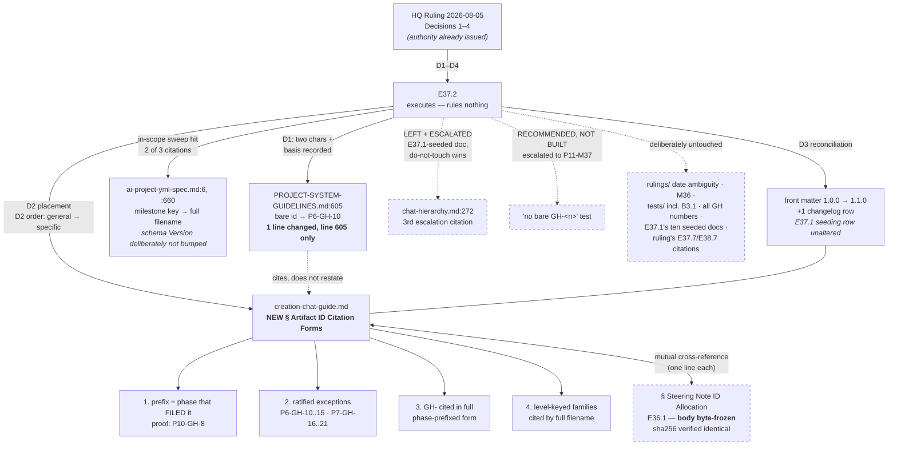

# Delivery Notice: P11-M37-E37.2 — Artifact-ID citation forms (`GH-`, escalation notices)

## Summary

Executed HQ Ruling 2026-08-05, Decisions 1–4. The corpus's sole bare `GH-` identifier at
`PROJECT-SYSTEM-GUIDELINES.md:605` is disambiguated to `P6-GH-10` with its resolution basis recorded;
the four citation-form rules are recorded **once**, in a new `## Artifact ID Citation Forms` section of
`governance/systems/creation-chat-guide.md`, placed per D1 and ordered per D2. **Nothing was
renumbered. No enforcement was built.**

**One scope decision was made and is flagged for the Milestone Chat below** — the third
escalation-notice citation sits in `chat-hierarchy.md`, which the spec's do-not-touch list protects by
name. It was left and is escalated rather than fixed. See §Things noticed and deliberately left, item 1.

**`merge_details` is unfillable at delivery time** — the PR is not merged. Recorded as `pending`
per the known defect **P10-GH-4**.

---

## Prerequisite verification

**Branch checked before anything else** and re-checked before the first commit — `epic/P11-M37-E37.2`,
branched from `milestone/M37` at `c6c47b1`.

All six required paths confirmed **git-tracked on `milestone/M37`** via `git ls-files --error-unmatch`
(not a disk-existence check). All six tracked.

**Model verification (P9-M31-E31.3).** Harness-reported model identity: `claude-opus-5`.
`.ai-project.yml` `models.epic_manual`: `remote:claude-opus-5`. **Both present, and they agree.**

---

## The sweep — layer stated first (`P11-GH-2`)

**The layer this sweep was performed at, and the layer the claim applies at:**

| | |
|---|---|
| **Paths swept for the remediation claim** | `governance/` — the normative tier, recursively |
| **Layer the claim applies at** | `governance/` — **the same layer.** No corpus-wide claim is made |
| **Paths swept for the inventory claim** | `docs/`, `governance/`, `.ai-project/` |
| **Layer that claim applies at** | the corpus. **This is an inventory, not a remediation claim** |

**Said plainly: a sweep of `governance/` is not a sweep of the corpus, and I am not claiming it is.**
The remediation claim below — *no bare `GH-<n>` remains* — is a claim **about `governance/` only**. The
corpus outside `governance/` still contains bare `GH-<n>` strings in quantity (**156 occurrences under
`.ai-project/`, 489 under `docs/`, across 184 files**, measured at `b9c7e5c`). **Those are out of scope
and deliberately untouched** — they are historical artifacts, and the rule as ruled binds the normative
tier.

### Commands (reproducible)

```bash
# 1. bare, namespace-stripped GH-<n> in the normative tier
grep -rnoiP '(?<!P\d-)(?<!P\d\d-)(?<!P\d\d\d-)\bGH-\d+' governance/
# 2. every distinct phase-prefixed GH id in the corpus
grep -rhoP '\bP\d+-GH-\d+' docs/ governance/ .ai-project/ | sort -u -V
# 3. escalation-notice shorthand
grep -rniP 'P\d+-M\d+ escalation' governance/
```

The lookbehind in (1) is **widened from the spec's** `(?<!P\d-)(?<!P\d\d-)` **to include**
`(?<!P\d\d\d-)`, and `-i` is added. Both widenings are precautionary and neither changed the result.

### Sweep 1 — bare `GH-<n>` under `governance/`

**BEFORE** (at `c6c47b1`, branch point):

```
governance/PROJECT-SYSTEM-GUIDELINES.md:605:GH-10
-- occurrences: 1
```

**AFTER** (at `b9c7e5c`):

```
-- occurrences: 0
```

**Exactly one before, zero after.** Matches the spec's floor of *exactly one*.

**Two additional forms were swept and returned nothing**, so the "exactly one" figure is not an
artifact of a narrow pattern:

```bash
# lowercase / spaced variants
grep -rnoiP '\bgh[ -]?\d+' governance/     # all hits were tails of P<n>-GH-<m>, verified individually
```

Every hit from that broader pattern was checked by re-reading its line: **all 33 were the tail of a
phase-prefixed ID** (`er SN-19/P7-GH-17`, `); fixes P6-GH-10`, `#### P9-GH-1`, …). **False positives of
the loose pattern, not misses of the strict one.**

### Sweep 3 — escalation-notice citations under `governance/`

**BEFORE** — 3 occurrences across 2 files, exactly as the spec's Correction 2 predicted:

```
governance/ai-project-yml-spec.md:6      "(P10-M34 escalation, 2026-07-28)"   [lower-case, §Introduced In]
governance/ai-project-yml-spec.md:660    "(P10-M34 Escalation Notice)"        [changelog row, v2.6.0]
governance/systems/chat-hierarchy.md:272 "(P10-M34 Escalation Notice)"
```

**AFTER** — 1 occurrence:

```
governance/systems/chat-hierarchy.md:272:(P10-M34 Escalation Notice). HQ refresh
-- occurrences: 1
```

**Two fixed, one deliberately left and escalated** (see §Things noticed and deliberately left, item 1).

**A line-number drift to report, not fix:** the spec and the ruling both cite
`chat-hierarchy.md:271`. **It is at 272** — E37.1's front-matter block shifted that file down as well.
The spec's re-measurement table covered `creation-chat-guide.md` but not `chat-hierarchy.md`. **Floor
confirmed again.**

### The sweep was widened beyond the spec's three commands

Because Deliverable 6 requires exhaustiveness rather than reproduction of the ruling's floor, two
further patterns were run to catch level-keyed citations the `P\d+-M\d+ escalation` pattern would miss:

```bash
grep -rnoiP 'P\d+-M\d+[^.\n]{0,30}?(escalation|notice|ruling|declaration|digest)' governance/
grep -rnoiP '(escalation notice|closure declaration|progress digest)[^.\n]{0,25}P\d+-M\d+' governance/
grep -rnoiP '\bM\d+ (escalation|notice)' governance/          # bare milestone key, no phase prefix
```

**No further defects found.** The second and third returned empty. The first returned only the known
occurrences plus correctly-formed full-filename citations (`chat-hierarchy.md:486`, `:492`).

---

## The inventory — dated, commit-anchored, and stated as a snapshot

**Measured 2026-08-06, as of commit `b9c7e5c`, over `docs/`, `governance/`, `.ai-project/`.**

| | Count |
|---|---|
| Distinct `P<n>-GH-<m>` strings | **42** |
| **Live `GH-` IDs** | **40** |
| Not live — pre-renumber historical references only | **2** (`P6-GH-1`, `P6-GH-2`) |

Per phase, live: **P5: 10 · P6: 6 · P7: 6 · P8: 3 · P9: 3 · P10: 10 · P11: 2**.

**`P6-GH-1` and `P6-GH-2` were verified as not-live rather than assumed.** Every occurrence was read:
all appear inside discussions *of the SN-15 renumber itself* (`P6-GH-1` → `P6-GH-12`, `P6-GH-2` →
`P6-GH-13`) — in E36.5's audit, the M37 milestone spec, the 2026-08-04 escalation notice, the
2026-08-05 ruling, and the new section this Epic wrote. **They are strings in old records, not
identifiers anything is filed under.**

### Reconciliation against 38 / 39 / 40

| Source | Count | Correct at its date? | Reconciliation |
|---|---|---|---|
| HQ Ruling 2026-08-05 | 38 | ✅ yes | predates `P11-GH-1` and `P11-GH-2` |
| M37 milestone spec v1.0.0 (2026-08-05) | 39 | ✅ yes | includes `P11-GH-1`; predates `P11-GH-2` |
| E37.2 spec (2026-08-06) | 40 | ✅ yes | includes both |
| **This delivery (2026-08-06, `b9c7e5c`)** | **40** | ✅ | **agrees with the spec — no drift during execution** |

**A naive sweep returns 42 and overcounts** by including the two pre-renumber strings.

> **This figure will be stale too.** It is a snapshot at one commit on one date. It counted distinct
> `P<n>-GH-<m>` strings across three directory trees and subtracted two verified-historical strings.
> **Anyone relying on it should re-run the command rather than cite the number.**

---

## `PSG:605` — the resolution and its basis

**Before:** `Codified by E25.2 (P6-M25); closes GH-10.`

**After:** the identifier is `P6-GH-10`, and **the basis is recorded in the line itself** so a future
reader can check the resolution rather than re-derive it against misleading context.

**The trap, confirmed by reading the whole paragraph rather than the line.** The sentence opens with
**two P5 anchors** — *"SN-13 (P5)"*, *"since P5"* — against **one P6 anchor**, *"(P6-M25)"*. A reader
weighting salience over adjacency resolves it to `P5-GH-10` and is wrong.

**The resolution rests on `(P6-M25)` / E25.2**, and was corroborated three ways rather than accepted
from the spec:

1. **P5's phase closure declaration** files `P6-GH-10` as *"Formally codify SN-13 default-accept model
   into AOG, PSG, and Execution Chat Starter templates"* — which is precisely what §11.6 is.
2. **`AI-OPERATING-GUIDELINES.md:1047`** independently records the same closure: *"…fixes P6-GH-10"*
   in the AOG v2.6.0 changelog row for the SN-13 codification.
3. **`P5-GH-10`, the competing referent, is a different subject entirely** — a delivery-notice item
   recorded in P5's phase delivery notice, unrelated to default-accept.

**Only line 605 was changed in `PROJECT-SYSTEM-GUIDELINES.md`** — verified by diff: `1 file changed,
1 insertion(+), 1 deletion(-)`.

---

## The four rules — recorded once, and the surfaces that cite rather than restate

**All four live in exactly one place:** `governance/systems/creation-chat-guide.md`, section
`## Artifact ID Citation Forms`.

**Placement (D1, applied):** a new sibling `##` section immediately after §Steering Note ID Allocation
and before §When to Expect a Progress Digest. **Located by heading text, not by line number**, per the
spec's instruction — the numbers were re-derived and independently confirmed to match the post-merge
table (§Steering Note ID Allocation at **167**, insertion point at **241**, `## Changelog` at **391**).

**Order (D2, applied):** general → specific.

| # | Rule | Ruling |
|---|---|---|
| 1 | The `GH-` prefix names the phase that **filed** the item, permanently. *The record names the disposition; the identifier names the origin.* `P10-GH-8` recorded as the worked proof. Per-phase allocation stated. | D4 |
| 2 | `P6-GH-10…15` and `P7-GH-16…21` are **ratified historical exceptions, not renumbered**, with the reason and the SN-15 precedent noted-and-not-followed. | D4 |
| 3 | `GH-` identifiers in `governance/` are cited in **full phase-prefixed form**, never bare. Recorded as the direct analogue of E36.1's SN-23 date-qualification rule. | D2 |
| 4 | Escalation notices — **generalized to any artifact family keyed by level rather than by identifier** — are cited by **full filename**. | D3 |

**Cross-references, both directions (D1):** one line appended to the end of §Steering Note ID
Allocation pointing forward; a "Companion to…" paragraph opening the new section pointing back.
**Neither restates the other.**

**Other surfaces cite rather than restate (Constraint 6):** the only other surface touched,
`PROJECT-SYSTEM-GUIDELINES.md:605`, **points at the section** ("*Cited in full form per
`governance/systems/creation-chat-guide.md` §Artifact ID Citation Forms*") rather than reproducing the
rule. **The rules were not duplicated into `escalation-notices/`, `rulings/`, or any family directory.**

### The stand-alone test, applied

The four questions the starter requires a reader to answer **from the section alone**, without the
ruling:

- *What prefix does a gap record I file today take?* → §The `GH-` prefix names the phase that FILED
  it: *"take the current phase's prefix and the next free number in that phase's sequence."*
- *Does that prefix change if the item is rescheduled?* → Same subsection: *"it never changes"*, with
  the `P10-GH-8` worked proof showing an item that moved twice and kept its ID.
- *How do I cite an escalation notice, and why not by milestone key?* → §Artifacts keyed by level:
  full filename, shown as a literal path, *"because a milestone can raise more than one notice"* — two
  share `P10-M34`, two share `P11-M36`.
- *Why are `P6-GH-10…15` / `P7-GH-16…21` exceptions, and why aren't they fixed?* → §Ratified
  historical exceptions: a table giving what each range does instead, plus *"they have already
  propagated into the normative tier."*

**None of the four requires the ruling.**

### One authoring problem found and solved — worth recording

**The first draft of the rules instantiated the defects they prohibit.** Writing *"never a bare
`GH-10`"* and *"not 'the P10-M34 Escalation Notice'"* as counter-examples put **4 bare `GH-<n>` and 1
milestone-key citation into `governance/`** — the post-edit sweep caught it, returning 4 where it
should have returned 0.

**Resolved by stating the prohibited forms as metavariables** — `GH-<n>`, *"the `P<n>-M<n>` notice"* —
described rather than exhibited, with a parenthetical in the section explaining why. **The section now
practices the rule it states:** both worked examples cite real escalation notices by full filename.

**This matters beyond this Epic.** Any future guard asserting *"no bare `GH-<n>` under `governance/`"*
would have flagged the very document that defines the rule. **Whoever builds that guard should know
the rule document is the first thing it will trip on if the forms are ever spelled out.** Carried into
the escalation below.

---

## D3 reconciliation — landing second

**E37.1 had already merged** (`61fe789`, PR #186). Verified on the branch rather than assumed.

| Obligation | Done |
|---|---|
| Add **one row** to the existing `## Changelog` | ✅ one row, `1.1.0`, dated 2026-08-06 |
| Bump `version` `1.0.0` → `1.1.0` | ✅ — minor, because a new normative section is an addition |
| **Do not create** the changelog section | ✅ it already existed at line 391; only a row was added |
| **Do not restate or alter** E37.1's seeding row | ✅ verified by diff — zero deletions matching it |
| Re-derive every line number | ✅ all located by heading text; numbers independently confirmed |

**E36.1's §Steering Note ID Allocation is byte-frozen.** Verified by hashing the section body before
and after:

```
before: be5dba94072c0f275c84084fe047751c14f93bbcc0f421bb675256924bdc1267
after:  be5dba94072c0f275c84084fe047751c14f93bbcc0f421bb675256924bdc1267
```

**Identical.** The single permitted edit — the cross-reference line — is appended *after* that body,
outside the hashed range. E37.1's own verification hash (`958e1620…`) was also reproduced against the
pre-edit file to confirm the section was in the state E37.1 left it.

**E37.1's front-matter block is otherwise unaltered** — `type: system` and `status: active` untouched;
only `version:` changed.

---

## Nothing renumbered; the `rulings/` ambiguity not actioned

**Nothing renumbered (Constraint 4).** Every `GH-` identifier appearing in the diff was checked: all
are **additions** in the new section, plus the `PSG:605` change from a bare number to `P6-GH-10`.
**That is disambiguation, not renumbering** — the number `10` is unchanged; a prefix was added. No
identifier's number moved anywhere in the diff.

**The `rulings/` date-only ambiguity was NOT actioned (Constraint 7).** It was not swept for, not
edited, and not escalated. Affirmed as report-and-leave, exactly as recorded.

**The ruling's `E37.7` / `E38.7` citations were NOT "fixed"** — they are historical and correct at
their dates. No artifact file was renamed or moved.

---

## The Hard Constraint — no enforcement built, and the recommendation escalated

**No test, linter, validator or registry was added. Nothing under `tests/` was touched** — confirmed by
the diff, which contains three files, all under `governance/`.

**The temptation arrived exactly in the shape the starter predicted.** Sweep 1 returns **1** before the
fix and **0** after. *"Assert no bare `GH-<n>` under `governance/`"* is a two-line test that would pass
on delivery. **It was not written.**

### Recommendation, escalated to the Milestone Chat (P11-M37)

**A guard is judged valuable, and this Epic recommends one be considered — in a milestone whose scope
permits enforcement, not this one.** Three reasons it is stronger than a typical hygiene assert:

1. **The invariant is now genuinely zero**, not "small" — there is nothing to allowlist.
2. **B3.1 already establishes the pattern** for exactly this family of ID-integrity guard.
3. **The defect it catches is silent.** A bare identifier does not fail anything; it misleads a reader,
   which is the one failure mode no test currently catches.

**And one design constraint the builder must know**, discovered while authoring:

> **The guard will trip on the rule document itself** if the prohibited forms are ever spelled out
> literally. This delivery avoided that by using metavariables, but that is a convention, not an
> enforced property. **Any such guard needs either an allowlist for
> `governance/systems/creation-chat-guide.md` or a rule that the metavariable form is mandatory in
> normative rule statements.** A guard written without knowing this will fail on its first run against
> a correct corpus.

**Building it here would be a DoD failure. It was not built.**

---

## Things noticed and deliberately left

Named individually, per §The cheapness hazard.

**1. `chat-hierarchy.md:272` — the third escalation-notice citation. LEFT, and escalated.**

This is the one judgment call in the delivery, and it goes to the Milestone Chat rather than being
made silently.

- The spec's **in-scope surfaces** include *"any escalation-notice-by-milestone-key citation the sweep
  finds under `governance/`"* — which covers it.
- The spec's **do-not-touch list** names *"all ten of E37.1's other seeded documents"* — and
  `chat-hierarchy.md` **is** one of them, verified against `61fe789`'s file list, not assumed.
- **Specific prohibition beats general authorization**, so it was left.
- **A second, independent reason to leave it:** amending that document's body would, under the
  versioning convention E37.1 has just seeded, oblige a version bump and changelog row **in a document
  E37.1 owns in this milestone** — putting E37.2 inside E37.1's surface, which the merge-order
  boundary exists to prevent.

**Consequence, stated plainly rather than glossed:** Goal 1's *"escalation notices cited by full
filename"* is **satisfied for 2 of 3 occurrences under `governance/`, not 3 of 3.** The DoD item asks
that the sweep be *exhaustive and cover* all three, which it does — but the Milestone Chat should
decide whether to authorize the third fix (here, or as a follow-up), and this delivery does not
presume the answer.

**2. `ai-project-yml-spec.md`'s `Version:` was not bumped.** It is at `2.7.0` with its own changelog.
**That version tracks the `.ai-project.yml` *schema*, not the document** — every existing row describes
a schema or defaults change. A citation-form correction changes no field, key, default or validation
rule, and bumping would falsely signal a schema change. **Noticed, reasoned, left.** Flagged in case
the Milestone Chat reads the versioning convention as applying to that file too.

**3. The `chat-hierarchy.md:271` → `:272` line-number drift** in both the ruling and this Epic's spec.
**Recorded above, not fixed** — historical measurements, correct at their dates.

**4. The `rulings/` date-only ambiguity.** Constraint 7. Not actioned, not escalated.

**5. Adjacent tidy-ups declined.** While reading `PROJECT-SYSTEM-GUIDELINES.md` around line 605 and
the whole of `creation-chat-guide.md`, no further fixes were made to either file. The two-character
authorization was **not** treated as a licence for other small corrections. `PROJECT-SYSTEM-GUIDELINES.md`
carries a one-line diff.

---

## Structural diagram (Constraint 8)



**Dashed = deliberately not changed by this Epic. Authority flowed nowhere new** — every rule here was
already decided by the 2026-08-05 ruling; E37.2 records and applies, and decides nothing.

---

## Suite

**Re-measured on `epic/P11-M37-E37.2` with `python3 -m pytest`** (`python` is not on `PATH`).

| Run | Result |
|---|---|
| 1 | **377 passed / 0 failed / 0 skipped / 0 xfailed** (24.20s) |
| 2 | **377 passed / 0 failed / 0 skipped / 0 xfailed** (24.00s) |

**Baseline `377 / 0` matched exactly. No regressions, no new skips.**

**P10-GH-10 did not fire.** `tests/test_artifact_router.py::test_daemon_extensions_error_branches`
passed in **both** full-suite runs. Two runs were done specifically because that test's measured
failure rate is ~30% in full-suite runs; **both results are recorded, not only a green one.** The test
was not fixed, skipped or marked.

---

## Definition of Done

| Item | Status |
|---|---|
| `PSG:605` reads `P6-GH-10`, basis recorded | ✅ |
| Sweep shows **no bare `GH-<n>` under `governance/`**, command + output shown (G2) | ✅ 1 → 0 |
| Four rules recorded normatively in **ONE** place, placed per D1, ordered per D2 | ✅ |
| Other surfaces **cite rather than restate** | ✅ `PSG:605` cites the section |
| The two sections **cross-reference each other** | ✅ both directions |
| `P6-GH-10…15` / `P7-GH-16…21` recorded as ratified exceptions; nothing renumbered | ✅ |
| `P10-GH-8` recorded as the worked proof | ✅ |
| Sweep exhaustive and evidenced; **all three** escalation occurrences covered; live vs historical distinguished; inventory dated + commit-anchored | ✅ covered; **2 of 3 fixed**, third escalated |
| Sweep's stated scope **names its layer** (`P11-GH-2`) | ✅ |
| `rulings/` date-only ambiguity **NOT actioned** | ✅ |
| `creation-chat-guide.md` at `version: 1.1.0` with one new row; E37.1's row unaltered; §SN ID Allocation byte-untouched | ✅ sha256 verified |
| **No test, linter or validator added**; guard recommended + escalated instead | ✅ |
| Nothing outside the in-scope surfaces in the diff | ✅ 3 files, all `governance/` |
| Structural Mermaid diagram | ✅ inline above |
| Things noticed and deliberately left, recorded individually | ✅ 5 items |
| Full suite green, re-measured and stated | ✅ 377/0, twice |
| Delivery Notice produced and committed; changes on `epic/P11-M37-E37.2`; PR opened to `milestone/M37` | ✅ |

---

## For the Milestone Chat — two items needing a decision

1. **`chat-hierarchy.md:272`** — the third escalation-notice citation, left unfixed because the
   do-not-touch list protects E37.1's ten seeded documents. **Authorize a fix here, defer it, or
   confirm report-and-leave.** Goal 1 is 2 of 3 on this surface until then.
2. **The enforcement guard** — recommended, not built, with the design constraint that it will trip on
   the rule document itself unless the metavariable convention is enforced or that file allowlisted.

**Epic E37.2 execution complete. Epic Delivery Notice produced. Awaiting Milestone Chat review and
merge authorization.**
