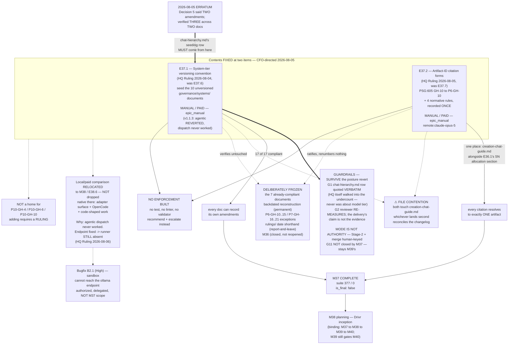

# Milestone M37 — Corpus Record Conventions

## Purpose

Decide and apply the corpus's own metadata conventions **once**, so that the record can state what
changed and every citation resolves to exactly one artifact. Two named items, both executing rulings
already on the record, both entirely in-repo, neither with any Drivr dependency.

This milestone ensures:
- **Every `governance/systems/` document can record its own amendments.** Ten of seventeen carry
  neither a `version` field nor a `## Changelog`; all ten are seeded forward-looking, and the seven
  that already comply are left untouched (E37.1).
- **No citation in the normative tier resolves to more than one artifact.** The sole bare `GH-<n>` in
  the corpus is disambiguated, `GH-` citations carry the phase prefix, escalation notices are cited by
  full filename, and the `GH-` prefix is fixed as naming the phase that **filed** an item —
  permanently (E37.2).

**M37 is not P11's final milestone** (`is_final: false`). On its closure the Phase Chat proceeds to
**M38 planning** — Drivr inception — per the binding order M36 → M37 → M38 → M39 → M40.

---

## ⚠ Read first — this milestone was inserted, and the numbers around it moved

**P11 was restructured from four milestones to five on 2026-08-05, CFO-directed** (phase spec
**v1.1.0**, merged `bfe2eca`). **M37 is the new milestone.** Everything that was M37 shifted:

| was | is |
|---|---|
| — | **M37 — Corpus Record Conventions** (this milestone) |
| M37 — Drivr Inception, Fleet Registry, Execution Adapter Surface | **M38** |
| M38 — Trustworthy Completion Signal (P10-GH-7) | **M39** |
| M39 — Coordination: Scheduler, Derived Gate Queue, Thin Surface | **M40** |

**The two governing rulings predate the restructure and cite the old epic IDs.** They were correct at
their dates and **are not rewritten** (per HQ Ruling 2026-08-01, Decision 4 — *a bookkeeping defect
never rewrites a citation*, and the SN-15 precedent). Read them through this mapping:

| Ruling says | Read as |
|---|---|
| `M37/E37.6` (2026-08-04 ruling — versioning convention) | **M37/E37.1** |
| `M37/E37.7` or `M38/E38.7` (2026-08-05 ruling — citation forms) | **M37/E37.2** |

**The binding gate survived the renumber:** the completion signal still gates coordination, now
**M39 → M40**. Only labels moved; no epic was added or removed.

**One consequence to note and not act on.** The 2026-08-05 ruling upgraded the Phase Chat's permission
to **split M37** from *permitted* to *recommended*. **That recommendation is spent.** It applied to
old-M37 at seven epics — the condition the restructure itself resolved by carving this milestone out.
**New M37 has two epics and its contents are fixed at them; there is nothing to split.** The standing
split permission now belongs to **M38**, which inherited old-M37's five Drivr epics and where the
phase spec still records it.

---

## This Milestone Is Entirely In-Repo

Like M36 and unlike the rest of P11, every M37 deliverable amends this framework's own corpus. There
is no target project, no cross-repo bump, and **no Drivr dependency of any kind** — M38 creates Drivr,
and nothing in M38–M40 depends on either M37 epic.

**Placement is therefore a judgment about record integrity, not about dependency** — the same judgment
that put M36 first. Both items are latent traps that compound with every amendment, and **M36
demonstrated the compounding inside a single milestone**: one epic, one commit, one author, one spec
recorded three amendments with full provenance and two with none.

**Suite baseline: 377 passed / 0 failed / 0 skipped / 0 xfailed**, measured on `phase/P11` at planning
time. Note `master` still reads 375 passed / 1 xfailed until `phase/P11` merges up at phase close —
E36.2 converted B3.1's `xfail` to a pass and added one test. **Measure on the branch you are on.**

---

## Contents Are FIXED at Two Items (binding — CFO-directed, 2026-08-05)

**M37 carries E37.1 and E37.2 and nothing else.** Same discipline the CFO applied to M36's four.

**This milestone is NOT a home for `P10-GH-4`, `P10-GH-6` or `P10-GH-10`**, nor for any other parked
carry-forward. **Adding to it requires a ruling, not a passing judgment.**

**The reason is the milestone's own origin.** Old M37 reached **seven** epics, four of them
carry-forward hygiene HQ routed there one ruling at a time. *"The milestone with room"* had become
*"the milestone things get put in."* **HQ named that pattern and constrained itself against it**
(2026-08-05 ruling: *"HQ places nothing further in M37 without first reconsidering the milestone's
shape"*), and the CFO then resolved it structurally. **Without this fence the restructure moves the
problem instead of fixing it** — and the fence is worth nothing if the first convenient item breaches
it.

**P10-GH-5 and conditional P10-GH-1 stay with the registry in M38.** They were folded in for coupling
to registry work, not for hygiene, and they do not follow the hygiene epics here.

---

## Execution Posture — UNIFORM manual / paid (v1.1.3; HQ Ruling 2026-08-06, Decision 2)

**Both epics run manual / paid frontier.** Every Epic Execution Chat Starter carries
`Execution Mode: manual` and routes to `models.epic_manual` (`remote:claude-opus-5`).

| Epic | Execution Mode | Model key | Resolves to |
|---|---|---|---|
| **E37.1** | `manual` | `models.epic_manual` | `remote:claude-opus-5` |
| **E37.2** | `manual` | `models.epic_manual` | `remote:claude-opus-5` |

> **⚠ The split posture is reverted. v1.1.0–v1.1.2's agentic/local declaration for E37.1 is superseded,
> and is preserved below rather than deleted** because the decision, the reasoning and the guardrails it
> produced all remain load-bearing.
>
> **Why it reverted — the premise was false, not the decision wrong.** The CFO chose the split on
> 2026-08-05 on the understanding that agentic/local dispatch worked. **It does not, and has not since
> 2026-07-12.** The M37 Milestone Chat found it, the Phase Chat verified it, and **HQ added the
> measurement that decided it: with the endpoint gap fixed, `local-agent-runner` is *still absent* from
> the sandbox image** — so the endpoint fix alone does not unblock E37.1, and the posture depends on
> **M38/E38.2's adapter surface** under every route that keeps it. That dependency is not optional.
> Full detail in §Dispatch mechanics below and in
> `.ai-project/artifacts/rulings/2026-08-06__ai-project-system-hq__ruling__m37-dispatch-and-sandbox-endpoint.md`.
>
> **The CFO's intent is preserved, not discarded.** The local/paid controlled comparison **moves to
> M38 as `E38.6`** (phase spec v1.1.1), where it is native: the adapter surface exists, OpenCode is the
> engine, and the work is code-shaped. **The evidence arrives one milestone later and better.**
> The CFO may override this ruling on either point.
>
> **Two guardrails SURVIVE the revert, in adapted form — see §Guardrails.** They were written to bound
> an agentic run, but neither risk they address is agentic-specific.

**v1.0.0's original reasoning for uniform manual/paid therefore stands again**, and is stated below as
the caution that produced the guardrails rather than as an argument against a decision no longer in
force.

**Why E37.1 and not E37.2.** E37.1 is the strongest local-lane candidate this phase has offered:
highly repetitive, mechanically verifiable, and carrying a **cheap ground truth** — after the run,
either all seventeen `governance/systems/` documents carry `version` + `## Changelog` or they do not,
checkable in one command. E37.2 is two characters in the framework's highest-authority document plus
four normative rules whose whole value is precision; there is no upside to risking it.

**The split is itself the point.** Running one epic local and one paid inside a single milestone, on
work of comparable subject and adjacent files, produces a **controlled comparison** rather than one
ambiguous result. That evidence is wanted by M38 and M39; this is a low-risk place to start collecting
it.

### The Phase Chat's original caution, preserved — it is what the guardrails address

- **E37.2 is dense-prose normative authorship**, and the 2026-08-01/02 engine comparison measured
  `qwen3-coder:30b` at its weakest on exactly that shape
  (`.ai-project/artifacts/field-evidence/2026-08-02__B3.1-engine-comparison.md`). **Unchanged: E37.2
  stays manual/paid.**
- **E37.1 is mechanical in structure but not uniformly in content.** Nine documents take a
  near-identical seeding row; **`chat-hierarchy.md` takes a deliberately different one** sourced from
  the 2026-08-05 erratum (constraint 3). *"One exception among ten uniform items"* is precisely the
  shape a weaker model flattens, and a flattening lands in ten governance documents at once.

### Guardrails — binding on E37.1's Epic spec

**G1 — The `chat-hierarchy.md` changelog row is quoted VERBATIM in the Epic spec.** The Epic spec must
carry the exact row text as a literal string to be copied, **not** a description of how to derive it
from the erratum. This removes E37.1's single judgment call and converts constraint 3 from reasoning
into transcription. **The Milestone Chat authors that literal string** — sourced from the 2026-08-05
erratum and M36's Closure Declaration §D5 — and E37.1 copies it.

**G2 — Completion is judged externally and mechanically, never from the executor's own report.**
P10-GH-7 stands: on this stack the exit code is untrustworthy in **both** directions (E33.2 Run A: exit
0, zero work; E33.4: exit 2, complete green work). E37.1's acceptance rests on the re-measurement in its
DoD — 17 of 17 compliant, seven shown untouched, no reconstructed history — **run by the reviewer, not
reported by the run.**

> **Both guardrails SURVIVE the v1.1.3 revert to manual/paid, and G2 is restated for a manual executor.**
> They were written to bound an agentic run, but **neither risk they address is agentic-specific:**
>
> - **G1 stands unchanged.** The trap it closes is the 2026-08-04 Decision 5 undercount, and **HQ itself
>   walked into it** — a paid frontier chat, in a ruling about record integrity. M36 supplies four more
>   instances of a paid frontier chat miscounting, **three of them in specs this Phase Chat wrote.**
>   A verbatim literal removes a derivation step for **any** executor; it was never really about model
>   tier.
> - **G2 restated for manual execution.** There is no exit code to distrust, so the rule becomes its
>   general form: **the reviewer re-measures; the delivery's claim is not the evidence.** That is
>   precisely the practice that caught M36's D5 undercount at Stage 2, and it is unchanged in force.
>
> **Do not delete either guardrail when reverting E37.1's posture.**

### What does NOT change with the posture — under either declaration

- **Mode is not authority.** Stage-2 acceptance and merge authorization remain human-keyed, in every
  mode. An Epic holds exactly the authority the Epic level always held.
- **The Milestone Chat's Stage-2 review is unchanged in depth**, and remains manual/paid.
- **All nine binding constraints and the Hard Constraint apply identically.** No mode is a licence to
  build enforcement, reconstruct history, or renumber anything.
- **G11 is not closed by anything in M37.** `epic_qa` has **no dispatch mechanism** —
  `bin/ai-project-orchestrator` records that building one is out of scope. Under the reverted posture
  **no lane is exercised at all**, so the point is moot here and stronger elsewhere: **closing G11
  remains M39's and must not be claimed by this milestone.**
- **The verification-layer rule (`P11-GH-2`, ratified 2026-08-06) applies to every claim in this
  milestone:** a verification **states the layer it was performed at, and the layer the verified thing
  executes at. Where those differ, the verification is not evidence.** This spec's own §Dispatch
  mechanics is the worked counter-example.

### Dispatch mechanics — ⚠ CORRECTED v1.1.2: the original verification was done at the wrong layer

> **Correction, Phase Chat, 2026-08-05, on the M37 Milestone Chat's escalation
> (`.ai-project/artifacts/escalation-notices/2026-08-05T00_00_00Z__P11-M37__escalation_notice.md`).**
>
> This section originally read **"Dispatch mechanics — verified on this host"** and **"No configuration
> change is required."** **Both sentences are true, and together they are misleading. The original text
> is left visible below rather than overwritten.**
>
> The three preconditions were verified **at the host layer**. **`bin/run-dev-agent` executes inside the
> Docker sandbox**, and two further preconditions fail there — neither covered by that verification:
>
> | # | Precondition | Result |
> |---|---|---|
> | 4 | Ollama reachable **from inside the sandbox** | **FAILS** — `localhost:11434` returns HTTP 000; `172.17.0.1:11434` (bridge gateway) returns 200 |
> | 5 | `local-agent-runner` on PATH **inside the sandbox** | **FAILS** — absent from the image; `Dockerfile.sandbox` has no install step |
>
> `run_in_sandbox()` (`bin/ai-project-orchestrator:292`) forwards only `AI_PROJECT_ACTIVE_MODEL` and the
> project mount — **no network config, no `AI_PROJECT_OLLAMA_ENDPOINT`, no `LOCAL_AGENT_RUNNER`**. And
> `check_local_availability()` (line 221) runs before `discover_runner()` (line 252), so **precondition 4
> fails first with exit class 5** and fixing only that surfaces 5 as exit 3.
>
> **So "no configuration change is required" was wrong**, and **E37.1 as specified cannot be dispatched.**
> This is prior art, not a new discovery: P7-M26-E26.3's spec records both failures on **2026-07-12** and
> authorized a per-epic workaround. **The gap has been open three weeks.**
>
> **The pattern this belongs to, which matters more than the fix.** This is the **third** verification in
> P11 performed at a plausible-but-wrong level — the phase spec's Ollama context note (v1.0.0, HQ's),
> the P11 starter's constraint 2a xfail mechanism, and now this one (the Phase Chat's).
> ***"Verify, do not inherit" is satisfied by measuring something, and says nothing about whether you
> measured the right thing.*** Every epic under this milestone should read the instruction that way.
>
> **Also recorded, and larger than the blocker:** Route B's runner fix would install
> `local-agent-runner` into the sandbox image — **the engine SN-27 A1.1 replaced with OpenCode and A1.2
> put under retirement assessment at M38/E38.4.** OpenCode 1.18.10 is already installed on this host, and
> `discover_runner()` hard-codes `local-agent-runner`. Teaching the chain to use OpenCode **is M38/E38.2's
> execution adapter surface.** **E37.1's agentic/local posture therefore carries an unrecognized
> dependency on M38** — a milestone binding order places after this one. Routed to HQ with the Phase
> Chat's recommendation: **Route C for E37.1 now, the local-lane comparison moved to M38 rather than
> dropped**, plus the endpoint fix alone as a B-series item.
>
> **Status: E37.1's posture awaits an HQ decision.** Until it lands, **E37.1 is not dispatched.** E37.2
> proceeds — see the note under §Dependencies.

**Original text, preserved (host-layer only, and therefore not sufficient):**

**No configuration change is required.** `.ai-project.yml` already carries
`epic_dev: local:qwen3-coder:30b`. Verified present and reachable at planning time:

| Precondition | State |
|---|---|
| Ollama endpoint `http://localhost:11434` | reachable **from the host** |
| `qwen3-coder:30b` | present (alongside `qwen3.6:27b`, `qwen2.5-coder:14b/7b`) |
| Sandbox image `ai-project-sandbox:latest` | present |

> **Superseded at v1.1.3 — no M37 epic is dispatched.** Both epics are `manual` / `models.epic_manual`
> and **both carry the E31.3 manual model check.** The dispatch instructions that stood here are
> retained below as the record of what agentic execution *would* have required, and as the reference
> for **M38/E38.6**, which inherits this comparison and will need them once the adapter surface exists.

**~~E37.1 must be DISPATCHED, not opened.~~** `bin/ai-project-orchestrator` resolves `epic_dev` from
`.ai-project.yml`, exports `AI_PROJECT_ACTIVE_MODEL`, and runs inside the sandbox; `bin/run-dev-agent`
maps `local:<tag>` to the bare ollama tag and refuses loudly with **exit class 5** if the local model
is genuinely unavailable (P9-M31-E31.2, *"local loadability is never assumed"*). **Pasting an agentic
starter into a chat window is a manual run wearing an agentic label** — the declaration and the
dispatch must agree. *(Retained as reference; not in force for M37.)*

**~~Model verification differs for agentic instances.~~** An agentic instance verifies against
`epic_dev`/`epic_qa` through E31.2's dispatch-time guard rather than the E31.3 manual self-report check.
*(Retained as reference. **Under v1.1.3 both M37 starters are manual and both DO carry the E31.3
check.**)*

**The stale phase-spec note, restated.** *"M37's code-shaped epics are where the local lane gets
tested"* was written when M37 meant Drivr; new M37 has no code-shaped epics. **That note is superseded
in a second way now:** the local lane gets its first M37-era test here, on prose-shaped work, by CFO
decision — and M38's code-shaped test still stands ahead of it.

---

## Binding Constraints (settled — NOT for re-debate)

These carry to every Epic under this Milestone.

**1. E37.1 seeds forward-looking only. No backdated reconstruction — permanently out of scope, not
deferred.** (HQ Ruling 2026-08-04, Decision 2.) Reconstructing weeks of amendment history from commit
archaeology is the expensive, unreliable part, and dropping it is what makes this mechanical rather
than corpus-wide. An epic that starts reconstructing history has left M37's scope.

**2. The seven already-compliant documents are left untouched.** E37.1 seeds ten; it does not
normalize, restyle or renumber the seven that already carry `version` + `## Changelog`.

**3. `chat-hierarchy.md`'s seeding row is written from the 2026-08-05 erratum, NOT from HQ Ruling
2026-08-04 Decision 5.** Decision 5 states the forward-looking count is *"two, not three"* and names
both amendments as `creation-chat-guide.md`. **That count is wrong and HQ has footnoted it.** The
verified count is **three amendments across two unversioned documents** — M36 amended
`chat-hierarchy.md` once (E36.1, ±3, the SN-23 date-qualification including the
Ratified-Decision-#2 supersession line). **An E37.1 seeding row written from Decision 5 would record
that document as unamended by M36.**

**4. Nothing is renumbered.** (HQ Ruling 2026-08-05, Decision 4.) `P6-GH-10…15` and `P7-GH-16…21` —
forward-allocated and/or continuing a global counter — are **ratified historical exceptions, recorded
as such and left in place.** The SN-15 precedent that a `GH-` ID *has* been renumbered before
(`P6-GH-1` → `P6-GH-12`, `P6-GH-2` → `P6-GH-13`) is noted and **not followed**: those renumbers
happened before the IDs had propagated into the normative tier, and these have. Third application of
*a bookkeeping defect never rewrites a citation in a normative document.*

**5. The `GH-` prefix names the phase that FILED an item. Permanently.** (2026-08-05, Decision 4.) Not
the phase that will address it. **P10-GH-8 is the proof available today**: destined for M36, then
parked, then scheduled to M37 — and its ID rightly never moved. Under the forward-allocation reading
it would have had to change twice, invalidating every citation each time. Stated in the form this
repository keeps arriving at: **the record names the disposition; the identifier names the origin.**
Allocation restarts per phase; the prefix carries uniqueness.

**6. E37.2's rules are recorded ONCE, where the corpus states such rules** — alongside E36.1's
"Steering Note ID Allocation" section (`governance/systems/creation-chat-guide.md`, §line 161 at
planning time) — **not duplicated into each artifact family's directory.** (2026-08-05, Decision 5.)
Duplication into three copies free to drift is the defect class this phase has now closed twice.

**7. The `rulings/` date-only ambiguity is report-and-leave, and is NOT in E37.2's scope.**
(2026-08-05, Decision 6.) Two dates hold two rulings each and the shorthand is in live use ~14 times,
but **every `governance/` citation resolves.** Affirmed as recorded, not actioned.

**8. Every delivery that amends a normative document carries a Structural diagram** (Mermaid, fenced,
in-repo, **no ComfyUI**) per `governance/systems/hq-chat.md` "Review Diagram on HQ Rulings" —
documents touched, what changed named to the section, what was deliberately frozen, where authority
flowed. **Both M37 epics amend the normative tier, so this fires for both.** It is what makes the
CFO's mandatory §11.6.1 diff review cheap enough to actually perform — and E37.1's diff spans ten
documents, which is precisely the case where a reviewer needs the map.

**9. Neither epic reopens M36.** Its Closure Declaration is committed and its audit was scoped to
report and did. E37.1 and E37.2 *execute* what that audit surfaced; they do not revisit it.

---

## Verified at planning time — measured, not inherited

Re-measured on `phase/P11` rather than carried from the rulings. **Two figures differ from what the
record states**, and both are recorded here so the epics do not inherit them.

| Fact | Verified on `phase/P11` |
|---|---|
| `governance/systems/` documents | **17** |
| Carrying `version` + `## Changelog` | **7** |
| Carrying neither — E37.1's targets | **10** — `chat-hierarchy.md`, `creation-chat-guide.md`, `epic-execution-chat-starter.md`, `governance-propagation.md`, `hq-chat.md`, `hq-execution-chat-starter.md`, `milestone-execution-chat-starter.md`, `phase-execution-chat-starter.md`, `PROJECT-TRACKER-INTEGRATION-SYSTEM.md`, `start-a-project.md` |
| Bare `GH-<n>` under `governance/` | **exactly one** — `PROJECT-SYSTEM-GUIDELINES.md:605` ✅ matches the ruling |
| E36.1's allocation section anchor | `creation-chat-guide.md:161`, subsections at 166 / 187 / 209 |
| Suite | **377 passed / 0 failed / 0 skipped / 0 xfailed** |

> **Correction 1 — the `GH-` live-ID count is 39 today, not 38, and a naive sweep returns 41.**
> The 2026-08-05 ruling states *"38 live IDs across six phases."* That was correct at its date. A
> sweep of `docs/`, `governance/` and `.ai-project/` now returns **41 distinct `P<n>-GH-<m>` strings**.
> The reconciliation:
> - **+1 live:** `P11-GH-1` was filed after the ruling (mid-flight amendments don't reach working
>   branches) → **39 live**.
> - **−2 not live:** `P6-GH-1` and `P6-GH-2` appear in the corpus only as **pre-renumber historical
>   references** — the SN-15 renumbering moved them to `P6-GH-12` / `P6-GH-13`. They are strings, not
>   live IDs.
>
> **E37.2 will hit this.** Any inventory it produces must distinguish live IDs from historical
> pre-renumber references, or it will either report 41 and overcount or report 38 and miss `P11-GH-1`.
> **A stated inventory in a ruling is a floor, not an inventory** — M36's Finding 1, sixth instance,
> and the lesson that a count in a ruling is a floor too.

> **Correction 2 — the escalation-notice shorthand has three occurrences across two files, and one
> file's path is misstated in the record.** The 2026-08-05 ruling names `chat-hierarchy.md:271` and
> `ai-project-yml-spec.md:660`. Verified:
> - `governance/systems/chat-hierarchy.md:271` — *"(P10-M34 Escalation Notice)"* ✅
> - `governance/ai-project-yml-spec.md:660` — *"(P10-M34 Escalation Notice)"* ✅
> - **`governance/ai-project-yml-spec.md:6`** — *"(P10-M34 escalation, 2026-07-28)"`* — **a third
>   occurrence, lower-case, in the §Introduced In line, not named by the ruling.**
>
> Also: **`ai-project-yml-spec.md` lives at `governance/ai-project-yml-spec.md`, not under
> `governance/systems/`.** It is therefore **not** one of E37.1's seventeen documents, and E37.2 must
> not assume the two epics' file sets overlap there. **E37.2 performs its own exhaustive sweep**; the
> ruling's two locations are a floor.

---

## Problem Statement

**1. Ten of seventeen `governance/systems/` documents cannot record their own amendments**, and the
set has not shrunk in five weeks — new documents are created with the convention, existing ones never
gain it. **The gap is calcifying, not closing.** P10-GH-8's own revisit trigger fired inside M36, and
the demonstration was one commit: E36.1 wrote precise changelog rows into
`artifact-communication-protocol.md` (v1.4.1), `fleet-operator.md` (v1.2.1) and
`fleet-operator-brief.md` (v1.0.1), and could record **nothing** for its single largest change — a
~74-line new normative section in `creation-chat-guide.md`. **The convention works precisely where it
exists and is silently absent where it does not**, by one author under one spec. That is structural,
not a matter of diligence.

The ten include the two most-amended and most-cited documents in the directory:
`chat-hierarchy.md` — per P10-GH-8's own note, *"cited by more artifacts than any other document in
the directory"* — and `creation-chat-guide.md`.

**2. A shorthand in the normative tier resolves to more than one artifact.** This is **not** an ID
collision: the `GH-` namespace held, and `rulings/` and `escalation-notices/` allocate no ID at all.
It is a **citation-form** failure with SN-23's exact reader-level consequence:

- The bare `GH-10` at `PROJECT-SYSTEM-GUIDELINES.md:605` is the **sole** namespace-stripped `GH-<n>`
  in the corpus, sitting in **the framework's highest-authority document**, ambiguous between two live
  and unrelated items (`P5-GH-10`, `P6-GH-10`). Worse than a bare identifier: that sentence opens with
  **two P5 anchors** (*"SN-13 (P5)"*, *"since P5"*) against **one P6 anchor** (*"(P6-M25)"*), so
  **neither the identifier nor the context reliably resolves it** — a reader weighting salience over
  adjacency lands on the wrong item.
- Two escalation notices already share the `P10-M34` key. **The notice that reported this was itself
  the second `P11-M36` notice** — it instantiated the ambiguity it reported and counted itself in the
  finding rather than exempting itself.
- The `GH-` prefix **inverted mid-corpus**: P5's closure declaration forward-allocates
  `P6-GH-10`/`P6-GH-11` (prefix = the phase that *will address* it), while P10 carries `P10-` IDs into
  P11 unchanged (prefix = the phase that *filed* it). Both readings are live.

---

## Goals

By the end of this milestone:

1. **Every `governance/systems/` document carries a `version` field and a `## Changelog`** — the ten
   unversioned seeded forward-looking with a first row recording the convention's adoption and
   pointing at git for prior history; the seven compliant untouched; **no backdated reconstruction**
   (E37.1).
2. **`chat-hierarchy.md`'s seeding row records M36's amendment to it**, written from the 2026-08-05
   erratum rather than from Decision 5's undercount (E37.1).
3. **No citation in the normative tier resolves to more than one artifact** — `PSG:605`
   disambiguated to `P6-GH-10`; `GH-` citations in `governance/` carry the phase prefix; escalation
   notices cited by full filename (E37.2).
4. **The `GH-` prefix's meaning is fixed and recorded** — it names the phase that **filed** an item,
   permanently, with the forward-allocated ranges ratified as historical exceptions and **not
   renumbered** (E37.2).
5. **Both rule sets live in one place**, alongside E36.1's Steering Note ID Allocation section, cited
   rather than duplicated (E37.2).
6. **Both deliveries carry a Structural diagram**, so the CFO's mandatory §11.6.1 diff review stays
   performable across a ten-document diff.

---

## Non-Goals

This milestone explicitly does **not**:

- **Reconstruct any document's prior amendment history.** Permanently out of scope, not deferred.
- **Touch the seven already-compliant `governance/systems/` documents.**
- **Renumber any `GH-` identifier.** The forward-allocated ranges are ratified exceptions.
- **Act on the `rulings/` date-only ambiguity.** Report-and-leave, affirmed; not in scope.
- **Absorb `P10-GH-4`, `P10-GH-6`, `P10-GH-10`, or any other parked carry-forward.** Contents are
  fixed at two items; adding requires a ruling.
- **Reopen M36** or revisit its closed audit.
- **Split this milestone.** Two epics, fixed contents — the split recommendation was spent by the
  restructure and now belongs to M38.
- **Touch Drivr, the adapter surface, the fleet registry, the completion signal or the scheduler** —
  M38–M40, in binding order.
- **Produce Epic specs or Epic Execution Chat Starters at the Phase level** — the Milestone Chat's job
  (adjacency).

---

## In Scope

- **E37.1** — the system-tier versioning convention applied to all 17 `governance/systems/` documents.
- **E37.2** — artifact-ID citation forms: the `PSG:605` disambiguation, the `GH-` phase-prefix rule,
  the escalation-notice full-filename rule, and the prefix-means-filing-phase statement with its
  ratified historical exceptions.

## Out of Scope

Everything under Non-Goals; additionally any M38/M39/M40 work of any kind.

---

## Hard Constraint (binding — carries to every Epic)

**M37 records conventions and applies them mechanically. It builds no enforcement.**

Both epics produce normative text plus its mechanical application. **Neither adds a test, a linter or
a validator.** That boundary is not arbitrary — it is the same one HQ held twice in this phase
(2026-08-01 Decision 5; 2026-08-04 Decision 3), and E36.4 held it under real pressure when handed a
verification command and declining to promote it into a committed test.

> **The specific temptation, named so it is recognized:** E37.1 gives seventeen documents a uniform
> shape, which makes *"assert every `governance/systems/` document has a `version` and a
> `## Changelog`"* a three-line test that would pass on delivery. **Do not write it.** B3.1's carve-out
> exists for exactly that kind of guard and this milestone is not it; a convention-enforcing test is
> its own scoped item, and inventing it here is how a fixed-contents milestone grows a third epic in
> everything but name. **If an epic judges the guard valuable, it records the recommendation and
> escalates — it does not build it.**

If an epic finds itself writing enforcement, **it has drifted and must stop and escalate to the Phase
Chat.**

---

## Planned Epics

### Confirmed Epics

- **E37.1 — System-tier versioning convention (P10-GH-8)**
- **E37.2 — Artifact-ID citation forms (`GH-`, escalation notices)**

> **Artifact scope (adjacency).** The Phase Chat produces only this Milestone spec and the Milestone
> Execution Chat Starter. The **Milestone Chat** owns final epic planning and authors both Epic specs
> and Epic Execution Chat Starters. **Contents are fixed at two items, so epic boundaries are not
> adjustable in the way M36's were** — merging them is admissible only if the merged epic still keeps
> the two rulings' deliverables separately verifiable, and splitting either is admissible only if
> total scope does not grow.

### Deferred Epics

None. Neither epic's extent is conditional.

---

## Epic Detail

### E37.1 — System-tier versioning convention (P10-GH-8)

**Source:** HQ Ruling 2026-08-04 (P10-GH-8), Decisions 2 and 4 — read `M37/E37.6` as **E37.1**; the
2026-08-05 erratum (Part 1); P10-M35's carry-forward note
`docs/phases/P10__Fleet_Adoption_and_Local_Inference_Proving/P10-M35__carry-forward-note__P10-GH-8-unversioned-system-documents.md`.

**Grounding:** the convention is **already decided** — this epic applies it. HQ decided it once for
all seventeen documents precisely so it would not be settled per-document under a passing edit, which
is what P10-M35's E35.1 correctly refused to do and what made the carry-forward note well-formed.

**Deliverables:**

1. **All ten unversioned `governance/systems/` documents seeded** with a `version` field and a
   `## Changelog` section. Each seeding row records **that the convention was adopted on HQ Ruling
   2026-08-04's authority** and **points at git for prior history**. Starting version is the Epic
   Chat's design decision — pick one scheme, state it, apply it uniformly.
2. **`chat-hierarchy.md`'s row written from the 2026-08-05 erratum** (constraint 3): it records that
   **M36 amended this document once** — E36.1, ±3, two SN-23 citations date-qualified in normative
   text, including the Ratified-Decision-#2 supersession statement. **Not from Decision 5's count,
   which omits it.**

   > **Guardrail G1 applies here and is binding — and it SURVIVES the v1.1.3 revert to manual/paid.**
   > The Milestone Chat must put this row into E37.1's Epic spec **as a verbatim literal string to be
   > copied**, not as instructions for deriving it. This is the epic's only non-uniform row among ten
   > and therefore its only judgment call; G1 converts it into transcription. **The Milestone Chat
   > authors the string** from the 2026-08-05 erratum and M36's Closure Declaration §D5.
   >
   > **G1 was never really about model tier.** The trap is the 2026-08-04 Decision 5 undercount, and
   > **HQ walked into it** — a paid frontier chat, in a ruling about record integrity. M36 records four
   > more paid-frontier miscounts, **three in specs this Phase Chat wrote.** A verbatim literal removes
   > a derivation step for **any** executor.
3. **`creation-chat-guide.md`'s row records M36's two amendments** — E36.1's new "Steering Note ID
   Allocation" section and E36.3's Re-instantiation Ritual reconciliation. Both are named in M36's
   Closure Declaration §D5 as Amendments 1 and 2 of 3.
4. **The seven compliant documents verified untouched** (constraint 2) — shown, not asserted.
5. **No backdated reconstruction** (constraint 1). The seeding row is the first row; nothing before it
   is invented.
6. **A Structural diagram** (constraint 8). With ten documents in the diff this is the delivery where
   the diagram does the most work — it must name which ten were seeded, which seven were frozen, and
   that no history was reconstructed.

**Definition of Done:**
- [ ] All **17** `governance/systems/` documents carry a `version` field and a `## Changelog` —
      verified by re-running the planning-time measurement, not asserted
- [ ] The **ten** seeded documents each carry a first changelog row citing HQ Ruling 2026-08-04 and
      pointing at git for prior history; the version scheme is stated once and applied uniformly
- [ ] **`chat-hierarchy.md`'s row records M36's one amendment to it**, sourced from the 2026-08-05
      erratum
- [ ] `creation-chat-guide.md`'s row records M36's two amendments to it
- [ ] The **seven** already-compliant documents are shown unchanged
- [ ] **No reconstructed history anywhere** — no changelog row predates the seeding row
- [ ] No test, linter or validator added (Hard Constraint)
- [ ] A Structural Mermaid diagram accompanies the delivery
- [ ] Full suite green (**377 / 0** baseline on `phase/P11`, no regressions, no new skips)
- [ ] **Posture items (v1.1.3):** the Epic Starter declares `Execution Mode: manual` and routes to
      `models.epic_manual`, and carries the **E31.3 manual model check**; the `chat-hierarchy.md` row was
      carried **verbatim** per **G1**; and **completion was judged by the reviewer's own re-measurement,
      not by the delivery's claim** (**G2**, general form)
- [ ] **G11 is not claimed** — no lane was exercised under the reverted posture; closing it stays M39's

**Acceptance Criteria:**
- [ ] A reader opening any `governance/systems/` document can determine what changed in it since the
      convention was adopted, and is told where to look for anything before that
- [ ] A reader of `chat-hierarchy.md`'s changelog learns that M36 amended it — the fact Decision 5's
      count would have lost
- [ ] **The relocation is recorded, not silently dropped** — this epic's delivery states that the
      local/paid controlled comparison moved to **M38/E38.6** by HQ Ruling 2026-08-06, and why (agentic
      dispatch was never executable; with the endpoint fixed the runner is still absent). A future reader
      must not conclude the CFO's decision was abandoned

**Sequencing:** first by the phase spec's own statement, though it has no hard dependency on E37.2.
May run in parallel with E37.2 — see the file-contention note below.

---

### E37.2 — Artifact-ID citation forms (`GH-`, escalation notices)

**Source:** HQ Ruling 2026-08-05, Decisions 1–5 — read `E37.7` / `E38.7` as **E37.2**; E36.5's audit
`docs/phases/P11__Drivr_Coordination_Over_Rented_Execution/P11-M36-E36.5__artifact-id-audit.md`.

**Grounding:** the four questions are **answered**; this epic executes them. The remediation at
`PSG:605` is two characters, and **the cheapness is precisely why it goes through process** — E36.5
named that hazard and declined to act on it, and HQ explicitly refused to undercut that judgment by
doing informally what the Epic properly refused to do. **The same reasoning binds this epic: it is not
a licence to make other "obviously right" two-character fixes it happens to notice.**

**Deliverables:**

1. **`PROJECT-SYSTEM-GUIDELINES.md:605`'s bare `GH-10` disambiguated to `P6-GH-10`** (Decision 1). The
   sole namespace-stripped `GH-<n>` in the corpus, in the highest-authority document. Note the trap
   E36.5 sharpened: the sentence carries two P5 anchors against one P6 anchor, so context misleads —
   record the resolution's basis (`(P6-M25)`, E25.2) so a future reader can check it.
2. **The `GH-` phase-prefix rule, recorded normatively** (Decision 2): any `GH-` identifier cited in a
   `governance/` document is written in **full phase-prefixed form** (`P6-GH-10`), never bare. Prose
   elsewhere may abbreviate where an unambiguous antecedent is adjacent; **the normative tier may
   not.** This is the direct analogue of E36.1's SN-23 date-qualification rule, applied to the family
   **cited far more widely than `SN-` ever was**.
3. **The escalation-notice full-filename rule, recorded normatively** (Decision 3): an escalation
   notice is cited by its **full filename**, never by milestone key — because **a milestone can raise
   more than one notice**, and two already share `P10-M34`. Extend the statement to any artifact family
   keyed by level rather than by identifier.
4. **The prefix-meaning statement, recorded normatively** (Decision 4): the `GH-` prefix names the
   phase that **filed** an item, permanently; allocation restarts per phase. Record **P10-GH-8 as the
   worked proof** — destined for M36, parked, then scheduled to M37, its ID never moving — and record
   `P6-GH-10…15` / `P7-GH-16…21` as **ratified historical exceptions that are not renumbered**, with
   the reason (they have propagated into the normative tier; the SN-15 renumbers happened before
   theirs had).
5. **An exhaustive sweep of the three shorthand families**, treating the rulings' named locations as a
   **floor** (see Correction 2). Known at planning time: `chat-hierarchy.md:271`,
   `ai-project-yml-spec.md:660`, **and `ai-project-yml-spec.md:6`** — a third occurrence the ruling
   does not name. **Distinguish live `GH-` IDs from pre-renumber historical references** (see
   Correction 1) or the inventory will be wrong in one direction or the other.
6. **All four rules recorded ONCE** (constraint 6), alongside E36.1's "Steering Note ID Allocation"
   section in `creation-chat-guide.md` (§161 at planning time) — **not duplicated per directory.**
   Where the rules must be visible elsewhere, cite rather than restate.
7. **A Structural diagram** (constraint 8).

**Definition of Done:**
- [ ] `PROJECT-SYSTEM-GUIDELINES.md:605` reads `P6-GH-10`, with the resolution's basis recorded
- [ ] **A sweep shows no remaining namespace-stripped `GH-<n>` anywhere under `governance/`** —
      re-measured, not asserted
- [ ] The `GH-` phase-prefix rule, the escalation-notice full-filename rule, and the
      prefix-means-filing-phase statement are all recorded normatively, **in one place**, with the
      other surfaces citing rather than restating
- [ ] `P6-GH-10…15` / `P7-GH-16…21` are recorded as ratified historical exceptions with the reason;
      **nothing is renumbered** (constraint 4)
- [ ] The shorthand sweep is exhaustive and evidenced, covering **all three** known occurrences and
      any others found; live IDs are distinguished from pre-renumber historical references
- [ ] The `rulings/` date-only ambiguity is **not** actioned (constraint 7)
- [ ] No test, linter or validator added (Hard Constraint)
- [ ] A Structural Mermaid diagram accompanies the delivery
- [ ] Full suite green (**377 / 0** baseline, no regressions, no new skips)

**Acceptance Criteria:**
- [ ] Every `GH-` citation and every escalation-notice citation in `governance/` resolves to exactly
      one artifact — demonstrated by the sweep
- [ ] A reader can determine, from the recorded rule alone, what prefix a newly filed gap record takes
      and whether that prefix ever changes when the item's disposition does

**Sequencing:** no hard dependency on E37.1; may run in parallel.

---

## Dependencies and Sequencing

- **No dependency on any other P11 milestone.** Nothing in M38–M40 depends on either epic, and neither
  depends on Drivr. M36 is closed and consolidated (`ebf426f`).
- **E37.1 and E37.2 are independent and may run in parallel.** E37.1 is named first by the phase spec;
  that is placement, not a dependency.
- **⚠ File contention — the one real coordination point.** Both epics touch
  `governance/systems/creation-chat-guide.md`: E37.1 adds its `version` field and `## Changelog`
  section, E37.2 adds its rules alongside the existing §Steering Note ID Allocation (line 161). The
  regions differ — front matter and a new tail section versus a mid-document insertion — but **if
  E37.2 lands second it must add its own changelog row to the section E37.1 created**, and if it lands
  first, E37.1's seeding row must record E37.2's change. **The Milestone Chat sequences or coordinates
  these deliberately rather than discovering it at merge**, and whichever epic lands second owns
  reconciling the changelog.
> **⚠ Sequencing decision, Phase Chat 2026-08-05 (v1.1.2), RESOLVED at v1.1.3 — nothing is blocked.**
> E37.1's posture question is answered (HQ Ruling 2026-08-06, Decision 2: manual/paid), so **E37.1 is no
> longer blocked at all.** The Milestone Chat asked whether to reverse the landing order; **the answer
> was and remains no.** The contention above is on **merge order**, not work order — so **E37.2 is
> planned and executed immediately, and merge order stays E37.1 first**, a call HQ upheld with its
> reasoning.
>
> **Why not reverse.** If E37.2 merged first, `creation-chat-guide.md` would gain a **second**
> non-uniform seeding row — and **G1's entire premise is that there is exactly one.** Reversing would
> double the flattening risk on the very run G1 exists to protect. **The order and the posture are
> coupled**, so reversing before HQ rules would pre-commit the risk profile. The Milestone Chat was
> right to escalate rather than decide it.
>
> **HQ took Route C, so the coupling has dissolved:** with both epics manual/paid there is no agentic run
> for a second non-uniform row to endanger. **The order still stands as originally set** — E37.1 first —
> because `creation-chat-guide.md` reads more cleanly with one seeding row that records M36's two
> amendments than with one that also has to record E37.2's. **Cleanliness now, not risk.**

- **M37 → M38 is binding** at the phase level. Phase closure does not begin until all five milestones
  close.

---

## Definition of Done (Milestone)

- [ ] E37.1 and E37.2 each meet their own Definition of Done
- [ ] Both epic branches merged to `milestone/M37`
- [ ] **All 17 `governance/systems/` documents carry `version` + `## Changelog`**; the ten seeded
      forward-looking with a ruling-citing first row, the seven compliant shown untouched, **no
      reconstructed history**
- [ ] **`chat-hierarchy.md`'s seeding row records M36's amendment to it**, sourced from the 2026-08-05
      erratum and not from Decision 5's count
- [ ] **No namespace-stripped `GH-<n>` remains under `governance/`**; `PSG:605` reads `P6-GH-10`
- [ ] The `GH-` phase-prefix rule, the escalation-notice full-filename rule, and the
      prefix-means-filing-phase statement are recorded normatively **in one place**, with the ratified
      historical exceptions named and nothing renumbered
- [ ] The escalation-notice shorthand sweep is exhaustive, covering the third occurrence at
      `ai-project-yml-spec.md:6` that the ruling does not name
- [ ] **No test, linter or validator was added** (Hard Constraint) — and if either epic recommended
      one, the recommendation is recorded and escalated, not built
- [ ] Both deliveries carry a Structural Mermaid diagram (fenced, in-repo, no ComfyUI)
- [ ] **Both Starters declare `Execution Mode: manual` routing to `models.epic_manual`** (v1.1.3), each
      carrying the E31.3 manual model check
- [ ] **G1 discharged** — E37.1's Epic spec carried the `chat-hierarchy.md` row as a verbatim literal
- [ ] **G2 discharged** — E37.1's completion was judged by the reviewer's own re-measurement, not by the
      delivery's claim
- [ ] **The relocation is recorded** — the local/paid comparison moved to **M38/E38.6**, not dropped, and
      **G11 is not claimed** by this milestone
- [ ] **M37's contents were not widened.** No parked carry-forward was absorbed; if one was proposed,
      it was escalated rather than folded
- [ ] Full suite green on `milestone/M37` (**377 / 0** baseline, no regressions, no new skips)
- [ ] Milestone Closure Declaration produced (`is_final: false` — M38 planning follows)

---

## Acceptance Criteria (Milestone)

1. **Every `governance/systems/` document can record its own amendments** — 17 of 17 compliant, ten
   seeded forward-looking, seven untouched, no reconstructed history (E37.1).
2. **`chat-hierarchy.md`'s changelog tells a reader that M36 amended it** — the fact HQ's own Decision
   5 count would have lost (E37.1).
3. **No citation in the normative tier resolves to more than one artifact** — `PSG:605` disambiguated,
   no bare `GH-<n>` remaining, escalation notices cited by full filename (E37.2).
4. **The `GH-` prefix's meaning is recorded as immutable-by-origin**, with the forward-allocated ranges
   ratified as exceptions and nothing renumbered (E37.2).
5. **Both rule sets live in one place and are cited elsewhere, not restated** (E37.2).
6. **The milestone closed exactly as wide as it opened** — two items, no absorbed carry-forwards, no
   enforcement built.
7. **Both epics ran manual/paid under G1 and G2** (v1.1.3), and the local/paid comparison is recorded as
   **relocated to M38/E38.6** rather than abandoned — with **G11 not claimed** by this milestone.
8. **The full suite is green at milestone delivery** — 377 / 0, no regressions, no new skips.

---

## Prerequisites

- This Milestone spec and its Milestone Execution Chat Starter are **git-tracked on `phase/P11`**
  (verify with `git ls-files --error-unmatch <path>` on `phase/P11` — disk presence is not proof).
- **M36 closed and consolidated** — PR #181 merged, `phase/P11` at `ebf426f`; Closure Declaration
  accepted after one narrow D5 rework (Review Decision
  `.ai-project/artifacts/review-decisions/2026-08-05T00_00_00Z__P11-M36__milestone_review_decision.md`,
  resolved ACCEPT).
- **`phase/P11` synced from master** (`c9edd25`) — carrying phase spec **v1.1.0**, the five-milestone
  restructure, the 2026-08-04 and 2026-08-05 rulings, the D5 erratum, and P11-GH-1. **`milestone/M37`
  branches from `phase/P11` after this sync**, not before.
- **Governing rulings, both merged to master and present on `phase/P11`:**
  - `.ai-project/artifacts/rulings/2026-08-04__ai-project-system-hq__ruling__p10-gh-8-versioning-convention.md`
    (E37.1; read `E37.6` as `E37.1`)
  - `.ai-project/artifacts/rulings/2026-08-05__ai-project-system-hq__ruling__artifact-id-citation-forms.md`
    (E37.2 + the D5 erratum; read `E37.7`/`E38.7` as `E37.2`)
- **E36.5's audit** —
  `docs/phases/P11__Drivr_Coordination_Over_Rented_Execution/P11-M36-E36.5__artifact-id-audit.md`
- **M36's Closure Declaration §D5** — the source for E37.1's `chat-hierarchy.md` and
  `creation-chat-guide.md` seeding rows
- Governance corpus at **PSG v2.4.0 / AOG v2.10.0**, **PSG §11.6.1 in force**
- **P10-GH-10 awareness (measured, not estimated):**
  `tests/test_artifact_router.py::test_daemon_extensions_error_branches` fails **~3 in 10 full-suite
  runs** (M36 Finding 2), passing 5/5 in isolation, and is untouched by anything here. **A red suite on
  that test alone is not evidence of a defect in either epic** — re-run and record both results.

---

## ⚠ P11-GH-1 — the spec channel does not reach running branches

**P11-GH-1** (`05038ac`, filed by HQ 2026-08-04) records that PSG §13D's downward channel is broken in
practice: *"that same source is not the same file across branches."* A parent amends the spec on its
own branch; every child carries a copy frozen at branch time. **The parent writes once and the children
see nothing.**

It has fired twice already in this phase, and **this milestone is where it would fire third**: M36's
Milestone Chat could not see Decision 5 through the spec channel, and `phase/P11` could not see spec
v1.0.2 — which would have had this Phase Chat plan the *old* M37 (Drivr) instead of this one.

**Interim practice, binding on the M37 Milestone Chat until P11-GH-1 is resolved** — recorded here
because this document cannot update itself once you branch:

1. **Before planning and again before each epic's execution, check whether `phase/P11` has moved**
   (`git log --oneline milestone/M37..phase/P11`). Do not assume this spec is current.
2. **The Phase Chat will notify you in-chat of any amendment**, and will not rely on the spec channel
   alone. Treat an in-chat amendment notice as authoritative over this file's frozen copy.
3. **If you find this spec contradicted by a merged ruling on `phase/P11`, the ruling wins** — report
   the contradiction upward rather than reconciling it silently.

---

## Timeline

**Target Start:** 2026-08-05
**Target Completion:** 2026-08-10 (~5 days). Two bounded epics with no hard ordering between them and
one coordination point. **E37.1 is broad but shallow** — ten near-identical seeding rows, where the
risk is a consistency lapse replicated ten times rather than a hard problem. **E37.2 is narrow but
sharp** — two characters in the highest-authority document, plus four normative rules whose whole value
is precision. Neither carries a genuine unknown; both carry the possibility of a small error landing in
the normative tier, which is what the diagram obligation and the exhaustive-sweep requirements exist to
catch.

**Actual Start:** Not started
**Actual Completion:** Not started

---

## Visual Bindings

**Visual binding**
- **Link:** (inline — Structural diagram; no hosted link needed per AOG §16.3/§16.5)
- **What:** diagram
- **Level:** Milestone
- **State:** proposed

- **Description:** M37's two fixed epics and the four things it deliberately does not change.
  **Documents touched:** all ten unversioned `governance/systems/` documents (E37.1) plus
  `PROJECT-SYSTEM-GUIDELINES.md` and `creation-chat-guide.md` (E37.2). **What is frozen:** the seven
  already-compliant documents, backdated reconstruction (permanently), the ratified forward-allocated
  `GH-` ranges, the `rulings/` date shorthand, and closed M36. **Where authority flowed:** nowhere new
  — both epics execute rulings already issued. The erratum edge is the milestone's single most
  skippable-looking and least skippable dependency. Proposed-track Structural diagram (AOG
  §16.3/§16.6), Mermaid, no ComfyUI.

---

## Amendment History

| Version | Date | Change |
|---------|------|--------|
| 1.1.3 | 2026-08-06 | **Posture reverted to UNIFORM manual/paid — HQ Ruling 2026-08-06, Decision 2**, resolving the M37 dispatch escalation. **The split was not wrong; its premise was false.** The CFO chose it believing agentic/local dispatch worked; it has not since **2026-07-12**, and **HQ added the measurement that decided it: with the endpoint gap fixed, `local-agent-runner` is *still absent* from the sandbox image** — so E37.1's posture depends on **M38/E38.2's adapter surface** under every route that keeps it, which binding order places after M37. That conjunction is the one measurement the Phase Chat implied but never made; HQ made it. **Route A declined (affirmed); Route B.2 declined** with a revisit trigger (only if E38.4 retains the runner *and* the adapter does not cover sandboxed dispatch). **The CFO's intent is preserved, not discarded: the local/paid controlled comparison relocates to `M38/E38.6`** (phase spec v1.1.1), native there. **The endpoint gap is authorized as Bugfix `B2.1` (High)**, delegated, with a post-mortem scoped to the real finding — *a gap documented in E26.3 was worked around per-epic for three weeks rather than filed.* **Not M37 scope.** **G1 and G2 SURVIVE the revert**, and this is a deliberate call rather than an oversight: G1's trap is the Decision 5 undercount, which **HQ itself walked into** as a paid frontier chat in a ruling about record integrity — with four more paid-frontier miscounts in M36, three in specs this Phase Chat wrote — so a verbatim literal was never about model tier; and G2 restates to its general form, **the reviewer re-measures and the delivery's claim is not the evidence**, which is exactly what caught M36's D5 undercount at Stage 2. **`P11-GH-2`'s ratified practice is carried into this spec as binding on every claim in it:** a verification states the layer it was performed at and the layer the verified thing executes at; **where those differ, the verification is not evidence.** **One correction to the ruling, flagged upward:** Decision 2 states *"E37.1's two artifacts need no rework."* True of the *blocker*, which is environmental — but the Milestone Chat had already reworked both to agentic (`5fb7540`, `64efc02`), so under Route C they now **mismatch the posture and need a small, specified revert** (see §Notes). **Split-M37 permission confirmed spent** (Decision 6), as recorded at v1.1.0. **Sequencing resolved:** nothing is blocked; E37.2 proceeds and merge order stays E37.1 first — upheld by HQ. Touches §Execution Posture (rewritten), §Guardrails, §Dispatch mechanics (struck, retained as M38/E38.6 reference), §Epic Detail→E37.1, §Dependencies, §Definition of Done, §Acceptance Criteria, §Visual Bindings, §Notes. **No epic, constraint, ordering or scope boundary changes**; contents stay fixed at two. |
| 1.1.2 | 2026-08-05 | **Dispatch-mechanics verification corrected — it was done at the wrong layer.** On the M37 Milestone Chat's escalation (`.ai-project/artifacts/escalation-notices/2026-08-05T00_00_00Z__P11-M37__escalation_notice.md`), which re-measured rather than inheriting and was **correct in every particular** (Phase Chat re-verified all six claims). v1.1.0's §Execution Posture said *"verified on this host"* and *"no configuration change is required"* — **both true, together misleading, and the original is left visible.** The three preconditions were checked at the **host** layer; `bin/run-dev-agent` runs **inside the Docker sandbox**, where two more fail: ollama is unreachable at `localhost:11434` (HTTP **000**; the bridge gateway `172.17.0.1:11434` returns **200**) and `local-agent-runner` is **absent from the image**. `run_in_sandbox()` forwards only `AI_PROJECT_ACTIVE_MODEL` and the mount; `check_local_availability()` precedes `discover_runner()`, so dispatch dies at **exit class 5** having done nothing. **Prior art, not new:** P7-M26-E26.3 recorded both failures on 2026-07-12 and worked around them per-epic — **open three weeks.** **Pattern named:** third P11 verification at a plausible-but-wrong level (phase spec's Ollama note, the starter's constraint 2a, now this) — *"verify, do not inherit" is satisfied by measuring something and says nothing about whether you measured the right thing.* **Larger finding:** Route B's runner fix would invest in `local-agent-runner`, the engine **A1.1 replaced with OpenCode** and **A1.2 put under retirement assessment at M38/E38.4** (OpenCode 1.18.10 verified already on the host; `discover_runner()` hard-codes the old runner) — so **E37.1's agentic posture carries an unrecognized dependency on M38/E38.2's adapter surface**, a milestone *after* this one. **Phase Chat decided:** Route A declined (unsandboxed write access across ten governance documents, with G2 existing because the exit code will not reveal failure); **landing order NOT reversed** — the contention is on *merge* order only, so **E37.2 proceeds to execution now with merge order unchanged**, avoiding a **second** non-uniform row in `creation-chat-guide.md` when G1's premise is that there is exactly one; both E37.1 artifacts confirmed as needing **no rework** (the blocker is environmental). **Escalated to HQ:** Route C for E37.1 with the local-lane comparison **moved to M38, not dropped**, plus **Route B.1 alone recommended as a B-series bugfix** (edits no governance document — HQ's own boundary — and unlike P10-GH-8 something *is* blocked). **B.2 not recommended.** Touches §Execution Posture→Dispatch mechanics, §Dependencies (E37.2-proceeds note), §Amendment History. **No epic, constraint, ordering or scope boundary changes**; contents stay fixed at two. |
| 1.1.1 | 2026-08-05 | **Correction to v1.1.0's own record, by the Phase Chat, on discovering it was wrong.** v1.1.0's entry closes with *"**Amended before `milestone/M37` existed**, so the amendment reaches the branch by construction rather than through the channel P11-GH-1 records as broken."* **That is false and is left visible below rather than overwritten.** `milestone/M37` already existed when the amendment was written, with two commits on it — the Milestone Chat's E37.1 Epic spec (`01f818f`) and Epic Execution Chat Starter (`8226082`). **What actually happened:** the shared worktree had been left on `milestone/M37`, the Phase Chat did not check the branch before committing, and the amendment commit landed on **`milestone/M37`** instead of `phase/P11`; the accompanying `git push origin phase/P11` pushed an unchanged ref and was a silent no-op. So `phase/P11` — the branch HQ reviews through PR #173 — carried **v1.0.0's uniform manual posture** while the amendment sat on the child branch. Corrected by cherry-picking the amendment onto `phase/P11` (`12a29ae`). **The posture decision itself, the split, both guardrails and every other statement in v1.1.0 stand unchanged** — only the claim about *when and where it landed* was wrong. **Two consequences recorded rather than absorbed:** (1) P11-GH-1's failure mode occurred **in the opposite direction to the one predicted** — the child could see the amendment and the *parent* could not, which is a case the gap record does not describe; (2) **E37.1's Epic spec and Starter were authored under v1.0.0** and declare `Execution Mode: manual` / `models.epic_manual`, so they require rework to the split posture plus G1 and G2 — notified to the Milestone Chat as a mid-flight amendment, not reached into. This correction is filed under the same standard the Phase Chat applied to E36.1 and to M36's Closure Declaration: a record stating something verifiably untrue is corrected with the original left legible, whoever authored it. |
| 1.1.0 | 2026-08-05 | **Execution posture SPLIT — CFO decision.** v1.0.0 put both epics on manual/paid as the Phase Chat's own call while explicitly leaving the E37.1 override open; the CFO took that option the same day. **E37.1 → `Execution Mode: agentic`, `models.epic_dev` (`local:qwen3-coder:30b`); E37.2 unchanged at manual/paid.** Two guardrails added and binding: **G1** — the `chat-hierarchy.md` changelog row is quoted **verbatim** in E37.1's Epic spec, converting the epic's only non-uniform row from reasoning into transcription; **G2** — completion is judged by the reviewer's external re-measurement and **never** by the exit code (P10-GH-7, untrustworthy in both directions). Recorded explicitly as unchanged by the switch: *mode is not authority* (Stage-2 accept and merge stay human-keyed), all nine binding constraints and the Hard Constraint, the Milestone Chat's Stage-2 depth, and that **G11 is not closed** — `epic_qa` has no dispatch mechanism, so only the dev lane runs. Dispatch mechanics verified on this host (ollama reachable, `qwen3-coder:30b` present, `ai-project-sandbox:latest` present); **no `.ai-project.yml` change required**, and E37.1 must be **dispatched through `bin/ai-project-orchestrator`**, not opened as a chat. Touches §Execution Posture (rewritten), §Epic Detail→E37.1 (G1 note, agentic DoD items, evidence-either-way acceptance criterion), §Definition of Done, §Acceptance Criteria (+7), §Visual Bindings. **No epic, constraint, ordering or scope boundary otherwise changes** — the contents stay fixed at two items and the fence stands. **Amended before `milestone/M37` existed**, so the amendment reaches the branch by construction rather than through the channel P11-GH-1 records as broken. |
| 1.0.0 | 2026-08-05 | Initial M37 Stage-1 spec. Two epics with contents fixed by CFO direction: E37.1 system-tier versioning convention (HQ Ruling 2026-08-04, was `E37.6`), E37.2 artifact-ID citation forms (HQ Ruling 2026-08-05, was `E37.7`). Nine binding constraints, the no-enforcement Hard Constraint, the renumbering table for both pre-restructure rulings, and two planning-time corrections measured rather than inherited (the `GH-` live-ID count is 39 not 38, with a naive sweep returning 41; the escalation-notice shorthand has three occurrences not two, and `ai-project-yml-spec.md` sits at `governance/` not `governance/systems/`). |

---

## Notes

- **On the posture amendment.** The switch was the CFO's call on an option this spec deliberately left
  open, taken the same day the spec landed. The Phase Chat's original caution is preserved in
  §Execution Posture rather than deleted, because it is precisely what G1 and G2 address: the risk was
  never the ten repetitive rows, it was the one row that is deliberately different.
- **On how the amendment was delivered — a Phase Chat error, recorded because the record should carry
  it.** v1.1.0 claimed the amendment landed before `milestone/M37` existed and was therefore immune to
  P11-GH-1. **Both halves were wrong** (see v1.1.1). The branch existed with two commits on it, and the
  amendment went to the *child* branch because the shared worktree had been left there and the Phase
  Chat did not check before committing — the same hazard M36's Finding 4 recorded, that this
  repository's own memory warns about, and that **this milestone's starter names as an Epic Starter's
  first prerequisite.** Writing a precaution into a document does not execute it.
  **The instructive part is the direction of the failure.** P11-GH-1 describes a parent amending where
  its children cannot see. Here the *child* saw the amendment and the **parent branch — the one HQ
  reviews — did not**, because a push to an unchanged ref succeeds silently. A gap record written from
  one instance described one direction; the mechanism has two. **Worth carrying into P11-GH-1 rather
  than leaving in this spec's notes.**
- **The agentic experiment was never run, and that is itself the result.** Pre-declaring at v1.1.0 that
  a failed or partial run would be a *usable result* is what made this cheap to unwind: the finding
  turned out to be *"dispatch has been broken since 2026-07-12 and was worked around per-epic for three
  weeks"* — more valuable than the comparison would have been, and obtained without executing anything.
  **An experiment whose only acceptable outcome is success is not gathering evidence**, and this is the
  case in point. The comparison itself moves to **M38/E38.6**, where it is native.
- **E37.1's two artifacts need a small, specified revert — and this departs from the ruling's letter.**
  HQ Ruling 2026-08-06 Decision 2 says *"E37.1's two artifacts need no rework."* That is true of the
  **blocker**, which is environmental — but the Milestone Chat had already reworked both to agentic
  (`5fb7540`, `64efc02`) before the ruling, so under Route C they now declare a posture the spec no
  longer sets. **What to change, and nothing beyond it:**
  - **Starter:** `Execution Mode: agentic` → `manual`; `models.epic_dev` → `models.epic_manual`;
    **restore the E31.3 manual model check**; remove the orchestrator-dispatch instructions.
  - **Epic spec:** posture references updated to manual/paid; **G1 and G2 KEPT** — G2 in its general
    form (*the reviewer re-measures; the delivery's claim is not the evidence*).
  - **Keep the "why manual" analysis both artifacts already contain.** It identified the
    one-row-among-ten risk independently and is the reasoning G1 rests on.
  Flagged to HQ rather than silently absorbed, because a ruling saying "no rework" while rework is
  needed would otherwise read to a future owner as either the ruling being wrong or the rework being
  unauthorized. It is neither: the ruling addressed the blocker and this addresses the posture fields.
- **This milestone executes two rulings and makes none.** Every deliverable traces to HQ Ruling
  2026-08-04 or 2026-08-05. Where a genuine design decision remains it is named and assigned to the
  Epic Chat: E37.1's starting-version scheme, and E37.2's exact placement of the four rules within the
  one section that holds them.
- **Read the rulings through the renumbering table at the top.** Both predate the restructure and cite
  `E37.6` / `E37.7` / `E38.7`. They were correct at their dates and are deliberately not rewritten.
- **The two planning-time corrections are the milestone's own subject applied to itself.** The `GH-`
  count is 39 live today (not the ruling's 38, and not a naive sweep's 41), and the escalation-notice
  shorthand has a third occurrence in a file whose path the record misstates. **Both were found by
  measuring rather than citing** — which is M36's Finding 1 lesson, and the reason this spec states
  every inventory as a floor.
- **The fence is the load-bearing rule here**, exactly as the Hard Constraint was in M36. This
  milestone exists because a previous one became "the milestone things get put in." A third epic
  arriving by convenience — most plausibly as a convention-enforcing test — would reproduce the defect
  inside the milestone created to fix it.
- **Default-accept (PSG §11.6 / AOG §12) governs delivery:** clean Epic deliveries are accepted by
  silence; a Review Decision is the exception path only. Per SN-19, acceptance and the merge
  instruction are **in-chat acts — no ceremonial artifact.** The harness enforces explicit human merge
  authorization regardless.
- **PSG §11.6.1 constrains what silence can accept.** Silence accepts *children's* clean deliveries,
  never HQ's own output. Constraint 8's diagram obligation exists to keep the CFO's mandatory diff
  review affordable — and with E37.1 spanning ten documents, that is not a formality.
