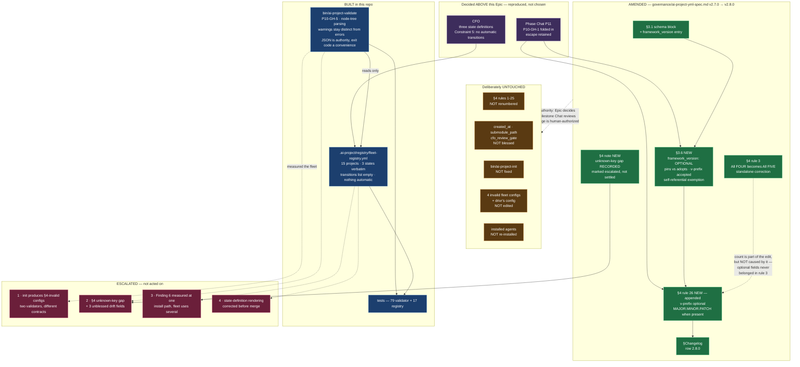

# Delivery Notice: P11-M38-E38.3 — Three-State Fleet Registry, Classification Pass, P10-GH-5 Validator, P10-GH-1 Schema Entry

## Summary

**The fleet is now a data structure.** All 15 project directories carry a classification, §4 is
enforced for the first time since it was written, and `framework_version` has a schema entry.

**And the thing that measures found things that are broken.** Four enrolled configs are §4-invalid;
the framework's own enrollment tool is the direct cause of seven of their eight errors; §4 has no rule
for three fields that live in real configs; and one of this Epic's own inherited measurements was
taken at the wrong layer. **Every one of them was recorded and escalated. None was fixed.** That is
the delivery, not a shortfall in it.

> **`merge_details` is unfillable at issue time** — this notice is produced *before* the PR is merged,
> by the canonical happy path. Known gap **`P10-GH-4`**, restated rather than worked around.

---

## Method statement — read this before any number below (`P11-GH-2`)

**Every measurement in this notice states the repository it was taken in, the date, and the method.**
`P11-GH-2` is verification performed at the wrong layer, and this Epic's own subject is that a count
is only as good as the pattern behind it.

| Layer | What it means here |
|---|---|
| **this repo** | `ai-project-system`, branch `epic/P11-M38-E38.3` |
| **host** | the filesystem at `~/soft-dev`, outside any repository |
| **cross-repo** | another repository on the host; **anchored by sha + date, never undated present tense** |

**The strict form was used wherever a count mattered.** Fleet-level key counts use
`grep -E "^[[:space:]]*<key>[[:space:]]*:"` — a real key at line start, never a naive substring grep.

**The validator does not grep at all.** It parses the document into a YAML **node tree**
(`yaml.compose`), so a key is identified by its **position in the document structure**. That clears
the strict-key-at-line-start bar by being structural rather than textual, and it is what makes §4
rule 5 checkable at all: rule 5 requires a **quoted** semver, and quoting is a fact about the document
that a parsed value has already discarded (`version: "7.1.0"` and `version: 7.1.0` both load as the
string `7.1.0`). `yaml.compose` preserves the scalar's style.

Two tests hold that property directly: `test_key_detection_is_structural_not_textual` (a
`framework_version` in a comment and inside a quoted description is not a key) and
`test_a_key_is_scoped_to_its_own_block` (a `version:` under `project:` is not `governance.version` —
a line-anchored grep cannot tell them apart).

**Cross-repo references, anchored:**

| Reference | Anchor |
|---|---|
| E38.1's merge into `milestone/M38` | `8220d0e3e0397bf6a691b3b3ba92ea2646e27ad6`, committed **2026-08-10** |
| Drivr's HEAD when its config was validated | `31dad512858cdbb4bfb726bd1c07717ee42ba2e1`, **2026-08-11** |
| Drivr's governance submodule pin | `.governance` @ `v7.1.0` (`bb727a5`), read **2026-08-11** |

> *A HEAD reference in this repository describing another repository goes stale the moment that
> repository moves, and nothing here notices.* E38.1's evidence said *"drivr's HEAD is now `b157c28`"*
> and was stale before its own PR merged. Every reference above is written as **"as of `<sha>`, on
> `<date>`"** and is true of that commit, not of that repository.

---

## 1. The enumeration — 17 directories, 15 projects, and the method that separates them

**Layer: host, `~/soft-dev`, 2026-08-11.**

```
find ~/soft-dev -maxdepth 1 -mindepth 1 -type d   ->  17
```

**Two of the 17 are not projects.** `worktree-epic-E38.2` and `worktree-epic-E38.3` are **git
worktrees of `ai-project-system` itself** — confirmed by `git worktree list` and by each holding a
`.git` *file* reading `gitdir: .../ai-project-system/.git/worktrees/...`. They carry a
`.ai-project.yml` only because they are checkouts of this repository.

> **This is a live instance of the trap, not a hypothetical.** The starter's own first-ten-minutes
> command is `for d in */; do f="$d/.ai-project.yml"; [ -f "$f" ] || continue`. Run as given it
> returns **15 configs**, because it counts both worktrees as fleet members. **The inherited figure of
> 13 enrolled is right, and the command that was supposed to produce it is wrong** — they agree only
> because the two worktrees did not exist when the figure was taken. I am one of the two.

**Directories are separated from files by `-type d`.** Three entries in `~/soft-dev` are loose `.md`
files and are excluded: `interview-cheatsheet-telos-technical.md`,
`interview-prep-luflox-rails-ai.md`, `interview-prep-telos.md`.

| | Count |
|---|---|
| Directories found | **17** |
| — excluded as worktrees of this repo | **2** |
| **Project directories** | **15** |
| **Enrolled** (carry `.ai-project.yml`) | **13** |
| — **§4-valid** | **9** |
| — **§4-invalid** | **4** |
| **Unenrolled** | **2** |

**This agrees with the spec's re-measured 15/13/9/4/2.** Every inventory here is a **floor carrying
its date**: `panchew-io` was the third fleet list to prove short, `drivr` made a fourth, and the two
worktrees make a fifth.

**One thing the "2 unenrolled" figure hides, stated rather than left to be rediscovered:**
`ai-stack/comfyui/.ai-project.yml` **exists** — a nested enrollment one level below the fleet root.
The fleet-level enumeration counts immediate subdirectories and should; but "2 unenrolled" must not be
read as "2 projects governance has never touched." Recorded in the registry.

---

## 2. Every project directory, classified

**All 15 carry a classification. `panchew-io`, `fieldledger-assesment` and `drivr` are named
explicitly, as required.** Full detail — rationale, §4 result, framework version and its source,
governance pin, last commit, installed-agent state — is in
`.ai-project/registry/fleet-registry.yml`.

| Project | State | Basis | Enrolled | §4 |
|---|---|---|---|---|
| `ai-project-system` | **active** | recorded | yes | valid |
| `drivr` | **active** | recorded | yes | **valid** |
| `local-agent-runner` | **active** | recorded | yes | valid |
| `ai-project-system-mcp` | **active** | recorded | yes | **invalid** |
| **`panchew-io`** | **active** | *proposed* | yes | valid |
| `social-stories-creator` | **active** | *proposed* | yes | **invalid** |
| `home_finance` | **benched** | *proposed* | yes | **invalid** |
| `courtis` | **benched** | *proposed* | yes | **invalid** |
| `footboard` | **benched** | *proposed* | yes | valid |
| `Getawayinsured2023` | **benched** | *proposed* | yes | valid |
| `voicebox` | **benched** | *proposed* | yes | valid |
| `personal-management-system` | **benched** | *proposed* | yes | valid |
| **`fieldledger-assesment`** | **benched** | *proposed* | yes | valid |
| `ai-stack` | **benched** | *proposed* | **no** | n/a |
| `character-factory` | **benched** | *proposed* | **no** | n/a |

**Four classifications are `recorded`** — traceable to a decision already in the record: this
repository is P11's own working repository; `drivr` is P11's subject; and `local-agent-runner` and
`ai-project-system-mcp` are two of the four projects the Creation Chat named as the ecosystem on
2026-07-28. **The other eleven are `proposed`, and say so in their own rationale.** The CFO owns the
fleet's attention; a registry that quietly guesses is worse than one with a stated unknown.

### The rule the proposals follow, and the consequence of it

**Where the record is silent, the registry proposes the weaker claim.** `benched` asserts only an
observation — *"not currently receiving attention."* `archived` asserts an **intent** — *"not planned
to ever be touched again"* — that only the CFO can hold.

**Consequence, stated rather than hidden: zero projects are classified `archived`. The state exists
and is currently unused.**

**`fieldledger-assesment` is where that pinches hardest, and it is the entry most likely to move on a
CFO ruling.** A completed take-home assessment, dropped from P10's scope by direct CFO instruction as
a screening project. `archived` is very likely the right answer. It is **not** proposed, for two
reasons: **dropping from a phase's scope is explicitly not a registry state**, so the drop cannot be
mapped mechanically onto `archived`; and the record contains no statement of the intent `archived`
asserts. **`character-factory` is the second most likely to move** — six weeks idle, unenrolled, named
in no P10 or P11 artifact, and intent unrecorded either way.

### `ai-stack` and `character-factory` — resolved as a side effect

Both were resolved **by being classified**, which is the Epic's spine: building the registry forces
the classification pass, so they resolve as registry work rather than as a separate decision anyone
had to remember to make. **Enrollment is not a registry state**, so being unenrolled did not exempt
either of them.

**One tension in `ai-stack` is worth stating rather than averaging away.** As a *project* it receives
no development attention and is not under git at its root. As *infrastructure* its `ollama/`
component is load-bearing and in daily use — it is the local inference runtime every `local:` model
route on the machine points at. **"Benched" describes the development attention, not the runtime
dependency**, and whether infrastructure belongs in a registry of projects at all is a question for
the CFO.

---

## 3. The three states — the CFO's definitions, verbatim

| State | Definition |
|---|---|
| **Active** | Enrolled in the registry. Receives time and attention. |
| **Benched** | Not currently receiving attention. May return. |
| **Archived** | Not planned to ever be touched again — though it can be brought back to life. |

**`tests/test_fleet_registry.py::test_the_three_state_definitions_are_the_cfos_verbatim` holds these
strings**, so a reword in either the registry or the test fails loudly instead of drifting.

> **⚠ Resolved citation history.** On this Epic's execution branch, the Epic Spec carried the exact
> table above while the **Epic Execution Chat Starter** claimed verbatim reproduction over a compressed
> paraphrase. The registry selected the exact table and reported the discrepancy rather than silently
> smoothing it. Before merge, the Milestone Chat corrected the Starter in `milestone/M38` commit
> `e9ab7d5` (2026-08-11); both governing documents now carry the same exact CFO strings. The finding is
> retained as point-in-time evidence, not as a present conflict.

### Transitions are a recorded human action. Nothing automatic exists.

**Confirmed explicitly.** `transitions: []` in the registry, with a documented by-hand schema
(project / from / to / date / by / why). **Nothing observes the fleet and moves a project on its own
— not on a timer, not on a git event, not on inactivity.** No scheduler, hook, or derived queue reads
or writes that list.

The initial classifications are **not** transitions: they are the registry's first state, and the
eleven `proposed` ones are not decisions at all.

**`test_no_automation_field_exists_anywhere_in_the_registry` walks the whole document** and fails on
any key shaped like automation (`trigger`, `schedule`, `cron`, `on_inactivity`, `poll`, `queue`,
`priority`, …). Constraint 5 is a **returned CFO proposal**, so it is held by a test rather than by an
intention.

---

## 4. The validator — `bin/ai-project-validate` (`P10-GH-5`)

**Layer: this repo, `epic/P11-M38-E38.3`.** First enforcement of `ai-project-yml-spec.md` §4 since it
was written.

**Rules enforced:** 1–8 (file, YAML, the five required fields, the four format constraints), 10–12
(`overrides`), 15–17 (`models`), 19–23 and 25 (`visual_artifacts`), and the new 26
(`framework_version`).

**Rules deliberately not checked are declared, not silently omitted** — the `--json` output carries a
`rules_not_checked` map: **9, 14, 18** ("must be valid YAML", which §4 itself states is covered by
rule 2), **13** ("at least one override value is not required" — a statement of optionality, not a
check), and **24** (an absent `visual_artifacts` block is valid and silent — asserted by reporting
nothing).

### Warnings and errors stay distinguishable — the normative requirement

§4 has both, and they are not interchangeable: rules **11, 16, 22** say unknown keys **MUST produce a
warning (not an error)**; rules **12, 17, 23** say invalid values **MUST produce an error**. **A
validator that collapses them has not enforced §4.**

- Warnings **never** make a config invalid (`test_warnings_alone_never_make_a_config_invalid`).
- Both forms of output carry the severity per finding.
- **Per `G2` — exit codes are untrustworthy in both directions — the `--json` output is the authority
  and the exit code is a convenience.** Documented in the tool and asserted in
  `test_cli_json_output_is_the_authority`.

### Unknown-key treatment — the decision that was mine, and the one that was not

**§4 is silent outside its three optional blocks.** Rules 11/16/22 cover `overrides`, `models` and
`visual_artifacts`. **There is no rule at all for unknown keys at the top level or inside
`governance:` and `project:`** — so error, warn and ignore are equally unsupported by the text.

**Decided (mine): the validator WARNS**, and reports those findings with **`rule: null`** so the
treatment can never be mistaken for §4 enforcement. Reasoning: warning is the only treatment the
document evidences anywhere — all three of its unknown-key rules choose it, for the same stated
purpose (forward compatibility, §3.3 and §3.5) — and warning keeps the drift **visible** without
declaring configs invalid on a rule the spec never wrote.

**Declined (not mine): writing that treatment into §4 as a general rule.** Filling a normative silence
by fiat is a larger change than this Epic was authorized to make. §4 now carries a **note recording
the gap** and pointing at the reference implementation's behaviour, marked escalated rather than
settled.

---

## 5. The full run against the real fleet — raw output

**Command:** `bin/ai-project-validate --fleet ~/soft-dev`
**Layer:** host enumeration, executed from this repo @ `epic/P11-M38-E38.3`
**Date:** 2026-08-11 **Exit code:** `1`

```
VALID    /home/panchew/soft-dev/ai-project-system/.ai-project.yml  —  0 error(s), 1 warning(s)
    [warning] no §4 rule   cfo_review_gate                            (line 19)  Unknown top-level key 'cfo_review_gate'; §4 defines no rule for unknown keys here (schema-drift class, P10-GH-1). Treated as a warning by validator decision.
INVALID  /home/panchew/soft-dev/ai-project-system-mcp/.ai-project.yml  —  1 error(s), 2 warning(s)
    [error  ] rule 3       project.description                        (—)  Required field 'project.description' is absent.
    [warning] no §4 rule   governance.submodule_path                  (line 15)  Unknown key governance.'submodule_path'; §4 defines no rule for unknown keys here (schema-drift class, P10-GH-1). Treated as a warning by validator decision.
    [warning] no §4 rule   project.created_at                         (line 9)  Unknown key project.'created_at'; §4 defines no rule for unknown keys here (schema-drift class, P10-GH-1). Treated as a warning by validator decision.
INVALID  /home/panchew/soft-dev/courtis/.ai-project.yml  —  1 error(s), 2 warning(s)
    [error  ] rule 3       project.description                        (—)  Required field 'project.description' is absent.
    [warning] no §4 rule   governance.submodule_path                  (line 15)  Unknown key governance.'submodule_path'; §4 defines no rule for unknown keys here (schema-drift class, P10-GH-1). Treated as a warning by validator decision.
    [warning] no §4 rule   project.created_at                         (line 9)  Unknown key project.'created_at'; §4 defines no rule for unknown keys here (schema-drift class, P10-GH-1). Treated as a warning by validator decision.
VALID    /home/panchew/soft-dev/drivr/.ai-project.yml  —  0 error(s), 2 warning(s)
    [warning] no §4 rule   governance.submodule_path                  (line 45)  Unknown key governance.'submodule_path'; §4 defines no rule for unknown keys here (schema-drift class, P10-GH-1). Treated as a warning by validator decision.
    [warning] no §4 rule   project.created_at                         (line 18)  Unknown key project.'created_at'; §4 defines no rule for unknown keys here (schema-drift class, P10-GH-1). Treated as a warning by validator decision.
VALID    /home/panchew/soft-dev/fieldledger-assesment/.ai-project.yml  —  0 error(s), 1 warning(s)
    [warning] no §4 rule   cfo_review_gate                            (line 19)  Unknown top-level key 'cfo_review_gate'; §4 defines no rule for unknown keys here (schema-drift class, P10-GH-1). Treated as a warning by validator decision.
VALID    /home/panchew/soft-dev/footboard/.ai-project.yml  —  0 error(s), 0 warning(s)
VALID    /home/panchew/soft-dev/Getawayinsured2023/.ai-project.yml  —  0 error(s), 0 warning(s)
INVALID  /home/panchew/soft-dev/home_finance/.ai-project.yml  —  2 error(s), 2 warning(s)
    [error  ] rule 3       project.description                        (—)  Required field 'project.description' is absent.
    [error  ] rule 7       project.name                               (line 7)  'home_finance' does not match ^[a-z][a-z0-9-]*$ (lowercase slug; no underscores, spaces or capitals).
    [warning] no §4 rule   governance.submodule_path                  (line 14)  Unknown key governance.'submodule_path'; §4 defines no rule for unknown keys here (schema-drift class, P10-GH-1). Treated as a warning by validator decision.
    [warning] no §4 rule   project.created_at                         (line 8)  Unknown key project.'created_at'; §4 defines no rule for unknown keys here (schema-drift class, P10-GH-1). Treated as a warning by validator decision.
VALID    /home/panchew/soft-dev/local-agent-runner/.ai-project.yml  —  0 error(s), 0 warning(s)
VALID    /home/panchew/soft-dev/panchew-io/.ai-project.yml  —  0 error(s), 0 warning(s)
VALID    /home/panchew/soft-dev/personal-management-system/.ai-project.yml  —  0 error(s), 0 warning(s)
INVALID  /home/panchew/soft-dev/social-stories-creator/.ai-project.yml  —  4 error(s), 2 warning(s)
    [error  ] rule 3       governance.ref                             (—)  Required field 'governance.ref' is absent.
    [error  ] rule 3       project.description                        (—)  Required field 'project.description' is absent.
    [error  ] rule 5       governance.version                         (line 7)  Must be a quoted string; unquoted values may load as a non-string YAML scalar.
    [error  ] rule 5       governance.version                         (line 7)  'v7.0.0' is not a bare semver string matching \d+\.\d+\.\d+.
    [warning] no §4 rule   governance.submodule_path                  (line 8)  Unknown key governance.'submodule_path'; §4 defines no rule for unknown keys here (schema-drift class, P10-GH-1). Treated as a warning by validator decision.
    [warning] no §4 rule   project.created_at                         (line 3)  Unknown key project.'created_at'; §4 defines no rule for unknown keys here (schema-drift class, P10-GH-1). Treated as a warning by validator decision.
VALID    /home/panchew/soft-dev/voicebox/.ai-project.yml  —  0 error(s), 0 warning(s)
VALID    /home/panchew/soft-dev/worktree-epic-E38.2/.ai-project.yml  —  0 error(s), 1 warning(s)
    [warning] no §4 rule   cfo_review_gate                            (line 19)  Unknown top-level key 'cfo_review_gate'; §4 defines no rule for unknown keys here (schema-drift class, P10-GH-1). Treated as a warning by validator decision.
VALID    /home/panchew/soft-dev/worktree-epic-E38.3/.ai-project.yml  —  0 error(s), 1 warning(s)
    [warning] no §4 rule   cfo_review_gate                            (line 19)  Unknown top-level key 'cfo_review_gate'; §4 defines no rule for unknown keys here (schema-drift class, P10-GH-1). Treated as a warning by validator decision.

Skipped:
    ai-stack: no .ai-project.yml (not enrolled)
    character-factory: no .ai-project.yml (not enrolled)

15 config(s) checked — 11 valid, 4 invalid; 14 warning(s) total.
```

> **The run's own trailing line says "15 config(s) checked" and it is not the fleet figure.** Two of
> those 15 are this repository's worktrees. **Excluding them: 13 enrolled configs — 9 valid, 4
> invalid, carrying 12 warnings.** The raw run carries **14 warnings** because each of the two excluded
> worktree configs contributes one warning. The tool validates what it is pointed at; separating
> projects from worktrees is the
> registry's job, and the registry states its method. Left visible rather than filtered, because the
> raw output was asked for raw.

### The invalid-config count — dated, anchored, scoped, and reconciled

**4 of 13 enrolled configs are §4-invalid, carrying 8 errors between them. Host, 2026-08-11, strict
form, full §4 including format constraints.**

**Reconciliation against the two figures already in the record. Neither is wrong; all three counted
different things.**

| Figure | Scope | What it counted |
|---|---|---|
| *"3 of 6 invalid at P10 close"* (M38 milestone spec) | **six** projects | a different, smaller fleet — not comparable, not contradicted |
| *"4 of 12 invalid"* (E38.3 spec Finding 3, 2026-08-08) | **twelve** enrolled | required-field **presence only**, before any format constraint |
| **"4 of 13, 8 errors"** (this Epic, 2026-08-11) | **thirteen** enrolled | **full §4** |

**The spec predicted "your number will be higher than four." It is, and it is not.** The number of
invalid **projects** did not move — it is **the same four**. The number of **violations** did:
**presence-only found 5; full §4 found 8.**

**The three additional violations, both of which presence-only checking structurally could not see:**

| Project | New violation | Rule |
|---|---|---|
| `home_finance` | `project.name: home_finance` — the underscore is not admitted by `^[a-z][a-z0-9-]*$` | **7** |
| `social-stories-creator` | `governance.version: v7.0.0` is **unquoted** | **5** |
| `social-stories-creator` | `governance.version: v7.0.0` is **not bare semver** | **5** |

**No project became invalid that was not already invalid on presence alone.**

### The demonstration that it fails on a genuinely invalid config — shown, not asserted

**Two independent demonstrations.**

**(a) On the real fleet, above.** Four real configs fail, with the failing rule, field and line
number for each. `social-stories-creator` produces four distinct errors across two rules.

**(b) In the suite**, host-independently. `test_validator_fails_on_a_genuinely_invalid_config` writes
a fixture reproducing the **shape** of `social-stories-creator`'s real config and asserts it fails on
rules 3 and 5, names `governance.ref` and `project.description`, and surfaces the two drift keys as
**warnings** rather than sweeping them into the error count.

> **It is a fixture, not a copy of the live file.** Reading the live file would make the suite depend
> on one machine's state — and **this Epic does not read enrolled projects into its tests at all**.

`test_presence_alone_understates_invalidity` asserts the 5-vs-8 gap on the same fixture, so the
reconciliation above is held by a test rather than by this paragraph.

### The validator's own tests

**79 tests in `tests/test_ai_project_validate.py`**, plus **16** in `tests/test_fleet_registry.py`.
All run in this repo's suite. No host dependency in either file.

---

## 6. `P10-GH-1` — FOLDED IN, and the escape was genuinely evaluated

**The escape's actual question, answered:** *does the registry read `framework_version` normatively
across the fleet?*

**Yes — and the fold-in proceeds.** The registry must answer *"what framework version has this
project adopted?"*, and `framework_version` is the designated field for it: **7 of 13 enrolled
configs carry it and it appeared 0 times in the spec.** That is undocumented drift in a normative
contract, and a validator meeting the field has to decide something about it.

**The measurement that would have supported taking the escape, reported because it is real:**

| | |
|---|---|
| Configs carrying `framework_version` (host, strict form, 2026-08-11) | **7 of 13** |
| Of those, where it names the **same version** as `governance.version` | **7 of 7** |

**The field is currently 100% redundant with `governance.version` across every config that carries
it.** That is a genuine argument for parking, and it is recorded in §3.6 rather than omitted.

**Why it does not carry the decision:** the redundancy is a property of a fleet that was **stamped and
pinned in the same operation**, not a property of the field's meaning. The two fields answer different
questions — `governance.version` is what a project **pins**, `framework_version` is what it has
**adopted** — and they diverge the moment a submodule pin moves without a re-adoption, or an adoption
completes against a pin that later changes. **That divergence is exactly the drift `P10-GH-1` was
filed to make visible.** §3.6 states that tooling **must not** infer either field from the other.

### What was amended, and the count that was part of the edit

**`governance/ai-project-yml-spec.md` v2.7.0 → v2.8.0** (this repo, `epic/P11-M38-E38.3`).

| Change | Where |
|---|---|
| Header version, effective date, "Introduced In" | top of file |
| `framework_version` added to the schema block | **§3.1** |
| **New §3.6** — full field entry: type, format, constraint, error string, the pins-vs-adopts distinction, the redundancy measurement, why optional, why `v` is accepted, the self-referential exemption | **§3.6** |
| **Rule 3's count corrected: "All four" → "All five"** | **§4 rule 3** |
| **New rule 26** — `framework_version`, when present, non-empty and matching `^v?\d+\.\d+\.\d+$` | **§4** |
| Closing "invalid if" sentence extended | **§4** |
| **New note recording §4's unknown-key gap**, marked escalated not settled | **§4** |
| Changelog row | **§Changelog** |

**Nothing was renumbered.** Rule 26 is **appended**; rules 1–25 keep their numbers, which matters
because other documents cite §4 rules by number.

### Constraint 10 — how the metavariable trap actually fired, and how it was defused

**Finding 1 is real and confirmed by reading:** §4 rule 3 read *"All **four** required fields are
present:"* and then listed **five**. §3.1 marks all five REQUIRED; §3.2 documents all five. **Five is
right; the word was wrong.** It stood from v1.0.0 (2026-04-20) until this row. **Cited by name: "§4
rule 3's four-versus-five."**

**The trap was expected to fire like this:** add `framework_version` to rule 3's list without touching
the number, and ship *"All four required fields"* followed by **six**.

**It did not fire that way, and the reason matters. `framework_version` is OPTIONAL, so it never
belonged in rule 3's list at all.** The correction is therefore **standalone, not a consequence of
the fold-in**: the count moved from a wrong **four** to a right **five** — not to six. The rule that
lists required fields lists five required fields; the new optional field is documented in §3.6 and
constrained by rule 26, where optional fields belong.

**Two guards hold it:** `test_required_fields_are_exactly_five_and_named` asserts the validator's own
list is exactly those five, and `test_framework_version_is_not_a_required_field` asserts the field is
absent from it and that a config without it is clean.

**The changelog row was re-read against Constraint 10 before committing**, and states the standalone
character of the correction explicitly. **Every count in it was re-measured, not carried:** 13
enrolled, 6 unstamped, 7 stamped and all `v`-prefixed, 7-of-7 agreement, 3 unblessed drift fields, and
rules 11/16/22 as the three unknown-key rules.

> **No total for the count-error class is stated here.** Per the milestone spec's v1.1.4 rule,
> instances are cited by **artifact + defect**, never by ordinal, because position shifts whenever
> anyone else increments — two chats have already collided by each correctly adding one to the same
> stale base.

### Two deliberate choices inside the schema entry, both of which avoid a forbidden reconciliation

**1. `framework_version` is OPTIONAL.** At 2026-08-11, **6 of 13** enrolled projects carried no stamp
(`ai-project-system`, `fieldledger-assesment`, `panchew-io`, `personal-management-system`,
`social-stories-creator`, `voicebox`). **Making it required would have declared six otherwise-valid
configs invalid on a rule that did not exist the day before** — a fleet-wide reconciliation, not a
schema entry.

**2. The `v` prefix is accepted** — `^v?\d+\.\d+\.\d+$`, not rule 5's bare-semver form. **All seven
stamps in existence are `v`-prefixed** (`v7.0.0` ×6, `v7.1.0` ×1), because the value records a
released **tag name**. Requiring bare semver would have invalidated **all seven**. The spec records
the convention that exists rather than legislating a new one, and §3.6 says so.

**Both choices are held by `test_rule_26_accepts_the_fleet_stamp_forms`, which parametrises the exact
forms the fleet uses.**

---

## 7. `ai-project-system`'s own case — DECIDED

**Decision: `ai-project-system` does NOT gain a `framework_version`, and this is a documented
exemption rather than missing data.**

**Reasoning.** Under §8's canonical self-referential pattern this repository points
`governance.source` at its own `./governance` and pins `governance.version` to itself — **`"7.1.0"`
as of 2026-08-11, already the current framework version.** For the governance source, the version it
**pins** and the version it has **adopted** are the same number **by construction**, not by
coincidence. A `framework_version` here would record the same fact twice: **structurally redundant,
not missing.**

**This is a stronger claim than the fleet-wide 7-of-7 redundancy in §6, and the two must not be
confused.** The other six agreements are contingent — they hold because those projects were stamped
and pinned in one operation, and they can diverge tomorrow. **This one cannot diverge**, because §8
makes the source's pin a self-reference.

**Made checkable rather than folkloric, in three places:**

1. **`ai-project-yml-spec.md` §3.6** carries a *Self-referential repositories* paragraph stating the
   exemption normatively.
2. **The registry** records `framework_version: null` alongside
   `framework_version_source: governance.version` and a `framework_version_note` giving the reasoning
   — so a reader sees a **decided exemption**, not a blank.
3. **The same registry fields distinguish it from the contingent cases.** `panchew-io` also carries no
   stamp and also has `framework_version_source: governance.version` — but its note says explicitly
   that it is **not** a documented exemption, merely an adopting project whose two versions happen to
   agree.

**A reader can state why `ai-project-system` does not carry a `framework_version`, and see that it was
decided rather than overlooked.**

---

## 8. The schema-drift class (`Finding 4`) — recorded in full, one field blessed, three escalated

**Host, strict form, 2026-08-11, 13 enrolled projects. Spec-occurrence figures: this repo, before
this Epic's amendment.**

| Field | In configs | Occurrences in the yml-spec | Written by `init`? | Disposition |
|---|---|---|---|---|
| **`framework_version`** | **7 of 13** | **0** | no | **BLESSED** — §3.6 + rule 26, optional (`P10-GH-1`, Phase Chat decision) |
| **`created_at`** | **5 of 13** | **0** | **yes** | **NOT blessed.** Warned. **Escalated.** |
| **`submodule_path`** | **5 of 13** | **0** | **yes** | **NOT blessed.** Warned. **Escalated.** |
| **`cfo_review_gate`** | **2 of 13** | **1 — a prose aside in §3.5, never a schema entry** | no | **NOT blessed.** Warned. **Escalated.** |

**The planning figures were 4-of-12 for `created_at` and `submodule_path`; both are now 5-of-13
because Drivr carries them** — deliberately, as E38.1 recorded, on the reasoning that removing them
would be editing around a defect rather than recording it.

**Recommendation — offered as a recommendation, escalated rather than acted on:** `created_at` and
`submodule_path` should be ruled on **together with the `bin/ai-project-init` defect**, because init
writes both and the right resolution may be to **stop writing them** rather than to bless them.
`cfo_review_gate` is a different case — a real, documented capability with prose already in §3.5 and
two live users, reading as a schema entry that was simply never made.

`test_the_three_unblessed_drift_fields_are_not_silently_accepted` asserts all three remain unknown to
the validator, so a later change cannot normalise them away by accident.

---

## 9. `Finding 2` reported — `init` produces §4-invalid configs, and Drivr's state either way

**Filed as Escalation 1 in**
`.ai-project/artifacts/escalation-notices/2026-08-11T00_00_00Z__P11-M38__escalation_notice.md`.
**Confirmed by reading both functions in this repo at `epic/P11-M38-E38.3`, not taken from the spec.**

**`create_ai_project_yml()` (`bin/ai-project-init:249-268`)** writes `project.name`,
`project.created_at`, `governance.source`, `governance.version`, `governance.submodule_path`. **It
does not write `governance.ref` (required, rules 3 and 6) or `project.description` (required, rules 3
and 8).** `created_at` and `submodule_path` appear nowhere in the schema.

**And there are two validators enforcing different contracts.**
**`validate_ai_project_yml_content()` (`bin/ai-project-init:107-115`)** requires `project`,
`governance`, `name`, `created_at`, `source`, `version`. **It enforces `created_at`, which the schema
does not define, and does not enforce `ref` or `description`, which the schema requires. The contract
that is written down is not the one enforced.**

**This is not latent. It is the direct cause of 7 of the fleet's 8 §4 errors.** All four invalid
configs are init-created; `social-stories-creator`'s two rule-5 errors are init's too, by a mechanism
worth naming: **init takes a single `--governance-version` argument and feeds it to both
`governance.version` and the submodule git ref** — two things the schema deliberately separates. A tag
name is correct for the ref and wrong for the version.

### Drivr's resulting config state — verified against the repository as it actually landed

**`drivr` is §4-VALID. 0 errors, 2 warnings.** Verified by running the validator against
`~/soft-dev/drivr/.ai-project.yml` at Drivr HEAD
**`31dad512858cdbb4bfb726bd1c07717ee42ba2e1`, 2026-08-11**.

**Finding 2's collision resolved the good way.** E38.1's spec was amended to v1.1.0 on this very
finding and required all four post-init additions plus one correction and a §4 self-check; **E38.1
delivered them** (merged `8220d0e3e0397bf6a691b3b3ba92ea2646e27ad6`, 2026-08-10). **That was verified
by running the validator, not by reading E38.1's spec — an amended spec is an instruction, not
evidence that the instruction was followed.**

**Its two warnings are `governance.submodule_path` and `project.created_at`** — the two init-written
schema-drift fields E38.1 deliberately left in place to record rather than edit around. **The
validator agrees with that judgment: they are warnings, not errors.**

> **Drivr's config was NOT edited.** Not to make the validator pass, not for anything. It passed on
> its own.

**The tool that created it is still broken.** The next project enrolled through `bin/ai-project-init`
will be born §4-invalid the same way.

---

## 10. Confirmations required by the Definition of Done

### NO enrolled project was modified

**Confirmed explicitly.** Every change in this delivery is inside `ai-project-system` on
`epic/P11-M38-E38.3`.

- **The four §4-invalid configs** — `ai-project-system-mcp`, `courtis`, `home_finance`,
  `social-stories-creator` — **were read and not written.**
- **`bin/ai-project-init` was NOT fixed.** Recorded and escalated.
- **Drivr's config was NOT edited.**
- **No agent was re-installed** — `social-stories-creator` still carries the 230 B stub.
- **`fieldledger-assesment` was not touched**, and is still pinned at v5.1.0.
- **The fleet's `framework_version` values were NOT reconciled.** Drivr at `v7.1.0`, six at `v7.0.0`,
  six absent — **that is the true state of the fleet.** Recorded, not smoothed.
- **The validator has no write path at all.** It reads, and reports.

### Nothing was renumbered, renamed, or moved

**Confirmed explicitly.** No §4 rule renumbered (26 is appended). No section renumbered (§3.6 is
appended after §3.5). No artifact renamed or moved. No project directory renamed — including
`home_finance`, whose **rule 7 violation is a rename with consequences well beyond a config edit**.
*The record names the disposition; the identifier names the origin.*

### No scheduler, gate queue, thin surface, or completion judgment was built

**Confirmed explicitly.** No adapter or adapter surface (E38.2, parallel). No scheduler. No derived
gate queue (**M40**). No thin surface. No completion judgment (**M39**). No inference, model loop, or
agent client (Constraint 1) — **the validator's only third-party dependency is PyYAML, already a
dependency of this repo's suite.** No fleet-state transition automated, on a timer, a git event, or
inactivity. `local-agent-runner` was not assessed, milestone-context was not measured, and the
local/paid comparison was not run (E38.4/E38.5/E38.6, all behind E38.2's gate).

**The registry RECORDS state. It does not ACT on state.** Held by
`test_no_automation_field_exists_anywhere_in_the_registry`.

---

## 11. Things noticed and deliberately left — named individually

**Ten. Each was within reach and each was left.**

| # | Noticed | Disposition |
|---|---|---|
| 1 | `ai-project-system-mcp` missing `project.description` | **Left.** Not this Epic's to edit. |
| 2 | `courtis` missing `project.description` | **Left.** |
| 3 | `home_finance` missing `project.description` | **Left.** |
| 4 | `home_finance`'s `project.name` fails rule 7 (underscore) | **Left.** A rename, not a config edit. Escalated. |
| 5 | `social-stories-creator` missing `governance.ref` **and** `project.description`, with `governance.version` unquoted and v-prefixed | **Left.** Four errors, all init's. |
| 6 | `bin/ai-project-init` writes neither `ref` nor `description` | **Left.** Escalation 1. |
| 7 | init's internal validator enforces a different contract than the schema | **Left.** Escalation 1. |
| 8 | `created_at`, `submodule_path`, `cfo_review_gate` undefined in the schema | **Left unblessed.** Recommended + escalated. Escalation 2. |
| 9 | `social-stories-creator` carries the 230 B stub agent (FM 12, live) | **Left.** Not re-installed. |
| 10 | `fieldledger-assesment` pinned at v5.1.0 while the fleet sits at v7.0.0/v7.1.0 | **Left.** Not rolled forward. |

**Four more noticed, and left, that no instruction named:**

| # | Noticed | Disposition |
|---|---|---|
| 11 | **`personal-management-system` has no vendored governance at all** — no `.gitmodules`, no `.governance/`, no `governance/`. Its config declares `ref: v7.0.0` but nothing on disk resolves it, so **its declared version cannot be confirmed locally the way every other project's can.** §4 does not require the source to be fetched (rule 4 constrains the value's *form* only), so it is validly §4-valid while its pin is unverifiable. | **Left.** Recorded in the registry. |
| 12 | **`footboard` carries a stale 14,352 B agent at `.github/agents/`** alongside the current 14,711 B copies — a leftover from the pre-E25.3 install path. | **Left.** Recorded. |
| 13 | **`ai-stack/comfyui/.ai-project.yml` exists** — a nested enrollment the fleet-level count does not see. | **Left.** Recorded, and the count's method stated so it is not read as "never touched." |
| 14 | **At execution time, the two governing documents rendered the CFO's state definitions differently** while both claimed verbatim. | **Resolved before merge.** The Milestone Chat corrected the Starter in `e9ab7d5`; the finding remains as dated evidence. |

### One enforcement guard declined, on this milestone's precedent

**A test asserting that `governance/ai-project-yml-spec.md` §4 rule 3 says "five" and lists five
would have prevented the four-versus-five defect from ever recurring**, and it was within reach — the
parsing is three lines.

**Declined.** It is a **new enforcement mechanism over the governance corpus**, which is precisely
what **E37.2 held the line on** when its own sweep suggested one, and what **E36.4** declined when it
would not promote a verification command into a committed test. **A validator that reports failures it
could have fixed looks incomplete; it is not.** The same logic applies to guards it could have built.

**What was built instead is narrower and inside this Epic's own scope:**
`test_required_fields_are_exactly_five_and_named` asserts the **validator's** list, not the
**document's** text. It guards my code against drift without appointing this Epic as an enforcer of
the corpus.

---

## 12. Suite — re-measured, with the exact command

**Layer: this repo, `epic/P11-M38-E38.3`.**

```
PYTHONPATH=. pytest -q
```

> **The invocation is not obvious and the note is kept:** `python` is not on PATH, `.venv` has no
> pytest, and bare `pytest` fails with 3 collection errors (`ModuleNotFoundError: No module named
> 'lib'`). `python3 -m pytest -q` also works.

| Run | Date | Result | Notes |
|---|---|---|---|
| **Run 1** | 2026-08-11 | **472 passed**, 0 failed, 0 skipped, 0 xfailed | after the validator + its 79 tests |
| **Run 2** | 2026-08-11 | **488 passed**, 0 failed, 0 skipped, 0 xfailed | after the registry + its 16 tests |
| **Run 3** | 2026-08-11 | **488 passed**, 0 failed, 0 skipped, 0 xfailed | immediately before commit, on **the delivered state** |
| **Run 4** | 2026-08-12 | **489 passed**, 0 failed, 0 skipped, 0 xfailed | scoped Stage-2 rework: one new registry invariant derives 12 fleet warnings and keeps them distinct from the raw run's 14 |

**Baseline reconciliation:** the accepted delivery was 393 inherited + 79 validator tests + 16
registry tests = **488**. The review-required raw-vs-fleet warning invariant adds exactly one registry
test, yielding **489**. No implementation test or previously accepted assertion changed.
**No regressions, no new skips, no new xfails, and no new warnings** — the module-loading helper uses
the repo's existing `spec_from_loader` pattern rather than the deprecated `load_module()`, precisely
so the suite gains no warning.

### `P10-GH-10` — both results recorded

**`tests/test_artifact_router.py::test_daemon_extensions_error_branches` did NOT fail in any of the
three full-suite runs.** All three were green. **It was not fixed, skipped, or marked**, and nothing
in this delivery touches it. Recorded as required — the observation is *three full-suite runs, zero
occurrences*. At the known ~30% rate that outcome has roughly a 1-in-3 chance of arising by luck, so
**it is not evidence that the flake is gone**, and the next reader should still re-run before
concluding anything from a red suite.

---

## 13. Structural diagram — Constraint 9 FIRED

**`governance/ai-project-yml-spec.md` was amended, so the constraint fires and the diagram is owed.**
Structural only (Mermaid, fenced, in-repo). **No ComfyUI endpoint and no `visual_artifacts`
configuration is involved** (AOG §17.3/§17.8).



---

## 14. Definition of Done

| DoD item | Status |
|---|---|
| All project directories classified, `panchew-io` / `fieldledger-assesment` / `drivr` included, enumeration method stated | ✅ §1, §2 |
| Three states match the CFO's definitions verbatim | ✅ §3 (+ execution-time discrepancy recorded as resolved history) |
| Transitions are a recorded human action; nothing automatic — stated explicitly | ✅ §3 |
| Validator in `bin/` enforcing §4, run against the real fleet, results recorded, warnings/errors distinguishable | ✅ §4, §5 |
| Validator uses the strict key-at-line-start form, never a naive substring grep | ✅ §Method — **structural node-tree parsing, a superset** |
| Validator demonstrably fails on a genuinely invalid config — shown | ✅ §5 (two demonstrations) |
| Validator and registry carry their own tests, running in this repo's suite | ✅ 79 + 17 |
| `P10-GH-1` folded in or parked with the reason — never silence | ✅ **FOLDED IN**, §6 |
| Rule 3's "four" corrected in the same edit; version bumped; changelog row added | ✅ §6 |
| `ai-project-system`'s own omission decided and recorded | ✅ §7 |
| Schema-drift class recorded — all four fields, counts and spec-occurrence figures | ✅ §8 |
| Finding 2 reported, with Drivr's config state stated | ✅ §9 + Escalation Notice |
| NO enrolled project modified — including the four invalid configs, `init`, Drivr | ✅ §10 |
| No adapter, scheduler, gate queue, thin surface, or completion judgment built | ✅ §10 |
| Nothing renumbered, renamed, or moved | ✅ §10 |
| Every cross-repo HEAD/commit reference carries a date or commit anchor | ✅ §Method |
| Structural diagram, since `governance/` was amended | ✅ §13 |
| Things noticed and deliberately left, named individually | ✅ §11 (fourteen + one declined guard) |
| Suite green, exact command stated, `P10-GH-10` recorded with both results | ✅ §12 — **489 passed** (accepted 488 + one review-required invariant) |
| Delivery Notice produced and committed; PR opened to `milestone/M38` | ✅ |

---

## 15. Acceptance Criteria

| Criterion | Met by |
|---|---|
| A reader can determine any project's fleet state from the registry alone | `.ai-project/registry/fleet-registry.yml` — one entry per project, state + basis + rationale, with the state definitions in the same file |
| The validator fails on a genuinely invalid config — demonstrated, not asserted | §5: four real configs with rule/field/line, plus a suite test on a fixture of the same shape |
| `ai-stack` and `character-factory` resolved as a side effect of classification | §2 — both classified by the pass; enrollment is not a state, so neither was exempt |
| A reader can state why `ai-project-system` does or does not carry a `framework_version`, and see it was decided | §7 — spec §3.6, plus `framework_version_source` + `framework_version_note` in the registry, distinguished from the contingent cases |
| A reader can see which fleet configs are invalid and why, without running anything | The registry's `section_4_errors` per project, and §5's committed raw output |

---

## Exit

**Epic E38.3 execution complete. Epic Delivery Notice produced. Awaiting Milestone Chat review and
merge authorization.**

**Not merged. Acceptance not inferred.**
