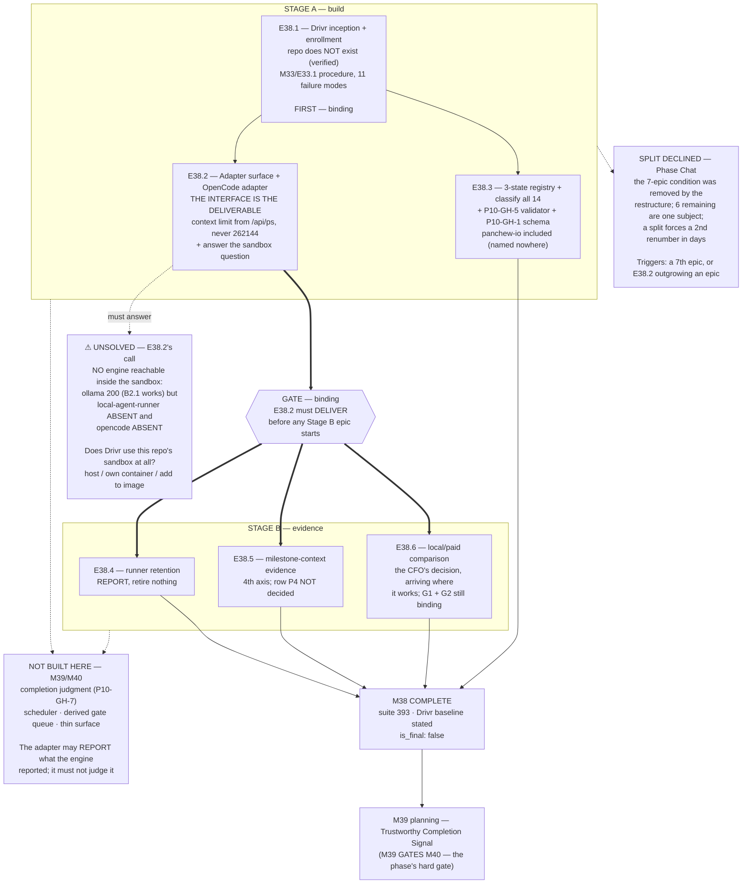

# Milestone M38 — Drivr Inception, Fleet Registry, and the Execution Adapter Surface

## Purpose

**Drivr exists** as a governed repository, holds a **three-state registry** over every project on the
machine, and **invokes one CLI engine through an interface a second engine could be dropped into.**

This is the milestone the phase is named for. M36 and M37 made the record trustworthy; M38 builds the
thing that reads it.

This milestone ensures:
- **Drivr is a real, enrolled, governed repository** — it does not exist today (E38.1).
- **Execution is a pluggable adapter surface**, with OpenCode as its first implementation and the
  interface as the actual deliverable (E38.2).
- **The fleet is a data structure, not a memory** — every project on the machine classified
  active / benched / archived, with `ai-project-yml-spec.md` §4 finally enforced (E38.3).
- **Three open questions get evidence rather than assumption** — `local-agent-runner`'s retention,
  `qwen3-coder:30b`'s milestone-context capacity, and the local/paid comparison the CFO asked for
  (E38.4, E38.5, E38.6).

**M38 is not P11's final milestone** (`is_final: false`). On its closure the Phase Chat proceeds to
**M39 planning** — Trustworthy Completion Signal — per the binding order M36 → M37 → M38 → M39 → M40.
**M39 gates M40, and that gate is the phase's hard one.**

---

## Split decision — NOT SPLIT. Phase Chat call, with the reasoning and a revisit trigger.

The 2026-08-05 HQ Ruling upgraded the Phase Chat's permission to split this milestone from *permitted*
to **recommended**, and the 2026-08-06 ruling confirmed the permission now attaches here. **I am not
taking it.** Recorded prominently because declining a standing recommendation needs its reasons visible.

**1. The condition the recommendation addressed has already been removed.** It was issued when this
milestone carried **seven** epics, *"four of them carry-forward hygiene HQ routed there one ruling at a
time"* — the *"milestone with room"* becoming *"the milestone things get put in."* **The restructure
removed exactly those items**: the versioning convention and the citation forms became M37. What
remains is six epics, and **every one of them is Drivr or the engine Drivr rents.** That is a coherent
subject, not an accumulation.

**2. A split forces a second renumber of M39 and M40 within days of the first.** The 2026-08-05
restructure already shifted three milestones and their epic IDs, and the mapping is now recorded in the
phase spec's changelog, in two rulings, and in M36's Closure Declaration. **A phase that has spent
three milestones on citation and identifier integrity should not churn identifiers again for a
structural benefit it can obtain another way** — and this phase's own rule (*the identifier names
position/origin; a bookkeeping defect never rewrites a citation*) argues against it.

**3. The discipline a split would enforce is available without one**, as the binding internal gate
below. What a split buys is *"the evidence epics cannot start before the build epics deliver."* That is
a sequencing constraint, and sequencing constraints do not require a milestone boundary.

**Revisit trigger — I will split, or escalate for a split, if either fires:**
- **A seventh epic is proposed for M38.** The fence that protected M36 and M37 protects this milestone
  too: adding to it requires a ruling, not a passing judgment.
- **E38.2 proves large enough to warrant its own milestone.** It is the phase's load-bearing interface
  and carries the milestone's one genuinely unsolved design question (below). If it cannot be delivered
  as one epic, that is a structural fact and not a scoping preference.

---

## ⚠ Where M38's work lands — mostly OUTSIDE this repository

**This is the sharpest contrast with M36 and M37, and every epic spec must reflect it.**

M36 and M37 were entirely in-repo: they amended this framework's own corpus. **M38 is the opposite.**
Its principal deliverable is **Drivr — a repository that does not exist** (verified `~/soft-dev`,
2026-08-07: 14 project directories, no `drivr`).

| Lands in | What |
|---|---|
| **Drivr** (to be created) | the adapter surface, the OpenCode adapter, the registry implementation, the coordination code |
| **This repository** | the **governance record** — epic specs, starters, delivery notices, closure artifacts, captured evidence; **plus** `ai-project-yml-spec.md` schema work if P10-GH-1 folds in, and P10-GH-5's validator in `bin/` |
| **Other fleet projects** | nothing is modified. E38.3 *classifies*; it does not edit enrolled projects |

**Two consequences that must not be discovered late:**
- **"Full suite green" means this repo's suite.** Drivr will have its own tests, and its own baseline is
  established by E38.1, not inherited from here.
- **A cross-repo delivery cannot be verified by reading this repo.** Every claim about Drivr's state
  requires evidence captured *from Drivr* and committed here — the M33/M34 pattern.

---

## Binding internal gate — Stage A before Stage B

**In place of a split.** Binding on the Milestone Chat and on every epic.

```
STAGE A — build          E38.1  Drivr inception + enrollment          [FIRST, binding]
                            ├─→ E38.2  adapter surface + OpenCode adapter
                            └─→ E38.3  three-state registry + P10-GH-5 validator
                                       (E38.2 ∥ E38.3 — parallel, no dependency)

        ══════ GATE: E38.2 must DELIVER before any Stage B epic starts ══════

STAGE B — evidence       E38.4  local-agent-runner retention assessment
                         E38.5  milestone-context evidence (qwen3-coder:30b)
                         E38.6  local/paid controlled comparison
```

**E38.1 is first and that is binding** — everything else needs the repository to exist.

**The gate is binding, and here is why it is not bureaucracy.** All three Stage B epics are evidence
*about an engine invoked through an adapter*:
- **E38.4** asks whether OpenCode's `serve` mode covers two capabilities `local-agent-runner` provides.
  Answerable only against a real adapter; a memo about what `serve` probably does is not an assessment.
- **E38.5** needs a way to run milestone-scale work through the engine at all.
- **E38.6** is *stated in the phase spec* as depending on the adapter surface existing.

**Starting any of them before E38.2 delivers reproduces M37's failure exactly**: an evidence epic
planned against a dispatch path that turns out not to work, discovering it at execution time. **M37 cost
one escalation, one HQ ruling, three spec revisions and a posture round-trip to learn that. Do not pay
it twice.**

---

## ⚠ The milestone's one unsolved design question — read before planning E38.2

**Verified at planning time, 2026-08-07, at the layer that matters (inside the container, not the host):**

| Fact | Measured |
|---|---|
| Sandbox → ollama, via B2.1's forwarded gateway | **HTTP 200** ✅ B2.1 works end-to-end |
| `local-agent-runner` inside the sandbox image | **ABSENT** (Route B.2 declined, by decision) |
| **`opencode` inside the sandbox image** | **ABSENT** |
| `opencode` on the host | `/home/panchew/.opencode/bin/opencode`, **v1.18.10** — outside any project mount |

> **B2.1 removed the blocker that fired *first*. It did not make any engine reachable.** Its own
> post-mortem says so: *"This does not make E37.1 dispatchable — `local-agent-runner` is still absent
> from the image."* **And swapping engines does not fix it:** OpenCode is absent from the same image.
> **Same wall, different binary.**
>
> **So: no engine is reachable from inside this repository's sandbox, and E38.2 cannot dispatch through
> it as it stands.**

**This is E38.2's load-bearing design question, and it is genuinely open:**

> **Does Drivr execute through *this* repository's `bin/ai-project-orchestrator` sandbox at all?**

**It is not obvious that it should.** Drivr is a **separate repository** and a **coordination daemon**
(SN-27): it invokes CLI tools that own the inference and spends its budget on coordination over
governance state. Nothing in the spine requires it to borrow this repo's sandbox. Admissible directions,
none preferred here:

- **Drivr runs on the host** and invokes OpenCode directly — lightest, matching *"as agentic as we can →
  lightest infrastructure,"* but gives up sandbox isolation and must say so explicitly.
- **Drivr owns its own container** with OpenCode installed — preserves isolation; Drivr's own
  infrastructure, not this repo's.
- **This repo's sandbox gains OpenCode** — smallest change here, but couples Drivr's execution to this
  repository's image and re-opens the Route B.2 shape one engine over.

**This is E38.2's decision to make, document, and proceed on — NOT an escalation.** What is **binding**
is that **the epic states which direction it took and why, and demonstrates an engine actually invoked
end-to-end.** An adapter surface that has never invoked a real engine is a design document, not a
deliverable.

**If the answer costs more than E38.2 can hold, that is the split trigger firing** — escalate, do not
absorb.

---

## Verified at planning time — measured on `phase/P11`, not inherited

Per `P11-GH-2` and the practice ratified 2026-08-06, each row states **where** it was measured. The
three-axis rule applies to every claim in this spec: **a verification is not evidence if the layer,
the time, or the scope it was taken at differs from the one it is cited for.**

| Fact | Measured | Layer / time |
|---|---|---|
| Suite | **393 passed / 0 failed / 0 skipped / 0 xfailed** | this repo, `phase/P11`, 2026-08-07 — **B2.1 added 16 tests; the 377 figure in M37's artifacts is now stale** |
| `~/soft-dev` project **directories** | **14** (of 17 entries — three are loose `.md` files, not projects) | host filesystem |
| Enrolled (carry `.ai-project.yml`) | **12 of 14** | host filesystem |
| **Not** enrolled | **`ai-stack`, `character-factory`** — exactly the two the phase spec expects the classification pass to resolve | host filesystem |
| Enrolled but **missing `framework_version`** | **6 of 12** — `ai-project-system`, `fieldledger-assesment`, `panchew-io`, `personal-management-system`, `social-stories-creator`, `voicebox` | host filesystem |
| Sandbox → ollama / runner / opencode | **200 / ABSENT / ABSENT** | **inside the container** |
| `drivr` exists | **No** | host filesystem |

> **Finding 1 — `panchew-io` is enrolled and is named in no phase artifact.** Verified: it carries an
> `.ai-project.yml` and a `grep` across `docs/` and `.ai-project/` returns **nothing**. It is a
> **fourteenth** project, and worse than P10's three unlisted ones — those were unenrolled and merely
> absent from a list; **this one is inside the governance system and invisible to the record.** E38.3's
> classification pass must cover it, and the phase spec's project list is a **floor, not an inventory.**

> **Finding 2 — half the enrolled fleet is silent on `framework_version`.** Six of twelve, including
> **this repository itself.** This is directly load-bearing for **P10-GH-1** (see the fold-in decision
> below), and for **P10-GH-5**: a validator built over `ai-project-yml-spec.md` §4 will meet six configs
> that omit a field the spec never defined. **`ai-project-system`'s own omission may be correct by
> design** — it is the governance *source*, not an adopting project — and E38.3 must decide that
> deliberately rather than treat it as a defect or silently exempt it.

---

## P10-GH-1 — FOLD IN. Phase Chat decision (the phase spec assigns it to me).

The phase spec makes this *"a conditional fold-in to M38, at the Phase Chat's judgment: if the registry
reads `framework_version` normatively, schema-bless it in the same pass. If it does not, leave it
parked."*

**Decision: fold it in.** `framework_version` gains a definition in `ai-project-yml-spec.md`'s schema,
in the same pass as P10-GH-5's validator.

**Reasoning.** E38.3 builds (a) a registry Drivr reads to decide fleet state and (b) **a validator over
`ai-project-yml-spec.md` §4**. Building a validator over a config file while leaving a
widely-used-but-undefined field out of the schema is **the same defect class this phase has now closed
three times**: a normative artefact pinned to something it does not control. Finding 2 makes it
concrete — **six of twelve enrolled configs omit the field**, and without a schema entry the validator
cannot say whether that is legal.

**The escape, stated so this is a decision and not an assumption:** if E38.3 finds the registry
genuinely does **not** read `framework_version` normatively, it **reports that and P10-GH-1 stays
parked** — the fold-in is not retained for its own sake. Either way **E38.3 records which**, and a
silent omission is not an acceptable outcome.

---

## Binding Constraints (settled — NOT for re-debate)

**1. Drivr rents both halves.** It implements **no inference, owns no model loop, grows no engine, and
builds no agent client.** SN-27's spine, stated as an exclusion so it cannot erode by increment. An
epic that starts writing a model loop has left the phase, not just the milestone.

**2. The interface is the deliverable; the roster is configuration.** E38.2 is successful only if **a
second adapter could be added without touching the coordination layer** — *demonstrated by the
interface, not asserted.* Today's roster is **one tool: OpenCode** (A1.1).

**3. Derive the declared context limit from what `/api/ps` reports as LOADED**, never from the model's
trained maximum. `opencode.json` declares `"context": 262144` for `qwen3-coder:30b` against **32,768**
actually loaded — an **8× overpack** that makes long sessions truncate silently. Ollama measured at
**0.30.0**; the `/v1` endpoint **silently ignores `options`**, so the adapter cannot set the loaded
context through that transport and does not need to. Full measured note: phase spec §P11.3.

**4. The registry has three states, and the definitions are the CFO's:** **active** (enrolled; receives
time and attention), **benched** (not currently receiving attention; may return), **archived** (not
planned to ever be touched again, though it can be brought back). **Dropping from a phase's scope is
not a registry state** — `fieldledger-assesment` was dropped from P10 by CFO instruction and still needs
classifying.

**5. Drivr does NOT execute fleet-state transitions.** A returned CFO proposal, therefore **not
assumed**: M38 builds transitions as a **recorded human action**. Nothing automatic. If the CFO rules
otherwise mid-milestone, that is an amendment, not an epic's discretion.

**6. E38.4 reports; it does not retire.** Against the CFO's bar if one arrives; otherwise test the two
named candidate capabilities — the **library entry point** (`run(task, tools, model)` with in-process
tool handlers) and **JSON-schema argument coercion** for models that mistype tool arguments — against
OpenCode's `serve` mode, and **report without retiring anything.** P9/P10's local-inference evidence
stands whatever happens to the engine that produced it; **retirement is not a judgment on the work.**

**7. E38.5 produces evidence and decides nothing.** Milestone-context capacity is a **fourth axis**
beside `model-routing-policy.md` row P4's G-P4-a/b/c. **Row P4's 2026-07-31 ruling is not reopened and
M38 does not decide it.** A further HQ call decides the row on this evidence.

**8. G11 is not closed by this milestone** unless an epic captures a real `epic_qa` run and says so
explicitly. `epic_qa` had no dispatch mechanism as of M37. **Closing G11 is M39's**, and M38 must not
claim it in passing.

**9. Every delivery that amends a normative document in this repository carries a Structural diagram**
(Mermaid, fenced, in-repo, **no ComfyUI**) per `governance/systems/hq-chat.md`. This fires for P10-GH-1's
schema work and for any `governance/` amendment; it does **not** fire for Drivr-side code.

**10. The metavariable constraint (M37 Finding 3) binds any epic that writes a rule.** *Any document
that records having fixed a citation defect is liable to restate the defect while doing so* — it fired
twice in M37, the second time in an ordinary changelog row. Relevant here to P10-GH-1's schema text and
any registry documentation that quotes identifier forms.

---

## Problem Statement

**P10 proved the framework works in the wild and left the CFO as the operator.** The lane is hand-run,
the gate list is whatever the human remembers, and M35's handback obligation has no detector beneath it.
**M38 builds the thing that holds the framework's hands** — or rather, the first third of it: the
repository, the engine seam, and the fleet as data.

**Four concrete gaps:**

1. **Drivr does not exist.** Verified `~/soft-dev`, 2026-08-07. Everything downstream in this phase —
   the completion signal (M39), the scheduler and derived gate queue (M40) — has nowhere to live until
   E38.1 lands.
2. **Execution is hard-wired to one engine that is under retirement assessment.** `bin/run-dev-agent`'s
   `discover_runner()` hard-codes `local-agent-runner`, the engine **A1.1 replaced with OpenCode** and
   **A1.2 put under directed retirement assessment**. There is no adapter surface, and **no engine is
   reachable from inside the sandbox** (verified above).
3. **The fleet is a memory, not a data structure.** Fourteen project directories, twelve enrolled, two
   unenrolled, **one enrolled project named in no phase artifact at all**, and six enrolled configs
   silent on `framework_version`. P10 carried `ai-stack` and `character-factory` forward as unresolved;
   the classification pass resolves them as registry work rather than as a separate decision.
4. **`ai-project-yml-spec.md` §4's validation rules are normative and unenforced** (P10-GH-5). No
   validator exists in `bin/`, and **3 of 6 enrolled configs were invalid by P10 close.** A registry
   built over configs that degrade quietly is the same defect class as a scheduler built over an
   untrustworthy exit code.

---

## Goals

By the end of this milestone:

1. **Drivr exists, is enrolled under this framework, and is governed** — using M33/E33.1's
   enrolled-project procedure and its **11 recorded failure modes** (E38.1).
2. **Execution is a pluggable adapter surface with one working implementation**, and a second adapter
   could be added without touching coordination — **shown by the interface** (E38.2).
3. **An engine is actually invoked end-to-end**, with the sandbox question answered and recorded
   (E38.2).
4. **Every project on the machine carries a registry classification**, and
   `ai-project-yml-spec.md` §4 is **enforced by a validator** (E38.3, P10-GH-5, P10-GH-1).
5. **`local-agent-runner`'s retention has an evidence-based answer** — kept for a named capability
   OpenCode does not provide, or reported as retirable — **without anything being retired** (E38.4).
6. **Milestone-context capacity is measured** as a fourth axis, **without row P4 being decided** (E38.5).
7. **The CFO's local/paid controlled comparison is run and recorded**, native at last (E38.6).

---

## Non-Goals

This milestone explicitly does **not**:

- **Build an inference engine, a model loop, or an agent client.** The spine, as an exclusion.
- **Retire `local-agent-runner`.** E38.4 assesses and reports.
- **Decide `model-routing-policy.md` row P4.** E38.5 measures a fourth axis.
- **Build the completion signal, the scheduler, the derived gate queue, or the thin surface** — M39 and
  M40, in binding order. **M39 gates M40 and M38 must not pre-empt either.**
- **Close G11**, unless an epic genuinely captures an `epic_qa` run and says so explicitly.
- **Automate fleet-state transitions.** Recorded human action only (constraint 5).
- **Install `local-agent-runner` into the sandbox image.** Route B.2, declined 2026-08-06, with a
  recorded revisit trigger: *only if E38.4 retains the runner **and** the adapter surface does not cover
  sandboxed dispatch.*
- **Modify any other fleet project.** E38.3 classifies; it does not edit.
- **Adopt any local-inference runtime other than Ollama.** Closed by decision (A1.3); llama.cpp is
  dropped and its trigger void.
- **Produce Epic specs or Epic Execution Chat Starters at the Phase level** — the Milestone Chat's job.

---

## In Scope

- **E38.1** — Drivr repository inception and enrollment.
- **E38.2** — the execution adapter surface, the OpenCode adapter, and the sandbox-or-not decision.
- **E38.3** — the three-state registry, the full classification pass over all 14 directories, P10-GH-5's
  validator, and P10-GH-1's schema entry.
- **E38.4** — `local-agent-runner` retention assessment, report-only.
- **E38.5** — milestone-context evidence for `qwen3-coder:30b`, evidence-only.
- **E38.6** — the local/paid controlled comparison.

## Out of Scope

Everything under Non-Goals; additionally any M39 or M40 work, and any change to M36 or M37 (both closed
and consolidated).

---

## Hard Constraint (binding — carries to every Epic)

**Drivr rents. It does not build what it can invoke.**

Every epic here either creates governed structure, builds a *seam*, or gathers evidence. **No epic
implements inference, a model loop, an agent client, a scheduler, a gate queue, or a completion
judgment.** The last three are M39's and M40's, and the temptation is real: once Drivr exists and can
invoke an engine, a scheduler is a short step and will look like progress.

> **The specific drift to watch, named so it is recognized.** E38.2 will need to know whether an
> invocation succeeded in order to return anything useful. **That is not a licence to build M39's
> completion judgment.** The adapter may report what the engine reported; it must **not** grow a
> trustworthiness layer over it. **P10-GH-7 stands unfixed and M39 owns it** — and M39 gates M40
> precisely because a scheduler over an untrustworthy signal yields constant false escalations or silent
> no-ops that read as success. **An epic that starts judging completion has crossed the phase's hard
> gate from the wrong side.**

If an epic finds itself building any of that, **it stops and escalates to the Phase Chat.**

---

## Planned Epics

### Confirmed Epics

- **E38.1 — Drivr repository inception + enrollment** *(Stage A, FIRST — binding)*
- **E38.2 — Execution adapter surface + OpenCode adapter** *(Stage A; the gate)*
- **E38.3 — Three-state fleet registry + classification pass + P10-GH-5 + P10-GH-1** *(Stage A)*
- **E38.4 — `local-agent-runner` retention assessment** *(Stage B)*
- **E38.5 — Milestone-context evidence for `qwen3-coder:30b`** *(Stage B)*
- **E38.6 — Local/paid controlled comparison** *(Stage B)*

> **Artifact scope (adjacency).** The Phase Chat produces only this Milestone spec and the Milestone
> Execution Chat Starter. The **Milestone Chat** owns final epic planning and authors all six Epic specs
> and Starters. Epic boundaries may be adjusted **within Stage A or within Stage B**; **E38.1's first
> position and the Stage A → Stage B gate are binding** and may not be adjusted away.

### Deferred Epics

None. **E38.4, E38.5 and E38.6 have conditional *extent*** — each is evidence work whose size is
discovered rather than assumed — but none is deferred.

---

## Epic Detail

### E38.1 — Drivr repository inception + enrollment *(Stage A, first — binding)*

**Source:** phase spec §P11.3; SN-27 (the spine); M33/E33.1's enrolled-project procedure.

**Grounding:** everything else in this milestone and the two after it needs a repository. **Verified
2026-08-07: `~/soft-dev` contains no `drivr`.**

**Deliverables:**
1. **The Drivr repository created**, with whatever minimum structure its language/runtime choice
   implies. **Stack choice is E38.1's design decision** — SN-24's *headless-first* and *"as agentic as we
   can → lightest infrastructure"* are the constraints, not a named technology.
2. **Enrolled under this framework**, using **M33/E33.1's procedure and its 11 recorded failure modes**
   — *use them, do not rediscover them.* Enrollment includes `.ai-project.yml` with a `models` block and
   a `framework_version`.
3. **Confirmation evidence captured from Drivr and committed here** (the M33/M34 pattern) — a
   cross-repo claim is not verifiable by reading this repo.
4. **Drivr's own test baseline established and recorded** — it does not inherit this repo's 393.
5. **A `governance.agent.md`** if the enrollment procedure calls for one, per the canonical form
   (P6-GH-15's lesson: the CLI once installed a superseded file).

**Definition of Done:**
- [ ] The Drivr repository exists, is a git repository, and its location is recorded
- [ ] It is enrolled at a stated `framework_version`, with confirmation evidence **captured from Drivr**
      and committed in this repo
- [ ] The 11 failure modes were consulted; **any encountered are recorded** (a 12th, if found, is a
      finding worth keeping)
- [ ] Drivr's own suite baseline is stated
- [ ] This repo's suite green (**393** baseline, no regressions, no new skips)

**Acceptance Criteria:**
- [ ] A reader can locate Drivr, see it enrolled, and verify its framework version without asking anyone
- [ ] Drivr contains **no inference implementation, no model loop, no agent client** (constraint 1)

**Sequencing:** **first — binding.** No other epic starts before it delivers.

---

### E38.2 — Execution adapter surface + OpenCode adapter *(Stage A; holds the gate)*

**Source:** phase spec §P11.3 and its measured technical note; SN-27 decision 3; A1.1; **the sandbox
finding above**.

**Grounding:** **the interface is the architecture; the roster is configuration.** Amendment 1 proved
this within two hours of the architecture being decided — the roster collapsed from two engines to one
and *"the roster changed; the architecture did not."* That is the strongest available evidence that the
surface, not the engine, was the right thing to commit to.

**Deliverables:**
1. **The adapter interface** — the deliverable. Shape is E38.2's design decision.
2. **The OpenCode adapter** — its first implementation, invoking `opencode` v1.18.10.
3. **The sandbox question answered and recorded** (see the unsolved-design-question section):
   whether Drivr executes through this repo's `bin/ai-project-orchestrator` sandbox, its own container,
   or the host — **with the isolation trade-off stated explicitly if isolation is given up.**
4. **An engine invoked end-to-end, demonstrated** — not a design document. **This is the epic's centre
   of gravity.**
5. **The declared context limit derived from `/api/ps`'s reported loaded value** (constraint 3), never
   from the trained maximum. Guard against the 8× overpack.
6. **A demonstration that a second adapter could be added without touching coordination** — by the
   interface's shape, not by assertion. A stub or a second thin adapter is admissible evidence; a
   paragraph claiming extensibility is not.

**Definition of Done:**
- [ ] The adapter interface exists and is documented at the level a second implementer could use
- [ ] The OpenCode adapter **invokes a real engine end-to-end**, with captured evidence
- [ ] The sandbox-or-host decision is **recorded with its reasoning**, and any surrendered isolation is
      stated plainly rather than omitted
- [ ] The declared context limit is derived from `/api/ps`; the 262,144-vs-32,768 overpack cannot recur
- [ ] Extensibility is **demonstrated**, not asserted
- [ ] **No completion-trustworthiness layer was built** (Hard Constraint) — the adapter reports what the
      engine reported
- [ ] This repo's suite green (393 baseline) for any in-repo changes

**Acceptance Criteria:**
- [ ] A reader can state what the adapter interface requires of an engine, and could implement a second
      adapter from that alone
- [ ] The record shows an engine actually ran, what it was asked, and what came back

**Sequencing:** **after E38.1; may run parallel to E38.3. E38.2's delivery opens the Stage A → Stage B
gate.** If E38.2's scope proves milestone-sized, **the split trigger has fired — escalate.**

---

### E38.3 — Three-state fleet registry + classification pass + P10-GH-5 + P10-GH-1 *(Stage A)*

**Source:** phase spec §P11.3; SN-27 decision 5; HQ Ruling 2026-08-01 Decision 11 (P10-GH-5 fold-in);
the P10-GH-1 fold-in decision above.

**Grounding:** *the fleet is a data structure, not a memory.* Building the registry **forces a
classification pass over every project on the machine**, which is how `ai-stack` and `character-factory`
resolve — as registry work, not as a separate decision.

**Deliverables:**
1. **The three-state registry** — `active` / `benched` / `archived`, per constraint 4's CFO definitions.
   **Storage form is E38.3's design decision.**
2. **A full classification pass over all 14 `~/soft-dev` project directories**, verified at planning
   time and enumerated below. **The phase spec's list is a floor** — it does not name `panchew-io`.
   | Enrolled (12) | Unenrolled (2) |
   |---|---|
   | `ai-project-system`, `ai-project-system-mcp`, `courtis`, `fieldledger-assesment`, `footboard`, `Getawayinsured2023`, `home_finance`, `local-agent-runner`, **`panchew-io`**, `personal-management-system`, `social-stories-creator`, `voicebox` | `ai-stack`, `character-factory` |
   `fieldledger-assesment` **is classified** — dropping from a phase's scope is not a registry state.
3. **Transitions as a recorded human action** (constraint 5). Nothing automatic.
4. **P10-GH-5 — a validator for `ai-project-yml-spec.md` §4**, in `bin/`. §4's rules are normative and
   unenforced; **3 of 6 enrolled configs were invalid at P10 close.**
5. **P10-GH-1 — `framework_version` added to the schema** (fold-in decided above), **or** a recorded
   finding that the registry does not read it normatively and it stays parked. **One or the other,
   never silence.**
6. **A deliberate decision on `ai-project-system`'s own missing `framework_version`** — plausibly
   correct by design, being the governance source rather than an adopting project. **Decide and record;
   do not silently exempt** (Finding 2).
7. **A Structural diagram** if `governance/` is amended (constraint 9) — P10-GH-1's schema work triggers
   it.

**Definition of Done:**
- [ ] All **14** project directories carry a classification; **`panchew-io` included**
- [ ] The three states match the CFO's definitions verbatim
- [ ] Transitions are a recorded human action; nothing automatic exists
- [ ] A validator enforcing `ai-project-yml-spec.md` §4 exists in `bin/` and **runs against the real
      fleet**, with results recorded — including the six configs missing `framework_version`
- [ ] P10-GH-1 is **either folded in or recorded as parked with the registry's reason**
- [ ] `ai-project-system`'s own omission is decided and recorded
- [ ] **No enrolled project was modified** by the classification pass
- [ ] This repo's suite green (393 baseline); the validator carries its own tests
- [ ] Structural diagram if `governance/` was amended

**Acceptance Criteria:**
- [ ] A reader can determine any project's fleet state from the registry alone
- [ ] The validator **fails** on a genuinely invalid config — demonstrated, not asserted
- [ ] `ai-stack` and `character-factory` are resolved **as a side effect of classification**, not as a
      separate decision

**Sequencing:** after E38.1; parallel to E38.2.

---

### E38.4 — `local-agent-runner` retention assessment *(Stage B — after the gate)*

**Source:** A1.2; phase spec §P11.3; the returned CFO proposal on the retention bar.

**Grounding:** **a directed assessment with a real possibility of retirement — and explicitly not a
judgment on the work.** P9/P10's local-inference evidence — the runtime decision, the 14b-vs-30b
model-tier finding, the blinded review back-test — was evidence about *local agentic execution* and
stands whatever happens to the engine that produced it.

**Deliverables:**
1. **Assessment against the CFO's bar if one has arrived.** If not, the recorded fallback: test the two
   named candidate capabilities against OpenCode's `serve` mode —
   - the **library entry point**: `run(task, tools, model)` with in-process tool handlers;
   - **JSON-schema argument coercion** for models that mistype tool arguments.
2. **A recorded outcome with reasons** — kept for a named capability OpenCode does not provide, or
   reportable as retirable. **Nothing is retired by this epic** (constraint 6).
3. **A note on Route B.2's revisit trigger**: it fires only if this assessment **retains** the runner
   *and* E38.2's adapter does not cover sandboxed dispatch. **State whether it fired.**

**Definition of Done:**
- [ ] Both candidate capabilities tested against OpenCode's `serve` mode **for real**, not reasoned about
- [ ] A retain-or-retirable judgment recorded with its reasons
- [ ] **Nothing retired**
- [ ] Route B.2's trigger state explicitly reported

**Acceptance Criteria:**
- [ ] A reader can state, from the assessment alone, what `local-agent-runner` provides that OpenCode
      does not — or that nothing does

**Sequencing:** **Stage B — after E38.2 delivers.** Testing `serve` mode against a real adapter is the
assessment; a memo about what `serve` probably does is not.

---

### E38.5 — Milestone-context evidence for `qwen3-coder:30b` *(Stage B — after the gate)*

**Source:** A1.4; phase spec §P11.3; `model-routing-policy.md` row P4 and its G-P4-a/b/c gates.

**Grounding:** a **fourth axis** — *capacity at scale* — beside row P4's three existing gates
(measured prescription variance; unassisted search and absence-detection over a real branch; tool-using
verification before ruling). **E35.5's blinded-packet method did not test capacity**, which is what this
axis is for.

**Deliverables:**
1. **A measurement of whether `qwen3-coder:30b` can handle a milestone's context**, run through the
   engine rather than reasoned about.
2. **The measurement stated with its layer and time** (`P11-GH-2`): what was measured, inside what, at
   what loaded context — and **`/api/ps`'s reported value**, not `opencode.json`'s declared one
   (constraint 3).
3. **An explicit statement that row P4 is not decided by this** (constraint 7).

**Definition of Done:**
- [ ] A real measurement exists, with method reproducible
- [ ] The loaded context is read from `/api/ps` and recorded alongside any declared limit
- [ ] The evidence is scoped explicitly as **a fourth axis for a further HQ call**, not a row-P4 decision
- [ ] Suite green for any in-repo changes

**Acceptance Criteria:**
- [ ] A reader can state what was measured and what it implies for row P4 **without** concluding row P4
      has moved

**Sequencing:** Stage B — after E38.2.

---

### E38.6 — Local/paid controlled comparison *(Stage B — after the gate)*

**Source:** HQ Ruling 2026-08-06, Decision 3 (relocated from M37/E37.1); the CFO's 2026-08-05
split-posture decision, **preserved rather than discarded**; B2.1 (delivered `2026-08-07`).

**Grounding:** **this epic is the CFO's decision arriving where it works.** The intent was an early,
low-risk local data point with cheap ground truth. In M37 that required scaffolding around an engine
under retirement assessment, an unsandboxed run across ten governance documents, or M38 work pulled
forward across a binding order. **Here it is native**: the adapter surface exists (E38.2), OpenCode is
the engine (A1.1), and the work is **code-shaped** — the shape B3.1's engine comparison measured
`qwen3-coder:30b` at its **strongest** on, where M37's dense prose was its weakest.

**This epic carries the two guardrails M37 wrote, generalized there and still binding:**
- **G1 — remove derivation steps.** Any input with exactly one non-uniform element gets that element
  **quoted verbatim** rather than described. M37's tally reached **eight** count errors, **six** by paid
  frontier chats including HQ's own — *it was never about model tier.*
- **G2 — the reviewer re-measures; the executor's report is not the evidence.** P10-GH-7: exit codes are
  untrustworthy in **both** directions. **Record the exit code; do not rely on it.**

**Deliverables:**
1. **One epic's work run both ways** — agentic/local through the adapter, and manual/paid — on
   comparable material.
2. **A recorded comparison** measuring quality on work whose ground truth is knowable, with the method
   stated.
3. **Both outcomes recorded, whichever way they fall.** A poor local result is **evidence, not
   failure**; a good one does not by itself move any routing policy.
4. **The dispatch path stated** — which engine, through which adapter, in what environment (host,
   Drivr's container, or this repo's sandbox), per E38.2's decision.

**Definition of Done:**
- [ ] The same work is run both ways and the comparison is recorded with its method
- [ ] **G1 honoured** — non-uniform inputs quoted verbatim
- [ ] **G2 honoured** — completion judged by the reviewer's re-measurement; exit code recorded, not relied on
- [ ] Both outcomes recorded; **no routing policy is changed by this epic**
- [ ] The dispatch path and environment are stated
- [ ] Suite green for any in-repo changes

**Acceptance Criteria:**
- [ ] A reader can state what was compared, how, and what it showed — **and cannot conclude that any
      policy changed as a result**

**Sequencing:** **Stage B — after E38.2 delivers, and it is the epic most tightly bound to that gate.**
**If E38.2's answer leaves no working local dispatch path, E38.6 escalates rather than scaffolding one** —
that is the M37 lesson, and paying it twice is the one outcome this milestone should not produce.

---

## Branch Strategy

```
master
└── phase/P11                       (M36 + M37 consolidated; in sync with master)
    └── milestone/M38               ← Milestone Chat branches from phase/P11
        ├── epic/P11-M38-E38.1      ← Drivr inception + enrollment          [FIRST]
        ├── epic/P11-M38-E38.2      ← adapter surface + OpenCode adapter    [holds the gate]
        ├── epic/P11-M38-E38.3      ← registry + classification + GH-5 + GH-1
        ├── epic/P11-M38-E38.4      ← runner retention assessment          [Stage B]
        ├── epic/P11-M38-E38.5      ← milestone-context evidence           [Stage B]
        └── epic/P11-M38-E38.6      ← local/paid controlled comparison     [Stage B]
```

Epic PRs target `milestone/M38`. Consolidation: `milestone/M38 → phase/P11`.
**`is_final: false`** — on consolidation the Phase Chat proceeds to **M39 planning**.

**Drivr is a separate repository with its own branches.** This tree holds only the governance record.
**Branch `milestone/M38` from `phase/P11` after confirming it is current** — P11-GH-1 has fired three
times in this phase.

---

## Prerequisites

- This Milestone spec and its Starter are **git-tracked on `phase/P11`** (`git ls-files
  --error-unmatch`, on the branch — disk presence is not proof).
- **M36 and M37 closed and consolidated.** M37 merge `9ba1ccc`; Review Decision resolved ACCEPT.
- **`phase/P11` in sync with master** — verified 2026-08-07, including HQ's 2026-08-06 erratum and
  `P11-GH-2`'s carry-forward note.
- **B2.1 delivered** — `bin/ai-project-orchestrator` forwards `AI_PROJECT_OLLAMA_ENDPOINT` (loopback
  rewritten to the gateway) and `LOCAL_AGENT_RUNNER` when set. **Verified from inside the container:
  HTTP 200.** Post-mortem filed. **Suite 393.**
- **Governing references:** phase spec **§P11.3** (full, including the measured Ollama/context note);
  SN-27 + Amendment 1; HQ Ruling 2026-08-01 (P10-GH-5 fold-in, D11); HQ Ruling 2026-08-06 (E38.6's
  relocation, B2.1, Route B.2's decline + trigger); `docs/bugfixes/B2.1__*`;
  `governance/systems/chat-hierarchy.md` (execution matrix, *mode is not authority*);
  M33/E33.1's enrolled-project procedure; `model-routing-policy.md` row P4.
- **External / CFO-side:** OpenCode **v1.18.10** at `/home/panchew/.opencode/bin/opencode`; Ollama
  **0.30.0** with `qwen3-coder:30b` loaded at **32,768**; one GPU, 16 GB VRAM shared with ComfyUI.
- **P10-GH-10 awareness:** `tests/test_artifact_router.py::test_daemon_extensions_error_branches` fails
  **~3 in 10 full-suite runs**, passes in isolation, untouched by anything here. **A red suite on that
  test alone is not evidence of an epic defect** — re-run and record **both** results.

---

## Dependencies and Sequencing

- **E38.1 → everything.** Binding.
- **E38.2 ∥ E38.3** — parallel, no dependency between them.
- **Stage A → Stage B gate: binding.** E38.2 must deliver before E38.4, E38.5 or E38.6 starts.
- **E38.6 is the most gate-bound** and escalates rather than scaffolding if no local dispatch path exists.
- **File contention in this repo is low** — only E38.3 touches `governance/` (P10-GH-1) and `bin/`
  (the validator). Drivr-side contention is Drivr's own concern.
- **M38 → M39 is binding**, and **M39 → M40 is the phase's hard gate.** M38 must not pre-empt either.

---

## Definition of Done (Milestone)

- [ ] E38.1 through E38.6 each meet their own Definition of Done
- [ ] All six epic branches merged to `milestone/M38`
- [ ] **Drivr exists, is enrolled at a stated `framework_version`, and confirmation evidence captured
      from Drivr is committed in this repo**
- [ ] **An adapter interface exists and a real engine was invoked end-to-end through it**, with the
      sandbox-or-host decision recorded and any surrendered isolation stated
- [ ] **A second adapter could be added without touching coordination — demonstrated**
- [ ] **The declared context limit derives from `/api/ps`**, not the trained maximum
- [ ] **All 14 `~/soft-dev` project directories carry a registry classification**, `panchew-io` included,
      `fieldledger-assesment` included, `ai-stack` and `character-factory` resolved as a side effect
- [ ] **A validator enforces `ai-project-yml-spec.md` §4** and has been run against the real fleet
- [ ] **P10-GH-1 is folded in or recorded as parked with the registry's reason** — never silence
- [ ] **Fleet-state transitions are a recorded human action**; nothing automatic exists
- [ ] **`local-agent-runner`'s retention is answered on evidence, and nothing was retired**
- [ ] **Milestone-context capacity is measured, and row P4 is explicitly not decided**
- [ ] **The local/paid comparison is run and recorded both ways**, under G1 and G2
- [ ] **Nothing from M39/M40 was built** — no completion judgment, no scheduler, no gate queue
      (Hard Constraint)
- [ ] **G11 is not claimed** unless a real `epic_qa` run was captured and stated
- [ ] Structural diagram on any delivery amending a normative document in this repo
- [ ] **This repo's suite green (393 baseline**, no regressions, no new skips); Drivr's own baseline stated
- [ ] Milestone Closure Declaration produced (`is_final: false` — M39 planning follows)

---

## Acceptance Criteria (Milestone)

1. **Drivr exists, is governed, and calls a CLI tool that owns the inference** — through an adapter
   interface a second engine could be dropped into without re-architecture (E38.1, E38.2).
2. **An engine actually ran** — shown, with the dispatch environment recorded and the sandbox question
   answered rather than left open (E38.2).
3. **The fleet is a data structure** — all 14 directories classified, including the project no phase
   artifact names, with §4 enforced by a validator that demonstrably fails on invalid input (E38.3).
4. **`local-agent-runner`'s retention rests on evidence, and nothing was retired** (E38.4).
5. **Milestone-context capacity is measured as a fourth axis, with row P4 untouched** (E38.5).
6. **The CFO's local/paid comparison is run and recorded both ways**, its outcome usable whichever way
   it fell (E38.6).
7. **Nothing belonging to M39 or M40 was built**, and the phase's hard gate is intact.
8. **This repo's suite is green at delivery** — 393 baseline, no regressions, no new skips.

---

## Timeline

**Target Start:** 2026-08-07
**Target Completion:** 2026-08-21 (~2 weeks). **The phase's largest milestone**, and the estimate is
deliberately loose because two of its six epics carry genuine unknowns:

- **E38.2 is the long pole** and holds the milestone's one unsolved design question. If the sandbox
  answer proves expensive, **that is the split trigger, not a schedule slip to absorb.**
- **E38.1 is greenfield** — a repository from zero, where the estimate depends on stack choice.
- **E38.3 is broad but tractable** — 14 classifications and a validator, with the shape known.
- **E38.4/E38.5/E38.6 are evidence work whose extent is discovered**, and all three are gate-bound, so
  their start date depends on E38.2 rather than the calendar.

**Actual Start:** Not started
**Actual Completion:** Not started

---

## Visual Bindings

**Visual binding**
- **Link:** (inline — Structural diagram; no hosted link needed per AOG §16.3/§16.5)
- **What:** diagram
- **Level:** Milestone
- **State:** proposed



- **Description:** M38's two stages and the gate between them, standing in for the split the Phase Chat
  declined. **Stage A builds** (E38.1 first, then E38.2 ∥ E38.3); **Stage B gathers evidence** and cannot
  start until E38.2 delivers, because all three Stage B epics are evidence *about* an engine invoked
  through an adapter. **The unsolved question** — no engine is reachable inside this repo's sandbox, and
  B2.1 fixed the endpoint rather than the engine — is E38.2's to answer. **What is deliberately not
  built:** M39's completion judgment and M40's coordination; the adapter may report what the engine
  reported and must not judge it. Proposed-track Structural diagram (AOG §16.3/§16.6), Mermaid, no
  ComfyUI.

---

## Amendment History

| Version | Date | Change |
|---------|------|--------|
| 1.0.0 | 2026-08-07 | Initial M38 Stage-1 spec. Six epics in two binding stages with a gate at E38.2's delivery, **in place of the split HQ recommended** — declined with reasoning and two revisit triggers. Ten binding constraints, the rents-not-builds Hard Constraint with M39/M40 drift named explicitly, and **P10-GH-1 folded in** by the Phase Chat's assigned judgment with a stated escape. Four planning-time measurements taken **inside the container rather than on the host** (the M37 lesson): B2.1 works end-to-end (HTTP 200) but **no engine is reachable in the sandbox** — `local-agent-runner` and `opencode` both absent — making that E38.2's load-bearing design question. Two findings: **`panchew-io` is enrolled and named in no phase artifact** (14 project directories, not the phase spec's list), and **6 of 12 enrolled configs omit `framework_version`**, including this repository. Suite baseline restated at **393** — B2.1 added 16 tests and M37's 377 is stale. |

---

## Notes

- **This is the milestone the phase is named for.** M36 and M37 made the record trustworthy; M38 builds
  the thing that reads it. That ordering was the CFO's and it has paid off twice already — M37's own
  findings were only legible because M36 had made the record able to state what changed.
- **On declining the split.** HQ *recommended*, it did not mandate, and the condition it addressed was
  removed by the same restructure that created the recommendation's new home. **I would rather hold a
  binding internal gate than churn three milestone identifiers in a phase that has spent three
  milestones on identifier integrity.** Both revisit triggers are recorded, and a seventh epic fires one
  of them.
- **The Stage A → Stage B gate exists because M37 already paid for it.** An evidence epic planned
  against a dispatch path that turns out not to work costs an escalation, a ruling, three spec revisions
  and a posture round-trip. **That was tuition; this is the lesson.**
- **The sandbox finding is the M37 layer lesson applied prospectively.** I measured **inside the
  container**, not on the host, because measuring on the host is exactly the error `P11-GH-2` records
  against me. B2.1 works; it fixed the blocker that fired first and not the one behind it.
- **`panchew-io` is the third time a fleet list has proven to be a floor** — after P10's three unlisted
  projects and M37's `GH-` count moving three times. **State inventories as floors, always.**
- **Default-accept (PSG §11.6 / AOG §12) governs delivery**; a Review Decision is the exception path.
  Per SN-19 acceptance and merge instruction are **in-chat acts — no ceremonial artifact.** The harness
  enforces explicit human merge authorization regardless.
- **PSG §11.6.1 constrains what silence accepts** — children's clean deliveries, never HQ's own output.
