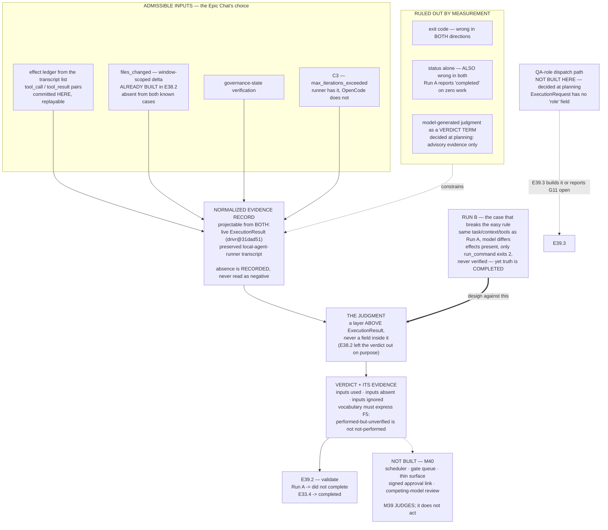

# Epic E39.1 — Completion Judgment That Does Not Rest on the Exit Code

## Context

**This is the phase's load-bearing technical risk, and it is the first of M39's three epics by
binding sequencing.**

P10 measured completion untrustworthy in **both** directions on its own stack. E33.2 Run A returned
exit 0 having done zero work; E33.4 returned exit 2 having produced complete, green work. Renting the
engine relocated the problem rather than escaping it — OpenCode carries an open issue of the same
shape (`anomalyco/opencode` #14551), and with a sole engine the failure mode concentrates in a
dependency the CFO does not own.

M38 built the seam that invokes an engine. **M39 makes its output trustworthy enough to act on**, and
this epic builds the judgment itself. M39 gates M40 precisely because a scheduler and a derived gate
queue built over the current signal yield either constant false escalations or silent no-ops that
read as success.

**M35's handback rule has had no detector beneath it since the day it was recorded.** This epic is
where that stops being true.

---

## Problem Statement

**There is no component anywhere in the fleet that answers "did this run complete?" from evidence.**

Every available single signal has been measured wrong:

| Signal | E33.2 Run A (truth: *did not complete*) | E33.4 (truth: *completed*) |
|---|---|---|
| exit code | **0** ❌ | **2** ❌ |
| `status` | **`completed`** ❌ | **`max_iterations_exceeded`** ❌ |
| `iterations` | **0** ✅ a tell | 10 — no signal |
| `final_answer` | unexecuted **tool-call JSON** ✅ a tell | prose claiming success — correct *here* |

The exit code is wrong in both directions and **`status` is wrong in both directions too** — Run A
reports `completed` having done zero work. This refines M38's M1 obligation (*"read structured
status, never prose"*): correct for E38.4's narrow question, **and not sufficient as a completion
judgment.** An epic that builds the judgment on `status` alone fails the first known case.

M38's `ExecutionResult` was built deliberately as **observations with no verdict** — its own
docstring states *"Every field here is an observation. None of them is a verdict, and there is
deliberately no field that combines them into one."* **This epic supplies what was deliberately left
out**, as a layer above `ExecutionResult`, not a field inside it.

---

## ⚠ Planning-time measurements — read these before designing

Measured by the Milestone Chat on 2026-08-15 on branch `milestone/M39` (this repo) and
`drivr@31dad51` / `home_finance` / `local-agent-runner` working copies as of that date. **Layer,
time and scope are stated for each because `P11-GH-2` has fired on all four axes in this phase.**
These **narrow the design space with evidence; they do not choose the mechanism.**

### F1 — Neither known case ran in this repository

Read from the `run-metadata.json` files committed beside each transcript, and from
`P10-M33-E33.2/run-record.md` front matter:

| Case | Target repo | Target epic |
|---|---|---|
| E33.2 Run A / Run B | **`local-agent-runner`** (`target_repo:` in the run-record) | `P3-M4-E4.1` |
| E33.4 | **`home_finance`** (tool results carry `/home/panchew/soft-dev/home_finance/…`) | `P2-M1-E1.1` |

**Consequence:** any mechanism reading live repository state must reach **across repositories** to
projects this repo does not control, at commits a month old. That is a real cost and it must be
priced, not assumed away.

### F2 — Live repository-state delta is time-confounded, and naively applied it **fails Run A**

This is the most important measurement in this spec.

- `local-agent-runner` branch `epic/cf-2-public-run-api` carries commit **`4ec1e8f`** —
  *"epic(P3-M4-E4.1): expose public library run/Result API (CF-2 slice)"* — dated
  `Mon Jul 20 16:45:44 2026 -0600` = **2026-07-20T22:45:44Z**.
- Run A's own metadata: `started_utc: 2026-07-20T22:40:27.742500+00:00`, `duration_ms: 18370` →
  **ended ≈ 2026-07-20T22:40:46Z**.
- The commit therefore lands **≈4 min 58 s after Run A ended**, and per `run-record.md` §4–§5 it
  carries **Run B's** work, not Run A's.

> **A judgment that asks "did the target repo gain this epic's work?" answers *yes* for Run A** and
> returns *completed* — **the wrong verdict, on the very case the milestone binds.** Repository-state
> delta is correct **only when it is window-scoped to the run and attributed to it.**

The milestone spec's row *"repository state | no commit | commit + green suite"* is accurate as
**ground truth about what each run itself did**. It is **not** a description of a computable input.

### F3 — E33.4's repo-state anchor is a cross-repo tag, on no branch

`home_finance` commit **`8dfb2bd`** (`2026-07-20 19:01:41 -0600`) is held **only** by the annotated
tag `reference/mxn-currency-default`. Measured: `git branch -a --contains 8dfb2bd` returns empty, and
the current checkout's `db/schema.rb:69` still reads `default: "USD"`. The tag's own message records
that the work was *"executed during the ai-project-system governance proving run (mis-numbered E1.1)
and discarded."*

**Consequence:** replaying E33.4's state delta means `0ea6924` → `8dfb2bd` **in another repository, at
a tag**. Available, but only if named explicitly. It is not derivable from anything in this repo.

### F4 — The in-artifact effect ledger **is** committed here and **is** replayable

Both transcripts carry `transcript[]`, a list of `{tool_call, tool_result, ms, eval_count}`:

- **Run A:** `transcript: []` — **zero tool calls**. `iterations: 0`.
- **E33.4:** 10 entries, including `write_file: wrote 180 characters to …`,
  `edit_file: replaced 1 occurrence in …`, and a `run_command` returning
  `exit_code: 0` with green RSpec output.

This is a **run-scoped, effect-level record, committed in this repository**, immune to F1/F2/F3's
cross-repo and time confounds. It is the strongest replayable evidence available.

### F5 — Run B defeats the naive version of F4, and it is the case that matters most

**Run B (`transcript-B-qwen3-coder-30b.json`) is a same-task control**: identical task, context and
`tools.json` to Run A, differing **only in model**. It is already named in the milestone spec's
evidence table and is otherwise unused.

Measured from its transcript:

- 10 entries; **2 successful `write_file`, 1 successful `edit_file`** — effects clearly present.
- Its only completed `run_command` returns **`exit_code: 2` with `ERRORS`**.
- Steps 6–8 are `pip install -e .` **denied by `allow_commands`**.
- Step 9 is an `edit_file` with **no subsequent verification run**.

Ground truth per `run-record.md` §4–§5: **the work was correct and complete (suite 210 passed / 1
skipped) and it is the work committed at `4ec1e8f`** — but **the run itself never verified it**, and
it terminated `max_iterations_exceeded`.

> **So a rule of "effects present AND a green verification observed" reads Run B as *did not
> complete* — contradicting its ground truth.**

**The consequence is architectural, not incidental:** *"did the run complete?"* and *"is the work
complete?"* are **different questions**, and Run B is the case that separates them. A boolean cannot
carry both. This is independent, measured support for the milestone spec's requirement that **a bare
boolean is not a deliverable**.

### F6 — M38 already built the window-scoped delta, and left the judgment out on purpose

`drivr@31dad51`, `drivr/execution/interface.py`. Re-measured directly (G2 — the executor's report is
not the evidence):

- `ExecutionRequest` fields are exactly `task, model, working_dir, timeout_s, max_iterations,
  allowed_tools, extra`. **There is no `role` field.** The milestone spec's claim is confirmed.
- `ExecutionResult.files_changed` is documented as *"Paths under `working_dir` whose content differs
  between a snapshot taken immediately before and immediately after the invocation. **This is
  reporting, and it is explicitly in scope as such.** It becomes judging the moment anything decides
  what the changes mean, so nothing here does."*

**`files_changed` is exactly the window-scoped, run-attributed delta F2 says is required, and it
already exists.** This epic does not invent it; it consumes it — and it is the component that
finally *decides what the changes mean*.

### F7 — The two known cases carry **no** `files_changed`, so it cannot be a required input

The preserved transcripts predate `ExecutionResult` and use the `local-agent-runner` schema
(`status`, `final_answer`, `transcript`, `iterations`, `tokens`, `model`, `duration_ms`). **They have
no `files_changed` field.**

> **A judgment that requires `files_changed` cannot be validated against either known case, and
> E39.2's binding validation becomes unperformable.** The judgment must therefore consume a
> **normalized evidence record** that both a live `ExecutionResult` and a preserved
> `local-agent-runner` transcript can be projected into, and must **degrade explicitly and visibly**
> when an input is absent rather than treating absence as a negative finding.

**This is the single hardest constraint in the epic and it is why it is stated here rather than
discovered at execution.**

---

## Decision taken at planning time — the QA-pass coupling (binding)

The milestone spec requires that E39.1's QA-pass decision be **settled before E39.3's spec is
written**, and the Milestone Execution Chat Starter's Question Policy assigns this decision to the
Milestone Chat (*"Yours — decide, document, proceed"*). **It is decided here, and it is binding on
this epic.**

> **The verdict MUST NOT be load-bearing on any model-generated judgment.**
>
> **Rationale, from measured evidence:** this milestone exists *because* model self-report is
> untrustworthy in both directions. Run A's `final_answer` is a confident, fluent lie; E33.4's
> `status` is wrong while its prose is right. A QA-role second pass is **another model reading
> prose**, and staking the verdict on it reintroduces the exact failure mode the epic was created to
> eliminate.
>
> **Therefore: E39.1 does not build the QA-role dispatch path.** A model-generated assessment may
> appear only as an **advisory evidence entry recorded inside the verdict**, never as the verdict or
> a term in it.

**Consequence for E39.3, consumed rather than discovered:** the `epic_qa` dispatch path does not
exist (F6) and this epic does not create it. **E39.3 therefore builds it on its own terms under
milestone constraint 4, or reports G11 still open with the reason.** E39.3's spec is written against
this decision.

**No speculative seam is to be built for it.** The verdict already carries a list of evidence
entries because it must; that is sufficient, and anything further is speculative generality.

---

## Goals

1. **A completion judgment exists in Drivr** that returns a verdict **carrying its evidence**.
2. **It rests on neither the exit code nor `status` alone** — demonstrated against the measured
   failures above, not asserted.
3. **It consumes a normalized evidence record** that both a live `ExecutionResult` and a preserved
   `local-agent-runner` transcript can be projected into, so that **E39.2's binding validation is
   performable** (F7).
4. **Its verdict vocabulary can express the distinction Run B forces** (F5) — work performed but
   unverified is not the same as work not performed.
5. **Its engine-neutrality is stated**, including any single-adapter dependency, because M40
   inherits that constraint.

---

## Non-Goals

- **Fixing the exit code** in either engine. The deliverable is a judgment that does not depend on it.
- **Running the validation.** Both known cases are **E39.2's**; this epic delivers the mechanism and
  enough description that E39.2 can run it from a stored transcript.
- **Building the QA-role dispatch path** — decided above; E39.3's.
- **Anything in M40** — scheduler, derived gate queue, thin surface, signed one-time-link approval,
  competing-model review.
- **Deciding `model-routing-policy.md` row P4**, promoting M38's evidence findings, or retiring
  `local-agent-runner`.
- **Fixing `P10-GH-10`**, the four §4-invalid enrolled configs, or the two open
  `bin/ai-project-init` defects.

---

## Scope of Work

### 1. The normalized evidence record

Define what the judgment consumes. It must be projectable from **both**:

- a live `ExecutionResult` (`drivr@31dad51`, `drivr/execution/interface.py`), and
- a preserved `local-agent-runner` transcript (`status`, `final_answer`, `transcript[]`,
  `iterations`, `tokens`, `model`, `duration_ms`).

**Absent inputs are recorded as absent and are visible in the verdict's evidence.** Absence is never
silently converted into a negative finding (F7).

### 2. The judgment

The mechanism is **the Epic Chat's design decision**, constrained by the binding constraints
reproduced below. Admissible inputs include transcript/effect-ledger inspection, `files_changed`,
governance-state verification, and combinations. **Exit code and `status` alone are ruled out by
measurement; a model-generated judgment is ruled out as load-bearing by the decision above.**

### 3. The verdict

A structured result carrying **what was judged, from which inputs, and why** — including inputs that
were absent, and any input deliberately ignored, with the reason. **A bare boolean is not a
deliverable.** The vocabulary must be able to express F5's third position.

### 4. C3 consumed rather than rediscovered

`local-agent-runner` exposes `max_iterations_exceeded` / exit 2 where OpenCode returns ordinary
`finish: "stop"`. **M38 retained the runner principally for this.** Use it or state why not.

### 5. Engine-neutrality stated

The judgment is Drivr's, not one engine's. If it depends on a signal only one adapter provides,
**say so** — that is a real constraint on the roster, and M40 inherits it.

---

## Deliverables

1. **The completion judgment, in Drivr**, with the normalized evidence record it consumes.
2. **A verdict that carries its evidence** — inputs used, inputs absent, inputs ignored with reasons.
3. **The QA-pass decision recorded in the delivery**, restating the planning-time decision above and
   its consequence for E39.3 (no dispatch path built here).
4. **C3 used, or its non-use reasoned.**
5. **Engine-neutrality stated**, including any single-adapter dependency.
6. **A written description sufficient for E39.2 to run the mechanism against a stored transcript**
   without reading the implementation.
7. **Delivery Notice** at
   `docs/phases/P11__Drivr_Coordination_Over_Rented_Execution/P11-M39-E39.1__delivery-notice.md`.

**Cross-repo evidence capture (required — the mechanism lands in Drivr, the record lands here):**
the Delivery Notice must cite **Drivr by commit SHA**, never present tense (method obligation 5), and
state Drivr's re-measured suite count. Any evidence file produced is committed **in this repository**.

---

## Definition of Done

- [ ] The judgment exists in Drivr and returns a verdict **with its evidence**
- [ ] It rests on **neither the exit code nor `status` alone** — demonstrated, not asserted
- [ ] It consumes a **normalized evidence record** projectable from both a live `ExecutionResult`
      and a preserved `local-agent-runner` transcript (F7)
- [ ] **Absent inputs are visible in the verdict and are not silently read as negative findings**
- [ ] The verdict vocabulary can express **F5's distinction** (effects performed vs. verified)
- [ ] The QA-pass decision is restated with its consequence for E39.3 named
- [ ] C3 is used or its non-use is reasoned
- [ ] Engine-neutrality is stated, including any single-adapter dependency
- [ ] A description exists sufficient for E39.2 to run the mechanism against a stored transcript
- [ ] **Nothing from M40 built** — no scheduler, gate queue, thin surface, approval link, or
      competing-model review
- [ ] **Drivr's suite green and its new baseline stated** (was **47** at `31dad51`); **this repo
      489** if touched — both re-measured, with the repo named
- [ ] Delivery Notice produced **and committed**; all changes committed to `epic/P11-M39-E39.1`;
      PR opened to `milestone/M39`

---

## Acceptance Criteria

1. **A reader can state what the judgment reads, what it ignores, and why each choice was made.**
2. **The mechanism is described well enough that E39.2 can run it against a stored transcript** —
   verified by a reader who has not read the implementation.
3. **No reader could conclude the verdict depends on a model's self-report**, in any term.
4. **The verdict on an evidence record missing a field is distinguishable from a negative verdict.**

---

## Technical Constraints

### Binding constraints — reproduced, not cited (M39 milestone spec)

**These keep the milestone spec's own numbering. Constraint 4 is deliberately absent — see below.**
They are written as explicit labels rather than a markdown ordered list, because an ordered list
skipping an entry silently renumbers on render and the number *is* the citation
(`P11-GH-2`, literal-vs-rendered axis).

- **Constraint 1 — validated against BOTH known cases.** E33.2 Run A must read *did not complete*;
  E33.4 must read *completed*. *A design that cannot be shown against both is not delivered.* **The
  validation itself is E39.2's**; this epic must not foreclose it (F7).
- **Constraint 2 — neither the exit code NOR `status` alone.** The second half was added on measured
  evidence and is equally binding — Run A's `status` reads `completed`.
- **Constraint 3 — nothing in M40 is built.** No scheduler, no derived gate queue, no thin surface,
  no signed one-time-link approval, no competing-model review. **M39 produces a judgment; M40
  consumes it.**
- **Constraint 5 — row P4 is not decided here.** M38's evidence findings — capacity FAIL, local
  MISS/paid CATCH on one pair, C3's ceiling distinction — **are inputs, not conclusions.** They may
  be used; they may not be promoted.
- **Constraint 6 — Drivr still rents.** No inference, no model loop, no agent client. A completion
  judgment reads what an engine produced; **it does not become one.**
- **Constraint 7 — Structural diagram** on every delivery amending a normative document in this repo
  (Mermaid, fenced, in-repo, no ComfyUI). **Not required for Drivr-side code.**
- **Constraint 8 — `P10-GH-10` is named, not scoped.**
  `tests/test_artifact_router.py::test_daemon_extensions_error_branches` fails **~3 in 10 full-suite
  runs** and passes in isolation. **M39's evidence is suite-shaped.** **Re-run and record BOTH
  results; never report only the green one.** Not this epic's to fix.

> **Constraint 4** (G11 closes only on a real captured `epic_qa` run) binds **E39.3**, not this epic,
> and is deliberately not reproduced here. The planning-time QA-pass decision above is what connects
> them.

### Hard Constraint (binding)

> **M39 judges. It does not act on its judgment.**
>
> A completion judgment **returns a verdict with its evidence.** It does not schedule, does not
> queue, does not notify, does not escalate on its own authority, and does not act.

**The temptation is sharper here than in M38 and it will look like completing the work:** once a run
can be judged complete, dispatching the next one is a short step and a queue of what is outstanding
is a shorter one. **Both are M40's.** If this epic finds itself building any of that, **it stops and
escalates to the Phase Chat.**

### In-scope surfaces

- **Drivr** (`drivr@31dad51`, branch `main`): a new judgment layer **above** `ExecutionResult`.
- **This repository:** governance record and Delivery Notice only.

### Do not touch

- `ExecutionResult`'s existing fields as observations — **do not add a verdict field to it.** Its
  docstring records that the omission is deliberate; **the judgment is a layer above it.** Adding
  optional fields *carrying evidence* is admissible; collapsing observations into a verdict inside
  it is not.
- `bin/ai-project-orchestrator`'s `epic_qa` model-selection behaviour.
- `model-routing-policy.md`.
- The four §4-invalid enrolled configs; the two open `bin/ai-project-init` defects.

---

## Dependencies

**Upstream (must exist before execution):**

- This spec and its Starter **git-tracked on `milestone/M39`** (`git ls-files --error-unmatch`).
- **Drivr at `31dad51`** (verified 2026-08-15), suite **47**, carrying `ExecutionAdapter` /
  `ExecutionRequest` / `ExecutionResult`, `OpenCodeAdapter`, `EchoAdapter`, `ContainerEnvironment`,
  `HostEnvironment`.
- **Both known-case transcripts committed** in this repo at
  `.ai-project/artifacts/agentic-runs/P10-M33-E33.2/` and `…/P10-M33-E33.4/` — **verified present
  2026-08-15**, together with Run B's transcript and both `run-record.md` files.
- **Suite baselines re-measured 2026-08-15 on `milestone/M39`: this repo 489 passed / 0 failed**
  (`PYTHONPATH=. pytest -q`; bare `pytest` fails collection). **Drivr 47** (bare `pytest` from root).

**Downstream (this epic blocks):**

- **E39.2** consumes the mechanism and its description.
- **E39.3** consumes the **QA-pass decision** (settled above, not deferred to execution).

**Sequencing:** **first — binding.**

---

## Timeline

**Target start:** 2026-08-15 · **Target completion:** 2026-08-20

**This epic is the milestone's long pole and carries its only genuine unknown** — nobody has built a
completion judgment on this stack. The phase spec is honest that M39's failure mode is *discovering
that the trustworthy signal is expensive*. **If that happens, escalate to the Milestone Chat; M40
does not start early.** The ordering is binding, not a preference.

---

## Execution Notes

### Method obligations — each was paid for in this phase

1. **`P11-GH-2` — state the layer, the time and the scope of every verification.** Four axes have
   fired: **environment**, **time**, **scope**, and **literal-vs-rendered**. The Phase Chat has
   produced instances of all four, twice while reviewing M38.
2. **G2 — the reviewer re-measures; the executor's report is not the evidence.** The F1–F7
   measurements above were re-measured at planning time rather than inherited.
3. **G1 — remove derivation steps.** One non-uniform element among many gets **quoted verbatim**.
4. **Cite by artifact + defect, never by ordinal.** The count tally collided at "nine" when two
   chats incremented the same stale base. Any total is **a floor with its date and base.**
5. **Cross-repo claims carry a date or commit anchor**, never present tense — a HEAD reference here
   describing Drivr goes stale the moment Drivr moves and nothing here notices.
6. **Every inventory is a floor.**
7. **Check the branch before every commit; verify pushes at `origin`.** `git log -1 <branch>` proves
   nothing. **One worktree per chat** — normative since P5-M20-E20.2, ignored four times in P11.

### On the shape of the risk

**F7 is where this epic fails if it fails.** A judgment designed against Drivr's live
`ExecutionResult` is natural, clean, and **unvalidatable against either known case** — and the
failure would not surface until E39.2 tried to run it. The normalized evidence record exists to
prevent exactly that, and it is why it is a Definition-of-Done item rather than an implementation
detail.

**F5 is where this epic is most likely to be quietly wrong.** Run A's `transcript: []` is an easy
tell, and a mechanism tuned to it will look successful against the two binding cases while being
unable to express the distinction Run B forces. **Design against Run B even though only Run A and
E33.4 are binding.**

---

## Related Documents

- **Milestone spec:** `docs/phases/P11__Drivr_Coordination_Over_Rented_Execution/P11-M39__milestone-spec.md`
- **Phase spec §P11.4:** `docs/phases/P11__Drivr_Coordination_Over_Rented_Execution/P11__phase-spec.md`
- **Known cases:** `.ai-project/artifacts/agentic-runs/P10-M33-E33.2/` (Run A, Run B, `run-record.md`)
  and `.ai-project/artifacts/agentic-runs/P10-M33-E33.4/` (`run-record.md`)
- **Drivr execution surface:** `drivr@31dad51:drivr/execution/interface.py`
- **Upstream defect:** `anomalyco/opencode` #14551 — `opencode run` exits 0 when the session errored
- **M38/E38.4** C3 assessment (`P11-M38-E38.4__retention-assessment.md`)

---

## Visual Bindings

**Visual binding**
- **Link:** (inline — Structural diagram; no hosted link needed per AOG §16.3/§16.5)
- **What:** diagram
- **Level:** Epic
- **State:** proposed

- **Description:** E39.1's design space after the planning-time measurements. **Three signals are
  ruled out** — the exit code and `status` by measurement in both directions, and a model-generated
  judgment as a verdict term by the planning decision recorded above. **The normalized evidence
  record is the load-bearing structural requirement**: the two known cases predate `ExecutionResult`
  and carry no `files_changed`, so a judgment designed only against Drivr's live surface would be
  unvalidatable and would not fail until E39.2. **Run B is drawn in because it breaks the naive
  rule** — effects present, verification never observed, ground truth *completed* — forcing a verdict
  vocabulary richer than a boolean. **Deliberately not built:** the QA-role dispatch path (E39.3's)
  and everything in M40. Proposed-track Structural diagram (AOG §16.3/§16.6), Mermaid, no ComfyUI.

---

## Notes

- **The planning-time transcript and cross-repo read is the most useful thing in this spec.** It cost
  a handful of commands and it eliminated one candidate mechanism (naive repository-state delta,
  which **fails Run A** — F2), surfaced one structural requirement that would otherwise have
  detonated in E39.2 (F7), and recovered a third validation case the milestone spec named but never
  used (F5).
- **`status` looking authoritative is exactly why it needed checking.** M38's own M1 obligation
  would have pointed an epic straight at it.
- **M38 built more of this than the milestone spec credits.** `files_changed` is the window-scoped,
  run-attributed delta F2 proves is necessary, and `ExecutionResult`'s docstring states outright that
  the verdict was left out on purpose. This epic is the component that surface was shaped for.
- **Default-accept (PSG §11.6 / AOG §12) governs delivery**; a Review Decision is the exception path.
  Acceptance and merge instruction are **in-chat acts** (SN-19). **Merge authorization for this
  epic's PR belongs in the Milestone Chat's Stage-2 review** — if it arrives directly in the Epic
  Chat, **confirm upward before acting.** `P9-GH-1`'s guard reaches only the Epic template, and a
  live instance was recorded 2026-08-10.
