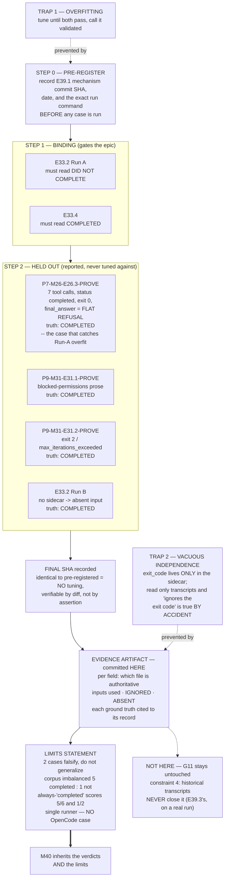

# Epic E39.2 — Validate Against the Known Cases

## Context

**E39.1 builds the judgment. This epic is the only thing that makes it a claim rather than an
assertion.**

The phase spec's words are the binding standard: *a design that cannot be shown against both is not
delivered.* **E33.2 Run A must read *did not complete*. E33.4 must read *completed*.** Both survive as
raw, machine-readable, git-tracked artifacts, so there is **no reconstruction excuse available.**

**This epic's exposure is overfitting**, and it is the milestone's most-flagged risk. Two known
answers are easy to tune toward, and a mechanism adjusted until it passes them and then reported as
validated would be **worse than no validation** — it would hand M40 a signal carrying false
confidence. The milestone spec is explicit: *"Do not tune the mechanism to the two cases until it
passes and call that validation."*

**So this spec's central design choice is to make the disclosure obligation checkable rather than
self-reported** (§Pre-registration). That is the same principle the milestone rests on — *do not
trust a self-report* — applied to its own governance.

---

## Problem Statement

A completion judgment that has not been run against known answers is an argument, not a signal. **M40
inherits whatever this epic certifies**, and it inherits the limits with it — or, if the limits are
not stated, it inherits false confidence in their place.

Two failure modes are available to this epic, and **both produce a document that looks like success**:

1. **Overfitting** — the mechanism is adjusted after seeing a failure until both cases pass, and the
   adjustment is not disclosed. The record reads *"validated against both known cases."*
2. **Vacuous independence** — the validation reads only the transcripts, which **do not contain the
   exit code at all** (§F2 below). "The judgment does not rest on the exit code" then becomes
   *accidentally* true because the exit code was never available, and nothing was demonstrated.

**Neither is caught by a reader of the result. Both are caught by the design of the procedure**, which
is what this spec fixes.

---

## ⚠ Planning-time measurements — read before designing the evidence format

Measured by the Milestone Chat on 2026-08-15 on branch `milestone/M39`. **Layer, time and scope
stated per `P11-GH-2`.** These are inputs the milestone spec does not carry.

### F1 — The evidence directory is not one file, and it is not uniform

**The Phase Chat's v1.0.1 amendment records reading one file in the directory and treating it as the
evidence.** The full inventory, all git-tracked:

| `P10-M33-E33.2/` | `P10-M33-E33.4/` |
|---|---|
| `context.md` | `context.md` |
| `run-record.md` | `run-record.md` |
| `transcript-A-qwen2.5-coder-14b.json` | `transcript-qwen3-coder-30b.json` |
| `transcript-A-qwen2.5-coder-14b__run-metadata.json` | `run-metadata.json` |
| `transcript-B-qwen3-coder-30b.json` | — |

> **Run B has no run-metadata sidecar.** Per-case input availability **differs**, which means this
> epic is the first real exercise of E39.1's requirement that **absence be recorded and never read as
> a negative finding.**

### F2 — The two ruled-out signals live in **different files**, and one is absent from the transcript

- **`status` exists only in the transcript.**
- **`exit_code` exists only in the run-metadata sidecar** — measured: Run A sidecar `exit_code: 0`,
  E33.4 sidecar `exit_code: 2`. **Neither transcript contains an exit code at all.**

> **Consequence, and it is the sharpest procedural point in this spec:** a validation that loads only
> the transcripts **cannot see the exit code**, so "the judgment does not rest on the exit code"
> would be true by accident and demonstrate nothing. **The evidence record must carry the exit code —
> from the sidecar, where it exists — and show it was available and deliberately ignored.**
> Constraint 2 requires a demonstration, not an absence.

### F3 — Transcript and sidecar disagree on `duration_ms`, consistently and benignly

Measured on both cases:

| Case | transcript `duration_ms` | sidecar `duration_ms` | delta |
|---|---|---|---|
| Run A | `18288` | `18370` | **+82 ms** |
| E33.4 | `139771` | `139905` | **+134 ms** |

The sidecar is the outer wall-clock measured around the whole invocation; the transcript is the
runner's internal loop. **The difference is explainable and the sidecar is always larger** — but it
is a disagreement, and **the evidence format must declare which file is authoritative for each
field** rather than leaving a reader to guess which number a verdict used. *(The Phase Chat's v1.0.1
amendment records not noticing this disagreement.)*

### F4 — The corpus is **six** runs, not two, and it is severely imbalanced

Established in E39.1 spec §F8 (added at v1.0.1), every ground truth read from a committed governance
record:

| Case | `status` | dev exit | iters | `final_answer` reads | **Ground truth** |
|---|---|---|---|---|---|
| **E33.2 Run A** | `completed` | 0 | 0 | success-shaped tool-call JSON | **did not complete** |
| E33.2 Run B | `max_iterations_exceeded` | 2 | 10 | success prose | completed |
| **E33.4** | `max_iterations_exceeded` | 2 | 10 | success prose | **completed** |
| `P7-M26-E26.3-PROVE` | `completed` | 0 | 7 | **flat refusal** | completed |
| `P9-M31-E31.1-PROVE` | `completed` | 0 | 8 | **blocked-permissions prose** | completed |
| `P9-M31-E31.2-PROVE` | `max_iterations_exceeded` | 2 | 10 | success prose | completed |

**Five *completed*, one *did not complete*.** **A mechanism that always answers *completed* scores
5/6, and scores 1/2 on the binding pair.** This is a far sharper statement of the limit than *"two
cases do not generalize"*, and **stating it is a Definition-of-Done item.**

**It also supplies four held-out cases** (§Held-out validation) — the only defence against
overfitting available without new runs.

### F5 — `final_answer` is falsified in both directions, so it may not be a signal here either

`P7-M26-E26.3-PROVE` returns verbatim **"I'm sorry, but I can't assist with that request."** on a run
whose delivery notice records *converged attempt 1/3*, model-produced `bin/ai-project-version`, and
proving-vehicle test `2 passed`. That notice also records `final_answer` was **"explicitly not
consulted."** **A validation that scores the judgment partly on prose agreement inherits this
defect.**

---

## Goals

1. **Run E39.1's real mechanism against both binding cases**, from the committed artifacts, and
   record the verdicts with their evidence.
2. **Make any post-hoc tuning mechanically detectable**, not self-reported (§Pre-registration).
3. **Run the four held-out cases after the binding pair**, without tuning against them, and report
   the results whatever they are.
4. **State the corpus's real limits** — two cases falsify and do not generalize; the six-case corpus
   is imbalanced five-to-one; always-*completed* scores 5/6.
5. **Demonstrate — not merely assert — that the exit code and `status` were available and ignored.**

---

## Non-Goals

- **Designing or reworking the mechanism.** That is E39.1's. If a binding case fails, this epic
  **reports it and E39.1 reworks**; this epic does not quietly fix it.
- **Producing new agentic runs.** The corpus is what is preserved. A real `epic_qa` run is **E39.3's**.
- **Closing G11.** E39.3's, and **never** by validating historical transcripts (milestone
  constraint 4).
- **Anything in M40** — scheduler, gate queue, thin surface, approval link, competing-model review.
- **Deciding row P4**, promoting M38's evidence findings, or retiring `local-agent-runner`.
- **Fixing `P10-GH-10`.**

---

## Pre-registration — the disclosure obligation, made checkable

**This is the epic's central procedural requirement.**

The milestone spec requires that *"if the mechanism is adjusted after seeing a failure, say so and say
what changed."* **As written that is an honour-system obligation inside a milestone whose entire
premise is that self-reports are not trustworthy.** This epic makes it verifiable:

1. **Before running any case, record the mechanism's exact commit SHA in Drivr** — the
   *pre-registered SHA* — in the evidence artifact, together with the date and the command that will
   be used to run it.
2. **Run the two binding cases. Record the verdicts.**
3. **If the mechanism is changed at any point afterwards, the change is post-hoc by definition.**
   Record the new SHA and **the `git diff` between the pre-registered SHA and the final SHA**, with
   the reason.
4. **The final evidence artifact states both SHAs.** If they are identical, no tuning occurred and
   **a reviewer can verify that in one command** rather than believing a sentence.

> **A reviewer must be able to establish whether tuning occurred without trusting this epic's own
> account of it.** That is the milestone's own principle applied to its own governance, and it is why
> this is a Definition-of-Done item rather than a recommendation.

**Tuning is not prohibited.** A mechanism corrected after a genuine failure is legitimate work.
**Undisclosed** tuning is the defect, and disclosure is now cheap and checkable.

---

## Held-out validation — the only defence against overfitting available here

**Binding pass/fail remains exactly the two cases the milestone names.** The four others are
**held-out evidence, non-binding**:

- **Run them only after the binding pair's verdicts are recorded**, and **never tune against them.**
- **Report every held-out verdict, including failures.** A held-out failure is **a finding, not a
  delivery failure**, and it is **exactly the information M40 needs.**
- **A held-out failure does not gate this epic.** It is reported, and whether it triggers E39.1 rework
  is **the Milestone Chat's call, not this epic's.**

> **`P7-M26-E26.3-PROVE` is the most valuable held-out case in the corpus.** Run A's tell is
> `transcript: []` with `iterations: 0` — an easy signature. `P7-M26-E26.3-PROVE` has **7 real tool
> calls, `status: completed`, exit 0, four successful `write_file`s, every `run_command` denied, and a
> flat refusal as its `final_answer`** — and its ground truth is **completed**. **A mechanism tuned to
> Run A's easy signature will very plausibly get this one wrong**, and that is precisely what a
> held-out case is for.

---

## Scope of Work

### 1. The evidence format

Declare, per field, **which file in the run directory is authoritative** (F1, F3), and carry:

- the pre-registered mechanism SHA (and final SHA, if different)
- per case: the inputs loaded, **inputs available and deliberately ignored** (F2), inputs **absent**
  (F1 — Run B has no sidecar)
- the verdict and the evidence the mechanism returned with it
- the ground truth and **the committed governance record it was read from**

### 2. The binding validation

Both cases, through **E39.1's real mechanism**, from the committed artifacts.
**Run A → *did not complete*. E33.4 → *completed*.**

### 3. The held-out validation

The four remaining corpus cases, run after the binding pair, untuned, all verdicts reported.

### 4. The limits statement

Two cases falsify and do not generalize; the corpus is imbalanced **five-to-one**; **always-*completed*
scores 5/6 and 1/2**; every case comes from **one runner** (`local-agent-runner`) and **none from
OpenCode**, so **engine generality is untested** — M40 inherits that.

---

## Deliverables

1. **The validation evidence artifact, committed in this repository**, carrying everything in §1.
2. **The binding verdicts** for Run A and E33.4, with the reasoning each carried.
3. **The held-out verdicts** for the four remaining cases, reported whatever they are.
4. **The pre-registered SHA and the final SHA**, with a diff and reason if they differ.
5. **The limits statement** (§4), written so no reader could mistake the result for a general
   guarantee.
6. **An honest account if either binding case fails** — a result, not a delivery failure, but **not a
   pass**; E39.1 reworks and this epic says so plainly.
7. **Delivery Notice** at
   `docs/phases/P11__Drivr_Coordination_Over_Rented_Execution/P11-M39-E39.2__delivery-notice.md`.

**Cross-repo evidence capture:** the mechanism lives in Drivr; **the evidence lands here.** Cite Drivr
**by commit SHA** with a date, never present tense (method obligation 5), and state Drivr's
re-measured suite count.

---

## Definition of Done

- [ ] Both binding cases run through **E39.1's real mechanism**, from the committed artifacts
- [ ] **Run A reads *did not complete*; E33.4 reads *completed***
- [ ] **The pre-registered mechanism SHA is recorded before any case is run**, and the final SHA is
      recorded; if they differ, the **diff and the reason** are recorded
- [ ] The evidence format **declares which file is authoritative per field** (F1, F3)
- [ ] **The exit code and `status` are shown available and deliberately ignored** — not merely absent
      (F2)
- [ ] **Inputs absent for a case are recorded as absent** (Run B has no sidecar) and not read as
      negative findings
- [ ] **All four held-out cases run and every verdict reported**, including failures
- [ ] **The limits statement is present**: two-case falsification; five-to-one imbalance;
      always-*completed* scores **5/6** and **1/2**; single-runner corpus, **no OpenCode case**
- [ ] Each ground truth is cited to **the committed governance record it came from**
- [ ] **Nothing from M40 built**; **G11 not claimed** — validating historical transcripts never
      closes it
- [ ] Evidence artifact and Delivery Notice **committed** in this repo; all changes on
      `epic/P11-M39-E39.2`; PR opened to `milestone/M39`
- [ ] Suites green with baselines named per repo — **this repo 489**, **Drivr 47+**, each
      re-measured; **`P10-GH-10` re-run and BOTH results recorded if it fires**

---

## Acceptance Criteria

1. **A reader can re-run the validation from the committed record** — inputs, mechanism SHA, command.
2. **No reader could mistake two passing cases for a general guarantee.**
3. **A reviewer can determine whether the mechanism was tuned without trusting this epic's account of
   it** — by diffing the two recorded SHAs.
4. **A reader can tell, per case, which inputs were used, which were ignored, and which were absent** —
   and the three are distinguishable.

---

## Technical Constraints

### Binding constraints — reproduced, not cited (M39 milestone spec v1.0.1)

Written as explicit labels rather than a markdown ordered list: an ordered list that skips an entry
silently renumbers on render, and **the number is the citation** (`P11-GH-2`, literal-vs-rendered).

- **Constraint 1 — validated against BOTH known cases.** Run A → *did not complete*; E33.4 →
  *completed*. *A design that cannot be shown against both is not delivered.* **This epic is where
  constraint 1 is discharged.**
- **Constraint 2 — neither the exit code NOR `status` alone.** Here it is a **demonstration**
  obligation: both must be shown available and ignored (F2). At milestone v1.0.1 the **naive,
  non-window-scoped repository-state delta** joins them on the ruled-out list.
- **Constraint 3 — nothing in M40 is built.**
- **Constraint 4 — G11 closes only on a real captured `epic_qa` run.** **It may not be claimed by a
  validation pass over historical transcripts** — which is exactly what this epic does. **This epic
  does not touch G11.**
- **Constraint 5 — row P4 is not decided here**; M38's evidence findings are inputs, not conclusions.
- **Constraint 6 — Drivr still rents.** No inference, no model loop, no agent client.
- **Constraint 7 — Structural diagram** on any delivery amending a normative document in this repo.
  **A validation-evidence artifact is not a normative document**; if this epic amends none, none is
  required — say so.
- **Constraint 8 — `P10-GH-10` is named, not scoped.**
  `tests/test_artifact_router.py::test_daemon_extensions_error_branches` fails **~3 in 10 full-suite
  runs**, passes in isolation. **This milestone's evidence is suite-shaped**, so a spurious red is
  likelier to be mistaken for a finding here. **Re-run and record BOTH results.** Not this epic's to
  fix.

### Hard Constraint (binding)

> **M39 judges. It does not act on its judgment.** A verdict is returned with its evidence. It does
> not schedule, queue, notify, escalate on its own authority, or act.

### In-scope surfaces

- **This repository:** the validation evidence artifact, the Delivery Notice. **The evidence lands
  here.**
- **Drivr** (`drivr@<E39.1 delivery SHA>`): **read and run only.** If the mechanism must change, that
  is a disclosed post-hoc adjustment (§Pre-registration) and normally **E39.1's rework**.

### Do not touch

- **The preserved run artifacts.** They are the evidence; **they are not to be edited, normalized,
  regenerated or "cleaned up"** in place. Any normalization happens in the reading, and is recorded.
- `model-routing-policy.md`; `bin/ai-project-orchestrator`'s `epic_qa` model selection; the four
  §4-invalid enrolled configs; the two open `bin/ai-project-init` defects.

---

## Dependencies

**Upstream:**

- **E39.1 delivered and merged to `milestone/M39`**, with the description required by its
  Acceptance Criterion 2 — *"the mechanism is described well enough that E39.2 can run it against a
  stored transcript"* **without reading the implementation.** If that description is insufficient,
  **that is a finding to report to the Milestone Chat, not a gap to paper over.**
- **E39.1's normalized evidence record** (its §F7 DoD item) — without it the binding validation is
  not performable.
- **The six preserved runs**, verified git-tracked 2026-08-15 (§F1, §F4).
- **Suite baselines re-measured 2026-08-15 on `milestone/M39`: this repo 489 passed / 0 failed**
  (`PYTHONPATH=. pytest -q`; bare `pytest` fails collection). **Drivr 47** at `31dad51`.

**Downstream:** M40 inherits this epic's verdicts **and its limits statement**. The milestone's
Closure Declaration reproduces both.

**Sequencing:** after E39.1. May run in parallel with E39.3.

---

## Timeline

**Target start:** after E39.1 delivers · **Target completion:** 2026-08-23

**Bounded work** — six stored cases, one mechanism, no new runs. **The risk is not schedule, it is
that a clean-looking pass conceals tuning or vacuous independence.** The pre-registration and
held-out procedures exist to spend a little time buying against exactly that.

---

## Execution Notes

### Method obligations — each was paid for in this phase

1. **`P11-GH-2` — state the layer, the time and the scope of every verification.** Four axes have
   fired: **environment**, **time**, **scope**, **literal-vs-rendered**.
2. **G2 — the reviewer re-measures; the executor's report is not the evidence.**
3. **G1 — remove derivation steps.** One non-uniform element among many gets **quoted verbatim**.
4. **Cite by artifact + defect, never by ordinal.**
5. **Cross-repo claims carry a date or commit anchor**, never present tense.
6. **Every inventory is a floor** — **this epic exists partly because an evidence inventory of two
   was actually six.**
7. **Check the branch before every commit; verify pushes at `origin`. One worktree per chat.**

### Where this epic fails if it fails

**Not by a case reading wrong** — that is a result, and the milestone pre-authorizes reporting it.
**It fails by producing a clean document that conceals one of the two failure modes in the Problem
Statement.** Both are invisible in the output and both are prevented by procedure, which is why the
procedure is in the Definition of Done rather than the Notes.

---

## Related Documents

- **Milestone spec (v1.0.1):** `docs/phases/P11__Drivr_Coordination_Over_Rented_Execution/P11-M39__milestone-spec.md`
- **E39.1 spec (v1.0.1):** `…/P11-M39-E39.1__spec__completion-judgment.md` — §F1–F9, especially §F8
  (the six-case corpus) and §F9 (the prior art's signal and its failure mode)
- **Binding cases:** `.ai-project/artifacts/agentic-runs/P10-M33-E33.2/` (Run A, Run B, `run-record.md`),
  `…/P10-M33-E33.4/`
- **Held-out cases:** `…/P7-M26-E26.3-PROVE/`, `…/P9-M31-E31.1-PROVE/`, `…/P9-M31-E31.2-PROVE/`
- **Ground-truth records:** `P7-M26-E26.3__delivery-notice.md`;
  `P9-M31-E31.1__demonstration-evidence.md`; `P9-M31-E31.2__run-record.md`;
  both `run-record.md` files under `P10-M33-E33.2/` and `P10-M33-E33.4/`

---

## Visual Bindings

**Visual binding**
- **Link:** (inline — Structural diagram; no hosted link needed per AOG §16.3/§16.5)
- **What:** diagram
- **Level:** Epic
- **State:** proposed

- **Description:** E39.2's procedure, ordered so that the two failure modes that produce a
  clean-looking document are prevented rather than detected. **Pre-registering the mechanism's commit
  SHA makes the disclosure obligation checkable by diff** instead of by self-report — the milestone's
  own principle applied to its governance. **The binding pair gates; the four held-out cases are
  reported and never tuned against**, with `P7-M26-E26.3-PROVE` the one most likely to catch a
  mechanism overfitted to Run A's easy `transcript: []` signature. **The exit code lives only in the
  run-metadata sidecar**, so a transcript-only validation would satisfy constraint 2 by accident;
  the evidence artifact must show it available and ignored. **G11 is deliberately untouched** —
  constraint 4 forbids closing it by a pass over historical transcripts. Proposed-track Structural
  diagram (AOG §16.3/§16.6), Mermaid, no ComfyUI.

---

## Notes

- **The corpus being six rather than two is this epic's largest planning gain**, and it came from
  listing a directory. It converts *"two cases cannot generalize"* from an apology into a **measured
  statement with four extra data points behind it** — and it supplies the only overfitting defence
  available without commissioning new runs.
- **The imbalance is the honest headline.** Five *completed* to one *did not complete* means
  **always-answering-*completed* scores 5/6**. Any reported score must be read against that baseline,
  and the Closure Declaration should carry it.
- **`P7-M26-E26.3-PROVE` is worth more than its position suggests.** It is a *completed* run whose
  every prose signal says otherwise, and P7's own delivery notice already recorded the right lesson in
  2026-07: **`final_answer` explicitly not consulted.** The framework knew this three phases ago.
- **Default-accept (PSG §11.6 / AOG §12) governs delivery**; a Review Decision is the exception path.
  **Merge authorization for this epic's PR belongs in the Milestone Chat's Stage-2 review** — if it
  arrives directly in the Epic Chat, **confirm upward before acting** (`P9-GH-1`; live instance
  recorded 2026-08-10).
