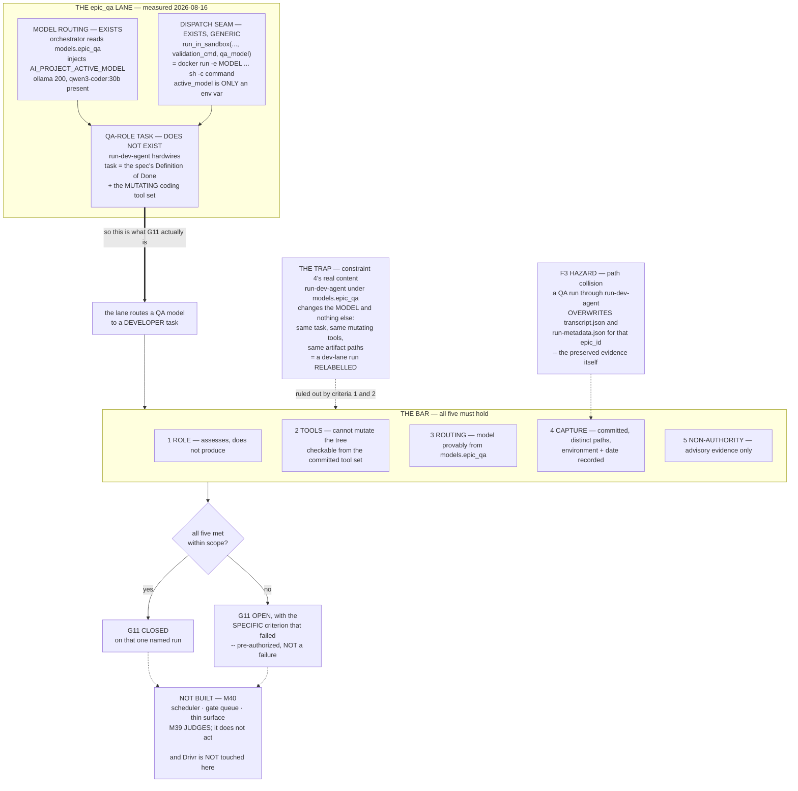

# Epic E39.3 — Exercise the `epic_qa` Lane and Close G11

## Context

**G11 has been open across three phases and has never had a real run behind it.** The lane that would
supply an independent trustworthy signal — a QA-role agent assessing work rather than producing it —
stands at **zero captured runs** since P9.

E39.1's QA-pass coupling was **decided at planning time and is binding**: no model-generated judgment
may be load-bearing on the completion verdict, and therefore **E39.1 does not build a QA-role dispatch
path.** This epic inherits that decision rather than discovering it. Under milestone constraint 4 it
must therefore **build a justified path on its own terms, or report G11 still open with the reason.**

> **Reporting G11 still open is pre-authorized, and it is not a failure.** The milestone spec says so
> outright: *"a milestone that closes G11 by inference would be worse than one that leaves it open."*
> **This spec's job is to make that outcome a precise statement rather than a shrug** — and, if the
> bar can be met inside a hard bound, to let the epic meet it.

---

## Problem Statement

The received account is that *"`epic_qa` has no dispatch path."* **Measured at planning time, that is
not quite right, and the correction changes what this epic should do.**

**The lane has three parts. Two exist and work. One has never existed.**

| Part | State (measured 2026-08-16) |
|---|---|
| **Model routing** | **EXISTS.** `bin/ai-project-orchestrator` reads `models.epic_qa` (line ~428) and injects it as `AI_PROJECT_ACTIVE_MODEL`. Host ollama answers **200**, and **`qwen3-coder:30b` — the configured `epic_qa` model — is present.** |
| **Dispatch seam** | **EXISTS, and is fully generic.** `run_in_sandbox(image, validation_cmd, active_model=qa_model)` runs `docker run … -e AI_PROJECT_ACTIVE_MODEL=<qa_model> … sh -c <validation_command>`. **Anything can occupy that slot.** |
| **QA-role task construction** | **DOES NOT EXIST.** |

**`active_model` is only an environment variable.** The validation command is executed as `sh -c`.
**Unless the validation command itself invokes an agent, no QA model is ever called** — and every
validation command used to date has been a test command. **That is the whole of G11, in one
sentence: the lane routes a QA model to a shell command, and the only governance-aware agent adapter
on the path builds a developer's task.**

---

## ⚠ Planning-time measurements

Measured by the Milestone Chat on **2026-08-16**, on branch `milestone/M39`, **on the host** (not in
the sandbox — the environment axis of `P11-GH-2` is load-bearing here and is stated for every claim).

### F1 — `bin/run-dev-agent` hardwires a developer's task, and the model does not change the role

Read from `bin/run-dev-agent` `main()`:

- `task_text = extract_dod(spec_text, spec_path)` — the task is **always** the epic spec's
  *Definition of Done* section, i.e. ***implement this***.
- `--tools` is always `.ai-project/agents/tools.json`, the **coding** tool set.
- `AI_PROJECT_ACTIVE_MODEL` selects **which model** performs that task, and nothing else.

> **So invoking `run-dev-agent` under `models.epic_qa` changes the model and nothing else: same
> implementation task, same mutating tools, same artifact paths.** **That is exactly and precisely
> what milestone constraint 4 means by "a dev-lane run relabelled"** — and it is the trap this epic
> is most likely to walk into, because it *would* produce a real captured run under the QA model.

### F2 — A **checkable** role boundary exists: the tool set

`.ai-project/agents/tools.json`, quoted verbatim (G1 — the one non-uniform element quoted, not
described):

```
enabled = ["read_file", "write_file", "edit_file", "list_dir", "run_command", "git"]
allow_commands = ["pytest*", "python -m pytest*", "python3 -m pytest*"]
allow_subcommands = ["status", "diff", "log", "show", "add", "commit", "branch", "checkout"]
```

**An agent that can `write_file`, `edit_file`, `git add` and `git commit` is not assessing work; it is
doing work.** A QA-role run must therefore be dispatched with a tool set that **cannot mutate the
working tree**.

> **This makes the role boundary verifiable from committed artifacts rather than from intent.** A
> reviewer reads the tool set named in the run's `run-metadata.json` and checks that no mutating tool
> is enabled. **No one has to be believed.** That is the same standard E39.2's pre-registration
> applies to tuning, and it is why it is a Definition-of-Done item here.

### F3 — Artifact-path collision would **destroy** preserved evidence

`run-dev-agent` writes, per epic:

- `.ai-project/artifacts/agentic-runs/<epic_id>/transcript.json`
- `.ai-project/artifacts/agentic-runs/<epic_id>/run-metadata.json`

**A QA run through the same adapter, for the same `epic_id`, overwrites both** — the dev run's
transcript and its metadata sidecar. **In the milestone whose entire subject is preserved run
evidence, and whose corpus the Phase Chat and this chat have each already had to re-inventory.**

**Distinct artifact filenames are mandatory**, and **no QA run may be dispatched against an
`epic_id` whose directory already holds a preserved run** unless the paths are demonstrably distinct.

**Sharpened at spec v1.0.1 — the exposure is not uniform, and the hand-curation protected only one
directory.** The preserved archive mixes hand-curated suffixed filenames with the plain names the
adapter actually writes. Measured 2026-08-16 on `milestone/M39`:

| Directory | Plain-named files present | Exposure |
|---|---|---|
| `P10-M33-E33.2/` | none — all suffixed | **insulated** (hand-curated) |
| **`P10-M33-E33.4/`** | **`run-metadata.json`** | **AT RISK — and it is a *binding* case** |
| `P7-M26-E26.3-PROVE/` | `transcript.json`, `run-metadata.json` | **AT RISK** |
| `P9-M31-E31.1-PROVE/` | `transcript.json`, `run-metadata.json` | **AT RISK** |
| `P9-M31-E31.2-PROVE/` | `transcript.json`, `run-metadata.json` | **AT RISK** |

> **Four of the five directories are live, and the worst single loss is E33.4's `run-metadata.json`.**
> That file is a **binding** case's sidecar and, per E39.2 §F2, **the only place its `exit_code: 2`
> exists** — neither transcript carries an exit code. Destroying it would remove the evidence E39.2
> needs to demonstrate that the judgment ignores an exit code **that was actually available**, which
> is that epic's guard against vacuous independence. **The three `*-PROVE` directories are three of
> E39.2's four held-out cases**, exposed on both files.
>
> **So the guard is not "remember to use distinct paths" but a concrete prohibition:** no QA run may
> be dispatched against `P10-M33-E33.4`, `P7-M26-E26.3-PROVE`, `P9-M31-E31.1-PROVE` or
> `P9-M31-E31.2-PROVE` as its `epic_id` under any circumstances, and distinct paths must be in place
> **before any QA run executes at all** (cross-epic — this epic may run parallel to E39.2).

### F4 — The runner has never been installed; every captured run used a throwaway wrapper

Measured: `local-agent-runner` is **not on PATH**, and `LOCAL_AGENT_RUNNER` is **unset**.
`discover_runner()` fails with a config error (exit 3) in that state.

The `runner` field of all five preserved `run-metadata.json` files, in full:

```
/tmp/claude-1000/…/103706a1-…/scratchpad/lar-wrapper.sh
/tmp/claude-1000/…/dfee1a5a-…/scratchpad/local-agent-runner-wrapper.sh
/tmp/claude-1000/…/7e0e95fe-…/scratchpad/local-agent-runner-wrapper.sh
/tmp/claude-1000/…/a8130717-…/scratchpad/local-agent-runner-wrapper
/tmp/claude-1000/…/fdbae6b5-…/scratchpad/lar-wrapper.sh
```

**Five different ad-hoc wrappers, in five session scratchpads, all now gone.** The runner does
declare a console entry point — `local-agent-runner = "local_agent_runner.cli:main"` in its
`pyproject.toml`, plus a `__main__.py` — so it **is** runnable. **But no dispatch has ever been
reproducible, and making the runner available is a prerequisite step this epic must perform and
record**, not assume.

### F5 — The sandbox route is blocked; the host route is the one with precedent, and it weakens routing

- **Sandbox:** `B2.1` made the container reach the host's ollama endpoint. **It did not put an engine
  in the image.** `discover_runner()` still needs a binary the image lacks (Route B.2 declined at
  M37), and M38 recorded no engine reachable in the sandbox.
- **Host:** both `P7-M26-E26.3-PROVE` and `P10-M33-E33.2` dispatched **directly on the host**,
  bypassing the Docker sandbox. E33.2's run-record §2 states it explicitly, citing the E26.3
  precedent.

> **The tension this epic must resolve and record:** dispatching on the host **bypasses the
> orchestrator's injection of `models.epic_qa`**, so the model would be set by hand — which is close
> to hand-picking. **The resolution is that routing genuineness means the value provably comes from
> `.ai-project.yml`'s `models.epic_qa`**, demonstrated in the record, not that Docker performed the
> injection. **State which route was used and what it cost.**

---

## What makes a run a genuine `epic_qa` run — the bar

Milestone constraint 4 forbids closing G11 **by inference, by a relabelled dev-lane run, or by
validating historical transcripts** — but it does not say what a genuine run *is*. **It is defined
here, so that both outcomes are precise.** All five must hold:

1. **Role — it assesses, it does not produce.** The task is to judge whether stated work meets a
   stated standard and to return a verdict. **Not** the epic spec's Definition of Done as an
   instruction to implement (F1).
2. **Tools — it cannot mutate the working tree.** No `write_file`, no `edit_file`, no mutating `git`
   subcommand. **Verifiable from the committed tool set named in the run's metadata** (F2).
3. **Routing — the model provably comes from `.ai-project.yml`'s `models.epic_qa`**, shown in the
   record, not hand-chosen (F5).
4. **Capture — committed in this repository** with model, inputs, full outputs, exit code, the
   dispatch path used, **the environment it ran in**, and the date. **Distinct artifact paths** that
   overwrite nothing (F3).
5. **Non-authority — its verdict is advisory evidence only.** Nothing load-bearing depends on it
   (E39.1's binding decision). A QA verdict that became a term in the completion judgment would
   violate that decision.

> **If all five hold, G11 closes on that named run. If any fails, G11 stays open and this epic says
> which one failed and why.** Both are acceptable deliveries. **Only a false claim is not.**

---

## The bounded attempt — and the gate

**This epic does not open a build project.** The missing piece (F1) is narrow, and the epic is scoped
to a **bounded attempt** at it:

**In scope, minimal:**
- A **QA-role dispatch**, reusing `run-dev-agent`'s existing machinery wherever possible — trigger and
  spec discovery, endpoint handling, metadata writing — and changing only what the role requires:
  **the task text, the tool set, and the artifact paths.**
- A **read-only QA tool set**, committed as its own file (F2).
- **Making the runner available and recording how** (F4).

**Explicitly out of scope:**
- A general role framework, a `role` field on Drivr's `ExecutionRequest`, or any change to Drivr's
  execution surface. **Drivr is not touched by this epic.**
- Multi-attempt QA loops, feedback files, retry policy, or any orchestrator behaviour change beyond
  occupying the existing validation slot.
- Anything in M40.

**The gate.** If the bar in §What makes a run genuine cannot be met **within this epic's scope** —
because the runner cannot be made available, because the only viable route breaks criterion 3, or for
any other measured reason — **stop and report G11 open with that specific reason.** **Do not widen
scope to force a close.** Escalate to the Milestone Chat rather than expanding.

---

## Goals

1. **Determine, by measurement, whether a genuine `epic_qa` run is achievable within this epic's
   scope**, against the five criteria above.
2. **If it is: perform one, capture it, and close G11 on that named run.**
3. **If it is not: report G11 open with the specific criterion that failed and what would satisfy it**
   — so the next milestone inherits a precise gap rather than a three-phase-old label.
4. **Either way, leave G11's status unambiguous.**

---

## Non-Goals

- **Closing G11 by inference, by relabelling, or by any pass over historical transcripts.**
  E39.2's validation **does not bear on G11 at all.**
- **Building the completion judgment or re-deciding the QA-pass coupling.** E39.1's, and settled.
- **Making the QA verdict authoritative** in any way.
- **Building anything in M40** — scheduler, gate queue, thin surface, approval link, competing-model
  review.
- **Fixing the sandbox engine gap**, `P10-GH-10`, the four §4-invalid enrolled configs, or the two
  open `bin/ai-project-init` defects.
- **Deciding row P4** or retiring `local-agent-runner`.

---

## Deliverables

1. **A feasibility record** — the five criteria, each marked met or not met, **with the measurement
   behind it** and the environment it was measured in.
2. **Either:**
   - **(a)** a **real captured `epic_qa` run**, committed in this repository, with model, inputs,
     outputs, exit code, dispatch path, environment and date — plus the read-only QA tool set and the
     QA-role dispatch that produced it; **or**
   - **(b)** a **G11-open report** naming the failed criterion, the measurement, and what would
     satisfy it.
3. **An explicit G11 statement** — closed by a named run, or open with its reason. **One sentence a
   reader cannot misread.**
4. **The runner-availability record** (F4) — how it was made available, or why it could not be.
5. **Delivery Notice** at
   `docs/phases/P11__Drivr_Coordination_Over_Rented_Execution/P11-M39-E39.3__delivery-notice.md`.

---

## Definition of Done

- [ ] The five genuineness criteria are each **assessed with a recorded measurement**, not asserted
- [ ] **Either** a real captured `epic_qa` run exists as a **committed artifact** in this repo,
      **or** G11 is reported open with a **specific named criterion** and its measurement
- [ ] The **dispatch path used is named and its origin stated** (built here — E39.1 built none)
- [ ] **The environment of the run or the attempt is recorded** (host vs sandbox), per F5
- [ ] If a run occurred: **its tool set is committed and contains no mutating tool** (F2), and its
      **artifact paths overwrote nothing** (F3)
- [ ] **No QA run was dispatched against `P10-M33-E33.4`, `P7-M26-E26.3-PROVE`,
      `P9-M31-E31.1-PROVE` or `P9-M31-E31.2-PROVE` as its `epic_id`** — the four directories holding
      plain-named files the adapter would overwrite (F3)
- [ ] If a run occurred: **the model is shown to come from `.ai-project.yml`'s `models.epic_qa`** (F5)
- [ ] **G11 is not claimed by inference, by a relabelled dev-lane run, or by E39.2's validation**
- [ ] **The QA verdict is recorded as advisory only** — nothing load-bearing depends on it
- [ ] **No preserved run artifact was overwritten, edited or regenerated** — verified by
      `git status` on `.ai-project/artifacts/agentic-runs/`
- [ ] **Nothing from M40 built**; **Drivr not touched**
- [ ] Suites green with baselines named per repo — **this repo 489**, re-measured; Drivr only if
      touched (it should not be); **`P10-GH-10` re-run and BOTH results recorded if it fires**
- [ ] Delivery Notice **committed**; all changes on `epic/P11-M39-E39.3`; PR opened to `milestone/M39`

---

## Acceptance Criteria

1. **A reader can tell, unambiguously, whether G11 is closed and on what evidence.**
2. **If G11 is open, a reader can tell exactly what would close it** — which criterion failed, and
   what would satisfy it.
3. **If G11 is closed, a reviewer can verify the run was not a relabelled dev-lane run** from the
   committed artifacts alone — the tool set and the task, not the epic's account of them.
4. **No preserved run evidence was altered.**

---

## Technical Constraints

### Binding constraints — reproduced, not cited (M39 milestone spec v1.0.2)

Written as explicit labels rather than a markdown ordered list: an ordered list that skips an entry
silently renumbers on render, and **the number is the citation** (`P11-GH-2`, literal-vs-rendered).

- **Constraint 1 — validated against BOTH known cases.** **E39.2's**, and it **does not bear on
  G11** (constraint 4).
- **Constraint 2 — neither the exit code NOR `status` alone**, and at milestone v1.0.1/v1.0.2
  **neither `final_answer` nor a naive repository-state delta.** **Every signal in the original
  table is now disqualified standalone.**
- **Constraint 3 — nothing in M40 is built.**
- **Constraint 4 — G11 is closed only by a REAL captured `epic_qa` run**, recorded as an artifact in
  this repository. **It may not be claimed by inference, by a dev-lane run relabelled, or by a
  validation pass over historical transcripts. If no real QA run happens, G11 stays open and the
  milestone says so** — that is an acceptable outcome and a false claim is not. **This epic is where
  constraint 4 is discharged**, and §What makes a run genuine is what makes it checkable.
- **Constraint 5 — row P4 is not decided here**; M38's evidence findings are inputs, not conclusions.
- **Constraint 6 — Drivr still rents.** No inference, no model loop, no agent client. **This epic
  should not touch Drivr at all.**
- **Constraint 7 — Structural diagram** on any delivery amending a normative document in this repo.
  **A QA tool set and a dispatch script are not normative documents**; if this epic amends none, none
  is required — say so.
- **Constraint 8 — `P10-GH-10` is named, not scoped.**
  `tests/test_artifact_router.py::test_daemon_extensions_error_branches` fails **~3 in 10 full-suite
  runs**, passes in isolation. **Re-run and record BOTH results.** Not this epic's to fix.

### Hard Constraint (binding)

> **M39 judges. It does not act on its judgment.** A verdict is returned with its evidence. It does
> not schedule, queue, notify, escalate on its own authority, or act.

**A QA lane is where this is easiest to violate**, because a QA verdict *looks* like something that
should trigger the next step. **It triggers nothing.**

### Do not touch

- **The preserved run artifacts under `.ai-project/artifacts/agentic-runs/`** — F3 makes overwriting
  them a live, mechanical risk, not a hypothetical one.
- **Drivr.**
- `model-routing-policy.md`; the four §4-invalid enrolled configs; the two open `bin/ai-project-init`
  defects; the orchestrator's retry/feedback behaviour.

---

## Dependencies

**Upstream:**

- **E39.1's QA-pass decision** — binding, settled at planning: **no model-generated judgment is
  load-bearing, and E39.1 builds no dispatch path.** Consumed here, not rediscovered.
- **Host ollama reachable with `qwen3-coder:30b` present** — verified **2026-08-16**, `/api/tags`
  returned **200** with the tag present. **Re-verify at execution; this is a point-in-time claim.**
- **`local-agent-runner` made available** (F4) — not currently on PATH, `LOCAL_AGENT_RUNNER` unset.
- **Suite baseline re-measured 2026-08-15 on `milestone/M39`: this repo 489 passed / 0 failed**
  (`PYTHONPATH=. pytest -q`; bare `pytest` fails collection).

**Downstream:** the Milestone Closure Declaration reproduces **G11's unambiguous status**.

**Sequencing:** after E39.1's QA-pass decision (already settled). **May run in parallel with E39.2** —
it shares no deliverable with it and must not consume its results.

---

## Timeline

**Target start:** may begin immediately · **Target completion:** 2026-08-25

**Size depends entirely on the gate.** The G11-open path is short and is a legitimate finish. The
attempt path is bounded by §The bounded attempt and **must not grow past it** — if it starts to,
that is an escalation, not a scope adjustment.

---

## Execution Notes

### Method obligations — each was paid for in this phase

1. **`P11-GH-2` — state the layer, the time and the scope of every verification.** Four axes:
   **environment**, **time**, **scope**, **literal-vs-rendered**. **The environment axis is
   load-bearing in this epic** — host and sandbox differ on whether an engine is reachable at all.
2. **G2 — the reviewer re-measures; the executor's report is not the evidence.**
3. **G1 — remove derivation steps.** One non-uniform element among many gets **quoted verbatim**.
4. **Cite by artifact + defect, never by ordinal.**
5. **Cross-repo claims carry a date or commit anchor**, never present tense.
6. **Every inventory is a floor** — the run corpus was inventoried as two and proved to be six.
7. **Check the branch before every commit; verify pushes at `origin`. One worktree per chat** —
   **the Milestone Chat hit two live instances of this on 2026-08-15 and 2026-08-16**, once finding a
   `git merge` reporting *"Already up to date"* because it was merging a branch into itself.

### Where this epic fails if it fails

**Not by reporting G11 open** — that is pre-authorized and, on the measurements above, entirely
respectable. **It fails by producing a run that satisfies the letter of "a captured `epic_qa` run"
while being a developer run with a different model** (F1). That artifact would look exactly like
success, would close a three-phase-old gap on paper, and would be **precisely the false claim
constraint 4 exists to prevent.** The five criteria exist so that a reviewer can rule it out from the
committed artifacts rather than from this epic's account of itself.

---

## Related Documents

- **Milestone spec (v1.0.2):** `docs/phases/P11__Drivr_Coordination_Over_Rented_Execution/P11-M39__milestone-spec.md`
- **E39.1 spec (v1.0.1):** `…/P11-M39-E39.1__spec__completion-judgment.md` — the QA-pass decision, §F9
  (the out-of-run QA `validation_command` and its recorded environment-induced false failure)
- **E39.2 spec:** `…/P11-M39-E39.2__spec__validate-against-known-cases.md` — **which does not bear on
  G11**
- **The lane:** `bin/ai-project-orchestrator` (`run_in_sandbox`, `handle_epic_execution`);
  `bin/run-dev-agent` (`main`, `discover_runner`, `extract_dod`); `.ai-project/agents/tools.json`
- **Precedent for host dispatch:** `P7-M26-E26.3__delivery-notice.md`;
  `.ai-project/artifacts/agentic-runs/P10-M33-E33.2/run-record.md` §2
- **Lane definition:** `governance/ai-project-yml-spec.md` §3.4 — *"QA Tester Agent (Verification &
  Test runner). Agentic dispatch lane only."*

---

## Visual Bindings

**Visual binding**
- **Link:** (inline — Structural diagram; no hosted link needed per AOG §16.3/§16.5)
- **What:** diagram
- **Level:** Epic
- **State:** proposed



- **Description:** E39.3's real situation, measured rather than inherited. **The received account —
  *"`epic_qa` has no dispatch path"* — is not quite right:** model routing and the dispatch seam both
  exist and work, and only the **QA-role task construction** has never existed. That reframes G11 to
  one sentence: **the lane routes a QA model to a developer task.** The five-criterion bar makes both
  outcomes precise, and criteria 1 and 2 are what rule out the trap — invoking `run-dev-agent` under
  `models.epic_qa` would produce a real captured run under the QA model while being **a dev-lane run
  relabelled**, exactly what constraint 4 forbids. **Criterion 2 is checkable from committed
  artifacts**, so no one has to be believed. **F3's collision hazard is drawn in** because a QA run
  through the existing adapter would overwrite the very preserved evidence this milestone rests on.
  Proposed-track Structural diagram (AOG §16.3/§16.6), Mermaid, no ComfyUI.

---

## Amendment History

| Version | Date | Change |
|---|---|---|
| 1.0.0 | 2026-08-16 | Initial spec. Accepted by the Phase Chat at Stage 2; F3 elevated to milestone level at spec v1.0.3. |
| **1.0.1** | **2026-08-16** | **F3 sharpened: the exposure is not uniform.** The preserved archive mixes hand-curated suffixed filenames with the plain names the adapter writes, and **the hand-curation protected only `P10-M33-E33.2`.** Measured: **four of five directories hold plain-named files the adapter would overwrite** — including **`P10-M33-E33.4`, a *binding* case, whose `run-metadata.json` is the only place its `exit_code: 2` exists** (E39.2 §F2), and all three `*-PROVE` directories, which are three of E39.2's four held-out cases. Converts the guard from "use distinct paths" into a **named prohibition on four `epic_id` values**, plus one DoD item. **No change to the five-criterion bar, the gate, scope, sequencing or any binding constraint.** Notified to the Phase Chat at handoff. |

**Mid-flight amendment handling (Milestone Starter):** amended before any `epic/P11-M39-E39.3` branch
existed and before dispatch, so **no running session was reached into.**

---

## Notes

- **The most useful thing measured here is that G11 is narrower than its label.** Three phases of
  *"no dispatch path"* resolves, on inspection, to *"no QA-role task construction"* — the model
  routing works, the model is present, and the seam is generic `sh -c`. **A precise gap is worth more
  than a closed one obtained dishonestly**, and this epic can deliver the precise gap even if it
  cannot deliver the run.
- **Criterion 2 is the quiet load-bearer.** "Did it assess or did it produce?" sounds like a question
  about intent, which no reviewer can check. **"Was `write_file` enabled?" is a question about a
  committed file.** Making the role boundary mechanical is the same move E39.2 made with
  pre-registration, and both come from the same place: **this milestone exists because self-reports
  are not evidence.**
- **F3 deserves emphasis out of proportion to its size.** The natural implementation — reuse
  `run-dev-agent`, point it at the QA model — would silently overwrite `transcript.json` and
  `run-metadata.json` for that epic. **In this milestone.** The corpus has already had to be
  re-inventoried twice by two different chats.
- **Default-accept (PSG §11.6 / AOG §12) governs delivery**; a Review Decision is the exception path.
  **Merge authorization for this epic's PR belongs in the Milestone Chat's Stage-2 review** — if it
  arrives directly in the Epic Chat, **confirm upward before acting** (`P9-GH-1`; live instance
  recorded 2026-08-10).
