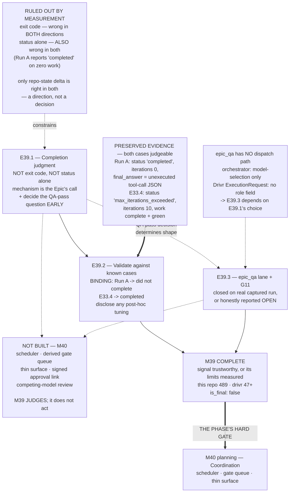

# Milestone M39 — Trustworthy Completion Signal (P10-GH-7)

## Purpose

**A run's completion can be judged by something better than an exit code proven wrong in both
directions on two independent engines**, and the `epic_qa` lane has run for real.

This is **the phase's load-bearing technical risk** and the one thing renting an engine does not
solve. M38 built the seam that invokes an engine; M39 makes its output trustworthy enough to act on.

**M39 gates M40, and that gate is the hardest boundary in P11.** A scheduler dispatching unattended
runs and a gate queue derived from governance state **both depend on knowing whether a run finished,
stalled, or failed confidently wrong.** Built over the current signal, either yields **constant false
escalations** — the human becomes the bottleneck again, worse than before — or **silent no-ops that
read as success.**

**M35's handback rule has had no detector beneath it since the day it was recorded. M39 is where that
stops being true.**

`is_final: false` — on closure the Phase Chat proceeds to **M40 planning**.

---

## ⚠ The finding that shapes this milestone — measured at planning time

**Both known cases survive as raw, machine-readable artifacts.** This was the milestone's largest
planning risk and it is resolved: **E39.2's binding validation is performable against real preserved
transcripts, not reconstructions.**

| Case | Artifact | Size |
|---|---|---|
| **E33.2 Run A** — exit 0, zero work | `.ai-project/artifacts/agentic-runs/P10-M33-E33.2/transcript-A-qwen2.5-coder-14b.json` | 1,202 B |
| E33.2 Run B | `…/P10-M33-E33.2/transcript-B-qwen3-coder-30b.json` | — |
| **E33.4** — exit 2, complete green work | `.ai-project/artifacts/agentic-runs/P10-M33-E33.4/transcript-qwen3-coder-30b.json` | 33,017 B |

Both directories also carry a `run-record.md`. Both transcripts share a schema: `status`,
`final_answer`, `transcript`, `iterations`, `tokens`, `model`, `duration_ms`.

### What the two transcripts actually contain — and why it narrows the design space

Read at planning time. **This does not decide E39.1's mechanism; it rules out the cheap answers with
measured evidence.**

| Signal | **Run A** (truth: *did not complete*) | **E33.4** (truth: *completed*) |
|---|---|---|
| exit code | **0** ❌ wrong | **2** ❌ wrong |
| `status` | **`completed`** ❌ **wrong** | **`max_iterations_exceeded`** ❌ **wrong** |
| `iterations` | **0** ✅ a tell | 10 — no signal |
| `final_answer` | raw **unexecuted tool-call JSON** ✅ a tell | prose claiming success — ✅ correct *here* |
| repository state | no commit | commit + green suite ✅ |

**Three consequences, and the second is the important one:**

1. **The exit code is wrong in both directions.** Known since P10; restated because it is the premise.
2. **`status` is ALSO wrong in both directions.** Run A reports **`completed`** having done zero work.
   **This refines M38's M1 obligation** (*"read structured status, never prose"*) — correct for E38.4's
   narrow question, **and not sufficient as a completion judgment.** An epic that builds the judgment
   on `status` alone fails the first known case.
3. **The two cases are mirror images that defeat every single signal.** In Run A the prose lies and
   the structured status lies; in E33.4 the prose is right and the structured status lies.

   > **⚠ CORRECTED at v1.0.1 — and the correction is the Phase Chat's.** v1.0.0 continued: *"The only
   > signal correct in both is repository/artifact state delta."* **E39.1's F2 falsified that as
   > written, by measurement.**
   >
   > **The table row above is accurate as GROUND TRUTH about what each run itself did. It is NOT a
   > description of a computable input, and v1.0.0 presented it as one.**
   >
   > **Measured** (verified independently by the Phase Chat from
   > `…/P10-M33-E33.2/transcript-A-qwen2.5-coder-14b__run-metadata.json`, a **sidecar the Phase Chat
   > had not read** when v1.0.0 was written): Run A started **22:40:27.742Z** and ran **18,370 ms**,
   > ending ≈**22:40:46Z**. `local-agent-runner`'s commit **`4ec1e8f`** is dated **22:45:44Z** — **4 min
   > 58 s AFTER Run A ended** — and per the run-record it carries **Run B's** work.
   >
   > **So a judgment asking *"did the target repo gain this epic's work?"* answers YES for Run A and
   > returns *completed* — the wrong verdict on the very case the milestone binds.**
   >
   > **Repository-state delta is correct only when window-scoped to the run and attributed to it.**
   > That remains an available direction; the naive form is ruled out with the other two.
   >
   > **This is `P11-GH-2`'s scope axis in my own spec** — ground truth described as though it were an
   > available signal — and a second lesson besides: I read *a* file in the evidence directory and
   > treated it as *the* evidence. **The directory holds a `context.md`, a `run-record.md`, two
   > transcripts and a run-metadata sidecar.** Every inventory is a floor, including an evidence
   > directory.

> **E39.1 may build its judgment from anything it can defend** — transcript inspection, **window-scoped
> and attributed** state delta, governance-state verification, an in-artifact effect ledger, or a
> combination. **What it may not do is adopt exit code or `status` alone**, because the preserved
> evidence already shows both failing — **nor naive repository-state delta, which F2 shows failing Run
> A.**

---

## Scope note — where M39's work lands

**Split between repositories, and epic specs must say which.**

| Lands in | What |
|---|---|
| **Drivr** | the completion-judgment mechanism, and any QA-role dispatch path it requires |
| **This repository** | the governance record, the captured validation evidence, and the `epic_qa` run records |
| **Neither** | the scheduler, the gate queue, the thin surface — **M40** |

**Suite baselines: this repo 489; Drivr 47.** Both re-measured at M38's consolidation. **M38's
artifacts cite 393 for this repo; that figure is stale** — B2.1 and E38.3 added 96 tests between them.
**Measure on the branch you are on and state which repo you mean.**

---

## Binding Constraints (settled — NOT for re-debate)

**1. The judgment must be validated against BOTH known cases, and this is the milestone's hard
requirement.** **E33.2 Run A must read *did not complete*. E33.4 must read *completed*.** The phase
spec's words: *a design that cannot be shown against both is not delivered.* Both artifacts exist and
are named above; there is no reconstruction excuse available.

**2. The judgment may not rest on the exit code, and may not rest on `status` alone.** The first half
is the phase spec's. **The second half is added at planning time on measured evidence** (above) and is
equally binding — Run A's `status` reads `completed`.

**3. Nothing in M40 is built.** No scheduler, no derived gate queue, no thin surface, no signed
one-time-link approval, no competing-model review. **M39 produces a judgment; M40 consumes it.**

**4. G11 is closed only by a REAL captured `epic_qa` run**, recorded as an artifact in this
repository. **It may not be claimed by inference, by a dev-lane run relabelled, or by a validation
pass over historical transcripts.** If no real QA run happens, **G11 stays open and the milestone says
so** — that is an acceptable outcome and a false claim is not.

**5. `model-routing-policy.md` row P4 is not decided here**, and M38's three evidence findings —
capacity FAIL, local MISS/paid CATCH on one pair, C3's ceiling distinction — **are inputs, not
conclusions.** M39 may use them; it may not promote them.

**6. Drivr still rents.** No inference, no model loop, no agent client. A completion judgment reads
what an engine produced; it does not become one.

**7. Every delivery amending a normative document in this repo carries a Structural diagram**
(Mermaid, fenced, in-repo, no ComfyUI). Not required for Drivr-side code.

**8. P10-GH-10 is named, not scoped — and it bites harder here than anywhere.**
`tests/test_artifact_router.py::test_daemon_extensions_error_branches` fails **~3 in 10 full-suite
runs**, passes in isolation. **M39's evidence is suite-shaped**, so a spurious red is likelier to be
mistaken for a finding in this milestone than in any other. **Re-run and record both results; never
report only the green one.** Not this milestone's to fix.

---

## ⚠ The coupling that must be settled in planning — E39.3 has no dispatch path

**Measured at planning time: `epic_qa` still has no dispatch mechanism, and M38 did not add one.**

- `bin/ai-project-orchestrator` uses `epic_qa` **only to select a model for the validation command**
  (line ~455). That is a model-config choice, **not a QA-role agent dispatch.**
- **Drivr's `ExecutionRequest` carries no role concept** — its fields are `task`, `model`,
  `working_dir`, `timeout_s`, `max_iterations`, `allowed_tools`, `extra`. **No `role`.**

**So "exercise the `epic_qa` lane" requires building a QA-role dispatch path that does not exist.**

**The resolution is a coupling, not a new epic:**

> **A QA-role second pass is an admissible component of E39.1's judgment** — the phase spec lists it
> explicitly. **If E39.1 chooses it, the dispatch path is built there as part of the mechanism, and
> E39.3 exercises and captures it.** If E39.1's mechanism does not need a QA pass, **E39.3 must justify
> building one on its own terms or report G11 as still open with the reason** (constraint 4).
>
> **E39.1 decides this, and it decides it early**, because E39.3's shape depends on it. **The Milestone
> Chat must extract that decision from E39.1's spec before E39.3's spec is written** — not discover it
> at execution.

**This is the M37 shape caught before it fires**: an epic whose feasibility depends on a path that may
not exist. It cost M37 an escalation, a ruling and a posture round-trip; it cost M38 nothing because
the Stage A/B gate caught it. **Here it costs a paragraph.**

---

## Problem Statement

**P10 measured completion untrustworthy in both directions on its own stack** — E33.2 Run A returned
exit 0 having done zero work; E33.4 returned exit 2 having produced complete, green work. Corroborated
across two projects: **the exit code is not a completion signal on this stack.**

**Renting the engine relocated the problem rather than escaping it.** OpenCode carries an open issue
of exactly the same shape — `opencode run` exits 0 even when the session errored
(`anomalyco/opencode` #14551) — and Amendment A1.5 sharpens it: with a sole engine, the failure mode
**concentrates in a dependency the CFO does not own.** Better for diagnosis, worse for control.

**M38 made this concrete rather than theoretical.** E38.4 measured that OpenCode distinguishes finish,
crash and abort **but returns ordinary `finish: "stop"` when its configured step ceiling is reached**,
while `local-agent-runner` distinguishes that case with `max_iterations_exceeded` / exit 2. **One
engine on the roster already carries part of what this milestone must build** — and it was retained
principally for that reason.

**And G11 stands at zero captured `epic_qa` runs.** The lane that would supply an independent
trustworthy signal has never been exercised, and as measured above, **no path exists to exercise it
with.**

---

## Goals

1. **A completion judgment exists that rests on neither the exit code nor `status` alone** (E39.1).
2. **It is validated against both known cases**, reading Run A as *did not complete* and E33.4 as
   *completed* (E39.2).
3. **The `epic_qa` lane runs for real and G11 closes — or G11 is honestly reported still open**
   with its reason (E39.3).
4. **M40's prerequisite is satisfied**: a signal a scheduler and a derived gate queue can be built on,
   or a measured, stated account of its limits.

---

## Non-Goals

- **Fixing the exit code**, in either engine. The deliverable is a judgment that does not depend on it.
- **Building anything in M40** — scheduler, gate queue, thin surface, approval links, competing-model
  review.
- **Deciding row P4**, promoting M38's evidence findings, or retiring `local-agent-runner`.
- **Fixing P10-GH-10**, the four §4-invalid enrolled configs, or the two open `bin/ai-project-init`
  defects. All named, none M39's.
- **Claiming G11 without a real captured QA run.**
- **Producing Epic specs or Starters at the Phase level** — the Milestone Chat's job.

---

## Hard Constraint (binding — carries to every Epic)

**M39 judges. It does not act on its judgment.**

The temptation here is sharper than M38's and it will look like completing the work: **once a run can
be judged complete, dispatching the next one is a short step, and a queue of what is outstanding is a
shorter one.** Both are M40's, and **M40 is gated on this milestone precisely because building them
over an unproven signal is the failure mode the gate exists to prevent.**

> A completion judgment **returns a verdict with its evidence.** It does not schedule, does not queue,
> does not notify, does not escalate on its own authority, and does not act.

If an epic finds itself building any of that, **it stops and escalates to the Phase Chat.**

---

## Planned Epics

- **E39.1 — Completion judgment that does not rest on the exit code** *(first — binding)*
- **E39.2 — Validate against the known cases** *(after E39.1)*
- **E39.3 — Exercise the `epic_qa` lane and close G11** *(shape depends on E39.1's mechanism choice)*

> **Artifact scope (adjacency).** The Phase Chat produces this spec and the Milestone Execution Chat
> Starter. The **Milestone Chat** owns final epic planning and authors all three Epic specs and
> Starters. **E39.1's first position is binding**; boundaries elsewhere may be adjusted within scope.

---

## Epic Detail

### E39.1 — Completion judgment that does not rest on the exit code *(first, binding)*

**Source:** phase spec §P11.4; P10-GH-7; M38/E38.4's C3 finding.

**Deliverables:**
1. **The completion judgment**, in Drivr. **Mechanism is the Epic Chat's design decision** — transcript
   inspection, repository/artifact state delta, governance-state verification, a QA-role second pass,
   or a combination. **Constraint 2 rules out exit code and `status` alone; nothing else is excluded.**
2. **A verdict that carries its evidence** — what was judged, from what inputs, and why. A bare
   boolean is not a deliverable (Hard Constraint).
3. **An explicit decision on whether the mechanism includes a QA-role second pass**, recorded early
   because **E39.3's shape depends on it** (see the coupling above).
4. **C3 consumed rather than rediscovered.** `local-agent-runner` exposes `max_iterations_exceeded` /
   exit 2 where OpenCode returns ordinary `finish: "stop"`. **M38 retained the runner principally for
   this.** Use it or state why not.
5. **Engine-neutrality stated.** The judgment is Drivr's, not one engine's. If it depends on a
   signal only one adapter provides, **say so** — that is a real constraint on the roster and M40
   inherits it.

**Definition of Done:**
- [ ] The judgment exists in Drivr and returns a verdict **with its evidence**
- [ ] It rests on **neither the exit code nor `status` alone** — demonstrated, not asserted
- [ ] The QA-pass decision is recorded, with its consequence for E39.3 named
- [ ] C3 is used or its non-use is reasoned
- [ ] Engine-neutrality is stated, including any single-adapter dependency
- [ ] **Nothing from M40 built** (Hard Constraint)
- [ ] Drivr's suite green and its new baseline stated; **this repo 489** if touched

**Acceptance Criteria:**
- [ ] A reader can state what the judgment reads, what it ignores, and why each choice was made
- [ ] The mechanism is described well enough that E39.2 can run it against a stored transcript

**Sequencing:** **first — binding.**

---

### E39.2 — Validate against the known cases *(after E39.1)*

**Source:** phase spec §P11.4 — *"a design that cannot be shown against both is not delivered."*

**Deliverables:**
1. **The judgment run against both preserved transcripts**, at the paths named above.
   **Binding: Run A → *did not complete*; E33.4 → *completed*.**
2. **The evidence captured and committed in this repository** — inputs, verdicts, and the reasoning
   each verdict carried.
3. **An honest account if either case fails.** A judgment that gets one right and one wrong is **a
   result, not a delivery failure** — but it is **not** a pass, and E39.1 reworks. **Do not tune the
   mechanism to the two cases until it passes and call that validation**; overfitting to two known
   answers is the failure mode this epic is most exposed to. **If the mechanism is adjusted after
   seeing a failure, say so and say what changed.**
4. **A statement of what two cases can and cannot establish.** Two is enough to falsify and not enough
   to generalize. **M40 inherits this signal; the limits travel with it.**

**Definition of Done:**
- [ ] Both cases run through the real mechanism, from the committed transcripts
- [ ] **Run A reads *did not complete*; E33.4 reads *completed***
- [ ] Evidence for both is committed in this repo
- [ ] Any post-hoc adjustment to E39.1's mechanism is disclosed with what changed and why
- [ ] The two-case limit is stated explicitly
- [ ] Suite green on both repos, with each baseline named

**Acceptance Criteria:**
- [ ] A reader can re-run the validation from the committed record
- [ ] No reader could mistake two passing cases for a general guarantee

**Sequencing:** after E39.1.

---

### E39.3 — Exercise the `epic_qa` lane and close G11

**Source:** phase spec §P11.4; G11 (zero captured `epic_qa` runs since P9).

**Grounding:** G11 has been open across three phases and **has never had a dispatch path.** M38
confirmed the orchestrator uses `epic_qa` only to select a model for the validation command, and that
Drivr's `ExecutionRequest` carries no role concept. **Whether this epic builds that path depends on
E39.1's mechanism choice** (see the coupling).

**Deliverables:**
1. **A real `epic_qa` run, captured as an artifact in this repository** — the first ever. Recorded
   with its model, inputs, outputs and the path used to dispatch it.
2. **Either the QA-role dispatch path** (if E39.1 built one as part of its mechanism, exercised here)
   **or a justified path built here** — or, if neither is warranted, **G11 reported still open with
   the reason** (constraint 4).
3. **An explicit G11 statement**: closed by a named captured run, or open with what remains.
   **Inference does not close it.**

**Definition of Done:**
- [ ] Either a real captured `epic_qa` run exists as a committed artifact, **or** G11 is reported open
      with a specific reason
- [ ] The dispatch path used is named and its origin stated (E39.1's mechanism, or built here)
- [ ] **G11 is not claimed by inference or by relabelling a dev-lane run**
- [ ] Suite green on the repos touched, baselines named

**Acceptance Criteria:**
- [ ] A reader can tell, unambiguously, whether G11 is closed and on what evidence

**Sequencing:** after E39.1's QA-pass decision. May follow or parallel E39.2.

---

## Method obligations — carried forward, each paid for in this phase

These are not boilerplate. **Every one was bought with an escalation, a rework, or a false claim.**

1. **`P11-GH-2` — state the layer, the time, and the scope of every verification.** Four axes have
   fired: **environment** (measured on the host for code that runs in a container), **time** (a claim
   true when written, stale when filed), **scope** (a summary dropping a qualifier), and
   **literal-vs-rendered** (a grep matching example text, or missing a phrase because of inline
   markdown). **The Phase Chat has produced instances of all four.**
2. **G2 — the reviewer re-measures; the executor's report is not the evidence.**
3. **G1 — remove derivation steps.** Any input with exactly one non-uniform element gets it **quoted
   verbatim**, not described.
4. **Cite instances by artifact + defect, never by ordinal.** The count-error tally collided at "nine"
   when two chats incremented the same stale base. Any total is **a floor with its date and base.**
5. **Cross-repo claims carry a date or commit anchor**, never present tense — a HEAD reference in this
   repo describing Drivr goes stale the moment Drivr moves and nothing here notices.
6. **Every inventory is a floor.** Fleet lists, `GH-` counts and citation sweeps have each proven short.
7. **Check the branch before every commit; verify pushes at `origin`.** `git log -1 <branch>` shows
   the local ref and proves nothing. **One worktree per chat** — normative since P5-M20-E20.2, ignored
   four times in P11 including by this Phase Chat, and now materially enforced.

---

## Prerequisites

- This spec and its Starter **git-tracked on `phase/P11`** (`git ls-files --error-unmatch`).
- **M38 closed and consolidated** — merge `e08ee47`; Review Decision ACCEPT, no rework.
- **`phase/P11` in sync with master**, verified at consolidation.
- **Drivr at `31dad51`**, suite 47, carrying `ExecutionAdapter`/`ExecutionRequest`/`ExecutionResult`,
  `OpenCodeAdapter`, `EchoAdapter`, `ContainerEnvironment`, `HostEnvironment`.
- **Both known-case transcripts committed** at the paths named above.
- **Suite baselines: this repo 489, Drivr 47.**
- **Reference:** phase spec §P11.4; `anomalyco/opencode` #14551; E38.4's C3 assessment; M38's Closure
  Declaration; `.ai-project/artifacts/agentic-runs/P10-M33-E33.2/run-record.md` and
  `…/P10-M33-E33.4/run-record.md`.

---

## Definition of Done (Milestone)

- [ ] E39.1–E39.3 each meet their own DoD
- [ ] All three epic branches merged to `milestone/M39`
- [ ] **A completion judgment exists that rests on neither the exit code nor `status` alone**
- [ ] **Validated against both known cases: Run A → *did not complete*, E33.4 → *completed***, with
      evidence committed and any post-hoc tuning disclosed
- [ ] **The two-case limit is stated** — falsification, not generalization
- [ ] **G11 is closed by a real captured `epic_qa` run, or honestly reported still open** with its
      reason. **Never claimed by inference.**
- [ ] The QA-pass coupling was decided in E39.1 and consumed by E39.3, **not discovered at execution**
- [ ] **Nothing from M40 was built** — no scheduler, gate queue, thin surface, approval link, or
      competing-model review
- [ ] Row P4 untouched; M38's evidence findings used but not promoted
- [ ] Structural diagram on any delivery amending a normative document in this repo
- [ ] **Suites green with baselines named per repo** (this repo **489**, Drivr **47**+); P10-GH-10
      re-run and **both** results recorded if it fires
- [ ] Milestone Closure Declaration produced (`is_final: false`) **and committed** — M38's was
      authored but left untracked until the Phase Chat caught it at consolidation

---

## Acceptance Criteria (Milestone)

1. **A run's completion can be judged without the exit code or `status` alone**, and the judgment
   carries its evidence.
2. **Both known cases read correctly**, from the committed transcripts, through the real mechanism.
3. **The signal's limits are stated** — two cases falsify; they do not generalize.
4. **G11's status is unambiguous** — closed on named evidence, or open with a reason.
5. **The M40 gate is intact**: a judgment exists and nothing consumes it yet.
6. **Suites green, baselines named per repository.**

---

## Timeline

**Target Start:** 2026-08-15
**Target Completion:** 2026-08-26 (~1.5 weeks). **E39.1 is the long pole** and carries the milestone's
only genuine unknown — nobody has built a completion judgment on this stack, and the phase spec is
honest that *its failure mode is discovering that the trustworthy signal is expensive.* **If that
happens, escalate; M40 does not start early.** E39.2 is bounded — two stored transcripts, one
mechanism. E39.3's size depends entirely on E39.1's QA-pass decision, which is why that decision is
required early.

**Actual Start:** Not started
**Actual Completion:** Not started

---

## Visual Bindings

**Visual binding**
- **Link:** (inline — Structural diagram; no hosted link needed per AOG §16.3/§16.5)
- **What:** diagram
- **Level:** Milestone
- **State:** proposed

- **Description:** M39's three epics and the two facts that shape them. **Both known cases survive as
  raw transcripts**, so the binding validation is performable against real artifacts. **Measurement
  rules out the cheap answers**: the exit code is wrong in both directions and `status` is *also* wrong
  in both — Run A reports `completed` on zero work — leaving repository-state delta as the only signal
  correct in both, which is a direction rather than a decision. **`epic_qa` has no dispatch path**, so
  E39.3's shape depends on whether E39.1's mechanism includes a QA second pass. **Deliberately not
  built:** everything in M40, which this milestone gates. Proposed-track Structural diagram (AOG
  §16.3/§16.6), Mermaid, no ComfyUI.

---

## Amendment History

| Version | Date | Change |
|---------|------|--------|
| 1.0.1 | 2026-08-15 | **A direction in v1.0.0 was falsified by measurement, and the error was the Phase Chat's.** v1.0.0's §finding concluded *"the only signal correct in both is repository/artifact state delta."* **E39.1's F2 disproves it as written.** The table row *"repository state: no commit / commit + green suite"* is accurate as **ground truth about what each run did** and v1.0.0 presented it as **a computable input**, which it is not. Verified independently by the Phase Chat from `…/P10-M33-E33.2/transcript-A-qwen2.5-coder-14b__run-metadata.json` — **a sidecar the Phase Chat had not read**: Run A started **22:40:27.742Z**, ran **18,370 ms**, ended ≈**22:40:46Z**; `local-agent-runner`'s `4ec1e8f` is dated **22:45:44Z**, **4 min 58 s later**, and carries **Run B's** work. **A naive "did the target repo gain this epic's work?" returns *completed* for Run A — the wrong verdict on the very case constraint 1 binds.** Corrected: repository-state delta is admissible **only window-scoped to the run and attributed to it**; the naive form joins exit code and `status` alone on the ruled-out list. **Two lessons recorded, both mine:** this is `P11-GH-2`'s **scope axis inside my own spec** — ground truth described as an available signal; and I read *one* file in the evidence directory and treated it as *the* evidence, when it holds a `context.md`, a `run-record.md`, two transcripts and a metadata sidecar. **Every inventory is a floor, including an evidence directory.** Also accepted from E39.1's set: the **QA-pass coupling decided at planning time** — no model-generated judgment may be load-bearing on the verdict, so E39.1 does **not** build the QA dispatch path and E39.3 inherits that decision rather than discovering it. **No epic, ordering, constraint or scope boundary otherwise changes.** |

---

## Notes

- **This is the phase's load-bearing risk, and the phase spec says so honestly:** M39's failure mode is
  *discovering that the trustworthy signal is expensive.* **If it proves harder than estimated,
  escalate — do not start M40 early.** The ordering is binding, not a preference.
- **The planning-time transcript read is the most useful thing in this spec.** It cost one command and
  it eliminated two candidate mechanisms with evidence rather than argument. **`status` looking
  authoritative is exactly why it needed checking** — M38's own M1 obligation would have pointed an
  epic straight at it.
- **G11 has been open across three phases and has never had a path.** The honest outcome is available
  and pre-authorized: **report it open with a reason.** A milestone that closes G11 by inference would
  be worse than one that leaves it open.
- **M38's three findings are inputs here, not conclusions** — capacity FAIL, local MISS/paid CATCH on
  one pair, C3's ceiling distinction. C3 in particular is *raw material*: one engine already exposes
  the distinction M39 must construct.
- **Default-accept (PSG §11.6 / AOG §12) governs delivery**; a Review Decision is the exception path.
  Acceptance and merge instruction are **in-chat acts** (SN-19). The harness enforces human merge
  authorization regardless, and **merge authorization for a child PR belongs in this Phase Chat's
  Stage-2 review** — P9-GH-1's guard reaches only the Epic template, with a live instance recorded
  2026-08-10.
