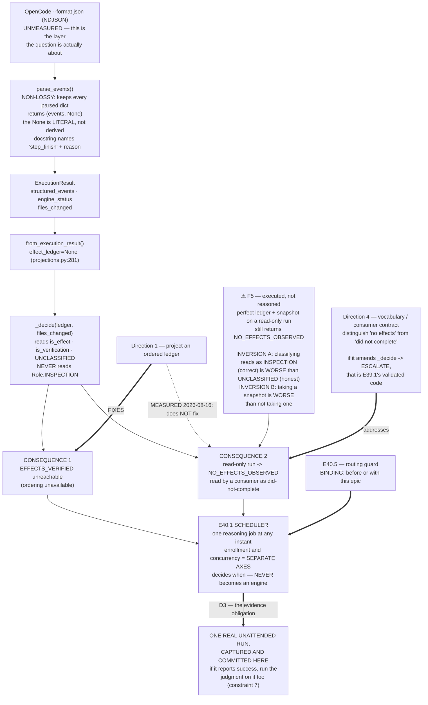

# Epic E40.1 — The Serialized-Lane Scheduler, and the Completion-Signal Decision

## Context

**This epic holds M40's only genuine unknown, and M40 is the phase's final milestone.**

SN-23 (2026-07-20) Ratified Decision #7 said *scheduler only when contention bites*. **It now bites,
measured:** one GPU, 16 GB VRAM shared with ComfyUI, `qwen3-coder:30b` (Q4_K_M, 18.6 GB) already
partially offloading to RAM at 12.9 GB VRAM / 21.4 GB total. P10 ran the lane by hand and the
friction is real.

M39 gated M40 so that M40 would have a **trustworthy completion signal** to build on. M39 delivered
one: validated, honest, and explicit about its limits. **The signal exists and does not function on
the path M40 will actually dispatch.** That is not a defect in M39 — M39 recorded it as its limit 5
and carry-forward 4, and deliberately did not build the projection because nothing in M39 needed it.
**It lands here because this is where dispatch happens.**

---

## Problem Statement

A scheduler that dispatches through today's adapter and consumes M39's judgment receives
`undetermined` or a negative verdict on **every single run**. Never a positive one.

**Escalating on `undetermined` therefore escalates effectively every live run** — which *is* the
*"constant false escalations, the human becomes the bottleneck again, worse than before"* failure the
M39 gate exists to prevent. A scheduler that solves contention by re-creating the bottleneck one
layer up has solved nothing.

**So this epic cannot build the scheduler and defer the signal question. The two are the same
question.**

---

## ⚠ Planning-time measurements — read all six before designing

Measured by the Milestone Chat on **2026-08-16**, in the `ai-project-system` and `drivr` working
copies on this machine (`drivr` @ **`715099c`** on `main`, suite **249 passed**). **Layer, time and
scope are stated for each because `P11-GH-2` has fired on all four axes in this phase** (environment,
time, scope, literal-vs-rendered).

**F5 is the one that changes this epic's shape. Read it even if you skim the rest.**

### F1 — The environment changed: an engine resolves here

M38 recorded *"no engine reachable in the sandbox"* and removed Direction C from scope on an
Alpine/musl-vs-glibc `opencode` mismatch. **Measured 2026-08-16, from this Milestone Chat's shell:**

| Probe | Result |
|---|---|
| `/etc/os-release` | `Ubuntu 26.04 LTS` — **not Alpine** |
| `which opencode` / `opencode --version` | `/home/panchew/.opencode/bin/opencode` · **1.18.10** |
| `OpenCodeAdapter().resolve_binary()` | `/home/panchew/.opencode/bin/opencode` — **Drivr's own resolution, not a hand-guessed path** |
| `opencode models \| grep -i 'ollama\|qwen'` | `ollama/llama3.1:8b`, `ollama/qwen2.5-coder:7b`, `ollama/qwen2.5-coder:14b`, **`ollama/qwen3-coder:30b`** |
| `curl localhost:11434/api/tags` | **200** |
| `curl host.docker.internal:11434/api/tags` | **000** |

Two things follow, and the second is a warning:

1. **The engine Drivr rents resolves in this environment, and OpenCode can see the exact model
   `.ai-project.yml` routes `epic_dev` / `epic_qa` to.** E40.1's real dispatch is plausibly
   performable rather than blocked.
2. **The endpoint shape is the *reverse* of `B2.1`'s.** B2.1 (M37) made the sandbox reach host Ollama
   via `host.docker.internal` with loopback `000` as the negative control. Here loopback answers and
   `host.docker.internal` does not. **This is a different environment, not a fixed one.**

> **⚠ Scope of F1, stated honestly.** This measured **binary resolution and provider listing**. It
> did **not** execute an agent run, and it proves nothing about whether a run completes, how long it
> takes, or what it emits. **`P11-GH-2`'s environment axis is exactly this trap.** Your first act is
> to re-measure in *your* environment (§Prerequisites in the Starter), because a Milestone Chat's
> shell is not necessarily an Epic Chat's.

### F2 — `parse_events` is non-lossy, so the ledger question is not about Drivr's parser

Read from `drivr/execution/opencode.py`, literal source. `parse_events` iterates the NDJSON stream,
skips lines not starting with `{` and lines that fail `json.loads`, and **appends every remaining
parsed dict unchanged**. It filters no event type, drops no field, and imposes no schema.

**Therefore `structured_events` carries whatever OpenCode emits.** The `projections.py` docstring's
phrase *"`parse_events` returns generic events"* describes their **typing** (`Mapping[str, Any]`, no
schema) — **not content loss.**

> **The consequence is a method warning.** *"Can an ordered ledger be projected?"* is a question
> about **what OpenCode's `--format json` stream contains**. It is **not** a question about what
> Drivr's parser keeps. **Answering it by reading Drivr's code is verification at the wrong layer —
> `P11-GH-2`'s recorded defect, by name.** Answer it by running `opencode --format json` and looking
> at the stream.

### F3 — `engine_status` is `None` by construction, and the docstring names a real event type

`parse_events`' return statement, verbatim (`drivr/execution/opencode.py:223`):

```python
        return (tuple(events) if events else None), None
```

**The second element is a literal `None`.** It is never derived from the stream. So *"`engine_status`
is always `None`"* is a true statement about **the adapter**, and the accompanying claim that
OpenCode emits no machine-readable completion status is an assertion **the adapter does not itself
test.**

**And the same docstring names a concrete event type:** *"The `step_finish` event carries a `reason`
(e.g. `stop`), which is a *finish* reason and not a statement about whether the work was done."*

> **That sentence is evidence the stream is structured and typed** — someone looked at it and saw
> named event types. It is a reason to treat the ledger projection as **live and promising**, not as
> a long shot. It is **not** evidence that tool calls appear. **Go and look.**

### F4 — Where the ledger is refused today

`drivr/judgment/projections.py:281`, inside `from_execution_result`:

```python
        effect_ledger=None,
```

with the module docstring's rationale: *"The ordered effect ledger is available from
`local-agent-runner` transcripts and from no adapter on today's roster… a live OpenCode result
projects with `effect_ledger=None`, so ordering is unavailable, so it can reach `EFFECTS_UNVERIFIED`,
`NO_EFFECTS_OBSERVED` or `INDETERMINATE` — and never `EFFECTS_VERIFIED`."*

The `None`-vs-`()` distinction is load-bearing and must not be blurred: `()` means **a ledger was
observed and is empty — the run did nothing** (E33.2 Run A, whose transcript is literally
`"transcript": []`). `None` means **no ledger was observed at all**, and nothing follows.

### F5 — ⚠ The ledger projection fixes ONE of the two consequences, not both

**Executed, not reasoned** — `judge_completion` run directly against constructed records, 2026-08-16,
`drivr` @ `715099c`:

| Record put through the real `judge_completion` | Verdict | Rule |
|---|---|---|
| **read-only run, ledger projected & well-classified, snapshot taken** (`INSPECTION`×2 + `VERIFICATION` exit 0, `files_changed=()`) | **`NO_EFFECTS_OBSERVED`** | `no-effects` |
| read-only run, same ledger, **no** snapshot (`files_changed=None`) | `INDETERMINATE` | `commands-ran-unobserved` |
| read-only run, inspections only, snapshot taken | **`NO_EFFECTS_OBSERVED`** | `no-effects` |
| read-only run, same entries but classified **`UNCLASSIFIED`**, snapshot taken | `INDETERMINATE` | `effects-unrecognised` |
| *(today, live)* no ledger, files changed | `EFFECTS_UNVERIFIED` | `ordering-unavailable` |
| *(today, live)* no ledger, no files changed | `NO_EFFECTS_OBSERVED` | `no-effects` |

**Row 1 is the finding. A perfectly projected, perfectly classified ordered ledger still returns
`NO_EFFECTS_OBSERVED` for a read-only run.**

The mechanism, read from `_decide`: it computes `effects_present = bool(effects) or bool(files_changed)`
and reasons only over `is_effect`, `is_verification`, and `Role.UNCLASSIFIED`. **`Role.INSPECTION` is
defined in the taxonomy and `_decide` never reads it.** An entry that read state and changed nothing
is invisible to every rule.

**Two inversions follow, and both are counter-intuitive enough to state plainly:**

1. **Better classification produces a worse verdict.** Classifying a read as `INSPECTION` (correct)
   yields the wrong negative; leaving it `UNCLASSIFIED` (an admission of incomprehension) yields the
   honest `INDETERMINATE`. **The projection is penalised for understanding more.**
2. **More evidence produces a worse verdict.** Taking a filesystem snapshot moves a read-only run
   from `INDETERMINATE` to `NO_EFFECTS_OBSERVED`.

> **What this means for this epic.** The milestone spec presents the ledger projection as *"the
> unblocker… already identified"*. **Measured: it unblocks consequence 1 — `EFFECTS_VERIFIED` becomes
> reachable — and leaves consequence 2 exactly where it was.** Consequence 2 does not live in the
> adapter at all. **It lives in `_decide`'s rule set**, which is E39.1's delivered, validated code,
> whose whole design principle is *ordering is the mechanism* and whose independence is asserted by
> `tests/test_judgment_independence.py`.
>
> **An epic that builds the projection and declares the signal fixed will have measured only half of
> it.** See §Escalation Triggers — amending `_decide` is a materially different change from writing
> an adapter, and it is not silently in scope.

**Is `NO_EFFECTS_OBSERVED` "wrong" here?** Be precise, because the answer shapes the fix. It is
**accurate about effects** — a read-only run genuinely changed nothing. It is **wrong as a completion
signal**, because a consumer reads it as *did-not-complete*. **The gap is in the consumer contract
and the verdict vocabulary, not only in the adapter** — which is why a fourth direction exists below
that the milestone spec did not list.

### F6 — The worktree rule is unobserved, and this epic is the natural owner

`chat-hierarchy.md`'s one-worktree-per-chat rule has existed since **P5-M20-E20.2** and was measured
**unobserved** on 2026-08-07 — one shared tree, **four occurrences in P11, including the Phase
Chat's**. This shared worktree is left on whatever branch the last session used, and `P11-GH-1` has
fired three times.

A dispatcher that decides *when* a run happens is the natural owner of *which worktree it gets*.
**Taking it would be the first thing in this phase to convert an interim practice into a mechanism
rather than adding another practice.** Phase spec v1.1.2 records this as **consideration, not scope**.
**Declining is a legitimate outcome if reasoned.**

---

## Goals

1. **The serialized lane runs unattended** — one reasoning job at any instant, no human starting it.
2. **The completion-signal question is decided on measurement**, and the decision states what it
   costs and what the scheduler consequently does not know.
3. **The worktree question is decided either way**, with reasoning.
4. **Nothing becomes an engine.**

---

## Deliverables

### D1 — A scheduler that keeps the serialized lane busy without a human starting it

**One reasoning job at any instant.** **Enrollment (which projects may run) and concurrency (how many
run at once) are separate axes** and must be separate **in the implementation, not merely in prose** —
a reader must be able to point at the two mechanisms. They do not conflict: the lane can be enrolled
wide and still run one job.

### D2 — The completion-signal decision, recorded with its measurement

**This is the milestone's open question.** Four admissible directions — **the fourth is added by F5
and is not in the milestone spec**. None is preferred here.

| # | Direction | What it costs / what it leaves |
|---|---|---|
| 1 | **Project an ordered ledger for OpenCode** from the `--format json` stream (M39 carry-forward 4) | Fixes consequence 1 only (F5). **Read-only runs still return `NO_EFFECTS_OBSERVED`.** Requires measuring the real stream first (F2). |
| 2 | **Consume the judgment as-is, with a non-escalating `undetermined` policy** | Cheapest. The scheduler acts on a signal that is never positive. **State plainly what it therefore does not know.** |
| 3 | **Dispatch without consuming the judgment** | Honest and small. **State plainly what the scheduler does not know** — and note this leaves M39's gate unused at the point it was built for. |
| 4 | **Treat consequence 2 as a vocabulary / consumer-contract problem** — distinguish *"no effects"* from *"did not complete"* at the consumer, or give the judgment a way to express a completed read-only run | Addresses the branch the other three leave. **If it means amending `_decide`, that is an escalation (§Escalation Triggers), not absorbed scope.** |

Combinations are admissible. **State which, why, and what it costs.**

**If the ledger projection is declined, D2 must record what `structured_events` was found to
contain** — that is an explicit DoD item in the milestone spec, and it is the measurement F2 says can
only be taken by running the engine.

### D3 — At least one real unattended dispatch, captured and committed

**A run the scheduler started, that no human started**, with its record committed **in this
repository** (`ai-project-system`), since `drivr` has no git remote and a Drivr-side artifact is not
independently retrievable.

**The Hard Constraint governs this deliverable above all others:** *"the lane runs unattended" means a
run was dispatched and completed with no human starting it, captured.* **A phase closes on evidence
or it does not close.**

**Binding constraint 7 applies to the captured run:** *never read a QA verdict without first running
the completion judgment on the run that produced it.* M39's `epic_qa` lane returned a fabricated
`VERDICT: PASS` on all 26 rules **with zero tool calls**, reproduced. **If your captured run reports
success, run the judgment on it and report both.**

### D4 — The worktree question, decided either way

Take it or decline it (F6). **Record the reasoning.** If taken, it must be a mechanism, not another
documented practice — that distinction is the entire point.

### D5 — Cross-repo evidence capture, stated

The mechanism lives in `drivr`; the governance record lives here. **State how evidence is captured
from Drivr and committed into `ai-project-system`**, and carry a **commit anchor for Drivr** in every
cross-repo claim (method obligation 5). `drivr` has **no git remote** — *"verify the push at
`origin`"* is **not performable** there, and a reviewer must re-measure on this machine.

---

## Definition of Done

- [ ] The scheduler runs the serialized lane unattended; **one job at any instant** demonstrated
- [ ] **Enrollment and concurrency are separate axes in the implementation**, not merely in prose
- [ ] **The completion-signal decision is recorded with its measurement**
- [ ] **What `structured_events` actually contained is recorded — whichever direction is taken.**
      Not only if the ledger projection was declined. The measurement is owed either way, because a
      direction chosen *without* looking at the stream is a direction chosen on assumption, and F2
      says the stream is the only layer that can answer it
- [ ] **F5 is addressed explicitly** — the decision states what happens to a read-only run, or records
      that it remains wrong and why that is survivable
- [ ] **At least one real unattended run is captured and committed in this repo**
- [ ] If that run reports success, **the completion judgment was run on it** and both are reported
      (constraint 7)
- [ ] The worktree question is decided and recorded either way
- [ ] **Nothing became an engine** (constraint 6)
- [ ] **The `undetermined` policy is not "escalate"** unless the epic shows why that is survivable
- [ ] Suites green, **baselines named per repo**: this repo **510** (`PYTHONPATH=. pytest -q`), Drivr
      **249** (bare `pytest`), each with its new total and delta
- [ ] Delivery Notice produced; PR opened to `milestone/M40`; **stop and await authorization**

---

## Acceptance Criteria

1. **A reader can state what the scheduler knows about a finished run, and what it does not.**
2. **A run happened that no human started, and its record proves it.**
3. **The read-only branch (F5) is not silently inherited** — a reader can find what the epic decided
   about it.
4. **Enrollment and concurrency can each be pointed at in the code.**

---

## Binding Constraints (reproduced, not cited)

**1. The lane is serialized: one reasoning job at any instant.** Enrollment and concurrency are
different axes and do not conflict. The contention is measured and real.

**5. Mode is not authority.** Running unattended widens what an instance *does*, never what it may
*authorize*. Stage-2 acceptance and merge authorization remain human-keyed in every mode.

**6. Drivr still rents.** No inference, no model loop, no agent client. **A scheduler decides *when*;
it does not become an engine.** This is the spine, and it erodes by increment or not at all.

**7. Never read a QA verdict without first running the completion judgment on the QA run that
produced it.** The five-criterion bar establishes a run is **genuine**; the completion judgment
establishes whether **work happened**. **Neither is sufficient alone.**

**Hard Constraint — the last milestone's drift.** M36–M39 each had to resist building the *next*
thing. **M40 has nothing after it to defer to**, so its temptation is **declaring rather than
measuring**. Every claim here is measured or it is not made.

---

## Escalation Triggers — escalate to the Milestone Chat, do not absorb

The milestone spec is explicit: *"If the completion-signal decision outgrows one epic, escalate — do
not absorb it and do not let it silently become the milestone."* Concretely:

1. **Amending `_decide` or the verdict vocabulary** (direction 4, or any fix to F5's read-only
   branch that reaches into E39.1's delivered judgment). That code is validated against two binding
   known cases and guarded by `tests/test_judgment_independence.py`. **Changing it is a different
   epic's worth of risk than writing an adapter.** Escalate before, not after.
2. **The ledger projection proving larger than an adapter change** once the real stream is measured.
3. **The scheduler needing to hold model state, batch, or retry with reasoning** — that is becoming
   an engine. Escalate rather than reinterpret constraint 6.
4. **No unattended run being achievable in your environment** (F1's warning). **D3 is the milestone's
   evidence obligation; if it cannot be met, that is escalated immediately, not discovered at
   closure.**

**M40 is the final milestone. A sixth epic is an escalation to HQ**, since splitting would insert a
milestone after the phase's last.

---

## Out of Scope

- **Building an inference engine, a model loop, or an agent client** (constraint 6).
- **Any local-inference runtime other than Ollama** — **CLOSED by CFO decision**, not parked, not
  deferred. llama.cpp does not carry forward.
- **Deciding `model-routing-policy.md` row P4** — a further HQ call on the evidence.
- **The gate queue** (E40.2), **the thin surface and approval** (E40.3), **competing-model review**
  (E40.4), **the routing guard** (E40.5).
- **`P10-GH-10`** (~3-in-10 flaky, did not fire during M39). **Named, not scoped — but if it fires,
  record both results.**
- **M39's `exit_code` ABSENT-vs-`ignored` classification**; the four §4-invalid enrolled configs; the
  two open `bin/ai-project-init` defects; `P9-GH-3`; `P8-GH-2`; ComfyUI precision; the sidekick
  identity question.

---

## Dependencies

- **E40.5 lands before or with this epic — binding.** This epic wires dispatch, which is `P10-GH-9`'s
  recorded trigger. **Confirm E40.5's position before wiring dispatch.**
- **M39's delivered judgment** (`drivr/judgment/`), and M38's adapter surface (`drivr/execution/`).
- **Repositories:** `drivr` (mechanism) and `ai-project-system` (record). Drivr @ `715099c` on `main`,
  **249 passed**, as of 2026-08-16.

---

## Visual Bindings

**Visual binding**
- **Link:** (inline — Structural diagram; no hosted link needed per AOG §16.3/§16.5)
- **What:** diagram
- **Level:** Epic
- **State:** proposed



- **Description:** The path a completion verdict actually travels, with the layer each planning
  measurement was taken at. `parse_events` is non-lossy, so the ledger question belongs to OpenCode's
  stream and not to Drivr's parser (answering it from Drivr's code is `P11-GH-2`'s wrong-layer
  defect). The measured finding: projecting an ordered ledger fixes the unreachable-`EFFECTS_VERIFIED`
  consequence and **does not** fix the read-only one, because `_decide` never reads `Role.INSPECTION`
  — with two inversions, where better classification and more evidence each produce a worse verdict.
  Proposed-track Structural diagram (AOG §16.3/§16.6), Mermaid, no ComfyUI.

---

## Amendment History

| Version | Date | Change |
|---|---|---|
| 1.0.1 | 2026-08-17 | **Stage-2 tightening from the Phase Chat, applied before launch so it is not a mid-flight amendment (`P11-GH-1`).** `structured_events`' actual contents must be recorded **whichever direction is taken**, not only if the ledger projection was declined — a direction chosen without looking at the stream is a direction chosen on assumption, and §F2 establishes the stream as the only layer that can answer it. |
| 1.0.0 | 2026-08-16 | Initial spec. Records F1–F6. **F5 adds a fourth admissible direction the milestone spec does not list**, on the executed finding that the ledger projection fixes one of the two consequences and not both; adds the corresponding escalation trigger for any change reaching `_decide`. F1 records that an engine resolves in this environment — reversing M38's "no engine reachable" on a **different** endpoint shape from `B2.1`'s. |
