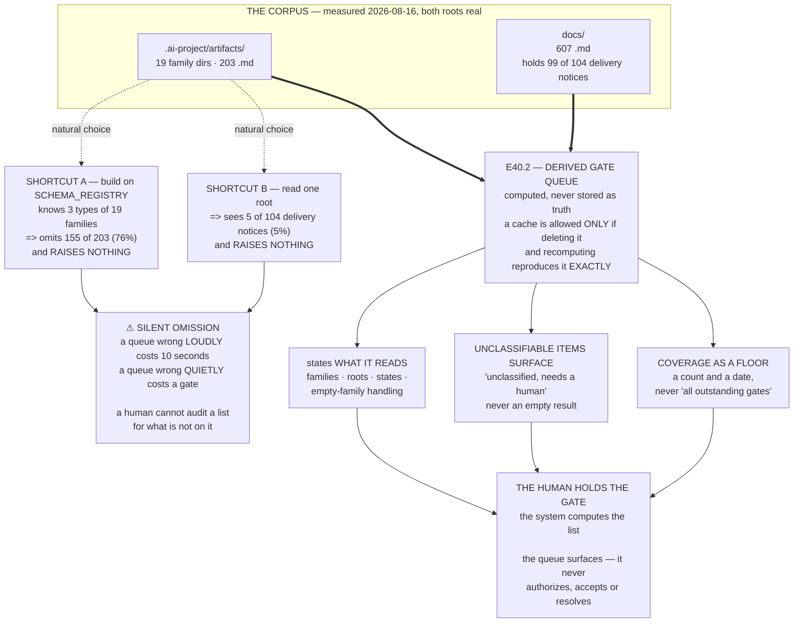

# Epic E40.2 — The Derived Gate Queue

## Context

**The human holds the gate; the system computes the list.**

A hand-maintained gate queue is a **second source of truth for governance state** and drifts from the
artifacts within a week. The artifacts are the record; the queue is a **view** over them. That is
binding constraint 2, and it is not open for re-debate.

This epic is bounded and may run parallel to E40.1. **Its risk is not difficulty — it is silence.**

---

## Problem Statement

**Silent omission from a gate queue is the failure mode.**

A queue that is wrong *loudly* — showing an item that turns out to be closed — costs a human ten
seconds. A queue that is wrong *quietly* — never showing an item that was outstanding all along —
costs a gate. The human trusts a list that is complete, and cannot audit a list for what is not on
it.

**This is not a hypothetical risk in this repository. It is measured** — see Q2 and Q3 below, where
the two most natural implementation shortcuts each drop the majority of the corpus **without
erroring.**

---

## ⚠ Planning-time measurements — read before designing

Measured by the Milestone Chat on **2026-08-16**, on branch `milestone/M40` in the
`ai-project-system` working copy on this machine, by **executing the counts**, not by reading
documentation about them. **Layer, time and scope stated per `P11-GH-2`.**

### Q1 — Artifact-parsing machinery already exists here. Do not reinvent it.

`lib/artifact_parser.py` (`ArtifactParser`, `Artifact`), `lib/artifact_router.py` (`ArtifactRouter`,
`IdempotencyTracker`), `lib/artifact_schemas.py` (`SCHEMA_REGISTRY`, `get_schema_for_type`) and
`lib/artifact_errors.py` (`ArtifactParseError`, `ArtifactSchemaError`) are present and under test
(`tests/test_artifact_parser.py`, `tests/test_artifact_router.py`).

**A derived queue should stand on this, not beside it.** A second parser is a second source of truth
about what an artifact *is*, which is the same defect one layer down.

### Q2 — The schema registry covers **3** artifact types; the corpus has **19** families

Executed: `SCHEMA_REGISTRY` has **3 keys** — `completion_notice`, `delivery_notice`,
`review_decision`. `.ai-project/artifacts/` holds **19 family directories** and **203 `.md`
artifacts**:

| Count | Family | | Count | Family |
|---:|---|---|---:|---|
| 44 | `reference` | | 8 | `escalation-notices` |
| 34 | `review-decisions` **✓ known** | | 5 | `delivery-notices` **✓ known** |
| 24 | `steering-notes` | | 4 | `progress-digests` |
| 22 | `closure-declarations` | | 2 | `system-responses` |
| 11 | `epic-closure-notices` | | 2 | `system-requests` |
| 10 | `rulings` | | 1 | `field-evidence` |
| 9 | `merge-authorizations` | | 1 | `deployment-authorizations` |
| 9 | `completion-notices` **✓ known** | | 0 | `validation-runs` |
| 9 | `agentic-runs` | | 0 | `bouncer-work-logs` |
| 8 | `hq-openers` | | | |

The three known families hold **48** artifacts. **155 of 203 — 76% — fall outside the registry.**

> **A queue built on `SCHEMA_REGISTRY` alone omits three quarters of the corpus and raises nothing**,
> because an unregistered type is not an error, it is simply not a hit. **That is the failure mode,
> reproduced by the most natural implementation choice available.**

Note also `merge-authorizations` (9) and `escalation-notices` (8): both are **gate-bearing** families
and **neither is in the registry.**

### Q3 — The corpus is **bi-located**, and the split is not even

Executed counts:

| Family | under `.ai-project/artifacts/` | under `docs/` |
|---|---:|---:|
| delivery notices | **5** | **99** |
| closure declarations | **22** | **13** |

`docs/` holds **607** `.md` files in total.

> **A queue reading only `.ai-project/artifacts/` sees 5 of 104 delivery notices — 5%.** Delivery
> notices are among the most gate-relevant artifacts in the framework, since a delivery awaiting
> review is precisely what a gate queue exists to surface. **Reading one root is the second natural
> shortcut, and it also fails quietly.**

**Neither root is "the wrong one."** Both are real; the corpus genuinely lives in two places, by
convention rather than by accident. **The epic must decide what it reads and say so** — the failure
is choosing one silently.

### Q4 — Two families are empty, and empty is ambiguous

`validation-runs` and `bouncer-work-logs` hold **0** artifacts. **An empty family cannot be
distinguished, from the queue's side, between *nothing is outstanding* and *nothing is being read*.**
The epic must decide how an empty or absent family is reported. **Silently contributing nothing is
the failure mode again**, in its third form.

---

## Goals

1. **The gate queue is computed from governance state, never hand-maintained.**
2. **Its derivation is demonstrated, not asserted** — recomputation reproduces it.
3. **What it reads is stated**, and what it cannot classify **surfaces rather than vanishing.**
4. **Its coverage is stated as a floor with a number**, not implied by silence.

---

## Deliverables

### D1 — A gate queue computed from governance state

Whatever the artifacts say is outstanding. **No hand-maintained store is the source of truth for any
entry.**

A cache or index is permissible **only** if D2 holds against it — that is, if deleting it and
recomputing reproduces the queue exactly. **A stored queue that happens to be correct is not a
derived queue.**

### D2 — Demonstrated derivation

**Delete the queue, recompute it from the artifacts, and show it reproduces exactly.** Committed
evidence of the before/after comparison, not a claim that it was done.

**Hard Constraint:** *"the queue is derived" means it was recomputed from governance artifacts and
shown to match.* **A phase closes on evidence or it does not close.**

### D3 — A stated account of what it reads

- **Which artifact families** — with the number covered against the number that exist (Q2's 19 and
  203 are the floor as measured on 2026-08-16; **re-measure, they will have moved**).
- **Which roots** — `.ai-project/artifacts/`, `docs/`, or both, **decided and stated** (Q3).
- **Which states** make an item outstanding, and what "outstanding" means. This is a design decision,
  not a given: *a delivery with no matching review decision* and *a PR awaiting merge authorization*
  are candidate shapes, and the epic chooses.
- **What it does with an artifact it cannot classify** — see D4.
- **How an empty or absent family is reported** (Q4).

### D4 — Unclassifiable items surface

**An artifact the queue cannot classify must appear, not disappear.** Surfacing it as *"unclassified,
needs a human"* is a correct outcome; omitting it is not.

> This is the same principle M39's judgment already applies one layer down — its `UNCLASSIFIED` role
> is *"recorded verbatim and never counted as anything"*, and incomprehension *"is never a negative
> finding."* **Do not let the queue convert its own incomprehension into an empty result.**

### D5 — Coverage stated as a floor

**Every inventory is a floor** — this phase's method obligation 6, paid for by fleet lists, `GH-`
counts, citation sweeps and evidence directories each proving short. **State what the queue covers
with a count and a date, not as "all outstanding gates".**

---

## Design Decisions Delegated to This Epic

Decide each, document the reasoning, proceed.

1. **Which roots are read** (Q3). Both is the safer default; one is admissible **if reasoned and
   stated**, never by omission.
2. **How families are recognised** — extend `SCHEMA_REGISTRY` (Q1/Q2), read at a coarser level than
   full schema validation, or a hybrid. **Full schema coverage of 19 families is almost certainly too
   large for this epic** — a coarser recognizer that classifies more and validates less is a
   legitimate answer, **provided D5's number is honest about it.**
3. **What "outstanding" means**, per family.
4. **Scope: this repository, or the fleet** via E38.3's registry. **State which.** Demonstrating on
   this repo alone is a legitimate, bounded outcome; **implying fleet coverage while reading one repo
   is not.**
5. **Where the mechanism lives** — Drivr is the coordination daemon and the natural home. **Evidence
   is committed in `ai-project-system` regardless**, since `drivr` has no git remote.

---

## Definition of Done

- [ ] The queue is **computed from governance artifacts**, demonstrated by recomputation
- [ ] **No hand-maintained store is the source of truth** for any entry
- [ ] **Unclassifiable artifacts surface rather than disappearing** — demonstrated with a real or
      constructed unclassifiable artifact, not asserted
- [ ] **What it reads is stated**: families, roots, states, empty-family handling
- [ ] **Coverage is stated as a floor, with a count and a date**
- [ ] Deleting the queue and recomputing reproduces it **exactly** — evidence committed
- [ ] Suites green, **baselines named per repo**: this repo **549** (`PYTHONPATH=. pytest -q`), Drivr
      **319** (bare `pytest`), each with new total and delta
- [ ] Delivery Notice produced; PR opened to `milestone/M40`; **stop and await authorization**

---

## Acceptance Criteria

1. **Deleting the queue and recomputing it reproduces it exactly.**
2. **A reader can state what would and would not appear in it, and why.**
3. **A reader can find the coverage number** — how many families of how many, read from which roots,
   measured on a stated date.
4. **An unclassifiable artifact is visible in the output**, not inferable only from its absence.

---

## Binding Constraints (reproduced, not cited)

**2. The gate queue is COMPUTED from governance state. Never hand-maintained.** A hand-maintained
queue is a second source of truth for governance state and drifts from the artifacts within a week.
**The human holds the gate; the system computes the list.**

**5. Mode is not authority.** The queue **surfaces** what needs a human; it never authorizes,
accepts, or resolves anything. Computing that something is outstanding is not deciding it.

**6. Drivr still rents.** A queue reads and computes; it does not dispatch, and it does not reason
with a model about what belongs in it.

**Hard Constraint — the last milestone's drift is declaring rather than measuring.** *"The queue is
derived"* means **recomputed and shown to match.**

**Constraint 8 (conditional):** a Structural diagram is required **if this epic amends a normative
document in this repo.** Reading governance artifacts is not amending them — **if the delivery
touches no normative document, no diagram is owed.**

---

## Method Obligations

1. **`P11-GH-2` — state the layer, time and scope of every verification.** Q2/Q3's counts are
   **executed counts on a stated date**; say so when you re-take them.
2. **G2 — the reviewer re-measures.** Q1–Q4 are the Milestone Chat's measurements; **re-run them.**
3. **G1 — remove derivation steps.** Report counts, not adjectives.
4. **Cite by artifact + defect, never by ordinal.** **`P11-GH-3` is contested and unallocated — do
   not allocate it.**
5. **Cross-repo claims carry a date or commit anchor.**
6. **Every inventory is a floor** — D5 is this obligation made a deliverable.
7. **Check the branch before every commit; verify pushes at `origin`** (not performable in `drivr`).
8. **Commit every artifact you author.**
9. **Run it, don't read it.** **Q2 and Q3 were produced by counting, and both contradict what the
   directory layout suggests.**

---

## Out of Scope

- **Executing anything the queue surfaces.** The queue is a view. **Drivr proposes; the CFO
  transitions** — fleet-state transitions remain a recorded human action.
- **Approval mechanics** — E40.3's signed one-time link. The queue lists; it does not approve.
- **Dispatch** — E40.1.
- **Remediating anything the queue reveals as outstanding.** Surfacing a stale gate is a finding, not
  a work item for this epic. **Report it; do not fix it.**
- **Restructuring the artifact corpus to be single-rooted.** Q3 is a finding about the corpus, **not
  a licence to move 600 files.** If the bi-location looks like a defect, **record it as an
  observation for the Milestone Chat.**
- The §4-invalid enrolled configs; the `bin/ai-project-init` defects; `P10-GH-10`; `P9-GH-3`;
  `P8-GH-2`; ComfyUI precision; the sidekick identity question.

---

## Dependencies

- **May run parallel to E40.1.** No ordering dependency on it.
- **E38.3's fleet registry** if delegated decision 4 chooses fleet scope.
- **Repositories:** `drivr` (likely mechanism) and `ai-project-system` (corpus read, and evidence
  committed).

---

## Visual Bindings

**Visual binding**
- **Link:** (inline — Structural diagram; no hosted link needed per AOG §17.3/§17.5)
- **What:** diagram
- **Level:** Epic
- **State:** proposed

- **Description:** The two natural implementation shortcuts for a derived gate queue, each measured
  against this repository on 2026-08-16, and each dropping the majority of the corpus without raising
  an error — building on `SCHEMA_REGISTRY` (3 of 19 families, 76% of artifacts omitted) and reading a
  single root (5% of delivery notices seen). Silent omission is the failure mode, so the queue owes a
  stated account of what it reads, surfaced unclassifiable items, and a coverage floor with a count
  and a date. Proposed-track Structural diagram (AOG §17.3/§17.6), Mermaid, no ComfyUI.

---

## Amendment History

| Version | Date | Change |
|---|---|---|
| 1.0.1 | 2026-08-17 | **Baseline refresh, applied before launch so it is not a mid-flight amendment (`P11-GH-1`).** Suite baselines moved while M40 executed: this repo **510 → 549** (E40.5 merged at `724c66a`, adding `tests/test_merge_authorization_routing_guard.py`, 39 tests) and Drivr **249 → 319** (E40.1 merged at `e4a1388`, Drivr @ `6332674`). Both prior figures were correct at their dates; neither is correct now. No other change. |
| 1.0.0 | 2026-08-16 | Initial spec. Records Q1–Q4 from executed counts: existing parser machinery to build on, `SCHEMA_REGISTRY` covering 3 of 19 families (76% of artifacts outside it), the corpus being bi-located with 99 of 104 delivery notices under `docs/`, and two empty families. Each of the two natural shortcuts is shown to fail **silently**, which converts the milestone spec's stated failure mode from a caution into a measured finding. |
