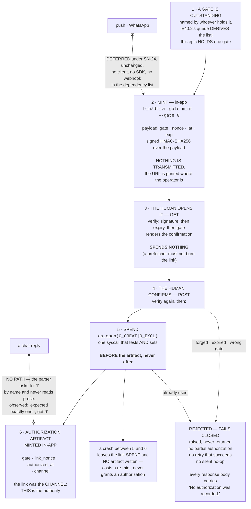

# E40.3 — How a Human Authorizes Something, End to End (D5)

**Acceptance criterion 1:** a reader can trace exactly how a human authorizes something, end to end.
This is that trace, followed by the five delegated design decisions and the threat model
(**acceptance criterion 4** — recorded so a later reader can disagree with them knowingly).

---

## 1. The trace



### 1.1 The same trace, as an operator performs it

Every line below is from the captured run of 2026-08-17 (full transcript in the demonstration
evidence).

**Step 1 — the daemon runs.** A human starts it once; it holds gates thereafter.

```
$ bin/drivr-gate --state-dir "$STATE" serve --port 8791
surface: http://127.0.0.1:8791  state=/tmp/tmp.WCx4g1Jlse/surface
routes: GET /approve/<gate>, POST /approve/<gate>
```

**Step 2 — mint, in-app.** Nothing is sent anywhere; the URL is printed where the operator already
is. Before any use, `authorizations/` **does not exist** — minting a link authorizes nothing.

```
$ bin/drivr-gate --state-dir "$STATE" mint --gate 'merge-pr-211' --base http://127.0.0.1:8791
http://127.0.0.1:8791/approve/merge-pr-211?t=v1.eyJleHAiOjE3ODcwMDY4NTgsImdhdGUiOiJtZXJnZS1wci0yMTEiLCJpYXQiOjE3ODcwMDU5NTgsIm5vbmNlIjoiQ0YyYjZpaE9HVFBwT3RTN1NGZk0tZyJ9.0ZdJctyPwIe9iAKLshgAvgbDLSBBVMLRKJR32tbOZYA
```

The token is `v1.<base64url(payload)>.<base64url(hmac)>`. The payload is **readable, not secret** —
it decodes to `{"exp":1787006858,"gate":"merge-pr-211","iat":1787005958,"nonce":"CF2b6ihOGTPpOtS7SFfM-g"}`.
It contains nothing the holder does not already know. The signature is what makes those fields
**unforgeable**, not what makes them hidden.

**Step 3 — the human opens it.** `GET` verifies and shows what is being approved. `spent/` still
does not exist afterwards.

```
HTTP/1.0 200 OK
<h1>Approve <code>merge-pr-211</code>?</h1><p>This link works once and then stops working.</p>
<form method="post" action="/approve/merge-pr-211"><input type="hidden" name="t" value="v1...."><button type=submit>Approve</button></form>
```

**Step 4-6 — the human confirms, once.** Verified, spent, and the record written in-app.

```
HTTP/1.0 200 OK
<h1>Authorized — <code>merge-pr-211</code></h1><p>Recorded in-app at <code>CF2b6ihOGTPpOtS7SFfM-g.authorization.json</code>.</p><p>The link is now spent.</p>
```

```json
{
  "authorized_at": "2026-08-17T22:32:38.349413Z",
  "channel": "signed-one-time-link",
  "gate": "merge-pr-211",
  "link_nonce": "CF2b6ihOGTPpOtS7SFfM-g"
}
```

**And then it stops working.**

```
HTTP/1.0 409 Conflict
<h1>Rejected — already-used</h1><p>this link has already been used</p><p><strong>No authorization was recorded.</strong></p>
```

### 1.2 Where the trace ends, and where it does not continue

The authorization is written into **Drivr's own state directory**. Filing it onward into a
governance repository is **not this epic's**, and doing it here would have the surface writing
governance artifacts on the strength of a click — a much larger claim than "hold gates". Binding
constraint 6 is the boundary: *the surface holds gates; it does not reason about whether to approve
them.*

Likewise the gate's *name* is supplied, not derived. **Computing the outstanding list is E40.2's**
(`bin/drivr-gate-queue`). This epic holds a gate; it does not decide which gates exist. The two
compose without either owning the other, which is why no second queue was built here.

---

## 2. The five delegated decisions, as decided

### Decision 1 — shape and transport: **local HTTP over the standard library, loopback-bound**

The deliverable is a *link*, and a link is a URL, so something must listen. It is `http.server`
rather than Flask or FastAPI because **`drivr`'s dependency list is an exclusion** — the mechanical
form of SN-27's spine and of SN-24's *"as agentic as we can, so the infrastructure is as light as
possible."* A framework would add a dependency tree to serve two routes taking one parameter between
them. S1 (re-measured 2026-08-17: no HTTP surface in either repository) means nothing was inherited,
so the cheap option is also the honest one.

Bound to `127.0.0.1`, never `0.0.0.0`.

**How this is headless-first while rendering HTML.** The test is what exists when nothing is
outstanding, and the answer is **nothing** — no index, no dashboard, no gate list, no navigation, no
status endpoint, no assets. Eleven non-gate paths return 404. The surface **cannot be browsed, only
arrived at**, by following one minted link to one named decision. A gate list here would be exactly
the dashboard SN-24 argues against — *a surface for watching, when the more agentic the machine, the
less there is to watch.*

**Why two routes rather than one.** A single `GET` that redeemed on sight would be redeemed by
anything that fetches a URL without a human deciding to: a browser prefetcher, a link scanner, an
accidental reload, a shell-history replay. The link would be genuinely spent while the claim *"the
human used it once"* was false **and unfalsifiable**. Splitting them keeps the mutation behind a
deliberate act — which is the act this trace is about.

### Decision 2 — signing: **HMAC-SHA256, standard library, key on disk at `0600`**

**No cipher was invented.** `hmac` + `hashlib` from the platform's own library, compared with
`hmac.compare_digest` so verification does not leak the expected digest through timing. The key is
32 bytes from `secrets.token_bytes` (the CSPRNG, not `random`), written with `O_CREAT|O_EXCL` at
mode `0600` in the surface's state directory, generated on first use.

**What the signature buys:** the surface can tell that *it* minted the token and that **no field has
been edited since**. The other three bindings are all payload fields, and an unsigned payload field
is a suggestion — a link for a trivial gate could be retyped into one that matters, or its expiry
pushed out a year. Two tests demonstrate exactly that
(`test_editing_the_gate_after_minting_is_rejected`, `test_extending_the_expiry_after_minting_is_rejected`).

**What it does not buy: single use.** A signature verifies the tenth time exactly as it verified the
first — demonstrated by `test_the_signature_still_verifies_after_the_link_is_spent`, where a spent
token remains cryptographically perfect. One-time is server-side state, and nothing else.

**Verification order is load-bearing:** signature → expiry → gate. Expiry and gate live *in the
payload*, and until the signature is checked the payload is attacker-supplied text; checking "is
this expired?" against an unverified `exp` is reading a claim as a fact. Asserted by
`test_signature_is_checked_before_expiry_and_before_the_gate`, because it is what a later "tidy the
guard clauses" refactor reorders without noticing.

### Decision 3 — expiry window: **fifteen minutes**

The link travels no further than the operator's own screen — gates are in-app only and push is
deferred — so the window need not cover a notification reaching someone elsewhere. It must cover one
thing: an operator already looking at the gate deciding and clicking.

Fifteen minutes is long enough that a real interruption does not cost a re-mint, and short enough
that the copy left in scrollback, shell history or browser history is dead before anyone stumbles on
it. **The asymmetry is the argument:** re-minting is free and unlimited, so too short costs one
keystroke while too long leaves a live credential lying around. Configurable per mint (`--ttl`).

### Decision 4 — where it lives: **Drivr**

It consumes E40.2's queue and sits beside E40.1's scheduler, both in `drivr`; SN-24 names Drivr as
the coordination daemon **plus gates plus the thin surface**. `ai-project-system`'s daemon is a
per-project artifact router, not a fleet coordinator. **Evidence is committed in
`ai-project-system` regardless, since `drivr` has no git remote.**

### Decision 5 — inbound text channel: **none**

Answered in full in the no-chat-reply account. SN-24 decided it already: *a daemon has no speech at
all — only gates.*

---

## 3. The threat model, stated rather than implied

**A single-operator local system.** Loopback-bound, no accounts, no roles, no remote access.
Widening any of those is a **Brief-level question**, not this epic's.

**The adversary is not a network attacker.** It is the system's own leakage: a link in terminal
scrollback, in shell history, in a browser's address bar and history, or in a log — and a second
process on the same machine reading any of those. Against *that* adversary the useful properties are
the ones built: the link dies on its own, it approves exactly one named thing, and it works exactly
once. An operator who finds a stale link in scrollback and replays it gets a rejection, not a silent
second approval.

**What this model does not defend against, said plainly:** anything that can read the signing key
can mint any link it likes. The key is a file protected by file permissions and nothing else. On a
single-operator machine, a process that can read that file can read everything else the operator
owns, so a stronger key store would be defending a door in the middle of an open field.

**If this system ever grows a second user or a remote surface, that reasoning expires with it.** It
is written down so the next reader is deciding, not inheriting.

---

## 4. Prior art: what was read, and why it was not followed

Spec S2 pointed at `lib/artifact_router.py`'s `IdempotencyTracker` (read at lines 24-71,
2026-08-17) as prior art for single-processing an inbound event — explicitly *"a pointer, not an
instruction."* It was read and **not** followed, for two reasons that matter more for approval than
for routing:

1. **Check-then-act.** `is_processed()` and `mark_processed()` are two calls with a gap. For routing
   a lost race duplicates a trigger; for approval it means **one act of the human producing two
   authorizations** — the exact property one-time exists to prevent.
2. **`_save()` swallows failures** (`except Exception: pass`). A full disk means the spend mark is
   never written and the call returns normally — so the next use of the same link succeeds. That is
   the prohibited *"silent no-op"*, with the roles reversed and worse: not a failure misread as
   approval, but a genuine approval, twice.

Neither is a defect in the router — a duplicated trigger is cheap and a best-effort tracker is a
reasonable trade for its job. **They are defects in this job.**

Used instead: `os.open(path, O_CREAT|O_EXCL)` — **one syscall that both tests and sets**, with no
window between check and act because there is no check, and which raises rather than absorbing a
write failure. Verified by `test_spend_is_atomic_under_concurrency` (exactly 1 winner of 40
concurrent spends) and `test_a_spend_that_cannot_be_written_raises_rather_than_passing`.

**And the ordering: spend before minting, never after.** Mint-then-spend would leave a crash in
between with the artifact written and the link still live — the same link authorizing again.
Spend-first inverts the failure into a lost act the human must re-mint. **That is what "fails closed"
reduces to when spelled out**, and the mechanism is ordering — the same shape as E39.1's finding one
epic over.
