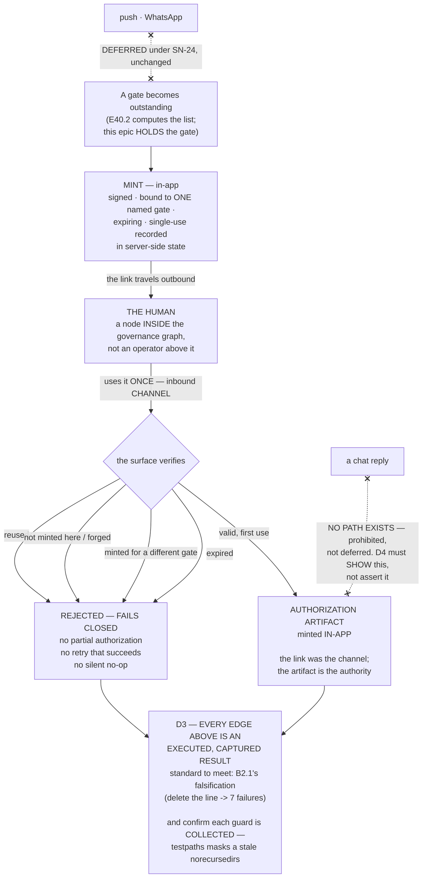

# Epic E40.3 — Headless-First Thin Surface and Signed One-Time-Link Approval

## Context

**SN-24 is not amended, and its inversion holds:** *a dashboard is a surface for watching; the more
agentic the machine, the less there is to watch.* **Headless-first.** The surface exists to hold
gates, not to be looked at.

**The human is a node inside the governance graph, not an operator above it.** That framing is why
approval has a *shape* requirement at all: an operator above the system may say "yes" however they
like; a node inside it participates through a defined edge.

---

## Problem Statement

**Approval is the one place where convenience and authority collide, and convenience wins by
default.**

A chat reply is the most convenient possible approval channel and it is **prohibited, not deferred**.
The reason is structural, not stylistic: a chat reply leaves the authorization **unbound** — to a
specific gate, to a single use, to a verifiable origin. It authorizes *whatever the reader thinks was
being asked*, once or many times, with no artifact minted in the place that holds the record.

**The link is the inbound channel. It is not the authority.** The authorization artifact is still
minted in-app. An epic that treats the link as the authorization has rebuilt the chat reply with
extra steps.

---

## ⚠ Planning-time measurements

Measured by the Milestone Chat on **2026-08-16**, on branch `milestone/M40` and in `drivr` @
`715099c`. **Layer, time and scope stated per `P11-GH-2`.**

### S1 — There is no HTTP surface in either repository. This is greenfield.

`grep -rln 'flask\|fastapi\|http.server\|aiohttp\|uvicorn'` across `ai-project-system` matches only
two integration **test** files (`tests/integration/test_run_dev_agent_adapter.py`,
`test_run_qa_agent_adapter.py`), and `drivr`'s `pyproject.toml` declares no web dependency.

**Consequence:** the surface is built from nothing, so **every property it has is one this epic chose
and must justify.** There is no inherited framework behaviour to blame or to lean on. **Headless-first
is therefore cheap to honour** — the default state is already no UI.

### S2 — A daemon and an artifact router already exist here

`bin/ai-project-daemon` and `lib/daemon_extensions.py` run a background loop that monitors and routes
artifacts via `lib/artifact_router.py` (with an `IdempotencyTracker`). **Prior art for
single-processing an inbound event exists in this repository** and is worth reading before inventing
one-time semantics from scratch.

**This is a pointer, not an instruction.** Whether the surface reuses it, lives in Drivr beside it,
or ignores it is §Delegated decision 4.

### S3 — Drivr's own suite discipline is a live example of the trap this epic must avoid

`drivr/pyproject.toml` sets `testpaths = ["tests"]` **and** `norecursedirs = [".governance", ".git"]`,
with a comment explaining that without the latter, `pytest` would collect the vendored governance
suite and *"drivr's baseline would silently be someone else's number — exactly the wrong-layer error
`P11-GH-2` names."*

**M38 recorded the sharp edge:** `testpaths` **masks** a stale `norecursedirs`, so a rotted guard
produces no signal. **This epic's negative tests are guards. Confirm each is collected and actually
runs** — a green total proves nothing about a test that silently stopped being collected.

---

## Goals

1. **A thin surface, headless-first, holding gates in-app only.**
2. **Signed one-time-link approval** — minted in-app, **used once**, **shown to fail on reuse**.
3. **No path exists by which a chat reply authorizes** — **shown, not asserted.**
4. **The authorization artifact is still minted in-app** — the link carries the human's act inbound;
   it does not replace the record.

---

## Deliverables

### D1 — The thin surface, headless-first

**Gates in-app only.** No push, no WhatsApp (**deferred under SN-24, unchanged**). **Single-window is
explicitly not required** — a nice-to-have under SN-24 and not a deliverable.

**Headless-first means the surface's primary mode is not a screen.** If it renders anything, that is
a consequence of holding gates, not the point of it.

### D2 — Signed one-time-link approval

The link must be **bound in four ways**, and each is separately testable:

| Property | Meaning | Negative test owed (D3) |
|---|---|---|
| **Signed** | The surface verifies it minted this link. | A link the surface did not mint is **rejected**. |
| **One-time** | Single use, enforced by **server-side state**, not client convention. | A **second** use of a valid link is **rejected**. |
| **Bound to one gate** | It approves **one named decision**, not "whatever is pending". | A link minted for gate A **cannot** approve gate B. |
| **Expiring** | It stops being valid on its own. | An expired link is **rejected**. |

**The authorization artifact is still minted in-app.** The link is the **inbound channel**; the record
is made in the place that holds records.

> **A rejected link must fail closed and say so.** A malformed, expired, reused or unrecognised link
> results in **no authorization** — never a partial one, never a retry that succeeds, and never a
> silent no-op that a caller could mistake for approval.

### D3 — The demonstrations, captured

**Hard Constraint:** *"approval is a signed one-time link" means a link was minted, used once, and
shown to fail on reuse.* **A phase closes on evidence or it does not close.**

Capture and commit **in this repository**:
1. A link **minted**.
2. That link **used once, successfully**, with the resulting authorization artifact.
3. That same link **used again and rejected** — the rejection shown.
4. The other three negative tests from D2's table.

**Each as an executed result, not a described intention.** This phase's standard for a guard is
`B2.1`'s: **the guard was falsified by deleting the line and observing 7 failures.** Meet it.

### D4 — The no-chat-reply proof

**An explicit statement that no path exists by which a chat reply authorizes** — and, **if the
surface has any inbound text channel at all, a demonstration that it cannot authorize.**

**Shown, not asserted.** The acceptance bar is adversarial: *no reader can find a second path by
which authorization could arrive.* Write the account so a reader can try and fail, rather than one
that asks to be believed.

### D5 — The end-to-end trace

**A reader can trace exactly how a human authorizes something, end to end** — from the gate becoming
outstanding, through minting, through the human's single use, to the artifact minted in-app.

---

## Design Decisions Delegated to This Epic

Decide each, document the reasoning, proceed.

1. **The surface's shape and transport** (local HTTP, a CLI, a file-drop — S1 means nothing is
   inherited). **Headless-first constrains this; it does not decide it.**
2. **The signing scheme and where the key lives.** **Do not invent a cipher** — use a standard,
   well-reviewed primitive from the platform's own library. **Record what you chose and why**, and
   note that the threat model here is a single-operator local system, not a public internet service —
   **state the threat model rather than leaving it implied.**
3. **Expiry window**, with reasoning.
4. **Where it lives** — Drivr, or beside the existing daemon (S2). **Evidence is committed in
   `ai-project-system` regardless**, since `drivr` has no git remote.
5. **Whether the surface has any inbound text channel at all.** **Having none is the simplest way to
   satisfy D4** — and is a legitimate, reasoned outcome.

---

## Definition of Done

- [ ] **A link was minted, used once, and demonstrated to fail on reuse** — captured and committed
- [ ] **The other three negative tests pass**: unminted/forged rejected, cross-gate rejected, expired
      rejected
- [ ] Every rejection **fails closed** — no partial authorization, no silent no-op
- [ ] **No chat-reply authorization path exists — shown, not asserted**
- [ ] **The authorization artifact is minted in-app**, and the link is documented as the channel, not
      the authority
- [ ] **Gates are in-app only; push and WhatsApp untouched** (SN-24 deferral unchanged)
- [ ] Each negative test is **confirmed collected and actually running** (S3 — a rotted guard is
      invisible)
- [ ] A reader can trace the authorization path end to end (D5)
- [ ] Suites green, **baselines named per repo**: this repo **549** (`PYTHONPATH=. pytest -q`), Drivr
      **357** (bare `pytest`), each with new total and delta
- [ ] Delivery Notice produced; PR opened to `milestone/M40`; **stop and await authorization**

---

## Acceptance Criteria

1. **A reader can trace exactly how a human authorizes something, end to end.**
2. **No reader can find a second path by which authorization could arrive.**
3. **Reuse of a link fails, demonstrated** — not described.
4. **The threat model and signing choice are recorded**, so a later reader can disagree with them
   knowingly.

---

## Binding Constraints (reproduced, not cited)

**3. Inbound approval is a signed one-time link. A chat reply NEVER authorizes — prohibited, not
deferred.** Gates are **in-app only**. Push and WhatsApp remain **deferred** under SN-24.
**Single-window is a nice-to-have, not a requirement.** **The human is a node inside the governance
graph, not an operator above it.**

> **The Hard Constraint names this specifically: "nothing may weaken constraint 3 — an approval path
> that accepts a chat reply, even as a convenience, is prohibited rather than discouraged."** A
> convenience path added "just for local testing" is the shape this fails in. If you need one to
> test, **it must not exist in the delivered artifact**, and you must show it does not.

**5. Mode is not authority.** Running unattended widens what an instance *does*, never what it may
*authorize*. Stage-2 acceptance and merge authorization remain human-keyed in every mode.

**6. Drivr still rents.** The surface holds gates; it does not reason about whether to approve them.

**Hard Constraint — the last milestone's drift is declaring rather than measuring.**

**Constraint 8 (conditional):** a Structural diagram is required **if this epic amends a normative
document in this repo.** If the delivery touches no normative document, **no diagram is owed** —
though D5's end-to-end trace may be clearer as one.

---

## Method Obligations

1. **`P11-GH-2` — state the layer, time and scope of every verification.**
2. **G2 — the reviewer re-measures.** Re-take S1–S3 rather than inheriting them.
3. **G1 — remove derivation steps**; quote rejection output verbatim rather than summarising it.
4. **Cite by artifact + defect, never by ordinal.** **`P11-GH-3` is contested and unallocated — do
   not allocate it.**
5. **Cross-repo claims carry a date or commit anchor.**
6. **Every inventory is a floor** — including your own inventory of authorization paths in D4.
7. **Check the branch before every commit; verify pushes at `origin`** (not performable in `drivr`).
8. **Commit every artifact you author.**
9. **Run it, don't read it.** **Every one of D3's demonstrations is an executed result.**

---

## Out of Scope

- **Push notifications and WhatsApp.** **Deferred under SN-24, unchanged.** Do not build them, do not
  prepare for them.
- **A single-window unified surface.** Explicitly **not a requirement**.
- **Any approval path that accepts a chat reply.** **Prohibited, not deferred.**
- **Remote or multi-user access, accounts, or roles.** The threat model is a single-operator local
  system; **widening it is a Brief-level question, not this epic's.**
- **Computing the gate queue** — E40.2. This epic **holds** gates; it does not derive the list.
- **Dispatch** — E40.1. **Competing-model review** — E40.4. **The routing guard** — E40.5.
- The §4-invalid enrolled configs; the `bin/ai-project-init` defects; `P10-GH-10`; `P9-GH-3`;
  `P8-GH-2`; ComfyUI precision; the sidekick identity question.

---

## Dependencies

- **Independent; may run parallel** to E40.1, E40.2 and E40.4.
- **E40.2's queue** is a natural consumer relationship but **not a blocking dependency** — this epic
  can hold a gate without deriving the list. **If you find yourself needing E40.2's output to
  proceed, say so rather than building a second queue.**
- **Repositories:** `drivr` and/or `ai-project-system`; **evidence committed in
  `ai-project-system`.**

---

## Visual Bindings

**Visual binding**
- **Link:** (inline — Structural diagram; no hosted link needed per AOG §17.3/§17.5)
- **What:** diagram
- **Level:** Epic
- **State:** proposed

- **Description:** The authorization path end to end: a gate is held in-app, a link is minted signed,
  gate-bound, expiring and single-use, the human uses it once as an **inbound channel**, and the
  authorization **artifact is still minted in-app** — the link never being the authority. All four
  rejection edges fail closed, a chat reply has no path at all, and push/WhatsApp remain deferred
  under SN-24. Every edge is owed as an executed demonstration, to `B2.1`'s falsification standard.
  Proposed-track Structural diagram (AOG §17.3/§17.6), Mermaid, no ComfyUI.

---

## Amendment History

| Version | Date | Change |
|---|---|---|
| 1.0.2 | 2026-08-17 | **Second baseline refresh, pre-launch.** Drivr moved again when E40.2 merged (PR #209, `efa1338`): **319 → 357**, Drivr @ `252f2f9`. This repo stays **549** — E40.2 added no tests here. **These two epics are parallel, so whichever lands second will find Drivr moved again; that is expected.** Re-measure at your start (G2) and report the delta you actually observe — the figure here is a floor with a date, not a constant. |
| 1.0.1 | 2026-08-17 | **Baseline refresh, applied before launch so it is not a mid-flight amendment (`P11-GH-1`).** Suite baselines moved while M40 executed: this repo **510 → 549** (E40.5 merged at `724c66a`, adding `tests/test_merge_authorization_routing_guard.py`, 39 tests) and Drivr **249 → 319** (E40.1 merged at `e4a1388`, Drivr @ `6332674`). Both prior figures were correct at their dates; neither is correct now. No other change. |
| 1.0.0 | 2026-08-16 | Initial spec. Records S1 (no HTTP surface exists in either repo — greenfield, so every property is chosen and must be justified), S2 (an artifact-routing daemon with an idempotency tracker already exists as prior art for one-time semantics), and S3 (Drivr's own `testpaths`/`norecursedirs` comment as a live instance of the masked-guard trap these negative tests must avoid). Expands the milestone spec's single "used once / fails on reuse" demonstration into **four separately testable binding properties**, each with its own negative test. |
