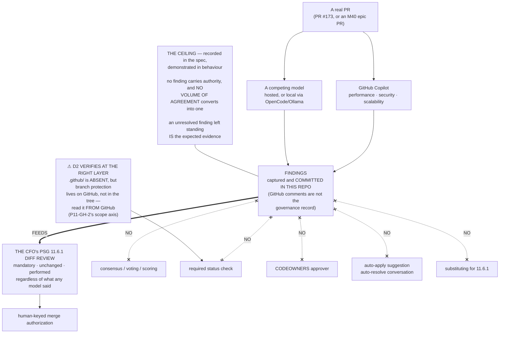

# Epic E40.4 — Competing-Model PR Review, Findings Only

## Context

SN-27 decision 7 un-parks an item P10 carried unowned: **GitHub Copilot as a PR reviewer plus at
least one competing model**, looking closely for **performance, security and scalability**.

**It arrives with an authority ceiling already attached, and the ceiling is the point of the epic.**

> **PSG §11.6.1 makes the CFO the mandatory diff reviewer.** Competing-model review **feeds that
> review. It does not substitute for it, dilute it, or create a consensus path that resolves
> anything.** No finding from any model carries authority, and **no volume of agreement between
> models converts into one.**

This is ***mode is not authority*** applied to a new participant class. The framework has spent three
phases establishing that what an instance *is* never determines what it may *authorize*; this epic
admits a new kind of participant and must not quietly make it the exception.

---

## Problem Statement

**Review tools are built to be believed.** Their whole affordance is to produce findings that look
actionable, in a UI whose surrounding controls — resolve, apply suggestion, request changes, required
checks — are designed to convert a finding into a change with one click.

**The risk is not that a model says something wrong. It is that the configuration makes a model's
opinion load-bearing without anyone deciding that it should be.** A required status check, a
CODEOWNERS entry, an auto-applied suggestion, an auto-resolved conversation: each is a small
convenience, and each converts findings into authority **without any human intending it.**

**So this epic's hard part is the configuration, not the review**, and its acceptance bar is
adversarial: *the configuration cannot be read as granting review authority.*

---

## ⚠ Planning-time measurements

Measured by the Milestone Chat on **2026-08-16**, on branch `milestone/M40`. **Layer, time and scope
stated per `P11-GH-2`.**

### R1 — There is no `.github/` directory in this repository at all

`ls -a .github/` → **absent**. No workflows, no `CODEOWNERS`, no PR templates, no review
configuration of any kind.

**Two consequences:**
1. **Nothing currently grants any automated reviewer authority**, so the starting position is clean
   and the epic's job is to keep it that way while adding reviewers.
2. **Anything this epic adds is the first of its kind here** and will be read by later readers as the
   precedent. **Write it to be read that way.**

### R2 — Copilot PR review is a GitHub-side setting, not a repository file

**This is the CFO-side dependency the milestone spec names, and it is genuinely outside this
repository.** Enabling Copilot code review is a repository/organization setting on GitHub; an epic
working in the working copy **cannot** turn it on.

> **Surface this on day one, not at delivery.** If the setting is not enabled and the CFO has not
> enabled it, **the epic is blocked on an external action** — that is an escalation the moment it is
> known, not a discovery at closure. **M40 is the final milestone; a blocker found at closure is a
> phase that does not close.**

### R3 — One PR is open, and it is the phase delivery PR

`gh pr list --state open` → **PR #173**, *"P11 — Drivr: Coordination over Rented Execution
(long-lived phase branch)"*, `phase/P11`, open since **2026-08-03**.

**It is a legitimate review target and it is a loaded one.** #173 is exactly the PR that PSG §11.6.1's
CFO diff review applies to at phase closure (§5C step 6), so findings on it **feed the review they
are meant to feed**. It is also very large.

**The M40 epic PRs** (E40.1 / E40.2 / E40.3 / E40.5 → `milestone/M40`) are the other candidates:
smaller, fresher, and they exercise the reviewers on code written during this milestone. **The epic
chooses; the spec does not.**

---

## Goals

1. **GitHub Copilot plus at least one competing model review at least one real PR**, looking for
   **performance, security and scalability**.
2. **The findings-only ceiling is recorded in this spec** — it is, below — **and demonstrated in
   behaviour.**
3. **Nothing is auto-applied or auto-resolved**, and that is shown.
4. **The configuration cannot be read as granting review authority.**

---

## The Authority Ceiling (recorded here, per the milestone spec's requirement)

**This section is a deliverable, not preamble.** The milestone spec requires the ceiling *"recorded
in the epic spec, not assumed."* It is recorded here and it is binding on the delivery:

1. **No finding from any model carries authority.** Not Copilot's, not the competitor's, not one this
   framework's own tooling produces.
2. **No volume of agreement converts into authority.** Two models agreeing is two opinions, not a
   verdict. **There is no consensus path.**
3. **No blocking vote.** No model's review may be a **required status check**, a **CODEOWNERS**
   approver, or anything else that can prevent or compel a merge.
4. **No substitution.** Findings **feed** the CFO's PSG §11.6.1 diff review. They do not replace it,
   shorten it, or pre-satisfy it. **The CFO reviews the diff regardless of what any model said.**
5. **No auto-application.** No suggestion is committed, no conversation resolved, and no change made
   on a model's say-so without a human act.
6. **Findings are inputs to a human decision, and unresolved findings are not failures.** A finding
   nobody acted on is a normal outcome, not a defect to be cleaned up before merge.

---

## Deliverables

### D1 — Copilot plus at least one competing model, configured

Reviewing for **performance, security and scalability**. **The competitor is delegated** (§Delegated
decisions 1) — a second hosted reviewer and a local model driven through the lane this phase already
built are both admissible.

### D2 — The ceiling demonstrated in behaviour, not only stated

**Configuration evidence**, captured and committed:
- **No required status check** is a model review.
- **No `CODEOWNERS`** entry routes approval to a model.
- **No automation applies suggestions or resolves conversations.**
- **Branch protection, as actually configured**, read and recorded — **not assumed from the fact that
  nothing was deliberately added.** R1 says `.github/` is absent; **branch protection lives on
  GitHub, not in the tree**, so it must be read from GitHub.

### D3 — At least one real PR reviewed, findings captured

**A real PR** (R3 names the candidates), with the findings **captured and committed in this
repository** — GitHub-side review comments are not durable governance record, and this phase has paid
for the difference between a thing existing and a thing being tracked.

### D4 — Evidence that nothing was auto-applied or auto-resolved

**Hard Constraint:** the claim *"no finding changed anything on its own authority"* is **measured or
it is not made.** Show the PR's state before and after review: **what the models said, and what did
not change because they said it.**

**An unresolved finding left standing is the expected evidence**, not an embarrassment.

### D5 — The precedent note

R1 means this is the first review configuration in the repository. **Record, briefly, what a later
reader must not do** — add a model as a required check, add it to `CODEOWNERS`, or treat agreement
between models as a resolution. **The next person to touch this config will read whatever you leave.**

---

## Design Decisions Delegated to This Epic

Decide each, document the reasoning, proceed.

1. **Which competing model**, and how it is driven. **A local model through OpenCode/Ollama is
   admissible and coherent with the phase spine** (Drivr rents execution) and **avoids a second
   external dependency**. A second hosted reviewer is equally admissible. **State the choice and its
   cost.**
2. **Which PR is reviewed** (R3). Size versus relevance is a real trade-off; **state which you
   optimised for.**
3. **Where findings are captured** in this repository, and in what shape.
4. **Whether review is triggered automatically or invoked per PR.** **Automatic triggering is
   admissible; automatic *acting* is not.** Keep the distinction explicit in whatever you build.

---

## Definition of Done

- [ ] **Two or more competing models review at least one real PR**, findings captured **and committed
      in this repo**
- [ ] **The findings-only ceiling is recorded in this spec** (it is — §The Authority Ceiling) **and
      demonstrated in behaviour**
- [ ] **No finding changed anything on its own authority** — shown, with before/after state
- [ ] **No model review is a required status check**, a `CODEOWNERS` approver, or otherwise able to
      block or compel a merge — **read from GitHub's actual configuration**, not inferred from the
      tree
- [ ] **No auto-application or auto-resolution** of suggestions or conversations
- [ ] The precedent note (D5) is recorded
- [ ] **If Copilot review cannot be enabled, that was escalated when known** — not reported at
      closure (R2)
- [ ] Suites green, **baselines named per repo**: this repo **549** (`PYTHONPATH=. pytest -q`), Drivr
      **319** (bare `pytest`) if touched
- [ ] Delivery Notice produced; PR opened to `milestone/M40`; **stop and await authorization**

---

## Acceptance Criteria

1. **A reader can see the findings and confirm none of them resolved anything.**
2. **The configuration cannot be read as granting review authority** — verified against GitHub's
   actual settings, not against the absence of a file.
3. **A reader can state what feeds the CFO's §11.6.1 review and what replaces it** — and the answer
   to the second is *nothing*.

---

## Binding Constraints (reproduced, not cited)

**4. Competing-model review is findings-only and holds no authority.** It **feeds** the CFO's
§11.6.1 diff review; it does not substitute for it, dilute it, or create a consensus path. **No
finding from any model carries authority, and no volume of agreement between models converts into
one.** *Mode is not authority*, applied to a new participant class.

**5. Mode is not authority.** Stage-2 acceptance and merge authorization remain human-keyed in every
mode.

**Hard Constraint — the last milestone's drift is declaring rather than measuring.** *"Nothing was
auto-applied"* means the before/after state was captured and shown. **A phase closes on evidence or
it does not close.**

**Constraint 8 (conditional):** a Structural diagram is required **if this epic amends a normative
document in this repo.** Adding review configuration is not amending a normative document — **if the
delivery touches none, no diagram is owed.**

---

## Method Obligations

1. **`P11-GH-2` — state the layer, time and scope of every verification.** **D2 is a live instance:
   reading the tree tells you about the tree; branch protection is on GitHub. Verify at the right
   layer.**
2. **G2 — the reviewer re-measures.**
3. **G1 — remove derivation steps**; quote findings verbatim rather than paraphrasing them.
4. **Cite by artifact + defect, never by ordinal.** **`P11-GH-3` is contested and unallocated — do
   not allocate it.**
5. **Cross-repo claims carry a date or commit anchor.**
6. **Every inventory is a floor** — **including your inventory of ways the configuration could grant
   authority.**
7. **Check the branch before every commit; verify pushes at `origin`.**
8. **Commit every artifact you author.** **GitHub-side comments are not the governance record.**
9. **Run it, don't read it.**

---

## Out of Scope

- **Acting on the findings.** Surfacing a real performance, security or scalability issue is a
  **finding**, and remediation is a separate decision. **Report; do not fix.** If a finding looks
  serious enough to demand action, **escalate it — do not silently absorb it into this epic.**
- **Any consensus, voting, or scoring mechanism** across models. **Prohibited by constraint 4**, not
  merely unnecessary.
- **Making any model review a merge gate**, in any form.
- **Changing PSG §11.6.1** or the CFO's diff-review obligation.
- Dispatch (E40.1), the gate queue (E40.2), the surface (E40.3), the routing guard (E40.5).
- The §4-invalid enrolled configs; the `bin/ai-project-init` defects; `P10-GH-10`; `P9-GH-3`;
  `P8-GH-2`; ComfyUI precision; the sidekick identity question.

---

## Dependencies

- **Independent of the other M40 epics; may run parallel.**
- **⚠ CFO-side configuration, outside this repository (R2)** — enabling Copilot review on the repo.
  **This is the epic's one real external dependency. Confirm it on day one.**
- **If the reviewed PR is an M40 epic PR** (R3), that epic must have opened its PR first — a
  scheduling relationship, not a blocking dependency. **PR #173 is available regardless.**

---

## Visual Bindings

**Visual binding**
- **Link:** (inline — Structural diagram; no hosted link needed per AOG §16.3/§16.5)
- **What:** diagram
- **Level:** Epic
- **State:** proposed

- **Description:** Competing-model PR review as a **feed** into the CFO's mandatory PSG §11.6.1 diff
  review, with the five paths by which configuration could silently convert findings into authority
  shown as prohibited: consensus, required checks, CODEOWNERS, auto-application, and substitution.
  The verification warning is that `.github/` being absent proves nothing about branch protection,
  which lives on GitHub — reading the tree would be verification at the wrong layer. Proposed-track
  Structural diagram (AOG §16.3/§16.6), Mermaid, no ComfyUI.

---

## Amendment History

| Version | Date | Change |
|---|---|---|
| 1.0.1 | 2026-08-17 | **Baseline refresh, applied before launch so it is not a mid-flight amendment (`P11-GH-1`).** Suite baselines moved while M40 executed: this repo **510 → 549** (E40.5 merged at `724c66a`, adding `tests/test_merge_authorization_routing_guard.py`, 39 tests) and Drivr **249 → 319** (E40.1 merged at `e4a1388`, Drivr @ `6332674`). Both prior figures were correct at their dates; neither is correct now. No other change. |
| 1.0.0 | 2026-08-16 | Initial spec. Records R1 (no `.github/` at all — clean start, and whatever is added becomes the repository's precedent), R2 (Copilot review is a GitHub-side setting the epic cannot enable itself — the CFO-side dependency, to be surfaced on day one rather than discovered at closure), and R3 (PR #173 is the only open PR and is the same PR §11.6.1 applies to at phase closure). Carries the authority ceiling **as a recorded spec section**, per the milestone spec's requirement that it be recorded and not assumed. |
