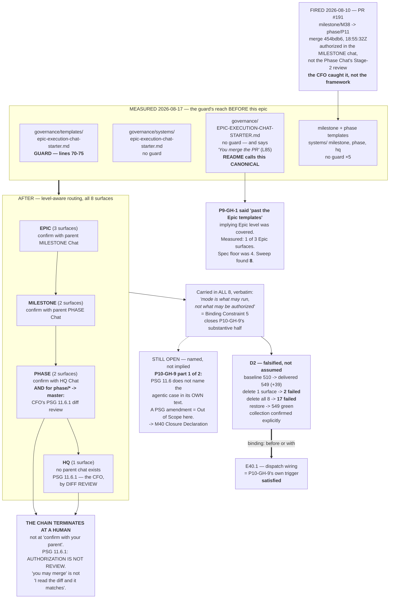

# Delivery Notice: P11-M40-E40.5 — The Merge-Authorization Routing Guard

> **`merge_details` is partially unfillable at delivery time.** A Delivery Notice is produced *before*
> merge, but the template's `merge_commit` / `merge_timestamp` / `merge_strategy` fields describe a
> merge that has not happened. This is the known defect **`P10-GH-4`**, restated here rather than
> filled with invented values.

## Summary

**The merge-authorization routing guard now reaches every starter surface a chat reads as its own
operating contract — eight of them, established by sweep — level-aware and correct per level, backed
by a regression test that has been falsified, not assumed.**

`P9-GH-1` is **closed**. `P10-GH-9`'s substantive half is **closed**; its second half is a PSG
amendment that this Epic's spec places Out of Scope, and is **named as remaining** rather than left
implied.

---

## Verification layer, time and scope (`P11-GH-2`)

| Axis | Value |
|---|---|
| **Layer** | **Literal file text** — `find`, `grep -n`, `sha256sum`, and `pytest` execution. Not a rendered view. |
| **Time** | **2026-08-17** |
| **Scope** | `ai-project-system` only, branch `epic/P11-M40-E40.5` from `milestone/M40` @ `d822db4`. **Drivr untouched — no Drivr figure is reported.** |
| **Push** | Verified at `origin` with `git ls-remote`, not a local ref read. |

---

## Deliverables

### D1 — The guard, extended to every surface the sweep established ✅

| # | Surface | Level | Routing named |
|---|---|---|---|
| 1 | `governance/templates/epic-execution-chat-starter.md` | Epic | parent **Milestone Chat**'s Stage-2 review |
| 2 | `governance/systems/epic-execution-chat-starter.md` | Epic | parent **Milestone Chat**'s Stage-2 review |
| 3 | `governance/EPIC-EXECUTION-CHAT-STARTER.md` | Epic | parent **Milestone Chat**'s Stage-2 review |
| 4 | `governance/templates/milestone-execution-chat-starter.md` | Milestone | parent **Phase Chat**'s Stage-2 review |
| 5 | `governance/systems/milestone-execution-chat-starter.md` | Milestone | parent **Phase Chat**'s Stage-2 review |
| 6 | `governance/templates/phase-execution-chat-starter.md` | Phase | **HQ Chat** + **CFO §11.6.1 diff review** for `→ master` |
| 7 | `governance/systems/phase-execution-chat-starter.md` | Phase | **HQ Chat** + **CFO §11.6.1 diff review** for `→ master` |
| 8 | `governance/systems/hq-execution-chat-starter.md` | HQ | **the CFO** — no parent chat exists |

**The Epic template's existing guard was not weakened** (DoD item 2). Every clause of the P9 text is
retained verbatim, including the P9-M31 precedent parenthetical. Two additions: the parent is now
**named** (`the parent Milestone Chat`) instead of the generic *"the parent chat"*, and the mode
clause was appended. Nothing removed.

**The Phase and HQ rows, quoted verbatim (G1 — no derivation steps).** These are the two the spec
flagged as easiest to write carelessly, because a guard that says "confirm with your parent" and
stops is incomplete for `phase/* → master`:

From `governance/templates/phase-execution-chat-starter.md`:

> **For a `phase/* → master` delivery, confirming with HQ is not sufficient on its own:**
> PROJECT-SYSTEM-GUIDELINES.md **§11.6.1** makes the **CFO (Layer 8) the mandatory diff reviewer** of
> HQ-authored output, and **authorization is not review** — "you may merge this" is not "I have read
> the diff and it matches". Do not treat an HQ authorization as standing in for that review.

From `governance/systems/hq-execution-chat-starter.md`:

> HQ is the top of the chat hierarchy, so the routing here is not "confirm with your parent" — **HQ
> has no parent chat, and therefore no chat-level reviewer for its own output.** … **HQ MUST NOT
> merge its own delivery on authorization alone**, and MUST state plainly in any such PR that HQ
> authored it and no chat-level reviewer exists for it.

**Binding Constraint 5 is carried in all eight**, verbatim and identically:
`mode is what may run, not what may be authorized`. No instance can be read as granting a chat the
ability to self-authorize when it judges the routing acceptable.

### D2 — A falsifiable regression test ✅ **falsified**

`tests/test_merge_authorization_routing_guard.py` — 39 tests.

**Collection confirmed explicitly**, because M38 recorded that a rotted guard is invisible behind a
green total (`testpaths` masking a stale `norecursedirs`):

```
$ PYTHONPATH=. pytest --collect-only -q tests/test_merge_authorization_routing_guard.py
… 37 tests collected in 0.01s        # at time of check; 39 in the delivered state
```

**Sample node IDs** (parametrized per surface):

```
tests/test_merge_authorization_routing_guard.py::test_surface_carries_refusal_clause[governance/templates/milestone-execution-chat-starter.md-phase chat]
tests/test_merge_authorization_routing_guard.py::test_surface_states_mode_is_not_authority[governance/systems/hq-execution-chat-starter.md-cfo]
tests/test_merge_authorization_routing_guard.py::test_surface_names_correct_routing_destination[governance/templates/phase-execution-chat-starter.md-hq chat]
```

**The falsification record — observed pass/fail transitions, full suite each time:**

| # | State | Result |
|---|---|---|
| 0 | Baseline on `milestone/M40`, before any change | **510 passed** |
| 1 | Delivered state | **549 passed** (+39) |
| 2 | Guard deleted from **one** surface (`templates/milestone-…`) | **2 failed, 547 passed** |
| 3 | Restored | 549 passed |
| 4 | Guard deleted from **all eight** surfaces | **17 failed, 532 passed** |
| 5 | Restored | **549 passed** |

**Failure messages at step 2, quoted verbatim:**

```
FAILED tests/test_merge_authorization_routing_guard.py::test_surface_carries_refusal_clause[governance/templates/milestone-execution-chat-starter.md-phase chat]
FAILED tests/test_merge_authorization_routing_guard.py::test_surface_states_mode_is_not_authority[governance/templates/milestone-execution-chat-starter.md-phase chat]

E  AssertionError: governance/templates/milestone-execution-chat-starter.md is missing the
   mode-is-not-authority clause ('mode is what may run, not what may be authorized').
   Restore it: an agentic instance holds exactly the authority its level always held.
```

**Suite totals, per repo, with the invocation stated** (starter §Suite Baseline):

| Repo | Baseline | Delivered | Delta | Invocation |
|---|---:|---:|---:|---|
| `ai-project-system` | 510 | **549** | **+39** | `PYTHONPATH=. pytest -q` — bare `pytest` fails collection |
| `drivr` | 249 | **not touched by this epic** | — | — |

**The +39 attributed to named tests** — all from `tests/test_merge_authorization_routing_guard.py`:
`test_surface_exists` (×8), `test_surface_carries_refusal_clause` (×8),
`test_surface_names_correct_routing_destination` (×8), `test_surface_states_mode_is_not_authority`
(×8) = 32 real-file assertions, plus 7 detector self-tests against synthetic fixtures.

### D3 — The surface sweep, recorded ✅

`docs/phases/P11__Drivr_Coordination_Over_Rented_Execution/P11-M40-E40.5__surface-sweep.md`

**Headline: the spec's floor of four was short by four.** Eight starter-shaped surfaces exist, all
distinct real files (hashes recorded). Every candidate — the eight in scope and the eleven excluded —
carries a per-surface verdict with its reason.

**The finding that changes `P9-GH-1`'s shape:** the Epic starter surface is **triplicated** and the
P9 guard reached **one of three**. `governance/EPIC-EXECUTION-CHAT-STARTER.md` — titled *"(CANONICAL
TEMPLATE)"* and named by `governance/README.md:15` as the *"Canonical Epic Execution Chat Starter
format reference"* — carried an **unguarded merge instruction** at L85: *"**If accepted:** You merge
the PR (on the Milestone Agent's merge instruction)"*. `P9-GH-1`'s own wording ("never extended past
the **Epic templates**") reads as though Epic level was covered. It was not.

**Exclusions with the sharpest reasoning:** the two fleet-operator surfaces were excluded **because
they are already stronger than the guard** — *"review, acceptance, merge authorization, and scope
change are never the operator's"*. Adding "confirm upward" there would have **weakened a prohibition
into a checkpoint**.

### D4 — The 2026-08-10 instance recorded as evidence ✅

**Anchored, not asserted in present tense** (method obligation 5). Verified against the GitHub record
via `gh pr view 191`, not from memory:

| Field | Value |
|---|---|
| **PR** | **#191** — "P11-M38 Stage-1: all six Epic specs + Execution Chat Starters" |
| **Route** | `milestone/M38` → `phase/P11` |
| **Merge commit** | **`454bdb6bfaff2ac64a567cf215b047c5c9bb9b7e`** |
| **Merged** | **2026-08-10T18:55:32Z** |
| **What happened** | The merge was authorized in the **M38 Milestone Chat**, rather than in the **Phase Chat's** Stage-2 review. |
| **Who caught it** | **The CFO, unprompted, five days later. Not the framework.** |

**This is exactly the Milestone-level case** — a `milestone/* → phase/*` merge authorized one level
too low — and it is the case the Milestone-level guard now covers. The instance is recorded **in the
guard text itself** at both Milestone surfaces, so the chat that needs it reads the evidence with the
rule.

### D5 — `P9-GH-1` and `P10-GH-9` each dispositioned explicitly ✅

**Neither is left implied by the fact that work happened.**

#### `P9-GH-1` — **CLOSED**

> *"Merge-authorization-routing guard is patched at Epic level only… The Milestone/Phase Execution
> Chat Starter templates were not patched."* (P10 Closure Declaration, rated Medium (raised))

**Closed, with the reasoning:** the item names a **reach** gap. The guard now reaches every starter
surface the sweep establishes — eight, not the three its own text implies — level-aware per level,
backed by a test that has been shown to fail without it. The Milestone and Phase templates it names
explicitly are surfaces 4 and 6.

**One honesty note on the closure:** `P9-GH-1` is closed **wider than it was written**. It named the
Milestone and Phase templates; the sweep found the Epic level itself was also incompletely covered.
Closing it on its literal text alone would have left two Epic-level surfaces unguarded, one of them
canonical.

`governance/systems/chat-hierarchy.md` asserted *"P9-GH-1 remains open, carried forward, and
unowned"*. That sentence is now false and has been annotated — the original retained as the record of
what was true when written, with a dated status note. **v1.1.0 → v1.2.0. No normative rule changed.**

#### `P10-GH-9` — **substantive half CLOSED; one residual OPEN, named, with a trigger**

Its carry-forward note (`P10-M35__carry-forward-note__P10-GH-9-…`) defines the item in **two
explicit parts**, so the disposition is given per part rather than as a single verdict:

| Part | Text | Disposition |
|---|---|---|
| **2 — "The matrix raised the cost of `P9-GH-1` without touching it."** The note calls this **"the substantive half."** | The absent guard was *"the only thing between an unattended parent and a merge at those two gates"* | ✅ **CLOSED.** The guard exists at both gates. Every instance carries `mode is what may run, not what may be authorized`, addressing the agentic-parent half directly. Its trigger — *before the first Phase or Milestone agentic dispatch is wired* — is satisfied: this epic lands **before or with** E40.1. |
| **1 — "PSG §11.6 does not name the agentic case in its own text."** The qualifier lives one tier down in `chat-hierarchy.md`; the note says *"the natural end state is for §11.6 to carry the qualifier itself."* | — | ⚠️ **OPEN. Not closed, and not claimed to be.** |

**Why part 1 was not done here, stated plainly.** It requires amending **PSG §11.6**, and this Epic's
spec places *"Changing default-accept itself (PSG §11.6 / AOG §12)"* explicitly **Out of Scope** —
*"This epic guards its routing; it does not amend the acceptance model."* Silently amending PSG under
a routing-guard epic would be exactly the scope expansion the spec prohibits. **The spec anticipated
this outcome** in D5 and instructed: *say so and state precisely what remains.*

**Precisely what remains, for M40's Closure Declaration:**

> **`P10-GH-9` residual (part 1 of 2).** PSG §11.6 does not name the agentic case in its own text. The
> qualifier is normative and upheld (HQ Ruling on SN-25; E35.4's corollary, ruled to stand) but lives
> in `governance/systems/chat-hierarchy.md`, one tier below the document whose model it qualifies. A
> reader of the highest-authority document must reach a system reference to learn how §11.6 behaves
> under an Execution Mode that did not exist when it was written.
> **Scope:** a PSG amendment — normative tier, HQ's to authorize, not an Epic's to apply.
> **Trigger:** the next PSG revision, or the first time an agentic parent's acceptance is disputed.
> **Severity:** Low as a defect, Medium as a legibility risk. **The behaviour is already correctly
> specified; only its placement is wrong.** Nothing is unguarded because of it.

**Note also:** PSG §11.6.1 itself states it closes **neither** item — *"It closes neither. The two are
complementary halves of the same concern and both remain open."* That remains accurate for the
residual above, and is superseded only for the halves closed here.

### D6 — Structural diagram ✅

Binding constraint 8 fires (this delivery amends normative documents in this repo). Mermaid, fenced,
in-repo, **no ComfyUI**. See §Visual Bindings below.

---

## Design Decisions Delegated — each decided, with reasoning

| # | Decision | Outcome |
|---|---|---|
| 1 | **Exact guard wording per level** | Four level-aware variants sharing two literal anchors (`do not simply comply`; `mode is what may run, not what may be authorized`). The shared anchors make the guard testable across levels; the per-level clause makes it correct. |
| 2 | **Does the test scan instantiated starters under `docs/`?** | **No — forward-only, by construction.** Instantiated starters are historical records; retro-editing falsifies them and retro-failing them reddens closed epics. A forward-only floor would have to sit past **every artifact that exists** (M40 is the final milestone), producing a check that asserts nothing and cannot be falsified — **M38's rotted-guard trap, re-added while closing a gap about invisible failure.** Replaced by 7 detector self-tests. **Residual stated in the sweep record, not hidden.** |
| 3 | **Are currently-running chats reached?** | **By note, never by reach-in.** The mid-flight amendment rule is explicit. The M40 Milestone and P11 Phase Chats both run on pre-guard starters; the obligation is relayed via this Notice (see §Handback). No running session was reached into; no delivered starter was edited. |
| 4 | **Is `hq-execution-chat-starter.md` in scope? The fleet-operator surfaces?** | **HQ: IN** — it is a level that receives merge authorization, it has **no template** (the system reference *is* its contract), and §11.6.1 gives it the sharpest rule in the set. **Fleet-operator: OUT** — merge authorization is normatively *never* the operator's; the guard would weaken a prohibition into a checkpoint. |

---

## A defect found in the guard's own construction

**The guard shipped in P9 was one markdown reflow away from being unverifiable by literal match.**

Found by **running** the test, not reading it (method obligation 9). Its first execution failed on
`governance/templates/epic-execution-chat-starter.md` for a guard that was **present and correct** —
re-wrapping had split the anchor as `do\n  not simply comply`. A plain `grep` for the guard's own text
reported it missing.

**Fixed twice, deliberately:** the test normalizes whitespace and case (with a self-test proving
deletion is *still* caught, since whitespace-insensitivity is itself a weakening risk), **and** all
eight surfaces were reflowed so both anchors sit unbroken on one line — so a human auditing with
`grep` gets the right answer too. Verified: all eight → `refusal=1 mode=1`.

**This generalizes beyond this epic** and is recorded as an observation, not fixed here:
`tests/test_template_prerequisite_wording.py` asserts `git ls-files --error-unmatch` and survives only
because that string is short enough not to wrap.

---

## Observations for the Milestone Chat — recorded, not fixed

Both are named in the Epic spec's §Out of Scope as *"record, do not fix silently"*:

1. **The git-tracking rule is absent from the Phase template.** `test_template_prerequisite_wording.py`'s
   `PREREQUISITE_TEMPLATES` names the Milestone and Epic templates and **omits the Phase template**.
   Re-measured 2026-08-17: unchanged. **Not fixed here.**
2. **Literal-string guards in this repo are reflow-fragile as a class** (see above).

Neither is a `GH-` filing. **`P11-GH-3` is contested and unallocated; it was not allocated, and no new
`GH-` ID was created** (method obligation 4).

---

## Handback — the obligation this epic cannot discharge itself

**Delegated decision 3's admissible channel.** Two chats are running on starters instantiated before
this guard existed:

- **The M40 Milestone Chat** — its starter carries no Milestone-level guard. From now, if merge
  authorization for the M40 milestone PR arrives directly in that chat rather than via the **Phase
  Chat's** Stage-2 review, the obligation is to confirm upward before proceeding.
- **The P11 Phase Chat** — its starter carries no Phase-level guard. `phase/P11 → master` is a
  **`→ master` delivery**, so **PSG §11.6.1 applies**: the CFO's diff review is mandatory and **an HQ
  authorization does not stand in for it.** P11 is the phase that closes at `master`; this is live,
  not hypothetical.

**Requested of the Milestone Chat:** relay the second bullet to the Phase Chat. This Epic Agent must
not reach into either session.

---

## Definition of Done — every item

- [x] Guard extended to every starter surface the sweep names, level-aware and correct per level
- [x] The Epic template's existing guard **not weakened** (all P9 clauses retained verbatim; additive only)
- [x] Regression test asserts literal presence **and has been falsified** — count, message and node IDs recorded
- [x] New test confirmed **collected and running**, not merely coexisting with a green total
- [x] Surface sweep recorded, with per-surface reasoning for everything excluded
- [x] The 2026-08-10 instance (PR #191) cited with its anchor — merge commit `454bdb6`, verified via `gh`
- [x] `P9-GH-1` and `P10-GH-9` **each** explicitly closed or ruled, in writing
- [x] Structural diagram present (constraint 8), Mermaid, in-repo, no ComfyUI
- [x] **Lands before or with whatever first wires dispatch** — E40.1 is unstarted; this epic is sequenced first and delivered first
- [x] Suite green in this repo — **549 passed**, baseline 510, via `PYTHONPATH=. pytest -q`. **Drivr untouched.**
- [x] Delivery Notice produced; PR opened to `milestone/M40`; **stopping, awaiting authorization**

## Acceptance Criteria

1. ✅ **A Milestone or Phase Chat receiving out-of-band merge authorization is told what to do, by its
   own starter** — verifiable by reading that starter alone. Each guard names its destination inline
   and cites §11.6.1 where it applies; no other document need be loaded.
2. ✅ **`P9-GH-1` and `P10-GH-9` are each closed or explicitly ruled**, and a reader can find which and
   why without inference — D5 above, per part for `P10-GH-9`.
3. ✅ **Deleting the guard from any covered template turns the suite red** — demonstrated at one
   surface (2 failures) and at all eight (17 failures), with restoration to green both times.
4. ✅ **A reader can state which surfaces were considered and which were excluded, and why** — sweep
   record §3, all nineteen candidates.

---

## Visual Bindings

**Visual binding**
- **Link:** (inline — Structural diagram; no hosted link needed per AOG §16.3/§16.5)
- **What:** diagram
- **Level:** Epic
- **State:** implemented



- **Description:** What the merge-authorization routing guard reached before this epic (one of eight
  starter surfaces, with the Epic level itself only one-third covered and the README-designated
  canonical Epic starter carrying an *unguarded* merge instruction), the 2026-08-10 PR #191 instance
  that fired at Milestone level, the level-aware routing now in force across all eight surfaces
  including the `→ master` terminal case where PSG §11.6.1 makes the CFO the mandatory diff reviewer,
  the mode-is-not-authority clause carried verbatim in all eight, the falsification evidence, and the
  one named residual that remains open. Implemented-track Structural diagram (AOG §16.3/§16.6),
  Mermaid, no ComfyUI.

---

## Status

⏸️ **Stopped. Awaiting Milestone Chat review and authorization. Not merged.**
