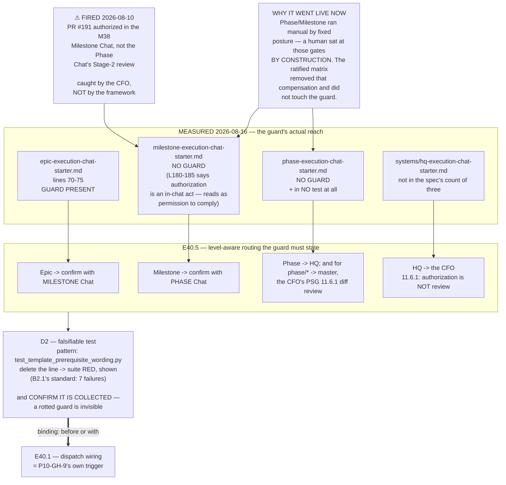

# Epic E40.5 — The Merge-Authorization Routing Guard (P9-GH-1 / P10-GH-9)

## Context

**This epic is positionally binding: it lands *before or with* whatever first wires dispatch.** In
practice that means before or with E40.1. It is sequenced first in M40 for that reason, and it is the
most overdue item in the phase.

`P9-GH-1` has been open since P9 as *"the merge-authorization-routing guard was not extended past
Epic templates."* For most of its life it was a latent gap rather than a live one, because Phase and
Milestone ran **manual by fixed posture** — a human sat at those gates **by construction**. The
ratified execution matrix (P10-M35, SN-25) removed that compensation without touching the guard.

**M40 is the milestone that first wires dispatch, which is `P10-GH-9`'s own recorded trigger
condition** (agentic parents × default-accept). Wiring dispatch while the guard still reaches one
level out of several is the exact combination `P10-GH-9` was filed to prevent.

**And it is no longer abstract. It fired on 2026-08-10.** PR #191's merge was authorized in the M38
Milestone Chat rather than in the Phase Chat's Stage-2 review. Nothing in the Milestone starter told
that chat to confirm upward. **The CFO caught it and notified the Phase Chat unprompted — a human
caught it, not the framework.** The guard, had it existed at that level, would have caught it the way
it catches it at Epic level.

---

## Problem Statement

**The guard exists in exactly one of the framework's starter surfaces, and the chats that most need
it are the ones without it.**

The Epic template's guard works because an Epic Chat is the *child* in the relationship it polices.
But the 2026-08-10 instance happened one level up, where no guard exists — and the levels above Epic
are precisely the levels the ratified matrix newly permits to run agentic. **An agentic chat that
receives out-of-band merge authorization has nothing in its own starter telling it to stop.**

Under default-accept (PSG §11.6 / AOG §12), silence accepts. A chat that silently complies with
out-of-band authorization therefore produces no artifact recording that a review gate was skipped.
**The failure is invisible by construction** — which is why it took a human noticing, five days
later, to surface the last one.

---

## ⚠ Planning-time measurements — read these before designing

Measured by the Milestone Chat on **2026-08-16**, on branch `milestone/M40` (branched from
`phase/P11` @ `f93799a`), in the `ai-project-system` working copy on this machine. **Layer, time and
scope are stated for each because `P11-GH-2` has fired on all four axes in this phase**
(environment, time, scope, literal-vs-rendered). These measurements **narrow the design space; they
do not choose the wording.**

### M1 — The guard's exact text and its true line span

Measured with `grep -n '' governance/templates/epic-execution-chat-starter.md`, i.e. against the
**literal file**, not a rendered view. The guard is a single bullet spanning **lines 70–75**:

```
70:- **If given merge authorization directly in this chat** (rather than via the parent
71:  chat after its own Stage-2 review), do not simply comply: state plainly that merge
72:  authorization normally follows the parent chat's review, and confirm the human intends
73:  to bypass that step before proceeding (P9-M31 precedent — a direct in-chat
74:  authorization was given and acted on without this check, skipping the parent chat's
75:  independent review entirely).
```

> **Correction to the governing specs.** Both the M40 milestone spec and the M40 Milestone Starter
> cite this guard as *"lines 72–74"*. **That names the middle of the bullet, not the bullet.** The
> block is **70–75**. Quoted verbatim above per method obligation G1, because a partial line cite is
> how a guard gets half-copied.

### M2 — The Milestone and Phase templates carry no equivalent

Measured by `grep -n -i 'confirm\|authoriz'` over all three starter templates. The Milestone and
Phase templates match only on unrelated material:

| Template | What its matches actually are |
|---|---|
| `milestone-execution-chat-starter.md` | L75 "do NOT dispatch Coding Agents directly"; L125 "report ambiguity to the parent chat"; **L180–185 the SN-19 statement that there is no Delivery Authorization artifact and that authorization is an in-chat act** |
| `phase-execution-chat-starter.md` | L124 the same ambiguity clause; **L179–185 the same SN-19 statement** |

**Neither carries any instruction to confirm upward when authorization arrives out of band.** The
SN-19 passages are the closest text in both files, and they say the opposite of a guard: they
establish that authorization is an **in-chat act with no ceremonial artifact**. Read alone, that text
makes silent compliance look correct.

### M3 — The surface is wider than three templates, and the inventory is a floor

`grep -rln 'merge authorization\|merge_authorization' governance/` returns **13 files**:

```
governance/AI-OPERATING-GUIDELINES.md
governance/PROJECT-SYSTEM-GUIDELINES.md
governance/diagrams/authority-hierarchy.md
governance/guides/QUICK-START.md
governance/guides/visual-artifacts.md
governance/systems/chat-hierarchy.md
governance/systems/fleet-operator-brief.md
governance/systems/fleet-operator.md
governance/systems/system-hq.md
governance/systems/system-hq-seed.md
governance/templates/epic-execution-chat-starter.md
governance/templates/milestone-execution-chat-starter.md
governance/templates/phase-execution-chat-starter.md
```

**There is also a fourth starter-shaped surface not in that list:**
`governance/systems/hq-execution-chat-starter.md`.

> **Method obligation 6 — every inventory is a floor.** Fleet lists, `GH-` counts, citation sweeps
> and evidence directories have each proven short in this phase. **The milestone spec says "extend it
> to the Milestone and Phase starter templates"; this epic must first establish the real denominator
> rather than inheriting the number three.** Chats that can receive merge authorization include at
> minimum Epic, Milestone, Phase and HQ — and the fleet-operator surfaces describe merge behaviour
> for projects this repo does not own.

### M4 — Prior art for the test exists, and its own coverage is short

`tests/test_template_prerequisite_wording.py` (Epic P5-M20-E20.1) is the exact pattern for a guard of
this kind: it asserts a **literal string** is present in named templates so hardened wording *"cannot
silently regress"*, carries a *"sanity: the template file is present (guards against a path slip)"*
test, and its docstring states what to do when it fails.

**Its `PREREQUISITE_TEMPLATES` tuple names the Milestone and Epic templates and omits the Phase
template.** Measured further: **`phase-execution-chat-starter.md` appears in no test under `tests/`
at all** (`grep -n 'phase-execution' tests/*.py` → no match).

**Consequence:** the pattern to copy is proven, and the file to copy it from demonstrates the same
omission this epic is closing. Do not copy the omission.

### M5 — A template amendment does not reach already-instantiated starters

This is **`P11-GH-1`**, this phase's own carry-forward note
(`P11__carry-forward-note__P11-GH-1-mid-flight-amendments-do-not-reach-working-branches.md`), and it
has fired three times in P11.

Instantiated starters live under `docs/phases/**/` and are **already machine-scanned**:
`tests/test_starter_lint.py` globs `**/*epic-execution-chat-starter.md` under `docs/` and checks
their content. **Scanning instantiated starters, not merely templates, is therefore established
practice in this repository, not a new invention.**

**This is a real design decision for this epic** (§Design Decisions Delegated), not a settled one:
amending the templates fixes every *future* chat and reaches **no** currently-running one — including
this Milestone Chat and the Phase Chat, whose own starters lack the guard today.

---

## Goals

1. **Close, or explicitly rule on, `P9-GH-1`** — the merge-authorization-routing guard reaching only
   the Epic template.
2. **Address `P10-GH-9`'s trigger** — agentic parents × default-accept, fired by M40 wiring dispatch.
3. **Make the guard non-regressable** — a test that fails if the guard text is removed, and that has
   been *shown* to fail, not assumed to.
4. **Establish the real surface** rather than inheriting the number three.
5. **Record the 2026-08-10 instance as evidence**, so the item closes on a real occurrence rather
   than on an argument.

---

## Direction (decided by the Milestone Chat — document and proceed)

The milestone spec admits two directions: extend the guard, **or** record explicitly why wiring
dispatch is safe without it. **This Milestone Chat decides: extend the guard.**

**Reasoning, recorded:** the "safe without it" branch requires an argument that out-of-band
authorization at Phase/Milestone level is either impossible or harmless. **It is measurably neither**
— it happened on 2026-08-10, and the compensation that previously made it harmless (a human at those
gates by construction) was removed by the ratified matrix. An epic cannot honestly write that ruling
against its own evidence.

**What remains open to the epic** is wording, scope and mechanism — see §Design Decisions Delegated.
If executing the epic surfaces evidence that extending the guard is wrong, **that is an escalation to
the Milestone Chat, not a silent switch of direction.**

---

## Deliverables

### D1 — The guard, extended to every starter surface the sweep establishes

The guard is **level-aware**, because the routing differs by level. Each instance must convey the
same three things — *this authorization normally arrives via a named other place; do not simply
comply; state that plainly and confirm the human intends to bypass it before proceeding* — with the
**named other place correct for that level**:

| Level | Where authorization for the PR under discussion normally follows from |
|---|---|
| **Epic** | the parent **Milestone** Chat's Stage-2 review *(already present — do not weaken)* |
| **Milestone** | the parent **Phase** Chat's Stage-2 review |
| **Phase** | **HQ**, and for a `phase/* → master` delivery the **CFO's PSG §11.6.1 diff review** |
| **HQ** *(if the sweep includes it)* | the CFO — **PSG §11.6.1: an HQ-authored PR is never merged on authorization alone** |

**The Phase and HQ rows are where this must not be written carelessly.** The chain terminates at a
manual level by construction (SN-22, SN-25) and **PSG §11.6.1 makes the CFO the mandatory diff
reviewer of HQ output — authorization is not review.** A guard that tells a Phase Chat to "confirm
with its parent" and stops there is incomplete for the `→ master` case.

### D2 — A falsifiable regression test

Following `tests/test_template_prerequisite_wording.py`'s pattern:
- Assert the guard's **literal, load-bearing substring** is present in each template the sweep names.
- Carry the **file-exists sanity test** (guards against a path slip).
- Carry a docstring stating **what to do when it fails**.

**The test must be falsified, not assumed.** Delete the guard line from one template, run the suite,
**record the failure count and message in the delivery**, restore it, re-run green. This phase has
twice paid for guards that were never falsified, and **`B2.1`'s falsification (delete the line → 7
failures) is the standard to meet.**

> **⚠ Inherited trap — the rotted guard is invisible.** M38 recorded that *"is the baseline still
> N?" is an unreliable guard*, because `testpaths` masks a stale `norecursedirs` and a rotted guard
> produces no signal. **Confirm the new test is actually collected and actually runs** — name it in
> the delivery with its node ID and its observed pass/fail transition, not merely with a green suite
> total.

### D3 — The surface sweep, recorded

A record of **which surfaces can receive merge authorization**, which now carry the guard, and —
for any that deliberately do not — **why not, per surface**. M3's 13 files plus
`hq-execution-chat-starter.md` are the **floor, not the answer**. Silent omission is the failure
mode; a surface consciously excluded is a recorded decision, a surface never considered is a gap.

### D4 — The 2026-08-10 instance recorded as evidence

PR #191, authorized in the M38 Milestone Chat rather than the Phase Chat's Stage-2 review, caught by
the CFO rather than by the framework. **Cite it with its anchor** (PR number and the merge commit on
`phase/P11`), per method obligation 5 — cross-repo and historical claims carry a date or commit
anchor, never present tense.

### D5 — `P9-GH-1` and `P10-GH-9` each dispositioned explicitly

Each is **closed** or **explicitly ruled**, in writing, with its reasoning. **Neither may be left
implied by the fact that work happened.** If `P10-GH-9` cannot be fully closed by a starter-text
change — a real possibility, since it concerns default-accept semantics under agentic parents, not
only starter wording — **say so and state precisely what remains**, so M40's Closure Declaration can
carry it forward with a trigger.

### D6 — Structural diagram

**Binding constraint 8 fires: this epic amends normative documents in this repo.** Mermaid, fenced,
in-repo, **no ComfyUI**. It must show the routing the guard enforces — which level confirms with
whom — including the `→ master` / §11.6.1 terminal case.

---

## Design Decisions Delegated to This Epic

Decide each, document the reasoning, and proceed. **Do not return these to the Milestone Chat unless
executing them surfaces something that contradicts this spec.**

1. **Exact guard wording per level**, within D1's semantic requirements.
2. **Whether the test scans instantiated starters under `docs/` as well as templates** (M5). Both
   have prior art in this repo. Scanning instantiated starters closes `P11-GH-1`'s reach for this
   guard but makes every historical starter a test subject — **if you scan `docs/`, state how
   already-delivered starters are handled**, because retro-failing closed epics' artifacts is a
   worse outcome than a forward-only guard.
3. **Whether currently-running chats are reached at all**, and if so how. The Phase Chat and this
   Milestone Chat are both running on starters without the guard. **A note to the Phase Chat is
   admissible; reaching into a running session is not** (mid-flight amendment rule).
4. **Whether `hq-execution-chat-starter.md` and the fleet-operator surfaces are in scope**, with the
   reasoning recorded either way.

---

## Definition of Done

- [ ] The guard is extended to every starter surface the sweep names, **level-aware and correct per
      level** — or a recorded ruling states why dispatch is safe without it (see §Direction: the
      Milestone Chat has decided *extend*)
- [ ] The Epic template's existing guard is **not weakened** by the edit
- [ ] A regression test asserts the guard's literal presence, **and has been falsified** — failure
      count, message and node ID recorded in the delivery
- [ ] The new test is confirmed **collected and running**, not merely coexisting with a green total
- [ ] The surface sweep is recorded, with per-surface reasoning for anything excluded
- [ ] The 2026-08-10 instance (PR #191) is cited with its anchor as evidence
- [ ] `P9-GH-1` and `P10-GH-9` are **each** explicitly closed or ruled, in writing
- [ ] Structural diagram present (constraint 8), Mermaid, in-repo, no ComfyUI
- [ ] **This epic lands before or with whatever first wires dispatch — binding**
- [ ] Suite green in **this repo, baseline 510** via `PYTHONPATH=. pytest -q` (bare `pytest` fails
      collection). **Drivr is untouched by this epic**; do not report a Drivr figure as if it moved.
- [ ] Delivery Notice produced; PR opened to `milestone/M40`; **stop and await authorization**

---

## Acceptance Criteria

1. **A Milestone or Phase Chat receiving out-of-band merge authorization is told what to do, by its
   own starter** — verifiable by reading that starter alone, with no other document loaded.
2. **`P9-GH-1` and `P10-GH-9` are each either closed or explicitly ruled**, and a reader can find
   which, and why, without inference.
3. **Deleting the guard from any covered template turns the suite red** — demonstrated, not asserted.
4. **A reader can state which surfaces were considered and which were excluded**, and why.

---

## Binding Constraints (reproduced, not cited)

**5. Mode is not authority.** Running unattended widens what an instance *does*, never what it may
*authorize*. Stage-2 acceptance and merge authorization remain human-keyed in every mode. **This
epic is that constraint's enforcement mechanism** — do not write a guard that can be read as granting
any chat the ability to self-authorize when it judges the routing acceptable.

**8. Every delivery amending a normative document in this repo carries a Structural diagram**
(Mermaid, fenced, in-repo, no ComfyUI).

**Additionally, from the Hard Constraint (M40 is the last milestone):** *every claim is measured or
it is not made.* "The guard is in place" means the text is in the file and a test fails without it,
shown. **A phase closes on evidence or it does not close.**

---

## Method Obligations (this phase paid for each)

1. **`P11-GH-2` — state the layer, time and scope of every verification.** Four axes have fired:
   environment, time, scope, literal-vs-rendered. This epic reads **literal file text**; say so.
2. **G2 — the reviewer re-measures.** Your report is not the evidence.
3. **G1 — remove derivation steps.** Quote the guard text verbatim rather than describing it.
4. **Cite by artifact + defect, never by ordinal.** **`P11-GH-3` is contested and unallocated —
   do not allocate it.**
5. **Cross-repo and historical claims carry a date or commit anchor**, never present tense.
6. **Every inventory is a floor** — M3 especially.
7. **Check the branch before every commit; verify pushes at `origin`.** One worktree per chat —
   normative since P5-M20-E20.2, ignored four times in P11.
9. **Run it, don't read it.** Four of this phase's sharpest findings came from executing code.

---

## Out of Scope

- **Changing default-accept itself** (PSG §11.6 / AOG §12). This epic guards its *routing*; it does
  not amend the acceptance model.
- **Changing the harness's merge enforcement.** The harness enforces human merge authorization
  regardless; this epic does not touch it.
- **Remediating the four §4-invalid enrolled configs, the two open `bin/ai-project-init` defects,
  `P10-GH-10`, `P9-GH-3`, `P8-GH-2`, ComfyUI precision, or the sidekick identity question.** All are
  named in the phase spec and restated at phase closure; **none is fixed here.**
- **Backfilling the git-tracking rule into the Phase template** (M4's adjacent finding). It is a real
  gap and it is **not this epic's subject** — record it as an observation for the Milestone Chat
  rather than fixing it silently.

---

## Dependencies

- **Upstream:** none. This epic is first by binding sequence and depends on no other M40 epic.
- **Downstream:** **E40.1 and anything else that wires dispatch.** This epic lands before or with
  them — binding.
- **Repository:** `ai-project-system` only. Drivr is untouched.

---

## Risks

| Risk | Handling |
|---|---|
| The sweep finds more surfaces than expected and the epic grows | **Escalate to the Milestone Chat.** M40 is the final milestone; a sixth epic is an escalation to HQ. Do not absorb an open-ended sweep. |
| The guard is written but never fires, so nobody learns whether it works | D2's falsification is the substitute for a live firing. **Falsify it.** |
| `P10-GH-9` is broader than starter text | Anticipated in D5 — state precisely what remains rather than over-claiming closure. |
| Scanning `docs/` retro-fails delivered artifacts | Delegated decision 2 names this explicitly; forward-only is a legitimate reasoned outcome. |

---

## Visual Bindings

**Visual binding**
- **Link:** (inline — Structural diagram; no hosted link needed per AOG §16.3/§16.5)
- **What:** diagram
- **Level:** Epic
- **State:** proposed



- **Description:** What the merge-authorization routing guard actually reaches as measured on
  2026-08-16 (one template of at least four surfaces), why the gap went live now (the ratified matrix
  removed the human-by-construction compensation without touching the guard), the level-aware routing
  E40.5 must state — including the `→ master` case where PSG §11.6.1 makes the CFO the mandatory diff
  reviewer — and the binding position of this epic before dispatch wiring. Proposed-track Structural
  diagram (AOG §16.3/§16.6), Mermaid, no ComfyUI.

---

## Amendment History

| Version | Date | Change |
|---|---|---|
| 1.0.0 | 2026-08-16 | Initial spec. Records M1–M5 planning measurements; corrects the governing specs' "lines 72–74" to the measured **70–75**; establishes the surface as a floor of four rather than three; decides the direction (**extend**, not "safe without it") with reasoning. |
