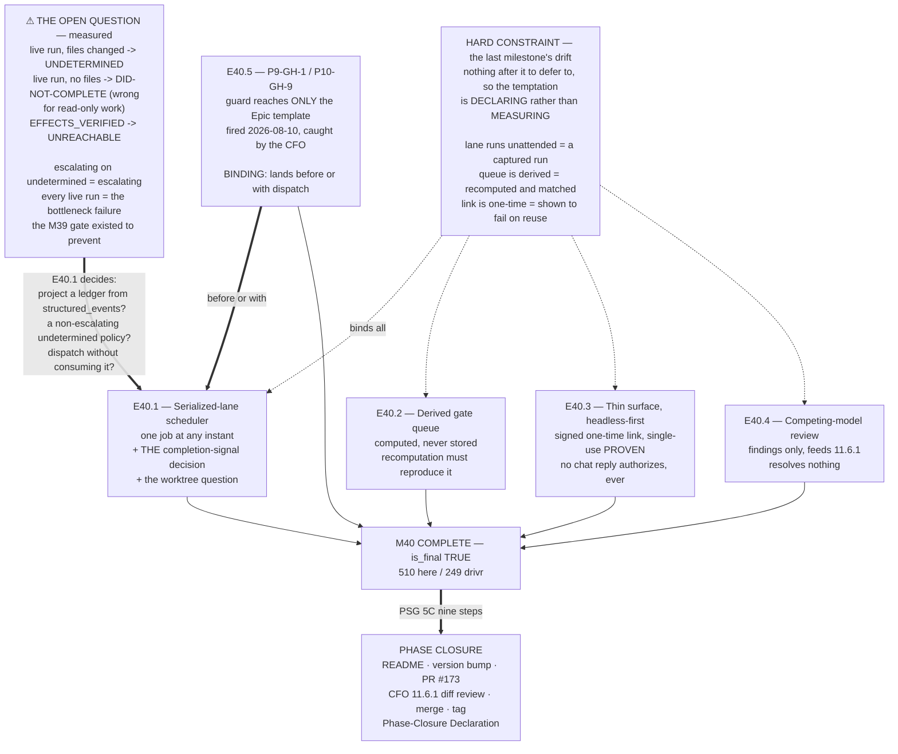

# Milestone M40 — Coordination: Scheduler, Derived Gate Queue, and the Thin Surface

## Purpose

**The payload.** The lane runs without a human starting it, the gate queue is **computed** from
governance state, the human approves in-app through a **signed one-time link**, and competing models
surface findings that change nothing on their own.

**M40 is P11's FINAL milestone** (`is_final: true`). Its Closure Declaration does not hand back for
another milestone — it triggers **phase closure via the PSG §5C nine-step sequence** (see §Phase
Closure below). Everything this milestone leaves undone leaves the phase undone.

This milestone ensures:
- **The serialized lane runs unattended** — one reasoning job at any instant, enrollment and
  concurrency kept as separate axes (E40.1).
- **The gate queue is derived, never hand-maintained** — whatever governance says is outstanding
  (E40.2).
- **The human holds the gate, in-app** — headless-first, signed one-time link, and **no chat reply
  ever authorizes** (E40.3).
- **Competing models review PRs and hold no authority** (E40.4).
- **P9-GH-1 / P10-GH-9 get their owner** — the merge-authorization-routing guard, addressed before
  dispatch is wired or explicitly ruled safe without it (E40.5).

---

## ⚠ The finding that reframes this milestone — measured at planning time

**M39 delivered a completion judgment that is validated, honest, and — on the live path — cannot
return a positive verdict.** M39 stated this as its limit 5. **Measured directly against the delivered
code, the consequence is sharper than that limit records**, and it is the central design problem of
this milestone.

`from_execution_result` hard-codes **`effect_ledger=None`** (*"No adapter on today's roster emits
one"*). Running the real `judge_completion` over a live-shaped `ExecutionResult`:

| Live run through Drivr's adapter | Verdict | Reading |
|---|---|---|
| **files changed** | `effects-unverified` | **`undetermined`** |
| **no files changed** | `no-effects-observed` | **`did-not-complete`** |
| — | `effects-verified` | **UNREACHABLE** |

**Two consequences, and the second is not in M39's limits:**

1. **`EFFECTS_VERIFIED` is unreachable on every live run.** M39's limit 5, confirmed.
2. **A live run that legitimately changes no files is judged `did-not-complete`.** For a read-only
   task — an analysis pass, a review, a QA run — **that is a positively wrong verdict, not an
   undetermined one.** M39's limits describe deferral; this branch describes error.

> **So a scheduler that dispatches through today's adapter and consumes the judgment receives
> `undetermined` or a wrong `did-not-complete` on every single run. Never a positive verdict.**
>
> **M39 gated M40 so that M40 would have a trustworthy signal to build on. The signal exists, is
> validated, and does not function on the path M40 will actually dispatch.** That is not a defect in
> M39 — M39 said so, in its own limits and carry-forwards — but it lands on this milestone.

**The unblocker is already identified and already scoped out.** M39 carry-forward 4: *"an adapter that
projects an ordered ledger — OpenCode's `--format json` stream is the obvious candidate. It was not
built, deliberately."* **And the plumbing may already exist:** `ExecutionResult` carries
**`structured_events`** and **`engine_status`** fields today. **Whether they can be projected into an
ordered ledger is a measurement E40.1 must take, not an assumption this spec makes.**

**This is E40.1's load-bearing decision, and it is genuinely open** (§E40.1). **If it outgrows one
epic, that is an escalation, not scope to absorb** — see the trigger below.

---

## Binding Constraints (settled — NOT for re-debate)

**1. The lane is serialized: one reasoning job at any instant.** Enrollment (which projects may run)
and concurrency (how many run at once) are **different axes and do not conflict**. The contention is
measured and real — one GPU, 16 GB VRAM shared with ComfyUI, `qwen3-coder:30b` already partially
offloading to RAM.

**2. The gate queue is COMPUTED from governance state. Never hand-maintained.** A hand-maintained
queue is a second source of truth for governance state and drifts from the artifacts within a week.
**The human holds the gate; the system computes the list.**

**3. Inbound approval is a signed one-time link. A chat reply NEVER authorizes — prohibited, not
deferred.** Gates are **in-app only**. Push and WhatsApp remain **deferred** under SN-24. Single-window
is a nice-to-have, not a requirement. **The human is a node inside the governance graph, not an
operator above it.**

**4. Competing-model review is findings-only and holds no authority.** It **feeds** the CFO's §11.6.1
diff review; it does not substitute for it, dilute it, or create a consensus path. **No finding from
any model carries authority, and no volume of agreement between models converts into one.** *Mode is
not authority*, applied to a new participant class.

**5. Mode is not authority.** Running unattended widens what an instance *does*, never what it may
*authorize*. Stage-2 acceptance and merge authorization remain human-keyed in every mode.

**6. Drivr still rents.** No inference, no model loop, no agent client. A scheduler decides *when*; it
does not become an engine.

**7. Never read a QA verdict without first running the completion judgment on the QA run that produced
it.** M39's design rule, earned: its `epic_qa` lane returned a fabricated `VERDICT: PASS` on all 26
rules with **zero tool calls**, reproduced, and M39's own judgment caught it. **The five-criterion bar
establishes a run is genuine; the completion judgment establishes whether work happened. Neither is
sufficient alone.**

**8. Every delivery amending a normative document in this repo carries a Structural diagram**
(Mermaid, fenced, in-repo, no ComfyUI). Not required for Drivr-side code.

---

## Hard Constraint (binding — carries to every Epic)

**M40 is the last milestone, and the temptation is the opposite of every milestone before it.**

M36–M39 each had to resist building the *next* thing. **M40 has nothing after it to defer to**, so its
drift is different: **closing the phase by declaring things done that were not measured.**

> **Every claim in this milestone's deliveries is measured or it is not made.** *"The lane runs
> unattended"* means a run was dispatched and completed with no human starting it, captured. *"The
> queue is derived"* means it was recomputed from governance artifacts and shown to match. *"Approval
> is a signed one-time link"* means a link was minted, used once, and shown to fail on reuse.
>
> **A phase closes on evidence or it does not close.**

And the ordinary drift still applies: **nothing here may quietly widen Drivr into an engine**, and
**nothing may weaken constraint 3** — an approval path that accepts a chat reply, even as a
convenience, is prohibited rather than discouraged.

---

## Planned Epics

- **E40.1 — Serialized-lane scheduler** *(first; holds the milestone's open question)*
- **E40.2 — Derived gate queue**
- **E40.3 — Headless-first thin surface + signed one-time-link approval**
- **E40.4 — Competing-model PR review**
- **E40.5 — P9-GH-1 / P10-GH-9** *(lands **before or with** whatever first wires dispatch — binding)*

> **Artifact scope (adjacency).** The Phase Chat produces this spec and the Starter. The **Milestone
> Chat** owns final epic planning and authors all five Epic specs and Starters.

**Split posture:** **not split, and no trigger is recorded this time** — M40 is the final milestone and
a split would insert a milestone after the phase's last, which is a phase-structure change and HQ's,
not mine. **If M40 proves too large, that is an escalation to HQ.**

---

## Epic Detail

### E40.1 — Serialized-lane scheduler *(first)*

**Source:** SN-27 decision 6; SN-23 (2026-07-20) Ratified Decision #7 (*scheduler only when contention
bites* — **it now bites, measured**); phase spec §P11.5.

**Deliverables:**
1. **A scheduler that keeps the serialized lane busy without a human starting it** — one reasoning job
   at any instant. **Enrollment and concurrency kept as separate axes** (constraint 1).
2. **A decision on the completion signal, recorded with its reasoning** — the milestone's open
   question. Admissible directions, none preferred here:
   - **Build the ordered-ledger projection for OpenCode** (M39 carry-forward 4). Measure whether
     `structured_events` / `engine_status` carry what a ledger needs **before** committing to it.
   - **Consume the judgment as-is**, with a stated policy for `undetermined` that is **not** "escalate"
     — because escalating on `undetermined` escalates effectively every live run, which **is** the
     *"constant false escalations, the human becomes the bottleneck again, worse than before"* failure
     the M39 gate exists to prevent.
   - **Dispatch without consuming the judgment**, and state plainly what the scheduler therefore does
     not know.
   **State which, why, and what it costs.**
3. **At least one real unattended dispatch, captured** — a run the scheduler started, with its record
   committed here (Hard Constraint).
4. **The worktree question, decided either way** *(phase spec v1.1.2, consideration not scope)*: a
   dispatcher that decides *when* a run happens is the natural owner of *which worktree it gets*.
   `chat-hierarchy.md`'s one-worktree-per-chat rule has existed since P5-M20-E20.2 and was measured
   **unobserved** — four occurrences in P11, **including this Phase Chat's**. **Taking it would be the
   first thing in this phase to convert an interim practice into a mechanism rather than adding
   another.** E40.1 decides; **declining is a legitimate outcome if reasoned.**

**Definition of Done:**
- [ ] The scheduler runs the serialized lane unattended; **one job at any instant** demonstrated
- [ ] Enrollment and concurrency are separate axes in the implementation, not merely in prose
- [ ] **The completion-signal decision is recorded with its measurement** — including, if the ledger
      projection was declined, what `structured_events` was found to contain
- [ ] **At least one real unattended run is captured** and committed
- [ ] The worktree question is decided and recorded either way
- [ ] **Nothing became an engine** (constraint 6); **`undetermined` policy is not "escalate"** unless
      the epic shows why that is survivable
- [ ] Suites green, baselines named per repo (**this repo 510**, Drivr **249**)

**Acceptance Criteria:**
- [ ] A reader can state what the scheduler knows about a finished run, and what it does not
- [ ] A run happened that no human started, and its record proves it

**Sequencing:** first. **If the completion-signal decision outgrows one epic, escalate** — do not
absorb it and do not let it silently become the milestone.

---

### E40.2 — Derived gate queue

**Source:** SN-27; phase spec §P11.5.

**Deliverables:**
1. **A gate queue computed from governance state** — whatever the artifacts say is outstanding.
   **Never hand-maintained** (constraint 2).
2. **Demonstrated derivation:** the queue is recomputed from the artifacts and **shown to match** —
   not asserted. **A stored queue that happens to be correct is not a derived queue.**
3. **A stated account of what it reads** — which artifact types, which states, and what it does with
   an artifact it cannot classify. **Silent omission from a gate queue is the failure mode**; an
   unclassifiable item should surface, not vanish.

**Definition of Done:**
- [ ] The queue is computed from governance artifacts, demonstrated by recomputation
- [ ] No hand-maintained store is the source of truth for any entry
- [ ] Unclassifiable artifacts surface rather than disappearing
- [ ] Suites green, baselines named

**Acceptance Criteria:**
- [ ] Deleting the queue and recomputing it reproduces it exactly
- [ ] A reader can state what would and would not appear in it, and why

**Sequencing:** may run parallel to E40.1.

---

### E40.3 — Headless-first thin surface + signed one-time-link approval

**Source:** SN-24 (unamended); phase spec §P11.5; constraint 3.

**Grounding:** SN-24's inversion holds — *a dashboard is a surface for watching; the more agentic the
machine, the less there is to watch.* **Headless-first.**

**Deliverables:**
1. **The thin surface**, headless-first. **Gates in-app only.**
2. **Signed one-time-link approval** — minted in-app, **used once**, and **shown to fail on reuse**.
   The authorization artifact is still minted in-app; the link is the inbound channel, not the
   authority.
3. **An explicit statement that no path exists by which a chat reply authorizes** — and, if the
   surface has any inbound text channel at all, **a demonstration that it cannot authorize.**
4. **Push and WhatsApp remain deferred** (SN-24, unchanged). Single-window is not required.

**Definition of Done:**
- [ ] A link was minted, used once, and **demonstrated to fail on reuse**
- [ ] **No chat-reply authorization path exists** — shown, not asserted
- [ ] Gates are in-app only; push/WhatsApp untouched
- [ ] Suites green, baselines named

**Acceptance Criteria:**
- [ ] A reader can trace exactly how a human authorizes something, end to end
- [ ] No reader can find a second path by which authorization could arrive

**Sequencing:** independent; may run parallel.

---

### E40.4 — Competing-model PR review

**Source:** SN-27 decision 7; constraint 4; PSG §11.6.1.

**Deliverables:**
1. **GitHub Copilot as a PR reviewer plus at least one competing model**, looking for **performance,
   security and scalability**.
2. **The authority ceiling recorded in the epic spec, not assumed** — findings feed the CFO's §11.6.1
   diff review and **resolve nothing**. **No consensus path. No blocking vote. No substitution.**
3. **At least one real PR reviewed**, with the findings captured — and **evidence that nothing was
   auto-applied or auto-resolved.**

**Definition of Done:**
- [ ] Two or more competing models review at least one real PR, findings captured
- [ ] The findings-only ceiling is **recorded in the epic spec** and demonstrated in behaviour
- [ ] **No finding changed anything on its own authority**
- [ ] Suites green, baselines named

**Acceptance Criteria:**
- [ ] A reader can see the findings and confirm none of them resolved anything
- [ ] The configuration cannot be read as granting review authority

**Sequencing:** independent. **CFO-side configuration** is a dependency outside this repo.

---

### E40.5 — P9-GH-1 / P10-GH-9 *(binding position)*

**Source:** phase spec §P11.5; HQ Ruling 2026-08-01 (owner assigned at this milestone); **a live
instance dated 2026-08-10**.

**Grounding — this is no longer abstract.** P9-GH-1 has been open since P9 as *"the guard was not
extended past Epic templates."* **Measured 2026-08-10 by this Phase Chat:** the confirm-before-proceeding
guard exists **only** in `governance/templates/epic-execution-chat-starter.md` (lines 72–74).
**`milestone-execution-chat-starter.md` and `phase-execution-chat-starter.md` carry no such check.**

**And it fired in this phase.** PR #191's merge was authorized in the M38 Milestone Chat rather than
the Phase Chat's Stage-2 review. **Nothing in the Milestone starter told it to confirm upward; the CFO
caught it and notified the Phase Chat unprompted.** The guard would have caught it at Epic level. **It
was caught by a human, not by the framework.**

**Deliverables:**
1. **Address the merge-authorization-routing guard** — extend it to the Milestone and Phase starter
   templates, **or record explicitly why wiring dispatch is safe without it.** Either is admissible;
   silence is not.
2. **The 2026-08-10 instance recorded as evidence**, so the item closes on a real occurrence rather
   than on an argument.
3. **P10-GH-9's trigger addressed** — agentic parents × default-accept. This milestone is where
   dispatch gets wired, which is P10-GH-9's own recorded trigger condition.

**Definition of Done:**
- [ ] The guard is extended to Milestone and Phase templates, **or** a recorded ruling states why
      dispatch is safe without it
- [ ] The 2026-08-10 instance is cited as evidence
- [ ] **This epic lands before or with whatever first wires dispatch** — binding
- [ ] Structural diagram (this epic amends normative templates — constraint 8 fires)
- [ ] Suites green, baselines named

**Acceptance Criteria:**
- [ ] A Milestone or Phase Chat receiving out-of-band merge authorization is told what to do, by its
      own starter
- [ ] P9-GH-1 and P10-GH-9 are each either closed or explicitly ruled

**Sequencing:** **binding — lands before or with the first epic that wires dispatch.** In practice
that means before or with E40.1.

---

## Phase Closure — what `is_final: true` obliges

**M40's Closure Declaration does not hand back for another milestone.** On its acceptance and
consolidation, the Phase Chat executes **PSG §5C's nine-step sequence**:

| Step | |
|---|---|
| 1 | All milestones fully closed — M36, M37, M38, M39, M40 |
| 2 | Phase declared complete |
| 3 | **README update** (mandatory, automatic) — the stale suite figure is retired here |
| 4 | **Version bump** (mandatory, automatic) |
| 5 | Consolidation PR created — `phase/P11 → master` (**PR #173**, open since 2026-08-03) |
| 6 | Delivery reviewed — **the CFO's §11.6.1 diff review** |
| 7 | Merge completes |
| 8 | **Git tag** (mandatory, automatic) |
| 9 | **Phase-Closure Declaration recorded** |

**M40's Closure Declaration must therefore leave the phase closable** — every carry-forward stated with
its trigger, every parked item restated so none is silently dropped, and **llama.cpp recorded CLOSED,
not parked**. The phase spec's §Success Criteria item 13 lists what the Phase-Closure Declaration must
restate; **M40's closure is where the material for it is assembled.**

---

## Prerequisites

- This spec and its Starter **git-tracked on `phase/P11`**.
- **M39 closed and consolidated** — `phase/P11` @ `b32dbbb`, in sync with master.
- **Suites: this repo 510; Drivr 249** (`PYTHONPATH=. pytest -q` here; bare `pytest` in Drivr).
- **Drivr holds** `drivr/execution/` (interface, opencode, echo, environments, filesystem,
  context_limits) and `drivr/judgment/` (completion, evidence, projections).
- **`drivr` has no git remote** — *"verify the push at `origin`"* is **not performable** for Drivr. A
  reviewer must re-measure on this machine.
- **M39's three inherited facts** (§The finding, above, and constraint 7).
- **P10-GH-10** — ~3-in-10 flaky, did not fire during M39. **Named, not scoped. Record both results if
  it fires.**

---

## Definition of Done (Milestone)

- [ ] E40.1–E40.5 each meet their own DoD
- [ ] All five epic branches merged to `milestone/M40`
- [ ] **The lane ran unattended at least once, captured** — no human started it
- [ ] **The gate queue is derived**, demonstrated by recomputation, with unclassifiable items surfacing
- [ ] **A signed one-time link was minted, used once, and failed on reuse**; **no chat-reply
      authorization path exists**, shown
- [ ] **Two or more competing models reviewed a real PR**, findings-only ceiling recorded and observed
- [ ] **P9-GH-1 / P10-GH-9 addressed or explicitly ruled**, landing before or with dispatch wiring
- [ ] **The completion-signal decision is recorded with its measurement**, and `undetermined` policy is
      not "escalate" unless shown survivable
- [ ] The worktree question is decided either way
- [ ] **Nothing became an engine**; constraint 3 never weakened
- [ ] Structural diagram on E40.5 and any other normative amendment
- [ ] Suites green, baselines named per repo; P10-GH-10 both results if it fires
- [ ] **Milestone Closure Declaration produced AND COMMITTED** (`is_final: true`), leaving the phase
      closable per §Phase Closure

---

## Acceptance Criteria (Milestone)

1. **The lane runs unattended, serialized** — demonstrated by a captured run nobody started.
2. **The gate queue is computed from governance state**, reproducible by recomputation.
3. **Approval is in-app via a signed one-time link**, single-use proven, with **no chat-reply path**.
4. **Competing models review and hold no authority** — findings feed §11.6.1 and resolve nothing.
5. **P9-GH-1 / P10-GH-9 are closed or explicitly ruled**, on the 2026-08-10 instance.
6. **What the scheduler knows about a finished run is stated honestly**, including what it does not.
7. **Suites green, baselines named per repository.**

---

## Timeline

**Target Start:** 2026-08-16
**Target Completion:** 2026-08-29 (~2 weeks). **E40.1 is the long pole and carries the milestone's only
genuine unknown** — whether an ordered ledger can be projected from `structured_events`, and what the
scheduler does if it cannot. E40.2 and E40.3 are bounded. E40.4's dependency is CFO-side configuration.
E40.5 is small but **positionally binding**.

**Actual Start:** Not started
**Actual Completion:** Not started

---

## Visual Bindings

**Visual binding**
- **Link:** (inline — Structural diagram; no hosted link needed per AOG §17.3/§17.5)
- **What:** diagram
- **Level:** Milestone
- **State:** proposed

- **Description:** M40's five epics, the binding position of E40.5 before dispatch wiring, and the
  measured open question that reframes E40.1 — on the live path the completion judgment returns
  `undetermined` or a wrong `did-not-complete`, never a positive verdict, so a scheduler consuming it
  as-is escalates every run. The Hard Constraint binds all five: **the last milestone's drift is
  declaring rather than measuring.** On completion, `is_final: true` triggers PSG §5C's nine-step
  phase closure. Proposed-track Structural diagram (AOG §17.3/§17.6), Mermaid, no ComfyUI.

---

## Notes

- **The open question is not a defect in M39 and must not be read as one.** M39 recorded the
  single-adapter dependency as limit 5 and carry-forward 4, and **deliberately did not build the
  projection** because nothing in that milestone needed it. The measurement above sharpens the
  consequence — the read-only branch returns a *wrong* verdict, not merely an undetermined one — and
  that consequence lands here because this is where dispatch happens.
- **This is the fifth consecutive milestone whose planning found something the governing spec did not
  anticipate**, and the fourth where the finding came from running code rather than reading it. That
  is the practice working, and it is the reason to keep E40.1's decision open rather than pre-deciding
  it here.
- **E40.5 is small, positionally binding, and the most overdue item in the phase.** P9-GH-1 has been
  open since P9; it now has a dated instance in which the framework did not catch what a human did.
- **`is_final: true` changes the closure obligation**, not the review model. Default-accept still
  governs delivery (PSG §11.6 / AOG §14); acceptance and merge instruction remain **in-chat acts**
  (SN-19); the harness still enforces human merge authorization; and **merge authorization for a child
  PR belongs in the Phase Chat's Stage-2 review** — which is E40.5's own subject.
