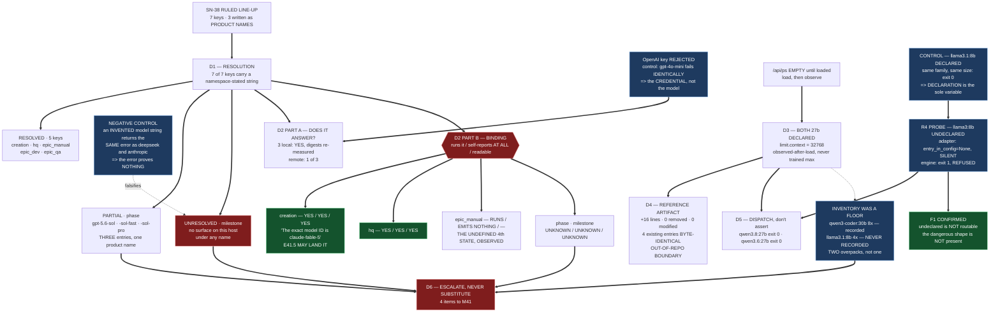

# E41.1 Measurement Record — Target Resolution, Reachability, and Routability

**This document carries D1, D2 and D5.** D3 is the host mutation, recorded in the reference
artifact (D4); D6 is the Escalation Notice. Design decision 5 is answered here: **D1, D2 and D5 land
as one document, D4 as its own reference artifact, D6 as its own notice** — because D4 must be
readable as a standalone record of an out-of-repo mutation, and D6 must be routable to the parent
without carrying 400 lines of measurement with it.

**Every measurement below was taken by this Epic Chat on 2026-08-21**, on branch
`epic/P12-M41-E41.1` at `98b2b5c`, on the host `panchew@` unless a row says otherwise. **Nothing
here is inherited from the Epic spec's R1–R7 or from the M41 spec's F1–F6** (G2: the reviewer
re-measures; the executor's report is not the evidence). Where a re-measurement **agrees** with the
planning-time figure that is stated; where it **disagrees**, the disagreement is the finding.

---

## 0. Prerequisite verification, discharged

| Check | Result | Layer / time |
|---|---|---|
| Branch | `epic/P12-M41-E41.1`, descends from `origin/milestone/M41` (`98b2b5c`) | git, 2026-08-21 |
| Upward staleness (`P11-GH-1`, second direction) | `origin/milestone/M41..origin/master` = **0**; `origin/phase/P12..origin/master` = **0** | git, 2026-08-21, run before starting **and** before delivering |
| Cited artifacts tracked | **9 of 9** resolve via `git ls-files --error-unmatch` on this branch, including the R6 ruling | git, 2026-08-21 |
| Model verification (P9-M31-E31.3) | `.ai-project.yml` `models.epic_manual` = `remote:claude-opus-5`; this harness self-reports `claude-opus-5` — **agree, proceed** | harness self-report, 2026-08-21 |
| Suite baseline (R7) | **549 passed / 0 failed**, 34.36s, `PYTHONPATH=. pytest -q` — **agrees** with the spec | repo, 2026-08-21 |
| Docker | `Docker version 29.7.2, build a7dcaa6` — present, so the unsandboxed fallback does not fire | host, 2026-08-21 |

**R1, R2, R3 re-measured and all three agree with the spec.** `opencode.json` was 1217 bytes,
mtime 2026-07-22 23:30, sha256 `f5cee248…158e`, declaring exactly four Ollama models and neither
27b. `/api/ps` returned `{"models":[]}`. `/api/tags` returned seven models with digests identical to
the spec's. **R4 and R5 re-confirmed by reading Drivr at `f60164c`** (verbatim quotes in §3 and §5).

---

## 1. D1 — The resolution table

**All seven `models:` keys**, including the three that do not move, so no reader needs a second
document. **Namespace is stated per string** (R5). **No cell contains an unresolved product name
presented as resolved**; the two that could not be resolved say so in terms.

### 1.1 The seven keys

| Key | Ruled target, **verbatim from SN-38** | `.ai-project.yml` string (`<locality>:<id>`) | Adapter/engine string (`<provider>/<id>`) | Bare API id | Status |
|---|---|---|---|---|---|
| `creation` | **fable-5** | `remote:claude-fable-5` | *n/a — manual verification target, no adapter path* | `claude-fable-5` | **RESOLVED — confirmed by a surface that ran it** |
| `hq` | **opus-5** (no change) | `remote:claude-opus-5` | *n/a — manual* | `claude-opus-5` | **RESOLVED — does not move** |
| `phase` | **GPT-5.6 Sol** | ⚠ **UNDETERMINED** — see §1.3 | `openai/gpt-5.6-sol` | `gpt-5.6-sol` | **PARTIALLY RESOLVED — ambiguous family, and does not answer** |
| `milestone` | **Deepseek V4 Flash** | ⚠ **UNRESOLVED** | *none found* | *none found* | **UNRESOLVED — escalated** |
| `epic_manual` | **Qwen3.8:27b** | `local:qwen3.8:27b` | `ollama/qwen3.8:27b` | `qwen3.8:27b` | **RESOLVED — dispatched, exit 0** |
| `epic_dev` | *unchanged pending SN-37* | `local:qwen3-coder:30b` | `ollama/qwen3-coder:30b` | `qwen3-coder:30b` | **RESOLVED — does not move** |
| `epic_qa` | *unchanged pending SN-37* | `local:qwen3-coder:30b` | `ollama/qwen3-coder:30b` | `qwen3-coder:30b` | **RESOLVED — does not move** |

### 1.2 Evidence per row — the surface, the date, the exact response

| Key | How it was resolved | Evidence class |
|---|---|---|
| `creation` | A subagent session was opened on this harness's `fable` model on **2026-08-21** and asked to quote its own harness self-report verbatim. It returned: **`"You are powered by the model named Fable 5. The exact model ID is claude-fable-5."`** | **Strongest available: a surface that RAN the model and self-reported its own ID.** Not a roster lookup, not name resemblance |
| `hq` | This Epic Chat's own harness self-report, read at session start: **`"You are powered by the model named Opus 5. The exact model ID is claude-opus-5."`** Matches the incumbent value; the row does not move | Surface that ran it, self-reported |
| `phase` | `opencode models` (host, 2026-08-21, 97 entries, 4 providers) contains **`openai/gpt-5.6-sol`** — **and also `openai/gpt-5.6-sol-fast` and `openai/gpt-5.6-sol-pro`** | Roster entry — **real, but ambiguous** (§1.3). **Never made to answer** (§2.2) |
| `milestone` | `opencode models` contains **no `deepseek/*` provider and no entry matching `deepseek`, `v4` or `flash`**. Invoking `deepseek/deepseek-v4-flash` returned a **degenerate error** that a negative control proved carries no information (§1.4) | **None.** No surface on this host offers this model under any name |
| `epic_manual` | `/api/tags` (host, 2026-08-21): `qwen3.8:27b`, digest `22130167c4c20e20…9643`, 17,741,872,154 bytes, 27.3B Q4_K_M. **Then dispatched** through Drivr's adapter, exit 0 (§5.1) | Present in the runtime **and** demonstrated routable |
| `epic_dev` / `epic_qa` | `/api/tags`: `qwen3-coder:30b`, digest `06c1097efce0431c…90bca`, 18,556,700,761 bytes, 30.5B Q4_K_M; declared in `opencode.json` since before this epic | Present and already declared |

### 1.3 ⚠ `phase` — "GPT-5.6 Sol" names a family of three, not a model

The roster contains **three** entries whose product name is GPT-5.6 Sol:

```
openai/gpt-5.6-sol
openai/gpt-5.6-sol-fast
openai/gpt-5.6-sol-pro
```

The unsuffixed `gpt-5.6-sol` is the natural reading of the unqualified product name, and the two
siblings carry explicit extra qualifiers the CFO did not write. **That is an argument, not
evidence.** Under this Epic's Binding Constraint 3 — *never infer an identifier from a product name*
— an argument from which suffix looks default is exactly the reasoning the constraint forbids.
**The row is therefore recorded as PARTIALLY RESOLVED and escalated**, not silently narrowed to the
base string.

**And there is a second, independent reason the `.ai-project.yml` cell is UNDETERMINED rather than
`remote:gpt-5.6-sol`.** R5 states that for a manual verification target the string in
`.ai-project.yml` is *"what a manual chat compares against a self-report"* — a third namespace,
distinct from the API id. **The self-report string for this model has never been observed**, because
no surface on this host runs it (§2.2). An API roster id is not known to equal a self-report id.
**Writing `remote:gpt-5.6-sol` into the config would be asserting an identity between two namespaces
that this epic has not measured**, and would arm a fail-closed check against a string that may never
match.

### 1.4 ⚠ The error that proves nothing — a negative control worth keeping

Invoking an unconfigured provider returns:

```
Error: { "name": "UnknownError", "message": "Unexpected server error. Check server logs for details." }
```

`anthropic/claude-fable-5`, `deepseek/deepseek-chat` and `deepseek/deepseek-v4-flash` all returned
it — **and so did `openai/gpt-5.6-sol-nonexistent-xyz`, a string invented for this test and
guaranteed not to exist.** The error is identical in all four cases.

**So this error distinguishes nothing.** It does not separate *unknown provider* from
*unauthenticated provider* from *model does not exist*. Per Binding Constraint 7 — *falsify a
pattern before trusting a zero result* — **the absence of Deepseek from this host is recorded as
"no configured surface here", never as "the model does not exist."** The CFO reports (2026-08-21)
that surfaces for both remote targets exist elsewhere; **that is outside this host and was not
measurable from it.**

---

## 2. D2 — Reachability, in two separately-recorded parts

**Part A and Part B are not merged into one column** (spec §Scope 2). A model answering an API is
not a surface a chat can be opened on.

### 2.1 Part A — does the target answer? **Local targets: all three, yes.**

Re-confirmed at run time against `http://localhost:11434/api/tags`, host, **2026-08-21**. **These
are this epic's own figures, not R2's** — and they agree with R2 digest-for-digest.

| Model | Digest (full) | Size (bytes) | Params / quant | Answers? |
|---|---|---:|---|---|
| `qwen3.8:27b` | `22130167c4c20e20c7b71454612966ca8e8171e9b3cc8ab6ce8aa6cbfec79643` | 17,741,872,154 | 27.3B Q4_K_M | **YES** — dispatched, exit 0, returned `OK` |
| `qwen3.6:27b` | `a50eda8ed977ab48a12431878896b27ffd5cef552c17af3317d9623b939a7f1e` | 17,420,432,739 | 27.8B Q4_K_M | **YES** — dispatched, exit 0, returned `OK` |
| `qwen3-coder:30b` | `06c1097efce0431c2045fe7b2e5108366e43bee1b4603a7aded8f21689e90bca` | 18,556,700,761 | 30.5B Q4_K_M | **YES** — loaded and observed at 32,768 (§4.2) |

Four further models are present (`qwen2.5-coder:14b`, `qwen2.5-coder:7b`, `llama3.1:8b`,
`llama3:8b`), seven in total — **the same seven as at planning time.**

### 2.2 Part A — remote targets: **one of three answers, and the two that do not, do not for the same reason**

| Key | Target | Answers? | Exact evidence, host, 2026-08-21 |
|---|---|---|---|
| `creation` | fable-5 | **YES** | Answered a trivial request through **this harness's own subagent surface**, returning its self-report verbatim. **Not via `opencode`** — the surface is the Claude Code harness, and the layer is stated because it matters |
| `phase` | GPT-5.6 Sol | **NO** | `opencode run --model openai/gpt-5.6-sol` → **`Error: Incorrect API key provided: sk-proj-…vCkA`** |
| `milestone` | Deepseek V4 Flash | **NO** | No surface exists on this host to attempt it against (§1.4) |

**The `phase` failure is the credential, not the model — and a control proves it.** Re-running the
identical command against `openai/gpt-4o-mini`, a long-established model on the same provider,
returned **the byte-identical key-rejection error**. So the correct claim is narrow: **no OpenAI
target answers from this host because the key is rejected.** Nothing was learned about whether
`gpt-5.6-sol` itself works.

**Two further host observations, recorded because they bound the claim, not because they are in
scope.** `opencode auth list` reports **0 stored credentials**; the two provider credentials it sees
are environment variables. And the Google credential is present as `GEMINI_API_KEY` while opencode
asks for `GOOGLE_GENERATIVE_AI_API_KEY` — a name mismatch, which is why `google/*` also fails. **No
remote provider answers from this host at all.** Neither is this epic's to fix.

### 2.3 Part B — **BINDING.** Does a surface run it, does it self-report at all, is that report readable?

**Three columns, recorded separately** (R6a). The middle column is the one `chat-hierarchy.md`
leaves undefined, so it is never folded into the other two.

| Key | Target | **(1) Does a surface RUN it?** | **(2) Does that surface EMIT a self-report AT ALL?** | **(3) Is the self-report READABLE and MATCHING for the E31.3 check?** |
|---|---|---|---|---|
| `creation` | fable-5 | **YES** — this harness, subagent session, 2026-08-21 | **YES** | **YES** — `claude-fable-5`, same form the check already matched for `claude-opus-5` |
| `hq` | opus-5 | **YES** — this session | **YES** | **YES** — `claude-opus-5`, matched at prerequisite 3 |
| `phase` | GPT-5.6 Sol | **UNKNOWN** — a roster entry exists here but does not answer; the CFO reports a surface elsewhere, **not measurable from this host** | **UNKNOWN** | **UNKNOWN** |
| `milestone` | Deepseek V4 Flash | **UNKNOWN** — no surface on this host under any name; the CFO reports a surface elsewhere, **not measurable from this host** | **UNKNOWN** | **UNKNOWN** |
| `epic_manual` | qwen3.8:27b | **YES, with a caveat that changes its meaning** — the model runs as a **dispatch** (§5.1). Whether a *chat* can be opened on it is a different question and is **not** answered by that dispatch | **NO** — the dispatch surface emits **no harness self-report of any kind**; there is no `# Environment` block in an `opencode run` | **NO** — there is nothing for the check to read |

#### 2.3.1 `creation` — both halves CONFIRMED, and the criterion is discharged

The probe's verbatim return:

> **"You are powered by the model named Fable 5. The exact model ID is claude-fable-5."**

**Both halves of the HQ manual-surface rule are confirmed for `creation`**: a surface runs fable-5,
and that surface emits a self-report carrying an exact ID in the form the P9-M31-E31.3 check reads.
**Under M41 spec v1.2.0 this is the condition on which E41.5 lands `creation`, and it is met.**

**One honest structural note, recorded rather than smoothed.** The probe reported that the
model-naming sentence sits *adjacent to* the `<env>` block rather than inside a literal
`# Environment` heading. `chat-hierarchy.md:298` describes the mechanism as an *"`# Environment`
block"*. **The substance the check depends on — a readable exact ID — is present; the container's
exact shape varies across harness surfaces.** This is not a defect and does not qualify the
confirmation. It is recorded because M44 will build on this mechanism and should know the wrapper is
not fixed.

#### 2.3.2 `epic_manual` — **the undefined fourth state is no longer hypothetical**

R6a identified a fourth state — **config value present, harness self-report absent** — and verified
that `chat-hierarchy.md` defines no behaviour for it. **This epic has now produced a concrete
instance of it.**

`qwen3.8:27b` **runs** (dispatched, exit 0) and **emits no self-report whatsoever**. If
`epic_manual` were set to `local:qwen3.8:27b` today and a manual Epic chat were somehow opened on
that model, the chat would land in exactly the state the governing document does not cover: a
configured expectation, nothing to verify it against, and **no rule saying whether to proceed or
refuse.**

**This is evidence, not a request.** HQ has already ruled the repair into M44 (refuse by default;
proceed only on an explicit recorded declaration; silence never available). This epic does not
implement it and does not amend `chat-hierarchy.md`. **What is added is that the state has been
observed rather than reasoned about**, and it was produced by a ruled line-up row.

**Scope of the claim, stated narrowly:** what was measured is that **a dispatch through
`opencode run` emits no self-report.** This epic did **not** test every conceivable chat surface for
`qwen3.8:27b`; a TUI or other client was not exhaustively surveyed. **Every inventory is a floor.**

#### 2.3.3 R6b re-confirmed by measurement, and sharpened

R6b observed that the check has **one known implementation** and the line-up moves the majority of
its targets off it. **This epic's Part B is the first measurement of that claim, and it splits the
five targets three ways:**

- **Stays on the working mechanism and CONFIRMED:** `hq`, `creation` — both Claude Code harness,
  both self-report a readable exact ID.
- **Leaves the mechanism, and the mechanism's absence is now MEASURED:** `epic_manual` — runs, emits
  nothing.
- **Leaves the mechanism, and is UNKNOWN even as to whether a surface exists:** `phase`, `milestone`.

**So of five manual verification targets, two are confirmed working, one is confirmed to have no
self-report, and two are unmeasurable from this host.** R6b's argument survives re-measurement and
is stronger for it: the two confirmations are both on Claude Code, and **every target that leaves
Claude Code is either confirmed silent or unknown.**

---

## 3. D3 / D4 pointer — both 27b declared

**Executed. The full record, including the verbatim resulting file and the before/after diff, is the
reference artifact** (design decision 1):

`.ai-project/artifacts/reference/opencode-model-declarations/2026-08-21__opencode-json__two-27b-declared.md`

Summary only, so this document is not a second copy to keep correct:

| | |
|---|---|
| File | `/home/panchew/.config/opencode/opencode.json` — **outside this repository** |
| Before | 1217 bytes, sha256 `f5cee248bc8dcb60fa42e03d06f2208039820a007d0ab0eb6bf31d2a9f17158e` |
| After | 1609 bytes, sha256 `608828e1a3f903d4825500d278fd00f845d6a3c13adbe28920650c35d15087fd` |
| Change | **+16 lines, 0 removed, 0 modified** — purely additive |
| Four pre-existing entries | **byte-identical**, proven three ways (§4.3) |

---

## 4. The context limits, and what completing the inventory turned up

### 4.1 Design decision 2 — Drivr's function, and why

**Drivr's `drivr.execution.context_limits.observe_loaded_context` was used**, not a hand-rolled
`/api/ps` read (Drivr HEAD **`f60164c`**, imported read-only).

**Reasoning, recorded as the decision requires:** the number this epic writes into `opencode.json`
must be the number **the adapter would itself derive at run time**, because the adapter rewrites the
entry on every dispatch (§5.2). Deriving it by a second, independently-written path would risk
declaring a value the adapter then disagrees with — inventing a discrepancy where reuse guarantees
agreement. The cost is one cross-repo citation, which is paid here.

### 4.2 The derivation — load, then observe

`/api/ps` returned `{"models":[]}` before any load, exactly as R3 predicted. Both models were
**loaded and then observed**:

| Model | Observed `context_length` | `source` | `size_vram` at observation |
|---|---:|---|---:|
| `qwen3.8:27b` | **32,768** | `observed-after-load` | 10,764,083,526 |
| `qwen3.6:27b` | **32,768** | `observed-after-load` | 11,924,521,613 |

**Both entries therefore ship with `"context": 32768` — an observed number, never a trained
maximum.** Neither needed the absent-limit fallback. `"output": 8192` was chosen to match all four
existing entries; **stating that this was a choice rather than a measurement is the requirement, and
it is a choice** — no output limit was observed and none is claimed.

### 4.3 ⚠ **NEW FINDING — the overpack is not one entry. It is two.**

Completing the declared-vs-observed inventory across **all six** entries (Binding Constraint 8:
every inventory is a floor) produced a defect the corpus does not record:

| Model | DECLARED in `opencode.json` | OBSERVED loaded | Ratio | |
|---|---:|---:|---:|---|
| `qwen3.8:27b` | 32,768 | 32,768 | 1× | *(this epic's entry — exact)* |
| `qwen3.6:27b` | 32,768 | 32,768 | 1× | *(this epic's entry — exact)* |
| `qwen3-coder:30b` | **262,144** | 32,768 | **8×** | **OVERPACK — recorded (E38.2 Finding 2), re-confirmed here by run** |
| `qwen2.5-coder:14b` | 32,768 | 32,768 | 1× | |
| `qwen2.5-coder:7b` | 32,768 | 32,768 | 1× | |
| `llama3.1:8b` | **131,072** | 32,768 | **4×** | ⚠ **OVERPACK — NOT RECORDED ANYWHERE IN THIS CORPUS** |

**`qwen3-coder:30b`'s 8× overpack survives re-measurement** — it is real, and this epic measured it
rather than citing E38.2 for it (G2).

**`llama3.1:8b`'s 4× overpack is new.** Every account this corpus holds of the overpack — E38.2's
finding, `context_limits.py`'s own module docstring, the E41.1 spec's R1 and its Notes — describes
**one** entry. There are **two**, and they were introduced by the same hand at the same time. **The
inventory was a floor, and it was exactly one short.**

**It is out of scope and is not fixed.** The Epic spec forbids altering the four pre-existing
entries, and that prohibition is honoured — `llama3.1:8b` is **untouched**. Per the spec's
instruction on the 30b (*"record it, do not fix it silently, escalate if you believe it must
move"*), **it is recorded here and escalated in D6.**

**Why it is worth the parent's attention rather than a footnote.** The recorded framing of the
overpack is a single anomaly on the roster model. Two instances out of four pre-existing entries is
a different claim: **it looks like the file's authoring habit, not a one-off typo** — and the
declared limit is what the engine uses to decide when to compact, so both entries silently truncate
long sessions. `llama3.1:8b` is not currently a line-up target, which is why this is *escalation*
and not *blocker*.

---

## 5. D5 — Routability, demonstrated by dispatch

**Run it, don't read it.** Every row below is an actual invocation through **Drivr's
`OpenCodeAdapter`** (HEAD `f60164c`, read-only), host environment, 2026-08-21.

### 5.1 The dispatches

| # | Model string | Declared? | Environment | Exit | Duration | `declared_context_limit` / source | Result |
|---|---|---|---|---:|---:|---|---|
| 1 | `ollama/qwen3.8:27b` | **yes** (new) | `host` | **0** | 40,789 ms | 32,768 / `observed-after-load` | Returned `OK` |
| 2 | `ollama/qwen3.6:27b` | **yes** (new) | `host` | **0** | 280,374 ms | 32,768 / `observed-after-load` | Returned `OK` |
| 3 | `ollama/llama3:8b` | **NO** — R4 probe | `host` | **1** | 1,012 ms | 8,192 / `observed-after-load` | **Failed** — `UnknownError` |
| 4 | `ollama/llama3.1:8b` | **yes** (pre-existing) | `host` | **0** | 4,579 ms | 32,768 / `observed-after-load` | Returned `OK` — **control** |

Exact argv, verbatim from run 3, so the invocation is auditable:

```
/home/panchew/.opencode/bin/opencode run --model ollama/llama3:8b --format json --auto
  --dir <workdir> Reply with exactly one word: OK
```

**Environment stated per `P11-GH-2`:** all four ran in Drivr's `HostEnvironment`, **not** in the
container. Docker is present and the container path was not exercised; **these results are host
results and do not claim anything about sandbox reachability.**

### 5.2 R4's question — answered by running it, and **F1 is CONFIRMED**

R4 left open whether an undeclared model **fails** or **runs unmanaged**, and noted that either
answer is a finding. **It fails.**

**Design decision 4:** the probe used **`llama3:8b`** — present in Ollama, absent from
`opencode.json`, and **not** one of the two models this epic declares, so the answer is independent
of this epic's own change. *"It ran"* was taken to mean **exit code 0 with model-generated output
in the event stream**, the same bar the other three dispatches met.

**The answer has two layers, and both matter:**

**Layer 1 — the adapter, confirming R4's mechanism exactly as read.** `build_config` was exercised
directly against declared and undeclared models:

```
ollama/qwen3.8:27b   entry_in_config={'name': 'Qwen3.8 27B (local)', 'tool_call': True, 'limit': {'output': 8192}}
ollama/qwen3.6:27b   entry_in_config={'name': 'Qwen3.6 27B (local)', 'tool_call': True, 'limit': {'context': 32768, 'output': 8192}}
ollama/llama3:8b     entry_in_config=None
```

**`None`. No entry, no correction, no error** — precisely what R4 predicted from the verbatim
guard `if isinstance(models, dict) and bare_model in models:`. **R4's mechanism claim survives
re-measurement.** *(The first row also shows the adapter's fail-closed behaviour incidentally:
`qwen3.8:27b` had been evicted from VRAM at that moment, so with `allow_load=False` the limit was
**unobservable and the adapter REMOVED `context` rather than trusting the file's declaration.** That
is `context_limits.py`'s documented contract behaving correctly under observation.)*

**Layer 2 — the engine, which is where it actually stops.** The dispatch **failed, exit 1**. So an
undeclared model is not silently unmanaged end-to-end: the adapter ignores it silently, and then the
engine refuses it.

**The control that makes this attributable.** Run 3 (`llama3:8b`, undeclared) failed while run 4
(`llama3.1:8b`, declared) succeeded — **same family, same 8B size, same quantization tier, same
adapter, same host, same trivial task, minutes apart.** The only variable is declaration. And the
failure error was the degenerate `UnknownError` of §1.4, which alone would have proven nothing —
**the control is what converts it into a finding.**

**Consequence for F1, stated plainly in both directions as the spec requires.** F1 said neither 27b
is *routable*; the Epic spec's R4 correctly objected that what had been *measured* was only that
neither was *declared*. **The run settles it: declaration is in fact the operative condition, so
F1's conclusion was right, and R4's objection to the reasoning was also right.** The more dangerous
shape R4 warned about — a lane running all along on a model with no managed context limit — **is NOT
confirmed.** It cannot happen through this path, because the engine stops first.

### 5.3 Routability of the two new entries — the before/after is the proof

Before this epic, `opencode models` listed **four** `ollama/*` entries. After:

```
ollama/llama3.1:8b        ollama/qwen2.5-coder:14b   ollama/qwen2.5-coder:7b
ollama/qwen3-coder:30b    ollama/qwen3.6:27b         ollama/qwen3.8:27b
```

**Both 27b models are now routable**, and the claim rests on runs 1 and 2, not on the file's
contents.

---

## 6. Escalations raised — the positive statement

**Escalations WERE required.** Four items, in one Escalation Notice to the M41 Milestone Chat:
`.ai-project/artifacts/escalation-notices/2026-08-21T00_00_00Z__P12-M41-E41.1__escalation_notice.md`

1. **`milestone` → Deepseek V4 Flash — UNRESOLVED.** No exact string on evidence.
2. **`phase` → GPT-5.6 Sol — ambiguous family of three, and does not answer.**
3. **Part B UNKNOWN for `phase` and `milestone`** — R6's case, re-escalated with this run's evidence.
4. **`llama3.1:8b`'s previously unrecorded 4× overpack.**

**No Drivr defect was found.** Drivr's adapter behaved exactly as its own documentation states, at
every point it was exercised. **Nothing was substituted** — no reachable model stands in for an
unreachable one anywhere in this record.

---

## 7. Structural diagram (AOG §16 — Mermaid, in-repo, no ComfyUI)



- **Link:** (inline — Structural diagram; no hosted link per AOG §16.3/§16.5)
- **What:** diagram · **Level:** Epic · **State:** implemented
- **Description:** What E41.1 measured and what each measurement rests on. Three of seven keys
  arrived as product names; five resolve, one resolves ambiguously, one does not resolve at all —
  and the **negative control** is what makes the last of those honest, because the error that would
  have "proved" Deepseek absent also fires for a string invented on the spot. Part B is the binding
  half: `creation` confirms on all three columns and may therefore land in E41.5, while
  `epic_manual` produces a **measured instance of the undefined fourth state** — it runs and emits
  no self-report at all. The R4 probe is settled by a **declared near-twin control**, isolating
  declaration as the sole variable and confirming F1. Completing the limit inventory found a
  **second, unrecorded overpack**. Mermaid, in-repo, no ComfyUI.

---

## 8. What a downstream epic can take from here without re-resolving

**E41.2, E41.3, E41.4 and E41.5 may consume the following strings directly.** Each is traceable to
its evidence row in §1.2.

| Need | String | Namespace |
|---|---|---|
| The incumbent baseline model | `qwen3-coder:30b` / `ollama/qwen3-coder:30b` | bare API id / adapter |
| Candidate A | `qwen3.6:27b` / `ollama/qwen3.6:27b` | bare API id / adapter |
| Candidate B | `qwen3.8:27b` / `ollama/qwen3.8:27b` | bare API id / adapter |
| `creation`'s landing value | `remote:claude-fable-5` | `.ai-project.yml` |
| `phase`'s landing value | ⚠ **DO NOT CONSUME — undetermined, escalated** | — |
| `milestone`'s landing value | ⚠ **DO NOT CONSUME — unresolved, escalated** | — |

**All three local candidates are declared and routable**, so E41.2 and E41.3 have no configuration
work ahead of them. **E41.4's remote transport is blocked** on the two escalated rows, and this is
the early warning the spec's Execution Notes asked for.

---

## Changelog

| Version | Date | Change |
|---|---|---|
| 1.0.0 | 2026-08-21 | Initial record. D1 (7 keys, 5 resolved / 1 partial / 1 unresolved), D2 Part A (3 local + 1 of 3 remote) and **Part B binding — `creation` CONFIRMED on all three columns**, D5 (4 dispatches, R4 answered by run + declared-twin control, **F1 confirmed**). Two findings beyond the spec's expectations: **a second unrecorded overpack (`llama3.1:8b`, 4×)** and **a measured instance of R6a's undefined fourth state** at `epic_manual`. Four items escalated; **nothing substituted.** |
