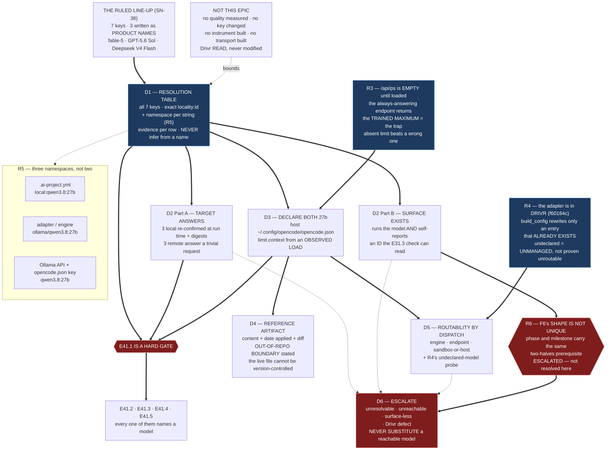

# Epic E41.1 — Target Resolution, Reachability, and Routability

## Context

**Nothing in M41 can be measured until every target has an exact name and answers to it.**

The CFO ruled the per-level model line-up on 2026-08-19 (SN-38) and directed that its evidence be
collected first. M41 collects it. **This epic is the hard gate in front of that collection**: E41.2,
E41.3, E41.4 and E41.5 all name models, and three of the ruled target values are **product names**,
not routable identifiers (M41 spec, F5). A model that cannot be named cannot be measured, and a
measurement taken against a different build than the one configured is worthless.

Two further conditions were established at M41's planning time and re-measured here: the config file
that makes a local model routable **lives outside this repository** and declares **neither** 27b
(F1), and the instrument M41 needs for its verification targets has no transport to three of them
(F2 — E41.4's problem, not this epic's).

**This epic resolves names, proves the targets answer, and makes the two 27b models routable. It
measures no model's quality and moves no configuration key.**

---

## Problem Statement

**A name that has not been resolved fails silently at every later step, and each later step will
produce a number anyway.**

The failure modes are specific and each has a precedent in this corpus:

- **Substitution.** A target that does not answer is quietly replaced by one that does, and the
  measurement is reported against the ruled row. That is the manufactured-substitute pattern
  `P12-GH-2` files one tier down — a validator that accepts its own placeholder.
- **Namespace collapse.** `.ai-project.yml` says `local:qwen3.8:27b`, the execution adapter wants
  `ollama/qwen3.8:27b`, Ollama's own API wants `qwen3.8:27b`. **Three strings, three surfaces.** A
  resolution table that records one of them and calls it "the ID" hands E41.2/E41.3 a value that
  fails somewhere they are not looking.
- **Unmanaged, not unroutable.** A model absent from `opencode.json` does not raise. The adapter's
  correction simply does not apply to it (R4 below). The absence is invisible from inside a run.
- **Reachable ≠ usable.** An API endpoint answering a trivial request proves the model exists. It
  does **not** prove a chat can be *opened* on it and self-report an identity the P9-M31-E31.3 check
  can read. **These are two different properties and this epic must record them separately** (R6).

Each of these produces a number. **None of them produces evidence.**

---

## ⚠ Planning-time measurements — re-measured for this spec, not inherited

**Measured by the M41 Milestone Chat on 2026-08-19, on branch `milestone/M41` (at `d98f95d`), by
executing the checks on this host**, not by reading the milestone spec's account of them. **G2 is
binding — the reviewer re-measures, and the executor's report is not the evidence.** Layer, time and
scope are stated per `P11-GH-2`.

**The M41 spec's F1–F6 hold.** Four are re-confirmed below at this layer; **three findings are new
or sharpened**, and R4, R5 and R6 change what this epic must produce.

### R1 — `opencode.json`: confirmed host-level, and confirmed to declare neither 27b

| | |
|---|---|
| Path | `/home/panchew/.config/opencode/opencode.json` — **1217 bytes, mtime 2026-07-22 23:30** |
| In this repository | **No copy.** `git ls-files` filtered for `opencode` returns only E38.4 measurement artifacts and P11 spec prose — **no config file** |
| Declared Ollama models | **exactly four** — `qwen3-coder:30b` (`limit.context` **262144**), `qwen2.5-coder:14b` (32768), `qwen2.5-coder:7b` (32768), `llama3.1:8b` (131072); every one `"tool_call": true` |
| Both 27b | **absent** |

**F1 confirmed at this layer, including its second half.** The addition is **two** models. The
`262144` on `qwen3-coder:30b` is the recorded **8× overpack** (E38.2, Finding 2) — **do not reproduce
that shape.**

*Verified: host filesystem + `git ls-files`, repo at `d98f95d`, 2026-08-19.*

### R2 — Both 27b models are present in Ollama, and this is a planning input, not the run's evidence

Against `http://localhost:11434/api/tags`, host, 2026-08-19:

| Model | Size | Digest (12) |
|---|---:|---|
| `qwen3.8:27b` | 17.7 GB | `22130167c4c2` |
| `qwen3.6:27b` | 17.4 GB | `a50eda8ed977` |
| `qwen3-coder:30b` | 18.6 GB | `06c1097efce0` |

Four others are present (`qwen2.5-coder:14b`, `llama3.1:8b`, `llama3:8b`, `qwen2.5-coder:7b`).

**These figures are a planning input. This epic re-confirms them at run time and records its own** —
the milestone spec says so explicitly, and this spec's numbers inherit that instruction rather than
discharge it. **Record the digest**, not only the name: a tag is mutable and a digest is what makes
"the model we measured" and "the model we configured" the same claim.

### R3 — `/api/ps` is empty right now, so the context limit cannot be derived without a load

`GET /api/ps` returns **`{"models":[]}`** (host, 2026-08-19, nothing loaded).

E38.2's Constraint 3 is binding: **derive the declared limit from what is observed LOADED, never
from the trained maximum.** With `/api/ps` empty the derivation is unavailable — so deriving
`limit.context` for each new entry **requires actually loading the model first**, then reading
`/api/ps` again. Loading is a runtime operation, not inference.

**"Empty" must never degrade to "use the trained max."** If a limit cannot be observed, the entry
carries **no** `limit.context` — an absent declaration is honest; an inherited maximum is the bug.

### R4 — NEW. **The execution adapter is in another repository, and an undeclared model is *unmanaged*, not *unroutable***

`grep -rln opencode lib/ bin/` in this repository returns **nothing**. The adapter lives in **Drivr**
— `~/soft-dev/drivr/drivr/execution/opencode.py` and `drivr/execution/context_limits.py`, Drivr HEAD
`f60164c`, read 2026-08-19.

Two consequences the milestone spec does not carry:

1. **"Routable through the execution adapter" is a claim about a second repository.** It is verified
   against Drivr's adapter, at Drivr's HEAD, and the record must say which HEAD. **This epic reads
   Drivr; it does not modify Drivr** (see Non-Goals).
2. **`build_config` only rewrites an entry that already exists.** Verbatim, `opencode.py`:

   ```python
   models = provider.get("models")
   if isinstance(models, dict) and bare_model in models:
   ```

   A model **absent** from the host file falls through this branch: no entry, no corrected
   `limit.context`, **no error**. So F1's *"neither 27b is routable through the execution adapter
   today"* is **stronger than what has been measured.** What is measured is that neither is
   **declared**, and that a declaration is the only thing the adapter's context correction can attach
   to. **Whether an undeclared model dispatches at all is a run-time question this epic answers by
   running it, not by reading.**

   **Either answer is a finding.** If it fails, F1 is confirmed as written. If it *succeeds*, the
   more dangerous shape is confirmed instead: **a lane could have run all along on a model with no
   managed context limit, silently** — which is the same family as the defect E38.2 fixed.

### R5 — NEW. **Three namespaces, not two.** F5 is necessary but not sufficient

`opencode.py` partitions the model string on `/` — `provider_name, _, bare_model = model.partition("/")`
— and passes `request.model` through to `opencode run --model <model>`. So one model has three
strings:

| Surface | Shape | Example |
|---|---|---|
| `.ai-project.yml` `models:` | `<locality>:<id>` | `local:qwen3.8:27b` |
| Execution adapter / engine | `<provider>/<id>` | `ollama/qwen3.8:27b` |
| Ollama API + `opencode.json` `provider.ollama.models` key | bare `<id>` | `qwen3.8:27b` |

**F5 says three product names must become routable identifiers. R5 says the resolution table must
also state, per row, which namespace each string belongs to** — otherwise the table is ambiguous
exactly where E41.2 and E41.3 will consume it. The remote rows have the same question in a different
form: the string `.ai-project.yml` will hold is what a **manual chat compares against a self-report**,
which is a third thing again from an API model ID.

### R6 — NEW, and escalated with this delivery. **F6's shape is not unique to `epic_manual`**

**Verified by reading `governance/systems/chat-hierarchy.md` §"Manual Chat Model Verification",
`milestone/M41` at `d98f95d`, 2026-08-19.** The self-verification method is stated there in terms:

> *"The only observed mechanism by which a chat can know what model it is currently running on is the
> **harness's own self-report**: this repository's harness (Claude Code) injects an `# Environment`
> block into every session's system context naming the running model."*

And the mismatch rule is *"refuse, unconditionally… no continuation, no 'proceeding with caution'."*

**The HQ ruling of 2026-08-19 decoupled `epic_manual` because landing `local:qwen3.8:27b` would halt
the manual Epic chats of M43–M47. The two halves of its carry-forward trigger — a surface that
*runs* the model **and** *self-reports an identity the E31.3 check can read* — are not properties of
`epic_manual`. They are properties of the mechanism, and the mechanism is the same for every manual
verification target.**

Applying it to the three keys E41.5 still lands:

| Key | Target | Does a surface run it? | Does that surface self-report an ID the check can read? |
|---|---|---|---|
| `creation` | fable-5 | **Suggestive** — a model line named Fable 5 with the exact ID `claude-fable-5` appears in this chat's own harness roster | Plausible (same harness family) — **unconfirmed** |
| `phase` | GPT-5.6 Sol | **Unknown** — not a Claude model; no surface identified in the corpus | **This harness cannot report it.** Its `# Environment` block names the Claude model it runs |
| `milestone` | Deepseek V4 Flash | **Unknown** — same | **Same** |

**What is verified, stated narrowly:** the self-report mechanism this framework's check depends on is
the harness's own environment block, and this harness reports the Claude model it is running. **What
is not verified:** whether any surface available to the CFO runs GPT-5.6 Sol or Deepseek V4 Flash
*and* emits a self-report at all. **That is a tooling question about his environment — precisely the
question HQ assigned to him as `epic_manual`'s owner.**

**Why this belongs in E41.1 rather than in E41.5.** E41.5's Definition of Done treats the halt as
*"correct, protective behaviour and a poor surprise"*, discharged by notifying the three armed
levels. **That framing presumes the notified level can then open on the new model.** For `creation`
that is probably true. For `phase` and `milestone` it is unverified, and if it is false the
consequence is the one HQ already ruled unacceptable for `epic_manual`: **P12's own remaining
milestones cannot be executed** — M43–M47 each require a Phase Chat and a Milestone Chat, not only
manual Epic chats.

**This epic does not resolve it and does not touch the line-up.** It **measures** it, as the second
half of every remote row's reachability record, and **the finding is escalated to the P12 Phase Chat
with this delivery** — the same route F6 took, for the same reason. **The row values are the CFO's
and are not re-decided here.**

#### R6a — **the undefined fourth state**

*Raised by the P12 Phase Chat on accepting this set, 2026-08-20; **re-verified here** by reading
`governance/systems/chat-hierarchy.md` on `milestone/M41` at `d98f95d`.*

The verification section defines **three** states, and only three:

| State | Defined behaviour | Where |
|---|---|---|
| Config value present, self-report present, **agree** | proceed | §Self-model verification method |
| Config value present, self-report present, **disagree** | **refuse, unconditionally** | §Mismatch |
| **Config side absent** (no `models:` block, or no key for this level) | explicit **permissive default** — proceed, and say so | §Absent block, or absent key |

**The fourth state — config value present, harness self-report ABSENT — is not defined anywhere.**
Verified: `self-report` occurs at exactly four places (`:298`, `:301`, `:304`, `:328`) — the method,
its known limit, and the mismatch rule — and the absent-case clause at `:309` is explicitly about the
**config** side (*"there is no configured expectation for this level to verify against"*), not the
harness side. A search for any clause covering a harness that emits nothing returns nothing.

**That is exactly the state a non-Claude-Code manual surface lands in.** So for `phase` and
`milestone` the question is not only *does a surface exist* — it is that **if one exists and emits no
readable self-report, the governing document does not say what the chat does.** Fail-closed
discipline says refuse; the document's own permissive instinct on the neighbouring case says proceed.
**Undefined is worse than either**, and it is undefined in the document that P12 exists to make
fail-closed.

**Consequence for this epic: D2 Part B records THREE things per target, not two** — does a surface
run it; **does that surface emit a self-report at all**; and does the self-report match. **The middle
one is recorded separately**, because it is the one with no defined answer.

#### R6b — **the mechanism has one known implementation, and the line-up moves the majority of its targets off it**

*Raised by the P12 Phase Chat, 2026-08-20; re-verified here.* `chat-hierarchy.md:298` reads
*"the **only observed mechanism** … this repository's harness (**Claude Code**)"*.

Counting where the ruled line-up leaves the five manual verification targets:

| Key | Target | Stays on the only harness where the check is observed to work? |
|---|---|---|
| `hq` | unchanged | **yes** — and it is why the HQ session that ruled this did not halt |
| `creation` | fable-5 (`claude-fable-5`) | **probably** — same harness family, unconfirmed |
| `phase` | GPT-5.6 Sol | **no** — leaves at E41.5 |
| `milestone` | Deepseek V4 Flash | **no** — leaves at E41.5 |
| `epic_manual` | `local:qwen3.8:27b` | **no** — leaves later, at its carry-forward |

**Three of five ultimately leave.** R6 as first filed asks whether a surface exists for a given row.
**The sharper form is that the check itself is Claude-Code-shaped, and the line-up relocates the
majority of its targets outside the only implementation it has ever had.**

**This does not change this epic's work, and it is not a challenge to the line-up.** It changes what
D2 Part B is evidence *about*: not four independent surface questions, but one mechanism question
asked four times.

### R7 — Suite baseline re-measured

**549 passed / 0 failed**, `PYTHONPATH=. pytest -q`, on `milestone/M41` at `d98f95d`, 2026-08-19,
35.26s. Matches the starter's figure. **Bare `pytest` fails collection — always set `PYTHONPATH=.`**

This epic is expected to add **no** test-visible behaviour to this repository; if it adds tests, name
the new total and the delta and attribute the delta to named tests.

---

## Goals

By the end of this Epic:

1. **Every one of the seven `models:` keys has its target recorded as an exact string**, with its
   locality prefix and its namespace stated, and **no product name survives anywhere a later epic
   will read.**
2. **Every target that M41 will measure has a dated reachability result**, stating the layer it was
   checked from, and — for the manual verification targets — **stating separately whether a surface
   exists that a chat can open on and that self-reports a readable identity.**
3. **Both 27b models are declared in the host `opencode.json`** with a `limit.context` derived from
   an observed load, and the resulting file content is committed as a **reference artifact** that
   states its own out-of-repo boundary.
4. **Routability is demonstrated by dispatch, not asserted** — including the answer to R4's open
   question about what an undeclared model actually does.
5. **Anything unresolvable or unreachable is escalated, and nothing is substituted.**

---

## Non-Goals

This Epic explicitly does **not**:

- **Measure any model's quality, judgment, or agentic discipline.** That is E41.2, E41.3 and E41.4.
  A trivial request proving a target answers is reachability, not measurement.
- **Build the successful-nothing instrument** (E41.2) or **the remote transport** (E41.4).
- **Change any value in `.ai-project.yml`, `model-routing-policy.md`, `bin/ai-project-orchestrator`,
  `governance/systems/chat-hierarchy.md` or `tests/test_model_config.py`.** E41.5 lands the line-up,
  behind two gates. **This epic writes the resolved strings into a spec-level artifact, never into
  the configuration.**
- **Modify Drivr.** Drivr is read to determine what the adapter does. A defect found there is
  **recorded and escalated**, not fixed here.
- **Resolve F6, or R6.** Both are surface questions owned by the CFO. This epic measures and reports.
- **Add any model to `opencode.json` beyond the two 27b models**, or alter the four existing entries
  — including `qwen3-coder:30b`'s recorded overpack. **Fixing that overpack is not in scope and must
  not be done silently**; if the epic believes it should be fixed, it says so and escalates.

---

## Scope of Work

### 1. The resolution table (D1)

One row per `models:` key — **all seven, including the two that do not move**, because a reader of
this artifact must be able to determine what every key resolves to without consulting a second
document.

**Must include, per row:**

- The ruled target **as written by the CFO** (product name, verbatim, so the mapping is auditable).
- The **exact `<locality>:<id>` string** that E41.5 will write into `.ai-project.yml`.
- The **adapter/engine string** (`<provider>/<id>`) and the **bare API id**, where the row is local
  (R5). Where the row is remote and manual-only, state that no adapter string exists and why.
- **How it was resolved** — the surface consulted, the date, and the exact response or roster entry
  relied on. **Do not infer an ID from a product name.** A resolution whose evidence is "the name
  looks like this ID" is recorded as **unresolved**, not as resolved-with-a-caveat.
- **Digest** for local rows (R2).

### 2. Reachability, in two separately-recorded parts (D2)

**Part A — the target answers.**

- **Three local models re-confirmed at run time** — `qwen3.8:27b`, `qwen3.6:27b`, `qwen3-coder:30b`
  — against the Ollama tags endpoint, with digests. **Do not inherit R2's figures or the milestone
  spec's.**
- **Three remote targets each answering a trivial request**, with the request, the response and the
  surface recorded.

**Part B — a chat can be opened on it, and the check can read it** *(R6)*.

For each of `creation`, `phase`, `milestone` (and, recorded for completeness, `epic_manual`), state
**three** things, in three separately-recorded columns (R6a):

- whether a surface is known that **runs** that model;
- **whether that surface emits a self-report AT ALL** — recorded independently of whether it matches,
  because this is the state `chat-hierarchy.md` leaves **undefined**;
- whether that self-report carries an identity the **P9-M31-E31.3 check can read** and match;
- and, where any of the three is unknown, **say unknown.** An unknown recorded as unknown is this
  epic delivering; an unknown rendered as a checkmark is the failure this milestone exists to prevent.

**Part A and Part B may not be merged into one column.** A model answering an API is not a surface a
chat runs on, and `P11-GH-2` requires the distinction to be visible in the record.

### 3. Both 27b models declared in `opencode.json` (D3)

**Must include:**

- `qwen3.6:27b` and `qwen3.8:27b` added under `provider.ollama.models`, each with `"tool_call": true`
  and a `limit` whose `context` is **derived from an observed load** — load the model, read
  `/api/ps`, use the value it reports (R3). Drivr's `drivr.execution.context_limits` implements
  exactly this and **may be used** rather than re-derived; if it is, cite the function and Drivr's
  HEAD.
- **If the limit cannot be observed for a model, the entry ships with no `limit.context` at all**,
  and the record says why. **Never a trained maximum. Never `qwen3-coder:30b`'s `262144` copied
  across.**
- The four existing entries **untouched**, verified by a before/after diff of the file.
- `output` chosen and its basis stated (the existing entries all read `8192`; matching them is a
  defensible choice, and *stating* that it was a choice is the requirement).

### 4. The committed reference artifact (D4)

The live file is **outside the repository and cannot be version-controlled.** The record is the
artifact.

**Must include:** the resulting file content verbatim; the date applied; the host it was applied on;
the before/after diff; and **an explicit statement of the out-of-repo boundary** — that this artifact
is a *record of* a host mutation, that nothing in this repository enforces it, and that a fresh
machine will not have it. Location under `.ai-project/artifacts/reference/` is delegated (below).

### 5. Routability demonstrated (D5)

**Dispatch, do not assert.** At minimum, one dispatch per newly-declared 27b model through the
execution adapter, recording: the engine, the endpoint, whether it ran in the sandbox or on the
host, the exact model string used, and the outcome.

**And answer R4's open question explicitly:** what happens when a model is **not** declared in
`opencode.json` — does the dispatch fail, or does it run unmanaged? Determine it by running it (a
model absent from the file is available for this: any of the four non-declared Ollama models on this
host will do, and using one of *those* rather than a 27b keeps the answer independent of the change
this epic is making). **Record the answer either way; it corrects or confirms F1.**

### 6. Escalation, where required (D6)

An **Escalation Notice** (`governance/templates/escalation-notice.md`) to the M41 Milestone Chat for
any of:

- a target that cannot be resolved to an exact string on evidence;
- a target that does not answer;
- **any manual verification target for which Part B's answer is "no surface" or "unknown"** — R6's
  case, which is already escalated at spec level and must be escalated again **with the run's own
  evidence** if the run confirms it;
- a defect found in Drivr's adapter.

**Do not substitute a reachable model for an unreachable one.** Do not narrow a row to make it pass.

---

## Deliverables

This Epic must produce:

- [ ] **D1** — The resolution table, all seven keys, namespaces stated, evidence per row
- [ ] **D2** — The reachability record: Part A (target answers) and Part B (surface runs it / emits a
      self-report at all / that self-report is readable and matches — **three columns**, R6a),
      separately recorded, dated, with the check layer stated
- [ ] **D3** — Both 27b models declared in the host `~/.config/opencode/opencode.json`, limits
      derived from an observed load
- [ ] **D4** — The committed reference artifact carrying the resulting content, the date applied and
      the out-of-repo boundary, under `.ai-project/artifacts/reference/`
- [ ] **D5** — The routability demonstration, including R4's undeclared-model answer
- [ ] **D6** — Escalation Notice(s) for anything unresolved, unreachable, surface-less, or found
      broken in Drivr — or a positive statement that none was required
- [ ] **Epic Delivery Notice** (`governance/templates/delivery-notice.md`)

---

## Binding Constraints

Inherited, and not re-decidable in this Epic:

1. **The line-up is the CFO's** (SN-38). This epic resolves names; it does not question rows.
2. **Escalate; never substitute.** A reachable model is not a stand-in for an unreachable one.
3. **Never infer an identifier from a product name.** Suggestive evidence is recorded as suggestive.
4. **Never derive a declared context limit from a trained maximum** (E38.2 Constraint 3). Absent
   beats wrong.
5. **`P11-GH-2` — state the layer, time and scope of every claim.** Reachable from this host is not
   reachable from the sandbox; declared in a file is not routable through an adapter.
6. **The Hard Constraint (M41 spec) applies in full**: every number measured, every run reported, no
   best-of-N, and **the bar committed before the run it judges.** This epic makes no quality
   judgment, but its pass/fail conditions — *"answers"*, *"routes"* — are committed in this spec
   before any run, and are not loosened afterwards.
7. **This corpus defeats naive pattern-matching.** `\b` is unusable against the `__` filename
   convention; `--include='*.py'` skips every `bin/` entry point. **Falsify a pattern before trusting
   a zero result.**
8. **Every inventory is a floor.** Seven keys, three namespaces, six targets: if a seventh surface
   turns up, it is recorded, not filed under the number already written.

---

## Design Decisions Delegated — decide, document, proceed

These are the Epic Chat's. Pick a direction, record the reasoning, **do not escalate**:

1. **Where the `opencode.json` reference artifact lives** under `.ai-project/artifacts/reference/` —
   a new directory or an existing one. Existing siblings: `comfyui-endpoint`, `local-paid-comparison`,
   `local-review-backtest`, `token-measurement`, `v7-bump-procedure`.
2. **Whether to use Drivr's `observe_loaded_context` / `load_model` or a direct `/api/ps` read** for
   the limit derivation. Both are defensible; reusing Drivr's is the "do not reinvent" choice and
   costs a cross-repo citation. **State which, and why.**
3. **The resolution table's exact columns and layout**, provided every element in Scope §1 is
   present and machine-readable enough for E41.2–E41.5 to consume without re-deriving.
4. **Which non-declared model is used for R4's undeclared-model probe**, and what "it ran" is taken
   to mean for that probe.
5. **Whether D1–D5 land as one artifact or several.** One document with sections is acceptable; so
   is a table plus a records directory. **Name the choice in the Delivery Notice.**

---

## Definition of Done

Epic E41.1 is complete when:

- [ ] All seven keys appear in the resolution table with an exact `<locality>:<id>` string, and **no
      cell anywhere in the artifact set contains an unresolved product name**
- [ ] Each resolution cites the surface, date and exact evidence it rests on; nothing is inferred
      from a name
- [ ] Reachability Part A is recorded for all six measured targets, dated, with the check layer named
- [ ] Reachability Part B is recorded for every manual verification target across **all three**
      questions (runs / emits any self-report / readable and matching), with *unknown* recorded as
      unknown — and the **emits-anything** column present even where the other two are unknown
- [ ] Both 27b models are present in the host `opencode.json` with `tool_call` set and a limit
      derived from an observed load — or with no `limit.context` and the reason stated
- [ ] The four pre-existing entries are byte-identical after the change, shown by diff
- [ ] The reference artifact is committed, carries the file content and the date applied, and states
      its out-of-repo boundary explicitly
- [ ] At least one dispatch per newly-declared 27b model is recorded with its engine, endpoint,
      sandbox-or-host, model string and outcome
- [ ] R4's question is answered by a run and the answer recorded, confirming or correcting F1
- [ ] Every unresolved / unreachable / surface-less target has an Escalation Notice, or the record
      states positively that none was required
- [ ] Suite green at **549** (`PYTHONPATH=. pytest -q`), no regressions, no skips added
- [ ] Delivery Notice produced and committed; all work committed to `epic/P12-M41-E41.1`; PR opened
      to `milestone/M41`

---

## Acceptance Criteria

The milestone spec's four criteria for E41.1, expanded:

- [ ] **Every moving key has an exact `<locality>:<id>` string recorded, and none is a product name**
      — and, per R5, the string's namespace is stated, so a consumer knows which surface it is for
- [ ] **Every target has a dated reachability result with its check layer stated** — and, per R6,
      the *surface* questions are answered separately from the *endpoint* question for every manual
      verification target — including R6a's undefined state, *does it self-report at all*
- [ ] **Both 27b models are declared in the host `opencode.json` and the file's content is committed
      as a reference artifact with its out-of-repo boundary stated** — and routability is shown by a
      dispatch, not asserted from the file's contents
- [ ] **Any unreachable or unresolvable target is escalated, and no substitute is chosen locally**
- [ ] A reader of E41.2, E41.3 or E41.5 can take the strings they need from this epic's artifacts
      **without re-resolving anything**, and can tell for each one where it came from

---

## Technical Constraints

**Format:** Markdown with YAML front-matter; the reference artifact carries JSON verbatim in a fenced
block.
**Surfaces in scope:** the host file `~/.config/opencode/opencode.json`; new artifacts under
`docs/phases/P12__Completion_Fail_Closed_Defaults_and_the_Drivr_MVP/` and
`.ai-project/artifacts/reference/`.
**Do not touch:** `.ai-project.yml`; `model-routing-policy.md`; `bin/ai-project-orchestrator`;
`governance/systems/chat-hierarchy.md`; `tests/test_model_config.py`; anything under `~/soft-dev/drivr`.
**Invocation:** `PYTHONPATH=. pytest -q` — bare `pytest` fails collection.
**Compatibility:** the `opencode.json` edit must leave the four existing entries byte-identical.

---

## Dependencies

**Internal**
- **This Epic gates E41.2, E41.3, E41.4 and E41.5.** Ordering is binding (M41 spec): E41.1 first;
  E41.2 before E41.3; E41.4 parallel with E41.2/E41.3 once E41.1 lands; E41.5 terminal.
- **`milestone/M41`** at `d98f95d`, which carries the M41 spec at **v1.1.1** and the 2026-08-19 HQ
  ruling on F6.
- **Drivr** at `~/soft-dev/drivr`, HEAD `f60164c` — **read-only**, and the HEAD must be cited in any
  claim about the adapter.

**External / CFO-side**
- **Availability of the three remote targets.** HQ verified local models only. Unresolvable or
  unreachable is an escalation, not a substitution.
- **A surface for each manual verification target** (R6) — unverified for `phase` and `milestone`,
  escalated at spec level, and re-escalated with run evidence if the run confirms it.
- **Ollama reachable on `localhost:11434`** — confirmed at planning time; re-confirm at run time.

**Blockers**
- None known. R6 is a finding under escalation, **not** a blocker on this Epic's own work: this Epic
  measures the condition and reports it.

---

## Timeline

**Estimated Effort:** 1 session.
**Target Completion:** first, ahead of every other M41 epic.
**Actual Completion:** In progress.

---

## Execution Notes

**Suggested order — the cheap gates first, so an escalation surfaces early:**

1. Re-confirm the three local models and their digests (minutes).
2. Resolve the three remote product names and confirm each answers. **If one does not resolve, raise
   the escalation immediately** rather than at the end — E41.4 is gated on this and waiting on a
   late escalation costs the phase, not the epic.
3. Record reachability Part B alongside Part A while the surfaces are in front of you.
4. Load each 27b, observe the context, write the two entries, diff the file.
5. Dispatch each 27b; then run the undeclared-model probe (R4).
6. Commit the reference artifact and the record; write the Delivery Notice.

**Two traps this corpus has already paid for:**

- **`/api/show` is the trap endpoint.** It always answers and it answers with the trained maximum.
  `/api/ps` is the admissible one and it is empty until a model is loaded (R3).
- **`git status` before every commit.** This is a shared worktree left on whatever branch the last
  session used, and **verify pushes at `origin`** — `git log -1 <branch>` reads a local ref and
  proves nothing.

---

## Related Documents

- [M41 Milestone Spec](P12-M41__milestone-spec.md) — v1.1.1, findings F1–F6 and the Hard Constraint
- [M41 Milestone Execution Chat Starter](P12-M41__milestone-execution-chat-starter.md)
- [P12 Phase Spec](P12__phase-spec.md) — §P12.1
- `.ai-project/artifacts/rulings/2026-08-19__ai-project-system-hq__ruling__m41-m42-acceptance-and-f6-escalation.md`
- `.ai-project/artifacts/steering-notes/2026-08-19__creation-chat__steering-note__model-lineup.md` — SN-38
- [P11-M38-E38.2 spec](../P11__Drivr_Coordination_Over_Rented_Execution/P11-M38-E38.2__spec__execution-adapter-surface-and-opencode-adapter.md) — the `/api/ps` vs trained-maximum finding and Constraint 3
- `governance/systems/chat-hierarchy.md` — Manual Chat Model Verification (P9-M31-E31.3)
- `.ai-project/artifacts/reference/token-measurement/model-routing-policy.md` — rows P1–P7, Change discipline

---

## Visual Bindings

**Visual binding**
- **Link:** (inline — Structural diagram; no hosted link needed per AOG §16.3/§16.5)
- **What:** diagram
- **Level:** Epic
- **State:** proposed



- **Description:** E41.1's five deliverables and the three planning-time findings that reshaped them.
  The ruled line-up arrives as product names; D1 turns them into exact strings **and states which of
  three namespaces each belongs to** (R5). Reachability splits in two — *the target answers* versus
  *a chat can be opened on it and self-report an ID the check can read* — because the second is what
  the F6 ruling actually turned on, and **the same prerequisite applies to `phase` and `milestone`**
  (R6, escalated). The context limit comes from an observed load, never the always-answering endpoint
  that returns the trained maximum (R3). The adapter lives in Drivr and rewrites only entries that
  already exist, so an undeclared model is **unmanaged rather than proven unroutable** (R4) — a
  question this epic answers by running it. Proposed-track Structural diagram (AOG §16.3/§16.6),
  Mermaid, no ComfyUI.

---

## Notes

- **On R6, and why it is filed rather than absorbed.** The M41 spec's F6 was escalated by the Phase
  Chat and ruled by HQ within a day, and the ruling's reasoning was **not** *"`epic_manual` is
  special"* — it was *"a terminal epic that disables the execution of the four milestones after it is
  not a scheduling detail."* **That reasoning does not stop at `epic_manual`.** M43–M47 each require
  a Phase Chat and a Milestone Chat, and E41.5 arms both of those rows. Recording this as an
  observation inside an epic spec would bury it; **it is escalated to the Phase Chat with this
  delivery**, and this epic's D2 Part B is what will turn it from an argument into a measurement.

- **What R6 is not.** It is not a challenge to the line-up, not a request to re-decide a row, and not
  a proposal to change either of E41.5's gates. All three are settled above this chat. It is a
  **prerequisite finding of exactly F6's kind**, raised at the level that found it, by the epic whose
  job is to check whether targets are usable.

- **On F1, held rather than repeated.** F1 says neither 27b is *routable*; what has been measured is
  that neither is *declared*, and R4 shows those differ. **The milestone spec is not wrong about what
  matters** — the addition is still two models and still M41's work. But this epic will produce the
  run that settles which claim is true, and it should say so plainly either way. **A finding that
  survives re-measurement is stronger for having been re-measured; one that does not is exactly what
  G2 exists to catch.**

- **On the overpack, left deliberately in place.** `qwen3-coder:30b` declares `262144` against a
  32,768 load. It is a live defect in a file this epic edits, and it is **out of scope** — the
  incumbent's declared context is an input to E41.2's baseline, and changing it mid-milestone would
  make the incumbent measured on a different configuration than the one its historical evidence came
  from. **Record it; do not fix it silently; escalate if you think it must move.**

---

## Changelog

| Version | Date | Change |
|---|---|---|
| 1.0.1 | 2026-08-20 | **Folds in the two sharpenings the P12 Phase Chat returned when it accepted this set and escalated R6 to HQ** — both **re-verified here against `chat-hierarchy.md` on `milestone/M41` at `d98f95d`**, not taken on report. **R6a — the undefined fourth state:** the verification section defines config-present-and-agreeing, config-present-and-disagreeing, and config-**absent**; it does **not** define config value present with the **harness self-report absent**, which is exactly where a non-Claude-Code manual surface lands. `self-report` occurs at `:298`, `:301`, `:304`, `:328` only, and the absent-case clause at `:309` is about the config side. **R6b — one known implementation:** `:298` names Claude Code as *the only observed mechanism*, and the ruled line-up ultimately moves **three of five** manual verification targets off it. **Consequence for the work: D2 Part B records THREE questions per target, not two** — runs it / emits a self-report at all / readable and matching — with the middle column recorded separately because it is the one with no defined answer. Deliverable D2, the DoD and the acceptance criteria updated to match. **No change to scope, deliverable count, ordering, or any row of the line-up. Amended before any Epic Chat existed for E41.1, so this is editing, not propagation — `P11-GH-1`'s channel had no addressee and is not exercised by it.** |
| 1.0.0 | 2026-08-19 | Initial E41.1 spec, from M41 spec v1.1.1 and the P12 Phase Spec §P12.1. **Seven planning-time re-measurements (R1–R7)**, taken on `milestone/M41` at `d98f95d`: F1 and the Ollama roster re-confirmed at this layer (R1, R2); `/api/ps` empty, so the limit derivation requires an actual load (R3); **three new findings** — the execution adapter lives in **Drivr** and its `build_config` rewrites only entries that already exist, so an undeclared model is **unmanaged rather than proven unroutable** (R4); a model has **three namespace-specific strings**, so F5's product-name resolution is necessary but not sufficient (R5); and **F6's two-halves surface prerequisite applies equally to `phase` and `milestone`**, which E41.5 still lands — **escalated to the P12 Phase Chat with this delivery, not resolved here** (R6). Suite re-measured at 549 (R7). Deliverables D1–D6; reachability split into *target answers* and *surface exists*; five delegated design decisions. |
