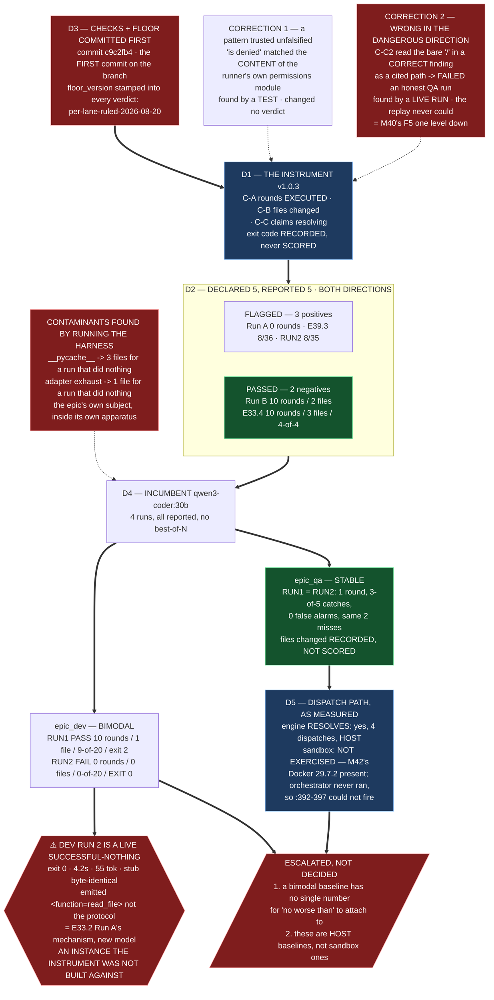

# E41.2 — Execution Record: The Successful-Nothing Instrument and the Incumbent's Baseline

**Branch:** `epic/P12-M41-E41.2`, branched from `milestone/M41` at `575b0fd`.
**Execution mode:** manual, `remote:claude-opus-5`, as the starter declares.
**Every measurement below was taken on this branch on 2026-08-22 unless a different date
is stated.** Layer, time and scope are stated per `P11-GH-2`.

---

## 0. Prerequisite verification, discharged — and one disagreement with the spec

| # | Check | Result |
|---|---|---|
| 1 | Branch | `epic/P12-M41-E41.2` created from `origin/milestone/M41` at `575b0fd`. Branch re-checked before **every** commit |
| 2 | **E41.1 landed — the hard gate** | **YES.** PR #230 merged to `milestone/M41` at `f97161f`, `mergedAt 2026-08-22T05:35:03Z`. Its §8 table was read for the model strings; **none was re-resolved and none was invented** |
| 3 | Artifact tracking | All nine paths returned by `git ls-files --error-unmatch` **on this branch**, not by `ls` |
| 4 | **Model verification (P9-M31-E31.3)** | `.ai-project.yml` `models.epic_manual` read from the file: **`remote:claude-opus-5`**. This chat's harness self-report: *"You are powered by the model named Opus 5. The exact model ID is claude-opus-5."* **They agree** |
| 5 | Docker | **Present.** `Docker version 29.7.2, build a7dcaa6` |
| 6 | S1–S6 re-measured | See below. **Five confirmed, one disagreement** |

### ⚠ The spec is wrong on one measurement, and it is a stale version string

**S6 states `Docker version 29.6.1` is present on this host** (measured by the Milestone
Chat 2026-08-20). **Measured here 2026-08-22: `Docker version 29.7.2, build a7dcaa6`.**
The host was upgraded between the two readings. **The material claim survives intact** —
Docker is present, so the dependency is real and non-blocking rather than absent — but
the version string in the spec no longer describes this host. Recorded because G2 makes
re-measurement binding and a disagreement is reported whether or not it changes anything.

### The other five, re-measured rather than inherited

| | Spec says | Measured here |
|---|---|---|
| **S1** | the criterion is satisfied by an always-fail instrument | **Confirmed by construction** — the DoD adds two negative controls and they are the only reason `return FAIL` is excluded |
| **S2** | exit 0 → 0 rounds → nothing; exit 2 → 10 rounds → mergeable | **Confirmed on the artifacts**, and then **reproduced live** (§3, DEV RUN 2) |
| **S3** | Run B has a transcript and **no** run-metadata file | **Confirmed.** `ls` of `P10-M33-E33.2/` shows `transcript-A-…json`, `transcript-A-…__run-metadata.json`, `transcript-B-…json` and no `transcript-B-…__run-metadata.json` |
| **S4** | the three counters are not redundant | **Confirmed and sharpened** — §2.3 |
| **S5** | `bin/run-qa-agent` refuses a mutating tool set | **Confirmed.** The intersection is built at `:336` and `fail()` is raised at `:339-344`. *(The spec cites `:337`, which is inside the intersection expression rather than the refusal; the starter's `:336-344` is the accurate anchor.)* |
| **Suite** | 549 | **549 passed / 0 failed**, `PYTHONPATH=. pytest -q`. Bare `pytest` still fails collection |

---

## 1. D3 — the checks and the floor, committed before anything ran

**`docs/phases/P12__…/P12-M41-E41.2__check-list-and-floor.md`, committed at
`c9c2fb43fb241eda82a7256acb438576a85b377b` (`c9c2fb4`).**

**That commit is the first commit on this branch.** Nothing had been measured when it
landed — not a replay, not a dispatch. The Hard Constraint is discharged by ordering, not
by assertion, and `git log` on the branch is the proof.

**The floor applied, stated explicitly as the milestone requires:
`per-lane-ruled-2026-08-20` — the RULED per-lane form.** The instrument stamps
`floor_version` into **every** verdict it emits, so no record of this epic can be
misread as having used the pre-ruling absolute floor.

| Lane | Floor | `files changed` |
|---|---|---|
| `epic_dev` | `rounds > 0` AND `files changed > 0` | scored |
| `epic_qa` | `rounds > 0` AND `claims resolve` | **recorded, not scored** |

**Criterion 2 is intact.** No run in this epic reached its floor through a mutating QA
tool set, and the claim is checkable from the artifacts rather than from this chat:
both QA runs record `tools_enabled: ["read_file", "list_dir"]` and
`tools_sha256: 83ff08e7b3492fd38aee92bbe13fe2118535d1d9fa8f120372b362c64cfb69e7`.
`.ai-project/agents/qa-tools.json` was not modified by this epic.

---

## 2. D1 + D2 — the instrument, and the replay in both directions

**The instrument:** `bin/successful-nothing-instrument`, at **v1.0.3**.
**The declared set:** `docs/phases/P12__…/P12-M41-E41.2__replay-set.json`, committed at
**`5773703`** — **in its own commit, ahead of the replay**, so *declared first* is
auditable rather than asserted.
**The full machine record:** `.ai-project/artifacts/agentic-runs/P12-M41-E41.2/replay-validation.json`.

### 2.1 The result — declared 5, reported 5

```
instrument 1.0.3 · floor per-lane-ruled-2026-08-20
declared cases: 5    reported: 5

case                       lane      verdict rounds  files     claims  provenance
E33.2 Run A                epic_dev  FAIL         0      0       0/0*  transcript-derived
E39.3                      epic_qa   FAIL         0      0       8/36  transcript-derived
E39.3 RUN2                 epic_qa   FAIL         0      0       8/35  transcript-derived
E33.2 Run B                epic_dev  PASS        10      2       0/0*  transcript-derived
E33.4                      epic_dev  PASS        10      3        4/4  transcript-derived

* = no claims asserted; C-C passes vacuously and the vacuity is recorded, not hidden
```

**Three positives flagged. Both negative controls pass, with their counts.** *"Run B
passed"* is not a result — **`10 tool rounds, 2 files changed`** is, and the two paths are
`local_agent_runner/__init__.py` and `tests/test_public_api.py`.

**No case was unloadable, and the ERROR path was still proven rather than assumed.** A
falsification control outside the declared set was run with one missing transcript and one
malformed one; both were reported as **ERROR, named, with their reason, and counted** —
`declared 3, reported 3`.

**The S3 counterfactual, measured:** a metadata-requiring harness applied to this same
declaration reports **4 cases**, and the one it drops without erroring is **E33.2 Run B —
the primary negative control.** Confirmed by running the filter over the declaration.

### 2.2 ⚠ The instrument was wrong twice, and neither error was found by argument

**A tool that was correct on the first try is a claim. A tool with recorded corrections is
evidence.** Both corrections are below in full, with what found them and what they cost.

#### Correction 1 — a pattern trusted without being falsified

`call_failed()` matched `is denied` **anywhere** in a tool result, under `re.MULTILINE`.
It therefore scored `read_file('local_agent_runner/tools.py')` as **denied** — because
that file is the runner's **permissions module**, and its content contains the denial
message templates it exists to emit.

- **Found by:** a unit test asserting Run B had exactly 3 denied calls. It had 4.
- **Not found by:** the five-case replay. **It changed none of the five verdicts**, because
  Run B asserts no claims and so nothing depended on the misclassification.
- **What it would have cost:** a false unresolved claim on any live run that reads a file
  discussing permissions and then cites it.
- **Fixed by** anchoring to the runner's actual refusal shape — every refusal is emitted as
  `<tool>: …` at the **start** of the result (`local_agent_runner/tools.py:58-119`).

**This is the trap the starter names by name:** *falsify a pattern before trusting a
result.* It was reproduced inside the instrument built to detect unfalsified claims.

#### Correction 2 — wrong in the DANGEROUS direction, and only a live run found it

C-C2 accepted any backticked token containing a `/` and no whitespace as a cited
repository path. **On the first live `epic_qa` run it extracted the bare token `/`** —
from the run's entirely correct finding that `healthcheck.path` *"does not start with
`/`"* — could not resolve it, and returned **FAIL on a grounded, one-round, read-only run
that had genuinely read the file.**

**That is the mirror of `return FAIL`, and it is M40's F5 shape one level down: the run
scored worse for stating a correct finding.** An instrument with this defect would have
failed every honest QA run that quoted a path prefix, and M41 would have concluded — on a
number — that the incumbent cannot do QA.

- **Found by:** the first live dispatch. **The five-case replay could never have found it:**
  none of the five recorded runs quotes a bare path separator.
- **Fixed by** requiring a path to have at least two non-empty segments, which also excludes
  globs and regexes.
- **Re-measured after the fix: the five replay verdicts and all fifteen of their counts are
  unchanged.** The correction did not buy the negatives their PASS.
- **Two regression tests**, and the second one exists because *narrowing a check until it
  extracts nothing is not a fix*: it asserts E33.4's four real backticked paths are still
  extracted and still resolve.

### 2.3 What the replay establishes about the three counters — S4, sharpened

| | Caught by rounds | Caught by files changed | Caught by claims |
|---|---|---|---|
| E33.2 Run A | **yes** (0) | yes (0) | no — it asserts nothing |
| E39.3 / RUN2 | **yes** (0) | n/a — not scored on `epic_qa` | **yes** — 28 and 27 unresolved |

**And a finding the spec did not have.** The spec names **one** fabricated key in E39.3
(`framework_version`, line 26). **There are two.** Line 10 asserts
`read_file('.ai-project.yml') shows overrides.branch_strategy` — and `.ai-project.yml`
has **no `overrides` block at all**; its top-level keys are `governance`, `project`,
`cfo_review_gate`, `models`, `visual_artifacts`. **RUN2 asserts only the one**, which is
why the two runs' claim totals differ (36 vs 35) while their verdicts do not.

**C-C3's independence is real but is not demonstrated by the archive.** On these five
cases every C-C3 failure sits on a run that already failed on rounds. C-C3 is kept because
it is the only one of the three that catches a run which **does** call tools and still
cites what is not there — the next shape, not the last one — and that claim is a design
argument, **not** something this epic's evidence establishes. It is stated as an argument.

---

## 3. D4 — the incumbent's two baselines

**Model `qwen3-coder:30b`, taken from E41.1's §8 table and from `.ai-project.yml`'s
`models.epic_dev` / `models.epic_qa` (`local:qwen3-coder:30b`).** Two runs per lane, **all
four reported, none discarded, no best-of-N.** No run failed mechanically, so nothing was
excluded.

### 3.1 The four runs

| Run | Lane | Verdict vs floor | Rounds | Files changed | Claims | Directional check | Exit | Status | Tokens | Duration |
|---|---|---|---:|---:|---:|---|---:|---|---:|---:|
| **DEV RUN 1** | `epic_dev` | **PASS** | **10** | **1** (worktree) | 0/0 vacuous | **9 / 20** | 2 | `max_iterations_exceeded` | 2888 | 121.1 s |
| **DEV RUN 2** | `epic_dev` | **FAIL** | **0** | **0** (worktree) | 0/0 vacuous | **0 / 20** | **0** | `completed` | 55 | **4.2 s** |
| **QA RUN 1** | `epic_qa` | **PASS** | **1** | 0 *(recorded, not scored)* | 0/0 vacuous | **3 / 5 catches, 0 false alarms, 0 unclear** | 0 | `completed` | 355 | 8.9 s |
| **QA RUN 2** | `epic_qa` | **PASS** | **1** | 0 *(recorded, not scored)* | 0/0 vacuous | **3 / 5 catches, 0 false alarms, 0 unclear** | 0 | `completed` | 355 | 7.3 s |

**Advertised tool set, recorded per run** (Binding Constraint 7 — *an absence is only
evidence when the thing that would have created it actually ran*):

- **dev runs:** `read_file, write_file, edit_file, list_dir, run_command, git`, committed
  with the task at `dev-task/workspace/.ai-project/agents/tools.json`.
- **QA runs:** `read_file, list_dir`, sha256 `83ff08e7b3492fd3…`, captured **at run time**
  by `bin/run-qa-agent` — authoritative, not read back afterwards.

**So DEV RUN 2's zero is a finding.** Six tools were genuinely advertised to it.

### 3.2 ⚠ DEV RUN 2 is a live successful-nothing, captured today, on the incumbent

**This is the headline result of the epic.**

The run exited **0** with `status: completed` in **4.2 seconds** and **55 tokens**, and
produced **nothing**: `durations/parse.py` is byte-identical to the committed stub
(`diff` reports no difference), 0 of 20 tests pass, and `git status` in the workspace is
empty once the adapter's own artifact directory is excluded.

**What it actually emitted, verbatim from the transcript:**

```
I'll implement the `parse_duration` function according to the specifications. Let me
first check the current stub in the file to understand what needs to be replaced.

<function=read_file>
<parameter=path>
durations/parse.py
</parameter>
</function>
</tool_call>
```

**That is E33.2 Run A's mechanism, on a different model, on the lane M41 is qualifying.**
Run A wrapped its calls in a ` ```json ` fence; this one wrapped a call in
`<function=…>` XML. In both cases the model **tried**, the runner's parser saw **no
protocol tool call**, treated the message as a final answer, and reported success.

**Three things follow, and each is checkable from the artifacts:**

1. **The instrument caught an instance it was not built against.** DEV RUN 2 did not
   exist when the checks were committed at `c9c2fb4`. This is the strongest validation in
   the epic, and it is stronger than the replay, because the replay's five outcomes were
   known before the instrument was written.
2. **S2 reproduced, live and unprompted.** Of the two dev runs, **the clean exit belongs
   to the one that did nothing** and **exit 2 to the one that shipped work**. The
   anti-correlation is no longer a fact about two runs from July.
3. **The lane's failure is not a model quality problem.** The model composed a correct
   call with correct arguments. The runner's protocol parser did not accept the syntax it
   arrived in. **Recorded, not fixed — the lane is M42's**, and the Non-Goals are explicit.

### 3.3 The `epic_dev` baseline is BIMODAL, and that is a problem for E41.3

**The incumbent's two dev runs are `PASS` and `FAIL` on identical inputs.** The task, the
context, the tool set, the runner, the model and the endpoint were the same; the workspace
was re-instantiated from the same fixture. **The only variable is the run.**

**So there is no single incumbent number for E41.3's relative bar to be measured against**
on the dev lane. *No worse on every objective check* is not defined against a baseline
that is `{PASS 9/20, FAIL 0/20}`. **This is escalated, not decided** — the bar's shape is
settled above this chat (Binding Constraint 3, M41 Binding Constraint 7), and choosing an
aggregation rule after seeing the data is precisely the failure the *bar-committed-first*
rule exists to prevent. See §6.

**The `epic_qa` baseline is not bimodal:** both runs are identical on every term —
1 round, 3 catches, 0 false alarms, 0 unclear, all 12 rules reported, `VERDICT: FAIL`.

### 3.4 What the runs show about the tasks themselves

**`epic_dev`, 9/20.** DEV RUN 1 wrote a complete, plausible implementation with one
inverted comparison: `if unit_index >= last_unit_index` where `last_unit_index` starts at
`-1`, so **every** valid input raises. All 9 of its points come from the error cases and
the `TypeError` case; **all 10 valid-duration cases fail.** The directional check
separates *the floor* from *the work* exactly as intended: the run cleared the floor with
real rounds and a real file change, and still scored 9.

**`epic_qa`, 3/5 catches with 0 false alarms.** Both runs caught the missing `/` prefix
(rule 8), the out-of-range timeout (rule 9) and the undeclared `retries` key (rule 12).
**Both missed the same two:** rule 10, the uppercase `Redis-Cache` inside the
`dependencies` list, and rule 11, `region: us-central`. Both misses are enum-or-pattern
checks on a value that *looks* plausible; the three catches are structural. **The same
two misses on both runs is a property of the model, not noise.**

**The verdict line is recorded and is not the score.** Both runs reported
`VERDICT: FAIL`, which is the correct verdict — reached while missing 2 of the 5 reasons
it is correct. **No model-generated judgment is load-bearing** (E39.1), and this is a
worked illustration of why: a right answer for incomplete reasons.

### 3.5 The blinding, and the control that makes it checkable

**`epic_dev` — structural.** The task's tool set scopes `allow_paths` to
`*/e412-dev-workspace/**`. A dev run **cannot read this repository at all**, ground truth
included.

**`epic_qa` — held out, plus an audit.** The QA tool set's `allow_paths` reaches this
whole repository, so blinding cannot be structural there. Both ground-truth directories
were **moved out of the working tree for the duration of each QA dispatch** and restored
after. **The auditable control:** each QA transcript records exactly **one** executed call
— `read_file` on `qa-task/work/servicecard.yml` — and nothing else. Neither run read
anything it should not have, and that is a measurement, not an assurance.

### 3.6 ⚠ Two measurement contaminants found by running the harness, not reading it

**Both are the epic's own subject reproduced inside its own measuring apparatus**, and
both were found only because the harness was run against a case whose answer was known.

1. **`__pycache__`.** On the **degenerate baseline** — a freshly instantiated workspace
   where nothing at all was done — `git status --porcelain` reported **three** changed
   paths, all `__pycache__` directories created by running the tests. C-B's `worktree`
   provenance would have handed a successful-nothing run a passing `files changed > 0`.
   Fixed with a `.gitignore` in the fixture and by measuring the tree **before** the
   scorer runs pytest.
2. **The adapter's own exhaust.** `bin/run-dev-agent` writes the run's transcript, context
   and metadata into `.ai-project/artifacts/agentic-runs/<epic_id>/` **inside the
   workspace**, and git reports that directory as changed. Demonstrated on a synthetic
   do-nothing run: **`files changed` = 1 for a run that produced nothing.** Fixed by an
   explicit `--exclude-path`, with **every excluded path echoed into the record** so
   nothing is dropped silently.

**Neither changed a reported verdict** — DEV RUN 2 failed on rounds independently — but
the second one had **removed C-B's discriminating power on the dev lane entirely**: any
run with at least one tool round would have cleared it without doing any work.

**The harness is now validated in both directions too**, which is the same discipline the
instrument is held to: nothing done → **0/20, 0 files**; reference solution applied →
**20/20, 1 file**.

---

## 4. D5 — the dispatch path, as measured

**Stated at the layer and time observed** (`P11-GH-2`), from what was run and not from the
spec.

| | Value |
|---|---|
| **Engine** | `local-agent-runner` at checkout `4ec1e8f40aa7e665dd6bb025bebef451f0039a2e`, invoked as `python3 -m local_agent_runner` through the committed shim |
| **Entry points** | `bin/run-dev-agent` (dev), `bin/run-qa-agent` (QA) — the lane's real adapters, unmodified |
| **Runner discovery** | `LOCAL_AGENT_RUNNER=<repo>/bin/local-agent-runner-shim`, with `LOCAL_AGENT_RUNNER_HOME=/home/panchew/soft-dev/local-agent-runner`. **PEP 668 still blocks a durable install** (M39's finding, unchanged); the shim is the route around it and needs no install |
| **Endpoint** | `runner-default` — `http://localhost:11434`. `AI_PROJECT_OLLAMA_ENDPOINT` was **not** set |
| **Model string as passed** | dev: `AI_PROJECT_ACTIVE_MODEL=local:qwen3-coder:30b` → `--model qwen3-coder:30b`. QA: resolved by `bin/run-qa-agent` from `.ai-project.yml` `models.epic_qa` |
| **Environment** | **HOST.** Not a container |
| **Date** | 2026-08-22, 18:40–18:52 UTC |

### 4.1 Does an engine resolve? — **YES, on the host. Confirmed by four dispatches.**

Ollama answered `/api/tags` with **200** from this shell and `qwen3-coder:30b` is present
(18,556,700,761 bytes). Four dispatches produced four transcripts and four metadata files.
**M38's "no engine reachable" no longer holds at this layer**, consistent with M40's
reversal.

**What this does NOT establish, stated plainly because the phase spec calls the sandbox
question its most fragile assumption:** **these runs did not exercise the sandbox.** They
ran on the host, and **`bin/ai-project-orchestrator` was never invoked at all** — the lane
adapters were called directly. **This epic therefore neither confirms nor falsifies that
an engine resolves in the sandbox on the reverse endpoint shape from `B2.1`.** It is
untested here, and it is M42's.

### 4.2 Was Docker present, and did `:392-397` fire? — **Present. And it could not have fired.**

**Docker version 29.7.2** was present before, during and after every dispatch.

**But the stronger statement is the accurate one: the fallback's code path was never
entered.** `bin/ai-project-orchestrator:392-397` is inside `handle_epic_execution`'s Docker
invocation, and the orchestrator did not run. So the fallback did not fire — not because
Docker was present, but because nothing called the function containing it.

**⚠ The comparability consequence, and it is a real one.** The fallback the spec wants
avoided executes on the **host, unsandboxed**. **These baselines were also taken on the
host, unsandboxed.** They are therefore *equivalent to* what the fallback would have
produced, not protected from it. **The baselines are HOST baselines.** They are comparable
to any future run taken the same way — **E41.3 must dispatch identically or its comparison
is invalid** — and they are **not** automatically comparable to a sandboxed run after M42
lands. Recorded so the assumption is never silently inherited.

---

## 5. Deliverables, mapped

| | Deliverable | Where |
|---|---|---|
| D1 | The instrument | `bin/successful-nothing-instrument` v1.0.3 |
| D2 | Replay, five cases, both directions | §2; `.ai-project/artifacts/agentic-runs/P12-M41-E41.2/replay-validation.json` |
| D3 | Checks + per-lane floor, **committed first** | `…__check-list-and-floor.md` at **`c9c2fb4`** |
| D4 | Two baselines, two runs each | §3; `.ai-project/artifacts/agentic-runs/P12-M41-E41.2-{DEV,QA}-RUN{1,2}/` |
| D4 inputs | The two tasks, with directional ground truth | `.ai-project/artifacts/measurement-tasks/P12-M41/` |
| D5 | Dispatch path | §4 |
| D6 | Escalation Notice | `.ai-project/artifacts/escalation-notices/2026-08-22T00_00_00Z__P12-M41-E41.2__escalation_notice.md` |
| — | Structural diagram | §7 |
| — | Delivery Notice | `…__delivery-notice.md` |

---

## 6. Escalations raised — the positive statement

**Escalations WERE required. Two items, in one Escalation Notice** to the M41 Milestone
Chat:

1. **The `epic_dev` baseline is bimodal**, so E41.3's relative bar has no single incumbent
   number to be *no worse than*. The aggregation rule is the bar's shape, which is settled
   above this chat.
2. **The baselines are host baselines, not sandbox baselines**, which binds how E41.3 must
   dispatch and bounds what survives M42.

**No escalation was required on S5** — it is ruled, the per-lane floor was applied, and the
version applied is stated. **No escalation was required on engine resolution** — an engine
resolved. **Docker did not become unavailable.** **No committed transcript was missing or
untracked.** **No check was weakened to make a control pass**, and Criterion 2 was not
touched.

---

## 7. Structural diagram (AOG §17 — Mermaid, in-repo, no ComfyUI)

**Visual binding**
- **Link:** (inline — Structural diagram; no hosted link needed per AOG §17.3/§17.5)
- **What:** diagram
- **Level:** Epic
- **State:** delivered



- **Description:** E41.2 as executed. The bar is committed in the branch's **first**
  commit, so *committed before the run it judges* is a property of the history rather than
  a claim. The instrument is validated in **both** directions against five declared cases
  and then **corrected twice** — once by a test, once by a live run, and the second
  correction was in the dangerous direction, where a correct finding was scored as a
  fabrication. The incumbent is then measured twice per lane: the QA lane is stable and
  the dev lane is **bimodal**, because one of its two runs is a **live successful-nothing**
  that exited 0 in four seconds having changed nothing. That run is the epic's strongest
  evidence, because the instrument was not built against it. Two things are escalated
  rather than decided: what a relative bar means against a bimodal baseline, and that
  these are host baselines rather than sandbox ones.

---

## 8. What E41.3 can take from here without re-deciding anything

- **The instrument**, `bin/successful-nothing-instrument` v1.0.3, and its **committed
  check list and per-lane floor** at `c9c2fb4`. **Do not re-tune them after seeing a
  candidate.**
- **The two tasks and their harness**, at `.ai-project/artifacts/measurement-tasks/P12-M41/`
  — instantiate, dispatch, score. **The identical task, not a paraphrase.**
- **The directional checks**: `tests_passed / 20` for `epic_dev`; `catches` (0–5, higher
  better) and `false_alarms` (0–7, lower better) for `epic_qa`.
- **The incumbent's numbers**, §3.1 — with §3.3's warning that the dev row is two numbers.
- **The dispatch recipe**, §4 — **and it is binding for comparability**: host, the same
  entry points, the same shim, `runner-default`, no container.

---

## Changelog

| Version | Date | Change |
|---|---|---|
| 1.0.0 | 2026-08-22 | Initial record — D1–D5, both instrument corrections, four live runs, two escalations |
