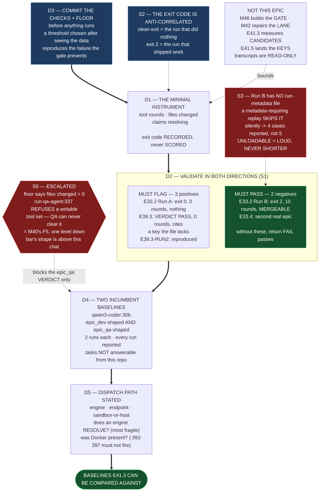

# Epic E41.2 — The Successful-Nothing Instrument, and the Lane Incumbent's Baseline

## Context

**Build the measuring device, prove it catches what this project has already suffered, then measure
the incumbent with it.**

M41 qualifies its two dispatch lanes — `epic_dev` and `epic_qa` — by detecting **successful
nothing**: a run that exits cleanly, reads competently, and did not do the work. This project owns
**two recorded instances** of it, and they are the reason the CFO's gate exists:

- **E33.2 Run A** (`qwen2.5-coder:14b`, 2026-07-20): **exit 0, `status: completed`, `iterations: 0`,
  223 tok, 18.3 s.** The model emitted its three intended tool calls **inside a ```json markdown
  fence, as prose**; the runner's parser saw no protocol tool call and treated the message as a final
  answer. `__init__.py` unchanged, test never created.
- **E39.3** (`qwen3-coder:30b`, 2026-08-16, and again in RUN2): **`VERDICT: PASS` on all 26 rules
  with zero tool rounds**, citing a `framework_version` key `.ai-project.yml` does not contain —
  **with the read-only tools genuinely advertised.**

**Both pass any subjective read. They fail only on counts.** An instrument that cannot flag them is
not qualified to measure anything, and the rest of M41's numbers are worth nothing without it.

**This epic builds the minimal instrument. `M46` formalizes the gate.** Building the gate here would
be taking M46's work.

---

## Problem Statement

**An instrument that flags everything passes this milestone's stated acceptance criterion, and it
would destroy the milestone's evidence in the opposite direction.**

That is not a hypothetical (S1 below): the criterion names **two positives and no negative control.**
`return FAIL` satisfies it. It would then fail the incumbent's baseline and every candidate, and M41
would conclude — on a number — that no model qualifies for either lane.

The second failure mode is the mirror of the first, and it is the one the phase already knows by
name: **an instrument built on "files changed" fails every honest `epic_qa` run**, because the QA
lane is read-only *by construction* (S5). More evidence would make its verdict worse. **M40's F5
records that exact shape one level up.**

So the instrument has to be right in **both** directions before a single candidate is measured, and
the way to establish that is not argument. It is **replay against runs whose outcome is already
known** — four of them, all committed in this repository.

---

## ⚠ Planning-time measurements — measured for this spec, not inherited

**Measured by the M41 Milestone Chat on 2026-08-20, on `milestone/M41` (spec set at `e3e0aea`, base
`d98f95d`), by reading the committed run records and executing the checks on this host.** G2 is
binding. Layer, time and scope stated per `P11-GH-2`.

### S1 — **The acceptance criterion as written is satisfied by an instrument that always fails**

The M41 spec's E41.2 criterion reads: *"The instrument flags E33.2's and E39.3's runs as failures
when replayed, with the counts shown."*

**Both named runs are positives — runs that should fail. No negative control is named anywhere in the
epic.** An instrument that returns FAIL unconditionally satisfies the criterion in full, and there is
nothing in the epic as scoped that would catch it.

**The controls already exist in this repository and cost nothing to add:**

| Replay case | Model | Expected verdict | Evidence |
|---|---|---|---|
| **E33.2 Run A** | `qwen2.5-coder:14b` | **FAIL** — successful nothing | `.ai-project/artifacts/agentic-runs/P10-M33-E33.2/transcript-A-qwen2.5-coder-14b.json` + `…__run-metadata.json` |
| **E39.3** | `qwen3-coder:30b` | **FAIL** — fabrication, 0 rounds | `…/P11-M39-E39.3/qa-transcript.json` + `qa-run-metadata.json` |
| **E39.3 RUN2** | `qwen3-coder:30b` | **FAIL** — same, reproduced | `…/P11-M39-E39.3-RUN2/` |
| **E33.2 Run B** | `qwen3-coder:30b` | **PASS** — 10 tool rounds, mergeable work | `…/P10-M33-E33.2/transcript-B-qwen3-coder-30b.json` |
| **E33.4** | `qwen3-coder:30b` | **PASS** — second real epic, mergeable work | `…/P10-M33-E33.4/transcript-qwen3-coder-30b.json` + `run-metadata.json` |

**This spec adds the two negative controls to the Definition of Done.** It does not change the
milestone's criterion — it satisfies it and then adds what the criterion cannot detect on its own.
**Three positives and two negatives is a floor, not the answer.**

### S2 — **The exit code is ANTI-correlated with work done, in this project's only controlled comparison**

Same task, same context, same tools, same runtime, differing only in model (E33.2, 2026-07-20):

| Run | Model | Exit | Status | Tool rounds | Work produced |
|---|---|---:|---|---:|---|
| **A** | `qwen2.5-coder:14b` | **0** | `completed` | **0** | **none** — file unchanged, test never created |
| **B** | `qwen3-coder:30b` | **2** | `max_iterations_exceeded` | **10** | **mergeable** — committed at `4ec1e8f`, suite 210 passed / 1 skipped |

**The clean exit belongs to the run that did nothing.** Run B spent 3 of 10 iterations on a
`pip install -e .` its allow-list denied and ran out of budget before a final green `pytest` — a
false-negative exit code, the mirror image of Run A's false positive.

E39.3's own metadata says the same thing in its own words: `"exit_code_note": "Reports whether the QA
run completed, never whether the assessed work passed."`

> **The instrument must not read exit status as a signal of work.** It may record it; it may not
> score it. This is why the CFO's floor is *tool rounds* and *files changed* rather than *exit 0*,
> and it is recorded here so nobody reintroduces the variable that has already been measured wrong
> in both directions.

### S3 — **Replay inventory, and one asymmetry that will silently drop the negative control**

`ls` over `.ai-project/artifacts/agentic-runs/`, repo, 2026-08-20:

| Directory | Transcript | Run metadata |
|---|---|---|
| `P10-M33-E33.2` | `transcript-A-…json`, `transcript-B-…json` | **A only** — `transcript-A-…__run-metadata.json` |
| `P10-M33-E33.4` | `transcript-qwen3-coder-30b.json` | `run-metadata.json` |
| `P11-M39-E39.3` | `qa-transcript.json` | `qa-run-metadata.json` |
| `P11-M39-E39.3-RUN2` | `qa-transcript.json` | `qa-run-metadata.json` |

**Run B — the primary negative control — has a transcript and NO run-metadata file.** A replay
harness that requires metadata will **skip it without erroring**, and the epic will report four
replays instead of five with nothing to indicate the fifth went missing. **That is the silent-omission
family this phase exists to close, reproduced inside the instrument built to detect it.**

**Requirement: the replay set is declared before the run, and a case that cannot be loaded is a
LOUD failure** — named, with the reason. **Never a shorter list.**

### S4 — **The two historical failures have DIFFERENT mechanisms, and the three counters are not redundant**

| | E33.2 Run A | E39.3 |
|---|---|---|
| What the model did | **Tried** — emitted the right three tool calls | **Did not try** — zero calls, straight to a verdict |
| Why nothing happened | The calls were **prose inside a ```json fence**; the parser saw no protocol call and read the message as a final answer | The model produced a `VERDICT: PASS` on 26 rules directly |
| Tools advertised? | yes | **yes — confirmed, which is what makes the zero a finding** |
| Caught by *rounds > 0*? | yes | yes |
| Caught by *files changed > 0*? | yes | **not applicable — the QA lane cannot change files (S5)** |
| Caught by *claims resolve*? | n/a (no claims made) | **yes — line 26 cites `read_file('.ai-project.yml') shows framework_version …`; the file's top-level keys end at `visual_artifacts` and contain no such key** |

**Counting rounds catches both historical cases. Neither historical case is what the third check is
for.** *Claims resolving against files that exist* is the only one of the three that would catch a
run that **does** call tools and **still** cites something that is not there — the next shape, not
the last one. **Keep all three. Do not collapse them because two of them fire together on the
archive.**

### S5 — **ESCALATED. The absolute floor is unsatisfiable for `epic_qa` by construction**

Binding Constraint 6 states an **absolute floor of tool rounds > 0 and files changed > 0**, and it
applies to both lanes.

**The `epic_qa` lane cannot change files, by design and by enforcement.** Verified by reading
`bin/run-qa-agent`, repo, 2026-08-20:

- `:30-32` — the tool set is `.ai-project/agents/qa-tools.json`, **read-only**, and the runner
  refuses `write_file`, `edit_file`, and `git` with `add`/`commit`;
- `:337` — the run **fails** if `write_file`, `edit_file`, `git` or `run_command` appear in the tool
  set's `enabled` list;
- `:264` — *"which is what makes the read-only tool set load-bearing rather than decorative."*

**So `files changed > 0` is not a floor the `epic_qa` task can clear. It is a floor no honest QA run
has ever cleared or ever will.** Applied literally, every model fails the `epic_qa` row — including
the incumbent, including any candidate — and the row's result would be an artefact of the floor
rather than a measurement of a model.

**This is M40's F5 one level down**, and the shape is identical: *a read-only run scored by a rule
that only recognizes effects returns the wrong verdict, and more evidence makes it worse.*

**The bar's shape is settled above this chat** (starter §Escalate instead of deciding). **So this is
escalated to the P12 Phase Chat with this delivery and is not resolved here.** The obvious reading —
that the floor is per-task-kind, `epic_dev` keeping *rounds > 0 AND files changed > 0* and `epic_qa`
taking *rounds > 0 AND claims resolve* with files-changed **recorded but not scored** — is stated so
the escalation is answerable, **not adopted.**

**What proceeds meanwhile:** the instrument is built and validated against the replay set, and the
incumbent's `epic_dev` baseline is measured, both unaffected. **The `epic_qa` baseline is measured
and recorded with every raw count, and its pass/fail verdict is withheld until the escalation
returns.** **E41.3 may not apply an unresolved floor to a candidate** — the Hard Constraint requires
the bar committed before the run it judges, and a bar under escalation is not committed.

### S6 — **The dispatch path, and the fallback that must not fire**

Verified 2026-08-20: `bin/ai-project-orchestrator:392-397` catches `FileNotFoundError` from the
Docker invocation and falls back to `subprocess.run(command, shell=True, …)` on the host, printing
`[!] Docker is not installed or available. Executing locally with model environment...`.

**`Docker version 29.6.1` is present on this host**, so the fallback will not fire — the dependency
is **real and non-blocking**, which is different from absent. **If Docker becomes unavailable
mid-epic, STOP and escalate.** Do not let a qualification run take the exact path M42 exists to
close; a baseline measured through the unsandboxed fallback is not comparable to anything measured
after M42 lands.

Lane entry points, present in this repository today: **`bin/run-dev-agent`** and **`bin/run-qa-agent`**
(the latter built by E39.3, with the committed runner shim at `bin/local-agent-runner-shim`).

---

## Goals

By the end of this Epic:

1. **A minimal instrument exists** that records, for a dispatched run: **tool rounds**, **files
   changed**, and **claims resolving against files that exist** — and reaches a verdict from those
   counts and nothing else.
2. **It is validated in both directions** — it flags all three recorded failures and passes both
   recorded successes, **with the counts shown for every case.**
3. **The objective checks and the floor are committed before any candidate runs**, and are not
   loosened afterwards.
4. **The incumbent `qwen3-coder:30b` has TWO baselines** — one `epic_dev`-shaped, one
   `epic_qa`-shaped — recorded separately, because they are two questions.
5. **The dispatch path is stated as measured**, so E41.3's runs are known to be comparable to these.

---

## Non-Goals

This Epic explicitly does **not**:

- **Build M46's qualification gate.** *Minimal* is the instruction. This is a measuring device used
  by M41, not a gate that stands between a run and a merge. **No CI wiring, no enforcement, no
  blocking hook.**
- **Measure any candidate.** `qwen3.6:27b` and `qwen3.8:27b` are E41.3's.
- **Change any model value, policy row, or `DEFAULT_MODELS` entry.** That is E41.5, behind two gates.
- **Repair the lane.** The orchestrator's fallback, the sandbox and `discover_runner()` are **M42's**.
  Record what you observe; do not fix it here.
- **Re-tune the floor after seeing a result.** If the committed checks turn out wrong, that is an
  escalation and an amended commitment — **never a quiet edit.**
- **Resolve S5.** The bar's shape is settled above this chat.
- **Take E39.1's decision back.** No model-generated judgment is load-bearing. The QA lane's verdict
  corroborates; it does not authorize.

---

## Scope of Work

### 1. The instrument (D1)

**Must record, per run, at minimum:**

- **tool rounds** — the count of protocol tool calls the runner actually executed, **not** the count
  of tool calls the model appeared to intend. **E33.2 Run A is the whole reason for this
  distinction**: the model emitted three well-formed calls as prose and the correct count is **zero**.
- **files changed** — measured against the working tree, not claimed by the model.
- **claims resolving against files that exist** — the model's assertions about repository state,
  checked against the repository. E39.3's line 26 is the worked example.
- Supporting context recorded but **not scored**: exit code, status, tokens, duration, model, lane,
  endpoint (S2).

**Must state, in its own output:** which checks it applied, the floor it applied them against, and
the raw counts. **A verdict without its counts is not usable evidence.**

### 2. Validation by replay, in both directions (D2)

**Declare the replay set first**, then run it. **Five cases, three FAIL and two PASS** (S1's table).

**Must include:**
- The verdict, the counts, and the reason for each of the five.
- **A loud, named failure for any case that cannot be loaded** — Run B has no run-metadata file (S3),
  and a silently shorter list is the defect this epic exists to detect.
- **The negative controls' counts in full.** *"Run B passed"* is not a result; **`10 tool rounds, N
  files changed`** is.

> **If the instrument flags Run B or E33.4, it is wrong** — those runs produced work that was
> committed and green. **Fix the instrument, and record that it was wrong before it was right.**

### 3. The committed checks and the floor (D3)

**Committed before any measurement run, in a file, with a commit hash.** Hard Constraint: *the bar is
committed before the run it judges.*

**Must include:** each objective check, how it is computed, what value passes, and the floor per lane
— **with `epic_qa`'s floor recorded as UNDER ESCALATION (S5)** rather than assumed, and the
`epic_qa` verdict withheld until it returns.

### 4. Two incumbent baselines, measured separately (D4)

`qwen3-coder:30b` on **an `epic_dev`-shaped implementation task** and **an `epic_qa`-shaped judgment
task** (Binding Constraint 7).

**The tasks must be:**
- **comparable across models** — the same task text, context and tool set for every model that will
  later be measured on it, fixed now;
- **not answerable from this repository** — E35.5's blinding discipline is the model. A task whose
  answer is committed here measures retrieval, not agentic discipline;
- **genuine work of the shape the lane actually does** — implementation for `epic_dev`, judgment
  against a standard for `epic_qa`;
- **recorded with their inputs**, so E41.3 runs *the same* task and not a paraphrase.

**Two runs per task per model, both scored, no best-of-N.** A run that fails mechanically is
committed and excluded **with its reason stated**.

### 5. The dispatch path, stated (D5)

Engine, endpoint, **sandbox or host**, entry point, and the model string as passed. Per `P11-GH-2`,
at the layer and time observed.

**Two things this epic either confirms or falsifies, and must say which:**
- **that an engine resolves at all** in the sandbox on the reverse endpoint shape from `B2.1` — M40
  reversed M38 on this and the phase spec calls it *"the phase's most fragile assumption"*;
- **that Docker was present for every run**, so `:392-397`'s fallback did not fire (S6).

---

## Deliverables

- [ ] **D1** — The minimal successful-nothing instrument, committed
- [ ] **D2** — The replay validation: five declared cases, three FAIL, two PASS, counts shown,
      unloadable cases named loudly
- [ ] **D3** — The committed objective-check list and per-lane floor, committed **before** any
      measurement run, with `epic_qa`'s floor marked under escalation
- [ ] **D4** — Two incumbent baselines for `qwen3-coder:30b`, `epic_dev` and `epic_qa`, separately,
      with the task definitions committed and every run reported
- [ ] **D5** — The dispatch-path statement, with the engine-resolves and Docker-present questions
      answered explicitly
- [ ] **D6** — Escalation Notice(s) where required — S5 is already escalated at spec level and is
      re-escalated with run evidence if the runs confirm it
- [ ] Structural diagram (Mermaid, in-repo, no ComfyUI)
- [ ] **Epic Delivery Notice**

---

## Binding Constraints

1. **The harness is chosen by the key's kind, not by the model** (M41 Binding Constraint 5).
2. **`epic_dev` and `epic_qa` are measured SEPARATELY**, and the incumbent is measured to set the
   bar (Binding Constraint 7).
3. **The bar is RELATIVE and OBJECTIVE. No subjective quality score** — judgment is precisely what
   cannot be trusted from the thing under test.
4. **The bar is committed before the run it judges.** A threshold chosen after seeing the data
   reproduces the failure this gate exists to prevent.
5. **Every number measured, every run reported, no best-of-N.** Mechanical failures are committed
   and excluded with their reason.
6. **The instrument does not score exit status** (S2).
7. **An absence is only evidence when the thing that would have created it actually ran.** *"Zero
   tool rounds"* is a finding only if tools were genuinely advertised — E39.3's value comes precisely
   from having confirmed they were. **Record the advertised tool set with every run.**
8. **No model-generated judgment is load-bearing** (E39.1). The QA task's verdict is data about the
   model, not a decision about anything.
9. **`P11-GH-2`** — layer, time and scope on every claim.
10. **Every inventory is a floor**, including the replay set and the check list.

---

## Design Decisions Delegated — decide, document, proceed

1. **The instrument's shape** — a script, a wrapper around the runner, or a parser over a captured
   run. *Minimal* is the instruction; **M46 formalizes the gate.**
2. **How *claims resolving against files that exist* is operationalized.** This is the hard one and
   it is yours. A defensible narrow version — extract file paths and key names the model asserts, and
   check each against the tree — is worth more than an ambitious one that cannot be validated
   against E39.3. **State its limits; do not overclaim its coverage.**
3. **The two measurement tasks**, subject to Scope §4's four properties.
4. **Where the instrument, the check list and the run records live** in the repo.
5. **Whether the replay path reuses `bin/run-qa-agent`/`bin/run-dev-agent` machinery or reads the
   committed transcripts directly.** Note that PEP 668 blocks a durable runner install on this host
   (recorded in M39) — if that bites, say so and route around it in the record.

---

## Definition of Done

Epic E41.2 is complete when:

- [ ] The instrument records tool rounds, files changed, and claims-resolution, and derives its
      verdict from those and nothing else
- [ ] **All five replay cases ran**: E33.2 Run A, E39.3, E39.3-RUN2 flagged **FAIL**; **E33.2 Run B
      and E33.4 pass**, with raw counts shown for all five
- [ ] Any replay case that could not be loaded is **named with its reason** — the list is never
      silently shorter (S3)
- [ ] The objective checks and floor are committed **before** the first measurement run, and the
      commit hash is cited in the Delivery Notice
- [ ] `epic_qa`'s floor is recorded as **under escalation**, its raw counts recorded, and **its
      pass/fail verdict withheld** pending the Phase Chat's answer to S5
- [ ] Two separate incumbent baselines exist, `epic_dev` and `epic_qa`, each with two runs, all
      reported, none discarded silently
- [ ] The task definitions are committed such that E41.3 can run the identical task
- [ ] The advertised tool set is recorded with every run (Binding Constraint 7)
- [ ] The dispatch path is stated, and both the engine-resolves and Docker-present questions are
      answered explicitly
- [ ] Suite green at **549** plus any tests this epic adds, with the new total, the delta, and the
      delta attributed to named tests
- [ ] Delivery Notice committed; work committed to `epic/P12-M41-E41.2`; PR opened to `milestone/M41`

---

## Acceptance Criteria

The milestone spec's four criteria for E41.2, expanded — **the first is widened deliberately, and S1
is why:**

- [ ] **The instrument flags E33.2's and E39.3's runs as failures when replayed, with the counts
      shown** — **and passes E33.2 Run B and E33.4, with their counts shown.** An instrument that
      only satisfies the first half is satisfied by `return FAIL`
- [ ] **The objective checks and the floor are committed before any candidate run**
- [ ] **Separate `epic_dev` and `epic_qa` baselines for `qwen3-coder:30b` are recorded with raw
      counts**
- [ ] **The dispatch path is stated with its layer and date**
- [ ] A reader can take this epic's instrument and check list and re-run E41.3's comparison **without
      re-deciding anything** — and can tell, for each of the five replay cases, what the instrument
      said and why

---

## Technical Constraints

**Format:** Markdown + whatever language the instrument is written in; this repo's suite is
`PYTHONPATH=. pytest -q` (**bare `pytest` fails collection**).
**In scope:** a new instrument and its records; new artifacts under
`docs/phases/P12__Completion_Fail_Closed_Defaults_and_the_Drivr_MVP/` and
`.ai-project/artifacts/agentic-runs/`.
**Do not touch:** `.ai-project.yml`; `model-routing-policy.md`; `bin/ai-project-orchestrator`;
`bin/run-dev-agent`; `bin/run-qa-agent`; `.ai-project/agents/qa-tools.json`;
`governance/systems/chat-hierarchy.md`; `tests/test_model_config.py`; anything under `~/soft-dev/drivr`.
**Read-only:** the committed transcripts under `.ai-project/artifacts/agentic-runs/` — **replay them,
never edit them.** Changing a recorded run invalidates every result taken from it, E33.2's and
E39.3's included.

---

## Dependencies

**Internal**
- **E41.1 must have landed.** Hard gate — this epic dispatches, and dispatch needs resolved,
  reachable, routable model strings.
- **Docker present on this host** (`29.6.1`, 2026-08-20). **If it becomes unavailable, stop and
  escalate** (S6).
- **A reachable engine** for the lane runs — **the phase's most fragile assumption.** This epic
  confirms or falsifies it.
- **`bin/run-dev-agent`, `bin/run-qa-agent`, `bin/local-agent-runner-shim`** — present.
- **The five committed replay transcripts** — present, one without metadata (S3).

**External / CFO-side**
- **S5's escalation** — the `epic_qa` floor. **Not blocking this epic's build or its `epic_dev`
  baseline; blocking only the `epic_qa` pass/fail verdict, and blocking E41.3's application of that
  floor to a candidate.**

**Blockers**
- None for the instrument or the `epic_dev` baseline.

---

## Timeline

**Estimated Effort:** 1–2 sessions — the instrument and the replay set are bounded; the measurement
runs are wall-clock bound by local inference (E33.2 measured ~9.4 tok/s on the 30b).
**Target Completion:** after E41.1, before E41.3.
**Actual Completion:** In progress.

---

## Execution Notes

**Order, and it is chosen so a wrong instrument is caught before it costs a measurement run:**

1. Commit the check list and the floor (D3). **Before anything runs.**
2. Build the instrument (D1).
3. **Replay all five cases (D2). Both directions.** If Run B or E33.4 fails, the instrument is wrong
   — fix it, and **record that it was wrong first.** A tool that was correct on the first try is a
   claim; a tool with a recorded correction is evidence.
4. Define and commit the two tasks (D4's inputs).
5. Run the incumbent: two runs per task. Report every run.
6. Write the dispatch-path statement from what you observed, not from this spec (D5).

**Traps this project has already paid for:**

- **The exit code lies in both directions** (S2). Record it; never score it.
- **"Is the baseline still N?" is an unreliable guard** — `testpaths` can mask a stale
  `norecursedirs`, so a rotted test is invisible and the total still looks green (M38). **Confirm any
  test you add is actually collected.**
- **`git status` before every commit**; this is a shared worktree. **Verify pushes at `origin`.**
- **Falsify a pattern before trusting a zero result.** `\b` is unusable against the `__` filename
  convention and `--include='*.py'` skips every `bin/` entry point.

---

## Related Documents

- [M41 Milestone Spec](P12-M41__milestone-spec.md) — v1.1.1; Binding Constraints, Hard Constraint
- [E41.1 Spec](P12-M41-E41.1__spec__target-resolution-reachability-and-routability.md) — v1.0.1, the hard gate
- [P12 Phase Spec](P12__phase-spec.md) — §P12.1, §P12.2 (M42), §P12.6 (M46)
- `.ai-project/artifacts/agentic-runs/P10-M33-E33.2/run-record.md` — Runs A and B
- `.ai-project/artifacts/agentic-runs/P10-M33-E33.4/run-record.md` — the second real epic
- [E39.3 Delivery Notice](../P11__Drivr_Coordination_Over_Rented_Execution/P11-M39-E39.3__delivery-notice.md) — the fabrication, both dispatches
- [E39.1 Spec](../P11__Drivr_Coordination_Over_Rented_Execution/P11-M39-E39.1__spec__completion-judgment.md) — no model judgment is load-bearing
- [M40 E40.1 completion-signal decision](../P11__Drivr_Coordination_Over_Rented_Execution/P11-M40-E40.1__completion-signal-decision.md) — F5, the read-only-run shape

---

## Visual Bindings

**Visual binding**
- **Link:** (inline — Structural diagram; no hosted link needed per AOG §16.3/§16.5)
- **What:** diagram
- **Level:** Epic
- **State:** proposed



- **Description:** E41.2 in execution order, with the two findings that reshaped it. The checks and
  the floor are committed **before** anything runs. The instrument scores three counters and
  explicitly **does not score the exit code**, because this project's only controlled comparison has
  the clean exit on the run that did nothing and the failing exit on the run that shipped mergeable
  work (S2). Validation runs in **both** directions — three recorded failures that must be flagged
  and **two recorded successes that must pass** — because the milestone's criterion as written names
  only positives and is satisfied by an instrument that always fails (S1). One negative control has a
  transcript but no metadata, so an unloadable case must fail loudly rather than shorten the list
  (S3). The `epic_qa` floor is under escalation: the QA lane is read-only by enforcement, so
  *files changed > 0* is a floor no honest QA run can clear (S5). Proposed-track Structural diagram
  (AOG §16.3/§16.6), Mermaid, no ComfyUI.

---

## Notes

- **On S1, and why it is a widening rather than a correction.** The milestone spec's criterion is not
  wrong — flagging the two historical failures is exactly the right requirement, and HQ placed the
  same requirement on M46's formalized gate. **What it lacks is the other half**, and the other half
  is free: the controls are already committed in this repository, with transcripts, and the epic
  replays them in the same pass. **An instrument validated in one direction is a device that has been
  shown to say "no".**

- **On S5, and what it is not.** It is not an argument that the floor is wrong, and not a proposal to
  weaken it. **The floor is the CFO's instrument and its adverse results are the point.** What is
  recorded here is that one of its two terms is **structurally unreachable** for one of the two lanes
  it governs, by an enforcement this project wrote deliberately — and therefore that the `epic_qa`
  row cannot produce a meaningful verdict until the floor is stated per lane. **Escalated, with the
  obvious resolution stated so the escalation is answerable, and not adopted.**

- **On the third counter, which is the one that will be hardest to defend.** *Claims resolving
  against files that exist* is the only check that generalizes past the two failures already in the
  archive (S4). It is also the one most likely to be built narrowly and then described broadly.
  **State its limits in its own output.** A check that resolves file paths and asserted key names,
  and says so, is worth more than one that claims to detect fabrication.

- **On the reviewer/reviewed interaction, held once and not repeated.** `epic_qa`'s verdict is
  advisory (E39.1), so a weak model on that row breaks nothing today. **The row matters because M45
  exists to make that judgment trustworthy** — this is a reason to measure carefully, not to hurry.

---

## Changelog

| Version | Date | Change |
|---|---|---|
| 1.0.0 | 2026-08-20 | Initial E41.2 spec, from M41 spec v1.1.1. **Six planning-time measurements (S1–S6)**, taken on `milestone/M41`, 2026-08-20. **S1 — the milestone's acceptance criterion names two positives and no negative control, so `return FAIL` satisfies it**; the controls (E33.2 Run B, E33.4) are already committed here, so the DoD and the acceptance criteria are **widened to five replay cases in both directions**. **S2 — the exit code is anti-correlated with work done** in this project's only controlled comparison (Run A: exit 0, 0 rounds, nothing; Run B: exit 2, 10 rounds, mergeable), so the instrument records exit status and **never scores it**. **S3 — Run B has a transcript and no run-metadata file**, so a metadata-requiring replay drops the primary negative control silently; unloadable cases must fail **loudly**. **S4 — the two historical failures have different mechanisms** and the three counters are not redundant; claims-resolution is the only one that generalizes past the archive. **S5 — ESCALATED: the absolute floor's `files changed > 0` term is unsatisfiable for `epic_qa` by construction** (`bin/run-qa-agent:337` refuses a writable tool set), which is M40's F5 one level down; **the bar's shape is settled above this chat**, so it is escalated with the obvious resolution stated but **not adopted**, and the `epic_qa` verdict is withheld pending the answer. **S6 — the dispatch path and `bin/ai-project-orchestrator:392-397`'s unsandboxed fallback**, non-blocking while Docker `29.6.1` is present. |
