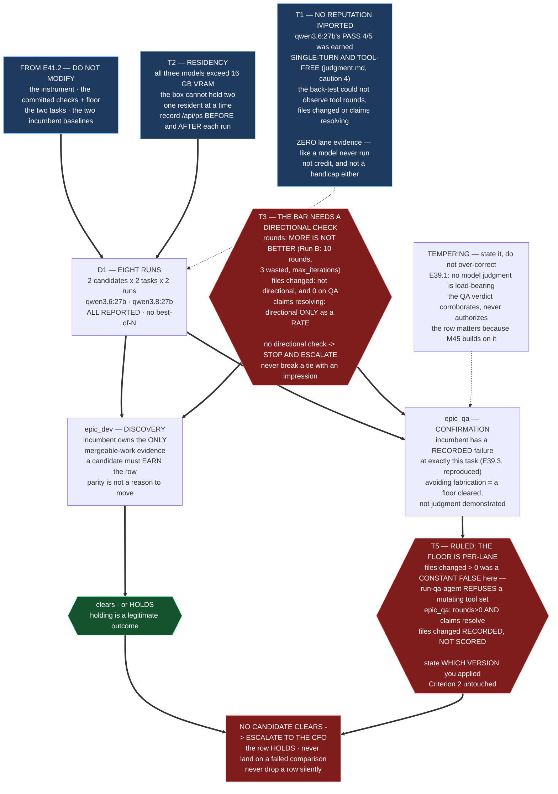

# Epic E41.3 — Lane Candidates Measured Against the Baseline

## Context

E41.2 built the instrument, committed the bar, and measured the incumbent twice — once
`epic_dev`-shaped, once `epic_qa`-shaped. **This epic runs the candidates through the same
instrument, on the same tasks, against those baselines, and reaches two independent conclusions.**

Two candidates, two lanes, and **the two lanes are not the same question**:

| Lane | What the record holds | What this run is |
|---|---|---|
| `epic_dev` | the project's **only mergeable-work evidence** — E33.2 Run B, E33.4 | **discovery.** Nothing in public claims justifies disturbing the one row that works. **A candidate must earn it.** |
| `epic_qa` | the project's **only recorded fabrication** — E39.3, `VERDICT: PASS`, zero tool rounds, citing a key the file does not contain | **confirmation.** The incumbent has a recorded failure at exactly this task. |

**Holding a row is a legitimate outcome and is not a failure of this epic.** If no candidate clears
the bar, the row keeps its value, the result goes to the CFO, and that is the epic delivering.

---

## Problem Statement

**A comparison can be lost three ways before a single number is wrong, and this epic is exposed to
all three.**

1. **By importing a reputation.** `qwen3.6:27b` is the only model in this project's history with a
   recorded judgment result — `PASS 4/5, one SPLIT, zero false alarms` over ten runs. **That result
   was earned in a setting with no tools at all** (T1). Carrying it into a lane comparison would be
   measuring the wrong thing while appearing rigorous.
2. **By an inapplicable bar.** The relative bar requires *no worse on every objective check and
   strictly better on at least one.* **The three counters this instrument produces are floors, not
   scores** — "more tool rounds" is not better, and this project has the run to prove it (T3).
   Without at least one **directional** check with objective ground truth, *strictly better* has
   nothing to attach to, and the only remaining way to break a tie is a quality judgment, **which is
   prohibited.**
3. **By an uncontrolled substrate.** All three models exceed this box's 16 GB VRAM and partially
   offload (T2). A candidate measured while another model is resident is not measured under the same
   conditions as the baseline it is compared against.

None of these produces an error. **All three produce a number.**

---

## ⚠ Planning-time findings — measured for this spec, not inherited

**Measured by the M41 Milestone Chat on 2026-08-20, on `milestone/M41` at `04999d6`.** G2 is binding.
Layer, time and scope stated per `P11-GH-2`.

### T1 — **`qwen3.6:27b`'s reputation was earned with NO TOOLS, which is the exact variable this lane measures**

Binding Constraint 5 already says *the harness is chosen by the key's kind, not by the model* — and
names this case: *"`qwen3.6:27b` competing for `epic_qa` is qualified by the successful-nothing
harness, notwithstanding that its reputation comes from the back-test."* **This finding is the
mechanical reason that constraint is right**, and it is stronger than "different harness".

E35.5's own `judgment.md` records six arguments against over-reading its PASS. **Caution 4 is
decisive here:**

> **"The evaluation is single-turn and tool-free."** No follow-up, no repo access, no ability to
> check a claim against a file.

**So the project's only judgment result for `qwen3.6:27b` was produced in a setting where calling a
tool was impossible.** The successful-nothing harness measures **tool rounds, files changed, and
claims resolving against files that exist** — three properties the back-test could not have observed
even in principle.

> **`qwen3.6:27b` has ZERO evidence of agentic discipline in this project's record.** Its back-test
> PASS is not weak evidence for this lane; it is **evidence about a different question.**

**Consequence for this epic, and it cuts both ways.** Do not carry the back-test in as credit — and
do not treat it as a handicap either. **The candidate arrives with no lane evidence, exactly like a
model nobody has ever run.** Say that in the record rather than leaving a reader to assume the 4/5
transferred.

*Verified by reading `.ai-project/artifacts/reference/local-review-backtest/judgment.md`
§"What HQ should weigh against the PASS", caution 4, repo, 2026-08-20.*

### T2 — **All three models exceed VRAM and partially offload; the comparison must control for residency**

| Model | Size | Fits 16 GB VRAM? |
|---|---:|---|
| `qwen3-coder:30b` (incumbent) | 18.6 GB | **no** — measured at 12.9 GB VRAM / 21.4 GB total, partially offloaded (E33.2) |
| `qwen3.8:27b` | 17.7 GB | **no** |
| `qwen3.6:27b` | 17.4 GB | **no** |

`/api/ps` returned `{"models":[]}` at planning time — **nothing resident**, which is the clean state
this epic should start each run from.

**Two models cannot both be resident on this box.** A run taken while another is loading, resident,
or being evicted is not comparable to one taken from a clean state. E33.2's own end-to-end rates
differ by model (**12.2 tok/s** for the 14b against **9.4 tok/s** for the 30b), so throughput is
already known to vary with what is loaded.

**Requirement: one model resident at a time; record what `/api/ps` reported immediately before and
after each run.** This is cheap, it is the only way "same conditions" is a claim rather than an
assumption, and **it is also the failure mode most likely to be discovered after the fact**, when the
runs are no longer repeatable in the same session.

### T3 — **The relative bar cannot be applied to the instrument's counters alone. They are floors, not scores**

The bar (Binding Constraint 6): *no worse than the incumbent on **every objective check** and
**strictly better on at least one**, over an **absolute floor** of tool rounds > 0 and files changed
> 0.* **Checks and floor are separate terms** — the floor is the gate, the checks are the comparison.

**But the instrument's three counters do not order candidates:**

| Counter | Directional? | Why not |
|---|---|---|
| tool rounds | **no** | **More is not better.** E33.2 Run B took **10 rounds**, wasted **3** on a `pip install -e .` its allow-list denied, and terminated `max_iterations_exceeded` — with the work essentially done. A model doing the same work in 4 rounds is not worse. |
| files changed | **no** | More files changed is not better work; it is a larger diff. And on `epic_qa` it is **structurally zero**, which is why the ruled floor records it there without scoring it (E41.2's S5). |
| claims resolving | **partly** | A **rate** (resolved / asserted) is directional and objective. A raw count is not. |

> **So "strictly better on at least one" has, today, at most ONE thing it could attach to — and only
> if claims-resolution is expressed as a rate.** If a candidate matches the incumbent on all three,
> the bar is not met, the row holds, and **that is a correct outcome** — but reaching it by
> *inability to compare* rather than by *measured equivalence* is not the same result, and a reader
> must be able to tell which happened.

**The repair belongs in E41.2's task design, not here, and this spec states the requirement rather
than inventing a check:** **each task must carry at least one DIRECTIONAL check with objective
ground truth, committed with the task.** The natural forms already exist in this project:

- **`epic_dev`** — a **pre-written test the produced work either passes or does not.** E33.2's target
  epic is the worked example: `tests/test_public_api.py`, suite **210 passed / 1 skipped**. Pass/fail
  is mechanical, and *"the suite passes"* is not a quality judgment.
- **`epic_qa`** — **known ground truth on the assessed artifact**: how many of the planted or genuine
  defects the run identifies, and how many things it asserts that are not true. Counting catches and
  false alarms against ground truth **committed before the run** is objective. **It is not the
  back-test** — same shape of scoring, different instrument and different task.

**E41.2's spec is amended to require this** (its v1.0.2), because the tasks are E41.2's deliverable
and a task without a directional check cannot be compared by this epic. **This is a dependency, not
a scope transfer.**

### T4 — **Run count, and the wall-clock this epic actually costs**

Two candidates × two tasks × **two runs each, both scored, no best-of-N** = **8 runs**, on top of
E41.2's 4 incumbent runs. **Twelve runs total across the two epics**, plus model loads: each
load moves 17–18 GB, and the box cannot hold two.

**Report all eight.** A run that fails mechanically is **committed and excluded with its reason
stated** — E35.5's protocol, inherited.

### T5 — **RULED. `epic_qa`'s verdict is UNBLOCKED, and the floor is per-lane**

E41.2's **S5** — the absolute floor's `files changed > 0` term being **unreachable by construction**
on the `epic_qa` lane, because `bin/run-qa-agent` **refuses to dispatch** under a mutating tool set
(`:336-344`), deliberately and permanently — **was escalated and has been ruled.**

> ### ✔ RULED — the floor is PER-LANE. CFO decision, 2026-08-20
> `.ai-project/artifacts/rulings/2026-08-20__ai-project-system-hq__ruling__s5-per-lane-qualification-floor.md`,
> merged to `master` at `e9834c6`; milestone spec **v1.4.0**.
>
> | Lane | Floor |
> |---|---|
> | **`epic_dev`** | `tool rounds > 0` **AND** `files changed > 0` — **unchanged** |
> | **`epic_qa`** | `tool rounds > 0` **AND** `claims resolve against files that exist`; **`files changed` recorded but NOT scored** |
>
> **Not a relaxation.** `files changed > 0` on `epic_qa` was **a constant false, not a strict bar** —
> the same answer for every candidate, therefore **zero discriminating power**. `files changed` was
> the dev lane's proxy for *"it actually acted"*; on a lane forbidden to write, **acting is reading
> and grounding**, which the other two checks already measure. **Every recorded historical failure
> still fails:** E39.3 fails `rounds > 0` **and** `claims resolve` independently.
>
> **⚠ Criterion 2 is untouched.** **Reaching this floor by enabling a mutating tool on the QA lane is
> refused in advance.** A floor cleared by weakening the read-only guarantee is **not a cleared
> floor**, and this epic must record that no run reached its floor that way.

**What this epic now does:** applies the ruled per-lane floor to both candidates on both lanes,
reaches a verdict on **both** rows, and **states which version of the floor it applied.** That
statement is required rather than courteous: **a run judged against the pre-ruling floor and one
judged against the ruled floor are not comparable results**, and this epic's numbers will be read
beside E41.2's.

**The prior restriction is discharged.** The Phase Chat's *"E41.3 may not apply an unresolved floor
to a candidate"* stood while the bar was under escalation; **the bar is now committed**, so the
Hard Constraint is satisfied rather than waived.

---

## ⚠ RULED 2026-08-22 — THIS EPIC MEASURES A MODEL. IT CANNOT QUALIFY A LANE

**P12 Phase Chat ruling, on an escalation raised by E41.2 and carried by the M41 Milestone Chat.
Read this before anything else in this spec; it changes what this epic's numbers can be used for.**

> **E41.2's baselines are valid measurements OF THE MODEL. They are not measurements OF THE LANE.
> A lane row may not move on evidence gathered outside the lane.**

**The reasoning, recorded so this epic is bound by the argument and not merely by the conclusion:**

- **A lane is a dispatch path** — orchestrator, sandbox, tool protocol, parser — **not a model.**
  E41.2's own headline proves the distinction is load-bearing: **DEV RUN 2's successful-nothing came
  from the PARSER** taking `<function=…>` as prose. **That is a lane property, observed outside the
  lane.**
- **HQ's safety argument was intact for a scenario that did not occur.** *"Docker is present, so the
  unsandboxed fallback will not fire"* — **Docker's presence prevents the fallback only if the
  orchestrator runs, and it never ran.**
- **After M42 the lane is sandboxed by construction.** A row qualified on host evidence would be
  qualified **in an environment the repaired lane will never use** — which is the M42 gate's own
  attributability rationale arriving from the other side.

### What this epic may and may not conclude

| | |
|---|---|
| **MAY** | compare candidates against the incumbent **as models**, on the instrument and the committed bar; report every count; reach a per-model conclusion |
| **MAY NOT** | **move `epic_dev` or `epic_qa` on this evidence.** A lane row moves only on evidence dispatched **through the lane** |
| **DEFAULT** | **both lane rows HOLD** unless re-measured through the repaired lane after M42 closes. **Holding is not a failure** — SN-38 already makes hold the default for `epic_dev` |

**E41.3 dispatching identically to E41.2 remains binding and is necessary but NOT sufficient.** It
preserves **the comparison**; it does not make either side a lane measurement.

### And this epic is additionally blocked on (a), which is the CFO's

**The `epic_dev` baseline is BIMODAL** — `{PASS 9/20, FAIL 0/20}` on identical inputs — so *"no worse
than the incumbent on every objective check"* **has no single number to attach to**, and four
aggregation rules give four answers. **Choosing an aggregation rule is choosing the bar**, and the
bar's shape is **Binding Constraint 6**, ratified in SN-36/37.

> **DO NOT RUN A CANDIDATE UNTIL (a) IS RULED.** A candidate measured against an unanchored bar
> produces a number nobody can use, and choosing the rule after the baseline is known is the exact
> failure bar-committed-first prevents.

**The symmetry offered upward with the escalation, recorded as framing and not as a remedy:** S5 was
**a term with zero discriminating power** — a constant false. **This is a term with too much variance
to discriminate.** Both leave a check unable to separate candidates.

---

## Goals

1. **Both candidates measured on both lane tasks**, on E41.2's instrument, against E41.2's baselines,
   under controlled residency — **all eight runs reported.**
2. **Two independent per-row conclusions**, each applying the relative bar's two conditions
   explicitly, or stating that no candidate cleared — **or, for `epic_qa`, that the verdict is
   applied against the **ruled per-lane floor**, with the version of the floor stated.**
3. **The record's split honoured**: `epic_dev` as discovery, `epic_qa` as confirmation.
4. **No reputation imported** — `qwen3.6:27b` arrives with no lane evidence (T1), and the record says so.
5. **An escalation, not a substitution, if no candidate clears a row.**

---

## Non-Goals

This Epic explicitly does **not**:

- **Change any configuration.** E41.5 lands what cleared, behind two gates.
- **Build or modify the instrument.** It is E41.2's, and changing it mid-comparison invalidates the
  baselines. **If it proves wrong, stop and escalate** — do not repair it in flight.
- **Re-define the tasks.** They are E41.2's, committed, and this epic runs the identical task.
- **Re-tune the bar after seeing a result.** That is the failure this gate exists to prevent.
- **Measure any verification target.** `creation`, `phase`, `milestone`, `epic_manual` are E41.4's,
  on the other harness.
- **Resolve S5**, or apply an unruled floor to an `epic_qa` verdict (T5).
- **Import E35.5's back-test result as lane evidence** (T1) — in either direction.

---

## Scope of Work

### 1. The eight runs (D1)

`qwen3.6:27b` and `qwen3.8:27b`, on **the `epic_dev` task and the `epic_qa` task E41.2 committed**,
**two runs each**, same context, same tool set, same instrument.

**Must record per run:** the model and its **digest**; the exact model string as passed; the
advertised tool set; `/api/ps` immediately **before and after** (T2); tool rounds; files changed;
claims asserted and claims resolved; exit code **as context, never scored**; tokens and duration;
sandbox-or-host and the engine.

**Residency discipline (T2):** one model resident at a time; start from a clean `/api/ps`; do not
interleave candidates within a task.

### 2. The per-row application of the bar (D2)

**For `epic_dev`**, and **separately** for `epic_qa`:

- state each objective check, the incumbent's value, the candidate's value;
- state **explicitly** whether *no worse on every check* holds and whether *strictly better on at
  least one* holds — **naming which check carried it**;
- state the floor's result;
- reach one of: **candidate clears**, **no candidate clears — row holds**, or (for `epic_qa`)
  reached against the **ruled per-lane floor** — `rounds > 0` AND `claims resolve`, `files changed`
  recorded but not scored — **with the version of the floor stated.**

**If the bar cannot be applied because no directional check exists** (T3), that is a **stop-and-
escalate**, not a judgment call. **Do not break a tie with an impression of quality.**

### 3. The reasoning, split and stated (D3)

**`epic_dev` — discovery.** The incumbent owns this project's only mergeable-work evidence. **A
candidate must earn the row**; parity is not a reason to move. The default outcome is *hold*, and
holding needs no apology.

**`epic_qa` — confirmation.** The incumbent has a recorded failure at exactly this task (E39.3,
reproduced in RUN2). **A candidate that merely avoids fabricating has cleared something the incumbent
did not** — and that must be stated as what it is: a floor cleared, not a demonstration of judgment.

**And the tempering, which must appear so nobody over-corrects:** E39.1's binding decision is that
**no model-generated judgment is load-bearing.** Today the QA model's verdict corroborates; it does
not authorize. **A weak `epic_qa` model cannot by itself break anything.** The row matters because
**M45 exists to make that judgment trustworthy** — the choice is about which model M45 builds on, not
about a live wound. **That is a reason to measure carefully rather than to hurry.**

### 4. Escalation where required (D4)

An **Escalation Notice** to the M41 Milestone Chat for: no candidate clearing a row; the instrument
disagreeing with E41.2's recorded baselines on a replay; a task that cannot be run identically; an
unreachable model or engine; Docker becoming unavailable; **or the bar proving inapplicable for want
of a directional check.**

**The row holds and the result goes to the CFO. Never land a row on a failed comparison. Never drop
one silently.**

---

## Deliverables

- [ ] **D1** — Eight runs, all reported, with the full per-run record including `/api/ps` before/after
- [ ] **D2** — Two per-row applications of the relative bar, each stating both conditions explicitly
      — both reached, `epic_qa` against the ruled per-lane floor (T5), with the version stated
- [ ] **D3** — The split reasoning: `epic_dev` as discovery, `epic_qa` as confirmation, with E39.1's
      tempering stated
- [ ] **D4** — Escalation Notice(s), or a positive statement that none was required
- [ ] Structural diagram (Mermaid, in-repo, no ComfyUI)
- [ ] **Epic Delivery Notice**

---

## Binding Constraints

1. **`epic_dev` and `epic_qa` are measured SEPARATELY and reach independent conclusions.**
2. **The bar is RELATIVE and OBJECTIVE. No subjective quality score** — judgment is precisely what
   cannot be trusted from the thing under test.
3. **The bar is committed before the run it judges**, and **a bar under escalation is not committed**
   (T5).
4. **Every number measured, every run reported, no best-of-N.**
5. **The instrument and the tasks are E41.2's and are not modified here.**
6. **Exit status is recorded, never scored** (E41.2 S2).
7. **An absence is only evidence when the thing that would have created it actually ran** — record
   the advertised tool set with every run.
8. **A row that fails its harness ESCALATES TO THE CFO** — not landed anyway, not dropped.
9. **The harness is chosen by the key's kind, not by the model** (T1).
10. **`P11-GH-2`** — layer, time and scope on every claim. **A model measured on the back-test is
    not thereby measured on a lane.**

---

## Design Decisions Delegated — decide, document, proceed

1. **Run order** — which candidate first, and whether by task or by model — provided residency
   discipline holds (T2).
2. **How the comparison table is laid out**, provided every check, both values, and both bar
   conditions are visible per row.
3. **What counts as a mechanical failure** warranting exclusion-with-reason, decided **before** the
   runs, not after seeing one.
4. **Where the run records live** under `.ai-project/artifacts/agentic-runs/`, following the existing
   per-epic directory convention.
5. **Whether to record a third confirmatory run** when two runs of one model disagree materially —
   permitted **only if declared before the runs and only if all three are reported.** **This is not
   best-of-N** and must not become it.

---

## Definition of Done

Epic E41.3 is complete when:

- [ ] Eight runs are recorded — 2 candidates × 2 tasks × 2 runs — **every one reported**, mechanical
      failures included with their reasons
- [ ] Each run records model + digest, exact model string, advertised tool set, `/api/ps` before and
      after, and all three counters
- [ ] The `epic_dev` row states both bar conditions explicitly and reaches one of: clears / holds
- [ ] The `epic_qa` row states the raw comparison and either applies a **ruled** floor or **records
      **the ruled per-lane floor**, and **states which version of the floor it applied**
- [ ] `qwen3.6:27b`'s back-test result is **not** used as lane evidence, and the record says why (T1)
- [ ] The split reasoning is present and E39.1's tempering is stated
- [ ] Any row where no candidate cleared is escalated with the result, and the row holds
- [ ] Suite green at the branch baseline plus any tests added, with the total, the delta, and the
      delta attributed to named tests
- [ ] Delivery Notice committed; work committed to `epic/P12-M41-E41.3`; PR opened to `milestone/M41`

---

## Acceptance Criteria

The milestone spec's three criteria for E41.3, expanded:

- [ ] **Both candidates measured on both tasks, all runs reported, no best-of-N**
- [ ] **Per-row recommendation states the relative bar's two conditions explicitly, or states that no
      candidate cleared** — `epic_qa` judged against the **ruled per-lane floor**, with the version
      of the floor stated, and with **Criterion 2 recorded as intact**
- [ ] **`epic_dev` and `epic_qa` are reasoned about separately and reach independent conclusions**
- [ ] A reader can tell, for each row, whether the outcome was reached by **measured equivalence** or
      by **inability to compare** (T3) — these are different results and must not read alike
- [ ] Every run's conditions are recorded well enough that a later reader can tell whether two runs
      were taken under the same substrate state (T2)

---

## Technical Constraints

**In scope:** run records under `.ai-project/artifacts/agentic-runs/`; this epic's analysis artifacts
under `docs/phases/P12__Completion_Fail_Closed_Defaults_and_the_Drivr_MVP/`.
**Do not touch:** E41.2's instrument, check list, floor, or task definitions; `.ai-project.yml`;
`model-routing-policy.md`; `bin/*`; `.ai-project/agents/qa-tools.json`; `governance/systems/*`;
`tests/test_model_config.py`; anything under `~/soft-dev/drivr`; **any committed transcript.**
**Invocation:** `PYTHONPATH=. pytest -q` — bare `pytest` fails collection.

---

## Dependencies

**Internal**
- **E41.1 landed** — resolved, reachable, routable model strings, and both 27b declared in
  `opencode.json`. **Hard gate.**
- **E41.2 landed** — the instrument, the committed check list and floor, the two task definitions,
  and the two incumbent baselines. **A comparison against an unpublished baseline is not a
  comparison.**
- **E41.2's tasks carry at least one directional check with objective ground truth** (T3, E41.2 spec
  v1.0.2). **Without it this epic cannot apply the bar.**
- **Docker present**; **an engine that resolves**. Both confirmed or falsified by E41.2's D5 — read
  its answer rather than re-assuming it.

**External / CFO-side**
- **S5 — the `epic_qa` floor.** Blocks only the `epic_qa` **verdict** (T5). Everything else proceeds.

**Blockers**
- **None.** S5 was the only one and it is **ruled**; both rows are decidable.

---

## Timeline

**Estimated Effort:** 1–2 sessions, wall-clock bound by eight local runs and repeated 17–18 GB model
loads on a box that cannot hold two.
**Target Completion:** after E41.2, before E41.5.
**Actual Completion:** In progress.

---

## Execution Notes

**Order:**

1. Read E41.2's committed check list, floor, tasks and baselines. **Do not re-derive them; do not
   improve them.**
2. Confirm the instrument reproduces E41.2's recorded baseline figures on at least one replay. **If
   it does not, STOP and escalate** — the comparison is void before it starts.
3. Confirm both candidates are declared in `opencode.json` (E41.1's D3) and that `/api/ps` is clean.
4. Run: one model resident at a time, two runs per task, recording `/api/ps` around each.
5. Apply the bar per row. **`epic_dev` first** — it is unblocked and it is the row with something to
   lose.
6. Write the split reasoning last, from the numbers, not from expectation.

**Traps:**

- **The reputation trap** (T1) — the back-test measured a model that could not call a tool.
- **The tie trap** (T3) — if nothing is directional, escalate; do not reach for an impression.
- **The residency trap** (T2) — two models cannot both be resident; a fast run may simply be a warm one.
- **The exit-code trap** (E41.2 S2) — the clean exit belongs to the run that did nothing.
- **`git status` before every commit**, and **work in your own worktree** — this project has three
  sessions sharing one checkout and it has already moved under a chat mid-set.

---

## Related Documents

- [M41 Milestone Spec](P12-M41__milestone-spec.md) — v1.2.1
- [E41.2 Spec](P12-M41-E41.2__spec__successful-nothing-instrument-and-incumbent-baseline.md) — v1.0.2: the instrument, the bar, the tasks, S5
- [E41.1 Spec](P12-M41-E41.1__spec__target-resolution-reachability-and-routability.md) — v1.0.2: the resolved strings
- `.ai-project/artifacts/reference/local-review-backtest/judgment.md` — the six cautions; caution 4 is T1
- `.ai-project/artifacts/agentic-runs/P10-M33-E33.2/run-record.md` — Runs A and B, and the tok/s figures
- [E39.3 Delivery Notice](../P11__Drivr_Coordination_Over_Rented_Execution/P11-M39-E39.3__delivery-notice.md) — the fabrication
- [E39.1 Spec](../P11__Drivr_Coordination_Over_Rented_Execution/P11-M39-E39.1__spec__completion-judgment.md) — no model judgment is load-bearing

---

## Visual Bindings

**Visual binding**
- **Link:** (inline — Structural diagram; no hosted link needed per AOG §16.3/§16.5)
- **What:** diagram
- **Level:** Epic
- **State:** proposed

- **Description:** E41.3 takes E41.2's instrument, bar and tasks **unmodified** and runs eight
  candidate runs under controlled residency — all three models exceed this box's VRAM and it cannot
  hold two, so one is resident at a time and `/api/ps` is recorded around every run (T2). The two
  lanes reach independent conclusions: `epic_dev` is **discovery** against the only row with
  mergeable-work evidence, `epic_qa` is **confirmation** against the only recorded fabrication. Two
  constraints shape the result: `qwen3.6:27b`'s back-test PASS was earned **single-turn and
  tool-free**, so it is not lane evidence in either direction (T1); and the instrument's counters are
  **floors, not scores**, so *strictly better on at least one* needs a directional check with
  objective ground truth or the epic escalates rather than guessing (T3). The `epic_qa` verdict is
  reached against the **ruled per-lane floor** — `files changed > 0` was a *constant false* on a lane
  forbidden to write, so it was replaced by a check that discriminates (T5).
  Proposed-track Structural diagram (AOG §16.3/§16.6), Mermaid, no ComfyUI.

---

## Notes

- **On T3, and why the requirement lands in E41.2 rather than here.** The tasks are E41.2's
  deliverable, and a directional check has to be **committed with the task, before the runs** —
  adding one here would be choosing a scoring rule after seeing which models were being compared,
  which is the exact failure the *bar-committed-first* rule exists to prevent. **So E41.2's spec is
  amended to require it and this epic states the dependency.** If E41.2 delivers without one, this
  epic **escalates** rather than improvising.

- **On T1, held carefully.** It would be easy to read this finding as *"`qwen3.6:27b` is
  over-rated"*. It says the opposite of that, and less: **its result is real and it is about a
  different question.** The 4/5 is good evidence for the verification-target harness — which is
  exactly where E41.4 uses it, citing the existing runs rather than re-running them. **What it cannot
  do is tell us whether the model calls tools**, because the setting that produced it had none.

- **On the asymmetry between the two rows, which is easy to state backwards.** `epic_dev` is the row
  with something to lose and `epic_qa` is the row with something to gain. **That does not mean the
  bar is softer for `epic_qa`.** It means a `epic_qa` result that clears the floor is worth reporting
  even when it does not clear the relative bar — the incumbent's recorded failure is *at the floor*,
  not at the margin.

- **On holding.** Two of this project's rows currently work, and the record shows a model change is
  how one of them broke before (`epic_qa` was never separately chosen — it inherited `epic_dev`'s
  string, and the fabrication was found only when someone finally ran it). **A held row with a
  recorded comparison is a better state than today's**, because today's value is unmeasured on both
  lanes. **Delivering "no change" with evidence is delivering.**

---

## Changelog

| Version | Date | Change |
|---|---|---|
| 2.0.0 | 2026-08-22 | **MAJOR — what this epic's numbers can be used for has changed.** The P12 Phase Chat ruled, on an escalation E41.2 raised and this milestone carried: **E41.2's baselines are valid measurements OF THE MODEL, not OF THE LANE, and a lane row may not move on evidence gathered outside the lane.** A lane is a **dispatch path** — orchestrator, sandbox, tool protocol, parser — and E41.2's own headline proves it: **DEV RUN 2's successful-nothing came from the PARSER**, a lane property observed outside the lane. HQ's protective clause (*Docker is present, so the fallback will not fire*) was **intact for a scenario that did not occur** — the orchestrator never ran. **So this epic MAY compare candidates as models and MAY NOT move `epic_dev` or `epic_qa`; both lane rows HOLD unless re-measured through the repaired lane after M42 closes.** Dispatching identically to E41.2 stays binding — **necessary, not sufficient.** **Additionally: DO NOT RUN A CANDIDATE until escalation (a) is ruled** — the `epic_dev` baseline is **bimodal** (`{PASS 9/20, FAIL 0/20}` on identical inputs), so the relative bar has no anchor, and **choosing an aggregation rule is choosing the bar**, which is Binding Constraint 6 and the CFO's. **A major bump, not a minor one: no deliverable was removed, but the conclusions this epic is permitted to draw were narrowed, and a spec whose outputs mean something different is not a compatible revision.** |
| 1.1.0 | 2026-08-20 | **T5 is RULED and this epic is fully unblocked.** The CFO ruled the qualification floor **per-lane** (`.ai-project/artifacts/rulings/2026-08-20__ai-project-system-hq__ruling__s5-per-lane-qualification-floor.md`, `master` at `e9834c6`; milestone spec v1.4.0): `epic_dev` keeps `rounds > 0` AND `files changed > 0`; **`epic_qa` takes `rounds > 0` AND `claims resolve`, `files changed` recorded but not scored.** The Phase Chat's binding restriction — *E41.3 may not apply an unresolved floor to a candidate* — is **discharged, not waived**: the bar is now committed, so the Hard Constraint is satisfied. This epic now **reaches a verdict on both rows** and **states which version of the floor it applied**, because a run judged against the pre-ruling floor is not comparable to one judged against the ruled floor. **Criterion 2 is untouched and the epic must record that no run reached its floor by way of a mutating QA tool set.** Deliverables, DoD, acceptance criteria, dependencies and the diagram updated; the blocker list is now empty. **No scope, run-count, ordering or task change.** |
| 1.0.0 | 2026-08-20 | Initial E41.3 spec, from M41 spec v1.2.1. **Five planning-time findings (T1–T5)**, measured on `milestone/M41` at `04999d6`. **T1 — `qwen3.6:27b`'s `PASS 4/5` was earned SINGLE-TURN AND TOOL-FREE** (`judgment.md`, caution 4), so the back-test could not have observed tool rounds, files changed or claims resolving even in principle; the candidate arrives with **zero lane evidence**, and that is neither credit nor handicap. **T2 — all three models exceed 16 GB VRAM and the box cannot hold two**, so residency must be controlled and `/api/ps` recorded around every run. **T3 — the relative bar cannot be applied to the instrument's counters alone: they are floors, not scores** (more tool rounds is not better — E33.2 Run B took 10, wasted 3, and hit `max_iterations` with the work done), so *strictly better on at least one* needs a **directional check with objective ground truth committed with the task**; the requirement is placed on **E41.2's task design (its v1.0.2)** rather than invented here, because choosing a scoring rule after seeing the candidates is the failure the bar-first rule prevents. **T4 — eight runs, twelve across both epics.** **T5 — the `epic_qa` verdict is BLOCKED pending S5**, made binding by the P12 Phase Chat: a bar under escalation is not a committed bar, so raw counts are recorded and the verdict withheld. |
