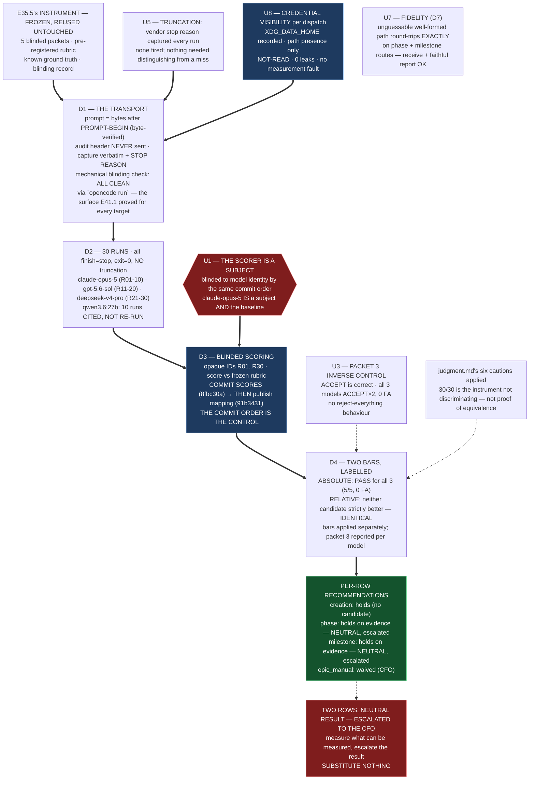

# E41.4 Execution Record — Verification-Target Back-Test

## What this epic did

Built the transport E35.5 never had, measured three models on the frozen E35.5
instrument (the never-measured `claude-opus-5` incumbent and the two remote candidates
`gpt-5.6-sol` and `deepseek-v4-pro`), scored all 30 runs blind to model identity with
the scores committed before the mapping, and applied both bars separately. `qwen3.6:27b`
is cited, not re-run; `qwen3.8:27b` leaves the measured set per the CFO ruling; the
measured set is two candidates + the baseline (spec v1.4.0).

## Deliverables, and where they live

| Deliverable | Path | Status |
|---|---|---|
| **D1** — the transport | `.ai-project/artifacts/reference/local-review-backtest/e41-4-runs/transport.py` + `runner.py` + `dispatch_one.py` | complete; blinding re-verified ALL CLEAN |
| **D2** — 30 runs committed | `e41-4-runs/blinded/R01–R30` (blinded records) + `e41-4-runs/raw/R01–R30` (verbatim transport JSON with U8 credential visibility) | complete; no mechanical failures |
| **D3** — blinded scores, then mapping | `e41-4-runs/scores.md` (commit `8fbc30a`) then `e41-4-runs/mapping.tsv` + raw (commit `91b3431`) | complete; commit order is the control |
| **D4** — both bars + per-row recommendations | `e41-4-runs/d4-bars-and-recommendations.md` | complete |
| **D5** — escalation | `.ai-project/artifacts/escalation-notices/2026-09-01T00_00_00Z__P12-M41-E41.4__escalation_notice.md` | complete (two rows escalated as neutral results) |
| **D7** — U7 fidelity probe | `e41-4-runs/fidelity/` | complete; both rows round-trip exactly |
| **D8** — credential visibility per dispatch | recorded in every `raw/R*.json` | complete; zero values read |
| Structural diagram | this record, below | complete |

## The structural diagram (AOG §16 — Mermaid, in-repo, no ComfyUI)

- **Link:** (inline — Structural diagram; no hosted link per AOG §16.3/§16.5)
- **What:** diagram · **Level:** Epic · **State:** implemented
- **Description:** E41.4 wrapped E35.5's frozen instrument in the two things it lacked —
  a transport to three remote vendors (all routed through `opencode run`, the one
  surface E41.1 proved answers + self-reports) and a scoring control that blinded the
  scorer to model identity by commit order. Thirty runs, all clean `stop`, no truncation.
  The blinded scores were committed before the mapping — the control a reviewer can
  check in the history. Both bars applied separately: all three models PASS the absolute
  pre-registered bar, and neither candidate is strictly better than the baseline on any
  check, so both `phase` and `milestone` rows hold with a neutral result escalated to
  the CFO. `qwen3.6:27b` cited, not re-run. Mermaid, in-repo, no ComfyUI.

## The scoring asymmetry, recorded beside the citation (U1 / DoD)

`qwen3.6:27b`'s ten cited runs were scored **knowing the model** (E35.5's method, one
candidate, scorer not a subject). The thirty new runs were scored **blind to model
identity** (this epic's added control). This asymmetry does not contaminate any row
decision — `qwen3.6:27b` is a lane candidate, not a verification target, and is not in
the relative comparison for `creation`, `phase`, `milestone` or `epic_manual` — but it
is stated here so a reader comparing a blind-scored result against a non-blind-scored
citation is told.

## The measured result, stated within judgment.md's limits

- **Absolute bar:** PASS for all three models (5/5, 0 false alarms, 0 on defect 3).
- **Relative bar:** NOT cleared by either candidate — both are identical to the baseline
  on every check.
- **Stated plainly:** this back-test shows all three models equal on the frozen
  instrument, all clearing the absolute bar, and provides **no relative evidence** for
  moving either the `phase` or `milestone` row. It neither supports nor contradicts the
  CFO's line-up decision; it does not discriminate. That neutrality is escalated as a
  result, not a failure.

## Escalation

Two rows escalated to the CFO as neutral results (`phase`, `milestone`). Positive
statement: no packet/rubric change, no truncation issue, no U8 fault, no D7
blocker. See the Escalation Notice.

## Suite

`PYTHONPATH=. pytest -q` at branch baseline (== `origin/milestone/M41`): **569 passed /
0 failed**, 34.21s. This epic adds no code under test; the transport lives under
`.ai-project/artifacts/reference/` and is not part of the suite.

## Notes

- **Transport choice:** one code path per vendor, all through `opencode run` — the
  mechanism E41.1 §9.3 confirmed answers + self-reports for every target, and the one
  that keeps credentials opaque (no key ever handled by this epic's code).
- **Refusal classification (delegated decision 5, decided before any run):** a vendor
  refusal to answer = mechanical failure, committed and excluded with its reason. No
  refusal occurred.
- **Run ordering (delegated decision 3):** baseline first (R01–R10), then `gpt-5.6-sol`
  (R11–R20), then `deepseek-v4-pro` (R21–R30).
- **`num_ctx` / remote analogue (U5):** no tuning was applied to any remote call; the
  vendor's own context handling was used, and this is recorded per run.