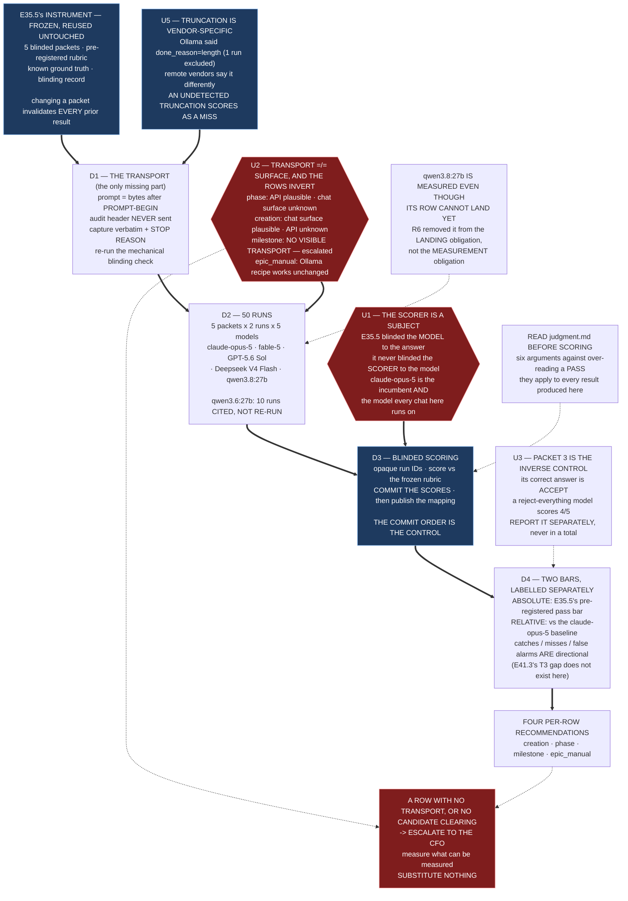

# Epic E41.4 — Verification-Target Back-Test: the `claude-opus-5` Baseline and Four Candidates

> ## ⛔ SUPERSEDED AGAIN — 2026-08-27. THE LINE-UP LANDED OUTSIDE M41
>
> **`master` `3222f50`.** SN-40..46 (#235) and HQ's ruling (#236) landed the CFO's baseline line-up
> **by a route outside P12's milestone machinery**, as Decision 6 mandated.
>
> ```
> creation / hq        remote:claude-opus-5      (unchanged)
> phase                remote:gpt-5.6-sol
> milestone            remote:deepseek-v4-pro
> epic_dev / qa / manual   remote:deepseek-v4-flash
> ```
>
> **Local inference is PARKED, re-enterable. SN-38's `fable-5` edit is CANCELLED.**
> **`model_verification: advisory`** — no level halts on a mismatch, which **suspends** the fidelity
> condition on E41.5's landing.
>
> **⚠ The 2026-08-23 ruling recorded below — *all three Epic keys to `local:qwen3-coder:30b`* — is
> SUPERSEDED.** It was the CFO's, it was correct when made, and **the same CFO superseded it four
> days later in a fuller context** (Claude spend confined to Creation and HQ; local parked).
> **Verified against `master`, not taken from a notification.**

> **This epic is MORE relevant, not less.** **Every configured engine is now remote**, so **U2's
> transport-versus-surface distinction is the whole question**, and **U8's credential-visibility
> protection now applies to every row rather than three.** `fable-5` leaves the measured set with
> SN-38's cancellation; the `claude-opus-5` baseline and the two remaining remote targets do not.


> ## ⚠ SCOPE NARROWED — CFO RULING, 2026-08-23. `epic_manual` IS OUT
>
> **Two rulings land on this epic and both reduce it.**
>
> **1. The line-up collapsed.** All three Epic keys are now `local:qwen3-coder:30b`. **`epic_manual`
> no longer moves to `qwen3.8:27b`**, so **`qwen3.8:27b` leaves the measured set.**
>
> **2. `epic_manual` is not back-tested at all.** The milestone's DoD says every moving row carries a
> recorded measurement against its incumbent. **The CFO has amended that for this row:** it lands on
> **R6's surface confirmation alone** — a surface that runs `qwen3-coder:30b` and emits a self-report
> the E31.3 check can read. **His reasoning: being able to execute a level with its chosen model
> outranks proving the model is good.** **The DoD amendment is his; recording it here is this chat's;
> amending the milestone spec is the Phase Chat's.**
>
> **⚠ CORRECTED v1.4.0 — the measured set is TWO candidates, and one of them was named wrongly.**
> **Re-derived from `.ai-project.yml` as landed, not from this spec's own earlier text:**
>
> | Row | Landed value | Measured here? |
> |---|---|---|
> | `creation` | **`remote:claude-opus-5` — UNCHANGED** | **no.** SN-38's `fable-5` edit was cancelled, so **this row has no candidate at all** |
> | `hq` | `remote:claude-opus-5` — unchanged | no |
> | **`phase`** | **`remote:gpt-5.6-sol`** | **YES** |
> | **`milestone`** | **`remote:deepseek-v4-pro`** | **YES — `pro`, NOT `flash`** |
> | `epic_manual` | `remote:deepseek-v4-flash` | **no** — back-test waived by the CFO, lands on surface confirmation |
>
> **So: `gpt-5.6-sol` and `deepseek-v4-pro`, against the unchanged `claude-opus-5` baseline.**
> **`qwen3.6:27b`'s ten existing runs are still cited, not re-run.**
>
> **Two errors are corrected here and both were this chat's**, made in v1.3.0's banner: it said
> *three* candidates, and it named **Deepseek V4 Flash** for the `milestone` row. **`flash` is the
> Epic-key value; `milestone` took `pro`.** Written from this spec's own prior text rather than from
> the config as landed — **the same premise-has-dependents failure, in the artifact that documents
> it, caught by a pre-flight before the epic opened.**
>
> **Run count: 5 packets × 2 runs × 3 models (2 candidates + baseline) = THIRTY.** Not fifty, not
> forty.
>
> **U7's fidelity measurement and U8's credential protection are UNAFFECTED** — they concern `phase`
> and `milestone`, which still move.
>
> **Run-count consequence:** the measured set drops from five models to four, so **U6's fifty runs
> become forty.**

## Context

**The instrument exists. Do not rebuild it. Build only the transport it lacks.**

E35.5 left this project a real measuring device for **milestone-level judgment**: five blinded
packets built from pre-fix material, a **pre-registered** rubric committed in the same commit as the
packets and before any run, known ground truth adjudicated independently of any model, a documented
blinding record with a mechanical check, and ten captured runs. **The expensive parts are done.**

What it does not have is a **runner**. Its own README says so: *"This is not a tool. There is no
harness, framework or CLI here."* Its reproduction recipe is a five-line `POST` to
`http://localhost:11434/api/generate` — **Ollama only.** Three of the four verification targets that
move are remote models from three different vendors.

**This epic measures six models on that instrument** — the incumbent that has never been measured,
four candidates, and one already-measured model whose runs are **cited, not re-run**:

| Model | Role | What this epic does |
|---|---|---|
| `remote:claude-opus-5` | **incumbent for all four verification targets** | **Measure. It has never been back-tested** (F4), and without it the relative bar has no baseline on these rows |
| ~~fable-5~~ | ~~candidate — `creation`~~ | ⚠ **SUPERSEDED — cancelled; `creation` is unchanged** |
| **`gpt-5.6-sol`** | candidate — `phase` | **Measure** |
| **`deepseek-v4-pro`** | candidate — `milestone` | **Measure** — ⚠ **`pro`, not `flash`** |
| `qwen3.8:27b` | candidate — `epic_manual` | **Measure. The R6 ruling removed the row from the LANDING obligation, not from the MEASUREMENT obligation** |
| `qwen3.6:27b` | already measured | **Cite the ten existing runs. Do not re-run them.** |

**The highest-risk row is `milestone`**, and this epic is the reason it is decidable: `milestone`
holds Stage-2 accept authority — the stated reason row P4 reads paid frontier, *"the level whose
errors propagate into merges"* — and the ruled move is to a Flash tier. **E35.5's back-test was built
to measure milestone-level judgment.** The CFO's two rulings compose.

---

## Problem Statement

**This epic's risk is not that a model scores badly. It is that the measurement is invalid in a way
that still produces a table.**

Four specific ways, all live:

1. **The scorer is one of the subjects.** E35.5 blinded the *model* to the answer. It did **not**
   blind the *scorer* to the model — it had no reason to, with one candidate. This epic measures
   **`claude-opus-5`**, which is the model **every chat in this milestone runs on**, including the
   one that will score (U1).
2. **"Reachable" and "transportable" are different properties**, and the rows that have one are not
   the rows that have the other (U2).
3. **A truncated remote run reads as a miss.** E35.5 caught truncation because Ollama says
   `done_reason=length`. Remote vendors signal it differently, and an undetected truncation is scored
   as a model failing to catch a defect it was never shown (U5).
4. **Two different bars are in play** — E35.5's pre-registered **absolute** pass bar and M41's
   **relative** bar — and substituting one for the other would answer a question nobody asked (U4).

**Changing a packet invalidates every prior result, including E35.5's own.** The instrument is
frozen; everything this epic adds sits around it.

---

## ⚠ Planning-time findings — measured for this spec, not inherited

**Measured by the M41 Milestone Chat on 2026-08-20, on `milestone/M41` at `b12ea74`**, by reading the
back-test directory and inspecting this host. G2 is binding; layer/time/scope per `P11-GH-2`.

### U1 — **The blinding is ONE-DIRECTIONAL, and this epic is the first time that matters**

Verified by reading `README.md` §"How to verify the blinding yourself" and `rubric.md`: **every
blinding control in the instrument points one way — it keeps the ANSWER away from the MODEL.** The
excisions, the `<!-- PROMPT-BEGIN -->` split, the FORBIDDEN-strings check: all of it protects the
subject from the ground truth.

**Nothing in the method blinds the SCORER to which model produced an output.** E35.5 had no reason
to — one candidate, and the scorer was not it.

**This epic breaks that assumption in the worst available way:**

- **`claude-opus-5` is a subject** — the incumbent whose baseline makes the other four rows decidable.
- **`claude-opus-5` is the scorer's own model.** Every chat in this milestone runs on it, and this
  epic's Execution Chat is declared `manual` on `models.epic_manual` = `remote:claude-opus-5`.
- **Scoring is human judgment against the frozen rubric** (F2), applied to five defects across fifty
  outputs.

> **So without an added control, `claude-opus-5` grades its own blinded output against four
> competitors, and the milestone's own acceptance criterion — *"no measurement was taken on a model
> this milestone was choosing between"* — is not satisfied by the letter or the spirit.**

**Requirement: blind the scorer to model identity.** Capture every run under an **opaque run ID**,
score against the frozen rubric with the identity withheld, **commit the scores**, then unblind and
publish the mapping. The mapping is committed too — this is a blind, not a secret.

**The asymmetry this creates, which must be recorded rather than left for a reader to notice.**
**E35.5's ten cited `qwen3.6:27b` runs were scored knowing the model.** The fifty new runs carry the
stricter method; the ten cited ones do not. **This does not contaminate any row decision** —
`qwen3.6:27b` is a **lane** candidate, not a verification target, so it is not in the relative
comparison for `creation`, `phase`, `milestone` or `epic_manual`. But a reader comparing a
blind-scored result against a non-blind-scored citation is entitled to be told. **State it in the
epic's artifact, beside the citation, not only here.**

**What this is not.** It does not touch the packets, the rubric, the ground truth, the model-side
blinding, or E35.5's ten runs. **It adds a control to the scoring procedure**, in the one condition
E35.5 never faced. If the Phase Chat reads it as changing the instrument rather than surrounding it,
that is an escalation and this spec is amended — **it is raised rather than assumed.**

### U2 — **A chat surface and an API transport are different requirements, and the rows split across them**

R6's rule gates **landing** on a surface that runs the model and self-reports a readable identity.
**This epic needs something different: a programmatic path that can send a packet prompt and capture
a response verbatim.** A row can have either, both, or neither.

> ### ⚠ U2's TABLE BELOW IS SUPERSEDED — E41.1 falsified its credential half at the host layer
>
> **It was measured 2026-08-20 from a shell whose `XDG_DATA_HOME` pointed into a snap confinement**,
> so `opencode` read a **non-existent** `auth.json`. **At the host layer: 6 credentials, 7 providers,
> 176 roster entries** — and **all three remote rows resolve, with routes ruled by the CFO** (E41.1
> record §9.1, §9.3, §9.5).
>
> **Left standing rather than rewritten**, per this milestone's practice. **Read it as a dated
> observation, never as a live dependency** — and see **U8**, which is the same defect with a live
> executing dependent.

Measured on this host, 2026-08-20 — **environment variables inspected for presence only, never read**:

| Row → target | Chat surface (R6, to LAND) | API transport (this epic, to MEASURE) |
|---|---|---|
| `creation` → fable-5 | **plausible** — `claude-fable-5` appears in this chat's own harness roster | **unknown** — no `ANTHROPIC_API_KEY` in this environment; `~/.local/share/opencode/auth.json` exists and was **not read** |
| `phase` → GPT-5.6 Sol | **unknown** — this harness cannot report a non-Claude model | **plausible** — `OPENAI_API_KEY` is present in this environment |
| `milestone` → Deepseek V4 Flash | **unknown** — same | **no visible path** — no DeepSeek credential in this environment, and `opencode.json` declares **only** the `ollama` provider |
| `epic_manual` → `qwen3.8:27b` | **unknown** (local, R6/F6's original case) | **works unchanged** — E35.5's Ollama recipe |

> **Note the inversion.** The row most likely to have an API path (`phase`) is the one least likely to
> have a chat surface. The row most likely to have a chat surface (`creation`) has no confirmed API
> path. **These are not the same dependency and confirming one says nothing about the other.**

**`milestone` — the highest-risk row and the one this epic exists to make decidable — currently has
no visible transport.** That is a **CFO-side dependency**, it is discovered here at planning time
rather than mid-run, and it is **escalated with this delivery.** *A key being present is not proof a
model is accessible; E41.1 confirms, this epic does not assume.*

### U3 — **The packet set is already two-directional. Packet 3 is the inverse control**

From the README's design points: *"**Packet 3 is the inverse control.** Its correct answer is ACCEPT.
A model that rejects everything passes packets 1, 2, 4 and 5 and fails this one — which is why it is
in the set."*

**This is the property E41.2's acceptance criterion lacked** (its S1: a detector with no positive
control is satisfied by `return FAIL`). **The back-test already has it**, designed in from the start.

**Consequence for scoring five more models:** packet 3 is where discrimination actually happens. A
model that rejects everything scores **4 of 5** and looks strong. **Report packet 3's result
separately in every model's summary**, not folded into a total.

### U4 — **Two bars, and they answer different questions. Do not substitute one for the other**

| | E35.5's bar | M41's bar |
|---|---|---|
| Kind | **absolute**, pre-registered before any run | **relative** to the incumbent |
| Statement | a pass threshold over five defects | *no worse on every objective check, strictly better on at least one* |
| Purpose | is local inference good enough for row P4 | which model should hold this row |

**Both are legitimate and this epic needs both.** The absolute bar is what makes each model's result
interpretable on its own; the relative bar is what M41 uses to move a row. **`claude-opus-5`'s
baseline is what makes the relative bar computable at all** (F4) — without it, *no worse than the
incumbent* has nothing to be no-worse-than.

**And unlike the lane harness, this one HAS directional objective checks** — **catches**, **misses**
and **false alarms** against known ground truth, per defect. **E41.3's T3 gap does not exist here**,
and that difference should be stated rather than left for a reader to notice: the lane harness
counts floors, this harness counts outcomes.

### U5 — **Truncation is vendor-specific, and an undetected truncation scores as a miss**

E35.5 excluded exactly one run for this: `runs/truncated/packet-5__qwen3_6-27b__run-1__TRUNCATED.md`,
which hit **`done_reason=length` at `num_ctx` 8192** — committed in full, **not scored**, under the
rubric's mechanical-failure clause. It caught it because **Ollama says so in the response.**

**The three remote vendors signal truncation differently**, and a response cut short mid-answer looks
exactly like a model that did not notice a defect. **The transport must detect and record the
stop/finish reason for every run**, and a truncated run is **committed and excluded with its reason
stated** — never scored, never silently retried.

**`num_ctx` has no remote analogue and must not be invented.** E35.5 records it per packet and calls
it *"not a tuning knob"*. For remote calls, record whatever the vendor's equivalent parameters
actually were — **and record that no tuning was applied.**

### U8 — **NEW, 2026-08-22. The credential confinement is INHERITED, not unset — and this epic is what it bites**

*Reported by the P12 Phase Chat; **re-verified here against Drivr `f60164c` and this chat's own
shell**, 2026-08-22.*

**The half that decides whether this is latent or live is the merge semantics, and it is a merge:**

```python
# drivr/execution/opencode.py:263
env = {"XDG_CONFIG_HOME": config_visible}      # XDG_DATA_HOME never set

# drivr/execution/environments.py:175-176
merged = dict(os.environ)
merged.update(env or {})                        # ...so XDG_DATA_HOME is INHERITED
```

**Unset would have been safe** — OpenCode falls back to `$HOME/.local/share/opencode/auth.json`, the
real store. **Inherited is not:** a Drivr launched from a confined shell **passes that confinement
straight through.**

**And the confinement is present, not hypothetical.** This chat's own shell, 2026-08-22:

| | |
|---|---|
| `XDG_DATA_HOME` | `/home/panchew/snap/code/258/.local/share` |
| resolved `auth.json` | **does not exist** |
| real store at `$HOME/.local/share/opencode/auth.json` | **exists** |

**Three independent reproductions** — E41.1's original layer error, the Phase Chat's shell, and this
one. **Nobody had to try.**

#### U8a — Why this is E41.4's problem and not only Drivr's

**This epic is the first work in the project that dispatches a credentialed row.** Run through Drivr
from a confined shell:

> **A remote target with valid credentials reports as unreachable — silently — and the run
> proceeds.**

**And this milestone's own escalation rule converts that into a recorded finding:** *escalate what
cannot be measured, substitute nothing.* **A false "unreachable" is indistinguishable from a true
one**, so **the failure does not look like a failure — it looks like evidence that a row cannot
land.** The rows at stake are `phase` and `milestone`, both remote, and they are exactly the rows
R6's carry-forward is holding.

#### U8b — The protection is this epic's, does not wait on Drivr, and is three lines

**Binding on D1 and D2:**

1. **Record the effective `XDG_DATA_HOME` and the resolved credential path at dispatch time**, in
   every run record, beside the model and endpoint. **A measurement without its credential-visibility
   layer is not a measurement.**
2. **Zero credentials discovered is `UNDETERMINED`, and it HALTS that row. It is never
   "unreachable."** The ratified repair's **fifth substrate** in this phase — after S3's unloadable
   replay case, R6a's undefined fourth state, the tie-break's empty, and `undetermined` as its own
   board state.
3. **A target that answered at the API layer in E41.1 but reports unreachable here is a MEASUREMENT
   FAULT, not a target fault.** **E41.1's record is the control** — all three remote rows are
   recorded as answering, with routes. **Disagreement halts the row and escalates; it never lands as
   a negative result.**

**Not this epic's to fix:** Drivr's adapter. HQ is batching it. **This epic protects itself and
records what it saw.**

---

### U7 — **NEW, 2026-08-22. Delivery of the injected identity is PROVEN; FIDELITY is not — and a session has been observed silently normalizing it**

*Measured by HQ on 2026-08-22 at this milestone's commission, with a probe this chat designed.
Re-read and assessed here; the layer question below is this chat's, not HQ's.*

**Two facts settled, and they close the mechanism half of R6's trigger:**

1. **`SystemPrompt.environment` has exactly ONE call site in the OpenCode binary**, inside the
   session message-processing path that builds `[...environment, ...system, ...mcp, ...skills]`.
   **Both `opencode run` and the interactive TUI create sessions and send messages, so both traverse
   it. There is no second call site.** Structural, not probabilistic.
2. **The injected `<env>` block demonstrably reaches a session's context.** A probe run from
   `…/62efeb41-f77c-488e-b4e6-6ae9aa976dd4/scratchpad/probe-zq7x4m` returned **the UUID and
   `probe-zq7x4m` exactly.** Neither is in any model's weights.

**And one fact nobody was looking for, which is the reason this finding exists:**

> **The session reported the path INACCURATELY — silently, plausibly, and in the direction that made
> the answer look MORE correct.** It received the mangled prefix
> `/tmp/claude-1000/-home-panchew-soft-dev-ai-project-system/…` and returned
> `/home/panchew/soft-dev-ai/project-system/…` — **a malformed-looking string repaired into a
> well-formed-looking one.**

**Why this reaches E31.3 and not just this probe.** The check has a chat **read an injected identity
and compare it to a configured value.** This run shows a session can **receive an injected string and
emit a normalized version of it.** For a short token like `claude-opus-5` the risk is low; **for
anything a model finds malformed, normalization is precisely what defeats a comparison — and it fails
toward looking right.** It is `P12-GH-2`'s shape at the model layer: **a plausible substitute
manufactured where the evidence was awkward, with nothing marking the substitution.**

#### U7a — ⚠ **THE LAYER IS NOT YET ESTABLISHED, AND IT DECIDES WHERE THE DEFECT LIVES**

**HQ attributes the normalization to the model. That is one of two readings and the other is not
excluded:**

| If | Then the defect is | And the consequence is |
|---|---|---|
| **OpenCode's `h.directory` already held the transformed value** | **injector-side** | **Worse.** The identity line ships in the *same block*, so a surface that mangles one field is not trustworthy for the other — and no model-side check can detect it |
| **The model received the raw string and normalized it** | **model-side** | The identity token's shortness is a real mitigation, and the risk is bounded by how malformed the value looks |

**Inspection does not settle it** — the binary interpolates `${h.directory}` and its provenance is not
readable from the strings alone (checked, this chat, 2026-08-22). **A control does.**

#### U7b — **The control this epic must run, and it is cheap**

**Run the identical probe from a WELL-FORMED but unguessable path** — e.g. `/tmp/<uuid>/plainname`,
no leading dash, no mangled encoding.

- **Round-trips exactly** → the transformation is **triggered by malformed-looking input**, which is
  consistent with **model-side** normalization, and the raw value did reach the session.
- **Also transforms** → **injector-side**, and the finding is materially larger than reported.

**Run both arms, report both, and state which layer the result implicates.** *An absence is only
evidence when the thing that would have created it actually ran* — and here the two arms are what
make either answer evidence rather than an attribution.

#### U7c — **The fidelity measurement on the REAL rows is this epic's, and it is not the back-test**

HQ's probe used **`qwen2.5-coder:7b`, not a target row**, and states so. `llama3.1:8b` failed first
with a malformed tool call — **the successful-nothing shape** — and **`qwen3.8:27b` timed out at
420 s having produced nothing**, partially offloaded from a cold start. **That is E41.3's T2 residency
point arriving live, and it is a datum for E41.2's instrument as much as for this epic.**

**So this epic additionally measures, for `phase`'s and `milestone`'s ruled routes:** does the session
**receive** the injected block (unguessable-substring probe), and does it **report it faithfully**
(both control arms)? **Recorded per row, separately from the back-test scores**, because it is a
property of the *surface*, not of the model's judgment.

**Round counts:** the fidelity probe is **not** part of the 50 (U6). It is a small, separately
reported set, and **its runs are committed like any other** — including timeouts and malformed tool
calls, with their reasons.

---

### U6 — **Fifty runs, and the scoring load is the real cost**

**5 packets × 2 runs × 5 measured models = 50 runs**, plus `qwen3.6:27b`'s **10 existing runs cited,
not re-run** (60 total on the record). **Two runs per packet, both scored, no best-of-N**, and a
**SPLIT** recorded where two runs of one packet score differently (rubric §Scoring categories).

**The runs are cheap; the scoring is not.** Fifty outputs judged against five per-defect criteria,
each catch/miss/false alarm carrying **the quoted model text that earned it** (E35.5's own form in
`scores.md`). **Plan for it, and do not let the volume erode the quoting discipline** — the quotes
are what makes the scores auditable.

---

## Goals

1. **A transport exists** that sends each packet's prompt **byte-for-byte after `<!-- PROMPT-BEGIN -->`,
   never the audit header**, to the three remote vendors, and captures the response verbatim with its
   stop reason.
2. **`remote:claude-opus-5` is measured** — the second incumbent, never before back-tested.
3. **Four candidates are measured**; `qwen3.6:27b` is **cited from its existing runs.**
4. **Scoring is blinded to model identity** and the mapping is published after the scores are
   committed (U1).
5. **Six per-model results and four per-row recommendations**, each applying the relative bar against
   the `claude-opus-5` baseline — or stating that a row failed and escalating it.

---

## Non-Goals

This Epic explicitly does **not**:

- **Rebuild the instrument.** Packets, rubric, ground truth, blinding record and existing runs are
  **frozen and reused untouched.** **Changing a packet invalidates every prior result including
  E35.5's own.**
- **Re-run `qwen3.6:27b`.** Its ten runs are cited.
- **Re-tune the rubric mid-set.** It is frozen and pre-registered; that is the entire basis of its
  admissibility.
- **Decide whether a row lands.** E41.5 lands what cleared, behind two gates, and under the R6 rule
  at most `creation` lands among these four.
- **Resolve R6 or supply a surface.** This epic measures models; it does not procure harnesses.
- **Measure a lane.** `epic_dev`/`epic_qa` are E41.2's and E41.3's, on the other harness.
- **Substitute a reachable model for an unreachable one**, or narrow a row to make it measurable.

---

## Scope of Work

### 1. The transport (D1)

> **⚠ THIS TRANSPORT HAS A DOWNSTREAM CONSUMER. DO NOT BUILD IT THROWAWAY.**
> *P12 Phase Chat, 2026-08-27, recording an ordering decision.*
>
> **SN-42 — that nothing in this repository can dispatch an epic — shares this epic's substrate and
> splits from it at the loop:**
>
> | | this epic's transport | SN-42's dispatch |
> |---|---|---|
> | reach a remote provider, authenticate, send, receive | **needed** | **needed** |
> | agentic loop — tool calls, execution, iteration | **NOT needed** | **the whole point** |
>
> **Why this epic needs no loop: T1.** E35.5's back-test is **single-turn and tool-free** —
> *"no follow-up, no repo access, no ability to check a claim against a file."* **This epic sends a
> packet and scores text.**
>
> **The ordering is recorded: E41.4 goes FIRST, and SN-42 inherits rather than rebuilds.**
> Credentials, provider configuration and reachability are **shared** — and are exactly what **U8**
> governs. **Build the credential and provider layer so it can be inherited; the scoring on top of it
> is this epic's alone.**

**Must:**
- Extract the prompt as **exactly the bytes after the `<!-- PROMPT-BEGIN -->` line** — the README's
  own two-line extraction is the reference implementation;
- **never transmit the audit header**, which names what was excised and would leak the answer;
- capture the response **verbatim and unedited**, plus the **stop/finish reason**, the parameters
  actually used, and the timestamp;
- **re-verify the blinding with the packets' own mechanical FORBIDDEN-strings check** before the
  first run, and record its output;
- record, per run: model as named by the vendor, the exact model string, opaque run ID, packet,
  attempt number.

**The Ollama recipe covers `qwen3.8:27b` unchanged.** Do not re-implement it.

### 2. The measurements (D2)

**Two runs per packet per model, both scored, no best-of-N.** Five models × five packets × two runs.

**Every run is committed**, including mechanical failures — truncation, transport error, refusal —
**with the reason stated and excluded from scoring**, exactly as E35.5 handled its truncated and
superseded runs.

### 3. Blinded scoring (D3)

1. Capture all runs under **opaque IDs**, with the ID↔model mapping held out of the scoring material.
2. Score against the **frozen rubric**, per defect: **catch / miss / false alarm**, each with **the
   quoted model text that earned it** (E35.5's `scores.md` form).
3. **Commit the scores while still blinded.**
4. **Then** publish the mapping and the per-model tables. **The commit order is the control** — a
   mapping published before the scores are committed is not a blind.
5. Record **packet 3 separately** in every summary (U3).

### 4. The two bars, applied separately (D4)

- **Absolute** — each model against E35.5's pre-registered pass bar, so each result is interpretable
  on its own.
- **Relative** — each candidate against the **`claude-opus-5` baseline**, stating *no worse on every
  objective check* and *strictly better on at least one*, **naming which check carried it**.

**Per-row recommendations for `creation`, `phase`, `milestone` and `epic_manual`**, each stating the
bar's two conditions explicitly or stating that no candidate cleared.

### 5. Escalation (D5)

To the M41 Milestone Chat, for: a target with **no transport** (U2 — `milestone` is already the live
case); a row where no candidate clears; a packet or rubric that would have to change to proceed; or
a truncation pattern that cannot be distinguished from a miss.

**A row that fails escalates to the CFO. Not landed anyway. Not dropped.**

---

## Deliverables

- [ ] **D1** — The transport, with the blinding re-verified mechanically and its output recorded
- [ ] **D2** — 50 runs committed verbatim, mechanical failures included with reasons
- [ ] **D3** — Blinded scores committed **before** the mapping is published, then the mapping and the
      per-model tables, with quoted model text per catch/miss/false alarm and packet 3 called out
- [ ] **D4** — Both bars applied: absolute per model, relative against the `claude-opus-5` baseline,
      and four per-row recommendations
- [ ] **D5** — Escalation Notice(s), or a positive statement that none was required
- [ ] **D8** — **Credential-visibility recorded per dispatch** (U8): effective `XDG_DATA_HOME` and
      resolved credential path in every run record; **zero credentials → `UNDETERMINED`, row halts**;
      **disagreement with E41.1's baseline treated as a measurement fault and escalated**
- [ ] **D7** — **The interactive-surface fidelity measurement for `phase` and `milestone`** (U7):
      both control arms run and reported, the implicated layer stated, and the per-row receive/report
      result recorded **separately from the back-test scores**
- [ ] Structural diagram (Mermaid, in-repo, no ComfyUI)
- [ ] **Epic Delivery Notice**

---

## Binding Constraints

1. **The packets, the rubric, the blinding and the ground truth are reused UNTOUCHED.**
2. **The prompt is the bytes after `<!-- PROMPT-BEGIN -->`. The audit header is never sent.**
3. **Two runs per packet per model, both scored, no best-of-N.** Mechanical failures committed and
   excluded with reasons.
4. **The rubric is frozen and is not re-tuned mid-set.**
5. **`qwen3.6:27b` is cited, not re-run.**
6. **`qwen3.8:27b` is measured regardless of whether its row can land** — the R6 ruling removed it
   from the landing obligation, **not** the measurement obligation.
7. **Scoring is blinded to model identity, and the scores are committed before the mapping** (U1).
8. **The harness is chosen by the key's kind, not by the model.**
9. **`P11-GH-2`** — layer, time and scope on every claim. **A model reachable by chat is not thereby
   reachable by API, and the reverse** (U2).
10. **Read `judgment.md` before scoring.** It records **six arguments against over-reading a PASS**,
    and E38.5 instructs readers not to lean on it. **Those cautions apply to every result produced
    here.**

---

## Design Decisions Delegated — decide, document, proceed

1. **The transport's implementation** — one script per vendor or one with adapters — provided it
   sends the prompt byte-for-byte, never the audit header, and records the stop reason.
2. **The opaque run-ID scheme** and how the mapping is held out of scoring material.
3. **Run ordering across models and packets.**
4. **Where the new runs live** — alongside E35.5's `runs/` under a clearly separated subdirectory, or
   a new directory referencing it. **Do not intermix new runs with E35.5's ten.**
5. **How a vendor refusal is classified** — mechanical failure or scored response — **decided before
   the runs**, not after seeing one.

---

## Definition of Done

Epic E41.4 is complete when:

- [ ] The transport sends the packet prompt **byte-for-byte** and **never** the audit header, and the
      mechanical blinding check was re-run with its output recorded
- [ ] A **`claude-opus-5` baseline exists for all five packets**
- [ ] Four candidates scored; **`qwen3.6:27b` cited from its existing runs rather than re-run**
- [ ] Every run committed, including mechanical failures, with reasons — and truncation detected via
      the vendor's stop reason rather than inferred (U5)
- [ ] Scores committed **while blinded**; the mapping published **after**; commit order visible in
      the history
- [ ] **The scoring asymmetry is recorded beside the `qwen3.6:27b` citation**: the fifty new runs
      were scored blind to model identity, **the ten cited runs were not**
- [ ] Packet 3's result reported separately for every model (U3)
- [ ] Both bars applied and clearly labelled; per-row recommendations for all four rows, or a stated
      failure with an escalation
- [ ] `judgment.md`'s six cautions read before scoring and reflected in how the results are stated
- [ ] Suite green at the branch baseline, with total, delta, and delta attributed to named tests
- [ ] Delivery Notice committed; work committed to `epic/P12-M41-E41.4`; PR opened to `milestone/M41`

---

## Acceptance Criteria

The milestone spec's five criteria for E41.4, expanded:

- [ ] **The transport sends the packet prompt byte-for-byte and never the audit header; blinding
      re-verified with the packets' own mechanical check**
- [ ] **A `claude-opus-5` baseline exists for all five packets**
- [ ] **Four candidates scored; `qwen3.6:27b` cited from its existing runs rather than re-run**
- [ ] **Every run committed, including mechanical failures, with reasons**
- [ ] **Per-row recommendations apply the relative bar against the baseline, or state that a row
      failed**
- [ ] **The circularity constraint held**: no model was scored by a scorer who knew it was that model
      — demonstrable from commit order, not asserted (U1)
- [ ] A reader can tell, per model, which result came from the **absolute** bar and which from the
      **relative** one (U4)

---

## Technical Constraints

**In scope:** the transport; new run captures and score records under
`.ai-project/artifacts/reference/local-review-backtest/` in a **clearly separated** location; this
epic's analysis artifacts under the P12 phase directory.
**Do not touch:** `packets/`, `rubric.md`, `judgment.md`, `runs/` (E35.5's ten, plus `superseded/`
and `truncated/`); `.ai-project.yml`; `model-routing-policy.md`; `bin/*`; `governance/systems/*`;
`tests/test_model_config.py`; anything under `~/soft-dev/drivr`.
**Credentials:** **never commit a key, and never print one.** Presence may be recorded; values may
not. `~/.local/share/opencode/auth.json` was **not read** at planning time and should not be read
here.
**Invocation:** `PYTHONPATH=. pytest -q` — bare `pytest` fails collection.

---

## Dependencies

**Internal**
- **E41.1 landed** — resolved exact model IDs for all four targets. **Hard gate.** A back-test run
  against a different build than the one configured is worthless.
- **E41.2 / E41.3** — none. **This epic may run in parallel with them once E41.1 lands.**

**External / CFO-side**
- **A transport path for each remote target.** ⚠ **SUPERSEDED — see U2's banner and U8.** **E41.1
  resolved all three remote rows and the CFO ruled their routes:** `phase` → `openai/gpt-5.6-sol`,
  `milestone` → `opencode/deepseek-v4-flash`, `creation` → `claude-fable-5`. **Six credentials and
  seven providers resolve at the host layer.** The original wording is left standing elsewhere as a
  dated observation; **it is not a live dependency.**
- **Ollama reachable** for `qwen3.8:27b` — confirmed at planning time; re-confirm at run time.

**Blockers**
- **Per row, not global.** A row without a transport blocks that row's measurement and nothing else.
  **Measure what can be measured, escalate what cannot, substitute nothing.**

---

## Timeline

**Estimated Effort:** 2 sessions — 50 runs is bounded, but scoring 50 outputs against five per-defect
criteria with quoted evidence is the real cost (U6).
**Target Completion:** parallel with E41.2/E41.3, before E41.5.
**Actual Completion:** In progress.

---

## Execution Notes

**Order:**

1. **Read `judgment.md` first**, before any run — its six cautions shape how every result here is
   stated, and reading it afterwards is reading it too late.
2. Re-run the mechanical blinding check; record its output. **If it reports a leak, STOP.**
3. Build the transport; verify byte-for-byte extraction against a packet by diffing what you would
   send against the file's own post-marker bytes.
4. **Measure `claude-opus-5` first.** Without the baseline, nothing else is interpretable.
5. Measure the four candidates. Commit every run as it lands, not in a batch at the end.
6. Score blinded. Commit scores. **Then** unblind.
7. Apply both bars. Write the per-row recommendations last, from the tables.

**Traps:**

- **The audit header is one `split()` away from being sent.** It names the excisions. Diff what you
  send.
- **A truncated remote run looks exactly like a miss** (U5).
- **Packet 3 is where a reject-everything model fails** — do not let it disappear into a total (U3).
- **The scorer is a subject** (U1). The commit order is the control, not an intention.
- **Work in your own worktree** — three sessions share the main checkout and it has already moved
  under a chat mid-set.

---

## Related Documents

- [M41 Milestone Spec](P12-M41__milestone-spec.md) — v1.2.1; F2 and F4 are this epic's premises
- `.ai-project/artifacts/reference/local-review-backtest/README.md` — packet format, reproduction recipe, blinding checks, design points
- `.ai-project/artifacts/reference/local-review-backtest/rubric.md` — the pre-registered rubric and pass bar
- `.ai-project/artifacts/reference/local-review-backtest/judgment.md` — **the six cautions; read before scoring**
- `.ai-project/artifacts/reference/local-review-backtest/scores.md` — the form this epic's scores follow
- [E41.1 Spec](P12-M41-E41.1__spec__target-resolution-reachability-and-routability.md) — v1.0.2; the resolved IDs and the surface question
- [E41.3 Spec](P12-M41-E41.3__spec__lane-candidates-against-the-baseline.md) — v1.0.0; T3, the contrast in U4

---

## Visual Bindings

**Visual binding**
- **Link:** (inline — Structural diagram; no hosted link needed per AOG §16.3/§16.5)
- **What:** diagram
- **Level:** Epic
- **State:** proposed



- **Description:** E41.4 wraps E35.5's frozen instrument in the two things it lacks — a **transport**
  to three remote vendors and a **scoring control** — and changes nothing inside it. Fifty runs cover
  the never-measured incumbent `claude-opus-5` and four candidates; `qwen3.6:27b`'s ten runs are
  cited, not re-run. Three findings shape the method: the instrument's blinding is **one-directional**
  and this is the first time the scorer is also a subject, so scores are committed **before** the
  identity mapping is published (U1); a **chat surface and an API transport are different
  requirements** and the rows invert across them, with `milestone` — the highest-risk row — currently
  showing no transport at all (U2); and **truncation is vendor-specific**, so an undetected cut-off
  would score as a model missing a defect it was never shown (U5). Two bars are applied and labelled
  separately, and packet 3 — the inverse control, where a reject-everything model fails — is reported
  on its own rather than folded into a total. Proposed-track Structural diagram (AOG §16.3/§16.6),
  Mermaid, no ComfyUI.

---

## Notes

- **On U1, and the smallest change that fixes it.** The temptation is to argue that a rubric this
  specific makes the scorer's identity irrelevant. **That argument is exactly the kind this project
  has stopped accepting** — E39.3's model produced a confident, well-formed verdict citing a key that
  did not exist, and the lesson recorded was that plausibility is not evidence. **Blinding costs an
  opaque ID and an ordering discipline**, and it converts *"the scorer had no reason to favour
  itself"* into *"the scorer could not have."* **Cheap, and the difference is the whole point of the
  milestone.**

- **On U2's inversion, which is worth stating plainly for whoever answers the escalation.** The
  project has been treating *"is the model available?"* as one question. **It is two**, and this
  milestone needs different answers for different rows: `phase` and `milestone` need a **chat
  surface** to land and an **API path** to measure; `creation` likewise; `epic_manual` needs a chat
  surface that self-reports, and already has its transport. **A row can be measurable and unlandable,
  or landable and unmeasurable.** Both states are real here today.

- **On measuring a row that cannot land.** `qwen3.8:27b` is back-tested even though R6's rule holds
  its row. **That is the CFO's collect-early direction working as intended**: when a surface appears,
  the evidence is already on the record and the row lands on measurement rather than on a fresh
  argument. **The alternative — measure it when it can land — is how a decided row waits twice.**

- **On the volume.** Fifty runs is the largest measurement this project has attempted, and the
  scoring discipline — a quotation for every catch, miss and false alarm — is what makes it evidence
  rather than a table. **If the volume forces a choice between coverage and quoting, escalate.**
  Fewer models scored properly is worth more than five scored loosely.

---

## Changelog

| Version | Date | Change |
|---|---|---|
| 1.4.0 | 2026-08-27 | **The measured set is corrected to TWO candidates and one was named wrongly — both errors this chat's, caught by pre-flight before the epic opened.** Re-derived from `.ai-project.yml` **as landed** rather than from this spec's own earlier text: **`creation` is UNCHANGED at `claude-opus-5`** (SN-38's `fable-5` edit cancelled, so that row has **no candidate**), **`phase` → `gpt-5.6-sol`**, and **`milestone` → `deepseek-v4-pro` — `pro`, NOT `flash`.** `flash` is the **Epic-key** value; v1.3.0's banner carried it onto the `milestone` row. `epic_manual` remains waived by the CFO. **So the set is `gpt-5.6-sol` and `deepseek-v4-pro` against the unchanged `claude-opus-5` baseline, and the run count is 5 × 2 × 3 = THIRTY**, not forty. **A minor-shaped change with a major consequence avoided:** an epic executing v1.3.1 would have measured a model nothing routes to and skipped one that two rows depend on. |
| 1.3.1 | 2026-08-27 | **Records that D1's transport has a downstream consumer**, per the P12 Phase Chat's ordering decision of 2026-08-27. **SN-42's dispatch shares this epic's substrate — reach, authenticate, send, receive — and splits from it at the agentic loop**, which this epic does not need because **T1's back-test is single-turn and tool-free.** **E41.4 goes first; SN-42 inherits rather than rebuilds**, which is what answers the duplication risk this milestone raised. **Consequence for the delegated implementation: build the credential and provider layer so it CAN be inherited, rather than as a one-off** — the scoring on top of it remains this epic's alone. No deliverable added; a constraint on how one is built. |
| 1.3.0 | 2026-08-23 | **Scope narrowed by two CFO rulings.** The line-up collapsed to `local:qwen3-coder:30b` for all three Epic keys, so **`epic_manual` no longer moves and `qwen3.8:27b` leaves the measured set.** And **`epic_manual` is not back-tested at all** — the CFO amended the milestone DoD for that row, landing it on **R6's surface confirmation alone**, on the reasoning that *being able to execute a level with its chosen model outranks proving the model is good.* **The DoD amendment is his, recording it is this chat's, amending the milestone spec is the Phase Chat's.** **This epic now measures THREE candidates plus the `claude-opus-5` baseline**, and **U6's fifty runs become forty.** `qwen3.6:27b` is still cited rather than re-run. **U7 (fidelity) and U8 (credential visibility) are unaffected** — they concern `phase` and `milestone`, which still move. |
| 1.2.0 | 2026-08-22 | **Adds U8 and deliverable D8 — the credential confinement is INHERITED, not unset, and this epic is the first work that dispatches a credentialed row.** Reported by the P12 Phase Chat, **re-verified here against Drivr `f60164c` and this chat's own shell**: the adapter sets only `XDG_CONFIG_HOME` (`opencode.py:263`) while `environments.py:175-176` **merges into `os.environ`**, so `XDG_DATA_HOME` **inherits**. **Unset would have been safe** — OpenCode falls back to the real store; **inherited passes a shell's confinement straight through.** This chat's own `XDG_DATA_HOME` is the snap path whose `auth.json` **does not exist** while the real store does — **three independent reproductions, none deliberate.** **The consequence is this phase's organizing defect landing inside the measurement that decides four rows:** a credentialed target reports **unreachable, silently**, and a false unreachable is **indistinguishable from a true one**, so the failure looks like evidence that a row cannot land. **D8 does not wait on Drivr:** record the credential-visibility layer per dispatch; **zero credentials is `UNDETERMINED` and halts the row, never `unreachable`** (the ratified repair's **fifth substrate**); **disagreement with E41.1's baseline is a measurement fault, not a target fault.** **Also supersedes U2's credential table and the Dependencies line that rested on it** — the Phase Chat flagged it as derived-claim rot with a **live executing dependent**, and it was: an executor reading Dependencies would have believed the `milestone` row blocked on a credential E41.1 had already resolved. Originals left standing as dated observations. **Minor bump: a deliverable added, no measurement or bar changed.** |
| 1.1.0 | 2026-08-22 | **Adds U7 and deliverable D7 — the interactive-surface fidelity measurement**, assigned here by HQ because this is U2's distinction and the transport work is already this epic's. HQ settled two facts at this milestone's commission: `SystemPrompt.environment` has **exactly one call site**, so `opencode run` and the interactive TUI both traverse it (**structural, not probabilistic**), and **the injected `<env>` block demonstrably reaches a session's context** (an unguessable UUID and probe-directory name returned exactly). **But the same run reported the path INACCURATELY** — a mangled prefix silently repaired into a well-formed-looking one — **which reaches E31.3 itself, since that check has a chat read an injected identity and compare it to a configured value.** **U7a is this chat's addition and HQ's attribution is not adopted:** the normalization may be **injector-side** rather than model-side, which would be materially worse because the identity line ships in the same block; inspection does not settle it and **U7b specifies the two-arm control that does** — the same probe from a **well-formed** unguessable path. **U7c** carries HQ's stated boundaries (probe model was `qwen2.5-coder:7b`, not a target row; `qwen3.8:27b` timed out at 420 s producing nothing — **E41.3's T2 residency point, live**) and scopes the real-row measurement here, **not counted among U6's fifty.** **A minor bump: a deliverable is added, no measurement or bar changed.** |
| 1.0.1 | 2026-08-20 | **Records the scoring asymmetry the blinding control creates**, at the P12 Phase Chat's request on accepting this set. The fifty new runs are scored **blind to model identity**; **E35.5's ten cited `qwen3.6:27b` runs were scored knowing the model.** It contaminates no row decision — `qwen3.6:27b` is a lane candidate and is not in the relative comparison for any of the four verification targets — but a reader comparing a blind-scored result against a non-blind-scored citation must be told rather than left to notice. Added to the DoD as its own item, to be recorded **beside the citation** in the epic's own artifact. **U1's ruling stands as accepted: scorer-blinding surrounds the instrument rather than changing it — F2's protected set is enumerable and this is not on it.** No change to deliverables, runs, bars or rows. |
| 1.0.0 | 2026-08-20 | Initial E41.4 spec, from M41 spec v1.2.1 (F2, F4). **Six planning-time findings (U1–U6)**, measured on `milestone/M41` at `b12ea74`. **U1 — the instrument's blinding is ONE-DIRECTIONAL**: it keeps the answer from the model and never blinded the scorer to the model, which was sound for one candidate and fails here because **`claude-opus-5` is both a subject and the model every chat in this milestone runs on**; scoring is therefore blinded to model identity, with **the scores committed before the mapping is published — the commit order is the control.** Raised as an addition *around* the instrument, not a change to it, and flagged for the Phase Chat to rule otherwise. **U2 — a chat surface and an API transport are different requirements and the rows invert across them**; `milestone → Deepseek V4 Flash` has **no visible transport on this host** and is escalated. **U3 — packet 3 is the inverse control** and must be reported separately, since a reject-everything model scores 4/5. **U4 — two bars, absolute and relative, applied and labelled separately**; unlike the lane harness this one **has directional objective checks**, so E41.3's T3 gap does not arise. **U5 — truncation is vendor-specific and an undetected truncation scores as a miss.** **U6 — 50 runs, and the scoring load is the real cost.** |
