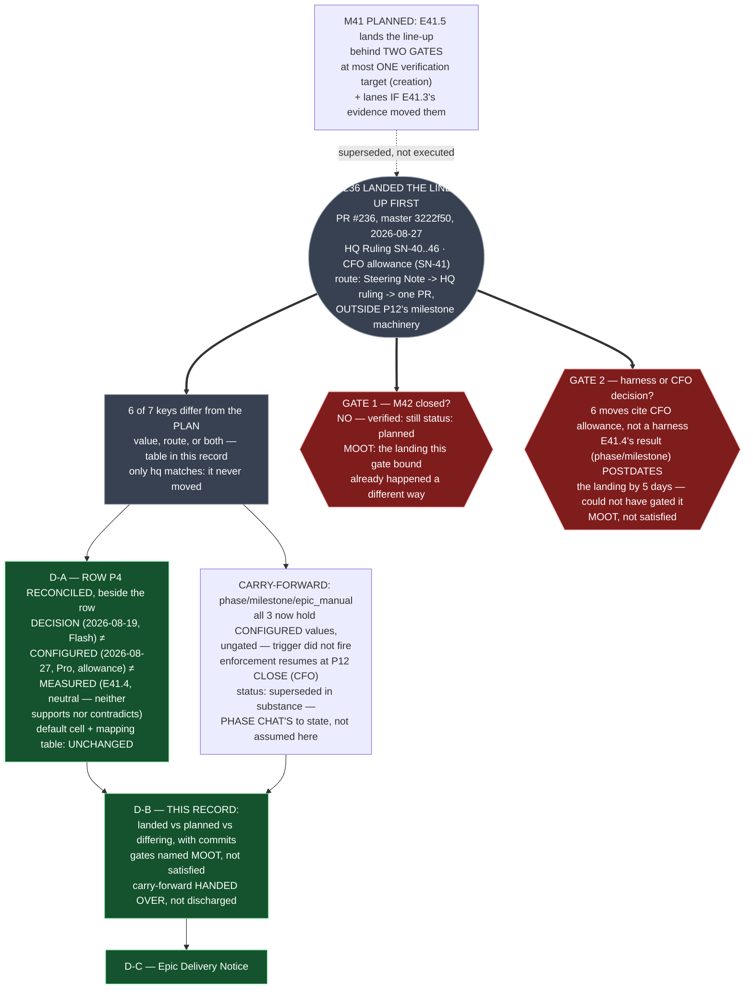

# E41.5 Execution Record — Discharge and Reconciliation

## Layer, time and scope (`P11-GH-2`)

This record, written on `epic/P12-M41-E41.5`, 2026-09-01, from a worktree at `milestone/M41`
(`origin/milestone/M41` == this branch's parent, `0` commits behind at branch-open — measured
below). Its claims are about **this repository's committed history and current file contents**,
read directly (`git log`, `git show`, `git cat-file -e`, file reads) rather than inherited from any
prior chat's summary. It says nothing about Drivr, which this epic does not touch.

## What this epic did, and why it lands no configuration change

**Spec v2.0.0's finding, verified rather than taken on report:** the model line-up this epic was
built to land was configured **outside M41's machinery** by HQ Ruling on SN-40..46
(`.ai-project/artifacts/rulings/2026-08-27__ai-project-system-hq__ruling__sn40-46-baseline-lineup-and-the-switching-ratchet.md`),
via **PR #236**, merged to `master` at **`3222f50`** (2026-08-27), by the route SN-40..46 Decision 6
mandated: *Steering Note → HQ ruling → one PR, outside P12's milestone machinery*, because a CFO
allowance decision over model spend is governance configuration, not phase work.

**Re-verified directly against the live files, not against the ruling's own narration:**

| Surface | Current state (read 2026-09-01) |
|---|---|
| `.ai-project.yml` `models:` block | `hq: remote:claude-opus-5`, `phase: remote:gpt-5.6-sol`, `milestone: remote:deepseek-v4-pro`, `epic_dev: remote:deepseek-v4-flash`, `epic_qa: remote:deepseek-v4-flash`, `creation: remote:claude-opus-5`, `epic_manual: remote:deepseek-v4-flash` |
| `model_verification` | `advisory` — no gate blocks a lineup mismatch |
| `governance/systems/chat-hierarchy.md` mapping table | all five manual-verification cells present and current |
| `bin/ai-project-orchestrator` `DEFAULT_MODELS` | five keys, matching `.ai-project.yml`'s five `MODEL_KEYS` values |
| `tests/test_model_config.py` | `EXPECTED_MANUAL_ONLY_VALUE` **does not exist**; guard is `test_config_manual_only_key_is_well_formed`, parametrized per key |
| `model-routing-policy.md` mapping table | all five `MODEL_KEYS` rows carry *"value set by CFO allowance decision (SN-41), not by measurement"* |

**Because the landing already happened, this epic's D2 (the configuration change) is empty by
design — not skipped, not deferred, positively empty.** There is no row left for this epic to land:
every key the M41 spec ever scoped to E41.5 (`creation`, `phase`, `milestone`, conditionally
`epic_dev`/`epic_qa`) already carries a configured value, set by a decision this epic did not make
and through a PR this epic did not open.

## Landed vs. planned, with commits — the discharge, stated so a reader does not have to infer it

**What M41 planned for this epic to land, gated behind two gates**, versus **what #236 actually
landed, ungated**:

| Key | M41/E41.5 planned (value, gate) | What #236 landed (`master` `3222f50`, 2026-08-27) | Differs? |
|---|---|---|---|
| `hq` | unchanged — `claude-opus-5` | unchanged — `claude-opus-5` | no |
| `creation` | `remote:claude-fable-5`, **only if** E41.1 confirmed both halves (it did — `P12-M41-E41.1__record` §9.3) | **unchanged**, `remote:claude-opus-5` — SN-38's scheduled `fable-5` edit was **CANCELLED**, per `.ai-project.yml`'s own comment and confirmed by CFO, 2026-08-27 | **yes — the confirmed candidate never landed at all; the row did not move** |
| `phase` | carry-forward — `remote:gpt-5.6-sol` decided (SN-38), landing gated on an R6 surface, none identified as of the E41.5 spec | **landed** — `remote:gpt-5.6-sol` — same decided value, landed **without** an R6 surface confirmation, because `model_verification: advisory` suspends the gate that would have required one | **yes — same value, different route: the gate that was supposed to hold it did not fire** |
| `milestone` | carry-forward — row P4 closed 2026-08-19 (HQ Ruling, Decision 15) on decided value `Deepseek V4 Flash`; landing gated on an R6 surface, none identified | **landed** — `remote:deepseek-v4-pro` — **a different engine**, set by a **second, later** CFO allowance decision (SN-41, 2026-08-27), not by the 2026-08-19 closure and not by R6 surface confirmation | **yes, on two axes: the value differs (`pro` vs `flash`) and the route differs (allowance vs the closed decision it superseded)** |
| `epic_dev` | lands only if E41.3's evidence moved it; E41.3 concluded (superseded scope, 2026-08-23 CFO ruling) that all three Epic keys already held `local:qwen3-coder:30b` and none moved — **no candidate, no move planned** | **landed** — `remote:deepseek-v4-flash`, by CFO allowance decision (SN-41), with **no E41.3 evidence behind it** — local inference **parked**, re-enterable (SN-43) | **yes — moved with no evidentiary basis this milestone produced, by design (allowance, not measurement)** |
| `epic_qa` | same as `epic_dev` — no move planned | **landed** — `remote:deepseek-v4-flash`, same route as `epic_dev` | **yes, same shape as `epic_dev`** |
| `epic_manual` | carry-forward, F6/R6 — CFO amended DoD (2026-08-23) to land on **R6 surface confirmation alone**, moving to `local:qwen3-coder:30b`; **no back-test required** | **landed** — `remote:deepseek-v4-flash` — **not** the `local:qwen3-coder:30b` the 2026-08-23 amendment named, and **without** the R6 surface confirmation that amendment made the sole condition | **yes, on the same two axes as `milestone`: value and route both differ from what was planned four days earlier** |

**Six of seven keys differ from what this milestone had planned to land, in value or in route or
both; only `hq` matches exactly, because it never moved.** This is not a defect in this epic's
execution — the plan was superseded by a later, higher-authority CFO decision (SN-41) that this
epic's own governing spec (v2.0.0) directs it to record rather than second-guess. **Re-deciding the
line-up is explicitly not this epic's call** (Non-Goals, both the milestone spec and E41.5 spec
v2.0.0) — recording where the plan and the landing diverge is.

## The two gates — recorded as MOOT, and why that is not a waiver

**Both gates bound this epic's own PR landing a configuration change. This epic lands no
configuration change, so neither gate has anything left to bind — that is mootness, not
satisfaction, and the difference matters.**

- **Gate 1 — M42 closed.** **Verified directly: M42 is NOT closed.** `P12-M42__milestone-spec.md`'s
  frontmatter still reads `status: planned`, and no `E42.x` spec or starter exists under this
  phase's docs directory (checked 2026-09-01). Gate 1 was never satisfied through this epic's route
  — it is moot because the landing that would have needed it happened through a different route
  entirely (PR #236, outside P12's milestone machinery), not because M42 finished. **A future reader
  must not read "moot" as "M42 closed early" — it did not, and this epic does not claim it did.**
- **Gate 2 — every moving row passed its harness or was returned by the CFO.** Six of seven keys
  moved (table above). None of those six moves cites a harness result as its basis — every one is
  attributed to a CFO allowance decision (SN-41), stated as such rather than dressed as evidence.
  `phase` and `milestone` do have a harness result on file — **E41.4's neutral back-test** — but
  that result **did not gate the landing**: #236 pre-dated E41.4's delivery by five days
  (`3222f50` on 2026-08-27; E41.4 merged `9f50e39` on 2026-09-01), so the value was configured
  **before** the row's own harness ran. **Gate 2 could not have bound a landing it postdates.**
  Recording this as moot rather than satisfied is the honest statement; recording it as satisfied
  would assert a sequence that did not occur.

**Neither gate is waived by this record.** A waiver is an act this chat has no authority to perform
(Binding Constraints 1–2, both starters). This record states a fact — the gates' subject already
happened, through a different door — and defers any judgment about whether that was the right
sequence to the parties who hold that authority (the CFO, HQ, the Phase Chat), consistent with
spec v2.0.0's own framing: *"recording them as moot is honest; leaving them stated as live would be
theatre."*

## The three-row carry-forward — handed over, its status not assumed

**M41 planned one carry-forward covering three rows** (`phase`, `milestone`, `epic_manual`) under
one trigger — *a surface exists that runs that row's model and emits a self-report the E31.3 check
can read, both halves* — owned by the CFO, no expiry.

**What has actually happened to those three rows, stated as fact rather than as a determination:**

- All three now carry **configured values** (table above) — landed without the trigger firing,
  because `model_verification: advisory` currently suspends the check the trigger existed to gate.
- **Enforcement is scheduled to resume at P12's own closure**, not before: the CFO declared
  `model_verification` flips `advisory → blocking` as an **acceptance criterion of P12 closing**
  (HQ-scribed, 2026-08-31, `docs/phases/.../P12__phase-spec.md` v1.3.0, acceptance criteria) — at
  that same moment, "SN-37's model-qualification gate resumes binding lineup changes... as does HQ's
  suspended fidelity condition." **The carry-forward's trigger becomes live again then, not now.**
- **Whether a configured-but-unconfirmed value discharges the carry-forward, or whether the
  carry-forward survives until its own surface/self-report trigger fires regardless of what is
  configured in the interim, is not this epic's call.** Spec v2.0.0 states this explicitly: the
  carry-forward is *"superseded in substance by the landing, and its status is the Phase Chat's to
  state, not this epic's to assume."* **This record hands over the facts above and stops there.**

**Owner: the CFO. Expiry: none, not at P12's close.** These two facts are unchanged by anything in
this record and are restated so the hand-over does not read as ambiguous about them.

## D-A — Row P4 reconciled

Delivered as a note **beside** row P4 in `model-routing-policy.md`'s `## Policy rows` section
(commit — see below), following the file's own precedent (the existing 2026-07-31 note). It holds
apart, for the `milestone` cell, the **decision** (2026-08-19, `Deepseek V4 Flash`), the
**configured value** (2026-08-27, `deepseek-v4-pro` — a different engine, by a later and separate
allowance decision), and the **measurement** (E41.4, 2026-09-01 — neutral: `deepseek-v4-pro`
identical to the `claude-opus-5` incumbent on every check, neither supporting nor contradicting the
configured value). It cites E41.4's result rather than restating its tables. It does not move row
P4's `default` cell, its `why` cell, or the mapping table — all three stay put, for the reasons the
existing note already gives (the mapping table is forced by
`test_policy_mapping_agrees_with_yml_block`; the tier cells sit outside that guard's parse, and a
divergence no test can catch is worse than one that fails a build).

## D-C — Epic Delivery Notice

See `.ai-project/artifacts/delivery-notices/2026-09-01T00_00_00Z__P12-M41-E41.5__delivery_notice.md`.

## Suite

`PYTHONPATH=. pytest -q` (bare `pytest` fails collection), run on `epic/P12-M41-E41.5` at this
record's commit: **569 passed / 0 failed**, ~34s. **This matches E41.4's own recorded branch
baseline (569, its delivery notice, 2026-09-01) exactly — delta from this epic: 0.** The growth
from M41's original 549 baseline (2026-08-20) to 569 predates this epic and is not re-attributed
here (this epic did not measure which upstream epic added which test; that inventory belongs to
whichever epic's own record claims it). No skips introduced. This epic touches only
`model-routing-policy.md` (a reference artifact, not under test) and its own docs/artifacts, so a
delta of exactly 0 against E41.4's baseline is the expected and confirmed result.

## Structural diagram (AOG §17.3/§17.6 — Mermaid, in-repo, no ComfyUI)

**Description:** M41 planned to land the model line-up through E41.5, behind two gates, at most one
verification target and any lane E41.3's evidence moved. **#236 landed it first**, outside the
milestone's machinery entirely, by CFO allowance decision (SN-41) rather than by the harness
evidence this milestone built. Re-derived directly against the live config: **six of the seven
keys** now differ from what was planned, in value, in route, or both — only `hq` matches, because
it never moved. **Both of this epic's gates are recorded as MOOT rather than satisfied**: Gate 1
because M42 is verified still `planned`, not closed, and the landing that needed it happened a
different way; Gate 2 because the moves cite a CFO decision rather than a harness result, and
E41.4's own harness result for `phase`/`milestone` was delivered five days **after** the landing it
would have gated. **D-A** reconciles row P4 beside the row, holding apart the decision, the
configured value, and the one measurement this project holds — none of which agree with each
other, and none of which is false. **The three-row carry-forward now holds configured-but-ungated
values**; whether that discharges it is recorded as the Phase Chat's call, not assumed here. This
record (**D-B**) is the discharge: what landed, what was planned, and exactly where they differ,
with commits.

## Changelog

| Version | Date | Change |
|---|---|---|
| 1.0.0 | 2026-09-01 | Initial record. Executes spec v2.0.0's D-A/D-B. Row P4 reconciled beside the row (D-A, `model-routing-policy.md`); the discharge recorded — six of seven keys differ from plan, both gates moot (M42 verified not closed; Gate 2 postdated by the landing it would have gated), the three-row carry-forward handed over with its status left to the Phase Chat. No configuration change (D2 lineage) — none was implicated; the line-up already landed via PR #236. |
