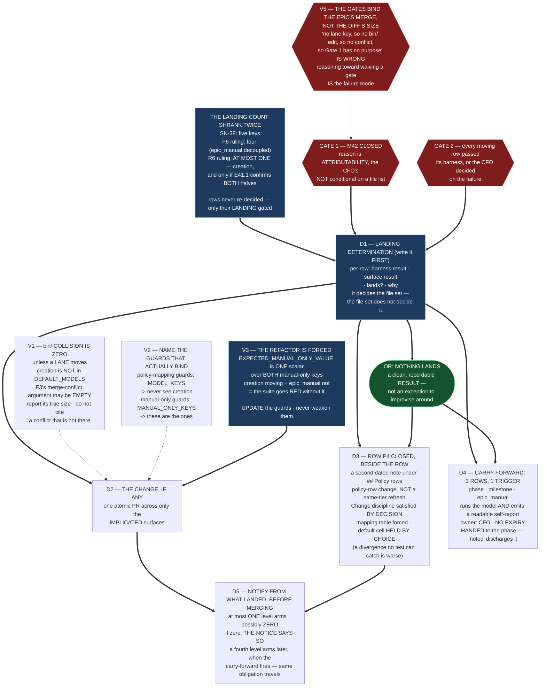

# Epic E41.5 — Terminal: Land What Cleared

## Context

**This is where every ruling in M41 converges, and the count of what it lands has shrunk twice.**

| Stage | What E41.5 was to land |
|---|---|
| As ruled (SN-38) | five keys |
| After the **F6 ruling** (2026-08-19) | **four** — `epic_manual` decoupled to a carry-forward |
| After the **R6 ruling** (2026-08-20) | **at most ONE verification target — `creation`, and only if E41.1 confirms both halves of the manual-surface rule** — plus `epic_dev`/`epic_qa` only if E41.3's evidence moved them |

**The rows were never re-decided. Only their landing was gated**, and gated on a **fact about
surfaces**, not a judgment about models.

**So this epic may land one key, two, three — or none.** The P12 Phase Chat has ruled the last of
those a **clean, recordable result**: *a terminal epic that lands nothing, and says exactly why, is a
successful terminal epic.* This spec is written so that outcome is a first-class path with its own
deliverables, not an exception to improvise around.

**What this epic always does, whatever lands:** it records **decisions** — row P4 closed by CFO
ruling, the three-row carry-forward handed to the phase, and the distinction between *a decision
made* and *a value configured* kept visible in the corpus.

---

## Problem Statement

**A terminal epic is where a milestone's carefully separated results get flattened into one edit, and
three specific flattenings are available here.**

1. **Landing a value because a decision exists.** The CFO ruled five rows. Under R6, most of them
   **cannot be configured yet**. Writing them anyway — because they are "decided" — is precisely what
   the fail-closed rule forbids, and it would halt the levels that must execute M43–M47.
2. **Announcing what was ruled instead of what landed.** The DoD's notification obligation has
   shrunk with the landing count — five levels arming, then three, now **at most one and possibly
   zero**. An announcement written from the ruling rather than from the diff would tell every level
   it is armed when none is.
3. **Discharging a carry-forward by mentioning it.** `phase`, `milestone` and `epic_manual` are **one
   CFO-owned carry-forward under one trigger, with no expiry.** A closure declaration that lists them
   as *"noted"* discharges nothing and loses the trigger.

And one mechanical trap, new as of this spec's measurements: **the epic may cite a merge conflict
that does not exist** (V1), and **may cite guards that do not bind the key it actually changes**
(V2).

---

## ⚠ Planning-time findings — measured for this spec, not inherited

**Measured by the M41 Milestone Chat on 2026-08-20, on `milestone/M41` at `4d442ad`**, by reading the
guard file, the orchestrator and the policy. **G2 is binding, and F3 is where it bites**: F3 was
written when five keys were landing, HQ annotated it once, and **R6 changed the landing set again
without anyone re-deriving the file list.**

### V1 — **Under R6, the `bin/` collision with M42 is ZERO unless a lane moves**

F3 named five files and said `bin/ai-project-orchestrator` was one, giving Gate 1 a **mechanical**
reason on top of its attributability reason. HQ annotated that down: of the five moving keys, only
`phase` and `milestone` appear in `DEFAULT_MODELS`.

**Re-measured at `bin/ai-project-orchestrator:23-29`, verbatim:**

```python
DEFAULT_MODELS = {
    "hq": "remote:claude-opus-5",
    "phase": "remote:claude-opus-5",
    "milestone": "remote:claude-opus-5",
    "epic_dev": "local:qwen3-coder:30b",
    "epic_qa": "local:qwen3-coder:30b"
}
```

**`creation` is not there.** Under R6, `phase` and `milestone` **do not land**. So:

> **If the only verification target that lands is `creation`, this epic does not touch `bin/` at
> all**, and **F3's merge-conflict argument is empty.** `bin/` is touched **only** if E41.3's
> evidence moves `epic_dev` or `epic_qa`.

**This does not weaken Gate 1 and this epic must not argue that it does.** Gate 1's stated reason is
**attributability** — *a model change landing with a lane repair makes the next failure
unattributable* — and that is the CFO's and HQ's, not conditional on a diff. **The mechanical
argument was a second reason, and it may be absent at execution time. Report the true size; do not
cite a conflict that is not there, and do not use its absence to argue about a gate.**

### V2 — **The three divergence guards do NOT all bind the key that actually lands**

The atomicity argument has been carried forward twice as *"the three divergence guards enforce it"*.
**Re-measured in `tests/test_model_config.py`** — and the guards partition by key kind:

| Guard | Parametrized over | Binds `creation`? |
|---|---|---|
| `test_policy_mapping_agrees_with_yml_block` (`:205`) | `MODEL_KEYS` | **no** |
| `test_policy_mapping_agrees_with_default_models` (`:222`) | `MODEL_KEYS` | **no** |
| `test_chat_hierarchy_manual_mapping_agrees_with_yml_block` (`:271`) | `MANUAL_ONLY_KEYS` | **yes** |
| `test_config_manual_only_key_matches_expected_value` (`:247`) | `MANUAL_ONLY_KEYS` | **yes** |

`MODEL_KEYS = ("hq", "phase", "milestone", "epic_dev", "epic_qa")`;
`MANUAL_ONLY_KEYS = ("creation", "epic_manual")`. The file says why in its own comment: the two
manual-only keys are *"deliberately outside MODEL_KEYS, DEFAULT_MODELS, and model-routing-policy.md's
own mapping table."*

> **So under R6 the guards that bind what this epic changes are a DIFFERENT PAIR from the ones the
> atomicity argument has been citing.** Name the guards that actually bind the keys you actually
> change. **An epic that cites `test_policy_mapping_agrees_with_yml_block` while landing `creation`
> is citing a test that never looks at it.**

### V3 — **Landing `creation` alone FORCES the test refactor, and the suite is the forcing function**

`EXPECTED_MANUAL_ONLY_VALUE = "remote:claude-opus-5"` (`:72`) is **one scalar**, and
`test_config_manual_only_key_matches_expected_value` (`:247`) is parametrized over **both**
manual-only keys against it.

> **So changing `creation` to fable-5 while `epic_manual` stays at `remote:claude-opus-5` makes that
> test FAIL for `creation`.** The per-key refactor is not bookkeeping that could be deferred — **the
> suite will not go green without it.**

This is the F6 ruling's consequential edit 3, now confirmed mechanically: the refactor was originally
needed because both manual-only keys moved to *different* values; **it is needed now because one
moves and one does not.** Same refactor, opposite cause, and **the shared scalar cannot hold both
either way.**

**The guards are updated to assert the new values with the same strictness. They are not weakened,
not parametrized away, and not skipped.** A guard relaxed to accommodate a change is the defect this
milestone exists to prevent, one layer down.

### V4 — **The file set, re-derived for each landing outcome**

| Surface | `creation` lands | a lane moves | nothing lands |
|---|---|---|---|
| `.ai-project.yml` | **yes** | **yes** | no |
| `tests/test_model_config.py` | **yes** — forced (V3) | **yes** — `EXPECTED_EPIC_DEV` | no |
| `governance/systems/chat-hierarchy.md` | **yes** — `creation`'s row + the stale one-paid-frontier-tier prose | no | no |
| `bin/ai-project-orchestrator` | **no** (V1) | **yes** | no |
| `model-routing-policy.md` mapping table | **no** — `creation` is deliberately not in it | **yes** | no |
| **`model-routing-policy.md` row P4 closure note** | **YES** | **YES** | **YES — this lands regardless** |

**The last row is the point.** Row P4's closure is a **recorded decision**, not a configured value,
and the Phase Chat's Decision 4 item 3 places it **beside the row** — a second dated note under
`## Policy rows`, following the file's own existing convention (`### Note on row P4 — Milestone ×
local inference, evaluated 2026-07-31, row unchanged`, at `:46`). **The mapping table and the row's
own `default` cell stay put:** the table because
`test_policy_mapping_agrees_with_yml_block` forces it, and **the cell by deliberate choice**, because
it sits **outside the guard's parse** — *a divergence no test can catch is worse than one that fails
a build.*

**So this epic is never empty.** Even in the nothing-lands outcome it records a CFO ruling, hands
over a carry-forward, and states why the decided values are not configured.

### V5 — **Both gates bind the EPIC's merge, not the diff's size**

Gate 1 (M42 closed) and Gate 2 (every moving row passed its harness or was escalated to the CFO and
returned) are stated on **this epic**. **Neither becomes waivable because the diff turned out small,
and neither is satisfied vacuously by landing nothing.**

**A plausible-sounding argument is available here and it is wrong:** *"we land no lane key, so there
is no `bin/` edit, so M42 cannot conflict, so Gate 1 has no purpose."* **Gate 1's purpose is
attributability, it is the CFO's and HQ's, and it is not conditional on a file list** (V1). **If this
epic finds itself reasoning toward waiving a gate, that is the failure mode, not an exemption** —
escalate instead.

---

## Goals

1. **Land exactly what cleared** — `creation` only if E41.1 confirmed **both halves**, and a lane
   only if E41.3's evidence moved it — **atomically, in one PR, past both gates.**
2. **Record row P4 as CLOSED by CFO ruling**, as a **policy-row change**, Change discipline satisfied
   **by decision and said so plainly** — **beside the row**, whether or not any value moves.
3. **Hand the three-row carry-forward to the phase** — `phase`, `milestone`, `epic_manual`, one
   trigger, CFO-owned, **no expiry** — **with its notification obligation travelling with it.**
4. **Notify from what LANDED**, before it lands — **including the case where the count is zero.**
5. **Keep *decision made* and *value configured* visibly distinct** everywhere both appear.

---

## Non-Goals

This Epic explicitly does **not**:

- **Land a decided row whose surface is unconfirmed.** That is the R6 rule and it is the whole reason
  this epic's count shrank.
- **Re-decide any row, harness assignment, bar, or gate.**
- **Re-run or re-interpret any measurement.** It consumes E41.3's and E41.4's conclusions as given.
- **Weaken, skip, or parametrize away a guard** to accommodate a change (V3).
- **Rewrite row P4's `default` cell or the policy mapping table** for a value that has not landed.
- **Discharge the carry-forward.** It is handed over, with trigger, owner and non-expiry intact.
- **Waive or reinterpret either gate** (V5).
- **Touch `epic_manual`'s `chat-hierarchy.md` row or its Basis text** — F6's consequential edit 2;
  the prose rewrite covers only keys that move.

---

## Scope of Work

### 1. Establish what cleared (D1)

Before any edit, a **landing determination** naming, per row:

- the harness result (E41.3 for the lanes, E41.4 for the verification targets);
- for verification targets, **E41.1's Part B result — both halves, or not confirmed**;
- **whether the row lands, and the one-line reason**;
- for every row that does **not** land, whether it is a **carry-forward** (R6's three) or a **hold**
  (a lane where no candidate cleared).

**This artifact exists even when nothing lands.** It is the epic's primary record.

### 2. The configuration change, if any (D2)

**One atomic PR across whichever of V4's surfaces the landing determination actually implicates.**

- **`.ai-project.yml`** — only rows that cleared. **`hq` unchanged.**
- **`tests/test_model_config.py`** — `EXPECTED_MANUAL_ONLY_VALUE` refactored **shared scalar → per-key
  expectation** (forced, V3), and `EXPECTED_EPIC_DEV` if a lane moved. **Updated with the same
  strictness, never weakened.**
- **`governance/systems/chat-hierarchy.md`** — the mapping row for each key that moves, **and the
  surrounding prose that currently explains all five values as one paid-frontier tier.** That
  explanation stops being true the moment any of them leaves it. **Rewrite it rather than leaving a
  stale rationale beside a changed value.** **`epic_manual`'s row and Basis text stay exactly as they
  are.**
- **`bin/ai-project-orchestrator`** — **only if a lane moved** (V1).
- **`model-routing-policy.md`** — mapping table **only if a lane moved**.

**Name the guards that actually bind the keys you changed** (V2), and show the suite green.

### 3. Row P4's closure, recorded beside the row (D3)

**Lands regardless of whether any value moves** (V4).

A **second dated note** under `## Policy rows`, following the file's existing `Note on row P4`
convention, recording:

- **closed by CFO ruling**, dated;
- **a policy-row change — explicitly NOT a same-tier refresh** under the 2026-07-28 precedent, which
  left the TIER rows untouched;
- **the Change discipline satisfied by CFO decision, and said so plainly** rather than by
  manufacturing a citation;
- **that the decided value is not configured**, why (the R6 manual-surface rule), and **what would
  change that** (the carry-forward's trigger);
- that the row's own `default` cell and the mapping table are **deliberately unchanged**, with the
  reason: the cell sits **outside the guard's parse**, and a divergence no test can catch is worse
  than one that fails a build.

### 4. The carry-forward, handed over (D4)

**One carry-forward, three rows — `phase`, `milestone`, `epic_manual` — under ONE trigger:**

> a surface exists that **runs that model** **and** **emits a self-report the E31.3 check can read.**
> **Both halves.**

Recorded with: **owner — the CFO**; **no expiry, explicitly not at P12's close**; F6's `epic_manual`
carry-forward **subsumed, not superseded**; the file set each row will touch when it fires; and **the
notification obligation, which travels with each row rather than being discharged here.**

**Handed to the phase.** A carry-forward listed as *"noted"* is discharged, and that is the failure.

### 5. Notification, written from what landed (D5)

**Before the merge.** Every level whose verification target's value changes **arms** — a chat opened
at that level on the old model **halts by design**, which is correct, protective, and a poor surprise.

- **Notify exactly the levels that arm**, which under R6 is **at most `creation`, and possibly none.**
- **If the count is zero, the notice says so.** **An announcement that covered nothing must not read
  like one that covered everything.**
- **Record the notification** — who, when, which levels, and the count.
- State that **a fourth level arms later**, when the carry-forward fires, **carrying this same
  obligation with it.**

---

## Deliverables

- [ ] **D1** — The landing determination: every row, its harness result, whether it lands, and why
- [ ] **D2** — The atomic configuration change across exactly the implicated surfaces, or a positive
      statement that no configuration change was implicated
- [ ] **D3** — Row P4's closure note, beside the row, **regardless of what landed**
- [ ] **D4** — The three-row carry-forward, handed to the phase with trigger, owner, non-expiry, file
      set and travelling notification obligation
- [ ] **D5** — The notification record, written from what landed, **including a zero count**
- [ ] Structural diagram (Mermaid, in-repo, no ComfyUI)
- [ ] **Epic Delivery Notice**

---

## Binding Constraints

1. **GATE 1 — M42 must be CLOSED**, and the epic's record cites the closing commit. **Not waivable
   here, and not satisfied by landing nothing** (V5).
2. **GATE 2 — every moving row has passed its harness, or has been escalated to the CFO and returned
   with his decision.** A row that failed and was not put in front of him may not land.
3. **The R6 manual-surface rule:** no manual verification target lands until a surface is confirmed
   to run that model **and** emit a readable self-report. **Both halves.**
4. **`hq` is unchanged**, and it is the only reason the HQ session that ruled this did not halt.
5. **`epic_manual` does not land here** — F6's decoupling, subsumed into R6's carry-forward.
6. **Row P4 is a POLICY-ROW change closing an item open since P10** — never filed as a same-tier
   refresh; Change discipline satisfied **by CFO decision, stated plainly**.
7. **Guards are updated, never weakened** (V3).
8. **The mapping table and row P4's `default` cell stay put** until the value lands — the table by
   force, the cell by choice.
9. **Notification precedes the merge**, and is written from **what landed**.
10. **`P11-GH-2`** — layer, time and scope on every claim, including *"the suite is green."*
11. **Every inventory is a floor** — including V4's surface table, which was re-derived once already
    and may need it again.

---

## Design Decisions Delegated — decide, document, proceed

1. **The landing determination's format**, provided every row appears with its result and reason.
2. **The exact wording of row P4's closure note**, within D3's required content.
3. **How `chat-hierarchy.md`'s one-paid-frontier-tier prose is rewritten** so it is true of whatever
   landed — including the case where **nothing** landed and the prose must say the values are ruled
   but not configured.
4. **The notification's channel and form**, provided it precedes the merge and is recorded.
5. **Where the landing determination and notification record live** in the repo.

---

## Definition of Done

Epic E41.5 is complete when:

- [ ] **M42 is closed and the record cites the closing commit**
- [ ] Every moving row cites its harness result, or the CFO's decision on a failing row
- [ ] **Every row that lands has its surface confirmed on both halves** (R6); every row that does not
      is recorded as carry-forward or hold, with its reason
- [ ] The configuration change is **one PR across exactly the implicated surfaces**, with the guards
      that actually bind the changed keys **named** (V2) and **updated, not weakened** (V3)
- [ ] **Row P4 recorded as closed by CFO ruling, as a policy-row change, Change discipline satisfied
      by decision and stated as such** — present **even if nothing landed**
- [ ] The three-row carry-forward is **handed to the phase** with trigger, owner, non-expiry and its
      travelling notification obligation — **not discharged**
- [ ] **Every level that arms was notified before the merge, and the notification is recorded** —
      **including a recorded count of zero**
- [ ] `chat-hierarchy.md`'s prose agrees with its own table after the edit
- [ ] **`decision made` and `value configured` are visibly distinct** everywhere both appear
- [ ] Suite green at the branch baseline plus any delta, **no skips introduced to route around the
      change**, with the invocation stated
- [ ] Delivery Notice committed; PR opened to `milestone/M41`

---

## Acceptance Criteria

- [ ] **M42 is closed, and the epic's record cites the closing commit**
- [ ] **Every moving row cites its harness result, or the CFO's decision on a failing row**
- [ ] **The implicated files change together in one PR**, carrying **only rows whose surface is
      confirmed**; the suite is green with no skips introduced to route around the change
- [ ] **Row P4 is recorded as closed by CFO ruling, as a policy-row change, Change discipline
      satisfied by decision and stated as such**
- [ ] **Every level that armed was notified before the merge, and the notification is recorded**
- [ ] **`chat-hierarchy.md`'s prose agrees with its own table after the edit**
- [ ] **A reader can determine, for each of the seven keys, what it holds, why, and what evidence
      moved it or held it — from committed artifacts alone**
- [ ] **The zero-landing outcome, if it occurs, reads as a result** — the record states what was
      ruled, what was measured, what is waiting on a surface, and what would change it

---

## Technical Constraints

**In scope:** whichever of V4's surfaces the landing determination implicates; the landing
determination, the row P4 note, the carry-forward record and the notification record.
**Do not touch:** the packets, rubric or runs under `local-review-backtest/`; E41.2's instrument;
`epic_manual`'s `chat-hierarchy.md` row and Basis text; **row P4's `default` cell**; the policy
mapping table unless a lane moved; anything under `~/soft-dev/drivr`.
**Invocation:** `PYTHONPATH=. pytest -q` — bare `pytest` fails collection.

---

## Dependencies

**Internal**
- **E41.1** — the resolved strings **and Part B's both-halves result**, which decides whether
  `creation` may land at all.
- **E41.3** — the two lane conclusions. **`epic_qa`'s verdict may still be withheld pending S5**; a
  withheld verdict is **not** a cleared row, and the row holds.
- **E41.4** — the four verification-target recommendations.
- **M42 CLOSED — Gate 1.** Not waivable.

**External / CFO-side**
- **The CFO's decision on any row that failed its harness** — Gate 2.
- **S5** — if unresolved, `epic_qa` cannot clear, and the row holds.
- **Surfaces for `phase`, `milestone`, `epic_manual`** — the carry-forward's trigger; **not a
  prerequisite of this epic**, which hands them over rather than waiting.

**Blockers**
- **Gate 1 and Gate 2, both unwaivable.**

---

## Timeline

**Estimated Effort:** 1 session once both gates are satisfied.
**Target Completion:** **whenever M42 closes.** M41 opens first and closes late by design.
**Actual Completion:** In progress.

---

## Execution Notes

**Order:**

1. **Verify Gate 1** — M42 closed, cite the commit. **Verify Gate 2** — every moving row's harness
   result or the CFO's decision in hand. **If either is unsatisfied, stop. Neither is waivable.**
2. **Write the landing determination first (D1).** It decides the file set; the file set does not
   decide it.
3. **Re-derive V4's surface table for the actual landing set.** It has been re-derived twice already
   and was wrong both times before someone looked.
4. **Row P4's note (D3) and the carry-forward (D4) — these land regardless.** Write them even if D2
   turns out empty.
5. **Notify (D5), then merge.** Not the reverse.
6. Run the suite, name the guards that bind what changed, and state the invocation.

**Traps:**

- **Citing a conflict that is not there** (V1) and **citing guards that do not bind your keys** (V2).
- **Reasoning toward waiving a gate because the diff is small** (V5). That is the failure mode.
- **Announcing what was ruled instead of what landed** (D5).
- **Listing a carry-forward as "noted"** — that discharges it.
- **Work in your own worktree; verify pushes at `origin`.**

---

## Related Documents

- [M41 Milestone Spec](P12-M41__milestone-spec.md) — v1.2.1; E41.5 deliverables 1 and 2, the DoD notification clause, Prerequisites
- `.ai-project/artifacts/rulings/2026-08-20__…__ruling__r6-manual-verification-surface-rule.md` — the manual-surface rule
- `.ai-project/artifacts/rulings/2026-08-19__…__ruling__m41-m42-acceptance-and-f6-escalation.md` — F6's decoupling, subsumed
- `.ai-project/artifacts/reference/token-measurement/model-routing-policy.md` — `## Policy rows`, the `Note on row P4` convention, Change discipline
- [E41.1](P12-M41-E41.1__spec__target-resolution-reachability-and-routability.md) · [E41.3](P12-M41-E41.3__spec__lane-candidates-against-the-baseline.md) · [E41.4](P12-M41-E41.4__spec__verification-target-back-test.md)

---

## Visual Bindings

**Visual binding**
- **Link:** (inline — Structural diagram; no hosted link needed per AOG §16.3/§16.5)
- **What:** diagram
- **Level:** Epic
- **State:** proposed



- **Description:** E41.5 after two rulings shrank it. The landing determination is written **first**
  and decides the file set, rather than the reverse; both gates bind the epic's **merge**, not its
  diff, and reasoning toward waiving one because the change turned out small is named as the failure
  mode (V5). Three mechanical findings correct arguments the milestone has been carrying: the `bin/`
  collision with M42 is **zero** unless a lane moves, because `creation` is not in `DEFAULT_MODELS`
  (V1); the guards that bind `creation` are the **manual-only** pair, not the policy-mapping pair the
  atomicity argument has been citing (V2); and landing `creation` alone **forces** the shared-scalar
  refactor, because one test asserts both manual-only keys against a single value — the suite is the
  forcing function, and the guards are updated rather than weakened (V3). Row P4's closure note and
  the three-row carry-forward land **regardless of what is configured**, which is what makes
  *nothing lands* a complete delivery rather than an empty one. Proposed-track Structural diagram
  (AOG §16.3/§16.6), Mermaid, no ComfyUI.

---

## Notes

- **On the shape of this epic after R6, stated so a reader does not mistake it for a retreat.** M41
  set out to land a ruled line-up and may land one key or none. **That is the fail-closed rule
  working, not the milestone failing.** The evidence was still collected — every row measured,
  including rows that cannot be configured — and the record will say, per key, what it holds, why,
  and what evidence moved it or held it. **The alternative was landing values that halt the levels
  which must execute M43–M47.**

- **On V1, and the discipline it demands.** Discovering that a cited conflict does not exist is
  pleasant and slightly dangerous: the same paragraph that removes a reason for a gate is one
  sentence away from arguing against the gate. **Gate 1's reason is attributability, it belongs to
  the CFO and HQ, and a smaller diff does not touch it.** The finding is recorded so the epic reports
  the true size — **not so it has an argument.**

- **On "decision made" versus "value configured", which this epic is the first to have to hold
  apart.** Until now those two collapsed: the corpus recorded a decision by making the edit. R6
  separates them, possibly for a long time. **Every artifact this epic writes must let a reader see
  both — what was ruled, and what is actually in the file — without inferring one from the other.**
  A reader who cannot tell the difference will eventually assume the file matches the ruling, which
  is exactly the divergence the guards exist to prevent.

- **On what M41 hands to its Closure Declaration.** Whatever lands, the milestone closes owning: two
  incumbents measured for the first time, `epic_dev`/`epic_qa` split apart and separately concluded,
  a successful-nothing instrument validated in both directions, a back-test extended to five more
  models under a stricter scoring control, one policy row closed, and **a carry-forward with a
  testable trigger and a named owner.** **The line-up's landing was gated on a fact nobody had
  checked** — and checking it is what this milestone was for.

---

## Changelog

| Version | Date | Change |
|---|---|---|
| 1.0.0 | 2026-08-20 | Initial E41.5 spec, from M41 spec v1.2.1 after the F6 and R6 rulings. **Five planning-time findings (V1–V5)**, measured on `milestone/M41` at `4d442ad` by reading `bin/ai-project-orchestrator:23-29`, `tests/test_model_config.py` and `model-routing-policy.md`. **V1 — under R6 the `bin/` collision with M42 is ZERO unless a lane moves**, because `creation` is not in `DEFAULT_MODELS`; F3's merge-conflict argument may be empty at execution time, and **Gate 1's attributability reason is untouched by that**. **V2 — the three divergence guards do not all bind the key that lands**: the policy-mapping guards are parametrized over `MODEL_KEYS` and never see `creation`; the guards that bind it are the `MANUAL_ONLY_KEYS` pair. **V3 — landing `creation` alone FORCES the shared-scalar refactor**, because one test asserts both manual-only keys against `EXPECTED_MANUAL_ONLY_VALUE`; the suite is the forcing function and the guards are updated, never weakened. **V4 — the surface set re-derived per landing outcome**, with row P4's closure note landing **regardless**, which is what makes *nothing lands* a complete delivery. **V5 — both gates bind the epic's merge, not the diff's size**, and reasoning toward waiving one because the change turned out small is named as the failure mode. Written so the **zero-landing outcome is a first-class recordable result** with its own deliverables, per the P12 Phase Chat's direction. |
