# Milestone M41 — The Model Line-Up and Its Evidence

## Purpose

The CFO ruled the target per-level model line-up on 2026-08-19 (SN-38) and directed that **its
evidence be collected first**, as an early step of P12 — his call to make, made after the phase
opened. This milestone collects that evidence, and then lands the line-up.

**It measures before it lands, and the two halves are separated by a gate.** Four of the five moving
rows must pass a harness before they are configured; the fifth (`hq`) does not move. `epic_dev` and
`epic_qa` are measured **separately for the first time** — they hold the same string today, and the
record treats them oppositely.

This milestone ensures:

- Every row of the ruled line-up that moves has a **recorded measurement against its incumbent**
  before it is configured, on the harness appropriate to what that key actually is.
- `epic_dev` and `epic_qa` stop being one question — the string that hid a mergeable-work result
  behind a fabrication is split.
- The configuration change lands **once, atomically, after M42 closes**, with every level notified
  before it does.

---

## Problem Statement

`model-routing-policy.md` carries a **Change discipline** requiring new cited evidence for any
policy-row change. It is a prose obligation an agent reads and chooses to honour. The CFO's ruling
moves five keys, one of them across a tier boundary, and the evidence that would satisfy that
discipline does not exist for any of them.

Worse, the evidence that *does* exist has been misread by the project itself. **`qwen3-coder:30b` has
never been compared against any 27b.** E33.2 compared the **14b** against the 30b. E35.5's
`PASS 4/5, one SPLIT, zero false alarms` over ten runs belongs to **`qwen3.6:27b`**, chosen
deliberately because Stage-2 review is general reasoning and the 30b is coder-tuned. **The only
milestone-level judgment result this project owns belongs to a 27b, not to the model currently
configured.**

Without this milestone, five keys move on public capability claims. **Capability is not the axis
that has failed here.** The 14b emitted a well-formed JSON plan and changed nothing; E39.3's
dispatches returned `VERDICT: PASS` with zero tool rounds, citing a configuration key the file does
not contain. Both read as competent. Both failed at **agentic discipline** — actually calling tools,
actually touching files — which is orthogonal to reasoning quality.

---

## ⚠ Findings measured at planning time — six, and they reshape the epic set

**Measured by the Phase Chat on `master` at `9ee810e`, 2026-08-19**, applying G2 (*the reviewer
re-measures*). None of these reverses a decision; each changes what the work is. Verification
boundary per `P11-GH-2` is stated with each.

### F1 — `opencode.json` is not in this repository, and **both** 27b models are absent from it

SN-38 and the phase spec both record that `qwen3.6:27b` *"is present in Ollama but declared nowhere
in `opencode.json`"*, and place the config addition in M41. Both are correct. Two things are not
stated and change the shape of the work:

1. **The file is at `~/.config/opencode/opencode.json` — host-level, user-level, outside any
   repository or mount.** This was established in P11-M38-E38.2 (Finding 3) and re-verified today:
   there is **no `opencode.json` anywhere in this repository.** So "add the model to `opencode.json`"
   is **not a committable change**. It is a host mutation, and the only way it enters the record is
   as a committed **reference artifact** carrying the resulting content and the date it was applied.
2. **`qwen3.8:27b` is absent from it too.** The live file declares exactly four Ollama models:
   `qwen3-coder:30b`, `qwen2.5-coder:14b`, `qwen2.5-coder:7b`, `llama3.1:8b`. **Neither 27b is
   routable through the execution adapter today** — and `qwen3.8:27b` is the ruled `epic_manual`
   target. The addition is **two models, not one.**

*Verified by reading the live host file and by `find / -name opencode.json`, host, 2026-08-19.*

### F2 — E35.5's back-test is packets and a rubric, **not a runnable harness**, and it has no transport to the remote three

The phase spec, the starter and the opening ruling all say the instrument *"already exists — do not
rebuild it."* **That is correct and this finding does not contradict it.** The expensive parts —
five blinded packets built from pre-fix material, a **pre-registered** rubric committed before any
run, known ground truth, and a documented blinding audit — all exist at
`.ai-project/artifacts/reference/local-review-backtest/`.

**What does not exist is a runner.** That directory's own README states it plainly:

> *"This is not a tool. There is no harness, framework or CLI here — one-off packets, a frozen
> rubric, and captured outputs, committed as evidence."*

Two consequences the scoping did not carry:

- **The documented reproduction recipe is Ollama-only** — a five-line `POST` to
  `http://localhost:11434/api/generate`. **Three of the four verification targets that move are
  remote models from three different vendors.** The packets and the rubric transfer to them
  unchanged; **the invocation path does not exist.** Building one is M41's work and is *not* a
  rebuild of the instrument.
- **Scoring is human judgment against the frozen rubric**, recorded in `scores.md` with the quoted
  model text that earned each catch, miss and false alarm. Ten runs was one model. The measurement
  set below is five more.

*Verified by reading `README.md`, `rubric.md` and `runs/` in that directory, repo, 2026-08-19.*

### F3 — The terminal epic touches **five** files, and **three** divergence guards enforce it atomically

The ruling and the starter name two: `.ai-project.yml` and `model-routing-policy.md`. The suite
requires three more. `tests/test_model_config.py` binds:

| File | What it holds | Guard |
|---|---|---|
| `.ai-project.yml` | all seven `models:` keys | — |
| `.ai-project/artifacts/reference/token-measurement/model-routing-policy.md` | mapping table (5 keys) **+ row P4** | `test_policy_mapping_agrees_with_yml_block` |
| `bin/ai-project-orchestrator` | `DEFAULT_MODELS` (5 keys, `:23-29`) | `test_policy_mapping_agrees_with_default_models`, `test_default_models_agrees_with_config_for_every_key` |
| `governance/systems/chat-hierarchy.md` | "The mapping" table (5 manual-verification keys) | `test_chat_hierarchy_manual_mapping_agrees_with_yml_block` |
| `tests/test_model_config.py` | `EXPECTED_MANUAL_ONLY_VALUE`, `EXPECTED_EPIC_DEV` | the constants themselves |

**Two of these are more than value edits.** `EXPECTED_MANUAL_ONLY_VALUE` is a **single scalar shared
by both manual-only keys**; under the ruled line-up `creation` becomes fable-5 and `epic_manual`
becomes `local:qwen3.8:27b`, so the constant must become a per-key mapping — a test refactor, not a
string change. And **`bin/ai-project-orchestrator` is a file M42 edits** (defects 1 and 2 both live
in it).

**This mechanically corroborates HQ's decision to make the landing one epic**, and it adds a second
reason for the M42 gate beyond attributability: **a merge conflict in `bin/`.**

> **Annotation — HQ, 2026-08-19: F3 overstates its own collision surface.** Of the five moving keys,
> **only `phase` and `milestone` appear in `DEFAULT_MODELS`.** `creation` and `epic_manual` are not
> in it at all — `bin/ai-project-orchestrator:23-29` holds `hq`, `phase`, `milestone`, `epic_dev`,
> `epic_qa`. **E41.5's collision with M42 in `bin/` is two keys, not five.**
>
> **The atomicity argument is unaffected** — it stands on the three divergence guards, and every key
> those guards compare across files is still in E41.5's set. **The merge-conflict argument is
> smaller than F3 implied**, and is recorded at its true size rather than left to be discovered.

*Verified by reading `tests/test_model_config.py` (285 lines, all guards), `bin/ai-project-orchestrator:23-29`, `governance/systems/chat-hierarchy.md:261-267`, and `model-routing-policy.md:76-80`, repo, 2026-08-19.*

### F4 — There are **two** incumbents, and the second has never been measured either

The bar is **relative to the incumbent**. The scoping names one incumbent — `qwen3-coder:30b` — and
that is right for the two lanes. **For the four verification targets the incumbent is
`remote:claude-opus-5`**, and it has never been run against E35.5's back-test.

**Without a `claude-opus-5` baseline, the relative bar has no meaning on `creation`, `phase`,
`milestone` or `epic_manual`** — "no worse on every objective check and strictly better on at least
one" has nothing to be no-worse-than. Measuring it is not optional; it is what makes those four rows
decidable at all.

This adds one model to the back-test set. It does not add a sixth epic.

### F5 — The line-up is ruled in **product names**; `.ai-project.yml` needs **routable identifiers**

`.ai-project.yml` values have the shape `remote:claude-opus-5` / `local:qwen3-coder:30b` — a locality
prefix and an exact model ID that a harness or an adapter resolves. **Three of the five target values
are written as product names, not IDs:** *fable-5*, *GPT-5.6 Sol*, *Deepseek V4 Flash*.

**Resolving each to the exact string that will be written into the config, and confirming that string
answers, is M41 work.** It is prior to measurement: a model that cannot be named cannot be measured,
and a measurement taken against a different build than the one configured is worthless.

*Partial evidence, recorded honestly:* a model line named **Fable 5** with the exact ID
`claude-fable-5` exists in this Phase Chat's own harness roster. That is **suggestive, not
confirmation** — the harness roster is not the routing surface, and the CFO's *"fable-5"* has not
been confirmed to mean it. E41.1 confirms; it does not assume.

### F6 — `epic_manual → local:` makes manual Epic chats **unopenable on the current surface**

`chat-hierarchy.md`'s Manual Chat Model Verification is **"Mismatch: refuse, unconditionally"** —
*"no continuation, no 'proceeding with caution'."* `epic_manual`'s ruled target is
`local:qwen3.8:27b`. **Claude Code self-reports `claude-opus-5`.** So the moment the edit lands,
**every manual Epic chat opened in this harness halts by design**, and manual Epic chats have no
surface until one exists that runs `qwen3.8:27b` *and* self-reports an identity a chat can read.

**This is a consequence of a ruled decision, not a challenge to it.** The row is the CFO's and is not
re-decidable here. But it is materially larger than *"a poor surprise"*: it is the first `local:`
value ever placed on a manual-chat verification target, and it removes a working surface rather than
changing which model answers on it.

**It was escalated, not absorbed — and it has been RULED.**

> **RESOLVED — HQ Ruling, 2026-08-19**
> `.ai-project/artifacts/rulings/2026-08-19__ai-project-system-hq__ruling__m41-m42-acceptance-and-f6-escalation.md`
>
> **HQ sharpened the escalation before answering it, and the sharpening is the important half:** the
> consequence is not *"manual Epic chats have no surface"* in the abstract — **it is P12's own
> remaining work.** M43, M44, M45, M46 and M47 all run manual Epic chats. **A terminal epic that
> disables the execution of the four milestones after it is not a scheduling detail.**
>
> **The row is NOT re-decided. `epic_manual` still goes to `local:qwen3.8:27b`. Only the timing
> changed.**
>
> - **E41.5 lands four keys** — `creation`, `phase`, `milestone`, plus `epic_dev`/`epic_qa` only if
>   E41.3's evidence moved them. **`epic_manual` is excluded from E41.5.**
> - **`epic_manual` becomes a gated carry-forward with a named, testable trigger:** a surface exists
>   that **runs `qwen3.8:27b`** *and* **self-reports a model identity the E31.3 check can read.**
>   **Both halves are required** — a surface that runs the model but reports nothing fails the check
>   just as surely as one reporting `claude-opus-5`. **Owner: the CFO** (a tooling question about his
>   own environment, not a governance question).
> - **It does not expire at P12's close.** Riding it to closure would halt **P13's** manual Epic
>   chats instead — the same defect, one phase later. **Decoupling buys time; it does not remove the
>   dependency.**
> - **`E41.4 still back-tests `qwen3.8:27b`.`** The measurement obligation is untouched — collect the
>   evidence now, land the row later. That is the CFO's collect-early direction and this ruling does
>   not disturb it.
>
> **HQ reversed its own Decision 17 here and said so, having verified the trade rather than asserting
> it:** `epic_manual` has **no `DEFAULT_MODELS` entry**, so its later landing touches three files —
> `.ai-project.yml`, `chat-hierarchy.md`, `tests/test_model_config.py` — **no `bin/`, no M42
> conflict**, and the divergence guards stay green throughout **because there is nothing for
> `epic_manual` to diverge from.** The property that actually mattered — *never leaving two files
> disagreeing* — survives intact.

---

## Binding Constraints (settled — NOT for re-debate)

These are the CFO's and HQ's. This milestone executes them; it does not re-open them.

1. **The line-up itself is ruled** (SN-38). Not re-decidable at any level below the CFO.
2. **`milestone → Deepseek V4 Flash` is a POLICY-ROW CHANGE** that **closes `model-routing-policy.md`
   row P4**. It **must not be filed as a same-tier refresh** — the 2026-07-28 precedent covers vendor
   moves within a tier and explicitly left the TIER rows untouched. **The Change discipline is
   satisfied by CFO decision, and the artifact must say so plainly** rather than manufacturing a
   citation (Decision 15).
3. **`creation → fable-5` and `phase → GPT-5.6 Sol` are same-tier mapping edits.** TIER rows
   untouched, no new evidence obligation for the *tier*; the qualification harness still applies to
   the *models* (Decision 16).
4. **SN-37's gate binds manual-chat verification targets as well as dispatch lanes** (CFO ruling,
   SN-38). The lanes-only proposal is **superseded**.
5. **Two harnesses, because the checks do not transfer.**

   | Kind | Keys | Qualified by detecting | Instrument |
   |---|---|---|---|
   | Agentic dispatch lane | `epic_dev`, `epic_qa` | **successful nothing** — tool rounds > 0, files changed > 0, claims resolving against files that exist | **To be built** (minimal here; formalized M46) |
   | Manual verification target | `creation`, `phase`, `milestone`, `epic_manual` | **failed judgment** — planted defects, catches vs false alarms | **Exists** — E35.5's packets + frozen rubric (see F2 on the transport) |

   **The harness is chosen by the key's kind, not by the model.** `qwen3.6:27b` competing for
   `epic_qa` is qualified by the *successful-nothing* harness, notwithstanding that its reputation
   comes from the back-test. `qwen3.8:27b` competing for `epic_manual` is qualified by the
   *back-test*, notwithstanding that it is local.
6. **The bar is RELATIVE and OBJECTIVE**: no worse than the incumbent on every objective check and
   strictly better on at least one, over an **absolute floor of tool rounds > 0 and files changed
   > 0**. **No subjective quality score** — judgment is precisely what cannot be trusted from the
   thing under test.
7. **`epic_dev` and `epic_qa` are measured SEPARATELY**, and the incumbent is measured to set the
   baseline.
8. **NO MODEL SWAP LANDS UNTIL M42 CLOSES.** M42 repairs the code the lane runs through; a model
   change landing with a lane repair makes the next failure unattributable.
9. **A row that fails its harness ESCALATES TO THE CFO.** HQ has already decided this (Decision 15).
   **Do not land it anyway. Do not drop it.** The gate is the CFO's own instrument, built at his
   direction — *"an instrument whose adverse result is discarded is not an instrument"* — but a gate
   does not overrule the person who commissioned it. **The result goes in front of him and he
   decides; what may not happen is the row landing silently or being dropped silently.**
10. **The model CHECK and the qualification GATE are different mechanisms.** The check
    (P9-M31-E31.3) verifies the *running* model matches the *declared* one. The gate verifies the
    *declared* model is *fit*. **Both fail closed; a pass on either is not a pass on the other.**
11. **The configuration change this milestone authorizes is exactly the seven keys in SN-38's table
    and nothing else.** The per-level **MODE** mapping remains the CFO's and is untouched here.

---

## Hard Constraint (binding — carries to every Epic)

**Every number in this milestone is measured, and every measurement is reported.**

- **No best-of-N.** Two runs per packet per model, both scored, following E35.5's own protocol.
  A run that fails mechanically (truncation, transport error) is committed and excluded with its
  reason stated, exactly as E35.5 handled its truncated and superseded runs.
- **The bar is committed before the run it judges.** The relative bar's shape is already ruled; each
  epic commits the concrete objective checks it will apply *before* executing against them. A
  threshold chosen after seeing the data reproduces the failure this gate exists to prevent.
- **State the layer, time and scope of every claim** (`P11-GH-2`). A model verified reachable from
  this host is not thereby verified reachable from the sandbox, and a model measured on the back-test
  is not thereby measured on a lane.
- **An absence is only evidence when the thing that would have created it actually ran.** *"Zero tool
  rounds"* is a finding only if tools were genuinely advertised — E39.3's value comes precisely from
  having confirmed they were.
- **This corpus defeats naive pattern-matching.** `\b` is unusable against the `__` filename
  convention; `--include='*.py'` skips every `bin/` entry point. **Falsify a pattern before trusting
  a zero result.**

---

## Planned Epics

Five epics. **E41.1 is a hard gate on everything else**; E41.2 precedes E41.3 (a baseline before its
candidates); E41.4 is parallel with E41.2/E41.3 once E41.1 lands; **E41.5 is terminal and gated on
M42's closure.**

### Confirmed Epics

- **E41.1** — Target resolution, reachability, and routability *(first — hard gate)*
- **E41.2** — The successful-nothing instrument, and the lane incumbent's baseline
- **E41.3** — Lane candidates measured against the baseline
- **E41.4** — Verification-target back-test: the `claude-opus-5` baseline and four candidates
- **E41.5** — Terminal: land the line-up *(gated on M42 closure)*

**Execution posture for every epic in this milestone: `manual` / paid frontier**, on the models
declared **today** (`remote:claude-opus-5`). **The milestone's own subject is which models to run;
running it on the candidates it is measuring would be circular.** Every Epic Execution Chat Starter
records `Execution Mode: manual` and `models.epic_manual` at its currently-declared value.

---

## Epic Detail

### E41.1 — Target resolution, reachability, and routability *(first — hard gate)*

**Nothing in this milestone can be measured until every target has an exact name and answers to it.**

**Deliverables**

1. **A resolution table** mapping each of the seven `models:` keys' target from the ruled product
   name to **the exact string that will be written into `.ai-project.yml`**, with its locality
   prefix — `remote:<id>` or `local:<id>`. Covers F5's three unresolved names: *fable-5*,
   *GPT-5.6 Sol*, *Deepseek V4 Flash*. Record how each was resolved; **do not infer an ID from a
   product name.**
2. **A reachability record** for each target, dated, stating the layer it was checked from
   (`P11-GH-2`):
   - **Three local models re-confirmed at run time** against the Ollama tags endpoint —
     `qwen3.8:27b`, `qwen3.6:27b`, `qwen3-coder:30b`. **Do not inherit HQ's 2026-08-19 figures or
     this spec's**; the milestone spec's own numbers are a planning input, not the run's evidence.
   - **Three remote targets confirmed reachable** — each answering a trivial request. **HQ verified
     local models only; the remote three are unverified and are a CFO-side dependency.**
3. **Both 27b models added to `~/.config/opencode/opencode.json`** (F1) — `qwen3.6:27b` and
   `qwen3.8:27b`, with `tool_call` and a `limit.context` derived the way E38.2 established: from
   what is **actually loaded**, never from `/api/show`'s trained maximum. The `qwen3-coder:30b`
   entry's declared `262144` against `32768` loaded is the recorded **8× overpack** — do not
   reproduce that shape for the new entries.
4. **A committed reference artifact carrying the resulting `opencode.json` content and the date
   applied**, under `.ai-project/artifacts/reference/`. **The live file is outside the repository and
   cannot be version-controlled; the record is the artifact.** State that boundary in the artifact
   itself.
5. **An escalation** for any target that cannot be resolved or does not answer. **Escalate; do not
   substitute a reachable model for an unreachable one** — that is the manufactured-substitute
   pattern `P12-GH-2` files one tier down.

**Acceptance criteria**

- [ ] Every moving key has an exact `<locality>:<id>` string recorded, and none is a product name
- [ ] Every target has a dated reachability result with its check layer stated
- [ ] Both 27b models are declared in the host `opencode.json` and the file's content is committed as
      a reference artifact with its out-of-repo boundary stated
- [ ] Any unreachable or unresolvable target is escalated, and no substitute is chosen locally

---

### E41.2 — The successful-nothing instrument, and the lane incumbent's baseline

**Build the minimal instrument, prove it catches what this project has already suffered, then
measure the incumbent.**

**Deliverables**

1. **A minimal successful-nothing instrument** over a dispatched run, recording at least:
   **tool rounds**, **files changed**, and **claims resolving against files that exist**. Minimal is
   the instruction — **M46 formalizes the gate**; this is the measuring device M41 needs, not the
   gate.
2. **Instrument validation against both recorded historical failures**, replayed:
   - **E33.2's 14b** — *exit 0, 0 tool rounds, 0 files changed.*
   - **E39.3's `epic_qa` dispatch** — *`VERDICT: PASS`, zero tool rounds, citing a top-level key the
     file does not contain, with read-only tools genuinely advertised.*
   **Both pass any subjective read. They fail only on counts.** An instrument that cannot flag them
   is not qualified to measure anything, and this check is what makes the rest of the milestone's
   numbers worth having. *(HQ places this acceptance requirement on M46's formalized gate; it is
   applied here because M41 is where the instrument is first relied upon.)*
3. **The committed objective-check list and the floor**, before any candidate runs.
4. **The incumbent `qwen3-coder:30b` measured on BOTH tasks, separately** — an `epic_dev`-shaped
   implementation task and an `epic_qa`-shaped judgment task. **Two baselines, not one**, because
   the two keys are two questions (Binding Constraint 7).
5. **A statement of what the dispatch path was** — engine, endpoint, sandbox or host — recorded per
   `P11-GH-2`. An engine now resolves in the sandbox on the reverse endpoint shape from B2.1; that is
   the phase's most fragile assumption and this run either confirms or falsifies it.

**Safe to run now, and the reason is recorded rather than assumed:** a qualification run dispatches
through the agentic lane and **M42 is repairing that lane**, but **Docker is present on this host**
(`Docker version 29.6.1`, verified 2026-08-19), so `bin/ai-project-orchestrator:392-397`'s
unsandboxed fallback will not fire. **The dependency is real and non-blocking** — which is a
different thing from absent. **If Docker becomes unavailable mid-milestone, stop and escalate**;
do not let the run take the fallback path M42 exists to close.

**Acceptance criteria**

- [ ] The instrument flags E33.2's and E39.3's runs as failures when replayed, with the counts shown
- [ ] The objective checks and the floor are committed before any candidate run
- [ ] Separate `epic_dev` and `epic_qa` baselines for `qwen3-coder:30b` are recorded with raw counts
- [ ] The dispatch path is stated with its layer and date

---

### E41.3 — Lane candidates measured against the baseline

**Deliverables**

1. **`qwen3.6:27b` and `qwen3.8:27b` measured on both lane tasks**, against E41.2's baselines, on the
   instrument and the bar E41.2 committed.
2. **A per-row recommendation with the relative bar applied explicitly** — for `epic_dev` and for
   `epic_qa` separately, each stating *no worse on every check* and *strictly better on at least
   one*, or stating that no candidate cleared.
3. **The record's split honoured in the reasoning.** `epic_dev` owns the project's **only
   mergeable-work evidence** (E33.2 Run B, E33.4); `epic_qa` owns its **only recorded fabrication**
   (E39.3). For `epic_dev` the run is **discovery** — nothing in public claims justifies disturbing
   the one row that works, and a candidate must earn it. For `epic_qa` it is **confirmation**: the
   incumbent has a recorded failure at exactly this task.
4. **An escalation if no candidate clears the bar on a row.** The row holds its current value and the
   result goes to the CFO. Holding is the correct outcome, not a failure of the milestone.

**What tempers this, and must be stated so nobody over-corrects:** E39.1's binding decision is that
**no model-generated judgment may be load-bearing.** Today the QA model's verdict corroborates; it
does not authorize. A weak `epic_qa` model cannot by itself break anything. **The row matters because
M45 exists to make that judgment trustworthy** — the choice is about which model M45 builds on, not
about a live wound. That is a reason to measure carefully rather than to hurry.

**Acceptance criteria**

- [ ] Both candidates measured on both tasks, all runs reported, no best-of-N
- [ ] Per-row recommendation states the relative bar's two conditions explicitly, or states that no
      candidate cleared
- [ ] `epic_dev` and `epic_qa` are reasoned about separately and reach independent conclusions

---

### E41.4 — Verification-target back-test: the `claude-opus-5` baseline and four candidates

**Use E35.5's instrument. Do not rebuild it. Build only the transport it lacks** (F2).

**Deliverables**

1. **A transport for remote vendors** carrying each packet's prompt — *exactly the bytes after the
   `<!-- PROMPT-BEGIN -->` line*, the audit header never sent — to the three remote targets and
   capturing the response verbatim. The existing Ollama recipe covers `qwen3.8:27b` unchanged.
   **The packets, the rubric, the blinding and the ground truth are reused untouched.** Changing a
   packet invalidates every prior result including E35.5's own.
2. **`remote:claude-opus-5` measured** — the incumbent for all four verification targets, and
   **never measured** (F4). Without it the relative bar has no baseline on these rows.
3. **Four candidates measured** — fable-5, GPT-5.6 Sol, Deepseek V4 Flash, `qwen3.8:27b`.
4. **`qwen3.6:27b`'s ten existing runs reused as-is** — same packets, same rubric, already scored
   (`PASS 4/5, one SPLIT, zero false alarms`). Do not re-run them; cite them.
5. **Scores per model** in E35.5's own form: catch / miss / false alarm per defect, **with the quoted
   model text that earned each**, plus a full inventory of every run made.
6. **A per-row recommendation** for `creation`, `phase`, `milestone` and `epic_manual`, each applying
   the relative bar against the `claude-opus-5` baseline.

**Protocol, inherited and binding:** two runs per packet, both scored, no best-of-N; every run
committed including mechanical failures, with the reason stated; the rubric is frozen and is **not**
re-tuned mid-set.

**The highest-risk row is `milestone`, and this epic is the reason it is decidable.** Milestone holds
**Stage-2 accept authority** — the stated reason row P4 reads paid frontier, *"the level whose errors
propagate into merges"* — and the move is to a Flash tier on public capability claims. **E35.5's
back-test was built to measure milestone-level judgment.** The CFO's two rulings compose: the wider
gate scope supplies exactly the evidence the row P4 decision otherwise lacked.

**Read E35.5's own `judgment.md` before scoring.** It records **six arguments against over-reading
its PASS**, and E38.5 instructs readers not to lean on it. Those cautions apply to every result
produced here.

**Acceptance criteria**

- [ ] The transport sends the packet prompt byte-for-byte and never the audit header; blinding
      re-verified with the packets' own mechanical check
- [ ] A `claude-opus-5` baseline exists for all five packets
- [ ] Four candidates scored; `qwen3.6:27b` cited from its existing runs rather than re-run
- [ ] Every run committed, including mechanical failures, with reasons
- [ ] Per-row recommendations apply the relative bar against the baseline, or state that a row failed

---

### E41.5 — Terminal: land the line-up *(gated on M42 closure)*

**TWO GATES. Both must be satisfied before this epic's PR may merge.**

> **Gate 1 — M42 must be CLOSED.** No model swap lands until the fail-closed milestone closes. M42
> repairs the code the lane runs through, and a model change landing with a lane repair **makes the
> next failure unattributable.** There is also a mechanical reason (F3): this epic edits
> `bin/ai-project-orchestrator`, which M42 also edits.
>
> **Gate 2 — every moving row has passed its harness, or has been escalated to the CFO and
> returned with his decision.** A row that failed and was not put in front of him may not land.

**Deliverables — FOUR keys across five files, one atomic change** (F3, as annotated):

1. **`.ai-project.yml`** — the `models:` block. **Of the five manual verification targets, at most
   ONE lands here: `creation`, and only if E41.1 confirms BOTH halves of the manual-surface rule.**
   `epic_dev`/`epic_qa` land only if E41.3's evidence moved them — **they are dispatch lanes, out of
   the rule's scope, and governed by E41.3's evidence alone.** `hq` unchanged.

   > **THE MANUAL-SURFACE RULE — HQ Ruling 2026-08-20 (R6), binding on this epic**
   > `.ai-project/artifacts/rulings/2026-08-20__ai-project-system-hq__ruling__r6-manual-verification-surface-rule.md`
   >
   > **No `.ai-project.yml` manual verification target may land a new value until a surface for it is
   > confirmed to (a) run that model AND (b) emit a self-report the E31.3 check can read.** Both
   > halves. **Scope: `creation`, `hq`, `phase`, `milestone`, `epic_manual`. Explicitly NOT
   > `epic_dev`/`epic_qa`.**
   >
   > | Key | Disposition at E41.5 |
   > |---|---|
   > | `creation` → fable-5 | **Lands IF E41.1 confirms.** `claude-fable-5` in this harness's roster is **suggestive, not confirmation** |
   > | `phase` → GPT-5.6 Sol | **Carry-forward** — no surface identified |
   > | `milestone` → Deepseek V4 Flash | **Carry-forward** — no surface identified |
   > | `epic_manual` → `local:qwen3.8:27b` | **Carry-forward** — F6's, now **subsumed** under this rule, not superseded |
   >
   > **One trigger covering three rows**, instead of three triggers discovered one at a time. Owner:
   > the **CFO**. **No expiry, explicitly not at P12's close.** **The row values are not
   > re-decided** — only the landing is gated, and it is gated on **a fact about surfaces, not a
   > judgment about models.**
2. **`model-routing-policy.md`** — **and how it records a decided row whose value cannot land is a
   design decision this milestone owns** (HQ Ruling 2026-08-20, Decision 4 item 3). **Decided here,
   with the reasoning, so E41.5 executes rather than re-derives it.**

   **The problem.** The CFO **closed row P4** on 2026-08-19 — `milestone → Deepseek V4 Flash`, a
   **policy-row change**, Change discipline satisfied **by decision**. That closure stands. But under
   the manual-surface rule the **value cannot be configured**, perhaps for a long time. So the policy
   must record **a decision that is made** and **a configuration that has not changed** — two
   different facts about one row.

   **The binding constraint, which is not this milestone's to trade away:** the three divergence
   guards in `tests/test_model_config.py` **stay green and are NOT weakened.**

   **THE DECISION — record the closure beside the row; do not move the row or the mapping table.**

   a. **`## Mapping to \`.ai-project.yml\`` — `milestone` stays at `remote:claude-opus-5`.** This is
      forced, not chosen: `test_policy_mapping_agrees_with_yml_block` compares that table against
      `.ai-project.yml` for all five `MODEL_KEYS`. **Moving it ahead of the config fails the suite.**
   b. **Row P4's `default` cell stays `Paid frontier`.** This is the *chosen* half and it is the one
      worth reasoning about. That cell is **outside** the guard's parse — the guard reads only
      between the `## Mapping to …` heading and the next `##`, so nothing mechanical would stop the
      tier being rewritten now. **That is exactly why it must not be.** A tier asserted in the policy
      while a different tier is configured is a divergence **no test can catch** — `P11-GH-2`'s
      shape, guard-invisible. **A divergence nothing will find is worse than one that fails a
      build.**
   c. **The closure is recorded as a second dated note under `## Policy rows`**, following **this
      file's own existing convention** — `### Note on row P4 — Milestone × local inference, evaluated
      2026-07-31, row unchanged` already does precisely this: records an adjudication beside a row it
      did not move. The new note states, plainly: **row P4 is CLOSED by CFO ruling 2026-08-19**; the
      decided value is **Deepseek V4 Flash**; it is a **policy-row change, NOT a same-tier refresh**
      under the 2026-07-28 precedent, which explicitly left the TIER rows untouched; the **Change
      discipline is satisfied by CFO decision rather than by cited evidence, and the artifact says so
      rather than manufacturing a citation**; and the value's landing is gated on the manual-surface
      rule with no expiry.
   d. **Row P4's `revisit trigger` cell is rewritten** so it no longer reads as an open evidential
      question. It currently offers *"an evaluation clearing G-P4-a/b/c"* — **that route is spent;
      the row was closed by decision, not by evidence.** It points at the new note and names the
      landing gate.
   e. **When `milestone` eventually lands, the row, the note and the mapping table move together**
      in that same change — which is the property the guards exist to protect.

   **Why not simply move everything now and let the guards fail:** because the guards are the only
   mechanism in this repository that stops two files disagreeing about a model, and **a decision
   recorded in a way that makes them disagree has recorded it wrongly.** **Why not stay silent until
   the value lands:** because an unrecorded closure is how row P4 sat *"Not decided… on the CFO's
   timing"* through two phases, and **silence is what SN-33 indicts.**
3. **`bin/ai-project-orchestrator`** — `DEFAULT_MODELS` (`:23-29`).
4. **`governance/systems/chat-hierarchy.md`** — "The mapping" table, and the surrounding prose that
   currently explains all five values as one paid-frontier tier. **`epic_manual`'s row and its Basis
   text stay exactly as they are in this change** (F6 ruling, consequential edit 2); the rewrite
   covers **only the keys that move**. The stale-rationale problem still applies to those: the
   one-paid-frontier-tier explanation stops being true the moment `phase` and `milestone` leave it.
   **Rewrite it rather than leaving a stale rationale beside a changed value.**
5. **`tests/test_model_config.py`** — `EXPECTED_MANUAL_ONLY_VALUE` **still** refactored from a shared
   scalar to a **per-key** expectation, and `EXPECTED_EPIC_DEV` if `epic_dev` moved. **The refactor is
   the same; the cause is now the opposite.** It was needed because both manual-only keys moved to
   *different* values; it is needed now because **`creation` moves and `epic_manual` does not.**
   Either way the shared scalar cannot hold both. **The guards are not weakened to accommodate the
   change** — they are updated to assert the new values with the same strictness.

**Definition of Done includes notification, and it is not a courtesy** (Decision 19):

> **Every level is notified before the edit lands.** A chat opened at an armed level on the old model
> **halts by design** afterwards. That is correct, protective behaviour and a poor surprise.
>
> **⚠ The arming count has now shrunk TWICE, and this clause is written from the rows that actually
> land.** HQ's Decision 19 said **five**; the F6 ruling made it **three**; the R6 ruling makes it
> **at most ONE.** M41 caught the clause once already, and HQ's R6 ruling directs it be rewritten
> from the landing rows rather than the ruled ones.
>
> | Key | At E41.5 | Arms? |
> |---|---|---|
> | `creation` | → fable-5 **only if E41.1 confirms both halves** | **CONDITIONAL — the only candidate** |
> | `hq` | unchanged | no — never moved |
> | `phase` | **carry-forward** | no |
> | `milestone` | **carry-forward** | no |
> | `epic_manual` | **carry-forward** | no |
>
> **So the notification obligation may reduce to a single level, and may reduce to none** — if E41.1
> cannot confirm a surface for fable-5, **E41.5 lands no verification target at all** and the
> notification is owed to nobody. **Write the notice from what landed, not from what was ruled.**
>
> **The obligation does not disappear; it travels.** Each carried-forward row **arms when its own
> trigger fires**, and **carries this same notification obligation with it then.** Recorded so a
> future landing cannot claim an announcement made today.

**F6 is no longer a prerequisite of this epic.** It was escalated and **ruled on 2026-08-19**:
`epic_manual` is decoupled to a gated carry-forward, and **this epic proceeds without it.** Both of
this epic's gates are unchanged. See the F6 finding above for the ruling's terms, and Prerequisites
for the carry-forward's trigger and owner.

**Acceptance criteria**

- [ ] M42 is closed, and the epic's record cites the closing commit
- [ ] Every moving row cites its harness result, or the CFO's decision on a failing row
- [ ] All five files change together in one PR, carrying **four keys** — `epic_manual` excluded and
      the exclusion pointing at the F6 ruling; the suite is green (**549 baseline**, no skips
      introduced to route around the change)
- [ ] Row P4 is recorded as closed by CFO ruling, as a policy-row change, Change discipline satisfied
      by decision and stated as such
- [ ] Every level was notified before the merge, and the notification is recorded
- [ ] `chat-hierarchy.md`'s prose agrees with its own table after the edit

---

## Prerequisites

**Internal**

- **`phase/P12`** branched from `master` at `9ee810e`; `milestone/M41` branched from it.
- **M42's closure** — for **E41.5 only**. E41.1–E41.4 have no M42 dependency beyond Docker's
  presence, which is verified.
- **Docker present on this host** — verified `29.6.1`, 2026-08-19. Its absence would route E41.2/E41.3
  through the exact fallback M42 exists to close. **If it becomes unavailable, stop and escalate.**
- **A reachable engine** for the lane runs. An engine resolves in the sandbox on the reverse endpoint
  shape from B2.1 (M40, reversing M38). **This is the phase's most fragile assumption** and E41.2
  either confirms or falsifies it.

**External / CFO-side**

- **Availability of the three remote targets** — fable-5, GPT-5.6 Sol, Deepseek V4 Flash. **HQ
  verified local models only.** E41.1 confirms before measuring; an unreachable target is an
  escalation.
- **✔ RULED, and no longer a prerequisite — the manual-Epic-chat surface (F6).** Escalated with
  M41's planning delivery; **resolved by the 2026-08-19 HQ Ruling** on the CFO's decision.
  **`epic_manual` is decoupled from E41.5 and becomes a gated carry-forward.** **It is therefore a
  prerequisite of nothing in this milestone** — E41.5 proceeds on four keys, and **E41.4 still
  back-tests `qwen3.8:27b`.**

  **⚠ SUPERSEDED IN SCOPE by the R6 ruling, 2026-08-20 — this is now ONE carry-forward covering
  THREE rows, under one rule.** F6's `epic_manual` carry-forward is **subsumed, not superseded**: its
  trigger was correct and is now stated once for every row it governs.

  **Carry-forward — `phase → GPT-5.6 Sol`, `milestone → Deepseek V4 Flash`, `epic_manual → local:qwen3.8:27b`**
  - **Trigger (one rule, all three rows):** a surface exists that **runs that row's model** *and*
    **emits a self-report the E31.3 check can read.** Both halves; either alone fails the check.
    **`creation` is subject to the same rule but is not carried forward** — E41.1 confirms it, and it
    lands at E41.5 if confirmed.
  - **Owner:** the **CFO** — a tooling question about his own environment.
  - **Expiry:** **none. It does not expire at P12's close.** Riding it to closure would halt P13's
    manual Epic chats instead. **Decoupling buys time; it does not remove the dependency**, and
    whichever milestone or phase closes last must carry it forward rather than discharge it.
  - **When a row fires:** `.ai-project.yml`, `chat-hierarchy.md`, `tests/test_model_config.py` —
    and for `milestone`, **also `model-routing-policy.md`'s mapping table, row P4 and its closure
    note, moving together** (E41.5 deliverable 2). `phase` and `milestone` are in `DEFAULT_MODELS`,
    so those two also touch `bin/ai-project-orchestrator`; `epic_manual` does not.
  - **⚠ The consequence HQ named rather than discovered, carried here so no epic rediscovers it:**
    **if no surface materializes for `phase` and `milestone`, the ruled line-up substantially never
    lands, and the record will say it was ruled.** That is the CFO's, and it is larger than F6's was.
    **It does not stall P12** — no row needs to land for M43-M47, and **every measurement obligation
    is untouched.** **M41 may close having produced its evidence and landed one key, or none.** That
    is a legitimate outcome of this milestone, not a failure of it.

---

## Definition of Done (Milestone)

- [ ] All five epics delivered, accepted, and merged to `milestone/M41`
- [ ] Every moving row carries a **recorded measurement against its incumbent**, on the harness
      matching that key's kind. **This includes `epic_manual`** — the F6 ruling removes it from the
      *landing* obligation, **not** from the *measurement* obligation; **E41.4 back-tests
      `qwen3.8:27b` regardless of when the row lands**
- [ ] `epic_dev` and `epic_qa` have **separate** recorded results and **separate** stated conclusions
- [ ] The successful-nothing instrument flags **both** E33.2's and E39.3's historical failures when
      replayed
- [ ] Both 27b models are routable through the execution adapter, and the host config's content is
      committed as a reference artifact
- [ ] Any row that failed its harness was **escalated to the CFO** — not landed, not dropped — and
      his decision is recorded
- [ ] E41.5 merged **only after** M42 closed, carrying **only rows that cleared the manual-surface
      rule** — at most `creation` among the verification targets, plus any lane E41.3's evidence
      moved; every excluded row's exclusion recorded in the epic with a pointer to the R6 ruling
- [ ] **Row P4's closure is recorded per E41.5 deliverable 2** — beside the row, not by moving it —
      and **the three divergence guards are green and unweakened**
- [ ] **The carry-forward is recorded ONCE, covering all three rows under one trigger**, with its
      owner and its non-expiry, and is handed to the phase rather than discharged
- [ ] **The notification notice is written from the rows that actually landed** — and if none landed
      among the verification targets, that is stated rather than an announcement being made anyway
- [ ] **Every level was notified before E41.5 landed**
- [ ] Row P4 recorded as **closed by CFO ruling**, as a **policy-row change**
- [ ] Suite green at **549** baseline plus whatever this milestone adds, no regressions, no skips
      introduced to route around a change
- [ ] Milestone Closure Declaration committed, `is_final: false`

---

## Acceptance Criteria (Milestone)

- [ ] A reader can determine, for each of the seven keys, **what it holds, why, and what evidence
      moved it or held it** — from committed artifacts alone. **For a row that was ruled but did not
      land, the record distinguishes "the decision was made" from "the value is configured"** rather
      than collapsing them
- [ ] The period in which one string filled `epic_dev` and `epic_qa` — hiding a mergeable-work result
      and a fabrication behind the same value — is **ended and recorded as ended**
- [ ] No measurement in this milestone was taken on a model this milestone was choosing between
      (the circularity constraint held)
- [ ] Every claim states the layer, time and scope it was verified at (`P11-GH-2`)
- [ ] The three divergence guards in `tests/test_model_config.py` pass against the landed
      configuration, having been updated rather than weakened

---

## Timeline

**Target Start:** 2026-08-19
**Target Completion:** E41.1–E41.4 within the first third of the phase; **E41.5 whenever M42
closes.**
**Actual Start:** Not started
**Actual Completion:** In progress

**M41's number is allocation order, not closing order.** It opens first because the CFO directed the
evidence be collected early. It **closes late**, because its terminal epic waits for M42.

---

## Visual Bindings

**Visual binding**
- **Link:** (inline — Structural diagram; no hosted link needed per AOG §16.3/§16.5)
- **What:** diagram
- **Level:** Milestone
- **State:** proposed

```mermaid
flowchart TB
  E1["E41.1 — Resolution + reachability + routability<br/>3 product names to exact IDs (F5)<br/>BOTH 27b absent from opencode.json (F1)<br/>host-level file, outside the repo<br/><br/>HARD GATE on everything below"]

  subgraph LANES["Lane keys — harness: SUCCESSFUL NOTHING (to be built)"]
    E2["E41.2 — Minimal instrument<br/>+ incumbent qwen3-coder:30b<br/>TWO baselines: epic_dev AND epic_qa<br/><br/>must flag E33.2 and E39.3 on replay"]
    E3["E41.3 — Candidates<br/>qwen3.6:27b · qwen3.8:27b<br/>epic_dev = discovery<br/>epic_qa = confirmation"]
    E2 ==> E3
  end

  subgraph TARGETS["Verification-target keys — harness: FAILED JUDGMENT (exists)"]
    E4["E41.4 — E35.5 packets + frozen rubric<br/>NOT a runnable harness (F2)<br/>build TRANSPORT for the remote three<br/><br/>claude-opus-5 = 2nd incumbent, NEVER measured (F4)<br/>qwen3.6:27b reused, not re-run"]
  end

  E1 ==> E2
  E1 ==> E4

  E5["E41.5 — TERMINAL: land what CLEARED<br/>at most ONE verification target: creation,<br/>and only if E41.1 confirms BOTH halves<br/>+ lanes if E41.3's evidence moved them<br/>(lanes are OUT of the rule's scope)<br/>3 divergence guards enforce it<br/><br/>row P4: closure recorded BESIDE the row —<br/>mapping table forced by the guard; the tier cell<br/>held by CHOICE, since a divergence outside the<br/>guard is one no test can catch"]

  CF["CARRY-FORWARD — ONE RULE, THREE ROWS (R6 RULED)<br/>phase · milestone · epic_manual<br/>F6's epic_manual SUBSUMED, not superseded<br/>trigger: a surface that RUNS the model AND<br/>EMITS a self-report the E31.3 check can read<br/>owner: CFO · NO EXPIRY, not at P12 close<br/><br/>rows NOT re-decided — only the landing is gated,<br/>on a fact about SURFACES, not a judgment about models<br/><br/>E41.4 STILL back-tests every candidate"]
  E5 -.-> CF

  E3 --> E5
  E4 --> E5

  G1{{"GATE 1<br/>M42 CLOSED"}}
  G2{{"GATE 2<br/>every moving row passed<br/>its harness, or the CFO<br/>decided on the failure"}}
  G1 ==> E5
  G2 ==> E5

  M42["M42 — Fail-Closed Execution Tier<br/>also edits bin/ai-project-orchestrator<br/>= attributability AND merge conflict"]
  M42 ==> G1

  FAIL["A ROW FAILS ITS HARNESS<br/>-> ESCALATE TO THE CFO<br/>never land it anyway<br/>never drop it silently"]
  E3 -.-> FAIL
  E4 -.-> FAIL
  FAIL -.-> G2

  ARM["ON MERGE: AT MOST ONE target arms<br/>count shrank TWICE — 5, then 3, now <=1<br/>possibly ZERO, if fable-5 has no surface<br/><br/>write the notice from what LANDED,<br/>not from what was RULED<br/>each carried row arms later, carrying<br/>this same obligation with it"]
  E5 ==> ARM
  CF -.->|"each row arms when ITS<br/>trigger fires — same<br/>notification obligation"| ARM
  RISK["⚠ IF NO SURFACE APPEARS for phase + milestone:<br/>the ruled line-up SUBSTANTIALLY NEVER LANDS<br/>and the record says it was ruled.<br/>CFO's. Does NOT stall P12 — no row is needed<br/>for M43..M47 — but M41 may close having<br/>landed ONE key, or NONE. Legitimate outcome."]
  CF ==> RISK

  CIRC["POSTURE: every epic manual / paid frontier<br/>on TODAY's declared models<br/>measuring on the candidates would be circular"]
  CIRC -.binds all.-> E1
  CIRC -.-> E2
  CIRC -.-> E3
  CIRC -.-> E4
  CIRC -.-> E5

  classDef gate fill:#7f1d1d,stroke:#fca5a5,color:#fff
  classDef hard fill:#1e3a5f,stroke:#93c5fd,color:#fff
  class G1,G2,FAIL gate
  class E1,CIRC hard
```

- **Description:** M41's five epics and its split shape — **open first, close late**. E41.1 is a hard
  gate: three of the five target values are product names rather than routable identifiers, and
  **both** 27b models are absent from a config file that lives outside this repository. The two
  harnesses are chosen by key kind, not by model: lanes by *successful nothing* (built here,
  formalized in M46), verification targets by *failed judgment* (E35.5's packets and frozen rubric
  exist; only a transport to the remote three is missing). Two incumbents, not one —
  `claude-opus-5` has never been back-tested. **E41.5 now carries only what cleared the manual-surface
  rule — at most `creation` — past two gates** — `phase`, `milestone` and `epic_manual` are **one CFO-owned carry-forward under one trigger** after
  R6 upheld that F6's mechanism was never specific to a single row — **and on merge it arms at most
  one fail-closed check, possibly none.** Proposed-track Structural diagram (AOG §16.3/§16.6), Mermaid,
  no ComfyUI.

---

## Notes

- **This milestone must not become the place things are put.** HQ rejected two homes for the
  measurement precisely to avoid that pattern, and the same discipline applies one level down: M41
  measures the ruled line-up and lands it. It does not build the qualification **gate** (M46), does
  not repair the lane (M42), and does not decide the per-level **mode** mapping (the CFO's).

- **⚠ `P11-GH-1` — the first live exercise of this mitigation, and it did NOT test the part that
  matters. Recorded honestly because a false pass here would be the phase's own organizing defect.**

  The 2026-08-19 F6 ruling amended this spec **after `milestone/M41` was cut**, and HQ directed that
  it be delivered through the channel written into these Notes. It was. **What actually happened, step
  by step:**

  | Step | Result |
  |---|---|
  | 1. Amend the spec on its own branch with a changelog row | **Done** — v1.1.0 |
  | 2. **Notify every running child chat in-session, naming the section** | **NOT EXERCISED — there was no addressee.** No M41 Milestone Chat has been opened |
  | 3. Require the child to re-read and to state that it did | **Converted** — the Starter now names the ruling as required reading |
  | 4. Escalate if blocking | n/a — not blocking |
  | 5. Backstop: `git log` the spec against the epic's branch point | Stands, untested |

  **Step 2 is the step these Notes identified as *"the one that fires"*, and it is precisely the step
  that could not run.** The amendment arrived before any child existed, so it was not propagation at
  all — **it was editing.** *An absence is only evidence when the thing that would have created it
  actually ran.* **This mitigation remains untested.**

  **The refinement this produces is worth more than the test would have been:** `P11-GH-1`'s risk
  window **opens when a child chat exists**, not when a branch is cut. An amendment before that
  moment cannot fire the defect and cannot exercise the fix. **So "did the amendment reach the
  branch?" is the wrong question and always passes; "did the running chat learn the spec moved
  under it?" is the real one** — and it is unanswerable until there is a running chat. Reported to HQ
  against `P11-GH-1`'s record rather than logged as a success.

- **⚠ `P11-GH-1` — a SECOND instance in P12, and it runs in the OPPOSITE DIRECTION from the first.
  Recorded here because it happened to this branch; it applies equally to `milestone/M42`, which
  carries a cross-reference rather than a duplicate.**

  **Cited by artifact and defect, never by ordinal** — the carry-forward note records two instances,
  P11's closure record counts four, the tally does not reconcile, and the project has ruled it
  unusable. **Writing "the Nth instance" reproduces the defect being filed.**

  **The facts, verified 2026-08-20:**

  | | |
  |---|---|
  | Branches cut | `milestone/M41` and `milestone/M42` from `phase/P12` at **`9ee810e`** |
  | What landed after the cut | the **F6 ruling** — `…__ruling__m41-m42-acceptance-and-f6-escalation.md`, commit **`ff24a48`**, merged to `master` at **`f504be2`** |
  | The drift | `phase/P12` is behind `master` by **exactly that one file, 194 lines**, and nothing else |
  | The dangling reference | **M41's spec v1.1.0 cites that ruling by filename in three places and its Starter in one — and on `milestone/M41` the file does not exist** (`git cat-file -e`: absent). An Epic Chat following the citation lands on nothing |
  | Detection | **HQ, by reading both branches.** Not by any mechanism |
  | Remedy | `master` → `phase/P12`, then `phase/P12` → each milestone branch. Precedent in the note: `dd9b310`, `82c69ab` |

  **Why this one earns an entry rather than a tally mark — and it is not the same defect twice.**

  The instance the phase spec records is **downward**: a parent amends a spec a child is executing,
  and the child never learns. **This one is upward**: a child branch drifts *behind* its parent while
  the parent gains content the child's own artifacts **cite**. **The failure is not a stale
  instruction — it is a live citation resolving to nothing.**

  **The mitigation written into these Notes does not cover it, and neither does anything else.**
  That channel carries an amendment *down* to a running chat. **Nothing watches whether a branch has
  fallen behind the parent it cites.** So: **downward amendment — mechanised as of today. Upward
  staleness — still unowned.** Both halves belong in the record, and the second half is the one with
  no owner.

- **Correction to the record of today's downward exercise, held rather than quietly upgraded.** HQ
  reports the mitigation *"FIRED CORRECTLY today"* and calls it *"the first time in twelve phases
  this gap was closed by a mechanism rather than by someone noticing."* **The stronger half of that
  does not survive checking, and this spec keeps its own account.** The channel **carried** the
  ruling's edits into v1.1.0 — that part is true. It **detected** nothing: **HQ noticed the amendment
  and directed that the channel be used.** A person still noticed; the mechanism moved the payload
  afterwards. And **step 2 — notify the running child chat, the step these Notes call *"the one that
  fires"* — had no addressee**, because no M41 Milestone Chat has been opened. **A carrier is not a
  detector, and an untested step is not a passed one.** Recorded as a disagreement with HQ's framing
  rather than absorbed into it.

- **On `P11-GH-1`, which is an active risk and has already fired in this phase.** Mid-flight spec
  amendments do not reach working branches. **Any amendment to this spec after an Epic Chat has
  started reaches that chat by: (1) amending this file on `milestone/M41` with a changelog entry;
  (2) notifying the Epic Chat in-session that the spec changed, naming the section; and (3) requiring
  the Epic Chat to re-read the named section before its next deliverable, and to state in its
  delivery that it did.** The spec file is the downward channel — one write, many readers — but a
  write nobody is told about is not a channel. **The notification is the part that fires.**

- **Six findings in one planning session is a lot, and they are not a criticism of the ruling.** HQ
  stated its own verification boundary in Decision 18 — *local models only* — and Decision 15
  anticipated exactly the disagreement F4 and F6 sharpen. Four of the six (F1's second half, F2, F3,
  F5) are things that could only be found by opening the files, which is what the level below is for.
  P11's record concludes the review chain *"caught every HQ error… one level down, by a chat applying
  HQ's output rather than reading it."* **That is what this section is.**

- **A note on what this milestone changes about the reviewer/reviewed pair.** Epic drops to a local
  27b at the same time as Milestone — the level that *reviews* Epic — drops from paid frontier to a
  Flash tier. **The reviewer and the reviewed move down together**, and that chain is currently the
  system's main defence. The CFO's decision stands. **The consequence is that M47 is watched closely
  rather than assumed**, and E41.4's `milestone`-row result is the single most load-bearing number
  this milestone produces.

## Changelog

| Version | Date | Change |
|---|---|---|
| 1.2.0 | 2026-08-20 | **Amended for the HQ Ruling on R6** (`…__ruling__r6-manual-verification-surface-rule.md`), which **upheld R6 as a correction to HQ's own F6 ruling** — F6 identified the right mechanism and scoped it to one row, and fixed the least severe of three. **One rule now replaces per-row adjudication:** no manual verification target lands a new value until a surface is confirmed to **run that model AND emit a self-report the E31.3 check can read.** Scope is the five verification targets, **explicitly not `epic_dev`/`epic_qa`**, which land on E41.3's evidence alone. **E41.5 deliverable 1 rewritten:** at most **`creation`** lands among the verification targets, and only if E41.1 confirms both halves; **`phase`, `milestone` and `epic_manual` are one carry-forward under one trigger**, F6's subsumed rather than superseded, CFO-owned, no expiry. **E41.5 deliverable 2 is this milestone's own design decision** (Decision 4 item 3): the closure of row P4 is recorded **beside the row** — a second dated note under `## Policy rows`, following the file's existing `Note on row P4` convention — while the mapping table and the row's `default` cell **stay put**. The mapping table is forced by `test_policy_mapping_agrees_with_yml_block`; **the `default` cell is a deliberate choice, because it sits OUTSIDE the guard's parse and a divergence no test can catch is worse than one that fails a build.** **DoD notification rewritten from the landing rows: the arming count has shrunk twice — five, then three, now at most ONE, possibly none.** Records the consequence HQ named: if no surface appears for `phase` and `milestone`, **the ruled line-up substantially never lands**, M41 may close having landed one key or none, **and that is a legitimate outcome rather than a failure.** **Not changed: the line-up values, both E41.5 gates, every measurement obligation, the epic set, M42.** Delivered through this spec's `P11-GH-1` channel — **second live test, and this one has an addressee.** |
| 1.1.1 | 2026-08-20 | **Records a second `P11-GH-1` instance in P12, per HQ's directive**, cited by artifact and defect and **not by ordinal**. It runs in the **opposite direction** from the instance the phase spec records: that one is a parent amending a spec a child executes; **this one is a child branch drifting behind its parent while its own artifacts cite content the branch does not have** — M41's spec v1.1.0 cites the F6 ruling (`ff24a48`, on `master` at `f504be2`) in three places, and the file is **absent from `milestone/M41`**. **Downward amendment is mechanised as of today; upward staleness is unowned**, and this spec's mitigation does not reach it. Also **holds this spec's own account of today's downward exercise against HQ's**: the channel **carried** the edits but **detected** nothing — HQ noticed and directed its use — and step 2 had no addressee. **A carrier is not a detector.** `milestone/M42` carries a cross-reference rather than a duplicate. **No scope, epic, ordering, gate or acceptance-criterion change.** |
| 1.1.0 | 2026-08-19 | **Amended for the HQ Ruling on F6** (`…__ruling__m41-m42-acceptance-and-f6-escalation.md`), which accepted M41/M42 planning and resolved the F6 escalation. **`epic_manual` is DECOUPLED from E41.5** and becomes a gated carry-forward — trigger: a surface that **runs `qwen3.8:27b` and self-reports an identity the E31.3 check can read**; owner: the **CFO**; **no expiry, explicitly not at P12's close.** **The row is not re-decided — only its timing.** HQ sharpened the escalation on the way in: the consequence is not manual Epic chats in the abstract but **P12's own M43-M47**, all of which run them. E41.5 now lands **four keys across the same five files**; deliverable 4 leaves `epic_manual`'s `chat-hierarchy.md` row untouched; deliverable 5's `EXPECTED_MANUAL_ONLY_VALUE` refactor **stands for the opposite reason** — `creation` moves and `epic_manual` does not, so the shared scalar still cannot hold both. **Measurement obligation untouched: E41.4 still back-tests `qwen3.8:27b`.** Also records HQ's non-blocking annotation that **F3 overstated its collision surface** — only `phase` and `milestone` of the moving keys are in `DEFAULT_MODELS`, so E41.5's `bin/` collision with M42 is **two keys, not five**; the atomicity argument is unaffected because it rests on the three divergence guards. **No epic added or removed; both of E41.5's gates unchanged.** Delivered through this spec's own `P11-GH-1` channel — see Notes. |
| 1.0.0 | 2026-08-19 | Initial M41 spec, from the P12 Phase Execution Chat Starter and the 2026-08-19 HQ Ruling (Decisions 14-19). **Six planning-time findings recorded**, all measured on `master` at `9ee810e`: `opencode.json` is host-level and **both** 27b models are absent from it (F1); E35.5 is packets and a frozen rubric, **not a runnable harness**, with no transport to the three remote targets (F2); the terminal epic touches **five** files under **three** divergence guards, one of them in `bin/` and therefore in M42's path (F3); the four verification targets have a **second incumbent**, `claude-opus-5`, never measured (F4); three target values are **product names, not routable identifiers** (F5); and `epic_manual → local:` leaves manual Epic chats with **no surface in this harness** (F6, escalated as a prerequisite of E41.5). Five epics; E41.1 a hard gate; E41.5 terminal behind two gates. |
