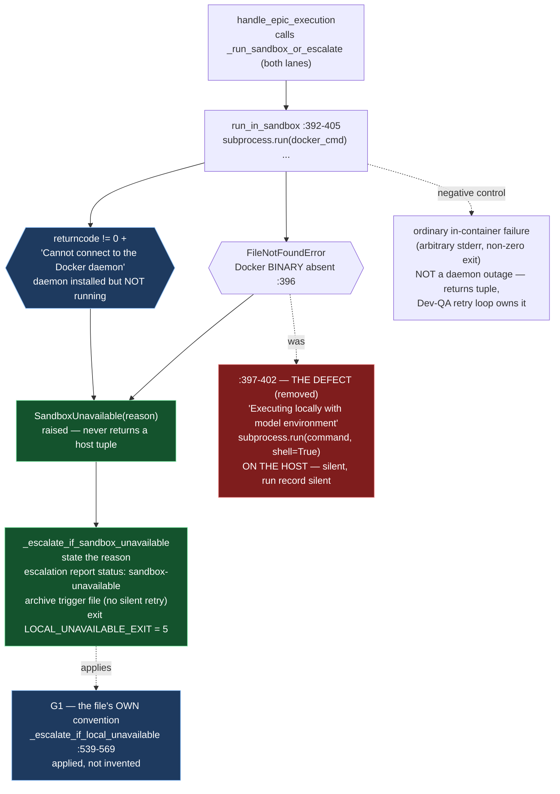

# E42.1 Execution Record — Sandbox Absence Fails Closed

## Layer, time and scope (`P11-GH-2`)

This record is written on `epic/P12-M42-E42.1`, 2026-09-01..02, from the main worktree whose
parent is `milestone/M42` at `198c789` (the merge-base and this branch's tip are the same commit —
**0 commits drift**, verified by `git rev-list --count HEAD..milestone/M42`). Its code claims are
about `bin/ai-project-orchestrator` on this branch, read directly and **run directly** (both the
pytest suite and the script's embedded `--test` suite); its history claims are from `git log`.
It says nothing about Drivr, which this epic does not touch.

## Model verification (P9-M31-E31.3 — required, this instance is manual)

Harness-reported model identity: **`deepseek-v4-flash`**. `.ai-project.yml` `models.epic_manual`:
**`remote:deepseek-v4-flash`** (read, not trusted from the starter). Both present and agree — no
mismatch to state. Proceeding under `advisory` verification (SN-40).

## The defect, re-verified by anchor (G2 — the reviewer re-measures)

The milestone spec's drift note re-pins every `bin/ai-project-orchestrator` number. Re-derived on
this branch by **searching for the code, not trusting the number**:

| Anchor — searched for | Cited (stale) | **Actual on this branch** | Found |
|---|---|---|---|
| `LOCAL_UNAVAILABLE_EXIT = 5` | `:36` | **`:41`** | yes |
| `except FileNotFoundError:` | `:392` | **`:396`** | yes |
| `subprocess.run(command, shell=True` | `:397` | **`:401`** | yes — the only `shell=True` in the file |
| `sys.exit(LOCAL_UNAVAILABLE_EXIT)` | `:565` | **`:569`** | yes |

All four anchors hold at the drift note's re-pinned numbers. The defect itself — the `:396-401`
`FileNotFoundError` → `shell=True` host fallback — was confirmed present before editing, verbatim:

```
except FileNotFoundError:
    # Fallback to local execution if Docker is not available in current environment
    print("[!] Docker is not installed or available. Executing locally with model environment...")
    env = os.environ.copy()
    env["AI_PROJECT_ACTIVE_MODEL"] = active_model
    result = subprocess.run(command, shell=True, env=env, capture_output=True, text=True)
    return result.returncode, result.stdout, result.stderr
```

## D1 — The `:396-401` fallback replaced by a fail-closed abort

The host-execution branch is **removed**; Docker-absent now raises a `SandboxUnavailable` sentinel
from `run_in_sandbox`, caught by a new wrapper at the caller, which applies the file's own G1 shape
(`_escalate_if_sandbox_unavailable`, mirroring `_escalate_if_local_unavailable` at `:539-569`):
state the reason → `generate_escalation_report(..., status="sandbox-unavailable")` → archive the
trigger file → `sys.exit(LOCAL_UNAVAILABLE_EXIT)`.

**Propagation decision (Design Decision 3 — a raised sentinel, not a distinguished return value).**
The two options the spec names were weighed. A distinguished return value (return 5 as `returncode`)
was rejected because the **validation** call site (`:461`) checks `val_code == 0` directly and does
not pass through `_escalate_if_local_unavailable` — a returned 5 there would be retried as an
ordinary task failure, and its report would falsely read as "blocked". A raised sentinel is caught
uniformly around **both** the dev and validation sandbox invocations, so whichever runs first fails
closed identically, with an accurate reason. The sentinel is raised only inside `run_in_sandbox`;
`handle_epic_execution` itself is otherwise untouched in shape.

## D2 — The opt-in decision: REMOVAL. No host-execution path survives

**Decision: the host-execution path is removed entirely. No opt-in flag, config key, or per-run
declaration survives.**

Reasoning, on the spec's own terms:

1. **Removal is an explicitly permitted, complete answer** (spec §Scope of Work 2: *"Removal is a
   permitted and complete answer"*; milestone spec: *"a surviving path must be a recorded opt-in,
   never a fallback"*).
2. **An opt-in, however carefully declared-and-recorded, is a door back to the exact disposition
   this milestone exists to close.** Binding Constraint 6 protects against *declared-but-unrecorded*
   being a fallback wearing a flag — but a *declared-and-recorded* opt-in is still a live path that
   runs a dispatched model on the operator's machine without isolation, in the first script the
   agentic lane runs through. The milestone's Hard Constraint — *the machinery under repair must not
   supervise its own repair* — weighs the same way: this epic's whole reason to be manual is that
   this path is load-bearing, and re-opening it with a flag would be the disposition wearing a
   flag, only better documented.
3. **There is no legitimate unattended need for it.** The orchestrator runs agentically, defined by
   no human present. If Docker is unavailable, the safe action is to abort and let a human decide —
   which is exactly what the abort does. A developer iterating locally has Docker (present on this
   host, `29.6.1`); the fallback was a fail-open bug, not a feature.
4. **The run-record obligation is therefore vacuous and satisfied trivially**: with no unsandboxed
   run possible, every run record is either a sandboxed run or an abort that says so. A reader never
   needs the invocation to distinguish the two — the distinction is structural.

This also means **no "declared AND recorded" opt-in shape had to be chosen**; the spec's D2
deliverable is this record of the removal decision and its reasoning, which is what the acceptance
criterion asks for (*"the opt-in's shape and reasoning are recorded in this epic's own committed
artifact"* — the shape is "none", recorded here).

## D3 — What "Docker is available" means, and the daemon-not-running case

**"Docker is available" is taken to mean: the `docker` binary is on PATH **and** the daemon is
reachable.** Detection splits into two distinct fail-closed cases:

1. **Binary absent** — `subprocess.run(docker_cmd)` raises `FileNotFoundError`. This is the narrow,
   pre-existing signal. → `SandboxUnavailable("Docker binary is not installed or available")`.
2. **Daemon installed but not running / unreachable** — the binary runs, so **no** `FileNotFoundError`;
   `docker run` exits non-zero with a stderr naming the connection failure
   (`DAEMON_NOT_RUNNING_MARKERS`). This is a **different failure** and must not be retried as an
   ordinary task failure, nor take the host path. → `SandboxUnavailable("Docker is installed but the
   daemon is not running or unreachable")`.

The marker set is deliberately narrow (`"Cannot connect to the Docker daemon"`,
`"Is the docker daemon running"`) so an ordinary in-container command failure — arbitrary stderr,
any non-zero exit — is **never** misread as a daemon outage; the negative control test pins that
(`test_ordinary_task_failure_is_not_a_daemon_outage`). The distinction is visible in the record: the
escalation report's `status: sandbox-unavailable` body carries the exact reason.

## D4 — The guards, and the falsification demonstration

Guard tests live in `tests/test_sandbox_absent_fails_closed.py` — in `tests/`, **not** the script's
embedded suite, because the milestone's stated invocation is `PYTHONPATH=. pytest -q`, and a guard
pytest does not collect is a guard the reviewer cannot see fail. The existing B2.1 sandbox-argv
guards (`tests/test_sandbox_endpoint_forwarding.py`) load the extensionless script as a module; the
new file mirrors that pattern. Five tests:

| Test | Asserts |
|---|---|
| `test_raises_sandbox_unavailable` | binary absent → `SandboxUnavailable` with the binary reason |
| `test_host_shell_path_is_never_reached` | **the guard**: Docker absent → `subprocess.run` called exactly once (the docker argv), never with `shell=True` — the host path is unreachable |
| `test_raises_with_distinct_reason` | daemon-not-running → `SandboxUnavailable` with the daemon reason |
| `test_ordinary_task_failure_is_not_a_daemon_outage` | negative control: non-zero exit + unrelated stderr is NOT a daemon outage |
| `test_docker_absent_produces_escalation_archive_and_exit5` | the full G1 shape at the caller: exit `LOCAL_UNAVAILABLE_EXIT`, escalation report `status: sandbox-unavailable`, trigger archived |

**Falsification (Hard Constraint — prove the guard by deleting it).** Temporarily replaced the
`raise SandboxUnavailable(...)` in `run_in_sandbox` with the removed host fallback (backup at
`/tmp/opencode/orchestrator-guarded.py`, restored afterwards). Result: **3 of 5 tests failed** —
`test_raises_sandbox_unavailable`, `test_host_shell_path_is_never_reached`, and
`test_docker_absent_produces_escalation_archive_and_exit5`; the captured output shows the defect
returning (`"[!] Docker is not installed or available. Executing locally with model environment..."`,
and the epic "passing" on the host). The guard was then restored; all 5 green. **A guard observed
to fail when removed.**

## Suite

`PYTHONPATH=. pytest -q` (bare `pytest` fails collection), run on `epic/P12-M42-E42.1`:
**574 passed / 0 failed**, ~34s. The baseline at this branch's tip was re-measured at
**569 passed / 0 failed** (the starter's 549 was stale — M41 epics had added tests). **Delta from
this epic: +5** (the five new guard tests), zero regressions, **no skips introduced to route around
the change**. The script's embedded suite (`python3 bin/ai-project-orchestrator --test`) remains
**19 tests, OK** — unaffected, since the host fallback removal only changes the Docker-absent path,
which the embedded suite never exercised.

## What was verified, not inherited

| Claim | How verified | Result |
|---|---|---|
| The `:396-401` fallback existed as cited | Read the file on this branch, at the drift note's re-pinned anchors | Confirmed verbatim |
| Only one `shell=True` existed | `grep -n "shell=True" bin/ai-project-orchestrator` | Exactly one, at `:401`; now removed (only a comment mentions it) |
| The two `tests/` sandbox files survive the unchanged `run_in_sandbox` signature | Full suite | Green (574) |
| `run_in_sandbox`'s signature is unchanged for existing callers | Read; `tests/test_sandbox_endpoint_forwarding.py` and `tests/integration/test_sandbox_ollama_reachability.py` call it positionally `(image, command, active_model)` | Compatible — no opt-in param was added |
| No amendment reached this branch since the branch point | `git log milestone/M42..HEAD` on the epic spec and milestone spec paths | Empty — no drift, no un-notified write |

## Scope boundaries honored

- `:476`'s `git add .` — **untouched** (E42.2's).
- `DEFAULT_MODELS` / lane-resolution block — **untouched** (M41's).
- `bin/ai-project-git-merge`, `bin/ai-project-init` — **untouched**.
- Drivr — **untouched**.
- Ordering: this epic is first; E42.2 edits the same file afterwards. No reservation of E42.2's
  region beyond not touching it.

## Structural diagram (AOG §16.3/§16.6 — Mermaid, in-repo, no ComfyUI)



**Description:** E42.1 removes the Docker-absent host fallback (`:397-402`) and fails closed with the
file's own G1 convention: a `SandboxUnavailable` sentinel from `run_in_sandbox` is caught by the
caller and routed through the escalation-plus-archive-plus-exit-5 shape `_escalate_if_local_unavailable`
already applies (`:539-569`). "Docker is available" is defined as binary-present **and** daemon-
reachable; the two distinct failures — binary absent (`FileNotFoundError`) and daemon installed-but-
not-running (non-zero exit + connection marker in stderr) — each fail closed with their own stated
reason, and an ordinary in-container failure is pinned by negative control to NOT be misread as a
daemon outage. No host-execution opt-in survives (the epic's recorded decision): the run record
distinguishes a sandboxed run from an abort by construction.

## Changelog

| Version | Date | Change |
|---|---|---|
| 1.0.0 | 2026-09-02 | Initial record. D1: `:396-401` fallback removed, fail-closed abort applied (sentinel + caller escalation). D2: host-execution path removed entirely — no opt-in survives, reasoning recorded. D3: "Docker is available" defined (binary + daemon); daemon-not-running handled as its own fail-closed case. D4: five guard tests in `tests/` (pytest-collected), falsification demonstrated (3 of 5 fail with the abort removed), guard restored. Suite 574 passed / 0 failed (baseline 569, +5). |